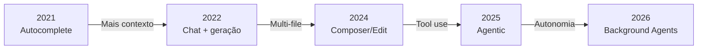
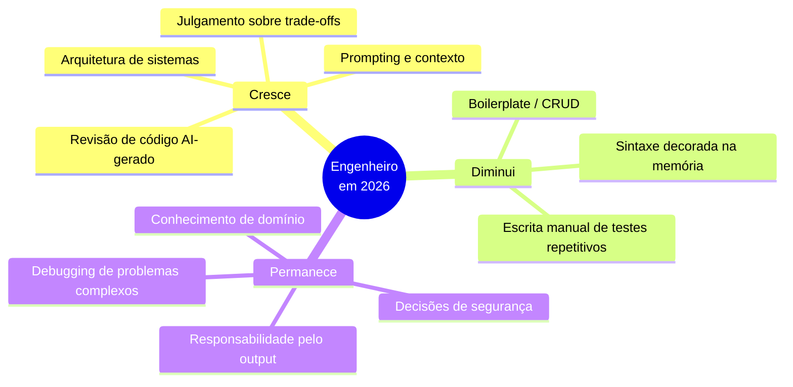
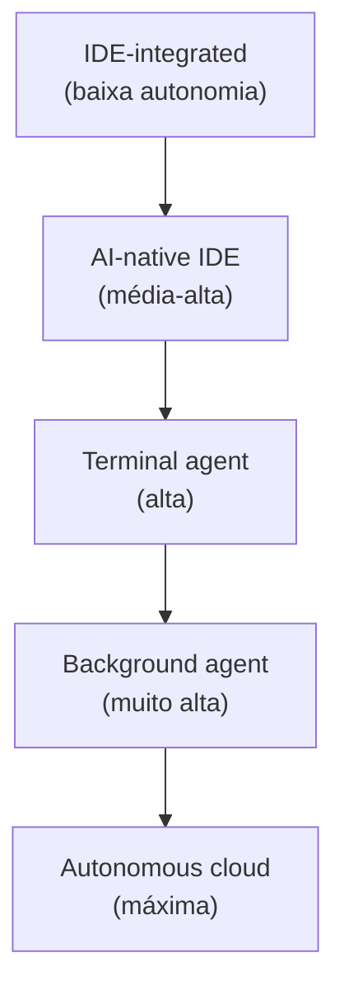

# De autocomplete a agentes autônomos

> [!abstract] TL;DR
> Em cinco anos (2021-2026), ferramentas de IA para código passaram de autocomplete de uma linha (Copilot v1) para agentes autônomos que planejam, executam, testam e iteram sobre codebases inteiros ([[Dicionário de IA#Claude Code|Claude Code]], Devin). A evolução se deu em quatro estágios: sugestão → assistência → copiloto → agente. Cada estágio mudou o papel do engenheiro — de escritor de código para arquiteto e revisor de mudanças geradas por IA. O centro de gravidade do trabalho se deslocou: de *digitação* para *direção*. Em 2026, 79% das empresas declaram ter adotado agentes — mas apenas 11% os rodam em produção, revelando que explorar e produtizar são dois problemas completamente diferentes.

## O que é

Imagine que você contratou um assistente. No primeiro dia, ele só digita o que você dita. No segundo, começa a sugerir frases. No terceiro, redige parágrafos inteiros se você descrever a ideia. No quarto, você diz "escreva o relatório do mês" e ele entrega o documento pronto para revisão. No quinto, você o contrata como freelancer: manda a tarefa por e-mail, ele trabalha enquanto você dorme, e de manhã o PR está na sua fila.

Essa é a evolução das ferramentas de IA para código em quatro estágios — e em cada um deles, o que muda não é só *o que a ferramenta faz*, mas *o que o engenheiro precisa fazer*.

| Estágio         | Período   | O que faz                                          | Exemplo                                              |
| --------------- | --------- | -------------------------------------------------- | ---------------------------------------------------- |
| **Sugestão**    | 2021-2022 | Completa a linha atual                             | Copilot v1, TabNine                                  |
| **Assistência** | 2022-2023 | Responde perguntas, gera blocos                    | ChatGPT, Copilot Chat                                |
| **Copiloto**    | 2023-2025 | Edita múltiplos arquivos sob supervisão            | [[Dicionário de IA#Cursor\|Cursor]] Composer, Copilot Workspace  |
| **Agente**      | 2025-2026 | Planeja e executa tarefas multi-step autonomamente | [[Dicionário de IA#Claude Code\|Claude Code]], Devin, Cursor Agent |

## Por que importa

Entender essa evolução é necessário para saber o que esperar (e não esperar) de cada tipo de ferramenta, escolher a ferramenta certa para cada fase do trabalho, e não tratar agentes como autocomplete (subutilização) nem autocomplete como agente (frustração).

Mas há uma razão mais profunda: essa evolução mudou o que significa ser um bom engenheiro. Não basta mais escrever código limpo — é preciso saber *dirigir* sistemas que escrevem código. Essa habilidade não é automática e não vem grátis com a assinatura da ferramenta.

> [!info] A lacuna entre adotar e produtizar
> Em 2026, 79% das empresas declararam ter adotado AI agents — mas apenas 11% os rodam em produção. Uma lacuna de 68 pontos percentuais que revela que *explorar* e *produtizar* são dois problemas completamente diferentes. O gargalo não é acesso à ferramenta: é cultura de revisão, confiança no output e integração com CI/CD. A maioria das empresas usa agentes em PoCs isolados; pouquíssimas têm pipelines de avaliação, guardrails de segurança e processos de revisão maduros o suficiente para confiar no output em produção.

Esse número diz algo importante sobre onde a indústria está: a fase atual não é de *adoção* — é de *maturidade*. As empresas que estão vencendo não são as que adotaram mais cedo, mas as que construíram os processos necessários para confiar no output dos agentes.

Os bloqueadores mais comuns para sair dos 79% para os 11%: ausência de processo de code review para output AI-gerado, falta de evals que detectem regressões introduzidas por agentes, cultura organizacional que trata qualquer erro do agente como razão para abandonar a ferramenta (em vez de como dados para melhorar o processo), e dependência de aprovação humana em cada passo mesmo para tarefas onde o risco é baixo. O caminho dos 11% passa por resolver esses problemas sistematicamente, não por esperar que os modelos fiquem mais confiáveis.

## Como funciona

### A progressão da autonomia

**O que mudou em cada transição:**

1. **Sugestão → Assistência:** O modelo ganhou contexto conversacional. Em vez de completar uma linha, podia receber uma pergunta e gerar blocos de código. A mudança prática: o desenvolvedor parou de aceitar/rejeitar completamentos e começou a *conversar* com a ferramenta.
2. **Assistência → Copiloto:** O modelo ganhou acesso a múltiplos arquivos e capacidade de editar diretamente o código-fonte com diffs reviewáveis. A mudança prática: o desenvolvedor parou de copiar código do chat para o editor e passou a revisar diffs aplicados diretamente.
3. **Copiloto → Agente:** O modelo ganhou **[[Dicionário de IA#tool use|tool use]]** — pode executar comandos no terminal, ler arquivos, rodar testes, e iterar baseado nos resultados. A mudança prática: o desenvolvedor parou de executar comandos manualmente entre as sugestões do modelo e passou a observar o agente executando o loop completo.
4. **Agente → Background Agent:** O agente pode trabalhar de forma assíncrona enquanto o humano faz outra coisa, reportando resultados quando pronto. A mudança prática: o desenvolvedor parou de supervisionar o loop em tempo real e passou a revisar resultados quando o agente termina — como revisar um PR.

### Os habilitadores técnicos — por que agora e não antes?

> [!question]- Por que essa evolução aconteceu exatamente entre 2021 e 2026?

Não foi uma evolução linear de "modelos maiores". Cada transição de estágio exigiu um habilitador técnico específico — e entender isso ajuda a prever o que vem a seguir.

**Scale + Codex (2021) → Sugestão**

A OpenAI treinou o Codex em 54 bilhões de tokens de código do GitHub — um volume que nenhum sistema anterior tinha visto. Escala, não arquitetura nova, foi o diferencial. Copilot v1 era literalmente um autocomplete estatístico muito bem calibrado: dado o prefixo do código, qual token vem a seguir? A qualidade era boa o suficiente para completar uma linha, mas o modelo não "entendia" a intenção — ele reconhecia padrões de código que humanos escrevem.

**RLHF + Instrução (2022-2023) → Assistência**

O InstructGPT (e depois o ChatGPT) adicionou fine-tuning com feedback humano (RLHF), ensinando o modelo a *seguir instruções* — não apenas completar padrões. Isso foi uma mudança qualitativa: o modelo passou de "completar código" para "responder perguntas sobre código". Pela primeira vez era possível dizer "explica por que esse código está errado" e receber uma resposta útil — não apenas um completamento sintático.

A diferença prática: o Copilot v1 respondia "o que vem depois?". O ChatGPT respondia "o que você quer fazer?". Essa mudança de framing — de completamento passivo para diálogo ativo — foi o que tornou viável usar IA como ferramenta de *aprendizado* além de *produção*. Pela primeira vez, um engenheiro júnior podia perguntar "por que essa abordagem é problemática?" e receber uma explicação compreensível.

**Janelas de contexto longas (2023-2024) → Copiloto**

Processar múltiplos arquivos exige contexto. GPT-4 chegou com 32k tokens; Claude com 100k; em 2024, modelos com 200k+ tornaram viável passar dezenas de arquivos de um codebase em um único prompt. Isso foi o que tornou possível o modo Composer do Cursor: em vez de trabalhar num arquivo de cada vez, o modelo podia "ver" o projeto inteiro e fazer edições consistentes entre arquivos.

**Tool use via API (2024) → Agente**

A Anthropic lançou [[Dicionário de IA#tool use|tool use]] (function calling) em 2024, e Claude 3.5 demonstrou confiabilidade suficiente para usar ferramentas em loop. O ciclo ficou fechado: o modelo lê um arquivo → gera código → executa no terminal → lê o erro → corrige → re-executa. Sem intervenção humana a cada passo. Isso não é uma melhoria incremental — é uma mudança de modo de operação.

O detalhe crítico é a palavra "confiabilidade". Tool use como conceito existia antes (GPT-4 já tinha function calling em 2023), mas a frequência com que modelos anteriores erravam na chamada de ferramentas — parâmetros errados, sequência errada, parar antes de concluir — tornava o loop agentic frágil demais para uso prático. Claude 3.5 foi o primeiro modelo onde tool use ficou confiável o suficiente para loops longos sem supervisão constante.

**Execução headless + paralela (2025-2026) → Background Agent**

Com agentes confiáveis o suficiente, o passo seguinte foi remover a dependência de uma sessão interativa. Background agents rodam em sandboxes cloud, sem STDIN/STDOUT do usuário, e reportam assincronamente via PR ou webhook. A habilitação não foi técnica — foi de confiança: os agentes ficaram bons o suficiente para trabalhar sem supervisão por horas.

> [!summary] Cada estágio precisou de um habilitador técnico distinto — não apenas modelos maiores, mas capacidades arquiteturais novas: RLHF, contexto longo, tool use, execução headless.

### O que muda no papel do engenheiro

> [!question]- Mas se o agente escreve o código, o que o engenheiro faz?

A cada estágio de autonomia, o centro de gravidade do trabalho se desloca. No estágio de sugestão, o engenheiro ainda escreve 95%+ do código — a IA só acelera a digitação. No estágio de agente, esse número cai para menos de 20%: o engenheiro define a intenção, valida o plano, revisa o output e responde por decisões de arquitetura.

Pesquisadores descrevem essa função emergente como *intent architect*: menos implementador, mais orquestrador e auditor de resultado. Em 2026, [[Dicionário de IA#orchestrator-worker|multi-agent orchestration]] começou a ganhar tração — agentes especializados (Planner, Architect, Implementer, Test, Reviewer) operando em paralelo, coordenados pelo engenheiro humano que gerencia o fluxo, não escreve os blocos.

> [!summary] O shift fundamental: de *digitação* para *direção*.

### O risco do deskilling

Há um efeito colateral que raramente aparece nas análises de produtividade: o *deskilling*. Quando você delega a escrita de código rotineiramente, perde prática nas habilidades de baixo nível que formam a intuição de debugging. Um engenheiro que nunca escreveu um algoritmo de ordenação do zero tem mais dificuldade para reconhecer quando um agente gerou uma versão quadrática onde caberia linear.

O paradoxo é que as habilidades que você mais delega são as mesmas que você precisa para revisar bem o output que foi delegado. Um engenheiro que para de escrever código começa a perder a capacidade de saber quando o código gerado está errado de formas sutis — não erros de sintaxe, mas erros de design: acoplamento desnecessário, abstrações no lugar errado, ausência de tratamento de erro em bordas.

A resposta não é evitar agentes — é manter uma prática deliberada de *escrever código sem assistência* em problemas que você escolhe por aprendizado, separado dos problemas que você delega por produtividade. A mesma distinção que médicos residentes fazem: você usa toda a tecnologia disponível em situações de risco, mas pratica procedimentos manualmente para não perder a competência.

Um sinal concreto de deskilling que vale monitorar: você consegue estimar, antes de pedir ao agente, quanto tempo levaria para escrever aquele código manualmente? Se a estimativa ficou difícil — se você não sabe mais se a tarefa é de 30 minutos ou 3 horas — você perdeu calibração. Essa calibração é o que permite saber se o agente entregou rápido porque a tarefa era fácil ou porque tomou atalhos que vão virar problema depois.

Outro sinal: você consegue explicar, linha a linha, por que o agente fez cada escolha no código que gerou? Se há blocos que você aprovaria sem entender, o [[Dicionário de IA#Comprehension gate|comprehension gate]] deveria ter sido aplicado antes — não depois de commitar.

### Quais competências mudam — e quais ficam?

**Por nível de senioridade:**

- **Júnior:** deixa de escrever boilerplate para *verificar output de IA*. O risco real é o deskilling — perder a prática de escrever código do zero, que é o que constrói a intuição necessária para revisar código gerado. Um júnior que nunca escreveu um loop manualmente tem dificuldade para reconhecer quando o agente gerou um loop incorreto.
- **Sênior:** deixa de implementar para *arquitetar sistemas e dirigir agentes*. Os top 20% de engenheiros fluentes em IA operam como "fábricas de software de uma pessoa" — escopo que antes exigiria um time de 3-5. O gargalo passa a ser julgamento arquitetural, não velocidade de digitação.
- **O que não muda:** arquitetura de sistemas, julgamento sobre trade-offs de segurança/performance, conhecimento de domínio, e — criticamente — *responsabilidade*. O agente não é dono do código que gerou. O engenheiro que aprovou o PR é.

Uma forma de enquadrar essa transição: no passado, a questão era "o engenheiro consegue escrever esse código?". Hoje, a questão é "o engenheiro consegue reconhecer se o código gerado está certo?". São habilidades relacionadas mas não idênticas — e a segunda exige um nível de compreensão do domínio que a IA não substitui.

O que permanece constante em todos os estágios: a necessidade de saber *o que* construir, não apenas *como* construir. Agentes são excepcionalmente bons em "como" quando o "o quê" está claramente definido. Toda a habilidade de arquitetura — decompor um problema em partes, definir interfaces, escolher trade-offs — permanece essencialmente humana. O que muda é que você gasta mais tempo nessa parte e menos tempo na digitação.

### O que faz uma boa tarefa para delegar

Não toda tarefa se beneficia de delegação a um agente. As melhores candidatas compartilham algumas características:

- **Critério de sucesso verificável:** existe uma forma objetiva de saber se o agente acertou (testes passam, lint passa, diff é reviewável). Tarefas cujo sucesso depende de julgamento subjetivo ("melhore a arquitetura desse módulo") são arriscadas porque o agente não consegue saber quando parar.
- **Contexto auto-contido:** toda a informação necessária está no repositório ou pode ser fornecida no prompt. Tarefas que dependem de conhecimento tácito da equipe ("o jeito que a gente faz aqui") exigem que esse conhecimento esteja documentado antes de delegar.
- **Impacto reversível:** o output vai para uma branch, um arquivo, um PR — não para produção diretamente. Se o agente errar, o custo é o tempo de revisar e descartar, não um incidente de produção.
- **Baixa ambiguidade:** o que "pronto" significa é claro. Tarefas ambíguas geram output que é tecnicamente plausível mas não é o que você queria — e você só descobre depois de muito trabalho.

As piores candidatas para delegação direta: decisões de arquitetura (o agente pode implementar qualquer decisão, mas escolher entre duas é julgamento humano), debugging de problemas intermitentes (o agente não consegue reproduzir races e timing issues facilmente), e qualquer coisa onde o critério de sucesso é "parece certo para alguém que conhece o domínio".

### O que configura um agente eficaz

Agentes não são mágica — são contexto + modelo. O modelo você não controla (a não ser escolhendo qual usar); o contexto você controla completamente. A diferença entre um agente que gera código útil e um que gera lixo plausível é, em grande parte, quanta informação relevante sobre o projeto está disponível para ele antes de começar.

As ferramentas modernas têm mecanismos para isso: `CLAUDE.md` no Claude Code, `.cursorrules` no Cursor, `AGENTS.md` para agentes genéricos. Esses arquivos descrevem as convenções do projeto — linguagem, framework, padrões de teste, estrutura de diretórios, decisões arquiteturais importantes. Um agente que lê um bom `CLAUDE.md` antes de começar evita erros que custam horas de debugging: não usa o framework errado, não cria arquivos no lugar errado, não ignora as convenções de nomenclatura.

O conteúdo mais valioso nesses arquivos não é o óbvio ("usamos TypeScript") — é o não-óbvio: workarounds para bugs de terceiros, razões históricas para decisões que parecem estranhas, padrões de segurança específicos do contexto regulatório do produto. Qualquer coisa que você explicaria para um novo membro do time no primeiro dia de onboarding é candidato a estar no `CLAUDE.md`.

Outra camada de configuração é o [[Dicionário de IA#Comprehension gate|comprehension gate]]: antes de executar, o agente recita o que entendeu da tarefa com as próprias palavras. Se o recital está errado, você corrige antes de gastar tokens executando. Parece burocracia, mas é o mecanismo que evita uma hora de trabalho na direção errada. Em tarefas complexas, pedir ao agente para apresentar um plano antes de executar (não apenas o entendimento, mas a sequência de passos) permite detectar problemas antes de qualquer mudança no código.

### Background agents — o quinto estágio

Um [[Dicionário de IA#background agent|background agent]] não bloqueia o desenvolvedor esperando resposta. Você delega uma tarefa ("refatora o módulo de autenticação para usar JWT"), o agente trabalha em segundo plano por minutos ou horas, e notifica quando termina — como um colega assíncrono.

A diferença de fluxo de trabalho é significativa: é possível despachar 3-5 tarefas em paralelo e revisar os PRs gerados quando estiver livre. Ferramentas como [[Dicionário de IA#Claude Code|Claude Code]] (no modo headless), Devin e Copilot Workspace já operam nesse modo.

O risco é proporcional à autonomia: perda de supervisão granular e maior custo por tarefa delegada. Background agents são o nível em que o [[Dicionário de IA#Comprehension gate|comprehension gate]] se torna mais crítico — sem ele, o agente pode trabalhar horas na direção errada, gerando um PR que passa nos testes mas implementa a feature errada.

O padrão emergente em 2026 é o [[Dicionário de IA#PR-driven workflow|PR-driven workflow]]: o background agent entrega seu trabalho como pull request com diff e descrição, e o ponto de controle humano acontece na revisão do PR — reaproveita a infraestrutura de code review existente sem criar um novo processo.

Uma prática importante com background agents é o "check-in point": em vez de delegar a tarefa inteira de uma vez, divida em fases com entregáveis intermediários. "Primeiro analise o código e liste os arquivos que precisam mudar, depois implemente". Isso permite corrigir o rumo no meio sem jogar fora horas de trabalho. Agentes assíncronos que trabalham em fases pequenas e reportam são mais robustos do que agentes que tentam resolver tudo de uma vez.

### Por que o modelo importa tanto quanto a ferramenta

Uma confusão comum: avaliar a ferramenta sem considerar o modelo que a alimenta. Cursor e Claude Code são ferramentas; Claude 3.5/4.x, GPT-4o, Gemini 2.x são os modelos que executam o raciocínio. Ferramentas diferentes com o mesmo modelo produzem resultados parecidos; a mesma ferramenta com modelos diferentes pode produzir resultados radicalmente distintos.

O que varia por modelo nas tarefas de codificação:
- **Seguimento de instrução:** modelos mais fortes respeitam melhor restrições como "não modifique arquivos fora da pasta X" ou "não instale dependências sem perguntar primeiro".
- **Confiabilidade de tool use:** a frequência com que o modelo erra na chamada de ferramentas (parâmetros errados, loops prematuros) varia muito entre modelos e determina se o loop agentic é prático.
- **Janela de contexto efetiva:** a janela *nominal* (200k tokens) e a janela *efetiva* (onde o modelo realmente mantém acurácia) são diferentes. Modelos com contexto longo nominal mas efetivo curto perdem instruções no meio de sessões longas.

Em 2026, as ferramentas mais flexíveis (Claude Code, OpenCode, Aider) permitem escolher o modelo explicitamente. Isso virou uma habilidade de configuração relevante: para debugging exploratório, modelos com thinking/reasoning (Claude 4 Sonnet com extended thinking, o3) funcionam melhor; para execução de tarefas bem definidas, modelos mais rápidos e baratos são suficientes.

### Categorias de ferramentas em 2026

| Categoria                    | Interface          | Autonomia   | Exemplos                                              |
| ---------------------------- | ------------------ | ----------- | ----------------------------------------------------- |
| **IDE-integrated assistant** | Dentro do editor   | Baixa-média | Copilot inline, Cursor Tab                            |
| **AI-native IDE**            | Editor customizado | Média-alta  | [[Dicionário de IA#Cursor\|Cursor]], Windsurf                         |
| **Terminal agent**           | CLI/TUI            | Alta        | [[Dicionário de IA#Claude Code\|Claude Code]], OpenCode, [[Dicionário de IA#Aider\|Aider]] |
| **Autonomous agent**         | Cloud sandbox      | Muito alta  | Devin, Copilot Agents                                 |
| **Open-source harness**      | CLI                | Variável    | OpenCode, Cline, [[Dicionário de IA#Aider\|Aider]]                   |

### O que cada categoria faz bem

| Tarefa                       | IDE assistant | AI IDE | Terminal agent | Autonomous |
| ---------------------------- | ------------- | ------ | -------------- | ---------- |
| Autocomplete rápido          | ★★★★★         | ★★★★   | ★★             | ★          |
| Edição de 1 arquivo          | ★★★★          | ★★★★★  | ★★★★           | ★★★        |
| Refactoring multi-file       | ★★            | ★★★★★  | ★★★★           | ★★★★       |
| Feature do zero              | ★             | ★★★★   | ★★★★           | ★★★★★      |
| Debugging complexo           | ★★            | ★★★★   | ★★★★★          | ★★★        |
| Tarefas repetitivas em massa | ★             | ★★★    | ★★★            | ★★★★★      |

## Casos práticos

Para escolher a ferramenta certa, o critério principal é a combinação de dois eixos: **risco** (o que acontece se o agente errar?) e **contexto** (o agente tem informação suficiente para não errar?). Quanto maior o risco, mais supervisão; quanto menos contexto disponível, mais interação humana é necessária antes de delegar.

Uma forma prática de pensar: imagine que você está delegando para um colega humano. Se você delegaria a tarefa para um júnior sem explicação, um agente pode fazer também. Se você precisaria sentar ao lado do júnior para orientar, use um terminal agent interativo. Se você nunca delegaria porque o risco é alto demais, não delegue ao agente — ou configure um processo de revisão equivalente a estar presente.

**Cenário 1 — Bug de produção crítico**

Um erro de memória está derrubando o serviço de pagamentos às 3h. Você quer diagnóstico rápido, mas não pode delegar e dormir — o risco é alto demais. A escolha certa é um *terminal agent* como [[Dicionário de IA#Claude Code|Claude Code]]: alta autonomia, mas você supervisiona cada iteração. O agente lê os logs, traça o stack trace, propõe o patch e roda os testes — você aprova antes de cada mudança. Um background agent seria perigoso aqui (você não estaria presente); um autocomplete seria inútil (o problema é cross-file).

**Cenário 2 — Migração de 200 arquivos de configuração**

Seu time precisa migrar um sistema legado de YAML para TOML — 200 arquivos, regras mecânicas e repetitivas, sem lógica de negócio envolvida. Aqui um *autonomous agent* ou background agent é a escolha certa: a tarefa é volumosa, determinística e de baixo risco. Você descreve o padrão de transformação, delega, e revisa o PR gerado. Um terminal agent interativo custaria horas de supervisão desnecessária.

**Cenário 3 — Nova feature com contexto de domínio rico**

Você precisa implementar um módulo de notificações que integra com 4 serviços internos, cada um com suas peculiaridades. Aqui o *AI-native IDE* ([[Dicionário de IA#Cursor|Cursor]], Windsurf) brilha: você está presente, navega o código junto com o agente, e o contexto do editor ajuda o modelo a entender as convenções do projeto. Um terminal agent sem `CLAUDE.md` bem configurado perderia esse contexto; um IDE assistant não teria autonomia para editar múltiplos arquivos.

**Cenário 4 — Code review de um PR grande**

Um PR com 800 linhas chegou na sua fila. Você pode pedir a um *terminal agent* para fazer o review — ele lê o diff completo, identifica problemas de lógica, edge cases e inconsistências de estilo. O output é um comentário estruturado que você usa como base para o review humano, não como substituto. A ferramenta certa aqui não é um autonomous agent (que codificaria uma solução, não revisaria) nem um autocomplete (sem contexto do diff inteiro).

**Cenário 5 — Escrita de testes para código legado**

Um módulo crítico de 3.000 linhas não tem cobertura de testes. Escrever testes manualmente levaria dias; delegar a um background agent é arriscado (o código tem side effects obscuros que precisam ser entendidos antes de mockar). O melhor fluxo: terminal agent para exploração inicial (o agente lê o código e gera um relatório de side effects e dependências), depois AI-native IDE para escrever os testes com você presente, validando cada asserção.

> [!tip] Assista: Andrej Karpathy — From Vibe Coding to Agentic Engineering
> **Canal:** Sequoia Capital | **Duração:** ~30min | **Idioma:** EN
>
> Karpathy narra em primeira pessoa o inflection point de dezembro 2024 — quando o modelo parou de errar e ele simplesmente parou de corrigir. A partir daí, ele articula o framework Software 1.0/2.0/3.0: programar virou prompting, e o contexto substituiu o código como alavanca sobre o sistema. O arco do vídeo espelha exatamente a progressão desta nota — de autocomplete a engenheiro agentic — com a vantagem de vir de quem ajudou a construir a infraestrutura que tornou isso possível. Trecho de destaque [2:03]: *"Things have changed fundamentally — especially on this agentic coherent workflow that really started to actually work."*
>
> 🎬 [Assistir no YouTube](https://www.youtube.com/watch?v=96jN2OCOfLs)

## Histórico

| Ano  | Marco                      | Impacto                                                                      |
| ---- | -------------------------- | ---------------------------------------------------------------------------- |
| 2021 | GitHub Copilot (preview)   | Primeiro autocomplete AI mainstream; Codex treinado em 54B tokens de código do GitHub |
| 2022 | ChatGPT lançado            | RLHF habilita seguimento de instrução; LLMs passam a gerar e *explicar* código via chat |
| 2023 | GPT-4 + Cursor v1          | Multi-file editing viável; janelas de 32k+ tokens permitem passar múltiplos arquivos |
| 2024 | Claude 3.5 + Tool use      | [[Dicionário de IA#tool use\|Tool use]] fecha o ciclo agentic; Devin é anunciado como "primeiro engenheiro de software AI" |
| 2025 | Claude Code GA, Devin GA   | [[Dicionário de IA#Coding agent\|Agentes autônomos]] entram em produção; terminal agents viram workflow padrão |
| 2026 | Background agents, [[Dicionário de IA#MCP (Model Context Protocol)\|MCP]] | Agentes assíncronos; MCP standardiza integração com ferramentas; 85% dos devs usam AI regularmente |

O padrão que emerge olhando essa linha do tempo: as primeiras transições (2021-2023) foram habilitadas por *escala e alinhamento* — modelos maiores treinados com feedback humano. As transições mais recentes (2024-2026) foram habilitadas por *capacidades arquiteturais* — tool use, contexto longo, execução headless. O próximo estágio provavelmente exigirá um novo habilitador: raciocínio mais confiável e custo de inferência suficientemente baixo para que agentes possam trabalhar em tarefas longas sem um humano gerenciando o orçamento de tokens.

Outro padrão: cada estágio foi inicialmente superestimado e depois subestimado. Em 2022, analistas previam que autocomplete substituiria programadores em 2 anos. Em 2024, os mesmos analistas declararam que agentes "ainda não chegaram lá". Em 2026, com agentes em produção em centenas de empresas, o consenso ficou mais calibrado: agentes não substituem engenheiros, mas engenheiros que usam agentes bem substituem engenheiros que não usam.

**Open-source vs comercial — uma divisão real**

Uma distinção que o histórico torna clara: as ferramentas comerciais (Copilot, Cursor, Devin) investiram em experiência de usuário, integração com IDEs existentes e confiabilidade para o mercado corporativo. As ferramentas open-source ([[Dicionário de IA#Aider|Aider]], Continue, OpenCode) investiram em flexibilidade de modelo, transparência e customização. Em 2026, as duas famílias coexistem: comercial domina o enterprise; open-source domina o desenvolvedor individual que quer controle total. [[Dicionário de IA#Claude Code|Claude Code]] é um caso interessante — é comercial mas com filosofia de terminal e extensibilidade, o que o coloca entre os dois mundos.

## Armadilhas

> [!warning] Tratar agentes como autocomplete
> Pedir para um [[Dicionário de IA#Claude Code|Claude Code]] "completar essa linha" é como usar um caminhão para ir à padaria. Agentes têm overhead de cold start (tool use, planning, iterações) que torna inviável usá-los para tarefas de segundos. Use a ferramenta certa para a escala do problema.

> [!warning] Tratar autocomplete como agente
> Esperar que Copilot inline resolva um bug cross-file é frustração garantida. IDE assistants trabalham no contexto imediato — um arquivo, um bloco. Para problemas que cruzam módulos, você precisa de no mínimo um copiloto.

> [!warning] "A ferramenta mais nova é sempre melhor"
> Para autocomplete rápido, Copilot inline ainda é imbatível. Agentes adicionam latência e custo que não fazem sentido para tarefas simples. A evolução do mercado não torna as ferramentas anteriores obsoletas — ela amplifica o custo de usar a errada.

> [!warning] Ignorar a curva de aprendizado
> Cada ferramenta tem configurações e padrões que multiplicam sua eficácia. Usar [[Dicionário de IA#Claude Code|Claude Code]] sem `CLAUDE.md` ou [[Dicionário de IA#Cursor|Cursor]] sem `.cursorrules` é operar a 20% da capacidade. O investimento de configurar o contexto retorna em todas as sessões seguintes.

> [!warning] Confundir latência com autonomia — o nível mínimo suficiente
> Um terminal agent pode levar 30-120 segundos para completar uma tarefa simples (cold start + tool calls + iterações); um background agent pode levar horas. Para uma correção de typo num comentário, isso é overkill que custa tempo e dinheiro. Regra prática: use o nível de autonomia *mínimo suficiente* para a tarefa — não o máximo disponível.

> [!warning] Delegar sem contexto de domínio
> Agentes autônomos falham silenciosamente quando não têm contexto suficiente. "Adicione autenticação ao sistema" gera código sintaticamente correto mas funcionalmente errado se o agente não souber que seu sistema usa OAuth2 com claims customizados. Investir em `CLAUDE.md`, `.cursorrules` e arquivos de especificação não é burocracia — é o que transforma o agente de "júnior que precisa de tudo explicado" em "sênior que já sabe o contexto".

> [!warning] Confundir velocidade com qualidade
> Agentes geram código rápido — mas rápido não é o mesmo que correto. O feedback loop de "gerou, funcionou na demo, commitou" esconde problemas que aparecem semanas depois: falta de tratamento de erros, ausência de logs, acoplamento implícito entre módulos. A velocidade de geração não reduz a necessidade de revisão — ela aumenta o volume que precisa ser revisado com o mesmo nível de cuidado.

## Quando agentes falham — padrões recorrentes

Agentes de codificação falham de maneiras previsíveis. Reconhecer esses padrões antes de acontecer economiza horas de debugging pós-falha.

**Falha 1 — Deriva silenciosa (context rot)**

O agente começa com o contexto correto mas, ao longo de muitas iterações, acumula informações incorretas, tentativas fracassadas e premissas erradas no histórico da sessão. A qualidade do output degrada progressivamente sem avisar. O sintoma: o código começa a fazer sentido mas, após 10-15 iterações, começa a parecer "estranho" — inconsistente com o que foi combinado no início.

A solução não é ter mais contexto — é ter contexto limpo. Reiniciar a sessão periodicamente com um summary do estado atual é mais eficaz do que continuar numa sessão longa e degradada.

**Falha 2 — Alucinação de API**

O agente gera código que usa métodos, parâmetros ou módulos que não existem na versão da biblioteca que você está usando. O código parece plausível, compila, mas falha em runtime com `AttributeError` ou equivalente. Esse padrão é mais comum com bibliotecas menos representadas no training data (versões recentes, libs niche) e com APIs que mudaram muito entre versões.

A mitigação: sempre fornecer no contexto a versão exata das dependências e, se possível, exemplos de uso da documentação oficial. Um `CLAUDE.md` com `"usamos requests 2.31.0, não use httpx"` elimina esse padrão.

**Falha 3 — Implementação que passa nos testes mas falha no requisito**

O agente gera código que passa em todos os testes mas implementa uma interpretação levemente diferente do que você pediu. Acontece quando o pedido foi ambíguo e o agente escolheu a interpretação mais simples (não necessariamente a correta). Os testes passam porque também foram escritos com base na mesma interpretação ambígua.

A solução é o [[Dicionário de IA#Comprehension gate|comprehension gate]]: antes de implementar, peça ao agente para recitar o que entendeu do requisito com exemplos concretos. Se o exemplo que ele cita é diferente do que você imaginou, você corrige antes de começar a execução.

**Falha 4 — Refactoring que quebra invariantes não documentadas**

O agente faz um refactoring tecnicamente correto — remove duplicação, extrai uma abstração, simplifica uma condição — mas quebra uma invariante que existia no código original por razão não óbvia (um workaround para um bug de terceiro, uma condição de race que o código original evitava implicitamente). O código fica mais bonito mas errado.

Esse padrão é especialmente traiçoeiro em código legado. Documentar invariantes não-óbvias em comentários, ou mencionar explicitamente ao agente que "este código tem workarounds que não devem ser removidos sem análise", reduz a incidência.

## Como explicar em inglês

Em inglês, o vocabulário desta área tem nuances importantes. "Coding agent" é o termo mais neutro e aceito; "autonomous agent" carrega a conotação de maior independência; "copilot" (com ou sem maiúscula) virou genérico para qualquer assistente AI de código, embora o produto da Microsoft se chame GitHub Copilot.

Em contextos de entrevista técnica em inglês, vale a pena conhecer a distinção entre os termos: "AI-assisted coding" é o guarda-chuva; "agentic coding" ou "autonomous coding" implica que o AI age por conta própria (não apenas responde); "vibe coding" é o termo (frequentemente crítico) para delegação excessiva e irresponsável.

| Português | Inglês | Notas |
|-----------|--------|-------|
| Agente de codificação | Coding agent | Termo técnico padrão |
| Agente autônomo | Autonomous agent | Implica maior independência |
| Autocomplete | Autocomplete / Code completion | "Code completion" é mais formal |
| Copiloto | Copilot / AI pair programmer | "Copilot" virou genérico |
| Assistente de código | Code assistant | |
| Agente em segundo plano | Background agent | Termo emergente em 2026 |
| Uso de ferramentas | Tool use | Termo técnico da API |
| Loop agêntico | Agentic loop | |
| Arquiteto de intenção | Intent architect | Termo acadêmico (2026) |
| Engenharia agêntica | Agentic engineering | |
| Revisão de PR | PR review / Code review | |
| Fluxo orientado a PR | PR-driven workflow | |
| Habilitador técnico | Technical enabler | |

> [!tip] Como falar sobre isso em entrevista
> "AI coding tools evolved from single-line autocomplete to autonomous agents that can plan, implement, test, and iterate across entire codebases with minimal human intervention. The key shift is from the engineer as code *writer* to the engineer as *intent architect* — directing agents, reviewing output, and making architectural decisions. The main challenge today isn't access to these tools — it's building the review culture and evaluation pipelines needed to trust them in production."
>
> Se perguntarem sobre limitações: "The hardest part is not the tool — it's knowing when to trust the output and when to push back. Agents hallucinate APIs, miss edge cases, and can work for hours in the wrong direction if not given good context upfront."

## O que vem a seguir

Esta nota estabelece o mapa da evolução — os quatro estágios e as cinco categorias de ferramentas. O próximo passo natural é entender a tensão entre velocidade e disciplina que essa evolução criou: a tentação do [[Dicionário de IA#vibe coding|vibe coding]] (delegar tudo ao agente sem entender o output) versus a engenharia disciplinada que mantém o controle.

Depois disso, o mecanismo concreto que evita delegação cega: o [[Dicionário de IA#Comprehension gate|comprehension gate]] — o checkpoint que força o agente a demonstrar entendimento antes de executar.

Quando você souber o que cada ferramenta faz (esta nota) e entender o risco da delegação irresponsável (notas 02 e 03), o próximo passo é conhecer as ferramentas individualmente — cada uma tem suas forças, fraquezas e casos de uso ideais que justificam uma nota própria.

- [[02 - Vibe coding vs engenharia disciplinada]] — por que velocidade sem compreensão é débito técnico acelerado
- [[03 - O comprehension gate]] — o mecanismo que evita que agentes trabalhem na direção errada
- [[11 - Comparativo — qual ferramenta para qual tarefa]] — o guia prático de escolha entre as categorias

## Como começar — progressão recomendada

A curva de aprendizado de agentes de codificação é mais longa do que parece. A ferramenta é fácil de instalar; o difícil é desenvolver o julgamento de quando e como usar. Uma progressão que funciona na prática:

Antes de começar a progressão, um pré-requisito mental: diferencie *usar a ferramenta* de *desenvolver julgamento sobre a ferramenta*. Você pode usar Claude Code no primeiro dia — mas desenvolver o instinto de quando confiar no output e quando questionar leva semanas de prática deliberada. Os passos abaixo aceleram esse processo.

**Semana 1-2: IDE assistant** Configure Copilot inline ou Cursor Tab e use exclusivamente para autocomplete e edição de um arquivo. O objetivo é calibrar o que a ferramenta faz bem e mal em contexto de baixo risco — nenhum commit vai para produção sem você ter lido cada linha.

**Semana 3-4: AI-native IDE** Migre para Cursor ou Windsurf e comece a usar o modo multi-file (Composer/Cascade). Comece com tarefas de refactoring onde você conhece bem o código — assim você detecta erros facilmente. Configure `.cursorrules` com as convenções do projeto.

**Mês 2: Terminal agent (interativo)** Instale Claude Code ou equivalente. Comece com tasks pequenas e auto-contidas (escrever testes para uma função existente, atualizar dependências, fazer linting automático). Crie um `CLAUDE.md` com as regras do projeto. Use o modo interativo — não delegue sem supervisão ainda.

**Mês 3+: Terminal agent (delegação crescente)** À medida que você aprende a reconhecer os padrões de erro do agente no seu codebase, comece a delegar tasks maiores com menos supervisão. Implemente o comprehension gate como ritual padrão. Depois, experimente background agents para tasks verdadeiramente mecânicas.

O erro mais comum é pular etapas — ir direto para agentes autônomos antes de desenvolver o instinto de revisão. O resultado é acumular dívida técnica de código AI-gerado que ninguém entende, inclusive quem aprovou o PR.

Uma métrica útil para saber se você está pronto para avançar para o próximo nível: você consegue explicar, sem olhar para o código, o que o agente fez e por quê? Se a resposta for não, você está avançando rápido demais.

## Veja também

- [[02 - Vibe coding vs engenharia disciplinada]] — o gap entre capacidade e maturidade
- [[03 - O comprehension gate]] — o gate que evita delegação cega
- [[04 - Cursor — AI-native IDE]] — a ferramenta que liderou a era do copiloto
- [[05 - Claude Code — terminal-first agent]] — o líder na era dos agentes
- [[11 - Comparativo — qual ferramenta para qual tarefa]] — matriz de decisão entre categorias

## Referências

- **Harvard/arXiv** — [*The End of Software Engineering: How AI Agents Are Fundamentally Restructuring the Software Paradigm*](https://arxiv.org/html/2606.05608v1) (2026). Cunha o conceito de "intent architect" e descreve multi-agent orchestration com papéis especializados.
- **Faros AI** — [*Best AI Coding Agents for 2026: Real-World Developer Reviews*](https://www.faros.ai/blog/best-ai-coding-agents-2026) (2026). Dados sobre o gap adoção (79%) vs produção (11%) de AI agents em empresas.
- **Dave Patten / Medium** — [*The State of AI Coding Agents (2026): From Pair Programming to Autonomous AI Teams*](https://medium.com/@dave-patten/the-state-of-ai-coding-agents-2026-from-pair-programming-to-autonomous-ai-teams-b11f2b39232a) (2026). Panorama do estado atual e categorias de uso em produção.
- **CodeRabbit** — [*A Very Brief History of AI Coding: From Copilot to Next-Gen Agents*](https://www.coderabbit.ai/blog/a-very-brief-history-of-ai-coding-from-copilot-to-next-gen-agents) (2026). Linha do tempo dos habilitadores técnicos de cada estágio.
