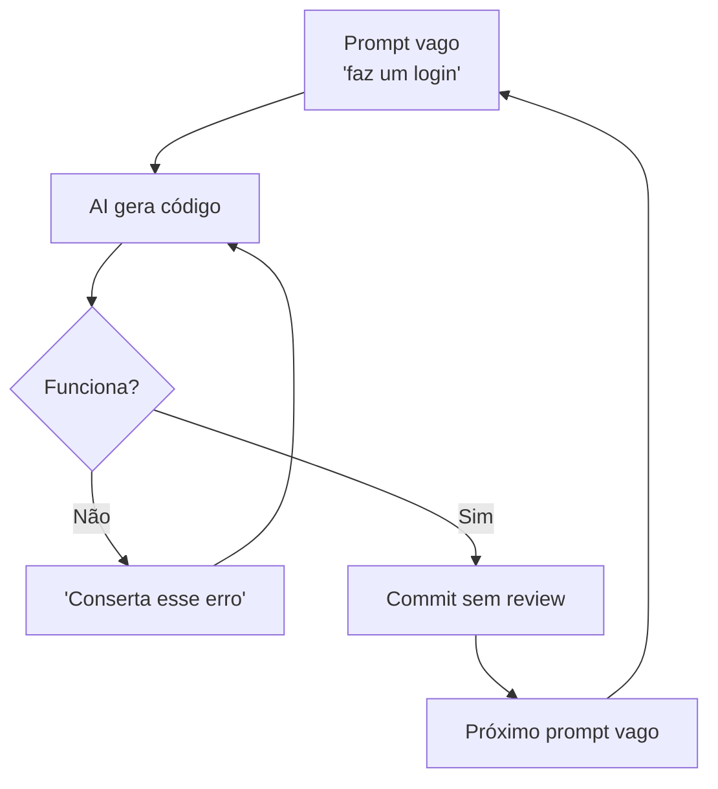
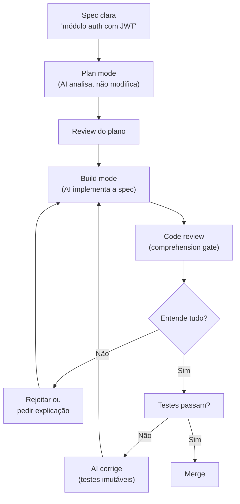
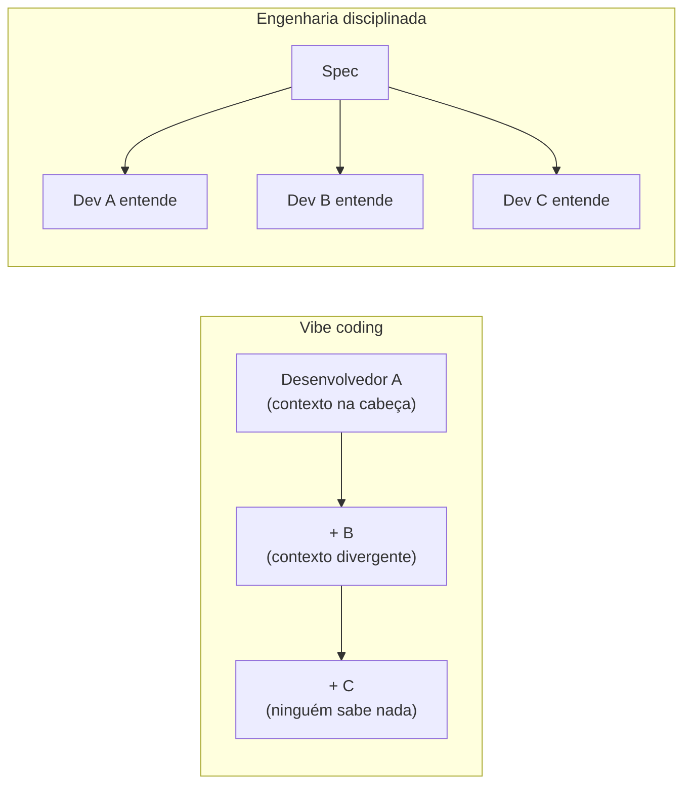

# Vibe coding vs engenharia disciplinada

> [!abstract] TL;DR
> "Vibe coding" é gerar código por tentativa e erro conversacional com IA — funciona para protótipos mas gera tech debt exponencial em produção. Engenharia disciplinada com IA mantém o humano como arquiteto e o agente como executor, com specs claras, testes imutáveis, e code review rigoroso. O gap entre os dois é a diferença entre "funciona no meu localhost" e "funciona em produção por 3 anos". A competência profissional em 2026 está na engenharia disciplinada.

O termo "vibe coding" nasceu de um tweet de [[Andrej Karpathy]] em fevereiro de 2025 e virou fenômeno cultural — Palavra do Ano do Collins em 2025. Mas em 2026 o próprio Karpathy declarou que essa era está se encerrando: o mercado profissional migra para a *engenharia agêntica*, com especificações detalhadas e supervisão humana. Esta nota contrasta os dois polos e mostra por que a competência de 2026 mora na disciplina, não na vibe.

## O que é

**[[Dicionário de IA#vibe coding|Vibe coding]]** (termo cunhado por Andrej Karpathy em 2025) descreve o workflow de:

1. Pedir algo ao AI em linguagem natural
2. Aceitar o que ele gerar
3. Se quebrar, pedir para consertar
4. Repetir até funcionar

**Engenharia disciplinada com IA** é o workflow de:

1. Definir a spec/arquitetura antes de gerar código
2. Usar o [[Dicionário de IA#Coding agent|agente]] como executor da spec
3. Revisar cada mudança com compreensão do porquê
4. Manter testes, linting e CI como barreiras imutáveis

Na formulação original, Karpathy descreveu um modo em que o desenvolvedor "se entrega totalmente às vibes, abraça as exponenciais e esquece que o código existe" — explicitamente adequado a protótipos e projetos descartáveis de fim de semana, não a código de produção. O uso do termo para sistemas em produção é justamente o que adquiriu conotação negativa.

## Por que é tão difícil resistir ao vibe coding

A questão não é só técnica — é psicológica. Se a disciplina é claramente superior a longo prazo, por que tantos times ainda operam no modo vibe? Porque o vibe coding explora vieses cognitivos que a engenharia disciplinada não explora.

**O efeito de completude imediata.** Quando o agente gera código que compila e passa nos testes básicos, o cérebro registra "tarefa concluída". A dopamina do progresso visível é real. A spec não tem esse mesmo gatilho — é trabalho invisível que posterga o prazer da geração. Para resistir, é preciso internalizar que a spec *é* o trabalho, e a geração é o último passo, não o primeiro.

**O viés de otimismo sobre o código alheio.** Quando você gera código, sente a ilusão de que entende o que foi gerado, porque foi você quem pediu. Esse viés se dissolve quando você tenta explicar o código para outra pessoa, ou quando o bug aparece três semanas depois. O comprehension gate é o dispositivo que força o confronto com esse viés *antes* do merge, não depois.

**A armadilha do "funciona no localhost".** O ambiente de desenvolvimento esconde a maior parte dos problemas — sem carga real, sem usuários reais, sem edge cases reais. Código vibe-coded passa pela validação local com facilidade. O custo aparece na primeira semana de produção. Para o dev que aprovou, a ausência de feedback imediato confirma que a decisão foi boa. Para o time que vai manter, a conta chega depois.

**A ilusão de que "vou entender depois".** Quando você aceita código que não entende completamente sob a promessa mental de "entendo isso mais tarde", o mais tarde raramente chega. O próximo sprint tem suas próprias pressões. O entendimento postergado se torna entendimento nunca adquirido — e o codebase cresce com mais uma zona proibida.

Reconhecer esses padrões não os elimina, mas torna possível criar contramedidas sistemáticas: context files que forçam padrões, gates que exigem explicação, testes que não podem ser modificados. A disciplina é um sistema de guardrails porque a vontade individual não é suficiente.

## Histórico

O debate não começou com Karpathy. O que ele nomeou em 2025 era uma prática que já existia desde o ChatGPT (2022) — a diferença é que ele deu vocabulário a algo que a maioria dos devs fazia, mas que não tinha um nome que permitia refletir sobre seus limites.

| Ano | Marco | Impacto no debate |
| ---- | ---- | ---- |
| 2022 | ChatGPT lança com RLHF | Devs começam a "conversar" com código; vibe coding emerge de forma anônima |
| 2023 | GitHub Copilot Chat + Cursor v1 | Multi-file editing viabiliza o ciclo vicioso em escala real |
| 2025 (fev) | Karpathy nomeia "vibe coding" | O termo catalisa a reflexão sobre o que está sendo feito |
| 2025 (mai) | Collins Word of the Year | Vibe coding passa de jargão técnico a fenômeno cultural |
| 2025 (dez) | METR publica RCT | Primeiro dado controlado: percepção vs realidade de produtividade |
| 2026 (abr) | Karpathy no Sequoia Ascent | "A era do vibe coding está se encerrando" — engenharia agêntica como successor |
| 2026 (abr) | ICSE / AGENT 2026 workshop | Agentic engineering ganha nome acadêmico e taxonomia formal |
| 2026 (mai) | GitLab Orbit case publicado | Primeiro case público de 100k+ linhas com disciplina agêntica em Rust |

O padrão que emerge: cada vez que a IA ficou mais capaz, a prática do vibe coding ficou mais arriscada — não menos. Modelos melhores geram código errado mais convincente. A disciplina não é a resposta para modelos fracos; é a resposta para modelos que falham de formas difíceis de detectar.

> [!question]- Mas se a IA está melhorando, a disciplina não vai se tornar desnecessária?
> Não — porque o risco não vem da incapacidade do modelo, vem da natureza das falhas. Modelos mais capazes continuam alucinando; só que alucinam de formas mais sofisticadas e portanto mais difíceis de detectar no review superficial. A disciplina responde a um problema de epistemologia (como você sabe que o código está correto?) que a melhoria do modelo não resolve — só desloca. Enquanto o desenvolvedor não conseguir explicar por que o código faz o que faz, a disciplina continua sendo a única barreira confiável.

## Por que importa

| Métrica                | Vibe coding           | Engenharia disciplinada |
| ---------------------- | --------------------- | ----------------------- |
| Velocidade inicial     | ★★★★★                 | ★★★                     |
| Qualidade 1 mês depois | ★★                    | ★★★★★                   |
| Tech debt acumulada    | Exponencial           | Controlada              |
| Segurança              | ❌ Vulnerável          | ✅ Auditada              |
| Manutenibilidade       | Muito baixa           | Alta                    |
| Custo de tokens        | Alto (muitos retries) | Menor (menos iterações) |

Há dado empírico do acúmulo de tech debt: o estudo do GitClear sobre 211 milhões de linhas encontrou queda de ~60% na atividade de refatoração entre 2021 e 2024, enquanto instâncias de copy-paste cresceram ~48% — em 2024, pela primeira vez, linhas copiadas-e-coladas superaram as refatoradas. É o rastro de gerar sem revisar.

O custo também não se distribui por igual entre os polos. A IA entrega ~70% de uma solução depressa, mas os 30% finais — edge cases, integração com produção, segurança, gestão de chaves — continuam tão caros quanto sempre foram (o *70% problem*, de Addy Osmani). E esse 30% se comporta de forma oposta conforme a senioridade: para o sênior, fechar a última milha costuma ser mais lento do que escrever limpo desde o início; para o júnior, vira um jogo de gato-e-rato em que consertar um bug quebra outro, sem repertório para sair do loop.

Há uma curva que resume o estado de 2025: o Stack Overflow Developer Survey encontrou que 84% dos desenvolvedores usam ou planejam usar ferramentas de IA — mas apenas 33% confiam na precisão do output. O sentimento positivo caiu de mais de 70% em 2023-2024 para 60% em 2025. Adoção está no teto; confiança está afundando. O gap entre essas duas curvas não é acidente — é o rastro de ferramentas adotadas sem o processo que as tornaria confiáveis. Vibe coding eleva a adoção; engenharia disciplinada é o que eleva a confiança.

Há também o eixo de segurança que a tabela acima captura com "❌ Vulnerável" mas que merece detalhamento. Não é só que vibe coding é menos seguro — é que a insegurança é sistematicamente invisível. Um módulo de auth com timing attack vulnerável não lança exceção, não falha nos testes básicos, não gera erro de log. Ele funciona perfeitamente até o dia em que não funciona. Esse tipo de falha silenciosa é exatamente o que o vibe coding produz: código que passa na triagem superficial e falha na auditoria profunda. A diferença entre os dois é quem olha para o código e com que profundidade.

> [!tip] Assista: Software Is Changing (Again)
> **Canal:** Y Combinator / AI Startup School | **Duração:** ~39min | **Idioma:** EN
>
> Karpathy descreve em primeira pessoa a experiência que esta nota trata em teoria: criou o app MenuGen com vibe coding em horas — mas auth, pagamento, deploy e domínio levaram uma semana a mais. O código foi a parte fácil. "Make it real" é onde o vibe falha, exatamente o 70% problem de Addy Osmani. A talk também apresenta o framework Software 1.0/2.0/3.0 que contextualiza historicamente onde o vibe coding se encaixa. Trecho de destaque [32:23]: *"The fascinating thing about MenuGen for me is that the code — the vibe coding part — was actually the easy part. Most of it was when I tried to make it real: authentication, payments, the domain name, deployment."*
>
> 🎬 [Assistir no YouTube](https://www.youtube.com/watch?v=LCEmiRjPEtQ)

## Como funciona

### O ciclo vicioso do vibe coding

**Problemas que se acumulam:**

- O AI pode "consertar" erros de forma que introduz novos bugs
- Cada iteração adiciona contexto descontrolado, aumentando [[Dicionário de IA#Token|custo de tokens]]
- Código gerado não segue padrões do projeto
- Testes são modificados pelo AI para "passar" em vez de testar corretamente

O "conserta esse erro" não é neutro em segurança: o estudo *Security Degradation in Iterative AI Code Generation* (IEEE-ISTAS 2025) mostrou que iterar com o modelo sobre o próprio código **degrada a postura de segurança a cada rodada** — cada conserto tende a introduzir uma vulnerabilidade nova em vez de apenas eliminar a anterior. O loop acumula dívida de segurança de forma sistemática, não acidental.

O problema não para em vulnerabilidades de lógica. O relatório do GitGuardian de março de 2026 documentou 28,65 milhões de novos segredos hardcoded em commits públicos no GitHub durante 2025 — e commits com assistência de IA mostraram uma taxa de vazamento de segredos de **3,2%**, contra **1,5% de baseline humano**. O mecanismo é simples: o vibe coder aceita o output sem ler. Se o modelo incluiu uma API key de exemplo "para teste" no código gerado, ela vai pro commit. A velocidade de aceitar sem ler que define o vibe coding é a mesma velocidade que vaza credenciais para repositórios públicos.

### O ciclo virtuoso da engenharia disciplinada

### Práticas da engenharia disciplinada

| Prática                                                         | O que é                                   | Por que importa                    |
| --------------------------------------------------------------- | ----------------------------------------- | ---------------------------------- |
| **[[Dicionário de IA#Comprehension gate\|Comprehension gate]]** | Se não entende a mudança, não faz merge   | Evita código fantasma no codebase  |
| **Testes imutáveis**                                            | AI não pode reescrever testes para passar | Testes são a barreira de qualidade |
| **Plan before build**                                           | Usar plan mode antes de gerar código      | Reduz iterações (e tokens)         |
| **[[Dicionário de IA#Spec-driven development\|Spec-driven]]**   | Definir o "o quê" antes do "como"         | Mantém coerência arquitetural      |
| **[[03-Dominios/Tecnologia/IA/Context Engineering/index\|Context files]]** | CLAUDE.md, .cursorrules, agents.md        | O agente segue seus padrões        |
| **Commits atômicos**                                            | Cada commit resolve uma coisa             | Reversibilidade granular           |

### O espectro entre vibe e disciplina

Na prática, o ideal não é nem 100% vibe nem 100% spec-driven. Depende da fase:

| Fase                                  | Abordagem recomendada                                    |
| ------------------------------------- | -------------------------------------------------------- |
| **Prototipagem / spike**              | Vibe coding é OK — descarte o código depois              |
| **MVP v1**                            | Semi-disciplinado — specs leves, testes básicos          |
| **Feature em produção**               | Disciplinado — specs, testes, review                     |
| **Infraestrutura / auth / pagamento** | Ultra-disciplinado — human review obrigatório, zero vibe |

### Da disciplina single-agent à orquestração multi-agente

O ciclo virtuoso acima descreve o modelo de 2025: **um** agente em plan → build → review, com o humano revisando cada diff. O que Karpathy chama de *[[Dicionário de IA#agentic engineering|agentic engineering]]* (2026) leva a disciplina adiante e a torna multi-agente — o humano vira orquestrador de vários agentes especializados rodando em paralelo (planejador, implementador, validador), e seu trabalho migra de "revisar cada diff" para *projetar o sistema, especificar constraints e julgar saídas*. A spec deixa de ser documento e passa a ser o substrato que coordena os agentes. A disciplina não desaparece com agentes melhores; ela sobe de nível.

O que muda na transição single-agent → multi-agente é o *objeto da disciplina*. No single-agent, você revisa o código que o agente produziu. No multi-agente, você revisa a arquitetura do sistema de agentes — quem faz o quê, como os agentes se comunicam, quais invariantes cruzam as fronteiras entre agentes. A spec agora descreve não só o sistema final, mas o protocolo entre os agentes que o constroem. O [[Dicionário de IA#AgentOps|AgentOps]] surge justamente aqui: como você monitora e opera esse sistema orquestrado quando ele vai pra produção.

## De prática a disciplina (2026)

Até aqui esta nota tratou a "engenharia disciplinada" como uma postura — um jeito mais cuidadoso de trabalhar com IA. Em 2026 ela ganhou algo que postura nenhuma tinha: um nome próprio, um palco acadêmico e um caso de escala industrial. O lado disciplinado do contraste deixou de ser conselho de blog e virou *disciplina* no sentido técnico da palavra.

A prova mais formal veio da academia. O **ICSE 2026** — a principal conferência de engenharia de software do mundo — hospedou o **AGENT 2026** (International Workshop on Agentic Engineering), no Rio de Janeiro, em 14 de abril de 2026. O workshop define a área como *"an emerging discipline focused on the design, development, and operation of systems that exhibit goal-directed autonomy"*. Repare no vocabulário: design, desenvolvimento, operação. É o mesmo arco de qualquer engenharia madura, agora aplicado a agentes.

> [!info] O escopo que o AGENT 2026 reivindica
> Não é "como escrever prompts melhores". O workshop lista as mesmas frentes de uma engenharia de software clássica, traduzidas para sistemas agênticos: engenharia de requisitos, design arquitetural, V&V/testing/evaluation, **[[Dicionário de IA#AgentOps|AgentOps]]** (o DevOps dos sistemas agênticos), responsible AI/safety, e interação/supervisão humano-agente. Quando uma área ganha sua própria sub-divisão de "Ops", ela passou de truque a infraestrutura.

E o que isso parece na prática, fora do papel? O time do Knowledge Graph (projeto **Orbit**) da GitLab oferece um retrato concreto: relata ter construído um codebase em **Rust de ~135 mil linhas, com cerca de 95% do código gerado por IA**, em ~2 semanas com 4 pessoas, produzindo 259 merge requests. O ponto que interessa a esta nota não é o tamanho — é *como* eles enquadram o método. Para a GitLab, agentic engineering é o oposto de vibe coding: *"not ad hoc prompting, but rather deliberate guardrails, agent context files, custom skills, and CI enforcement"*.

> [!example] Os guardrails do caso GitLab Orbit
> O relato lista exatamente as práticas que a tabela de "engenharia disciplinada" desta nota prega, agora industrializadas: arquivos de contexto `AGENTS.md`/`CLAUDE.md` com **sincronização forçada por CI** (o agente não pode divergir do padrão sem o pipeline reclamar), *custom skills* nomeadas, 15+ jobs de CI, conventional commits, e varredura de segurança com `cargo-audit` e Semgrep. É a prova de que [[03-Dominios/Tecnologia/IA/Anatomia de Agents/11 - Harness engineering — a terceira camada|harness engineering]] — o trilho que cerca o agente — é o que separa 135 mil linhas mantíveis de 135 mil linhas de tech debt.

Mas aqui a honestidade pesa mais que o entusiasmo. Os números são impressionantes justamente porque vêm de quem tem interesse em que sejam impressionantes.

> [!caution] As métricas são reivindicação, não fato auditado
> Os números do caso Orbit (135 mil linhas, "~95% gerado por IA", 2 semanas) são **auto-reportados** pela própria GitLab, *first-party*, sem auditoria externa. Pior: "~95% gerado por IA" é uma métrica **auto-definida** — não há padrão acordado de como medir "quanto do código é da IA" (conta linhas aceitas? caracteres? commits? código depois reescrito por humano?). Trate isso como *"a GitLab reivindica X"*, não como *"está provado que X"*. O caso é valioso como demonstração de método (os guardrails são reais e descritos), não como benchmark de produtividade.

Junte as duas pontas: um venue acadêmico que batiza e delimita a disciplina, e um caso industrial que mostra o método rodando em escala. O contraste vibe vs. disciplina não é mais opinião de duas tribos — o lado disciplinado agora tem endereço acadêmico, taxonomia e um *case* de produção (com asterisco). **Em 2026, "ser disciplinado com IA" deixou de ser virtude pessoal e virou nome de disciplina.**

## O custo composto da dívida de vibe

Tech debt é um conceito financeiro: assim como juros sobre dívida crescem sobre si mesmos, tech debt gera seu próprio custo de manutenção que torna cada nova feature mais cara. O vibe coding não gera tech debt linear — gera tech debt composto.

O mecanismo funciona assim: cada trecho de código aceito sem entendimento é um *contrato implícito desconhecido*. Você não sabe o que pode mudar sem quebrar algo. Para ser seguro, você não mexe no que não entende. As áreas não-entendidas se tornam zonas proibidas. Com o tempo, o mapa mental do codebase tem mais zonas proibidas do que território explorável. Cada nova feature tem que navegar o labirinto das zonas proibidas — ficando progressivamente mais lenta, não mais rápida.

Há também um custo de debugging diferencial. Em código que você escreveu entendendo o mecanismo, um bug tem localidade — você sabe onde procurar porque sabe o que o código está fazendo. Em código vibe-coded, um bug pode estar em qualquer lugar, porque a lógica nunca ficou clara para quem aprovou. O debugging sem mapa é arqueologia, e cada sessão de arqueologia consome mais tempo do que a feature inteira custaria com disciplina.

O terceiro componente do custo é o que os economistas chamam de *custo de oportunidade de revisão*. Quando um novo dev entra no time, ele precisa entender o codebase. Com código disciplinado, o onboarding usa specs, testes e context files. Com código vibe-coded, usa o dev mais sênior como oráculo humano — que fica menos disponível para work produtivo quanto mais o time cresce.

> [!info] O paradoxo da velocidade
> A ironia é que vibe coding parece mais rápido exatamente enquanto está sendo mais lento no agregado. A velocidade visível é a velocidade de geração. O custo invisível é a velocidade de manutenção — que é onde 80% do tempo de vida de um sistema é gasto. Um sistema típico passa 1 mês sendo construído e 3 anos sendo mantido. A disciplina é otimizada para o lugar onde o tempo realmente é gasto.

## Por que a disciplina escala e o vibe não

Imagine dois devs construindo uma casa. O primeiro improvisa enquanto avança — paredes que parecem retas, fiação que "funciona", sem planta. Rápido no começo. No sexto mês, quando chega o inspetor, ele não sabe onde passa cada cano. O segundo desenhou a planta antes de bater o primeiro prego, e qualquer pedreiro que entrar na obra entende o que está acontecendo. A planta é a spec.

Vibe coding funciona bem para um único desenvolvedor em um projeto de curta duração porque o "mapa" está na cabeça de quem gerou o código. O problema é que esse mapa não persiste:

- **No segundo mês:** o próprio autor não lembra por que certos trechos existem. A sessão de conversa com o AI acabou — o contexto não está no código.
- **No terceiro desenvolvedor:** onboarding de código vibe-coded é onboarding de arqueologia. Cada função levanta a pergunta "esse comportamento é intencional ou bug?".
- **No time de 10 pessoas:** 10 contextos de AI divergentes que nunca foram reconciliados. Cada um modificou partes sem entender o todo, porque o todo nunca foi documentado.
- **Na primeira rotatividade:** o dev que escreveu o código foi embora. O conhecimento foi com ele. O time herdou um conjunto de comportamentos sem explicação.

A disciplina escala porque externaliza o conhecimento. A spec é o mapa que qualquer desenvolvedor pode ler. Os testes são a prova viva de quais comportamentos são intencionais. O comprehension gate garante que o código nunca ficou num estado que só uma pessoa entende.

Outra dimensão que quebra o vibe com o tempo: **o custo do contexto**. No vibe coding, o contexto de cada sessão é efêmero — a próxima conversa começa do zero. Com engenharia disciplinada e context files (`CLAUDE.md`, `AGENTS.md`), o agente começa cada sessão com o contexto da arquitetura, as restrições do projeto, e os padrões da equipe. A disciplina reduz a entropia de sessão para sessão.

## O que torna uma spec boa o suficiente para um agente

A spec é a peça central da engenharia disciplinada — mas "escrever uma spec" é vago o suficiente para ser inútil. O que distingue uma spec que o agente consegue executar bem de uma que produz resultado de vibe coding, só com mais burocracia?

**Critério central:** o agente não pode tomar decisões de arquitetura ou segurança implicitamente. Se a spec deixa uma decisão importante aberta, o agente vai preenchê-la — da forma que o modelo achar melhor, não da forma que o time concordou. Uma spec boa *fecha as decisões que importam* antes de dar o prompt.

Na prática, uma spec minimamente suficiente tem quatro componentes:

1. **O quê** — qual comportamento o código deve ter (caso feliz + pelo menos 2 edge cases relevantes).
2. **O que não** — restrições explícitas: o que o agente *não* deve fazer, modificar, ou assumir. Isso é o que o vibe coder omite e o que mais frequentemente causa retrabalho.
3. **Interfaces** — quais contratos o código expõe ou consome: assinatura de função, formato de entrada/saída, ou endpoint e schema de resposta.
4. **Acceptance criteria** — como você vai verificar que está correto. Se não há critério verificável, não há como saber se o agente acertou.

O que a spec *não* precisa ser: um documento de 40 páginas. Para features simples, um parágrafo cobrindo os quatro componentes acima é suficiente. O tamanho da spec é proporcional ao risco e à ambiguidade da tarefa — não ao cargo de quem escreve.

> [!info] Spec ≠ prompt
> Um prompt é uma instrução em linguagem natural que maximiza o que o modelo vai fazer. Uma spec é um contrato que delimita o que o modelo *pode* fazer. A distinção é sutil, mas decisiva: um prompt ótimo para vibe coding ("faz um sistema de login seguro") é uma spec péssima porque não fecha nenhuma das quatro dimensões acima.

> [!example]- Spec ruim vs spec boa (mesmo feature)
> **Ruim (prompt disfarçado de spec):** "Implementar autenticação JWT. O usuário deve conseguir fazer login com e-mail e senha."
>
> **Boa (fecha as quatro dimensões):** "Implementar endpoint `POST /auth/login`. Recebe `{email, password}`. Valida o hash com bcrypt (cost 12). Retorna `{token, expiresAt}` onde token é JWT com `exp` de 1h e `iss: api.prod`. Não armazena senhas em texto claro. Não usa algoritmos HS256 (usar RS256). Edge cases: email inexistente → 401 com mensagem genérica (não revelar se e-mail existe); senha incorreta → 401 com delay mínimo de 200ms (proteção timing attack); payload inválido → 400. Testes de acceptance: (1) login válido retorna token decodificável, (2) login com senha errada retorna 401, (3) endpoint leva ≥200ms em caso de falha."
>
> A diferença: a spec ruim diz *o quê* o sistema faz. A boa fecha *como* e *o que não* — e define como verificar.

## Seis verificações antes de fazer merge de código de agente

A disciplina não é uma postura filosófica — é um conjunto de verificações concretas. Estas seis perguntas separam o merge seguro do acidente esperando acontecer. Todas são rápidas o suficiente para caber em um review normal — e cada uma já detectou bugs reais em contextos reais de produção:

**1. Eu entendo o que cada função faz e por quê?** Se a resposta for "mais ou menos", não aprove. O comprehension gate não é burocracia — é a única barreira entre você e código que ninguém vai conseguir manter. Peça ao agente para explicar cada decisão não-óbvia antes de você aprovar.

**2. Os testes cobrem os edge cases que eu especifiquei?** "Os testes passam" não é o mesmo que "os testes cobrem o que importa". O agente pode ter escrito testes que passam para o caso feliz e ignoram os casos que vão pra produção amanhã. Revise o que os testes *não* testam, não só o que testam.

**3. O PR toca `tests/` e `src/` ao mesmo tempo?** Se sim, leia os dois juntos e verifique se o agente modificou testes para fazer o código passar em vez de fazer o código passar nos testes. São situações opostas com o mesmo resultado superficial.

**4. Há alguma string que parece um segredo hardcoded?** Commits de AI mostram 3,2% de taxa de secret-leak contra 1,5% humano. Uma busca rápida por padrões de API key, password, ou token antes do merge custa 30 segundos e pode evitar uma rotação de credenciais de emergência às 2h. O agente frequentemente inclui segredos "de exemplo" que nunca deveriam sair do ambiente local — e sem review, vão. Ferramentas como `git-secrets`, `trufflehog` ou `detect-secrets` automatizam boa parte dessa verificação e valem ser configuradas como hook de pre-commit.

**5. O código segue os padrões do projeto ou introduziu um novo padrão?** O agente não conhece as convenções implícitas do time — só as explícitas que estão no context file. Se há um padrão novo, foi deliberado? Se sim, atualiza o context file. Se não, rejeita e pede para o agente seguir o padrão existente.

**6. Existe alguma dependência nova que o agente adicionou sem mencionar?** Agentes costumam resolver problemas importando bibliotecas que "já resolvem isso" — sem verificar se estão na lista de dependências aprovadas do projeto, sem checar licenças, sem olhar o histórico de manutenção. Um `package.json` ou `pom.xml` com uma dependência nova não solicitada precisa de revisão explícita: por que essa biblioteca? qual a alternativa nativa? qual a última versão estável? está ativa?

> [!summary] O checklist em uma frase
> As seis verificações traduzem o comprehension gate para o cotidiano: você aprova código de agente que pode explicar, com testes que validou você mesmo, sem segredos hardcoded, sem testes adulterados para passar, alinhado com os padrões do context file, e sem dependências não solicitadas.

## Casos práticos

O contraste vibe/disciplina fica mais nítido quando visto em cenários concretos. O critério de escolha não é "qual ferramenta é melhor" — é "qual postura combina com o risco e o horizonte temporal desse código específico".

**Cenário 1 — O módulo de autenticação "rápido"**

Um dev recebe a tarefa de implementar login com JWT em dois dias. Vibe coding: gera o módulo inteiro em 40 minutos, aceita o código, testa manualmente no Postman, funciona. Vai pra produção. Três semanas depois: tokens sem expiração configurada, sem revogação de sessão, sem proteção contra timing attacks na comparação de hashes. O código "funciona" — nenhuma exceção levantada — mas é uma vulnerabilidade aguardando exploração.

Disciplinado: antes de gerar, escreve uma spec com acceptance criteria derivados de OWASP (tokens com TTL, blacklist de revogação, bcrypt com cost factor definido). Passa a spec para o agente. Revisa o diff com o comprehension gate — pergunta ao agente "por que você usou este valor de cost factor?" Se a resposta não faz sentido, rejeita. O módulo leva 4 horas em vez de 40 minutos. Em produção, sobrevive à auditoria de segurança que reprovaria o outro.

**Cenário 2 — A feature que "só precisa de um botão a mais"**

PM pede uma feature de exportação de relatórios em CSV. Vibe coder: prompt → código → funciona para o caso feliz. No dia do deploy: não lida com arquivos vazios, não escapa caracteres especiais, não limita tamanho de exportação. Usuário com 500k linhas trava o servidor. Cada fix introduce um novo edge case — o desenvolvedor nunca leu o código, só os erros.

Disciplinado: spec lista os edge cases antes de gerar — arquivo vazio, caracteres de vírgula/aspas nos dados, limite de 100k linhas com paginação. O agente gera código que passa em testes que cobrem esses casos. O comprehension gate garante que o dev entende a lógica de escape antes de aprovar. A feature vai pra produção funcionando para todos os casos, não só para o demo.

**Cenário 3 — O refactoring que virou reescrita**

Time precisa extrair um serviço de notificações de um monólito. Vibe coding: "extrai o serviço de notificações do arquivo X para um microserviço" → AI gera → parece funcionar → PR enorme sem contexto → review superficial → merge → em produção, notificações duplicadas em race conditions não testadas.

Disciplinado: spec define os contratos de interface (qual endpoint expõe, qual o contrato de idempotência, como o monólito chama o serviço), os invariantes (nenhuma notificação pode ser enviada mais de uma vez para o mesmo evento), e os testes de integração que verificam isso. O agente implementa contra esses testes. O dev lê o diff sabendo exatamente o que estava no monólito antes. Race condition detectada em teste antes de ir pra produção.

**Cenário 4 — O MVP que devia ser descartado mas foi pra produção**

Time faz um hackathon de 48h. Vibe coding faz sentido — velocidade máxima, qualidade secundária, código descartável. O MVP impressiona stakeholders. Decisão ruim: em vez de reescrever disciplinado, vai direto pra produção "só por enquanto". Seis meses depois o "MVP temporário" tem 50 usuários, não tem testes, ninguém entende o código, e cada feature nova quebra duas antigas. O custo de reescrever agora é maior do que teria sido escrever certo desde o início.

A lição: **vibe coding e engenharia disciplinada não são concorrentes — são ferramentas de fases diferentes**. O problema é confundir a fase.

Uma forma prática de não confundir: pergunte qual é a vida útil esperada do código antes de começar. Descartável em menos de um mês → vibe é aceitável. Vai pro repositório do time → exige disciplina. Vai tocar dados de usuário, pagamento, auth ou infra → exige disciplina mesmo que dure um dia. O código que "só vai ficar em staging por uma semana" invariavelmente passa pra produção no décimo dia.

## Como explicar em inglês

O vocabulário do debate vibe vs. disciplina é majoritariamente inglês (o próprio "vibe coding" é inglês). Saber os termos ajuda a ler fontes primárias e a participar de conversas técnicas internacionais.

| PT | EN | Contexto |
| -- | -- | -------- |
| Vibe coding | Vibe coding | Termo original de Karpathy (fev/2025) |
| Engenharia disciplinada com IA | Disciplined AI engineering / Spec-driven development | Dois termos em uso; spec-driven é o mais formal |
| Especificação | Specification / Spec | "Write the spec before generating code" |
| Agente como executor | Agent as executor | Contrasta com "agent as decision-maker" |
| Gate de compreensão | Comprehension gate | "Don't merge what you don't understand" |
| Dívida técnica | Technical debt | "Vibe coding accrues tech debt fast" |
| Testes imutáveis | Immutable tests / Frozen tests | "Tests are read-only for the agent" |
| Critérios de aceite | Acceptance criteria | O que define "done" para o agente |
| Revisão de código | Code review | "Code review is mandatory even for AI output" |
| Engenharia agêntica | Agentic engineering | O nível seguinte da disciplina (2026) |
| Autonomia orientada a objetivos | Goal-directed autonomy | Definição formal do AGENT 2026 workshop |
| Prototipagem / Spike | Prototyping / Spike | Contexto em que vibe coding é aceitável |
| Contexto do agente | Agent context / Context files | CLAUDE.md, AGENTS.md, .cursorrules |

> [!tip] Como falar sobre isso em entrevista
> "The core distinction isn't about which AI tool you use — it's about your workflow. Vibe coding means accepting AI output without understanding it, which works for throwaway prototypes but creates exponential tech debt in production. Disciplined AI engineering means you write specifications first, use the agent as an executor of those specs, and apply a comprehension gate before merging: if you can't explain what the code does and why, it doesn't merge. The METR study showed that developers using AI felt 20% faster while actually being 19% slower — the discipline is what closes that perception gap."

## O que vem a seguir

O próximo passo natural é entender o mecanismo central que separa os dois mundos na prática: o comprehension gate. Enquanto esta nota define os dois polos e por que o polo disciplinado vence a longo prazo, a nota seguinte detalha como o gate funciona como checkpoint operacional — o momento concreto em que a disciplina se aplica ou não.

O comprehension gate responde à pergunta mais simples e mais difícil de responder com honestidade: *você entende o que está prestes a mergear?* Simples porque a resposta é sim ou não. Difícil porque dizer não quando o prazo está batendo requer o tipo de coragem que a disciplina torna sistemática em vez de heroica.

Para quem quer ir além do gate e implementar a disciplina de ponta a ponta:
- [[03 - O comprehension gate]] — o mecanismo operacional do polo disciplinado
- [[14 - agents.md e configuração de projeto]] — como configurar o agente para respeitar seus padrões desde o início, externalizando as convenções do time para o context file
- [[16 - O loop agentic — plan, act, observe]] — o ciclo completo que a disciplina estrutura (plan mode antes de build mode é a spec em ação)
- [[17 - Human-in-the-loop — quando (não) confiar]] — como decidir onde colocar o humano no loop, especialmente para os quatro domínios de zero-vibe (auth, pagamento, infra, dados de usuário)
- [[12 - Multi-agent — workflows com múltiplos agentes]] — como a disciplina evolui para coordenar múltiplos agentes especializados (a forma 2026 da engenharia agêntica)

## Armadilhas

> [!warning] "Vibe coding é ruim"
> Não é. É excelente para prototipagem, exploração e aprendizado — o termo nasceu em um contexto de side projects de fim de semana, não de sistemas corporativos. O problema é aplicá-lo em produção, onde as consequências de código não-revisado se acumulam ao longo de semanas. A ferramenta certa no contexto errado não deixa de ser o contexto errado.

> [!warning] "Engenharia disciplinada é lenta"
> Parece mais lenta no primeiro dia porque você passa tempo escrevendo specs e revisando planos em vez de só gerar código. No dia 30, o projeto com disciplina está muito à frente — não está consertando tech debt nem tentando entender por que o código "funciona" mas ninguém sabe como. A "velocidade" do vibe coding é um saldo de cartão de crédito que vence com juros.

> [!warning] "Eu me sinto mais produtivo com IA"
> Sentir não é medir. No ensaio controlado da METR (2025), 16 devs experientes em 246 tarefas reais ficaram **19% mais lentos** usando IA, enquanto **estimavam** ter ficado 20% mais rápidos. O descolamento entre percepção e medição é consistente — e é exatamente o tipo de viés que torna o vibe coding perigoso: você se sente acelerado enquanto acumula dívida técnica invisível. (A METR revisou a metodologia em fev/2026 — o número exato mudou, o descolamento persiste.)

> [!warning] "O AI é tão bom que review não precisa"
> Falso. [[Dicionário de IA#LLM (Large Language Model)|LLMs]] alucinam, ignoram edge cases e introduzem vulnerabilidades silenciosas. Pior: quanto melhor o modelo, mais convincente o código errado — ele passa no olhar rápido, compila, até passa em testes simples. O review é obrigatório justamente porque o output parece certo.

> [!warning] "Testes são opcionais com AI"
> Ao contrário: com AI, testes são **mais** importantes. Sem testes, não há barreira entre código correto e [[Dicionário de IA#Hallucination|alucinação]] que funciona por acaso. O agente não tem consciência do que é correto — só sabe o que passa nos testes. Remova os testes e o único juiz da correção desapareceu.

> [!warning] Reescrever testes para passar
> Se o agente modifica os testes junto com o código, os testes não estão testando nada. A barreira virou cúmplice. Testes devem ser escritos antes ou em separado, e declarados como read-only para o agente no context file. A regra prática: se o PR toca `tests/` e `src/` ao mesmo tempo sem explicação explícita, rejeite e peça dois PRs separados.

> [!warning] Pedir ao mesmo agente que gerou o código para "revisar por erros"
> Um agente não consegue revisar seu próprio output com isenção — avalia o código contra as mesmas premissas que aplicou ao gerar. É uma câmara de eco: o revisor e o autor compartilham os mesmos pontos cegos. Se o modelo alucinou um comportamento de uma biblioteca, ele vai confirmar o comportamento alucinado na revisão. Use o agente para geração; use seu próprio julgamento para revisão. Quando a equipe precisa de uma segunda opinião automatizada, use um agente com prompt de revisão *separado e independente*, ou use o mesmo agente em uma sessão nova sem contexto da geração original.

## Veja também

Notas que aprofundam os mecanismos e práticas mencionados aqui:

- [[01 - De autocomplete a agentes autônomos]] — a evolução que levou ao gap
- [[03 - O comprehension gate]] — a prática central da disciplina
- [[14 - agents.md e configuração de projeto]] — como configurar o agente para trabalhar com disciplina
- [[16 - O loop agentic — plan, act, observe]] — o ciclo que a disciplina estrutura
- [[17 - Human-in-the-loop — quando (não) confiar]] — quando a supervisão humana é obrigatória
- [[12 - Multi-agent — workflows com múltiplos agentes]] — a forma multi-agente da disciplina (2026)
- [[01 - O problema do vibe coding em produção]] — o mesmo problema pela ótica do Spec-Driven Development

## Referências

- **Karpathy, Andrej** — *Vibe Coding* (X/Twitter, 2025). O termo original e seu contexto.
- **Plus8Soft** — *The Comprehension Gate* (2026). Framework de code review para AI.
- **Eventuallymaking.io** — *AI-Assisted Engineering vs Vibe Coding* (2026). Análise do gap.
- **Wikipedia** — [*Vibe coding*](https://en.wikipedia.org/wiki/Vibe_coding). Definição canônica, origem e evolução do termo.
- **InfoWorld** — [*Vibe coding or spec-driven development? How to choose*](https://www.infoworld.com/article/4166817/vibe-coding-or-spec-driven-development-how-to-choose.html) (2026).
- **Towards Data Science** — [*From Vibe Coding to Spec-Driven Development*](https://towardsdatascience.com/from-vibe-coding-to-spec-driven-development/).
- **Osmani, Addy** — [*The 70% problem: Hard truths about AI-assisted coding*](https://addyo.substack.com/p/the-70-problem). O custo da última milha (os 30% finais) e a divisão por senioridade.
- **METR** — [*Measuring the Impact of Early-2025 AI on Experienced Open-Source Developer Productivity*](https://arxiv.org/abs/2507.09089) (2025). RCT: 19% mais lento vs percepção de +20%. Ver a [revisão metodológica de fev/2026](https://metr.org/blog/2026-02-24-uplift-update/).
- **IEEE-ISTAS 2025** — [*Security Degradation in Iterative AI Code Generation*](https://arxiv.org/html/2506.11022v2). Iterar sobre o próprio código degrada a segurança a cada rodada.
- **AGENT 2026 (ICSE 2026)** — [*International Workshop on Agentic Engineering*](https://conf.researchr.org/home/icse-2026/agent-2026) (2026). Workshop no ICSE define agentic engineering como disciplina emergente (design/dev/operação de autonomia orientada a objetivos); escopo inclui requisitos, arquitetura, V&V, AgentOps, safety e supervisão humana. Rio de Janeiro, 14-abr-2026.
- **GitLab — Orbit / Knowledge Graph** — [*Issue #163*](https://gitlab.com/gitlab-org/orbit/knowledge-graph/-/issues/163) (2026). Relato de caso: ~135K linhas de Rust, ~95% gerado por IA, 259 MRs, com guardrails de CI, AGENTS.md/CLAUDE.md sincronizados e custom skills. Métricas auto-reportadas, sem auditoria externa.
- **Stack Overflow** — [*Developer Survey 2025*](https://survey.stackoverflow.co/2025/) (2025). 84% usam ou planejam usar AI tools; apenas 33% confiam na precisão do output; sentimento positivo caiu de 70%+ (2023-2024) para 60% (2025).
- **GitGuardian / CSA Labs** — [*AI-Generated Code Security: Vibe Coding Risk Assessment*](https://labs.cloudsecurityalliance.org/research/csa-research-note-ai-generated-code-security-vibe-coding-202/) (2026). 28,65M segredos hardcoded em 2025; commits com AI = 3,2% secret-leak vs 1,5% humano.
- **detect-secrets (Yelp)** — [repositório GitHub](https://github.com/Yelp/detect-secrets). Ferramenta de pre-commit para detectar segredos hardcoded; alternativa ao `trufflehog` mencionado na verificação 4.
