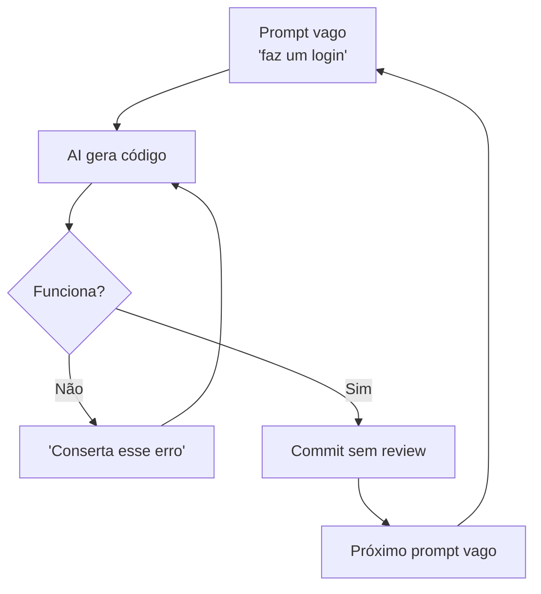
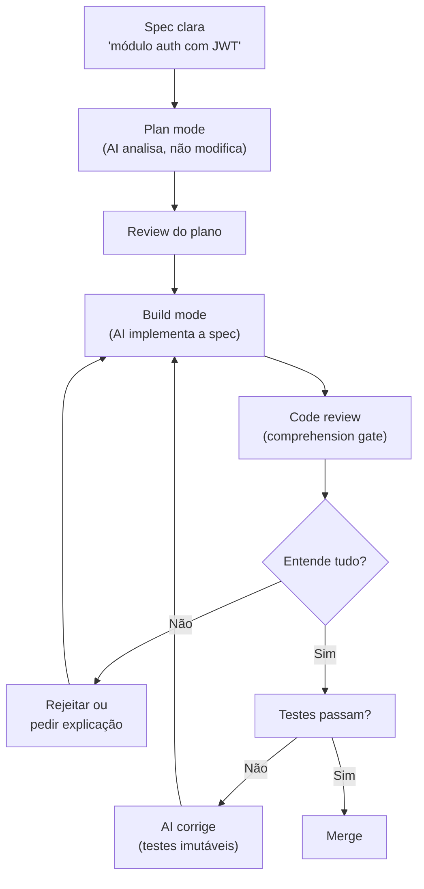

# Vibe coding vs engenharia disciplinada

> [!abstract] TL;DR
> "Vibe coding" é gerar código por tentativa e erro conversacional com IA — funciona para protótipos mas gera tech debt exponencial em produção. Engenharia disciplinada com IA mantém o humano como arquiteto e o agente como executor, com specs claras, testes imutáveis, e code review rigoroso. O gap entre os dois é a diferença entre "funciona no meu localhost" e "funciona em produção por 3 anos". A competência profissional em 2026 está na engenharia disciplinada.

O termo "vibe coding" nasceu de um tweet de [[Andrej Karpathy]] em fevereiro de 2025 e virou fenômeno cultural — Palavra do Ano do Collins em 2025. Mas em 2026 o próprio Karpathy declarou que essa era está se encerrando: o mercado profissional migra para a *engenharia agêntica*, com especificações detalhadas e supervisão humana. Esta nota contrasta os dois polos e mostra por que a competência de 2026 mora na disciplina, não na vibe.

## O que é

**[[Dicionário de IA#vibe coding|Vibe coding]]** (termo cunhado por Andrej Karpathy em 2025) descreve o workflow de:

1. Pedir algo ao AI em linguagem natural
2. Aceitar o que ele gerar
3. Se quebrar, pedir para consertar
4. Repetir até funcionar

**Engenharia disciplinada com IA** é o workflow de:

1. Definir a spec/arquitetura antes de gerar código
2. Usar o [[Dicionário de IA#Coding agent|agente]] como executor da spec
3. Revisar cada mudança com compreensão do porquê
4. Manter testes, linting e CI como barreiras imutáveis

Na formulação original, Karpathy descreveu um modo em que o desenvolvedor "se entrega totalmente às vibes, abraça as exponenciais e esquece que o código existe" — explicitamente adequado a protótipos e projetos descartáveis de fim de semana, não a código de produção. O uso do termo para sistemas em produção é justamente o que adquiriu conotação negativa.

## Por que importa

| Métrica                | Vibe coding           | Engenharia disciplinada |
| ---------------------- | --------------------- | ----------------------- |
| Velocidade inicial     | ★★★★★                 | ★★★                     |
| Qualidade 1 mês depois | ★★                    | ★★★★★                   |
| Tech debt acumulada    | Exponencial           | Controlada              |
| Segurança              | ❌ Vulnerável          | ✅ Auditada              |
| Manutenibilidade       | Muito baixa           | Alta                    |
| Custo de tokens        | Alto (muitos retries) | Menor (menos iterações) |

Há dado empírico do acúmulo de tech debt: o estudo do GitClear sobre 211 milhões de linhas encontrou queda de ~60% na atividade de refatoração entre 2021 e 2024, enquanto instâncias de copy-paste cresceram ~48% — em 2024, pela primeira vez, linhas copiadas-e-coladas superaram as refatoradas. É o rastro de gerar sem revisar.

O custo também não se distribui por igual entre os polos. A IA entrega ~70% de uma solução depressa, mas os 30% finais — edge cases, integração com produção, segurança, gestão de chaves — continuam tão caros quanto sempre foram (o *70% problem*, de Addy Osmani). E esse 30% se comporta de forma oposta conforme a senioridade: para o sênior, fechar a última milha costuma ser mais lento do que escrever limpo desde o início; para o júnior, vira um jogo de gato-e-rato em que consertar um bug quebra outro, sem repertório para sair do loop.

## Como funciona

### O ciclo vicioso do vibe coding

**Problemas que se acumulam:**

- O AI pode "consertar" erros de forma que introduz novos bugs
- Cada iteração adiciona contexto descontrolado, aumentando [[Dicionário de IA#Token|custo de tokens]]
- Código gerado não segue padrões do projeto
- Testes são modificados pelo AI para "passar" em vez de testar corretamente

O "conserta esse erro" não é neutro em segurança: o estudo *Security Degradation in Iterative AI Code Generation* (IEEE-ISTAS 2025) mostrou que iterar com o modelo sobre o próprio código **degrada a postura de segurança a cada rodada** — cada conserto tende a introduzir uma vulnerabilidade nova em vez de apenas eliminar a anterior. O loop acumula dívida de segurança de forma sistemática, não acidental.

### O ciclo virtuoso da engenharia disciplinada

### Práticas da engenharia disciplinada

| Prática                                                         | O que é                                   | Por que importa                    |
| --------------------------------------------------------------- | ----------------------------------------- | ---------------------------------- |
| **[[Dicionário de IA#Comprehension gate\|Comprehension gate]]** | Se não entende a mudança, não faz merge   | Evita código fantasma no codebase  |
| **Testes imutáveis**                                            | AI não pode reescrever testes para passar | Testes são a barreira de qualidade |
| **Plan before build**                                           | Usar plan mode antes de gerar código      | Reduz iterações (e tokens)         |
| **[[Dicionário de IA#Spec-driven development\|Spec-driven]]**   | Definir o "o quê" antes do "como"         | Mantém coerência arquitetural      |
| **[[03-Dominios/Tecnologia/IA/Context Engineering/index\|Context files]]** | CLAUDE.md, .cursorrules, agents.md        | O agente segue seus padrões        |
| **Commits atômicos**                                            | Cada commit resolve uma coisa             | Reversibilidade granular           |

### O espectro entre vibe e disciplina

Na prática, o ideal não é nem 100% vibe nem 100% spec-driven. Depende da fase:

| Fase                                  | Abordagem recomendada                                    |
| ------------------------------------- | -------------------------------------------------------- |
| **Prototipagem / spike**              | Vibe coding é OK — descarte o código depois              |
| **MVP v1**                            | Semi-disciplinado — specs leves, testes básicos          |
| **Feature em produção**               | Disciplinado — specs, testes, review                     |
| **Infraestrutura / auth / pagamento** | Ultra-disciplinado — human review obrigatório, zero vibe |

### Da disciplina single-agent à orquestração multi-agente

O ciclo virtuoso acima descreve o modelo de 2025: **um** agente em plan → build → review, com o humano revisando cada diff. O que Karpathy chama de *agentic engineering* (2026) leva a disciplina adiante e a torna multi-agente — o humano vira orquestrador de vários agentes especializados rodando em paralelo (planejador, implementador, validador), e seu trabalho migra de "revisar cada diff" para *projetar o sistema, especificar constraints e julgar saídas*. A spec deixa de ser documento e passa a ser o substrato que coordena os agentes. A disciplina não desaparece com agentes melhores; ela sobe de nível.

## De prática a disciplina (2026)

Até aqui esta nota tratou a "engenharia disciplinada" como uma postura — um jeito mais cuidadoso de trabalhar com IA. Em 2026 ela ganhou algo que postura nenhuma tinha: um nome próprio, um palco acadêmico e um caso de escala industrial. O lado disciplinado do contraste deixou de ser conselho de blog e virou *disciplina* no sentido técnico da palavra.

A prova mais formal veio da academia. O **ICSE 2026** — a principal conferência de engenharia de software do mundo — hospedou o **AGENT 2026** (International Workshop on Agentic Engineering), no Rio de Janeiro, em 14 de abril de 2026. O workshop define a área como *"an emerging discipline focused on the design, development, and operation of systems that exhibit goal-directed autonomy"*. Repare no vocabulário: design, desenvolvimento, operação. É o mesmo arco de qualquer engenharia madura, agora aplicado a agentes.

> [!info] O escopo que o AGENT 2026 reivindica
> Não é "como escrever prompts melhores". O workshop lista as mesmas frentes de uma engenharia de software clássica, traduzidas para sistemas agênticos: engenharia de requisitos, design arquitetural, V&V/testing/evaluation, **AgentOps** (o DevOps dos sistemas agênticos), responsible AI/safety, e interação/supervisão humano-agente. Quando uma área ganha sua própria sub-divisão de "Ops", ela passou de truque a infraestrutura.

E o que isso parece na prática, fora do papel? O time do Knowledge Graph (projeto **Orbit**) da GitLab oferece um retrato concreto: relata ter construído um codebase em **Rust de ~135 mil linhas, com cerca de 95% do código gerado por IA**, em ~2 semanas com 4 pessoas, produzindo 259 merge requests. O ponto que interessa a esta nota não é o tamanho — é *como* eles enquadram o método. Para a GitLab, agentic engineering é o oposto de vibe coding: *"not ad hoc prompting, but rather deliberate guardrails, agent context files, custom skills, and CI enforcement"*.

> [!example] Os guardrails do caso GitLab Orbit
> O relato lista exatamente as práticas que a tabela de "engenharia disciplinada" desta nota prega, agora industrializadas: arquivos de contexto `AGENTS.md`/`CLAUDE.md` com **sincronização forçada por CI** (o agente não pode divergir do padrão sem o pipeline reclamar), *custom skills* nomeadas, 15+ jobs de CI, conventional commits, e varredura de segurança com `cargo-audit` e Semgrep. É a prova de que [[03-Dominios/Tecnologia/IA/Anatomia de Agents/11 - Harness engineering — a terceira camada|harness engineering]] — o trilho que cerca o agente — é o que separa 135 mil linhas mantíveis de 135 mil linhas de tech debt.

Mas aqui a honestidade pesa mais que o entusiasmo. Os números são impressionantes justamente porque vêm de quem tem interesse em que sejam impressionantes.

> [!caution] As métricas são reivindicação, não fato auditado
> Os números do caso Orbit (135 mil linhas, "~95% gerado por IA", 2 semanas) são **auto-reportados** pela própria GitLab, *first-party*, sem auditoria externa. Pior: "~95% gerado por IA" é uma métrica **auto-definida** — não há padrão acordado de como medir "quanto do código é da IA" (conta linhas aceitas? caracteres? commits? código depois reescrito por humano?). Trate isso como *"a GitLab reivindica X"*, não como *"está provado que X"*. O caso é valioso como demonstração de método (os guardrails são reais e descritos), não como benchmark de produtividade.

Junte as duas pontas: um venue acadêmico que batiza e delimita a disciplina, e um caso industrial que mostra o método rodando em escala. O contraste vibe vs. disciplina não é mais opinião de duas tribos — o lado disciplinado agora tem endereço acadêmico, taxonomia e um *case* de produção (com asterisco). **Em 2026, "ser disciplinado com IA" deixou de ser virtude pessoal e virou nome de disciplina.**

## Armadilhas

- **"Vibe coding é ruim"** — não é. É excelente para prototipagem, exploração, e aprendizado. O problema é usá-lo em produção.
- **"Engenharia disciplinada é lenta"** — parece mais lenta no primeiro dia. No dia 30, o projeto com disciplina está muito à frente porque não está gastando tempo consertando tech debt.
- **"Eu me sinto mais produtivo com IA"** — sentir não é medir. Num ensaio controlado randomizado da METR (2025), 16 devs experientes em 246 tarefas reais ficaram **19% mais lentos** usando IA, enquanto **estimavam** ter ficado 20% mais rápidos. A percepção de aceleração descola da aceleração real. (Em fev/2026 a própria METR relativizou o número — quem mais se beneficia de IA recusava o braço sem-IA do experimento —, mas o descolamento percepção×medição segue de pé.)
- **"O AI é tão bom que review não precisa"** — falso. [[Dicionário de IA#LLM (Large Language Model)|LLMs]] alucinam, ignoram edge cases, e introduzem vulnerabilidades silenciosas. Review é obrigatório.
- **"Testes são opcionais com AI"** — ao contrário: com AI, testes são MAIS importantes. Sem testes, não há barreira entre código correto e [[Dicionário de IA#Hallucination|alucinação]] que funciona por acaso.
- **Reescrever testes para passar** — se o agente modifica os testes junto com o código, os testes não estão testando nada. Testes devem ser escritos ANTES ou separadamente.

## Veja também

- [[01 - De autocomplete a agentes autônomos]] — a evolução que levou ao gap
- [[03 - O comprehension gate]] — a prática central da disciplina
- [[14 - agents.md e configuração de projeto]] — como configurar o agente para trabalhar com disciplina
- [[16 - O loop agentic — plan, act, observe]] — o ciclo que a disciplina estrutura
- [[17 - Human-in-the-loop — quando (não) confiar]] — quando a supervisão humana é obrigatória
- [[12 - Multi-agent — workflows com múltiplos agentes]] — a forma multi-agente da disciplina (2026)
- [[01 - O problema do vibe coding em produção]] — o mesmo problema pela ótica do Spec-Driven Development

## Referências

- **Karpathy, Andrej** — *Vibe Coding* (X/Twitter, 2025). O termo original e seu contexto.
- **Plus8Soft** — *The Comprehension Gate* (2026). Framework de code review para AI.
- **Eventuallymaking.io** — *AI-Assisted Engineering vs Vibe Coding* (2026). Análise do gap.
- **Wikipedia** — [*Vibe coding*](https://en.wikipedia.org/wiki/Vibe_coding). Definição canônica, origem e evolução do termo.
- **InfoWorld** — [*Vibe coding or spec-driven development? How to choose*](https://www.infoworld.com/article/4166817/vibe-coding-or-spec-driven-development-how-to-choose.html) (2026).
- **Towards Data Science** — [*From Vibe Coding to Spec-Driven Development*](https://towardsdatascience.com/from-vibe-coding-to-spec-driven-development/).
- **Osmani, Addy** — [*The 70% problem: Hard truths about AI-assisted coding*](https://addyo.substack.com/p/the-70-problem). O custo da última milha (os 30% finais) e a divisão por senioridade.
- **METR** — [*Measuring the Impact of Early-2025 AI on Experienced Open-Source Developer Productivity*](https://arxiv.org/abs/2507.09089) (2025). RCT: 19% mais lento vs percepção de +20%. Ver a [revisão metodológica de fev/2026](https://metr.org/blog/2026-02-24-uplift-update/).
- **IEEE-ISTAS 2025** — [*Security Degradation in Iterative AI Code Generation*](https://arxiv.org/html/2506.11022v2). Iterar sobre o próprio código degrada a segurança a cada rodada.
- **AGENT 2026 (ICSE 2026)** — [*International Workshop on Agentic Engineering*](https://conf.researchr.org/home/icse-2026/agent-2026) (2026). Workshop no ICSE define agentic engineering como disciplina emergente (design/dev/operação de autonomia orientada a objetivos); escopo inclui requisitos, arquitetura, V&V, AgentOps, safety e supervisão humana. Rio de Janeiro, 14-abr-2026.
- **GitLab — Orbit / Knowledge Graph** — [*Issue #163*](https://gitlab.com/gitlab-org/orbit/knowledge-graph/-/issues/163) (2026). Relato de caso: ~135K linhas de Rust, ~95% gerado por IA, 259 MRs, com guardrails de CI, AGENTS.md/CLAUDE.md sincronizados e custom skills. Métricas auto-reportadas, sem auditoria externa.
