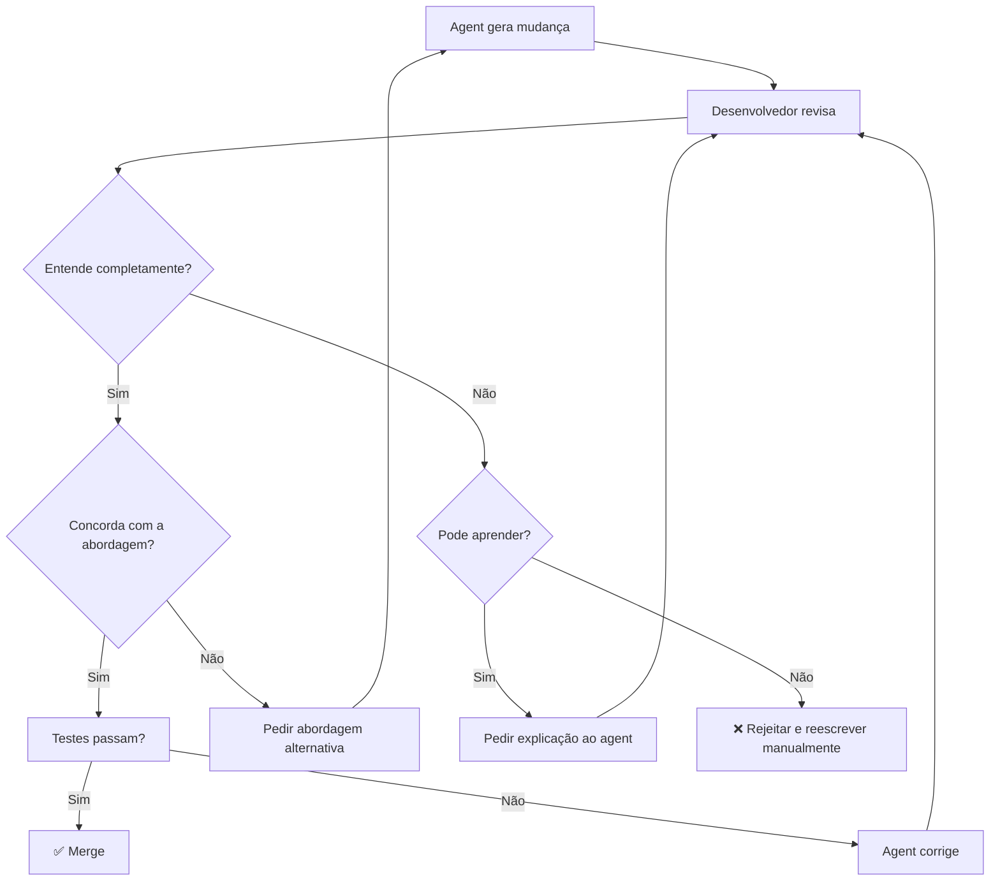
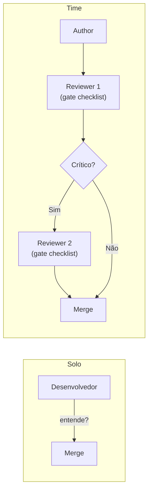

# O comprehension gate

> [!abstract] TL;DR
> O [[Dicionário de IA#Comprehension gate|comprehension gate]] é a regra de ouro do desenvolvimento assistido por IA: se você não consegue explicar por que uma mudança foi feita, ela não deve ser mergeada. Não importa se o código passa nos testes, se o [[Dicionário de IA#Coding agent|agente]] confia na mudança, ou se parece funcionar. Se o humano não compreende o "porquê" de cada alteração, o codebase acumula *comprehension debt* — código funcional mas incompreensível que eventualmente se torna impossível de manter. Cinco grupos de pesquisa independentes documentaram em 2026 que IA gera código 5-7x mais rápido do que devs conseguem entendê-lo; o gate é o mecanismo que fecha esse gap. O critério prático: você aprovaria um PR com o mesmo código de um colega júnior que não soubesse explicar as escolhas? Se não, o gate falha.

## O que é

Imagine o seguinte cenário: o agente gera 200 linhas de código para um módulo de autenticação. Você roda os testes — passam. Você olha o diff — parece limpo. Você mergeia. Seis semanas depois, uma auditoria de segurança encontra um timing attack silencioso: a comparação de hashes usa `==` em vez de uma função de comparação segura. O código estava "funcionando" desde o primeiro dia. Nunca quebrou. Nunca gerou erro. Simplesmente estava errado de um jeito que você não saberia identificar porque nunca entendeu o que ele fazia.

O **[[Dicionário de IA#Comprehension gate|comprehension gate]]** é a regra criada para evitar exatamente esse cenário:

> Nenhuma mudança gerada por IA entra no codebase sem que o desenvolvedor responsável consiga explicar, em suas próprias palavras, o que mudou e por quê.

A diferença entre esse princípio e um code review normal é o critério de aprovação. Code review tradicional pergunta "o código está correto?". O comprehension gate pergunta "você entende por que o código está correto?" — e só aprova quando a resposta é sim. É a barreira mais importante entre desenvolvimento *assistido* por IA e desenvolvimento *dependente* de IA.

Três características tornam o gate especialmente relevante para código de IA (versus código de um colega humano): o agente não está disponível para perguntas em produção, o agente não tem contexto do histórico arquitetural que motivou certas escolhas, e o agente produz código plausível que parece deliberado mesmo quando é só o padrão mais comum no training data. Essas três assimetrias justificam um nível de escrutínio diferente do que se aplicaria ao código de um colega experiente.

## Por que importa

Há três problemas distintos que o gate ataca — e que se reforçam mutuamente quando nenhum gate existe.

**O problema do código fantasma.** Quando código gerado por IA entra no codebase sem compreensão, ele se torna o que os engenheiros chamam de *zombie code*: funcional, mas sem genealogia intelectual. Ninguém sabe por que aquela implementação específica foi escolhida em vez de outra. Quando algo quebra adjacente a esse código, o debugger não tem mapa — precisa reconstruir a intenção a partir do comportamento, o que é ordens de magnitude mais lento do que ter a intenção documentada. Um módulo de 300 linhas escrito com compreensão pode ser depurado em 30 minutos; o mesmo módulo escrito no modo vibe pode levar dias.

**O problema da atrofia de skills.** Há um paradoxo no desenvolvimento assistido por IA: a ferramenta que deveria acelerar o aprendizado pode acabar bloqueando-o. Quando um desenvolvedor aceita código sem entendê-lo sistematicamente, ele para de construir o modelo mental do domínio. O agente está "aprendendo" (ou aplicando o padrão) no lugar dele. O desenvolvedor sênior que operou assim por 18 meses pode descobrir que perdeu a capacidade de raciocinar sobre problemas que o agente não consegue resolver — exatamente o caso de uso onde a expertise humana é mais necessária.

**O problema da segurança invisível.** Vulnerabilidades de segurança introduzidas por IA têm um perfil de falha diferente das vulnerabilidades convencionais: elas passam em todos os testes, compilam sem avisos, e funcionam corretamente nos casos de teste. O estudo IEEE-ISTAS 2025 sobre *Security Degradation in Iterative AI Code Generation* mostrou que cada iteração sobre código gerado por IA tende a introduzir uma vulnerabilidade nova enquanto corrige outra. Sem o gate, o desenvolvedor não tem visibilidade dessa degradação acumulada — ela é sistematicamente invisível.

Com o comprehension gate operando:
- O humano permanece como **arquiteto**, não como rubber stamp: aprova a lógica, não apenas o output
- Cada mudança é **rastreável** a uma intenção clara — quando quebrar, o debugger tem um mapa
- O time mantém **ownership intelectual** do codebase — qualquer membro pode trabalhar em qualquer módulo
- Skills continuam **se desenvolvendo** — entender para aprovar força o modelo mental que o vibe coding corrói
- Vulnerabilidades silenciosas são **detectáveis** antes de produção — o gate é o ponto de inspeção humana

> [!info] O gate não é sobre desconfiar do agente
> O comprehension gate não parte da premissa que o agente erra mais do que o humano. Parte da premissa que *tipos* de erro do agente são diferentes: mais sutis, mais convincentes, e mais difíceis de detectar em produção. Um agente não introduz bugs óbvios (compilação falha, teste quebra). Introduz bugs que "funcionam errado" — e esses são os mais caros. O gate é calibrado para detectar exatamente essa classe.

## Histórico

O comprehension gate não foi inventado para código de IA — ele é uma generalização de práticas que code review rigoroso já exigia para qualquer código externo (bibliotecas de terceiros, contribuições open-source, código de estagiário). O que mudou com a IA é a *escala* e a *velocidade* do problema.

| Período | Marco |
| ------- | ----- |
| 2020-2022 | Code review convencional: o padrão é "o código está correto?" Código gerado por IA é exceção rara |
| 2023 | GitHub Copilot em larga adoção; primeiros relatos de "aprovo sem entender porque parece correto" |
| 2024 | Times com agentes acumulam comprehension debt sem nome para o problema |
| 2025 (fev) | Karpathy nomeia "vibe coding" — dá vocabulário ao polo oposto do gate |
| 2025 (dez) | METR publica RCT: devs *se sentem* mais produtivos usando IA mas são 19% mais lentos — o gap começa a ter dado |
| 2026 (fev) | Cinco grupos de pesquisa independentes documentam "comprehension debt": código 5-7x mais rápido de gerar do que de entender |
| 2026 (abr) | AGENT 2026 (ICSE) formaliza code review de agentes como subárea da agentic engineering |

O nome "comprehension gate" como prática formalizada foi introduzido pelo blog Plus8Soft em 2026, mas o princípio subjacente é mais antigo: nenhum engenheiro de segurança aprova código que não entende, independente da fonte.

## Como funciona

### O processo

### Checklist de comprehension

Para cada mudança gerada por IA, responda:

- [ ] **O quê:** Sei o que esse código faz — em cada função e em cada bloco não-trivial?
- [ ] **Por quê:** Sei por que essa abordagem foi escolhida em vez de alternativas óbvias?
- [ ] **Limites:** Consigo identificar edge cases que não foram cobertos pela implementação?
- [ ] **Reversão:** Entendo como reverter isso se quebrar — sem precisar reescrever do zero?
- [ ] **Acoplamento:** Sei quais outros arquivos, módulos ou serviços são afetados por essa mudança?
- [ ] **Segurança** (domínios críticos): Consigo rastrear onde dados sensíveis são lidos, escritos, ou logados?

Se qualquer item falha → **não merge**. Não é punição ao agente — é proteção ao codebase.

O item mais frequentemente pulado é o segundo ("por que essa abordagem"). Desenvolvedores tendem a entender o que o código faz (é legível) sem entender por que foi feito assim (o raciocínio por trás). É exatamente aí que bugs de design se escondem: a implementação faz o que você pediu, mas da forma errada para o contexto.

### A distinção crítica: code review convencional vs comprehension gate

Qual a diferença entre um code review normal e o comprehension gate? A distinção parece sutil mas é decisiva.

No **code review convencional**, o revisor verifica: o código está correto? Testa o que deveria testar? Segue os padrões do projeto? Compila? O critério de aprovação é sobre o *output* — o estado final do código.

No **comprehension gate**, o revisor verifica uma dimensão diferente: *você, revisor, consegue explicar as decisões contidas neste código?* O critério de aprovação é sobre o *modelo mental do revisor*, não apenas sobre o código em si.

Por que isso importa em código de IA especificamente? Porque LLMs produzem código *plausível* — código que parece correto, que compila, que passa em testes, mas que pode ter tomado decisões incorretas por razões que o modelo não vai explicar a menos que você pergunte. O agente não vai dizer "usei bcrypt com cost 10 porque era o default, não porque era ideal para o seu contexto de segurança". Essa justificativa só aparece quando você força a pergunta. O gate força a pergunta.

Uma heurística útil: se você aprovaria o PR de um colega júnior que escreveu o mesmo código, você passa no gate. Se você aprovaria o PR porque "parece correto e não quero questionar", o gate falhou — a aprovação foi por deferência, não por compreensão.

### Níveis de risco e rigor

| Tipo de mudança                 | Rigor do gate                                                    |
| ------------------------------- | ---------------------------------------------------------------- |
| Documentação, comentários       | Leve — ler e confirmar                                           |
| Testes novos                    | Moderado — entender o que testa e por quê                        |
| Refactoring estrutural          | Moderado — entender o que muda e o que permanece igual           |
| Lógica de negócio               | Alto — entender cada branch e edge case                          |
| Queries e migrations de banco   | Alto — mudanças irreversíveis, impacto em dados em produção      |
| Autenticação, pagamento, crypto | Máximo — review linha por linha, preferencialmente por 2 pessoas |
| Infraestrutura, CI/CD           | Máximo — mudanças podem afetar produção                          |
| Tratamento de PII / dados regulados | Máximo — LGPD, HIPAA e afins exigem rastreabilidade explícita |

A calibração por nível de risco é o que torna o gate sustentável: aplicar rigor máximo em tudo é impraticável; não aplicar rigor nenhum é perigoso. A tabela serve como acordo explícito do time sobre onde concentrar energia de compreensão — e é exatamente o tipo de decisão que pertence ao context file do projeto (ver [[14 - agents.md e configuração de projeto]]).

## Na prática

### Como pedir explicação ao agente

O gate não é binário (entendo/não entendo) — é um processo de exploração dirigida. Quando você não entende uma decisão, o agente pode explicar. A chave é saber o que perguntar. Perguntas genéricas ("explica esse código") produzem respostas genéricas. Perguntas específicas forçam o agente a revelar as premissas que fez.

**Perguntas sobre alternativas** (revelam por que essa abordagem, não outra):
- *"Por que você escolheu [X] em vez de [Y]?"*
- *"Existe uma implementação mais simples? Por que você não a usou?"*
- *"Qual seria a abordagem se o requisito fosse [variação]?"*

**Perguntas sobre edge cases** (revelam o que a implementação ignora):
- *"Quais casos de entrada essa implementação não cobre?"*
- *"O que acontece se [o input for nulo / a rede cair / o arquivo não existir]?"*
- *"Quais são os limites desta implementação — quando ela vai falhar?"*

**Perguntas sobre impacto** (revelam acoplamento não-óbvio):
- *"Essa mudança afeta algum outro módulo além do que pedimos?"*
- *"Se eu reverter só essa função, o que quebra?"*
- *"Há alguma dependência implícita nessa implementação?"*

**Perguntas sobre segurança** (especialmente para domínios críticos):
- *"Há algum vetor de ataque que essa implementação não mitiga?"*
- *"Por que você escolheu esse algoritmo de hashing? Há alternativas mais seguras?"*
- *"Onde os dados do usuário são expostos ou logados nesta implementação?"*

A regra prática: quando a resposta do agente revela algo que você não sabia e não teria descoberto sem perguntar, o gate está funcionando. Quando as respostas confirmam apenas o que você já entendia, você pode confiar na sua compreensão e avançar.

### Sinais de alerta (red flags)

| Red flag                              | O que indica                                     | Ação recomendada |
| ------------------------------------- | ------------------------------------------------ | ---------------- |
| Mudança muito grande (>500 linhas)    | Provavelmente inclui coisas desnecessárias       | Dividir em PRs menores com escopo definido |
| Mudança em arquivo que você não pediu | Agente agindo fora do escopo                     | Rejeitar; explicitar o escopo no context file |
| Testes reescritos junto com o código  | Testes podem estar sendo "ajustados" para passar | Exigir dois PRs separados: código e testes |
| Import de dependência nova não pedida | Potencial slopsquatting ou dependency bloat      | Verificar licença, histórico de manutenção e alternativas |
| Código duplicado do que já existe     | Agente não encontrou a implementação existente   | Apontar o código existente; pedir refactoring |
| Lógica diferente da spec sem explicação | Agente improvisa fora do contrato               | Perguntar explicitamente "por que você se desviou da spec?" |

**Nota sobre slopsquatting:** uma variante específica do risco de dependência nova. Atacantes registram antecipadamente nomes de pacotes que LLMs tipicamente alucinam (nomes plausíveis que não existem oficialmente). Quando o agente gera um `import` para um pacote não-existente e o desenvolvedor executa `npm install` sem verificar, o pacote malicioso é instalado. A mitigação é simples: qualquer dependência nova não pedida deve ter o nome verificado no registro oficial antes de instalar.

## Comprehension debt — o novo tech debt

*Tech debt* é o custo futuro de decisões técnicas ruins tomadas hoje. *Comprehension debt* é o análogo: o custo acumulado de código que ninguém no time entende, mas que continua em produção. A diferença é que tech debt é visível (fica nos backlogs, nas reclamações dos devs seniores). Comprehension debt é invisível — não aparece em velocity dashboards, DORA metrics, ou sprint reviews.

O conceito foi documentado empiricamente em fevereiro de 2026, quando cinco grupos de pesquisa independentes convergiram no mesmo achado: ferramentas de codificação com IA geram código 5-7x mais rápido do que os desenvolvedores conseguem entendê-lo. O gap entre velocidade de geração e velocidade de compreensão é a dívida que se acumula silenciosamente.

As consequências aparecem com delay — tipicamente seis a dezoito meses depois. É quando a equipe descobre que ninguém consegue modificar com confiança certos módulos, que onboarding de novos devs leva o dobro do esperado nessas partes do codebase, e que cada mudança nesses módulos gera bugs inesperados. O código "funciona" perfeitamente; simplesmente ninguém o entende mais.

Um dado mais concreto: PRs de código gerado por IA contêm aproximadamente 1,7x mais defeitos do que PRs escritos por humanos, e 45% introduzem pelo menos uma vulnerabilidade do OWASP Top 10. Esses números pressupõem que não há comprehension gate — que o código vai para produção depois de um review superficial que verifica o comportamento mas não a intenção.

O comprehension gate é a vacina contra comprehension debt: se o desenvolvedor precisar entender para aprovar, o debt não se acumula. O custo do gate é imediato e visível (30-60 minutos de review por PR). O custo de não usar o gate é diferido e invisível — até virar uma crise de manutenção.

O estudo arXiv:2511.02922 (2025) documentou o mecanismo com precisão: em brownfield programming (modificar código existente com IA), devs que usam IA para geração performam bem nas tarefas imediatas mas têm compreensão significativamente menor do resultado — e esse gap persiste mesmo com devs experientes. O gate não resolve o gap de velocidade, mas evita que o gap de compreensão entre para o codebase.

> [!info] Comprehension debt vs tech debt
> Tech debt é o código que você sabe que é ruim mas deixa pra depois. Comprehension debt é o código que *parece bom* mas que ninguém entende por que funciona. Tech debt aparece no backlog; comprehension debt aparece na postmortem. O gate previne o segundo tipo, que é sistematicamente mais perigoso porque mais difícil de detectar.

## Responsabilidade e ownership

Uma dimensão do comprehension gate que times frequentemente ignoram é a de responsabilidade: quem é responsável quando código de IA causa um problema em produção?

A resposta jurídica e organizacional converge: a responsabilidade é do desenvolvedor (e do time) que aprovou o código para merge, independente de quem — ou o quê — o gerou. O agente não tem cargo no time, não assina commits, não recebe performance review. A assinatura no commit é humana; a responsabilidade segue a assinatura.

Isso tem implicação direta no gate: **aprovar código que você não entende é assumir responsabilidade por código cuja correção você não pode garantir.** Se o módulo de autenticação com o timing attack falhar em produção, a conversa com o seu líder técnico vai incluir "você aprovou esse código?" — e "o agente gerou" não é resposta suficiente.

Em contextos regulatórios (LGPD, PCI-DSS, SOC 2, HIPAA), isso é ainda mais literal. Auditores verificam *quem* aprovou *o quê* e *quando*. Um PR com código gerado por IA aprovado com checklist incompleto é uma vulnerabilidade de compliance tão séria quanto uma vulnerabilidade técnica — possivelmente mais, porque tem um histórico rastreável.

O gate, portanto, não é apenas proteção técnica. É a documentação de que o desenvolvedor exerceu julgamento informado antes de introduzir código no sistema. Em caso de incidente, é a diferença entre "havia um processo de review adequado" e "código de IA entrou em produção sem revisão".

Em ambientes com auditorias externas regulares, times que praticam o comprehension gate têm um ativo adicional: o histórico de PR comments documenta o raciocínio por trás de cada decisão. Um auditor que precisa entender por que um módulo de pagamento funciona de determinada forma pode ler o trail de review — algo impossível em codebases sem gate. A rastreabilidade de intenção, não apenas de comportamento, é o que distingue um codebase auditável de um codebase legível-mas-opaco.

> [!summary] O gate em uma frase
> Aprovar código que você não entende é assumir responsabilidade por código cuja correção você não pode garantir — independente de quem o escreveu.

## Métricas — como saber se o gate está funcionando

O problema de métricas para o comprehension gate é parecido com o do próprio comprehension debt: o que você quer medir é invisível. Não existe uma métrica direta de "compreensão" — mas há proxies confiáveis que times que praticam o gate em maturidade monitoram.

**Defect escapement rate por tipo.** A métrica mais direta: dos bugs que chegaram a produção nos últimos N ciclos, quantos seriam detectáveis por um revisor que entendesse o código? Bugs que "ninguém consegue explicar como chegaram lá" são sinal de gate ausente ou fraco. Times com gate maduro têm quase zero defects do tipo "o código faz algo que ninguém pediu" — porque o gate detecta desvios de intenção antes do merge.

**DORA lead time segmentado.** Lead time de mudança (tempo do commit ao deploy) é uma métrica DORA padrão. O que times de gate maduro rastreiam é o *lead time segmentado por domínio de risco*: autenticação e pagamento devem ter lead time mais longo do que boilerplate — e se não tiverem, é sinal de que o rigor do gate não está sendo aplicado diferencialmente. Se auth tem o mesmo lead time que documentação, o gate está falhando em algum lugar.

**Checklist completion rate.** Quantos PRs com código de IA têm o checklist de comprehension completamente preenchido? Este número pode ser rastreado via template de PR com checklist obrigatório. Um time saudável com gate maduro tem >90% de completion rate. Abaixo de 70%, há pressão sistêmica (prazo, volume de PRs, cultura) empurrando o gate para baixo.

**Re-work rate em módulos de IA.** Se um módulo gerado por IA recebe múltiplos PRs corretivos nas semanas seguintes ao merge original, isso é evidência de gate fraco: bugs que um review com compreensão teria detectado chegaram a produção e estão sendo corrigidos iterativamente. A comparação relevante é a taxa de re-work em módulos gerados por IA versus módulos escritos por humanos. Se a diferença for >2x, o gate está subperformando.

**Tempo de onboarding por módulo.** Quanto tempo um novo desenvolvedor leva para entender um módulo específico o suficiente para fazer a primeira mudança? Módulos criados com gate funcionando têm specs, context files e review comments que documentam a intenção. Módulos criados sem gate têm apenas o código — e code-reading sem contexto é ordens de magnitude mais lento. O gap de onboarding é uma medida indireta de comprehension debt acumulado.

**Onde rastrear.** Em times que usam GitHub ou GitLab, a implementação mais simples é um template de PR com o checklist de comprehension como seção padrão. Um script de CI pode verificar se o checklist foi preenchido (todos os `[ ]` substituídos por `[x]` ou `[-]`) antes de permitir merge. Não prova compreensão real — isso depende da cultura — mas gera o histórico auditável de que o processo foi seguido. Para times com pull analytics (GitHub Insights, Swarmia, LinearB), o lead time segmentado por label (ex: `ai-generated`) pode ser extraído sem instrumentação adicional.

> [!info] Métricas de gate não substituem o gate
> A tentação ao criar métricas de gate é que a métrica vire o objetivo — times que rastreiam "checklist completion rate" podem passar a preencher o checklist sem realmente executá-lo. A métrica serve para diagnóstico de tendência, não como KPI de performance individual. O gate é um processo de qualidade; a métrica sinaliza quando o processo está sendo seguido, não prova que ele está sendo executado com rigor.

## Armadilhas

> [!warning] "Os testes passam, então está OK"
> Testes verificam *comportamento*, não *intenção*. Um timing attack vulnerável passa em qualquer teste funcional — nenhum assert falha, nenhuma exceção é lançada. O código faz o que se pede; simplesmente não faz da forma segura. O comprehension gate existe precisamente para cobrir o espaço entre "funciona" e "está correto".

> [!warning] "O agente é melhor que eu nisso"
> Provavelmente é mais rápido. Mas velocidade e correção são dimensões diferentes. O agente não vai estar disponível quando o módulo que ele escreveu quebrar em produção às 3h da manhã — e você vai precisar entendê-lo sem contexto, sob pressão, com alertas disparando. O gate não é sobre desconfiar do agente; é sobre se equipar para manter o que ele produziu.

> [!warning] "Review demora muito"
> O review do comprehension gate leva tipicamente 30-60 minutos para um PR médio. Debugar código fantasma leva dias — e muitas vezes requer reescrever partes que ninguém entende. O investimento em compreensão no momento do merge se paga exponencialmente: um bug que custaria 5 minutos para detectar no review custa 5 horas para diagnosticar em produção.

> [!warning] Approval fatigue
> Revisar 50 mudanças em sequência leva a "rubber stamping" — o desenvolvedor começa a aprovar sem realmente verificar. A solução não é acelerar; é estruturar: revisões em lotes de ≤10 com pausa entre eles, ou reviews assíncronos onde o revisor não tem pressão de tempo imediata. Um gate relaxado por fadiga é pior do que nenhum gate — cria falsa sensação de segurança.

> [!warning] Aplicar o gate com o mesmo rigor para tudo
> Boilerplate, documentação e testes de configuração não precisam de comprehension gate máximo — ler e confirmar é suficiente. O problema é quando o rigor *médio* do gate fica calibrado pelo código mais simples, e código crítico (auth, pagamento, crypto) recebe o mesmo nível superficial. A tabela de níveis de risco nesta nota existe para evitar isso: rigor máximo no que importa, leve no que não importa.

## Program comprehension como skill — o que o gate preserva

O comprehension gate não é só uma prática de code review. É uma forma de preservar uma skill que a IA ameaça corroer: *program comprehension* — a capacidade humana de ler código desconhecido, reconstruir a intenção do autor, e integrar o comportamento observado com o modelo mental do domínio.

Um artigo das *Communications of the ACM* (2025) identificou program comprehension como a habilidade central que educação em CS precisa preservar na era de IA generativa. O argumento: uma vez que IA pode gerar código, a competência que distingue engenheiros capazes de operar com IA de engenheiros dependentes de IA é exatamente a capacidade de *entender* o código gerado — não de gerá-lo. Quem não consegue compreender não consegue revisar, não consegue debugar, e não consegue arquitetar sistemas que o agente vai implementar.

O que torna a ameaça da IA à program comprehension específica (em vez de ser apenas a versão nova do antigo problema de "copiar código do Stack Overflow") é a *plausibilidade*. Código copiado do Stack Overflow costuma ser visivelmente estranho ao contexto — imports diferentes, convenções divergentes, variáveis mal nomeadas. O revisor estranha e pergunta. Código gerado por LLM é sintacticamente coerente, nomeado consistentemente com o estilo do projeto, e integrado naturalmente. O revisor não estranha — e por isso não pergunta. A plausibilidade alta é exatamente o que torna o gate necessário: o sinal visual de "esse código foi gerado externamente" está ausente.

O gate, nesse sentido, tem dois papéis simultâneos:

1. **Proteção do codebase:** impede que código não-compreendido entre em produção, com todos os riscos que isso implica.
2. **Preservação da skill:** ao forçar o desenvolvedor a entender para aprovar, o gate mantém ativa a musculatura de program comprehension que o fluxo puro de vibe coding atrofia.

O segundo papel é menos óbvio mas igualmente importante. Um time que pratica o gate sistematicamente durante dois anos vai ter desenvolvido mais program comprehension do que um time equivalente que vibe-codou o mesmo período. A diferença vai aparecer quando surgirem os problemas que o agente não consegue resolver — e aí a expertise humana é a única saída.

> [!question]- O gate me torna mais lento como desenvolvedor?
> No curto prazo, sim — o gate adiciona 30-60 minutos por PR significativo. No médio prazo, não — porque o time que pratica o gate tem menos tempo de debugging (compreensão reduz bugs escondidos), menos tempo de onboarding (a lógica está documentada nas specs e nos reviews), e menos tempo de refactoring emergencial. O custo do gate é visível e imediato; o custo de não ter o gate é diferido e composto.

> [!question]- O que acontece com program comprehension se eu usar IA exclusivamente por meses?
> Os dados disponíveis em 2026 sugerem deterioração: o estudo da METR (dez/2025) mostrou devs que se *sentiam* mais produtivos com IA mas eram 19% mais lentos em tarefas onde o agente não ajudava diretamente — ou seja, tarefas que exigem o modelo mental que o vibe coding não treina. Program comprehension é uma skill ativa: atrofia sem uso, como qualquer outra. O gate é uma das poucas práticas que preserva a exercitação dessa skill mesmo dentro de um workflow fortemente assistido por IA.

> [!tip] Assista: We Need To Talk About The Vibe Coding Pandemic
> **Canal:** CodeHead | **Duração:** ~5min | **Idioma:** EN
>
> Em 5 minutos, documenta empiricamente o que o comprehension gate tenta reverter: juniors que usam IA para tudo constroem sem modelo mental e não conseguem debugar quando algo quebra em produção. A distinção central — seniores leem código de IA como leriam um PR de júnior, com suspeita; juniores não têm modelo mental para debugar — é a descrição mais concisa da atitude que o gate formaliza.
> Trecho de destaque [1:42]: *"A senior dev uses AI to knock out boilerplate fast, and then handles the architecture themselves. They read what the AI wrote the way they'd read a junior's pull request, with suspicion. A junior dev uses it for everything. And when something breaks in production, they have no mental model to debug from."*
>
> 🎬 [Assistir no YouTube](https://www.youtube.com/watch?v=z4QMrqQhv34)

## Ferramentas que suportam o gate

O comprehension gate é uma prática, não uma ferramenta — mas certas ferramentas tornam mais fácil ou mais difícil aplicá-lo.

**Context files (CLAUDE.md / AGENTS.md)** facilitam o gate ao reduzir a quantidade de surpresas que o desenvolvedor precisa detectar no review. Se o agente já sabe que o projeto usa RS256 (não HS256), não vai gerar código com a escolha errada que o gate precisaria detectar. O gate ainda é necessário, mas trabalha com menos ruído. Veja [[14 - agents.md e configuração de projeto]].

**Plan mode** (Claude Code, Cursor) — antes de gerar código, o agente descreve o que vai fazer. O desenvolvedor aprova ou rejeita o plano antes de ver o código. Isso antecipa o gate para a fase de design: ao invés de revisar código gerado e entender a abordagem, você aprova a abordagem e depois verifica se o código a implementou corretamente. Divide o trabalho de compreensão em dois momentos menores, cada um mais fácil de executar.

**Diff compacto** — tools que mostram o diff em vez do arquivo completo tornam o gate mais eficiente. A compreensão tem que cobrir *o que mudou*, não o arquivo inteiro. Ferramentas como `gh pr diff` ou o diff do GitHub permitem focar no escopo do PR sem se perder no contexto existente.

**Explicação inline** — alguns IDEs (Cursor, GitHub Copilot Chat) permitem selecionar um trecho de código e pedir "explique este bloco". Isso é diretamente o gate em ação: o desenvolvedor força a justificativa do agente no momento do review, não precisa reformular o prompt do zero.

**Linting e SAST** — ferramentas de análise estática (Semgrep, SonarQube, Checkmarx) detectam automaticamente a classe de bugs que o gate detecta manualmente em domínios críticos. Eles não substituem o gate (não verificam intenção), mas reduzem o que o gate precisa cobrir — o desenvolvedor pode focar em lógica de negócio sabendo que XSS e SQL injection já estão cobertos.

**O que não substitui o gate:** testes automatizados, CI verde, ou aprovação de outro revisor sem o checklist. O gate é sobre o *modelo mental do revisor*, não sobre automação. Nenhuma ferramenta implementa compreensão humana por você.

## Casos práticos

O gate é mais fácil de aplicar quando você tem cenários concretos para ancorar o que "entender" significa na prática.

**Cenário 1 — O módulo de autenticação com bug silencioso**

PM pede login com JWT. O agente gera o módulo em 20 minutos. Os testes passam. O desenvolvedor olha o diff: parece certo, imports razoáveis, lógica aparentemente sólida. Sem o gate, mergeia. Com o gate, o desenvolvedor precisa explicar: "por que o cost factor do bcrypt é 10 aqui?" O agente escolheu 10 por ser o default. O desenvolvedor descobre que o padrão OWASP recomenda ≥12 para 2024+, e que o agente também usou `===` para comparar hashes em vez de `crypto.timingSafeEqual`. O bug silencioso foi detectado não por um teste, mas pelo ato de ter que explicar as escolhas.

**Cenário 2 — O PR de 800 linhas**

O agente gera um refactoring "completo" de um módulo de logging. 800 linhas mudadas em 12 arquivos. O desenvolvedor não consegue passar pelo checklist de comprehension — há mudanças em arquivos que ele não pediu, um padrão novo de configuração que não existia antes, e três funções utilitárias que duplicam implementações existentes em outro módulo. O gate rejeita o PR inteiro não porque o código está errado, mas porque o desenvolvedor não consegue explicá-lo. Resultado: o agente é instruído a fazer o refactoring em 3 PRs menores, cada um com escopo que o desenvolvedor consegue revisar e explicar.

**Cenário 3 — O refactoring cross-módulo**

Time precisa mover lógica de cálculo de frete de um monólito para um microserviço. O agente gera a implementação. O gate força o desenvolvedor a responder: "o que acontece se o microserviço estiver down quando o checkout for processado?" O agente não tinha considerado o fallback. A spec original não mencionava. Sem o gate, isso iria pra produção e falharia silenciosamente para uma porcentagem dos usuários. Com o gate, o desenvolvedor detecta a lacuna antes do merge e adiciona o comportamento de fallback como critério de aceite.

**Cenário 4 — A dependência não solicitada**

O agente adiciona uma biblioteca de parsing de datas no `package.json` que o desenvolvedor não pediu. Gate ativado: "por que essa biblioteca?" O agente escolheu porque era a mais popular no momento. O desenvolvedor descobre que o projeto já usa `date-fns` para isso, que a nova biblioteca tem uma licença incompatível com a licença do projeto, e que adiciona 80KB ao bundle. Três problemas detectados porque o gate forçou a pergunta que ninguém estava fazendo.

## Quando o gate falha — os modos de falha

Saber que o gate pode falhar é tão importante quanto saber aplicá-lo. Há quatro modos de falha recorrentes, cada um com um perfil de causa diferente.

**Falha por ilusão de compreensão.** O desenvolvedor lê o código, entende o que cada função faz, e aprova. Mas "entender o que faz" é diferente de "entender por que foi feito assim". Um desenvolvedor pode descrever perfeitamente o comportamento de uma função de hashing e ainda não saber que o algoritmo escolhido é inadequado para o contexto de segurança. O gate precisa exigir a justificativa das escolhas, não só a descrição do comportamento.

**Falha por pressão de prazo.** "Está bom o suficiente, o prazo é amanhã." O gate é pressionado para baixo justamente quando o codebase está mais vulnerável — quando há mais PRs, quando o time está acelerado, quando há menos tempo para cada review. O contramovimento é estabelecer o gate como política de equipe (não de indivíduo) e definir antecipadamente quais domínios têm gate obrigatório independente de prazo.

**Falha por deferência ao agente.** "O agente gerou isso, então provavelmente está correto." Esta é a forma mais silenciosa e perigosa de falha — o desenvolvedor aplica um padrão de evidência mais baixo para código de IA do que aplicaria para código de um colega. É o inverso do que deveria acontecer: código de IA merece mais escrutínio (porque o autor não está disponível para perguntas em produção), não menos.

**Falha por fragmentação do contexto.** PRs muito grandes (>300 linhas de mudança real) tornam o gate impraticável — não porque a intenção seja pular, mas porque a carga cognitiva de entender 300 linhas de mudança é alta demais para um review concentrado. A mitigação é upstream: dividir o trabalho do agente em PRs menores *antes* de gerar, usando a spec como guia de decomposição.

## Como adotar o gate progressivamente

Times que tentam adotar o comprehension gate de uma vez costumam falhar por sobrecarga: os desenvolvedores precisam aplicar o checklist completo a todos os PRs simultaneamente, e o atrito é alto o suficiente para que o gate seja descartado como "burocrático" antes de gerar resultados. A adoção faseada é mais eficaz.

**Fase 1 — Gate nos domínios críticos apenas.** Comece com autenticação, pagamento e crypto — os domínios onde o custo de um bug silencioso é mais alto. Não muda o processo para o resto do codebase; só introduz o checklist nesses módulos. Custo: ≈30 min/PR para 10-20% dos PRs. Resultado esperado em 30 dias: 1-2 bugs detectados que teriam passado pelo review convencional. Esse resultado é o argumento para expandir.

**Fase 2 — Gate para todo código de IA.** Estender o checklist para qualquer PR com código gerado por agente, independente do domínio. A distinção não é mais "domínio crítico" mas "gerado por IA". O template de PR é atualizado para incluir o checklist como seção padrão para PRs com tag de IA.

**Fase 3 — Gate como cultura.** O checklist deixa de ser um template externo e vira parte do reflexo de review do time. Desenvolvedores passam pelo checklist mentalmente, sem precisar preencher um formulário para cada item. O indicador de maturidade: quando um revisor pergunta espontaneamente "por que você escolheu essa abordagem?" sem que ninguém tenha pedido.

A armadilha mais comum na adoção é o retrocesso: o gate é adotado, funciona por 2-3 sprints, e depois vai sendo pressionado por deadline. Mitigação: definir antecipadamente quais domínios têm gate *não-negociável* (independente de prazo) e quais têm gate *preferencial* (pode ser aliviado sob pressão explícita). Sem essa distinção, tudo vira "preferencial" sob pressão.

Uma segunda armadilha é o *checklist fantasy*: o time adiciona o checklist ao template de PR, os desenvolvedores marcam todos os itens, e ninguém questiona se a marcação corresponde a compreensão real. Esse é o pior resultado possível — cria documentação de que o gate foi aplicado, quando na prática foi burlado. A mitigação é cultural, não técnica: o líder técnico ou tech lead precisa periodicamente perguntar em code review "o que você aprendeu sobre essa implementação que não estava na spec?" — e a incapacidade de responder é o sinal de que o checklist está sendo preenchido mecanicamente.

## Como o gate evolui em times maiores

Para um desenvolvedor solo, o comprehension gate é uma prática pessoal. Para times, ele se torna um protocolo de equipe com desafios próprios.

**O problema da diluição.** Quando todos no time podem mergear, o gate precisa ser adotado coletivamente — um único membro que pula o gate é suficiente para deteriorar a qualidade do codebase. Times que implementam o gate com sucesso costumam adotar uma política explícita: PRs com código de agente requerem pelo menos um revisor que passou pelo checklist de comprehension, não apenas um reviewer que viu o diff.

**Review em par para domínios críticos.** Auth, pagamento, crypto e infraestrutura merecem dois revisores independentes passando pelo gate — não porque o agente é mais propenso a errar nesses domínios (ele erra de forma relativamente uniforme), mas porque as consequências de uma falha silenciosa são assimétricas. Um bug no módulo de relatórios custa horas. Um bug no módulo de autenticação pode custar semanas de rotação de credenciais e notificações regulatórias.

**LGTM != gate passado.** Times precisam de convenção clara: um "LGTM" no PR significa que o revisor passou pelo checklist de comprehension, não apenas que leu o código e achou razoável. Alguns times adicionam um tag explícito ("gate-passed") para distinguir os dois tipos de review.

## Como explicar em inglês

O vocabulário do comprehension gate é majoritariamente inglês — os artigos fundadores e a maioria das discussões de equipe em contexto internacional usam os termos abaixo.

| PT | EN | Contexto de uso |
| -- | -- | --------------- |
| Gate de compreensão | Comprehension gate | "We apply the comprehension gate before merging any AI-generated code" |
| Código fantasma | Ghost code / Zombie code | "Without the gate, you accumulate zombie code nobody understands" |
| Aprovação automática | Rubber stamping | "Reviewing 50 PRs in a row leads to rubber stamping" |
| Fadiga de aprovação | Approval fatigue | "Batch reviews to avoid approval fatigue" |
| PR fora do escopo | Out-of-scope change | "The agent made out-of-scope changes to files I didn't ask for" |
| Vulnerabilidade silenciosa | Silent vulnerability / Latent bug | "Timing attacks are silent vulnerabilities that pass all functional tests" |
| Revisor responsável | Responsible reviewer | "The responsible reviewer must pass the comprehension checklist" |
| Domínio de risco máximo | High-risk domain | "Auth and payments are high-risk domains requiring two-person review" |
| Intenção vs comportamento | Intent vs behavior | "Tests verify behavior, not intent — that's what the gate is for" |
| Escopo do agente | Agent scope | "The agent acted outside its defined scope" |

> [!tip] Como falar sobre isso em entrevista
> "We use what's called a comprehension gate before merging AI-generated code. The rule is simple: if the reviewer can't explain in their own words what changed and why — not just describe what the code does, but justify the approach — the PR doesn't merge. It's not about distrusting the agent; it's about maintaining intellectual ownership of the codebase. We apply stricter gates for high-risk domains like auth and payments, and lighter gates for boilerplate. The gate catches the class of bugs that pass all tests but are silently wrong — timing attacks, missing error paths, off-by-default configurations."

## O que vem a seguir

O comprehension gate é o mecanismo central da disciplina — mas ele precisa de infraestrutura ao redor para funcionar bem em projetos reais. Duas peças complementares:

A primeira é o **context file** (`agents.md`, `CLAUDE.md`): se o agente souber de antemão quais são os padrões do projeto, os domínios de risco máximo e as restrições explícitas, ele vai gerar código mais reviewável — menos surpresas fora do escopo, menos escolhas arbitrárias que o gate precisa questionar. A nota [[14 - agents.md e configuração de projeto]] explica como configurar esse contexto.

A segunda é o **loop agentic completo**: o gate se encaixa na fase de *observe* do ciclo plan → act → observe. Entender o loop inteiro permite calibrar melhor onde colocar o humano no ciclo — e o gate é precisamente o ponto de intervenção humana mais alto-retorno. A nota [[16 - O loop agentic — plan, act, observe]] detalha o ciclo.

Para quem quer medir se o gate está funcionando (e não apenas aplicá-lo), a nota [[18 - Benchmarks e avaliação — SWE-bench e além]] trata de métricas de qualidade além de "os testes passam" — que é justamente o que o gate complementa.

## Veja também
- [[02 - Vibe coding vs engenharia disciplinada]] — o contexto que torna o gate necessário
- [[14 - agents.md e configuração de projeto]] — como configurar o agente para gerar mudanças reviewáveis
- [[15 - MCP — o protocolo universal]] — ferramentas externas que o agente pode invocar sem o dev ver
- [[16 - O loop agentic — plan, act, observe]] — onde o gate se encaixa no ciclo completo
- [[17 - Human-in-the-loop — quando (não) confiar]] — quando e onde o humano intervém além do gate
- [[18 - Benchmarks e avaliação — SWE-bench e além]] — métricas de qualidade além de "funciona"

## Referências
- **Plus8Soft** — *AI-Assisted Software Engineering — The Comprehension Gate* (2026). O artigo que formalizou o conceito.
- **Medium** — *Treat AI-Generated Code with Higher Scrutiny* (2026). Práticas de code review para AI.
- **StepTo** — [*Comprehension Debt: The AI Code Crisis Your Metrics Are Completely Missing*](https://stepto.net/blog/comprehension-debt-ai-code-understanding-2026) (2026). Cinco grupos de pesquisa independentes convergem: código 5-7x mais rápido de gerar do que de entender; AI PRs com 1,7x mais defeitos e 45% com vulnerabilidade OWASP.
- **Metacto** — [*Code Review for AI-Generated Code: 2026 Standards*](https://metacto.com/blogs/establishing-code-review-standards-for-ai-generated-code) (2026). Padrões emergentes para review de código de agentes.
- **IEEE-ISTAS 2025** — [*Security Degradation in Iterative AI Code Generation*](https://arxiv.org/html/2506.11022v2). Cada iteração de AI sobre seu próprio código degrada a segurança — o gate detecta essa degradação.
- **CACM** — [*Program Comprehension as a Central Skill in CS Education in the Era of Generative AI*](https://cacm.acm.org/blogcacm/program-comprehension-as-a-central-skill-in-cs-education-in-the-era-of-generative-ai/) (2025). Argumento acadêmico para preservar program comprehension como skill central na era de IA.
- **arXiv:2604.00299** — [*When is Generated Code Difficult to Comprehend?*](https://arxiv.org/html/2604.00299) (2026). Análise de proficiência de agentes Python em projetos reais — identifica padrões que tornam código de AI difícil de entender.
- **arXiv:2511.02922** — [*Comprehension-Performance Gap in GenAI-Assisted Brownfield Programming*](https://arxiv.org/pdf/2511.02922) (2025). Estudo controlado: devs que usam AI para geração performam bem mas compreendem menos — o gap persiste mesmo com experiência.
