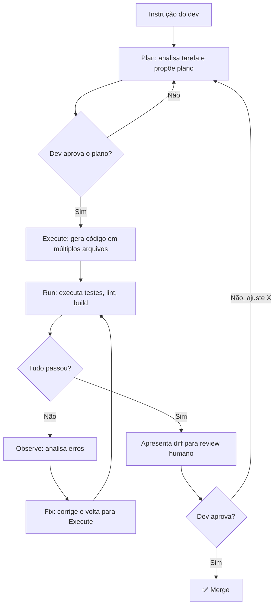

# Cursor — AI-native IDE

> [!abstract] TL;DR
> [[Dicionário de IA#Cursor|Cursor]] é um fork do VS Code que transforma o editor em um ambiente AI-native — não é uma extensão, é a arquitetura inteira reprojetada para IA. Composer faz edições multi-file coerentes porque o modelo tem acesso real à árvore de arquivos e dependências, não apenas ao clipboard. Agent Mode estende isso para autonomia: plan → execute → run → observe → fix sem intervenção humana até o ponto de review. Background Agents permitem paralelismo real — você trabalha num problema enquanto um agente trata outro. As `.cursorrules` definem o "sistema operacional" do AI no seu projeto: padrões, proibições, contexto arquitetural. Em 2026, Cursor tem US$500M ARR e é o IDE padrão para codificação agentic na maioria dos times AI-first.

## O que é

Antes do Cursor, o fluxo de trabalho com AI era de troca de contexto: você escrevia código no editor, copiava um trecho para o ChatGPT ou Copilot Chat, recebia uma sugestão, e colava de volta. Para uma função simples, funciona. Para um refactoring que toca 12 arquivos — middleware, handlers, testes, tipos, documentação — o modelo não tem visibilidade do projeto inteiro e você passa mais tempo gerenciando contexto do que programando.

**Cursor** é um IDE AI-native baseado no VS Code que elimina essa troca de contexto. Diferente de extensões como GitHub Copilot que se plugam ao VS Code, Cursor é um fork que controla o editor inteiro — o que permite ao modelo ver a árvore real de arquivos, entender dependências entre módulos, e gerar diffs coordenados em múltiplos arquivos de uma vez.

A diferença arquitetural é relevante: uma extensão só vê o que você explicitamente cola no contexto; o Cursor pode indexar o projeto inteiro com embeddings, entender imports e re-exports, e decidir quais arquivos são afetados por uma mudança — sem que o dev faça curadoria manual do contexto.

O modelo é uma extensão natural de como IDEs sempre funcionaram: o compilador do VS Code entende a árvore de módulos para dar IntelliSense; o Cursor usa a mesma árvore para dar ao LLM o contexto necessário para edições multi-file. É a mesma ideia de "o editor precisa entender o projeto para ser útil" aplicada a um nível mais alto de abstração.

Outro ângulo: Cursor não resolve o problema de compreensão humana — ele amplifica a velocidade de geração. O dev que usa Cursor sem um processo de review estruturado acumula [[Dicionário de IA#Comprehension debt|comprehension debt]] na mesma proporção que ganha velocidade. A ferramenta é neutra; o processo ao redor dela determina se o resultado é qualidade ou débito.

> [!info] Cursor não é só para TypeScript/JS
> Apesar de ter popularidade inicial em projetos web, Cursor suporta qualquer linguagem que o VS Code suporta — Python, Java, Go, Rust, C++, etc. A indexação funciona para qualquer codebase, e o Agent Mode pode rodar comandos de qualquer toolchain. Times de backend Python e Java são usuários ativos do Cursor em 2026. A diferença é que `.cursorrules` precisam ser adaptadas para cada linguagem/stack.

## Por que importa

Cursor é o IDE onde a maioria dos engenheiros AI-first trabalha em 2026. Saber configurá-lo e usá-lo é equivalente a saber usar o VS Code em 2020 — competência base esperada em qualquer time que adotou desenvolvimento agentic.

Mas além da adoção, Cursor importa porque estabeleceu o modelo mental do que um IDE AI-native deve ser: não um assistant que responde perguntas, mas um parceiro de execução que pode tomar um conjunto de arquivos, entender as relações entre eles, e implementar mudanças coerentes sem que o dev faça curadoria linha por linha. É esse modelo mental — e não a ferramenta específica — que define a categoria.

Dados de adoção em 2026: times AI-first que adotam Cursor reportam 30-50% de redução no tempo de implementação de features e 40% menos tempo de onboarding de novos devs em módulos existentes (porque o Chat pode explicar o código em tempo real). O contra-dado é o que nota [[03 - O comprehension gate]] documenta: PRs com código de AI têm 1,7x mais defeitos quando o review não aplica o comprehension gate. Cursor amplifica a velocidade de geração — o gate amplifica a qualidade do review. Os dois são necessários em conjunto.

## Histórico

Cursor foi lançado em 2022 por quatro co-fundadores do MIT — Aman Sanger, Sualeh Asif, Arvid Lunnemark e Michael Truell — como um experimento para ver até onde uma AI conseguia ir num IDE. A aposta inicial era arriscada: o VS Code já dominava o mercado e tinha uma ecossistema de extensões maduro.

| Ano | Marco |
| --- | ----- |
| 2022 | Lançamento público como fork experimental do VS Code |
| 2023 | Crescimento viral entre devs early adopters; integração com Claude Sonnet e GPT-4 |
| 2024 (jan) | US$60M Series A; Composer beta para edições multi-file |
| 2024 (out) | US$100M ARR; Agent Mode lançado; adoção enterprise |
| 2025 (jan) | US$900M Series B a US$9B de valuation |
| 2025 (2H) | Background Agents GA; MCP integration; US$500M ARR projetado |
| 2026 | Padrão de facto para codificação agentic em IDE |

O crescimento reflete um fenômeno mais amplo: quando a AI ficou boa o suficiente para editar múltiplos arquivos de forma coerente, o valor de ter o modelo integrado ao IDE (em vez de separado) ficou óbvio. O Copilot chegou a responder com Copilot Workspace em 2024, mas o Cursor saiu na frente por controlar a arquitetura do editor inteiro.

O crescimento acelerado (US$0 → US$500M ARR em 3 anos) é comparável ao crescimento inicial do Slack e do Figma — produtos que definiram uma nova categoria ao resolver um problema de coordenação que ferramentas existentes não conseguiam atacar.

## Como funciona

### Features principais

| Feature                | O que faz                                            | Quando usar                   |
| ---------------------- | ---------------------------------------------------- | ----------------------------- |
| **Tab (autocomplete)** | Completa código inline                               | Digitação diária, boilerplate |
| **Chat**               | Conversa sobre código com contexto do projeto        | Perguntas, debugging          |
| **Composer**           | Edição multi-file coordenada com diffs               | Refactoring, features novas   |
| **Agent Mode**         | Planejamento + execução + iteração autônoma          | Tarefas complexas multi-step  |
| **Background Agents**  | Agentes rodando em background enquanto você trabalha | Tarefas longas, paralelas     |

### Composer — o diferencial

Composer é o que separa Cursor de autocomplete. Em vez de sugerir uma linha, ele:

1. Analisa a instrução em linguagem natural
2. Identifica todos os arquivos afetados
3. Gera diffs coordenados mantendo coerência entre arquivos
4. Apresenta preview para review antes de aplicar

**Exemplo de instrução:**
> "Refatore o módulo de autenticação para usar JWT em vez de sessões. Atualize o middleware, os testes, e a documentação."

O Composer geraria diffs em 5-8 arquivos, mantendo consistência entre o middleware, os handlers, os testes, e os tipos.

### Agent Mode

Agent Mode eleva o Composer para autonomia. Em vez de gerar diffs e esperar review, o agente executa o ciclo completo até encontrar um ponto de decisão que requer o humano:



O diferencial do Agent Mode não é a autonomia em si — é a qualidade do loop de feedback. O agente pode rodar 50 iterações de testes em segundos, detectar um padrão de falha, e ajustar a implementação antes de você ver o resultado. O humano entra no loop apenas nos pontos de decisão: aprovar o plano e aprovar o diff final.

1. **Plan** — analisa a tarefa e propõe um plano
2. **Execute** — implementa o plano gerando código
3. **Run** — executa comandos (testes, lint)
4. **Observe** — analisa resultados
5. **Fix** — corrige problemas e repete

### Custo e planos

Cursor usa um modelo de assinatura por desenvolvedor:

| Plano | Preço (2026) | O que inclui |
| ----- | ----------- | ------------ |
| **Hobby** | US$0 | 2.000 requests/mês, modelos limitados |
| **Pro** | US$20/mês | Requests ilimitados (com rate limits), todos os modelos, Background Agents |
| **Business** | US$40/seat/mês | Privacy Mode obrigatório, SSO, logs de uso, suporte enterprise |

O custo relevante para times não é a assinatura — é o custo de modelos top-tier (Opus, GPT-4o) que são cobrados além da assinatura quando você ultrapassa os fast requests mensais. Times que usam Agent Mode intensivamente com modelos Opus podem ter custos de US$100-200/dev/mês, o que muda o cálculo de ROI. Monitorar o uso de requests e calibrar qual modelo usar para qual tarefa não é otimização prematura — é higiene de custo para times de produto.

### .cursorrules — configuração essencial

```markdown
# .cursorrules

## Linguagem e estilo
- Use TypeScript strict mode em todos os arquivos
- Prefira functional components com hooks
- Nomeie arquivos com kebab-case

## Padrões
- Use Zod para validação de schemas
- Error handling com Result pattern, não try/catch
- Testes com Vitest, não Jest

## Proibições
- NUNCA delete arquivos de configuração sem confirmação
- NUNCA modifique testes existentes para fazê-los passar
- NUNCA use any em TypeScript
- NUNCA instale dependências sem listar no chat

## Contexto do projeto
- Este é um SaaS Next.js 15 com App Router
- Backend usa tRPC com Drizzle ORM
- Auth via Clerk
```

### Background Agents — paralelismo real

Background Agents são uma extensão do Agent Mode para tarefas longas: em vez de rodar no foreground (bloqueando o dev até terminar), o agente trabalha assincronamente enquanto você faz outra coisa.

O fluxo típico:
1. Dev cria um Background Agent com uma instrução + escopo de arquivos
2. Agent começa a trabalhar (modificar arquivos, rodar testes, criar issues para casos que não consegue resolver)
3. Dev trabalha em outra tarefa em paralelo
4. Cursor notifica quando o Agent está pausado (pedindo decisão) ou concluído (esperando review)

O caso de uso principal são migrações em escala: 200 arquivos para migrar para uma nova API, um linter novo para aplicar em toda a codebase, ou refactoring de uma convenção obsoleta. Fazer isso manualmente arquivo por arquivo é tedioso e propenso a inconsistências; um Background Agent garante uniformidade e deixa o dev focado nos casos especiais.

A distinção com Agent Mode regular é operacional: Agent Mode é para tarefas onde você vai acompanhar o loop; Background Agent é para tarefas onde você quer só o resultado no final.

> [!tip] Assista: Cursor 2.0 — 5 coisas que você não sabia que ele faz
> **Canal:** Fireship (Code Report) | **Duração:** ~7min | **Idioma:** EN
>
> O vídeo demonstra na prática o que a teoria descreve: git worktrees como mecanismo real de isolamento entre agentes paralelos — cada Background Agent trabalha em sua própria cópia do repositório sem conflitar com o workspace principal. O trecho sobre Composer também esclarece por que o modelo proprietário do Cursor consegue ser mais rápido que Claude e GPT-4 para tarefas de edição multi-arquivo (ao custo de qualidade ligeiramente inferior em tarefas complexas de UI). Trecho de destaque [2:19]: *"A git work tree is basically just a local copy of your code that won't conflict with your main Git workspace. But what that enables is working with multiple agents simultaneously on the same task."*
>
> 🎬 [Assistir no YouTube](https://youtube.com/watch?v=HIp8sFB2GGw)

### Model selection

Cursor permite trocar o modelo base — e a escolha certa por tarefa é uma das alavancas de custo e qualidade mais subestimadas:

| Modelo            | Quando usar                       | Custo | Por quê |
| ----------------- | --------------------------------- | ----- | ------- |
| Claude Sonnet 4.5 | Coding diário, equilíbrio         | Médio | Melhor relação custo-benefício para a maioria das tasks |
| Claude Opus 4     | Refactoring complexo, arquitetura, decisões cross-layer | Alto | Raciocínio mais profundo vale o custo em tasks difíceis |
| GPT-4o / GPT-4.1  | Alternativa se Anthropic tiver lentidão | Médio | Boa alternativa, mas Sonnet é geralmente preferível para código |
| Gemini 2.5 Pro    | Contextos muito grandes (>1M tokens) | Médio | Janela de contexto maior útil em codebases gigantes |
| Cursor Small/Fast | Tab completion, hover hints        | Baixo | Latência baixa para autocompletar; qualidade suficiente para snippets |

A regra de bolso: use Opus apenas quando você está tomando uma decisão arquitetural que vai custar caro reverter. Para tudo o mais, Sonnet é suficiente. O Tab completion com cursor-fast é em uma classe separada — é o modelo que roda a cada keystroke, então latência importa mais que profundidade.

Times bem-sucedidos com Cursor definem essa calibragem como parte das `.cursorrules` ou da documentação de onboarding: "Para tasks de Agent Mode envolvendo auth, pagamento ou infraestrutura — use Opus. Para todo o resto — Sonnet. Para tab completion — Fast." Deixar essa decisão implícita resulta em desenvolvedores usando modelos mais caros por hábito ou mais baratos por economia, nem sempre a escolha certa para a tarefa.

### Atalhos essenciais

| Atalho (Mac) | Atalho (Win/Linux) | Ação |
| ------------ | ------------------ | ---- |
| `Cmd+K` | `Ctrl+K` | Composer inline (edição no arquivo atual) |
| `Cmd+L` | `Ctrl+L` | Abrir Chat |
| `Cmd+I` | `Ctrl+I` | Agent Mode |
| `Cmd+Shift+L` | `Ctrl+Shift+L` | Adicionar seleção ao Chat |
| `Tab` | `Tab` | Aceitar sugestão de autocomplete |
| `Esc` | `Esc` | Rejeitar sugestão |
| `@` (no prompt) | `@` | Mencionar arquivo/pasta/doc no contexto |

### Por que o Composer gera diffs coerentes

A pergunta relevante não é "o Composer consegue editar múltiplos arquivos?" — qualquer LLM pode fazer isso num chat se você colar o contexto. A pergunta é: *por que o Cursor faz isso melhor do que um LLM standalone?*

Três razões técnicas:

1. **Indexação real do projeto.** Cursor indexa o projeto inteiro com embeddings. Quando você pede "refatore a autenticação para JWT", o modelo não age no vazio — o Cursor já sabe quais arquivos importam o módulo de auth, quais testes cobrem aquelas funções, e quais tipos precisam ser atualizados. Essa indexação é invisível ao dev mas crítica para a coerência do resultado.

2. **Diff viewer nativo.** O editor apresenta as mudanças como diffs inline, arquivo por arquivo, antes de aplicar qualquer coisa. Você vê exatamente o que muda em cada arquivo e pode aceitar ou rejeitar individualmente. Num LLM standalone, você receberia blocos de código sem contexto visual de onde cada coisa se encaixa.

3. **Execução de comandos no terminal.** No Agent Mode, o Cursor pode rodar testes, lint, e build commands diretamente — e usar os resultados como feedback para a próxima iteração. Um LLM standalone não tem esse canal; você precisaria copiar os erros e colar manualmente.

Essa integração de indexação + diff viewer + execução é o que separa "AI dentro do IDE" de "AI colada ao IDE".

> [!info] Por que fork e não extensão?
> A pergunta óbvia é: por que a Anysphere fez um fork do VS Code em vez de criar uma extensão, como o Copilot? A resposta técnica é controle: como extensão, você só pode fazer o que a API de extensão do VS Code permite — e essa API não expõe acesso total ao editor, ao sistema de arquivos, ou à capacidade de executar comandos com contexto do editor. Como fork, a Anysphere pode modificar o editor em qualquer nível — incluindo como os diffs são apresentados, como o contexto é construído, e como o terminal se integra com o agente. O trade-off é manutenção: um fork precisa incorporar cada update do VS Code, o que é trabalho constante. O Cursor apostou que o controle valia o custo — e em 2026, o resultado parece validar a aposta.

## Configuração

### Setup inicial recomendado

1. Criar `.cursorrules` na raiz do projeto com padrões, proibições e contexto arquitetural
2. Configurar `.cursorignore` (equivalente ao .gitignore para contexto AI)
3. Selecionar modelo padrão (Sonnet para maioria dos casos)
4. Configurar atalhos de teclado: `Cmd+K` (Composer inline), `Cmd+L` (Chat), `Cmd+I` (Agent Mode)
5. Ativar Privacy Mode se o projeto tiver código proprietário ou dados sensíveis
6. Indexar o projeto na primeira vez (Cursor > Settings > Index Codebase)

A ordem importa: configurar `.cursorrules` antes de indexar garante que o modelo já tenha o contexto correto ao gerar código pela primeira vez.

### Privacy Mode e segurança

Cursor tem um ponto de tensão com equipes enterprise: o código do projeto é enviado ao modelo na nuvem para processamento. Para projetos com IP sensível ou dados regulados, isso é um problema.

**Privacy Mode** resolve isso parcialmente: ativa o modo onde o Cursor não usa código do usuário para treino do modelo. Mas o código ainda trafega para os servidores da Anysphere (empresa por trás do Cursor) para processamento da resposta.

Para restrições mais severas (código que não pode sair do ambiente), as alternativas são:
- Cursor com modelos locais via Ollama (experimental em 2026, performance inferior)
- Claude Code (que pode rodar localmente sem enviar código para servidores externos em algumas configurações)
- Windsurf com plano Enterprise (opções de self-hosting)

A decisão é de política de segurança do time, não técnica — o que importa é que a política seja explícita. Times que adotam Cursor sem discutir onde o código vai estão fazendo uma escolha de segurança por omissão.

### Setup inicial recomendado

### .cursorignore

```
node_modules/
dist/
build/
.next/
coverage/
*.lock
*.log
```

Exclui diretórios irrelevantes do contexto AI, economizando [[Dicionário de IA#Token|tokens]] e melhorando qualidade.

### MCP e extensões de contexto

Desde 2025, Cursor suporta o **Model Context Protocol (MCP)** — o padrão aberto que permite ao agente acessar ferramentas externas além do código local. Com MCP configurado, o agente no Cursor pode:

- Consultar documentação externa (Stripe docs, AWS SDK, suas próprias APIs internas)
- Buscar em Jira/Linear por tickets relacionados
- Ler logs de produção diretamente no editor
- Criar PRs no GitHub sem sair do IDE

A configuração é via arquivo de configuração do MCP (`.cursor/mcp.json`), seguindo o mesmo padrão dos outros clientes MCP. Ver [[15 - MCP — o protocolo universal]] para o protocolo em detalhes.

O impacto prático: com MCP, o agente deixa de trabalhar apenas com o código local e passa a ter visibilidade do sistema mais amplo — o que muda a qualidade das sugestões para cenários de integração. A diferença entre "implementa esse endpoint" e "implementa esse endpoint consistente com como chamamos a Stripe API nas outras rotas" é a diferença entre um agente sem contexto externo e um agente com MCP.

### Referências de modelo no contexto

A notação `@` no Cursor permite incluir contexto específico em qualquer prompt:

| Notação | O que inclui |
| ------- | ------------ |
| `@arquivo.ts` | Arquivo específico no contexto |
| `@pasta/` | Todos os arquivos de uma pasta |
| `@docs` | Documentação indexada do projeto |
| `@web` | Busca na web (docs externas) |
| `@git` | Histórico de commits recentes |
| `@cursor-rules` | Referencia explicitamente as regras do projeto |

A notação `@` é o mecanismo de curadoria de contexto do Cursor — o que o torna diferente de "cole tudo no chat". O dev escolhe o que o modelo precisa ver para essa tarefa específica, sem abrumar o contexto com arquivos irrelevantes.

## Cursor no workflow do time

Adotar Cursor individualmente é simples. Adotá-lo como time requer algumas decisões explícitas:

**Padronizar o `.cursorrules`.** O `.cursorrules` deveria ser versionado no repositório, não ser um arquivo pessoal de cada dev. Quando cada desenvolvedor tem seu próprio `.cursorrules`, o código gerado pela AI segue padrões diferentes por desenvolvedor — o oposto da consistência que você quer. O arquivo canônico vai na raiz do projeto, é commitado no git, e é atualizado por consenso do time quando os padrões evoluem.

**Workflow Git com Agent Mode.** Agent Mode pode gerar mudanças em muitos arquivos rapidamente — o que cria pressão sobre o workflow de PR. Times bem-sucedidos com Cursor definem o escopo de cada Agent Mode run em termos de PRs: "um Agent Mode run = um PR com escopo único". Quando o agente sai do escopo e toca arquivos não previstos, o dev rejeita as mudanças extras e abre uma issue separada. Isso mantém o PRs revisáveis e o [[03 - O comprehension gate|comprehension gate]] aplicável.

**Review de .cursorrules como parte do onboarding.** Um dev novo no time deveria ler o `.cursorrules` nos primeiros dois dias — antes de rodar qualquer Agent Mode task. O arquivo documenta as decisões arquiteturais que moldam o comportamento da AI no projeto; entendê-las é entender uma parte importante do contexto técnico do projeto.

**Background Agents e ownership.** Quando um Background Agent gera 170 PRs (exagero proposital), quem faz review? Esse é um ponto de tensão que times não resolvem antes de adotar — e deveriam. A regra que funciona: quem criou o Agent faz o review dos resultados. Se o scope for demais para uma pessoa, o scope do Agent estava grande demais.

## Casos práticos

O valor do Cursor emerge melhor em cenários onde a coordenação multi-file é o gargalo. Quatro cenários concretos:

**Cenário 1 — Refactoring de autenticação.** Time precisa migrar de sessões baseadas em cookies para JWT. Sem Cursor: o dev identifica manualmente cada arquivo que usa `req.session`, atualiza um por um, e cruza os dedos para que os tipos do TypeScript apontem tudo que faltou. Com Cursor + Agent Mode: instrução em uma linha, o agente identifica todos os 12 arquivos afetados (middleware, handlers, testes, tipos, documentação), gera diffs coordenados, roda os testes, e corrige o que quebrou. O dev faz review do resultado final.

**Cenário 2 — Feature nova com TDD.** Dev quer implementar um módulo de notificações. Usando Plan Mode: escreve a spec em linguagem natural → agente propõe um plano (interfaces, serviço, repositório, testes) → dev ajusta o plano → agente implementa seguindo a spec. O resultado é diferente do vibe coding: o plano aprovado pelo dev é o contrato; o agente implementa o contrato, não improvisa além dele.

**Cenário 3 — Debugging de produção.** Erro de produção com stack trace obscuro. Dev cola o stack trace no Chat com contexto dos arquivos relevantes (@ menciona os arquivos). O Cursor vê a implementação real, identifica o problema, propõe um fix cirúrgico no arquivo correto. O dev revisa e aplica. Tempo: 10 minutos em vez de 2 horas.

**Cenário 4 — Background Agent para migração de banco.** Time tem 200 arquivos usando a ORM antiga que precisa ser migrada. Dev cria um Background Agent com a tarefa de migrar arquivo por arquivo segundo as regras do `.cursorrules`. Enquanto isso, trabalha em outra coisa. O agente vai abrindo issues para os casos que não consegue resolver automaticamente. Ao final de 30 minutos, tem 170 arquivos migrados e uma lista de 30 casos especiais para o dev resolver.

**Cenário 5 — Onboarding num codebase desconhecido.** Dev novo na equipe precisa entender um módulo complexo antes de fazer uma mudança. Em vez de passar horas lendo código: abre o Chat, menciona `@pasta/modulo` e pergunta "explica a arquitetura desse módulo e como os dados fluem". O Cursor indexa o módulo real, não documentação genérica, e gera uma explicação baseada no código atual. Isso não substitui a compreensão — o dev ainda precisa ler e verificar — mas comprime horas de leitura linear em minutos de exploração guiada.

**Cenário 6 — Geração de testes unitários.** Dev acabou de implementar um serviço de cálculo de frete. Pede ao Agent Mode para gerar testes unitários cobrindo os edge cases. O agente analisa o código, identifica os branches e condições, e gera testes para cada caminho. O dev revisa os testes (usando o [[03 - O comprehension gate|comprehension gate]]: "eu entendo por que esse teste existe?"), rejeita os que cobrem casos triviais demais, e aceita os que cobrem edge cases reais. Resultado: 80% de coverage sem escrever um único test case manualmente.

## Armadilhas

> [!warning] Não configurar .cursorrules
> Usar Cursor sem `.cursorrules` é como usar um IDE sem nenhuma configuração. O AI vai gerar código no estilo que aprendeu no training data — que pode ser completamente inconsistente com o seu projeto. Em projetos TypeScript strict, o agente vai usar `any` livremente. Em projetos com padrão Result, vai usar try/catch. O `.cursorrules` é o que converte um AI genérico em um colaborador do seu projeto específico.

> [!warning] Ignorar .cursorignore
> Sem um `.cursorignore` configurado, o Cursor pode tentar incluir `node_modules`, `dist`, e outros diretórios no contexto de indexação. Isso desperdiça tokens, torna as respostas mais lentas, e pode confundir o modelo com código de dependências em vez de código do projeto. O `.cursorignore` segue o mesmo formato do `.gitignore` — copiar um ponto de partida do `.gitignore` é um bom começo.

> [!warning] Aceitar diffs do Composer sem review
> Composer é poderoso mas não onisciente. Ele pode gerar código correto nos casos cobertos e introduzir um problema silencioso em um edge case que o modelo não considerou. O [[03 - O comprehension gate|comprehension gate]] se aplica aqui: se você não consegue explicar por que cada mudança foi feita dessa forma específica, não mergeia. Cursor facilita muito aceitar tudo de uma vez — resista ao botão "Accept All" sem ler.

> [!warning] Usar Agent Mode para tudo
> Para edições simples de 1 arquivo, Chat ou Tab são mais rápidos e baratos. Agent Mode tem overhead de planejamento que só vale quando a tarefa é complexa o suficiente para exigir múltiplas iterações. Regra de bolso: se você consegue descrever o resultado em uma instrução simples e o escopo é um arquivo, use Chat. Se envolve múltiplos arquivos ou decisões que dependem de output de build/testes, use Agent Mode.

> [!warning] Não calibrar o modelo por tarefa
> Usar Opus para autocomplete diário é custo sem retorno. Usar o modelo mais barato para refactoring de auth é risco sem economia. Cursor permite trocar o modelo por sessão — aproveite isso. A tabela de seleção de modelos nesta nota existe exatamente para esse calibre.

> [!warning] Não avaliar as implicações de Privacy Mode para o projeto
> O código enviado ao Cursor para processamento trafega pelos servidores da Anysphere, mesmo com Privacy Mode ativo (que só impede uso para treino). Para projetos com código proprietário sensível, dados regulados (PII, saúde, finanças), ou contratos com cláusulas de confidencialidade, essa política precisa ser avaliada explicitamente — não assumida como segura. O time de segurança ou legal precisa estar na decisão de adoção, não apenas o time de produto.

> [!warning] Usar .cursorrules como arquivo pessoal em vez de regra de time
> Quando cada dev tem seu próprio `.cursorrules` (ou nenhum), o Cursor age de forma diferente para cada pessoa no mesmo projeto. O resultado é inconsistência no código gerado — exatamente o problema que as regras deveriam resolver. O `.cursorrules` é um artefato de time, versionado no repositório, revisado como qualquer outro arquivo de configuração.

## Quando não usar o Cursor

Cursor é a ferramenta certa para a maioria dos cenários de desenvolvimento local. Mas há contextos onde ele não é a melhor escolha:

- **Automação em CI/CD**: Cursor é uma ferramenta de desktop. Para tarefas que precisam rodar em pipelines de CI (ex: auto-fix de lint issues, geração de docs, code review automático), Claude Code é mais adequado — roda no terminal, sem UI.
- **Projetos com restrição severa de segurança**: código não pode sair do ambiente local. Cursor sempre faz round-trip pela nuvem. Alternativas: modelos locais via Ollama (qualidade inferior) ou revisão manual.
- **Edições pontuais simples**: para mudar uma variável de nome ou corrigir um typo, o Cursor é over-engineered. Um simples find-and-replace ou a busca do VS Code resolvem.

Saber quando não usar uma ferramenta é tão importante quanto saber usá-la — o padrão de "usar Agent Mode para tudo" é tão problemático quanto não usá-lo. A nota [[11 - Comparativo — qual ferramenta para qual tarefa]] faz esse mapeamento explícito para todas as ferramentas do galho.

## Como explicar em inglês

O Cursor é uma ferramenta onde o vocabulário técnico é majoritariamente em inglês — tanto pela procedência da ferramenta quanto pelas discussões de time em contexto internacional.

| PT | EN | Contexto de uso |
| -- | -- | --------------- |
| Regras de projeto | Project rules / `.cursorrules` | "We define our project rules in `.cursorrules` to constrain the agent" |
| Modo agente | Agent Mode | "I used Agent Mode to handle the full refactoring" |
| Edição multi-arquivo | Multi-file editing | "Composer handles multi-file editing with coordinated diffs" |
| Agente em segundo plano | Background Agent | "I have a Background Agent running the migration while I work on the feature" |
| Diff coordenado | Coordinated diff | "The agent generated a coordinated diff across 8 files" |
| Contexto de projeto | Project context | "Cursor indexes the project context to understand dependencies" |
| Ignorar arquivos | Cursor ignore | "Add large generated files to `.cursorignore`" |
| Seleção de modelo | Model selection | "Switch to Opus for architecture decisions, Fast model for tab completion" |
| Modo de plano | Plan mode | "Use plan mode before implementation to review the approach" |
| Janela de contexto | Context window | "@ mention files to include them in the context window" |

> [!tip] Como falar sobre o Cursor em entrevista
> "Our team uses Cursor as the primary AI-native IDE. The key differentiator is that the agent has real project context — it indexes the file tree and dependencies — rather than just seeing what you paste. We define project rules in `.cursorrules` to constrain the agent to our standards: TypeScript strict mode, our testing framework, and explicit prohibitions like never modifying tests to make them pass. Agent Mode is reserved for multi-file tasks; for single-file edits, we use Chat or tab completion."

## O que vem a seguir

Cursor define o padrão para IDEs AI-native, mas não é a única abordagem para codificação agentic. Duas alternativas complementares merecem atenção:

**Claude Code** (nota [[05 - Claude Code — terminal-first agent]]) é o polo oposto: em vez de um IDE visual com diffs e diff viewer, é um agente de linha de comando que opera no terminal. Não tem a interface polida do Cursor, mas tem autonomia maior — pode modificar arquivos, rodar comandos, e operar em servidores remotos sem um IDE. Times que preferem trabalho no terminal ou precisam de automação em pipelines de CI usam Claude Code onde o Cursor não alcança.

**Windsurf** (nota [[07 - Windsurf e Cascade]]) é o concorrente mais próximo do Cursor em posicionamento — IDE visual, multi-file, com agent mode próprio (Cascade). O diferencial de posicionamento do Windsurf em 2025 era custo menor; o diferencial do Cursor era qualidade de indexação e Agent Mode mais maduro. A escolha entre os dois depende do perfil do time e das constraints de budget.

Uma terceira dimensão é o **comparativo cross-tool**: quando faz sentido usar Cursor versus Claude Code versus Copilot versus Aider? A nota [[11 - Comparativo — qual ferramenta para qual tarefa]] responde esse mapeamento — incluindo os cenários onde a combinação de ferramentas (ex: Cursor para desenvolvimento local + Claude Code para CI automação) é superior a qualquer ferramenta isolada.

Para quem quer configurar o contexto do agente de forma mais sistemática — além do `.cursorrules` do Cursor — a nota [[14 - agents.md e configuração de projeto]] trata do padrão `agents.md` / `CLAUDE.md` que funciona cross-tool: o mesmo arquivo de configuração funciona no Claude Code e em outros agentes que respeitam o padrão, sem que você precise duplicar as regras em cada ferramenta.

## Veja também

- [[02 - Vibe coding vs engenharia disciplinada]] — o risco de aceitar diffs sem entender
- [[03 - O comprehension gate]] — por que review com compreensão ainda é necessário com Agent Mode
- [[05 - Claude Code — terminal-first agent]] — alternativa terminal para quem prefere CLI
- [[06 - GitHub Copilot e Copilot Agents]] — comparação com a extensão de maior adoção corporativa
- [[07 - Windsurf e Cascade]] — concorrente com proposta de valor em custo
- [[11 - Comparativo — qual ferramenta para qual tarefa]] — quando usar Cursor vs as demais ferramentas
- [[14 - agents.md e configuração de projeto]] — configuração cross-tool além do .cursorrules
- [[15 - MCP — o protocolo universal]] — como estender o contexto do Cursor além do código local

## Referências

- **Cursor** — [*Documentation*](https://cursor.com/docs) (2026). Referência oficial: features, shortcuts, configuração de Rules.
- **Cursor Blog** — [*Series B Announcement*](https://cursor.com/blog/series-b) (2025). US$900M levantado, contexto do crescimento para US$9B de valuation.
- **Pragmatic Engineer** — [*The IDE of the AI Era*](https://newsletter.pragmaticengineer.com/p/cursor) (2024). Análise aprofundada da arquitetura e diferenciação do Cursor vs extensões.
- **Dev.to** — *Cursor Rules Best Practices 2026*. Guia comunitário de `.cursorrules` com exemplos reais.
- **Cursor Directory** — [*cursorrules.com*](https://cursor.directory). Biblioteca de `.cursorrules` organizados por stack: Next.js, Spring Boot, FastAPI, Rust, Go, e outros.
- **Anysphere Privacy Policy** — [*cursor.com/privacy*](https://cursor.com/privacy) (2026). Política oficial sobre como código é processado, armazenado e usado para treino — leitura obrigatória antes de adotar em contexto enterprise.
- **Y Combinator Discussion** — *Best practices for .cursorrules in large codebases* (Hacker News, 2025). Discussão sobre configuração de `.cursorrules` em projetos com múltiplos times e repositórios.
