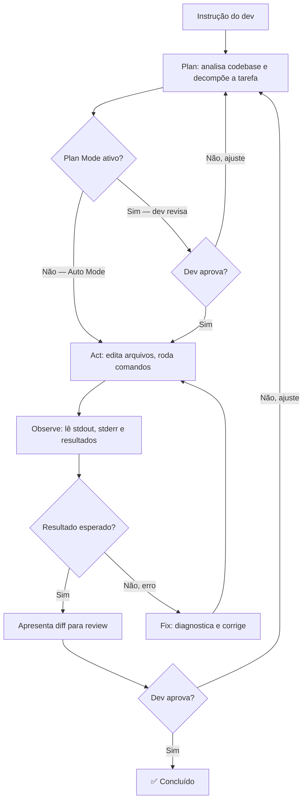

# Claude Code — terminal-first agent

> [!abstract] TL;DR
> [[Dicionário de IA#Claude Code|Claude Code]] é o agente de terminal da Anthropic — roda no CLI, indexa o codebase inteiro, executa comandos, e itera autonomamente até resolver o problema. É o agente com melhor reasoning para código em 2026, ideal para debugging complexo, refactoring pesado, e workflows de CI/CD. O sistema de hooks e permissions dá controle granular sobre o que o agente pode fazer — desde bloquear comandos destrutivos até disparar lint automático após cada edição. Skills (SKILL.md) e CLAUDE.md são os arquivos de configuração que transformam o agente genérico em um especialista do seu projeto: o CLAUDE.md define o contexto persistente (stack, padrões, proibições), as Skills definem os processos recorrentes (como criar uma migration, como escrever um endpoint, como aumentar coverage). A distinção central em relação ao Cursor: Claude Code é um agente que edita; Cursor é um editor com agente. O primeiro exige mais configuração e comfort no terminal, mas oferece autonomia real em ambientes headless.

## O que é

Imagine que você tem um bug reproduzível apenas sob carga alta em produção, um codebase de 80.000 linhas, e nenhuma interface gráfica disponível — apenas SSH. Ou que você precisa rodar um agente de código no pipeline de CI sem abrir um IDE. Esses são os cenários para os quais o Claude Code foi desenhado.

**Claude Code** é o agente de codificação terminal-first da Anthropic — um CLI que indexa o codebase inteiro, executa comandos, analisa resultados, e itera autonomamente até resolver o problema. Diferente do Cursor, que é um IDE visual com preview de diffs e interface gráfica, Claude Code opera inteiramente no terminal. Isso não é limitação: é o que permite integrá-lo em servidores remotos, containers, pipelines de CI/CD, e workflows de automação onde uma GUI simplesmente não cabe.

A distinção fundamental é de modelo mental: o Cursor é um *editor* que ganhou inteligência; Claude Code é um *agente* que ganhou a capacidade de editar. No Cursor, você trabalha *com* o agente; no Claude Code, você *delega* ao agente.

## Por que importa

> [!info] Dados com prazo de validade
> "Melhor reasoning do mercado" e liderança em SWE-bench são afirmações de um ponto no tempo (2026) — a corrida entre Anthropic, OpenAI e Google se move rápido o suficiente para que benchmarks de hoje fiquem defasados em poucos meses. Ao ler esta seção depois, verifique se o modelo e os números ainda batem com o estado da arte atual.

Existem centenas de AI coding tools, mas Claude Code tem diferenciais estruturais que importam na prática:

- **Melhor reasoning** do mercado para código em 2026: Claude Opus 4 lidera em SWE-bench (resolução de issues reais do GitHub) e em benchmarks de debugging complexo — o mesmo modelo usado pelo Claude Code Pro.
- **Terminal-native** — o único agente de codificação que funciona de forma completa em SSH, containers, CI/CD e ambientes headless sem nenhuma GUI.
- **Extensível via [[Dicionário de IA#MCP (Model Context Protocol)|MCP]]** — não fica preso à codebase local. Conecta com banco de dados, GitHub, Slack, browser, e qualquer ferramenta via Model Context Protocol.
- **Hooks programáticos** — interceptam e validam ações do agente antes de executar, permitindo [[Dicionário de IA#Guardrail|guardrails]] customizados que vão além do prompt.
- **CLAUDE.md como memória persistente** — o agente lembra o contexto do projeto entre sessões sem você precisar explicar tudo de novo a cada conversa.

O caso de uso mais subestimado é exatamente onde IDEs falham: automação de tarefas de engenharia que rodam sem intervenção humana em pipelines de CI, servidores de staging, ou jobs agendados.

## Histórico

Claude Code foi lançado como preview em dezembro de 2024 e passou para GA em 2025. A velocidade de evolução foi acelerada — em menos de dois anos, o produto passou de CLI básico para plataforma completa de automação com SDK público:

| Período | Marco |
| ------- | ----- |
| Dez/2024 | Preview público: CLI com CLAUDE.md, edição de arquivos, execução de comandos |
| Abr/2025 | GA: hooks, permissions granular, MCP nativo, Skills (SKILL.md) |
| Jun/2025 | SDK público: build de agentes customizados em Python e TypeScript sobre o Claude Code |
| Set/2025 | Desktop app (Mac e Windows): TUI com preview de diffs sem terminal puro |
| Nov/2025 | Workflow orchestration: spawn de múltiplos subagentes em paralelo via scripts JavaScript |
| Fev/2026 | Web search nativo integrado sem necessidade de MCP externo |
| 2026 | Padrão `opusplan` estabelecido: Opus planeja decisões, Sonnet executa a implementação |

> [!info] Dados com prazo de validade
> Esta linha do tempo termina em 2026 e `opusplan` é o padrão vigente *hoje* — mas a cadência de releases do Claude Code tem sido rápida (múltiplos marcos por ano). Espere que a Anthropic estabeleça um novo padrão de split modelo-planejador/modelo-executor conforme novos modelos forem lançados; confirme a versão atual antes de citar `opusplan` como estado da arte.

A curva de adoção acelerou porque CI/CD, automação, e servidores remotos são cenários que IDEs gráficos não cobrem — e Claude Code é o único agente de codificação com raciocínio de primeira linha nesse espaço.

## Como funciona

### Loop agentic

O Claude Code opera em um loop agentic contínuo: planejar → agir → observar → corrigir. Diferente de ferramentas que apenas sugerem código, ele completa o ciclo inteiro — edita arquivos, roda os testes, lê o resultado, e corrige até o critério de sucesso ser atingido.



### Modos de operação

| Modo                  | Comportamento                               | Quando usar                    |
| --------------------- | ------------------------------------------- | ------------------------------ |
| **Interativo**        | Chat no terminal, pede permissão para ações | Desenvolvimento diário         |
| **Plan Mode**         | Apenas analisa, não modifica                | Entender código, planejar      |
| **Auto Mode**         | Executa sem pedir permissão (whitelist)     | Tarefas repetitivas confiáveis |
| **Headless/Dispatch** | API, sem interação humana                   | CI/CD, automação               |

A progressão típica numa sessão: começa em **Plan Mode** (entender o escopo, validar a abordagem), muda para **Interativo** (implementar com confirmações), e — se a tarefa é mecânica e bem definida — ativa **Auto Mode** para a parte repetitiva. Headless é reservado para pipelines onde não existe um humano na loop.

Um erro comum é entrar em Auto Mode desde o início: o agente pode fazer escolhas que pareciam razoáveis mas que você teria redirecionado no modo interativo. Auto Mode é para quando você já sabe o que o agente vai fazer — não para descobrir junto com ele.

### CLAUDE.md — o sistema operacional do agente

Pense no `CLAUDE.md` como um onboarding document para o agente: ele lê esse arquivo no início de cada sessão e calibra seu comportamento de acordo. Um `CLAUDE.md` bem escrito elimina a necessidade de repetir contexto toda vez — stack, padrões, proibições, comandos de build e teste.

A diferença entre um `CLAUDE.md` minimal e um bem elaborado é visível nos resultados: com um arquivo genérico, o agente vai usar `console.log` em produção, criar testes com Jest quando o projeto usa Vitest, e propor padrões de error handling que você nunca adotou. Com um arquivo específico, ele já sabe as regras antes de escrever a primeira linha.

```markdown
# CLAUDE.md

## Sobre o projeto
Este é o backend do EstudeMe, um SaaS de flashcards.
Stack: Node.js 22, TypeScript, Fastify, Drizzle, PostgreSQL.

## Regras de código
- Sempre use strict TypeScript
- Error handling com Result<T, E> pattern
- Nunca use console.log em produção — use o logger (pino)
- Testes com Vitest, mínimo 80% coverage

## Comandos úteis
- `npm test` — roda testes
- `npm run lint` — verifica linting
- `npm run build` — compila TypeScript
- `npm run db:migrate` — roda migrations

## Arquitetura
- Clean Architecture: entities → use-cases → adapters → infra
- Cada módulo em src/modules/<nome>/
- Shared code em src/shared/
```

> [!tip] Assista: Claude Code Best Practices — Code w/ Claude (Anthropic)
> **Canal:** Anthropic | **Duração:** ~25min | **Idioma:** EN
>
> Talk oficial de Cal, engenheiro da Anthropic que trabalha no sistema de prompts do Claude Code. O vídeo explica o que o CLAUDE.md realmente faz sob o capô — não é "memória do agente", é contexto inserido no início de cada conversa. Esse detalhe de implementação muda como você escreve o arquivo: em vez de "lembrete", é um onboarding document que o agente lê do zero a cada sessão. Trecho de destaque [10:51]: *"Claude Code doesn't really have memory. And so the main way we share state across sessions or across our team is this CLAUDE.md file. When we start Claude Code, if there's this file in the working directory, it's just plopped into context — these are important instructions the developer left for you."*
>
> 🎬 [Assistir no YouTube](https://youtube.com/watch?v=gv0WHhKelSE)

> [!question]- O `CLAUDE.md` é suficiente para controlar o agente, ou você ainda precisa de hooks?
> O `CLAUDE.md` instrui via linguagem natural — o agente tenta seguir as regras, mas pode "esquecer" sob pressão de um prompt complexo. Hooks são código: interceptam a ação antes de executar e podem bloqueá-la independente do que o agente "decidiu". Para convenções de código, `CLAUDE.md` basta. Para segurança (proibir `rm -rf`, bloquear `git push --force`), use hooks. Os dois são complementares.

### Sistema de hooks

Hooks interceptam ações do agente em pontos específicos do lifecycle:

```json
// .claude/hooks.json
{
  "hooks": {
    "PreToolUse": [
      {
        "matcher": "bash",
        "command": "python3 .claude/validate-command.py"
      }
    ],
    "PostToolUse": [
      {
        "matcher": "write_file",
        "command": "npx eslint --fix $FILE"
      }
    ]
  }
}
```

| Hook                | Quando dispara                   | Uso típico                  |
| ------------------- | -------------------------------- | --------------------------- |
| `PreToolUse`        | Antes de executar uma ferramenta | Bloquear comandos perigosos |
| `PostToolUse`       | Depois de executar               | Auto-lint, auto-format      |
| `PermissionRequest` | Quando pede permissão            | Delegar decisão a outro LLM |
| `Stop`              | Quando o agente termina          | Notificação, logging        |

A distinção entre `PreToolUse` e `PermissionRequest` é operacional: `PreToolUse` dispara para todas as ações de uma categoria (ex: toda vez que o agente tenta rodar um comando bash); `PermissionRequest` dispara apenas quando o agente percebe que a ação exige permissão explícita. Para guardrails de segurança, `PreToolUse` é mais confiável — não depende do agente reconhecer que precisa de permissão.

### Permissions — controle granular

```bash
# Permitir operações de leitura sem perguntar
claude config set permissions.allow "read_file,list_dir,grep_search"

# Permitir comandos específicos de terminal
claude config set permissions.allow "bash(npm test),bash(npm run lint)"

# Bloquear comandos perigosos
claude config set permissions.deny "bash(rm -rf),bash(git push --force)"
```

### Skills — capacidades modulares

Skills são pastas com instruções especializadas para tarefas recorrentes. A ideia é extrair do `CLAUDE.md` o que é "sempre verdadeiro" sobre o projeto e separar em skills o que é "como fazer tarefas específicas". Uma skill de `database-migration` sabe exatamente qual template usar, quais comandos rodar, e como nomear os arquivos — sem você precisar explicar toda vez.

```
.claude/skills/
├── database-migration/
│   └── SKILL.md          # Instruções para criar migrations (template, naming, rollback)
├── api-endpoint/
│   └── SKILL.md          # Template para novos endpoints (rota, handler, schema, teste)
└── test-coverage/
    └── SKILL.md          # Como aumentar coverage (identify gaps, write unit/integration)
```

A invocação é simples: `claude /database-migration "criar migration de adicionar campo email_verified na tabela users"`. O agente lê a skill e segue o processo sem improvisação.

### Workflows avançados

#### Dispatch (CI/CD)

O modo headless é onde o Claude Code se distancia definitivamente dos IDEs gráficos: você roda o agente como qualquer outro step do pipeline, sem interface, com output estruturado em JSON.

```bash
# Usar Claude Code em CI/CD — output JSON para parsing no pipeline
claude --headless --message "Fix all lint errors and run tests" \
  --output json > result.json

# Verificar resultado no pipeline
if jq -e '.success == false' result.json; then
  echo "Claude Code reported failures"
  exit 1
fi
```

#### Sessões paralelas (tmux)

Múltiplas sessões do Claude Code em paralelo via `tmux` replicam o que os Background Agents do Cursor fazem na cloud — mas localmente, com mais controle e sem custo adicional de infra:

```bash
# Terminal 1: agente no backend
tmux new-session -d -s backend "claude 'implement the auth module'"

# Terminal 2: agente no frontend
tmux new-session -d -s frontend "claude 'create the login component'"

# Monitorar os dois
tmux attach -t backend   # switch entre sessões com Ctrl+B + s
```

#### Workflow orchestration (multi-agent)

Desde novembro de 2025, Claude Code suporta orquestração de múltiplos subagentes via scripts JavaScript — um orquestrador despacha tasks em paralelo para agentes especializados:

```bash
# Exemplo: orquestrador que roda múltiplos agentes em paralelo
claude --workflow review-pr.js --args '{"pr": 42, "repo": "myorg/myapp"}'
```

O orquestrador típico: lê contexto (codebase, PR diff), divide em tasks independentes (security review, test coverage, style check), despacha um agente por task em paralelo, e sintetiza os resultados.

### MCP — extensibilidade

Claude Code suporta MCP servers nativamente:

```json
// .claude/mcp.json
{
  "servers": {
    "postgres": {
      "command": "npx",
      "args": ["-y", "@modelcontextprotocol/server-postgres"],
      "env": {"DATABASE_URL": "postgresql://..."}
    },
    "github": {
      "command": "npx",
      "args": ["-y", "@modelcontextprotocol/server-github"]
    }
  }
}
```

## Custo e modelos

Claude Code é cobrado por tokens — cada edição de arquivo, cada comando executado, cada análise de output consome tokens. Em sessões longas com Opus, o custo pode chegar a US$20-50/dia.

> [!info] Dados com prazo de validade
> Preços por token e nomes de modelo (Haiku 4.5, Sonnet 4.6, Opus 4) mudam com frequência — a Anthropic já revisou preços e lançou novas versões de modelo várias vezes desde o preview do Claude Code. Confira a [documentação oficial de preços](https://docs.anthropic.com/claude-code) antes de usar estes números para orçamento real.

| Modelo | Custo (input/output por 1M tokens) | Ideal para |
| ------ | ---------------------------------- | ---------- |
| Claude Haiku 4.5 | US$0,80/US$4 | Lookups pontuais, leitura, tasks triviais |
| Claude Sonnet 4.6 | US$3/US$15 | Desenvolvimento diário, refactoring, testes |
| Claude Opus 4 | US$15/US$75 | Debugging complexo, decisões arquiteturais, ADRs |

A estratégia mais eficiente para sessões longas é o **`opusplan`**: Opus planeja (análise, decisão de abordagem, decomposição de tasks), Sonnet executa (escrita de código, edição de arquivos, iteração). O split faz sentido porque o gargalo de custo está no raciocínio de alto nível, não na execução linha a linha.

```bash
# Monitorar custo em tempo real (ferramenta de terceiros)
npm install -g ccusage
ccusage           # custo da sessão atual
ccusage --day     # custo acumulado do dia
ccusage --week    # custo semanal
```

> [!warning] Auto Mode + Opus = fatura surpresa
> Sessões longas em Auto Mode com Opus podem consumir 2-5 milhões de tokens. Instale o `ccusage` antes de ativar qualquer automação longa e defina um limite de alerta diário no `~/.claude/settings.json`.

## Comparativo com Cursor

| Aspecto                  | Claude Code                | Cursor                      |
| ------------------------ | -------------------------- | --------------------------- |
| **Interface**            | Terminal (CLI/TUI)         | IDE (GUI)                   |
| **Reasoning**            | ★★★★★ (melhor do mercado)  | ★★★★ (depende do modelo)    |
| **Autocomplete**         | ★★ (não é o foco)          | ★★★★★                       |
| **Multi-file visual**    | ★★★ (diffs no terminal)    | ★★★★★ (preview visual)      |
| **Automação/CI**         | ★★★★★ (headless mode)      | ★★ (focado em interativo)   |
| **Extensibilidade**      | ★★★★★ (hooks, MCP, skills) | ★★★ (.cursorrules, limited) |
| **Curva de aprendizado** | Alta (terminal-first)      | Média (GUI familiar)        |
| **Privacy**              | Código processa na Anthropic (API) | Código processa na Anysphere (Cursor) |
| **Offline/on-prem**      | ✗ (requer rede + API key)   | ✗ (requer rede por padrão)  |

A escolha entre Claude Code e Cursor raramente é exclusiva — muitos times usam os dois em camadas: Cursor para desenvolvimento interativo e revisão visual de diffs; Claude Code para automação em CI, debugging SSH, e workflows headless. A nota [[11 - Comparativo — qual ferramenta para qual tarefa]] mapeia esses cenários em detalhe.

## Privacy e segurança

Uma pergunta frequente ao adotar Claude Code em contexto enterprise: *onde o código vai?*

Todo o código enviado ao Claude Code passa pela API da Anthropic — o mesmo caminho que qualquer requisição ao Claude. Os dados são processados nos servidores da Anthropic nos EUA. Por padrão, a Anthropic não usa as conversas da API para treinar modelos (diferente do produto consumer); mas a política exata varia conforme o tier de contrato.

Para projetos com restrições de segurança:
- **`.claudeignore`** — exclui arquivos específicos do contexto (análogo ao `.gitignore`): segredos em `.env`, dados sensíveis, propriedade intelectual restrita.
- **CLAUDE.md com instrução explícita** — "nunca inclua o conteúdo de `src/crypto/` no contexto" é uma regra que o agente segue.
- **Modelos locais via Ollama + MCP** — para projetos onde o código não pode sair do ambiente local, você pode usar Claude Code configurado para chamar modelos locais via proxy MCP (qualidade inferior, mas dado nunca sai da máquina).

Comparando com o Cursor: ambos fazem round-trip pelo provedor cloud, mas têm políticas e controles diferentes. Leia o privacy policy do seu provedor antes de adotar em projetos com data regulada (LGPD, HIPAA, SOC 2).

## Casos práticos

**Cenário 1 — Debugging de race condition.** Um bug aparece apenas sob carga alta em produção — stack trace não é determinístico, mas você tem logs. `claude "Analise os logs em /var/log/app.log, identifique o pattern de concorrência que causa a inconsistência, e gere uma correção com teste que reproduza o problema"`. O agente lê os logs, analisa os workers envolvidos, localiza o shared state sem proteção, e entrega fix + teste de concorrência.

**Cenário 2 — Migração em larga escala via CI.** Time decidiu migrar Axios para fetch nativo em 150 arquivos. `claude --headless --message "Migre todos os usos de axios para fetch nativo em src/, preservando os error handling patterns, e rode os testes ao final" --output json > result.json`. O agente roda no pipeline, modifica os 150 arquivos, executa `npm test`, e reporta JSON com status de cada arquivo.

**Cenário 3 — Documentação técnica completa.** Módulo novo precisa de documentação de API, diagrama de sequência e guia de integração. `claude "Leia src/payments/, gere a spec OpenAPI, um diagrama Mermaid do fluxo de pagamento, e o guia de integração para o README"`. Em 10 minutos, você tem documentação que levaria uma tarde.

**Cenário 4 — Code review automático em PRs.** Em GitHub Actions: `claude --headless "Revise as mudanças deste PR em busca de: (1) problemas de segurança, (2) violações dos padrões do CLAUDE.md, (3) testes faltando. Output em JSON com severidade e número de linha"`. O output alimenta comentários automáticos no PR.

**Cenário 5 — Setup de novo projeto.** `claude "Configure Node.js 22 com TypeScript strict, Fastify, Drizzle ORM (PostgreSQL), Vitest com coverage report, ESLint + Prettier, e crie o CLAUDE.md com as convenções deste projeto"`. Scaffolding completo — incluindo o CLAUDE.md que o próprio agente vai usar nas próximas sessões.

## Armadilhas

> [!warning] Não criar CLAUDE.md
> Sem um `CLAUDE.md` com contexto do projeto, o agente gera código genérico — padrão errado de error handling, imports de bibliotecas que você não usa, nomenclatura fora da convenção. O `CLAUDE.md` é o que transforma o agente genérico em um especialista do seu projeto.

> [!warning] Auto Mode sem hooks de segurança
> Auto Mode dá ao agente permissão para executar qualquer comando sem confirmação humana. Sem hooks bloqueando comandos destrutivos (`rm -rf`, `git push --force`, `DROP TABLE`), um edge case no prompt pode causar dano irreversível. Configure os hooks antes de ativar Auto Mode em projetos de produção.

> [!warning] Não monitorar o custo
> Sessões longas com Opus em Auto Mode podem custar US$20-50/dia. Instale o `ccusage` desde o início e configure um alerta de orçamento. "Deixar rodando enquanto durmo" é a receita para uma fatura surpresa de US$200.

> [!warning] Pular o Plan Mode
> Entrar direto em implementação sem revisar o plano é o equivalente de pedir que um dev sênior comece a codar sem alinhar os requisitos. Plan Mode existe para o agente propor abordagem e você revisar antes de qualquer edição. Use-o especialmente em tasks complexas ou de alto risco.

> [!warning] Contexto acumulado entre tasks não relacionadas
> Claude Code acumula contexto ao longo de uma sessão. Entre tasks independentes, use `/clear` para limpar o contexto — contexto acumulado aumenta custo e pode contaminar o raciocínio do agente. Antes do `/clear`, salve o estado crítico com `/checkpoint` se precisar retomar.

> [!warning] Não definir `.claudeignore`
> Sem definir quais arquivos o agente pode ler, ele pode incluir no contexto arquivos `.env` (segredos de API), logs grandes, ou arquivos gerados que inflam o custo sem acrescentar contexto útil. Adicione ao `.claudeignore` tudo que não é código relevante.

## Como explicar em inglês

Claude Code tem vocabulário técnico específico — especialmente relevante em entrevistas ou discussões de time sobre automação de engenharia:

| PT | EN | Contexto de uso |
| -- | -- | --------------- |
| Agente de terminal | Terminal-first agent | "We use Claude Code as our terminal-first agent for CI automation" |
| Arquivo de configuração do agente | CLAUDE.md | "Our CLAUDE.md defines project conventions for the agent" |
| Modo automático | Auto Mode | "Auto Mode lets the agent execute without human confirmation" |
| Modo sem interface | Headless mode | "We run Claude Code in headless mode in our CI pipeline" |
| Modo de planejamento | Plan Mode | "I always review the plan before switching out of Plan Mode" |
| Gancho de interceptação | Hook | "We use a PreToolUse hook to block dangerous shell commands" |
| Capacidade modular | Skill | "We created a database-migration skill with all the migration patterns" |
| Sessão paralela | Parallel session | "I had two parallel sessions: backend and frontend in separate tmux windows" |
| Limite de contexto | Context window | "Use /clear between unrelated tasks to reset the context window" |
| Custo por sessão | Session cost | "We monitor session cost with ccusage to stay within budget" |

> [!tip] Como falar sobre Claude Code em entrevista
> "We use Claude Code as our primary CLI agent for complex debugging and CI automation. The key configuration is `CLAUDE.md` — it gives the agent persistent context about the project: our stack, coding conventions, commands for tests and migrations. We also use hooks to block destructive commands in auto mode. For architecture decisions, we use Opus in Plan Mode; for implementation, Sonnet for cost control. Compared to Cursor, Claude Code excels in headless environments and has stronger reasoning for complex debugging scenarios."

## O que vem a seguir

Claude Code é a âncora terminal do galho — a referência para quando a tarefa exige raciocínio profundo, automação sem GUI, ou integração em pipelines. Mas o terminal é só um dos caminhos possíveis: o passo natural agora é olhar para o extremo oposto do espectro de adoção. Enquanto Claude Code exige conforto com CLI e é a escolha de quem já vive em SSH e pipelines, o [[06 - GitHub Copilot e Copilot Agents|GitHub Copilot]] chegou primeiro, está embutido no editor que a maioria dos devs já usa, e hoje é o maior ecossistema de codificação por IA do mercado — a diferença não é só de interface, é de filosofia: de um agente que você invoca deliberadamente para um assistente que já está lá, integrado ao fluxo do dia a dia. Os passos naturais:

**OpenCode** (nota [[10 - OpenCode — o harness open source]]) é a alternativa open-source — mesmo paradigma de agente CLI, sem dependência de Anthropic. Útil para times que precisam de controle total da infraestrutura ou querem rodar modelos locais sem round-trip pela nuvem.

**MCP** (nota [[15 - MCP — o protocolo universal]]) transforma o Claude Code em um agente conectado ao mundo real — banco de dados, GitHub, browser, APIs externas. Entender MCP é entender como expandir o raio de ação do agente além da codebase local.

**agents.md** (nota [[14 - agents.md e configuração de projeto]]) generaliza o `CLAUDE.md` para um padrão cross-tool: o mesmo arquivo de configuração funciona no Claude Code, no Cursor, e em qualquer agente que respeita o padrão. Em vez de manter `.cursorrules` e `CLAUDE.md` separados e desincronizados, você mantém um único source of truth.

Para o comparativo entre Claude Code e as outras ferramentas do galho — incluindo quando Cursor, Aider, ou OpenCode são mais adequados — veja a nota [[11 - Comparativo — qual ferramenta para qual tarefa]].

> [!question]- Como você decidiria entre Claude Code e Cursor para uma tarefa de refactoring que toca 30 arquivos?
> A pergunta certa não é "qual ferramenta é melhor", mas "qual o custo de revisão?". Se o refactoring é em código que você vai precisar entender em profundidade depois (componentes de arquitetura, regras de negócio críticas), o Cursor tem vantagem — o diff viewer visual facilita a revisão arquivo a arquivo. Se é uma migração mecânica (rename de field, update de API deprecated, aplicação de novo eslint rule), Claude Code em headless mode é mais eficiente: você dá a instrução, ele roda, você valida o resultado via testes — sem precisar revisar cada arquivo individual.

## Veja também

- [[03-Dominios/Tecnologia/IA/Claude Code/index|Trilha Claude Code]] — aprofundamento completo em 6 galhos: mental model, configuração, hooks, skills/MCP, workflows e automação
- [[02 - Vibe coding vs engenharia disciplinada]] — a disciplina de revisão que se aplica mesmo com agentes autônomos
- [[03 - O comprehension gate]] — por que entender o código do agente ainda é necessário em Auto Mode
- [[04 - Cursor — AI-native IDE]] — alternativa IDE para quem prefere GUI e diff visual
- [[10 - OpenCode — o harness open source]] — alternativa open-source ao Claude Code
- [[11 - Comparativo — qual ferramenta para qual tarefa]] — quando usar Claude Code vs Cursor vs Aider
- [[14 - agents.md e configuração de projeto]] — padrão cross-tool para o CLAUDE.md
- [[15 - MCP — o protocolo universal]] — como estender o Claude Code com ferramentas externas
- [[16 - O loop agentic — plan, act, observe]] — o ciclo plan→act→observe que o Claude Code implementa

## Referências

- **Anthropic** — [*Claude Code Documentation*](https://docs.anthropic.com/claude-code) (2026). Referência oficial: comandos, configuração de CLAUDE.md, hooks, skills, MCP.
- **Anthropic Blog** — *Introducing Claude Code* (2025). Anúncio do GA com casos de uso e benchmarks iniciais.
- **claudefa.st** — *Claude Code Best Practices* (2026). Guia comunitário com patterns de CLAUDE.md e hooks reais.
- **Builder.io** — *Claude Code Workflows* (2026). Patterns avançados para automação: dispatch mode, sessões paralelas, integração com GitHub Actions.
- **ccusage** — *CLI de monitoramento de custo* (2026). Ferramenta open-source para rastrear tokens e custo por sessão do Claude Code.
- **Anthropic** — [*Claude Code SDK*](https://docs.anthropic.com/claude-code/sdk) (2025). Documentação do SDK para construir agentes customizados sobre o Claude Code em Python e TypeScript.
- **GitHub** — *anthropics/claude-code-action* (2026). GitHub Action oficial para rodar Claude Code em pipelines de CI: code review automático, fix de lint, geração de documentação.
- **Pragmatic Engineer** — *The Rise of Terminal-First AI Agents* (2026). Análise de por que o paradigma terminal-first ganha tração em times de engenharia que já têm workflows robustos no terminal.

