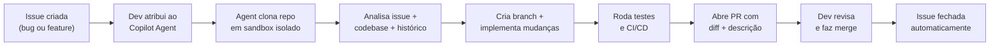

# GitHub Copilot e Copilot Agents

> [!abstract] TL;DR
> GitHub Copilot é o assistente de código mais adotado do mercado — integrado nativamente ao VS Code e ao ecossistema GitHub. Começou como autocomplete baseado em Codex em 2021 e, em 2025, expandiu para agentes autônomos que resolvem issues diretamente no repositório. Forte em autocomplete em tempo real, integração enterprise e CI/CD nativo via GitHub Actions; menos capaz em reasoning profundo e refactoring multi-arquivo comparado a Claude Code ou Cursor. Diferencial único: é o único agente que conecta issues → branches → PRs → merge dentro do próprio GitHub, sem sair do fluxo Git.

## O que é

Imagine que você tem um dev júnior muito rápido sentado ao seu lado 24h por dia — ele não inventa arquitetura nem resolve bugs complexos, mas completa trechos com precisão surpreendente e nunca reclama de repetição. Essa é a proposta original do **GitHub Copilot**.

**GitHub Copilot** é o assistente de código da Microsoft/GitHub, baseado inicialmente no modelo Codex (derivado do GPT-3) e expandido em 2024 para suportar múltiplos modelos: GPT-4o, Claude 3.5 Sonnet e Gemini 1.5 Pro. Em 2026, opera em três camadas complementares:

1. **Copilot inline** — autocomplete em tempo real no editor enquanto você digita
2. **Copilot Chat** — assistente conversacional dentro do IDE (VS Code, JetBrains, Vim, Neovim)
3. **Copilot Agents** — agentes autônomos que operam no repositório GitHub (Business/Enterprise)

A diferença fundamental entre Copilot e ferramentas como Claude Code ou Cursor é o *locus* de operação: Copilot vive dentro do IDE e do GitHub, não no terminal. Isso o torna o mais integrado ao fluxo Git padrão, mas também o mais dependente do ecossistema Microsoft.

**A linha evolutiva do produto** segue um padrão claro: cada versão expande a autonomia. Começou como "sugestão de linha" (2021), virou "sugestão de função" (2022), depois "conversa sobre código" (2023), depois "executar no terminal" (2025 — Agent Mode), e agora "resolver issue no repositório" (2025 — Copilot Agents). O padrão sugere que a próxima fronteira é agentes que interagem com infraestrutura — CI/CD configuração, deploy, monitoring. Isso converge com o que o [[16 - O loop agentic — plan, act, observe|loop agentic]] prevê como maturação dos agentes de codificação.

## Por que importa

- **Adoção massiva** — mais de 30 milhões de desenvolvedores usam Copilot em 2026; é o assistente com maior base instalada
- **Integração GitHub nativa** — único agente com acesso direto a issues, PRs, Actions, Code Review API e Codespaces
- **Enterprise pronto** — planos Business/Enterprise incluem compliance SOC2, audit logs, IP indemnity e controle de políticas por organização
- **Free tier real** — plano gratuito inclui 2.000 completions/mês e 50 mensagens de chat — suficiente para projetos menores
- **Multi-model** — desde 2024, o usuário escolhe qual modelo usar (GPT-4o, Claude Sonnet, Gemini) na mesma assinatura
- **Ecossistema VS Code** — Copilot é o único assistente integrado nativamente ao marketplace de extensões do VS Code, com suporte a debugging integrado, test runner e source control no mesmo contexto

A posição dominante do Copilot no mercado cria um efeito de rede: a maioria dos tutoriais, integrações e extensões de terceiros foi construída com ele em mente. Adotar Copilot significa ter acesso ao maior ecossistema de tooling ao redor de um assistente de código.

> [!info] Data de validade deste número
> "30 milhões de desenvolvedores em 2026" é um número de adoção — desses envelhecem rápido num mercado que ainda está em corrida de crescimento. Ao ler esta nota depois de 2026, trate como ordem de grandeza histórica, não como métrica atual; confira o número corrente na documentação oficial do GitHub.

> [!question]- Copilot e Claude Code podem ser usados juntos no mesmo projeto?
> Sim, e é uma combinação comum. Copilot fica ativo no editor para autocomplete em tempo real enquanto você escreve. Claude Code é acionado no terminal para tarefas que exigem planejamento profundo — debugging, refactoring, análise de arquitetura. Os dois usam contextos independentes (um via extensão VS Code, outro via terminal), então não há conflito. O risco é duplicação de custo: se você já paga Copilot Business ($19/seat) e usa Claude Code intensamente (usage-based), avalie se o ROI justifica ambos.

Um detalhe que surpreende quem vem de outras ferramentas: o Copilot não é um chat que você acessa quando quer ajuda. É um **co-piloto que está sempre ativo** — cada tecla que você pressiona no editor é uma oportunidade de sugestão. A ergonomia muda: você para de sair do editor para buscar exemplos no Stack Overflow e passa a aceitar (Tab) ou rejeitar (Esc) sugestões no ritmo do código.

Estudo publicado pela própria GitHub em 2022 com desenvolvedores usando Copilot mostrou aumento de 55% na velocidade de conclusão de tarefas específicas em comparação com grupo controle sem Copilot. O efeito é maior em boilerplate e tarefas repetitivas; menor em design e debugging.

Um detalhe metodológico importante: o estudo usou uma tarefa isolada (implementar servidor HTTP), não um dia de trabalho real. Em contextos de produção com múltiplos contextos e decisões de arquitetura, o ganho medido tende a ser menor. Ainda assim, o impacto no autocomplete de código rotineiro é consistentemente observado por desenvolvedores que adotam a ferramenta.

## Histórico

| Período | Evento |
| ------- | ------ |
| Jun 2021 | Technical Preview baseado em Codex (OpenAI) — primeiro assistente de autocomplete com LLM |
| Jun 2022 | GA para indivíduos ($10/mês); suporte VS Code, JetBrains, Neovim |
| Nov 2022 | Plano Business ($19/seat) com audit logs e políticas de organização — marca a entrada enterprise |
| Nov 2023 | Copilot Chat GA; modelos GPT-4 adotados — transição de autocomplete para conversacional |
| Out 2024 | Multi-model: GPT-4o, Claude 3.5 Sonnet, Gemini 1.5 Pro; plano gratuito com 2k completions/mês |
| Nov 2024 | Copilot Extensions SDK — terceiros criam agentes integrados ao chat via `@menção` |
| Fev 2025 | Agent Mode GA no VS Code — loop plan-edit-run autônomo dentro do editor |
| Abr 2025 | Copilot Agents GA para Enterprise — resolve issues remotamente e abre PRs automaticamente |
| 2026 | Copilot Enterprise ($39/seat) com fine-tuning em código privado do repositório |

> [!info] Data de validade deste histórico
> Datas, versões de modelo (Claude 3.5 Sonnet, Gemini 1.5 Pro) e nomes de planos deste histórico são um retrato de um momento específico do produto — a Microsoft itera Copilot com frequência alta. Ao ler depois de 2026, trate a tabela como linha do tempo até o ponto do registro, não como estado atual; confira a changelog oficial do GitHub para o presente.

## Como funciona

### Fill-in-the-Middle — o mecanismo do autocomplete

Por que o autocomplete do Copilot parece ler sua mente? O segredo é a técnica **Fill-in-the-Middle (FIM)**: o modelo não recebe só o prefixo (o que você já escreveu), mas também o sufixo (o que vem depois do cursor). Dado esse contexto bidirecional, o modelo deve "preencher o meio".

```
[PREFIXO]: function calcularImposto(valor: number, aliquota: number) {
[SUFIXO]:  }
[MEIO a preencher]: return valor * (aliquota / 100);
```

Isso é fundamentalmente diferente de um modelo que só completa "para frente". O Copilot enxerga a assinatura da função, o corpo ao redor e até imports no topo do arquivo — tudo entra no contexto da chamada à API. O modelo escolhe a completion com maior probabilidade dado esse contexto bidirecional.

O FIM foi introduzido no paper *"Efficient Training of Language Models to Fill in the Middle"* (Bavarian et al., 2022, OpenAI). O truque é treinar o modelo com exemplos onde o meio foi removido e deve ser previsto — isso força o modelo a aprender coerência bidirecional, não só "completar para frente". Modelos treinados com FIM são tipicamente melhores em autocompletar funções, preencher argumentos e gerar código que precisa se encaixar em estruturas já existentes.

Além do FIM, a janela de contexto do Copilot inclui:
- Arquivo atual aberto
- Outros arquivos abertos no editor (heurística de relevância por similaridade de tokens)
- `.github/copilot-instructions.md` do repositório
- Fragmentos de testes relacionados

### Agent Mode vs Copilot Agents

Confusão comum: **Agent Mode** (no VS Code) e **Copilot Agents** (no GitHub.com) são produtos distintos.

| Dimensão | Agent Mode (VS Code) | Copilot Agents (GitHub) |
| --------- | -------------------- | ----------------------- |
| **Onde roda** | Localmente, no seu editor | Na infraestrutura do GitHub |
| **Trigger** | Você inicia a conversa | Issue atribuída ao Copilot |
| **Acesso** | Arquivos locais + terminal | Repositório remoto + Actions |
| **Custo** | Individual ($10) ou acima | Business/Enterprise apenas |
| **Loop** | Plan → edit → run → fix | Clone → implement → PR |

### Copilot Agents — fluxo de issue a PR



**Por que o sandbox importa?** O Copilot Agent roda em ambiente isolado do GitHub — não na sua máquina. Isso garante auditabilidade via logs de Actions, mas também cria uma limitação real: o agent não acessa secrets locais, bancos de dados de produção ou APIs privadas. É um agente de repositório, não de infraestrutura.

O fluxo prático:

1. Você escreve uma issue clara com critérios de aceitação ("Quando email está vazio, mostrar erro inline")
2. Atribui `@copilot` na issue ou usa a label configurada
3. Copilot Agent cria uma branch e implementa a solução
4. Roda os testes e o CI
5. Abre um PR com as mudanças — você revisa normalmente
6. Ao fazer merge, a issue é fechada automaticamente pelo PR

**O que acontece quando o CI falha?** Se os testes rodados pelo Agent falharem, ele tenta diagnosticar e corrigir automaticamente — até um limite de tentativas. Se não conseguir resolver, abre o PR mesmo assim marcado com o status de CI com falha. O dev recebe o diff + log de erro e decide se corrige manualmente ou fecha o PR. Isso é um comportamento diferente do [[05 - Claude Code — terminal-first agent|Claude Code]], que pode continuar iterando localmente sem abrir um PR prematuro.

**Custo por execução:** Copilot Agents consomem créditos de "premium requests" (para modelos avançados). Cada execução de Agent pode usar dezenas a centenas de requests dependendo da complexidade da issue. Monitore o consumo especialmente no início para calibrar quais issues são boas candidatas para delegação.

> [!tip] Assista: How the GitHub Copilot coding agent works | GitHub Checkout
> **Canal:** GitHub (oficial) | **Duração:** ~7min | **Idioma:** EN
>
> Tim Rogers (engenheiro do GitHub) demonstra ao vivo o fluxo completo: atribuir múltiplas issues simultaneamente ao Copilot, acompanhar o progresso via PR draft e session view, e acionar o agent diretamente do Copilot Chat sem sair do editor. O vídeo inclui um caso real — o billing team do GitHub usou o agent para aumentar cobertura de testes enquanto a equipe trabalhava em outras prioridades. Trecho de destaque [5:31]: *"you've got like a almost a team of AI interns who can be doing stuff for you in the background and helping you to get more done, and hopefully, leaving the fun stuff for you."*
>
> 🎬 [Assistir no YouTube](https://youtube.com/watch?v=1GVBRhDI5No)

### github-copilot-instructions.md — o CLAUDE.md do Copilot

Todo agente tem seu arquivo de instruções persistente. Para o Copilot, é `.github/copilot-instructions.md`. Funciona da mesma forma que o CLAUDE.md do Claude Code: é inserido no contexto de cada sessão, não é "memória" do modelo.

```markdown
# .github/copilot-instructions.md

## Padrões do projeto
- TypeScript strict, ESM modules
- React com functional components e hooks
- Testes com Vitest + Testing Library

## Convenções de código
- Commits seguem Conventional Commits (feat, fix, chore...)
- PRs devem ter descrição e checklist de QA
- Branch naming: feature/<nome>, fix/<nome>, chore/<nome>

## Proibições
- Não use jQuery, Lodash ou moment.js
- Não modifique arquivos de CI sem review explícita
- Não exponha secrets hardcoded — use process.env
```

**Limite:** o arquivo suporta até ~8.000 tokens. Acima disso, o contexto é truncado sem aviso. Para projetos grandes, priorize as regras mais críticas no topo do arquivo.

Sem esse arquivo, o Copilot gera código no estilo "padrão do modelo" — sem as convenções do seu projeto. É a diferença entre um freelancer que conhece seu codebase e um que escreveu o primeiro commit hoje.

### Copilot Extensions

Lançado em novembro 2024, o **Copilot Extensions SDK** permite que terceiros e equipes internas criem agentes especializados que aparecem dentro do Copilot Chat via `@menção`:

```
@datadog explain this error
@sentry show recent issues in production
@empresa-privada check our internal API docs
```

Isso transforma o Copilot em um hub de agentes especializados — não substitui agentes externos, mas os coordena dentro do fluxo do desenvolvedor no IDE. Similar ao que o [[15 - MCP — o protocolo universal|MCP]] faz para outros agentes, mas restrito ao ecossistema GitHub/VS Code.

Para desenvolvedores que trabalham em empresas com ferramentas internas (wiki interna, sistema de tickets próprio, APIs privadas), o Extensions SDK permite criar um `@empresa` que acessa esses recursos diretamente do Copilot Chat, sem precisar sair do editor.

> [!question]- O multi-model do Copilot é real ou marketing? Faz diferença escolher o modelo?
> É real e faz diferença dependendo da tarefa. GPT-4o é mais rápido e bom para autocomplete e explicações diretas. Claude 3.5 Sonnet tende a ser melhor para raciocínio sobre código complexo e refactoring — mais cauteloso, menos alucinação. Gemini 1.5 Pro tem janela de contexto maior (1M tokens), útil para analisar repositórios grandes inteiros. A troca de modelo é em tempo real via dropdown no Copilot Chat. Dica prática: use GPT-4o no dia a dia e troque para Claude quando a tarefa exigir raciocínio mais profundo.

### Agent Mode no VS Code — loop local plan-edit-run

O **Agent Mode** é o modo conversacional avançado do Copilot dentro do VS Code. Diferente do chat simples (que responde uma pergunta por vez), o Agent Mode opera num loop autônomo:

```
Instrução do dev
       ↓
  Plano de ação
       ↓
  Edita arquivos
       ↓
   Roda terminal
       ↓
  Observa output
       ↓
  Corrige se erro
       ↓
Apresenta resultado
```

Na prática, você descreve o que quer fazer e o Agent Mode:
- Lê os arquivos relevantes do projeto
- Propõe um plano
- Faz as edições necessárias (com preview de diff)
- Executa comandos no terminal integrado
- Corrige erros automaticamente até a tarefa ser concluída

A diferença em relação ao Copilot Chat simples é o **loop autônomo com execução**: o Agent Mode não para para perguntar a cada passo — ele age, observa e corrige. O dev aprova no final (ou interrompe se a direção estiver errada).

**Quando usar Agent Mode vs Copilot Agents:**
- **Agent Mode**: tarefas que exigem acesso local (arquivos, terminal, servidor de dev rodando)
- **Copilot Agents**: tarefas que vivem inteiramente no repositório remoto (issues, CI, PRs)

### Tiers de funcionalidade

| Feature                 | Free          | Individual   | Business | Enterprise |
| ----------------------- | ------------- | ------------ | -------- | ---------- |
| Autocomplete            | ✅ (2k/mês)   | ✅ ilimitado  | ✅        | ✅          |
| Chat                    | ✅ (50/mês)   | ✅            | ✅        | ✅          |
| Agent Mode (VS Code)    | ❌             | ✅            | ✅        | ✅          |
| Copilot Agents (GitHub) | ❌             | ❌            | ✅        | ✅          |
| Multi-model             | ❌             | ✅            | ✅        | ✅          |
| Fine-tuning privado     | ❌             | ❌            | ❌        | ✅          |
| Audit logs              | ❌             | ❌            | ✅        | ✅          |
| IP indemnity            | ❌             | ❌            | ✅        | ✅          |

> [!info] Data de validade desta tabela
> Preços, nomes de tier e limites de quota (2k completions/mês, 50 mensagens de chat) mudam com frequência nesse mercado. Trate esta tabela como referência estrutural de *como* o Copilot segmenta funcionalidades, não como tabela de preços vigente; confira o pricing atual em github.com/features/copilot.

## Quando usar Copilot

A decisão não é "Copilot vs Cursor vs Claude Code" — é "qual ferramenta para qual momento do dia".

| Cenário | Recomendação | Por quê |
| ------- | ------------ | ------- |
| Autocomplete rápido no fluxo de escrita | ✅ Copilot inline | FIM + contexto bidirecional é imbatível para completions |
| Triagem automática de issues claras | ✅ Copilot Agents | Fluxo nativo issue → PR sem sair do GitHub |
| Enterprise com compliance e IP indemnity | ✅ Copilot Business/Enterprise | Único com garantias contratuais de copyright |
| Refactoring complexo multi-arquivo | ⚠️ Cursor ou Claude Code | Composer e reasoning mais profundo ganham aqui |
| Debugging de race condition ou memory leak | ⚠️ Claude Code | Loop agentic + terminal + ferramentas externas são necessários |
| Self-hosting ou modelo proprietário on-prem | ❌ Copilot não suporta | Use Claude Code via Bedrock ou soluções open-source |
| Automação fora do ecossistema GitHub | ❌ Copilot Agents não alcança | Agents são restritos ao repositório; sem acesso a infra externa |

**O padrão que funciona em times maduros:**
- Copilot inline ativado o tempo todo para autocomplete
- Claude Code ou Cursor acionados quando a tarefa exige planejamento e reasoning
- Copilot Agents para o backlog de issues de manutenção

## Privacidade e segurança

Uma pergunta frequente ao adotar Copilot em empresas: *"nosso código vai para treinar o modelo da Microsoft?"*. A resposta depende do plano:

| Plano | Snippets enviados para API? | Usado para treinar? | Retenção de logs |
| ----- | --------------------------- | ------------------- | ---------------- |
| Free / Individual | Sim (por padrão) | Opt-out disponível | 28 dias |
| Business | Sim | **Não** (contratualmente) | Configurável |
| Enterprise | Sim, mas dentro de VNet | **Não** + IP indemnity | Audit logs completos |

**IP indemnity** é o diferencial do Business/Enterprise: se o código gerado por Copilot violar copyright de terceiro, a Microsoft cobre os custos legais. Isso é relevante para empresas que precisam de garantias contratuais sobre o código gerado.

**O que vai para a API:** em cada completion, o Copilot envia o contexto de até ~6.000 tokens (prefixo + sufixo + arquivos abertos relevantes). O código enviado nunca é o repositório inteiro — é um snapshot do contexto imediato. Em planos Business/Enterprise, esse tráfego não é usado para retreinamento.

**Comparação com alternativas:** Claude Code com servidor próprio (on-premise via Amazon Bedrock ou Google Cloud Vertex) oferece mais controle — o código nunca sai do seu cloud tenant. Cursor usa os mesmos modelos via API mas não oferece on-prem. Para regulações estritas (HIPAA, PCI-DSS), Copilot Enterprise + Microsoft Azure é a opção mais auditável dentro do ecossistema GitHub.

> [!warning] Privacidade no plano gratuito
> No plano Free, as completions podem ser usadas para melhorar os modelos por padrão. Para desativar: GitHub Settings → Copilot → Policies → "Allow GitHub to use my code snippets" → Off. Em contextos profissionais, use Business ou Enterprise para garantias contratuais.

## Comparativo com concorrentes

| Aspecto                | Copilot         | Cursor  | Claude Code     |
| ---------------------- | --------------- | ------- | --------------- |
| **Autocomplete**       | ★★★★★           | ★★★★    | ★★              |
| **Reasoning**          | ★★★             | ★★★★    | ★★★★★           |
| **Multi-file**         | ★★★             | ★★★★★   | ★★★★            |
| **GitHub integration** | ★★★★★           | ★★      | ★★★ ([[Dicionário de IA#MCP (Model Context Protocol)\|MCP]])  |
| **Enterprise**         | ★★★★★           | ★★★     | ★★★             |
| **CI/CD native**       | ★★★★★           | ★       | ★★★★ (headless) |
| **Privacidade**        | ★★★★ (Enterprise) | ★★★   | ★★★★★ (on-prem) |
| **Custo**              | $0-39/mês       | $20/mês | Usage-based     |

**Modelo de pricing:** Copilot usa assinatura mensal por seat, não usage-based. Para um dev que usa intensamente, é mais previsível e frequentemente mais barato que modelos de pagamento por token. Para um dev casual, pode ser caro — compare o custo mensal com o que seria gasto se usasse Claude Code ou Cursor num modelo usage-based no mesmo ritmo de uso.

**Conclusão prática:** Copilot, Claude Code e Cursor não são substitutos diretos — são complementares. Copilot lidera em autocomplete e integração Git; Claude Code lidera em debugging e reasoning; Cursor lidera em refactoring multi-arquivo com feedback visual. Times produtivos frequentemente usam os três.

## Casos práticos

### Caso 1 — Triagem automática de issues de bug

**Cenário:** Você tem 15 issues abertas reportadas por usuários. São bugs reais, mas reproduzir cada um manualmente levaria horas.

**Com Copilot Agents:**
1. Atribua as issues mais claras ao Copilot Agent com `@copilot`
2. O agent analisa o stacktrace, localiza o arquivo relevante e propõe a correção
3. Cada issue vira um PR independente com correção + testes de regressão
4. Você revisa em batch — aprova os simples, descarta os que exigem contexto de negócio

**Quando funciona bem:** bugs com stacktrace claro, issues com critérios de aceitação precisos, testes de regressão já existentes no projeto.

**Quando não funciona:** bugs de estado complexo, race conditions, problemas de performance que dependem de dados reais de produção.

### Caso 2 — Autocomplete em boilerplate repetitivo

**Cenário:** Você está criando endpoints CRUD para 5 entidades numa API REST. Trabalho repetitivo mas exige atenção às convenções do projeto.

**Com Copilot inline:**
- Escreve o handler de `GET /users` completo e correto
- Começa a digitar `GET /products` — Copilot preenche o padrão com os campos corretos da entidade Products
- Você ajusta apenas os campos específicos; economiza ~80% do tempo de digitação

**Dica:** Mantenha o primeiro handler bem escrito aberto no editor enquanto escreve os demais. O Copilot usa arquivos abertos como contexto — um bom exemplo ensina o padrão implicitamente via FIM.

### Caso 3 — Review de PR assistida

**Cenário:** PR aberto por colega com 300 linhas modificadas. Você precisa fazer review mas está com tempo limitado.

**Com Copilot Chat no VS Code:**
```
@workspace /explain #PR-423
```
Copilot resume as mudanças, explica o impacto e aponta potenciais problemas. Você ainda precisa revisar — mas com contexto, não às cegas.

### Caso 4 — Onboarding de dev novo no projeto

**Cenário:** Dev novo entra no time. Ele conhece a linguagem mas não as convenções do projeto — padrões de naming, estrutura de testes, quais bibliotecas usar.

**Estratégia com Copilot:**
1. Crie um `.github/copilot-instructions.md` detalhado com as convenções
2. O Copilot passa a ensinar as convenções *enquanto* o dev novo escreve código — cada suggestion segue o padrão
3. Quando o dev aceita uma suggestion e ela viola uma regra, o Copilot Chat pode explicar o porquê

**Efeito prático:** o `copilot-instructions.md` funciona como onboarding contínuo — mais eficaz do que um documento de README que ninguém lê, porque as regras aparecem no momento em que são relevantes.

**Limitação:** o arquivo não substitui mentoria humana nem revisão de código. Serve como guardrail de estilo, não como formação de julgamento técnico.

## Armadilhas comuns

> [!warning] "Copilot é o melhor para tudo"
> Copilot lidera em autocomplete e integração GitHub. Para reasoning profundo, debugging de race conditions ou refactoring cross-layer, [[05 - Claude Code — terminal-first agent|Claude Code]] e [[04 - Cursor — AI-native IDE|Cursor]] são superiores. Escolha a ferramenta certa para cada tarefa — elas são complementares, não substitutas.

> [!warning] Confiar cegamente no Copilot Agent
> PRs geradas por agents precisam de review com o mesmo rigor — ou mais — do que PRs humanas. O Agent não tem contexto de negócio, não conhece decisões arquiteturais não documentadas, e pode resolver o sintoma em vez da causa. Trate como PR de dev júnior: revise antes de fazer merge.

> [!warning] Ignorar copilot-instructions.md
> Sem `.github/copilot-instructions.md`, o Copilot gera código genérico — sem suas convenções de naming, sem seus padrões de teste, sem suas restrições de dependências. O arquivo é a diferença entre um assistant que conhece seu projeto e um que está vendo ele pela primeira vez.

> [!warning] Vendor lock-in nas automações
> Se toda automação de issues e PRs depende do Copilot Agent, migrar para outra ferramenta exige reescrever os workflows. Considere manter a lógica de automação portável (GitHub Actions + scripts) e usar o Copilot Agent como executor, não como orquestrador único.

> [!warning] Limite silencioso no copilot-instructions.md
> O arquivo de instruções suporta ~8.000 tokens. Acima disso, o contexto é truncado sem aviso e sem erro — as últimas regras simplesmente desaparecem do contexto. Monitore o tamanho e coloque as regras mais críticas no topo.

> [!question]- O Copilot Agent pode introduzir regressões silenciosamente?
> Sim. Se o projeto não tiver cobertura de testes para o caminho que o Agent modificou, a regressão passa pelo CI. O Agent não sabe o que *não* está testado. Boas práticas: (1) exija cobertura mínima no CI antes de permitir merge de PRs gerados por agentes; (2) use mutation testing para detectar lacunas de cobertura.

## Como explicar em inglês

Em entrevistas internacionais, falar de Copilot com vocabulário preciso faz diferença — "autocomplete" sem contexto não comunica a diferença entre Tab completion e Copilot.

| Português | Inglês técnico | Contexto de uso |
| --------- | -------------- | --------------- |
| Autocompletar em tempo real | Inline code suggestions / real-time autocomplete | "Copilot provides inline suggestions as you type" |
| Preencher o meio | Fill-in-the-Middle (FIM) | "Copilot uses FIM — it sees both prefix and suffix" |
| Agente autônomo | Autonomous agent / Copilot Agent | "We use Copilot Agents to auto-triage issues" |
| Issue atribuída | Assigned issue | "Issues assigned to Copilot get resolved automatically" |
| Ambiente isolado | Isolated sandbox | "Agents run in a sandboxed environment on GitHub" |
| Arquivo de instruções | Instructions file / copilot-instructions.md | "Our copilot-instructions.md enforces coding conventions" |
| Integração nativa | Native integration | "Copilot has native GitHub integration" |
| Indenização de IP | IP indemnity | "Enterprise plan includes IP indemnity for generated code" |
| Extensões | Copilot Extensions | "We built an internal Copilot Extension for our docs" |
| Revisão de PR | PR review | "Always review Copilot Agent PRs before merging" |

> [!tip] Frase de impacto para entrevistas
> *"We use GitHub Copilot for real-time suggestions and Copilot Agents to auto-triage issues — freeing engineers from boilerplate and giving us more time for architecture decisions."*

## O que vem a seguir

Copilot é o ponto de entrada mais comum para IA no desenvolvimento — muitos times começam aqui antes de adotar ferramentas mais avançadas. O próximo passo natural depende do que está faltando:

- **Se você precisa de reasoning mais profundo** → [[05 - Claude Code — terminal-first agent]] para debugging complexo e refactoring em terminal
- **Se você precisa de refactoring visual multi-arquivo** → [[04 - Cursor — AI-native IDE]] com Composer e Background Agents paralelos
- **Se você quer coordenar múltiplos agentes** → [[12 - Multi-agent — workflows com múltiplos agentes]]
- **Se você quer configurar o projeto para receber agentes** → [[14 - agents.md e configuração de projeto]]
- **Se você quer integrar ferramentas além do ecossistema GitHub** → [[15 - MCP — o protocolo universal]]

Há ainda uma lacuna que o Copilot não cobre bem: ele vive dentro do VS Code como extensão, herdando as limitações de um editor que não foi desenhado em torno de agentes. Existe um caminho diferente — construir o IDE em torno do agente desde o início, não o contrário. É esse o território do [[07 - Windsurf e Cascade]]: um IDE AI-native onde o agente **Cascade** mantém sessões de longa duração, com memória persistente entre passos e visibilidade de todo o fluxo plan-edit-run em um só lugar — não uma extensão acoplada a um editor tradicional.

## Veja também

- [[04 - Cursor — AI-native IDE]] — alternativa para coding em IDE com reasoning visual
- [[05 - Claude Code — terminal-first agent]] — alternativa para reasoning profundo e debugging
- [[11 - Comparativo — qual ferramenta para qual tarefa]] — guia de escolha entre ferramentas
- [[12 - Multi-agent — workflows com múltiplos agentes]] — como combinar Copilot com outros agentes
- [[14 - agents.md e configuração de projeto]] — configurar contexto de projeto para agentes
- [[15 - MCP — o protocolo universal]] — protocolo de integração entre agentes e ferramentas

## Referências

- **GitHub** — *GitHub Copilot Documentation* (2026). Documentação oficial. https://docs.github.com/en/copilot
- **GitHub Blog** — *Copilot Agent Mode is now available in VS Code* (2025). https://github.blog/2025-02-24-github-copilot-agent-mode-activated/
- **GitHub Blog** — *GitHub Copilot Extensions: Unlocking unlimited possibilities with our ecosystem* (2024). https://github.blog/2024-10-29-github-copilot-extensions-unlocking-unlimited-possibilities/
- **Microsoft** — *Announcing GitHub Copilot Free* (2024). https://github.blog/news-insights/product-news/github-copilot-free/
- **Bavarian, A. et al.** — *Efficient Training of Language Models to Fill in the Middle* (2022). Técnica FIM. https://arxiv.org/abs/2207.14255
- **GitHub Research** — *Research: quantifying GitHub Copilot's impact on developer productivity and happiness* (2022). Estudo dos 55% de ganho de velocidade. https://github.blog/2022-09-07-research-quantifying-github-copilots-impact-on-developer-productivity-and-happiness/
- **GitHub Docs** — *About GitHub Copilot Extensions* (2024). Documentação do Extensions SDK. https://docs.github.com/en/copilot/building-copilot-extensions/about-building-copilot-extensions
- **GitHub Docs** — *Configuring Copilot in your organization* (2025). Políticas, audit logs e IP indemnity no plano Enterprise. https://docs.github.com/en/copilot/managing-copilot/managing-github-copilot-in-your-organization

