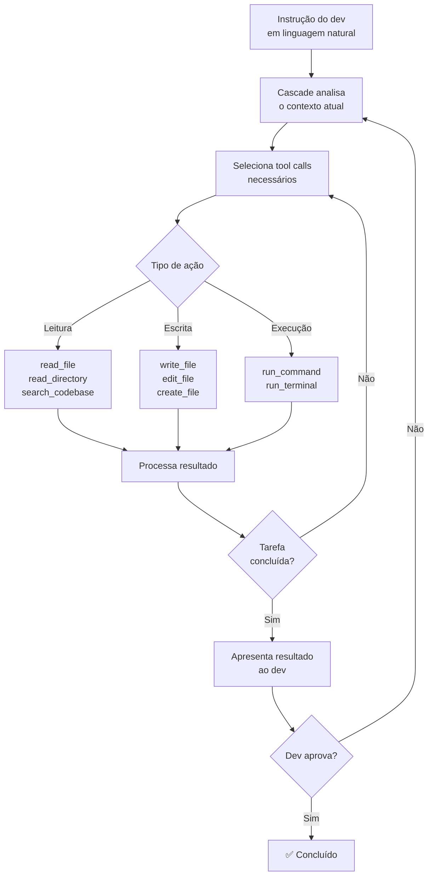

# Windsurf e Cascade

> [!abstract] TL;DR
> Windsurf (by Codeium, adquirida pela OpenAI em maio 2025) é um IDE AI-native que compete diretamente com [[04 - Cursor — AI-native IDE|Cursor]], com pricing mais agressivo ($15/mês vs $20) e foco em "Flows" — modo onde humano e IA editam o código no mesmo contexto sem fronteira clara. Cascade é o motor agentic do Windsurf, capaz de edição multi-file, execução de terminal e tool calls explícitos. Em 2026, pós-aquisição, a trajetória do produto está em transição: pode se tornar o IDE oficial da OpenAI ou perder independência de modelos — escolha com essa incerteza em mente.

## O que é

Você já ficou frustrado quando precisa alternar entre janela do editor, janela do chat e terminal só para implementar uma feature? O **Windsurf** foi projetado para eliminar essa fricção.

**Windsurf** é um IDE AI-native — fork do VS Code com IA integrada profundamente no fluxo de edição — desenvolvido pela **Codeium**, startup de IA para desenvolvedores fundada em 2021. Em maio de 2025, a OpenAI adquiriu a Codeium por aproximadamente $3 bilhões, tornando o Windsurf parte do portfólio Microsoft/OpenAI.

**Cascade** é o motor agentic do Windsurf — equivalente ao Composer do Cursor. Opera com um loop plan→edit→observe que pode atravessar múltiplos arquivos e executar comandos no terminal integrado.

O conceito central do Windsurf é o de **Flows** — interações onde o contexto do humano e do AI são compartilhados continuamente. Diferente do Cursor, onde Composer e o editor são contextos separados que você alterna, no Windsurf a IA "vê" o que você está editando em tempo real e pode completar, sugerir e agir no mesmo fluxo sem necessidade de uma troca explícita de modo.

## Por que importa

- **Pricing agressivo** — Windsurf Pro ($15/mês) é 25% mais barato que Cursor Pro ($20/mês); plano Free inclui autocomplete ilimitado
- **Flows como conceito diferencial** — o modelo de co-edição fluida reduz fricção para devs que preferem trabalhar "junto" com a IA em vez de delegar tarefas
- **Cascade com tool calls explícitos** — o motor agentic mostra exatamente quais ferramentas está usando (ler arquivo, rodar comando, escrever código), aumentando transparência
- **Pós-aquisição OpenAI** — potencial de integração nativa com GPT-5, ChatGPT e futuras ferramentas da OpenAI
- **Base Codeium** — Codeium tinha autocomplete competitivo antes do Windsurf; a engine de completions é madura
- **Cascade com log de ações** — transparência explícita do que o agent está fazendo em cada passo, com possibilidade de interrupção granular

**O posicionamento de mercado:** Windsurf tenta capturar devs insatisfeitos com o pricing do Cursor e atraídos pelo ecossistema OpenAI. É uma alternativa real, mas com comunidade menor e incerteza sobre direção pós-aquisição.

**O que é a Codeium?** Antes do Windsurf, a Codeium era conhecida como a "alternativa gratuita ao GitHub Copilot" — com extensões para VS Code, JetBrains, Vim e outros IDEs. Em 2023, tinha 500k+ usuários principalmente pelo plano Free. O Windsurf foi o passo seguinte: em vez de ser uma extensão de autocomplete dentro de outros editores, a Codeium criou seu próprio editor para ter controle total da experiência. A estratégia foi a mesma da Cursor: fork do VS Code + IA profundamente integrada.

> [!question]- O Windsurf vai continuar existindo como produto independente após a aquisição pela OpenAI?
> É a grande pergunta sem resposta clara em 2026. A OpenAI pode: (1) manter o Windsurf como produto standalone focado em devs, (2) fundir com outros produtos da OpenAI como ChatGPT Desktop, (3) usar a tecnologia da Codeium para melhorar o GPT-4o em tarefas de código e descontinuar o Windsurf. A ausência de roadmap público pós-aquisição é um sinal de que a decisão ainda não foi tomada. Para uso profissional de longo prazo, essa incerteza é um risco real.

## Modelo de preços

O modelo de preços do Windsurf foi uma arma competitiva deliberada: a Codeium construiu sua base de usuários com o plano Free generoso (autocomplete ilimitado) e depois converteu para Pro. É o mesmo playbook do GitHub Copilot Free, mas com pricing Pro menor ($15 vs $10 do Copilot Individual + mais features). A questão pós-aquisição é se a OpenAI vai manter essa estratégia ou pressionar para aumentar o ARPU.

| Plano | Preço | Autocomplete | Cascade | Modelos avançados |
| ----- | ----- | ------------ | ------- | ----------------- |
| **Free** | $0/mês | ✅ ilimitado | ✅ (limite mensal) | ⚠️ limitado |
| **Pro** | $15/mês | ✅ ilimitado | ✅ ilimitado | ✅ 500 créditos premium |
| **Ultimate** | $35/mês | ✅ ilimitado | ✅ ilimitado | ✅ créditos ilimitados |
| **Teams** | $30/seat | ✅ ilimitado | ✅ ilimitado | ✅ + admin/analytics |

**O que diferencia o Free do Pro?** O plano Free inclui autocomplete ilimitado (que usa modelos menores, rápidos) mas limita o uso do Cascade com modelos avançados (GPT-4.1, Claude). Na prática: para tarefas do dia a dia com Flows e completions simples, o Free funciona. Para usar o Cascade em tasks complexas com frequência, o Pro é necessário.

**Comparação direta com Cursor:**

| | Windsurf Pro ($15) | Cursor Pro ($20) |
| - | --------------- | --------------- |
| Autocomplete | Ilimitado | "Fast" (limitado) + "Slow" (ilimitado) |
| Agent/Composer | Ilimitado no Cascade | "Fast requests" mensais + ilimitado slow |
| Multi-model | Sim (incerteza pós-OpenAI) | Sim (GPT-4o, Claude, Gemini) |
| Background agents | Limitado | ✅ Git worktrees |

Para devs que usam principalmente Cascade para tasks pequenas e médias, Windsurf Pro em $15 pode oferecer melhor custo-benefício. Para devs que dependem de background agents paralelos ou de escolha de modelo, Cursor Pro justifica os $5 a mais.

## Histórico

| Período | Evento |
| ------- | ------ |
| 2021 | Codeium fundada; produto inicial: autocomplete gratuito (alternativa ao Copilot) |
| 2022-2023 | Codeium cresce para 500k+ usuários no plano gratuito |
| Nov 2024 | Windsurf lançado como IDE AI-native em beta público |
| Jan 2025 | Windsurf GA; planos Free, Pro ($15) e Ultimate ($35) |
| Mai 2025 | OpenAI adquire Codeium/Windsurf por ~$3 bilhões |
| Jun-Dez 2025 | Período de transição: produto mantido, direção estratégica ainda indefinida |
| 2026 | Windsurf sob OpenAI — futuro incerto entre IDE independente e produto da OpenAI |

A aquisição pela OpenAI é o evento mais significativo na história do Windsurf. Ela eliminou a Codeium como concorrente independente da OpenAI e levanta questões sobre o suporte futuro a modelos de terceiros (Claude, Gemini) no Windsurf.

A velocidade de evolução do produto foi alta antes da aquisição: de zero a 500k+ usuários em 2 anos, e de extensão de autocomplete a IDE completo em menos de 1 ano. Pós-aquisição, o ritmo de lançamentos pode ser diferente — positivo (mais recursos com o orçamento da OpenAI) ou negativo (re-alinhamento estratégico causa demora em novas features).

## Como funciona

O Windsurf opera em dois modos que coexistem: o modo **inline** (Flows + Supercomplete, sempre ativo) e o modo **agentic** (Cascade, ativado explicitamente). A combinação dos dois cobre o espectro completo de interação com IA — do autocomplete pontual à tarefa delegada em múltiplos arquivos.

### Cascade — o motor agentic

O **Cascade** opera com um loop explícito de tool calls que o usuário pode acompanhar em tempo real:



**A diferença dos tool calls explícitos:** quando o Cascade vai ler um arquivo, você vê `read_file("src/auth.ts")` no painel. Quando vai rodar um teste, você vê `run_command("npm test -- auth.spec.ts")`. Isso contrasta com ferramentas que agem de forma mais opaca — no Cascade, o raciocínio do agent está visível.

Uma sessão típica do Cascade em ação:
```
Cascade > Adicionando rate limiting na API de login

✓ read_file("src/routes/auth.ts")          — 240 linhas lidas
✓ search_codebase("middleware rate limit")  — 0 resultados (não existe ainda)
✓ read_file("src/middleware/index.ts")      — verificando estrutura de middlewares
→ write_file("src/middleware/rateLimiter.ts")  — criando middleware
→ edit_file("src/routes/auth.ts")          — aplicando middleware na rota /login
→ run_command("npm test -- auth.spec.ts")  — rodando testes afetados
✓ Testes passando. PR ready.
```

Esse log fica visível no painel do Cascade enquanto o agent trabalha. Você pode interromper a qualquer passo — útil para corrigir a direção antes que o Cascade faça mudanças indesejadas em arquivos críticos.

### Flows — co-edição fluida

O conceito de **Flows** é a aposta diferencial do Windsurf:

```
Cursor:           dev edita  ↔  abre Composer  ↔  age  ↔  fecha Composer  ↔  dev continua
Windsurf Flows:   dev edita + IA sugere + dev aceita + IA continua + dev edita — sem alternância
```

Na prática, Flows significa que a IA do Windsurf monitora suas edições continuamente e oferece sugestões contextuais sem você precisar "chamar" explicitamente o agente. É mais parecido com um pair programming em tempo real do que com delegar uma tarefa.

**Quando Flows ajuda:** tarefas incrementais onde você quer colaborar com a IA linha a linha — refatorar uma função enquanto você entende o código, adicionar validação onde você está vendo o padrão atual.

**Quando Flows atrapalha:** tarefas que exigem que a IA atue autonomamente em múltiplos arquivos sem sua intervenção — aí o modo agentic do Cascade (equivalente ao Composer do Cursor) é mais adequado.

> [!tip] Assista: How Windsurf writes 90% of your code with an Agentic IDE — Kevin Hou (AI Engineer Summit)
> **Canal:** AI Engineer | **Duração:** ~20min | **Idioma:** EN
>
> Kevin Hou, head de product engineering da Codeium, apresenta a filosofia por trás do Windsurf na AI Engineer Summit 2025. O talk explica por que o conceito de Flows (unir o lado agentic e o lado humano no mesmo editor) é o diferencial central do produto — não é só uma feature, é um princípio de design.
> Trecho de destaque [11:05]: *"this is all part of our effort to bring these two sides the agentic side and the human side close together as close together as possible and you do this through building a unified product."*
>
> 🎬 [Assistir no YouTube](https://youtube.com/watch?v=bVNNvWq6dKo)

**A pergunta do par programming:** a metáfora correta para Flows é *pair programming*, não *delegação*. Em pair programming clássico, dois devs trabalham no mesmo teclado — um digita, o outro sugere. Flows emula isso: você digita, a IA sugere no mesmo contexto, sem troca de janela. Se você gosta de pair programming e valoriza manter o controle do raciocínio, Flows é uma UX bem pensada. Se você prefere trabalhar sozinho e depois revisar o que a IA fez, Flows pode ser intrusive.

### Supercomplete

**Supercomplete** é o autocomplete avançado do Windsurf, que vai além de completar a linha atual. Ele prevê a *próxima edição* com base no histórico recente das suas mudanças:

```typescript
// Você acabou de renomear: apiUrl → baseUrl (em 3 lugares)
// Supercomplete sugere automaticamente a 4ª ocorrência
const response = await fetch(baseUrl + '/users');  // ← sugerido antes de você chegar
```

É similar ao "Next Edit Suggestions" do Copilot, mas com integração mais profunda no contexto de Flows.

> [!question]- Supercomplete vs Copilot FIM — qual é a diferença real?
> Ambos usam contexto bidirecional (prefix + suffix), mas o foco é diferente. O Copilot FIM é otimizado para *completar o que você está escrevendo agora* — preencher o meio de uma função enquanto você a digita. O Supercomplete do Windsurf está mais focado em *prever a próxima edição que você vai fazer* — após você renomear uma variável em 3 lugares, ele sugere o 4º antes de você chegar lá. É mais "edição preditiva" do que "completar linha". Na prática, os dois se complementam e a diferença perceptível depende do seu estilo de codificação.

### Windsurf Rules — configuração de projeto

Equivalente ao `.cursorrules` e ao `copilot-instructions.md`, o Windsurf tem seu arquivo de instruções de projeto:

```markdown
# .windsurfrules

## Stack
- Backend: FastAPI + SQLAlchemy + PostgreSQL
- Frontend: React 19 + TypeScript + Tailwind
- Testes: pytest (backend) + Vitest (frontend)

## Convenções
- snake_case para Python, camelCase para TypeScript
- Alembic para migrações — nunca ALTER TABLE manual
- DTOs separados de modelos de domínio

## Proibições
- Não use ORM na camada de service — apenas repositórios
- Não exponha IDs internos na API pública
```

O comportamento é idêntico aos concorrentes: inserido no contexto de cada sessão do Cascade, não é "memória" persistente do modelo.

## Privacidade e modelo de dados

A mudança de controle da Codeium para a OpenAI levanta perguntas legítimas sobre privacidade de código:

| Aspecto | Windsurf Free | Windsurf Pro | Pós-aquisição OpenAI |
| ------- | ------------- | ------------ | -------------------- |
| **Snippets enviados** | Sim (completions) | Sim | Sim |
| **Uso para treino** | Opt-out disponível | Opt-out | Política OpenAI |
| **Retenção** | Configurável | Configurável | A definir |
| **Compliance** | Básico | SOC2 básico | A confirmar |

**Antes da aquisição:** a Codeium tinha política de não usar código de usuários pagantes para treino. Isso foi um diferencial frente ao Copilot gratuito.

**Pós-aquisição:** a OpenAI ainda não publicou uma política unificada de privacidade para o Windsurf. Para empresas com código sensível, isso é um risco real — considere esperar até a política ser publicada ou usar alternativas com controles de privacidade mais claros (Claude Code via Bedrock, Copilot Enterprise).

**Dica prática:** configure `.windsurfignore` (similar ao `.claudeignore`) para excluir arquivos sensíveis do contexto do Cascade — arquivos de configuração com secrets, dados de clientes, PII.

## O Windsurf no contexto pós-aquisição OpenAI

A aquisição pela OpenAI em maio 2025 mudou o contexto competitivo do Windsurf de forma significativa. Antes da aquisição, o Windsurf competia como produto independente focado em "melhor experiência agentic + menor preço". Depois, passou a existir dentro de um contexto estratégico mais amplo.

**Por que a OpenAI comprou a Codeium?** O mercado de IDEs de IA é estratégico: quem controla o IDE controla o contexto onde desenvolvedores trabalham — e, portanto, o fluxo de requisições de modelo. A Microsoft/GitHub tem Copilot + VS Code. A Anthropic tem Claude Code. O Google tem Gemini CLI. A OpenAI precisava de uma resposta. O Windsurf (com Codeium embutida) era a mais rápida.

Há também um ângulo de dados: devs que usam um IDE AI-native geram dados de interação (como aceitam sugestões, quais tasks delegam ao agent, como corrigem erros da IA) que são valiosos para treinar modelos de código melhores. Controlar o IDE = controlar o flywheel de melhoria do modelo.

**Impacto para usuários atuais:**
- Preços e features foram mantidos inicialmente pós-aquisição
- Suporte a modelos Claude/Gemini pode ser reduzido no futuro
- Integração nativa com OpenAI APIs e GPT-5 deve chegar antes de qualquer concorrente
- O roadmap público tornou-se menos transparente após a aquisição

**Impacto para a comunidade:** a Codeium tinha um plano gratuito generoso que atraiu muitos devs. A OpenAI pode manter isso como estratégia de adoção, ou reduzir para direcionar usuários ao ChatGPT Plus.

## Comparativo com Cursor

| Aspecto              | Windsurf (Cascade)    | Cursor (Composer)     |
| -------------------- | --------------------- | --------------------- |
| **Modelo base**      | GPT-4.1 / Claude Sonnet (pós-aquisição: tendência GPT) | Escolha do usuário (GPT-4o, Claude, Gemini) |
| **Multi-file**       | ✅ Cascade              | ✅ Composer             |
| **Terminal**         | ✅ run_command          | ✅ integrado            |
| **Background agents** | ⚠️ Limitado em 2026   | ✅ Git worktrees        |
| **Tool calls visíveis** | ✅ Explícitos          | ✅ Com detalhe          |
| **Flows (co-edição)** | ✅ Diferencial         | ❌ Não equivalente      |
| **Comunidade**       | Menor                 | Maior (plugins, docs)  |
| **Pricing Pro**      | $15/mês               | $20/mês                |
| **Independência de modelos** | ⚠️ Incerta pós-OpenAI | ✅ Multi-model         |

**Conclusão:** se pricing é o critério e o ecossistema OpenAI não é uma preocupação, Windsurf é uma escolha racional. Se você precisa de liberdade de modelo e de uma comunidade maior de extensões e suporte, Cursor ainda lidera.

**O que falta no Windsurf comparado ao Cursor em 2026:**
- **Background Agents com git worktrees** — Cursor implementou paralelismo real com múltiplos worktrees isolados. Windsurf tem Cascade como loop single-threaded no editor.
- **Comunidade de extensões específicas** — Cursor tem criadores de conteúdo, plugins e integrações criadas especificamente para ele. Windsurf ainda depende de extensões VS Code genéricas.
- **Transparência de roadmap** — Cursor publica changelogs frequentes. Windsurf pós-aquisição está mais fechado.

**O que o Windsurf tem que o Cursor não tem:**
- **Flows como paradigma** — a co-edição fluida não é uma feature, é uma filosofia de UX. Devs que adotam têm experiência distinta.
- **Plano Free mais generoso** — autocomplete ilimitado sem cartão de crédito atrai usuários que ainda não querem comprometer com $20/mês.

## Casos práticos

### Caso 1 — Refactoring incremental com Flows

**Cenário:** Você precisa extrair uma classe God Object (500 linhas) em 3 classes menores. É um refactoring que exige que você entenda o código enquanto refatora — não pode delegar completamente.

**Com Windsurf Flows:**
- Abre o arquivo e começa a separar o código manualmente
- Windsurf sugere os imports que precisarão mudar
- Você aceita (Tab) ou rejeita (Esc) sugestão a sugestão
- O Cascade acompanha o contexto em tempo real e sugere ajustes nos testes

**Por que Flows ajuda aqui:** você mantém o controle do raciocínio, mas a IA elimina o trabalho mecânico de atualizar imports, referências e testes conforme você vai extraindo.

### Caso 2 — Feature completa delegada ao Cascade

**Cenário:** Adicionar autenticação OAuth2 ao projeto — múltiplos arquivos, novas rotas, configuração de provider.

**Com Cascade:**
1. Abre Cascade, descreve a feature
2. Cascade lê o código existente (`read_file` nas rotas e modelos)
3. Propõe um plano antes de agir
4. Executa: cria arquivos, edita rotas, roda testes
5. Você revisa cada passo no painel de tool calls

**Comparação com Cursor Composer:** o fluxo é similar, mas a visibilidade dos tool calls no Cascade é ligeiramente mais explícita — cada `write_file` é nomeado. Para devs que querem auditabilidade total do que a IA fez, é uma vantagem.

**Limitação importante:** o Cascade não tem acesso a sistemas externos (bancos de dados de staging, APIs privadas, registros de infraestrutura). Para tasks que dependem de acesso a sistemas externos, o [[05 - Claude Code — terminal-first agent|Claude Code]] no terminal é mais adequado — tem acesso ao shell completo e pode chamar CLIs de infra (kubectl, aws, terraform) diretamente.

### Caso 3 — Debug com Cascade e tool calls visíveis

**Cenário:** Você tem um bug que aparece só em staging — stack trace aponta para uma função, mas a causa real é um race condition em outra parte do código.

**Com Cascade:**
1. Cola o stack trace no Cascade e descreve o contexto
2. Cascade usa `search_codebase("race condition")` e `read_file` em múltiplos arquivos para mapear o problema
3. Cada step de investigação é visível — você vê exatamente o que o agent está lendo
4. Cascade propõe a correção com diff antes de executar

**Por que a transparência importa aqui:** bugs de race condition exigem que você valide o raciocínio do agent, não só o patch final. Ver os tool calls permite identificar se o Cascade está investigando a causa certa ou está propondo uma correção superficial.

### Caso 5 — Avaliação de alternativa em time com restrição de custo

**Cenário:** Time de 5 devs com $100/mês de orçamento para ferramentas de IA. Cursor Pro seriam $100 (5×$20). Windsurf Pro seriam $75 (5×$15) — sobraria $25/mês para outros tools.

**Avaliação:**
- Se o time não usa background agents (git worktrees) intensamente, Windsurf Pro cobre o caso de uso
- Se o time usa Claude Sonnet como modelo preferido, a aquisição pela OpenAI pode criar atrito futuro
- Windsurf Free inclui autocomplete ilimitado — para devs menores do time, o free tier pode ser suficiente

## Quando usar Windsurf

| Cenário | Recomendação | Motivo |
| ------- | ------------ | ------ |
| Refactoring incremental colaborativo | ✅ Windsurf Flows | Co-edição fluida sem alternar janelas |
| Feature complexa multi-arquivo autônoma | ✅ Cascade ou Cursor Composer | Ambos equivalentes; Cursor tem mais docs |
| Time com orçamento limitado | ✅ Windsurf Pro ($15) | 25% mais barato que Cursor, mesmas features core |
| Ecossistema OpenAI (GPT-5, ChatGPT) | ✅ Windsurf pós-aquisição | Deep integration futura com OpenAI |
| Debugging com rastreabilidade de ações | ✅ Cascade | Tool calls explícitos facilitam auditoria |
| Background agents paralelos (git worktrees) | ⚠️ Cursor é superior | Windsurf não tem equivalente em 2026 |
| Enterprise com compliance estrito | ⚠️ Incerto pós-aquisição | Aguardar política OpenAI para Windsurf |
| Independência de modelos (multi-model) | ❌ Use Cursor ou Claude Code | Windsurf pode focar em GPT exclusivamente |

**Padrão que funciona bem:** usar Windsurf como IDE principal para devs que gostam de Flows, e Claude Code no terminal para tarefas de debugging profundo ou automação CI/CD. Os dois não conflitam — cada um tem seu locus de operação.

**O que NÃO usar Windsurf:** se o seu time já está no ecossistema Cursor e tem workflows de background agents configurados, a migração para Windsurf traz custo de adaptação sem ganho imediato (Windsurf não tem background agents equivalentes). Migrações de IDE têm custo cognitivo real — avalie se o gain justifica o atrito.

## Armadilhas comuns

> [!warning] "Windsurf é Cursor mais barato"
> Windsurf é uma ferramenta diferente com filosofia diferente, não uma versão mais barata do Cursor. O conceito de Flows não tem equivalente no Cursor; os background agents do Cursor não têm equivalente no Windsurf. Avalie pelo caso de uso, não só pelo preço.

> [!warning] Incerteza pós-aquisição OpenAI
> A OpenAI adquiriu a Codeium sem anunciar um roadmap claro para o Windsurf. Existe o risco real de que o produto seja descontinuado, fundido com outra iniciativa OpenAI, ou que o suporte a modelos não-OpenAI (Claude, Gemini) seja removido. Para uso em produção de longo prazo, pese essa incerteza.

> [!warning] Comunidade menor significa menos suporte
> Extensões do VS Code funcionam, mas plugins específicos do Windsurf são raros. Tutoriais e troubleshooting da comunidade são escassos comparados ao Cursor. Se você encontrar um bug ou comportamento inesperado, terá menos recursos online para resolver.

> [!warning] Flows não é para todos os estilos de trabalho
> O modelo de co-edição fluida é ótimo para devs que gostam de iterar com a IA. Para devs que preferem delegar uma tarefa grande e revisar o resultado, o Cascade (modo agentic) é mais adequado — e nesse caso, o diferencial do Windsurf diminui em relação ao Cursor.

> [!warning] Windsurf Rules é necessário — sem ele, o Cascade não conhece seu projeto
> Sem `.windsurfrules`, o Cascade usa as convenções padrão do modelo. Para projetos com convenções específicas (naming, patterns, bibliotecas proibidas), o arquivo de regras é obrigatório para evitar que o Cascade gere código inconsistente.

## Como explicar em inglês

Em entrevistas sobre escolha de ferramentas de IA, você precisa articular por que Windsurf vs Cursor — "é mais barato" não é resposta técnica. Use o vocabulário abaixo para demonstrar profundidade na avaliação.

| Português | Inglês técnico | Contexto de uso |
| --------- | -------------- | --------------- |
| Motor agentic | Agentic engine / coding agent | "Cascade is Windsurf's agentic engine" |
| Fluxo fluido | Flows / fluid collaboration | "Windsurf uses Flows for human-AI co-editing" |
| Co-edição | Co-editing / collaborative editing | "Flows enables real-time co-editing" |
| Chamada de ferramenta | Tool call | "Cascade uses explicit tool calls for transparency" |
| Autocompletar avançado | Supercomplete / next-edit prediction | "Supercomplete predicts your next edit" |
| Arquivo de regras | Rules file / .windsurfrules | "Our .windsurfrules defines coding conventions" |
| Aquisição | Acquisition | "The OpenAI acquisition of Codeium in 2025" |
| Modo agentico | Agent mode | "Switch to agent mode for autonomous multi-file tasks" |
| Transparência | Transparency / observability | "Explicit tool calls give better transparency" |
| Alternância de contexto | Context switching | "Flows reduces context switching between human and AI" |

> [!tip] Frase de impacto para entrevistas
> *"I've evaluated Windsurf as an alternative to Cursor — the Flows model reduces context switching for incremental refactoring, though the OpenAI acquisition creates uncertainty about long-term model independence."*
>
> Para aprofundar: *"The key architectural difference is that Windsurf's Cascade exposes explicit tool calls in its agentic panel, which gives better observability into what the agent is doing — useful when you need to audit or interrupt mid-task."*

## O que vem a seguir

A trajetória do Windsurf depende da decisão da OpenAI sobre seu futuro. Dois cenários possíveis:

1. **Windsurf vira o IDE oficial da OpenAI** — deep integration com GPT-5, ChatGPT Desktop, OpenAI APIs. Seria uma resposta direta ao Cursor (Microsoft/GitHub) e ao Claude Code (Anthropic). Nesse caso, pode se tornar o mais poderoso IDE da categoria, mas ao custo de independência de modelos.

2. **Windsurf é descontinuado ou absorvido** — a OpenAI usa a tecnologia da Codeium em outras iniciativas e não mantém o Windsurf como produto standalone.

Para acompanhar a evolução:
- [[04 - Cursor — AI-native IDE]] — concorrente direto, referência de benchmark
- [[11 - Comparativo — qual ferramenta para qual tarefa]] — onde Windsurf se encaixa no landscape
- [[15 - MCP — o protocolo universal]] — se Windsurf adotar MCP, a comparação com Cursor muda

**O que observar nos próximos meses:**
1. Anúncio oficial da OpenAI sobre roadmap do Windsurf — vai definir se o produto tem futuro independente
2. Suporte a modelos Claude/Gemini sendo mantido ou reduzido — indicador de quanto a OpenAI vai "fechar" o Windsurf
3. Lançamento de background agents equivalentes ao Cursor — a maior lacuna atual
4. Política de privacidade unificada OpenAI + Windsurf — necessária para adoção enterprise

Se você está considerando adotar Windsurf para um projeto de longo prazo, vale esperar até pelo menos 2 desses sinais ficarem claros antes de comprometer automações e configurações complexas no ecossistema do Windsurf.

## Veja também

- [[04 - Cursor — AI-native IDE]] — principal concorrente e referência de benchmark para Windsurf
- [[05 - Claude Code — terminal-first agent]] — alternativa terminal-first com foco em reasoning profundo
- [[06 - GitHub Copilot e Copilot Agents]] — concorrente no espaço enterprise com integração GitHub
- [[08 - Gemini CLI — o player Google]] — alternativa no espaço de agentes de terminal
- [[11 - Comparativo — qual ferramenta para qual tarefa]] — guia de escolha entre ferramentas do landscape
- [[15 - MCP — o protocolo universal]] — protocolo que pode mudar a integração entre IDEs e agentes
- [[16 - O loop agentic — plan, act, observe]] — como o Cascade implementa o loop agentic

## Referências

- **Windsurf** — *Windsurf Documentation* (2026). Documentação oficial com guias de Cascade, Flows e Windsurf Rules. https://docs.windsurf.com
- **Codeium** — *Introducing Windsurf: The First Agentic IDE* (2024). https://codeium.com/blog/windsurf-launch
- **TechCrunch** — *OpenAI acquires AI coding tool Codeium for $3B* (2025). Cobertura da aquisição. https://techcrunch.com/2025/05/05/openai-acquires-codeium/
- **Windsurf** — *Cascade: The Agentic Engine Behind Windsurf* (2025). Documentação técnica do Cascade.
- **The Pragmatic Engineer** — *The rise of AI-native IDEs: Cursor, Windsurf, and the future of coding* (2025). Análise comparativa independente dos IDEs AI-native.
- **Simon Willison** — *Notes on Windsurf after one month of use* (2025). Experiência prática de desenvolvedor experiente com análise crítica de Flows vs abordagem tradicional. https://simonwillison.net
- **Pragmatic Engineer Newsletter** — *AI coding tools in 2025: Cursor, Windsurf, and the rest* (2025). Análise independente do landscape de IDEs AI-native com dados de adoção.
