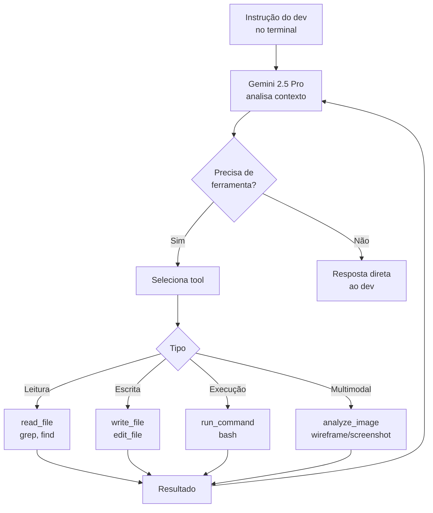

# Gemini CLI — o player Google

> [!abstract] TL;DR
> Gemini CLI é o agente de codificação em terminal do Google, open-source (Apache 2.0), lançado em junho de 2025. Baseado em Gemini 2.5 Pro — um dos modelos com melhor performance em SWE-bench em 2025. Diferenciais: janela de contexto de 1M tokens (codebase inteiro sem RAG), multimodal nativo (analisa screenshots e diagramas), custo agressivo via Gemini Flash ($0.075/MTok vs $3 do Claude Sonnet), e gratuito para usuários Gemini Advanced. Perde para Claude Code em reasoning profundo; ganha em contexto, custo e integração GCP.

## O que é

Você tem um monorepo com 400k linhas de código. O Claude Code para de funcionar bem porque esgota a janela de contexto. O [[04 - Cursor — AI-native IDE|Cursor]] começa a alucinar porque não consegue manter toda a codebase em mente. Esse é exatamente o cenário para o qual o **Gemini CLI** foi projetado.

**Gemini CLI** é um agente de codificação em terminal desenvolvido pelo Google, open-source sob licença Apache 2.0, lançado publicamente em junho de 2025. Opera de forma similar ao [[05 - Claude Code — terminal-first agent|Claude Code]]: terminal-first, lê e edita arquivos, executa comandos, itera em loops agenticos. A diferença central é o *modelo por trás*: Gemini 2.5 Pro, com janela de contexto de 1M tokens — 5x maior que o Claude Sonnet.

**Por que open-source importa:** o código do Gemini CLI está disponível em `github.com/google-gemini/gemini-cli`, o que permite auditar o comportamento, contribuir com modificações e usá-lo como base para automações customizadas. Isso contrasta com Claude Code e Cursor, que são proprietários.

O Gemini CLI usa Google AI Studio como backend (gratuito com limites generosos para uso pessoal) ou a Google Gemini API (paga por token). Usuários com Gemini Advanced subscription têm acesso ilimitado ao Gemini 2.5 Pro via Gemini CLI.

## Por que importa

- **Contexto ultra-longo** — 1M [[Dicionário de IA#Token|tokens]] com Gemini 2.5 Pro processa codebases inteiros; 2M tokens com Gemini 1.5 Ultra elimina praticamente qualquer limitação de tamanho
- **Multimodal nativo** — único agente de terminal que aceita imagens como input (screenshots de erros, wireframes, diagramas UML)
- **Open-source** — código auditável, extensível e adaptável para workflows customizados
- **Custo agressivo** — Gemini Flash a $0.075/MTok de input é 40× mais barato que Claude Sonnet ($3/MTok); para tarefas de rotina, a economia é substancial
- **Gratuito para Gemini Advanced** — usuários da assinatura Gemini Advanced ($20/mês) têm acesso ao Gemini CLI sem custo adicional por token
- **Performance em benchmarks** — Gemini 2.5 Pro está entre os melhores modelos em SWE-bench verified e LiveCodeBench em 2025

O posicionamento estratégico é claro: Google precisava de uma resposta ao Claude Code (Anthropic) e ao Copilot (Microsoft/GitHub). O Gemini CLI é essa resposta — open-source para ganhar adoção, Gemini 2.5 Pro como modelo, GCP como ecossistema de integração.

**Gemini CLI vs Gemini Code Assist:** são produtos distintos com sobreposição parcial. O Gemini Code Assist é integrado a IDEs (VS Code, JetBrains) e Google Workspace — similar ao GitHub Copilot. O Gemini CLI é terminal-first, sem dependência de IDE — similar ao Claude Code. A tendência é convergência ao longo de 2026, mas em 2025-2026 são ferramentas separadas com casos de uso distintos. Se você já usa Gemini Code Assist na IDE, o Gemini CLI não é redundante — ele complementa com o loop agentic autônomo e com a capacidade de processar repositórios inteiros.

## Histórico

| Período | Evento |
| ------- | ------ |
| 2023 | Google anuncia Gemini como sucessor do PaLM 2; janela de 32k tokens |
| Mar 2024 | Gemini 1.5 Pro: janela de 1M tokens — primeiro modelo da indústria nessa escala |
| Dez 2024 | Gemini 2.5 Pro: performance de coding melhorada, contexto mantido em 1M |
| Jun 2025 | **Gemini CLI lançado** — open-source, baseado em Gemini 2.5 Pro, disponível no GitHub |
| Jul 2025 | Gemini CLI v0.2: suporte a GEMINI.md, melhoras no loop agentic |
| 2026 | Integração com Vertex AI e ferramentas GCP; adoção crescente em projetos Google Cloud |

O lançamento do Gemini CLI em junho de 2025 foi deliberadamente posicionado como resposta ao Claude Code da Anthropic (lançado em GA em abril de 2025). A estratégia open-source é diferente da Anthropic e Microsoft — Google aposta na adoção por transparência e extensibilidade.

## Como funciona

### O loop agentic do Gemini CLI



O loop é idêntico em estrutura ao Claude Code e Windsurf Cascade: plan → act → observe → fix. A diferença é o volume de contexto que o modelo consegue manter ativo durante todo o loop — com 1M tokens, o Gemini CLI pode carregar o repositório inteiro antes de começar a iterar.

### GEMINI.md — configuração de projeto

Equivalente ao `CLAUDE.md` do Claude Code e ao `copilot-instructions.md` do GitHub Copilot. Inserido no contexto no início de cada sessão:

```markdown
# GEMINI.md

## Projeto
Backend FastAPI com PostgreSQL. Deploy em Cloud Run (us-central1).

## Regras de código
- Siga PEP 8 rigorosamente
- Type hints obrigatórios em todas as funções
- Docstrings em formato Google (Args, Returns, Raises)
- Testes com pytest + coverage mínimo de 80%

## Convenções GCP
- Secrets via Secret Manager, nunca hardcoded
- Logging estruturado (google-cloud-logging)
- Health checks em /health e /ready

## Proibições
- Não use synchronous I/O em corrotinas async
- Não modifique terraform/ sem review explícita
```

**GEMINI.md vs CLAUDE.md:** o comportamento é idêntico — context injection no início da sessão. A diferença é que o GEMINI.md se beneficia da janela de contexto maior: você pode colocar documentação extensa, exemplos de código do projeto, histórico de decisões arquiteturais — tudo vai caber no contexto do Gemini 2.5 Pro sem trade-offs.

### Multimodal na prática

A capacidade multimodal é o diferencial mais único do Gemini CLI em relação aos concorrentes:

```bash
# Analisar wireframe e gerar componente React
gemini "Analise este wireframe e implemente o componente React com TypeScript" \
  --image wireframe.png

# Debugar via screenshot de erro em produção
gemini "Identifique a causa raiz deste erro e proponha o fix" \
  --image stacktrace-screenshot.png

# Analisar diagrama de arquitetura e sugerir melhorias
gemini "Este diagrama tem problemas de escalabilidade? O que você mudaria?" \
  --image architecture-diagram.png

# Comparar output atual com o esperado visualmente
gemini "O componente renderizado não está igual ao design. O que está errado?" \
  --image current.png --image design.png
```

**Por que nenhum outro agente de terminal faz isso:** Claude Code, Copilot Agents e Aider operam exclusivamente em texto. O Gemini CLI pode receber uma imagem de screenshot de produção e analisar o stack trace visualmente — sem precisar copiar texto do screenshot.

### Contexto ultra-longo — quando realmente importa

A grande janela de contexto do Gemini CLI não é um número de marketing — é uma mudança qualitativa na forma como você pode interagir com projetos grandes:

| Tamanho do projeto | Claude Code (200k) | Gemini CLI (1M) |
| -------------------- | ------------------ | --------------- |
| ~50k linhas de código | ✅ OK completo | ✅ OK + folga |
| ~150k linhas | ⚠️ Precisa de RAG seletivo | ✅ OK completo |
| ~400k linhas | ❌ Limite excedido | ✅ OK completo |
| ~800k+ linhas | ❌ Inviável | ⚠️ Próximo do limite |

**Atenção:** contexto grande não é contexto melhor. O Gemini 2.5 Pro foi treinado para usar contexto longo de forma eficaz, mas em janelas muito cheias o modelo pode perder atenção para informações no meio. Para repositórios muito grandes, ainda é boa prática usar o contexto seletivamente — incluir apenas os arquivos relevantes para a task atual, não o repositório inteiro.

 > [!tip] Assista: Gemini CLI: The AI agent that lives in your terminal
> **Canal:** Google Cloud Tech (oficial) | **Duração:** ~5min | **Idioma:** EN
>
> Introdução oficial ao Gemini CLI pelo Google Cloud Tech: explica como o loop agentic funciona "sob o capô" (plan → tool call → observe → iterate), as ferramentas built-in (file system, shell, web search, memória persistente) e os casos de uso práticos — de desenvolvimento de software a análise de dados com CSV. O vídeo também destaca o diferencial de ser open-source e extensível via MCP servers.
> Trecho de destaque [3:02]: *"Gemini CLI can run for extended periods of time doing reasoning and looping through different tool calls in order to build out entire applications or debug really tricky issues on your behalf so that you can spend time doing what you do best."*
>
> 🎬 [Assistir no YouTube](https://youtube.com/watch?v=C5Cjvpfzc_0)

**Padrão prático para contextualização seletiva:**
```bash
# Em vez de: gemini "analise o repo" (carrega tudo)
# Prefira: incluir arquivos relacionados à task

# Para task de bugfix num módulo específico
find src/payments/ -name "*.java" | xargs cat | \
  gemini "Há um bug no cálculo de taxas. Analise este módulo e identifique o problema"

# Para task de cross-cutting (ex: migration de biblioteca)
find . -name "*.py" -exec grep -l "old_library" {} \; | xargs cat | \
  gemini "Migre estes arquivos de old_library para new_library, mantendo a semântica"
```

Essa abordagem — carregar exatamente o que é relevante — extrai o melhor do Gemini CLI: contexto suficientemente grande para o escopo da task, sem desperdiçar tokens com código não relacionado.

## Comparativo com concorrentes

| Aspecto                  | Gemini CLI   | Claude Code     | Copilot Agents | Windsurf Cascade |
| ------------------------ | ------------ | --------------- | -------------- | ---------------- |
| **Contexto**             | ★★★★★ (1M)  | ★★★ (200k)      | ★★★            | ★★★              |
| **Reasoning de código**  | ★★★★         | ★★★★★           | ★★★            | ★★★★             |
| **Multimodal**           | ★★★★★        | ★★              | ★★             | ★★               |
| **Custo**                | ★★★★★ (Flash)| ★★★ (Sonnet)    | ★★★            | ★★★★             |
| **Open-source**          | ✅            | ❌               | ❌              | ❌                |
| **Integração GCP**       | ★★★★★        | ★ (via MCP)     | ★              | ★                |
| **Comunidade**           | ★★★ (crescendo) | ★★★★         | ★★★★★          | ★★               |
| **Maturidade**           | ★★★ (2025)   | ★★★★ (GA 2025)  | ★★★★★          | ★★★              |

**Conclusão:** Gemini CLI é a melhor escolha quando contexto, custo ou multimodal são os critérios dominantes. Para reasoning de código puro, [[05 - Claude Code — terminal-first agent|Claude Code]] com Sonnet/Opus ainda lidera. Para integração com GCP e Firebase, Gemini CLI não tem rival.

### Modelo de preços

O Gemini CLI tem uma estrutura de custo mais flexível que seus concorrentes:

| Modelo | Preço input (por MTok) | Preço output (por MTok) | Melhor para |
| ------ | ---------------------- | ------------------------ | ----------- |
| Gemini 2.5 Pro | $1.25 (até 200k) / $2.50 (>200k) | $10.00 | Tasks complexas, análise de codebase |
| Gemini 2.5 Flash | $0.15 (até 200k) / $0.30 (>200k) | $0.60 | Automação, tarefas repetitivas |
| Gemini 2.0 Flash | $0.10 | $0.40 | Tasks simples de alta frequência |
| Gemini Advanced (assinatura) | **Incluído** no plano $20/mês | Incluído | Uso pessoal intensivo |

**Ponto de virada econômico:** se você roda o Gemini CLI com intensidade de 30+ horas/mês com Gemini 2.5 Pro, o plano Gemini Advanced (~$20/mês) amortiza o custo por token. Para uso esporádico ou projetos pessoais, pagar por token com Gemini Flash é mais econômico.

> [!question] Como comparar custo de forma justa com Claude Code?
> A comparação direta de preço por token pode enganar: um task que Claude Code resolve em menos chamadas (por reasoning superior) pode custar menos no total, mesmo com token mais caro. O critério real é *custo por task resolvida com qualidade aceitável*. Para tasks repetitivas e simples, Gemini Flash ganha. Para debugging complexo, calcule o total de tentativas, não só o preço unitário.

## Casos práticos

### Caso 1 — Análise de codebase legado grande

**Cenário:** você herda um sistema legado com 200k linhas de código, sem documentação, e precisa entender a arquitetura antes de fazer mudanças.

**Com Gemini CLI:**
```bash
# Carregar o repo inteiro no contexto
gemini "Analise este repositório e crie um mapa de arquitetura: 
quais são os módulos principais, como eles se comunicam, 
e onde estão os pontos de maior acoplamento?"
```

O Gemini 2.5 Pro consegue processar os 200k tokens do repo inteiro em uma única chamada, analisar as dependências e gerar um mapa de arquitetura. Com Claude Code, você precisaria fazer isso em partes — primeiro o módulo A, depois o B — e perder o contexto das interações entre eles.

### Caso 2 — Debug de erro via screenshot

**Cenário:** erro em staging cuja mensagem aparece numa UI web sem texto copiável (interface de log do GCP, por exemplo).

**Com Gemini CLI:**
```bash
gemini "Identifique o erro neste screenshot e sugira a causa raiz" \
  --image gcp-error-screenshot.png
```

Sem o Gemini CLI, você teria que transcrever o erro manualmente. Com ele, você tira um screenshot e cola diretamente.

### Caso 3 — Geração de código a partir de wireframe

**Cenário:** designer enviou wireframe de nova tela em PNG. Você precisa implementar o componente React.

**Com Gemini CLI:**
```bash
gemini "Implemente este wireframe como componente React TypeScript.
Use TailwindCSS. Inclua skeleton loading e estado vazio." \
  --image wireframe-dashboard.png
```

O Gemini analisa o layout visual, extrai a estrutura e gera o componente. Você ainda revisa e ajusta, mas o scaffold está feito com precisão visual que nenhum agente text-only consegue.

### Caso 4 — Automação de custo baixo via Gemini Flash

**Cenário:** você tem um pipeline de CI que precisa analisar code diffs e gerar changelogs automaticamente. A tarefa é simples, mas roda centenas de vezes por mês.

**Com Gemini CLI + Flash:**
```bash
# No CI script
gemini --model gemini-flash "Gere um changelog em PT-BR para este diff:" \
  < git.diff >> CHANGELOG.md
```

Gemini Flash a $0.075/MTok significa que 100 execuções com diffs de ~5k tokens cada custam ~$0.04. A mesma tarefa com Claude Sonnet custaria ~$1.50. Para automações de rotina em escala, a diferença é significativa.

### Caso 5 — Code review de PR com contexto amplo

**Cenário:** PR com mudanças que afetam múltiplos módulos — o revisor humano precisa de contexto sobre como os módulos interagem. Você quer que o agente faça uma pré-análise de impacto.

**Com Gemini CLI:**
```bash
# Fazer diff do PR e analisar com contexto do repo inteiro
git diff main...feature/my-pr > pr.diff
gemini "Analise este diff no contexto do repositório completo.
Identifique:
1. Módulos impactados indiretamente
2. Casos de teste ausentes
3. Possíveis regressões em funcionalidades dependentes" \
  < pr.diff
```

O diferencial aqui é que o Gemini CLI pode analisar o diff *com o repositório inteiro no contexto*, não apenas os arquivos modificados. Ele vê como a mudança se encaixa — ou colide — com o restante do código.

### Caso 6 — Geração de testes de integração a partir de documentação GCP

**Cenário:** você tem uma integração com Pub/Sub do GCP e precisa gerar testes de integração realistas. A documentação da API é longa.

**Com Gemini CLI:**
```bash
# Baixar documentação e usar como contexto
curl -s https://cloud.google.com/pubsub/docs/api-overview > pubsub-docs.txt
gemini "Baseado nesta documentação do Pub/Sub e no código de integração atual,
gere testes de integração com pytest para os seguintes cenários:
1. Publicação de mensagem com atributos
2. Falha de entrega com dead-letter queue
3. Mensagem maior que o limite máximo" \
  --context pubsub-docs.txt
```

O contexto de 1M tokens do Gemini 2.5 Pro é grande o suficiente para processar documentação extensa + código de integração + schema de testes em uma única chamada — sem truncar nem perder coerência.

## Armadilhas comuns

> [!warning] "Contexto grande = reasoning melhor"
> Contexto maior permite processar mais código, mas não garante raciocínio mais profundo. Em debugging de lógica complexa, race conditions e decisões arquiteturais, Claude Code com Sonnet/Opus é consistentemente superior em benchmarks. Contexto é capacidade de leitura — reasoning é qualidade do processamento. São dimensões diferentes.

> [!warning] Ecossistema imaturo em 2026
> Lançado em junho de 2025, o Gemini CLI tem muito menos plugins, extensões, tutoriais e comunidade que o Claude Code ou o Copilot. Problemas inesperados têm menos recursos de troubleshooting disponíveis. Para projetos críticos, esse custo de suporte conta.

> [!warning] Janela de contexto grande com "lost in the middle"
> Modelos com janelas de contexto muito grandes tendem a ter atenção reduzida para informações no meio do contexto — fenômeno chamado "lost in the middle". Mesmo com 1M tokens disponíveis, prefira incluir apenas os arquivos relevantes para a task atual. Contexto cheio pode degradar a qualidade das respostas.

> [!warning] Integração GCP não é automática
> O Gemini CLI tem vantagem em projetos GCP, mas essa integração precisa ser configurada. Não é plug-and-play. Para projetos AWS ou Azure, não há vantagem de integração — Claude Code via Bedrock é mais natural para AWS.

> [!warning] Open-source não significa sem custo
> O Gemini CLI em si é gratuito, mas os modelos Gemini são pagos por token via API (exceto para usuários Gemini Advanced). Verifique os limites de rate da sua API key antes de usar em automações de CI/CD.

> [!warning] GEMINI.md não substitui .gitignore para dados sensíveis
> Um equívoco comum: colocar no GEMINI.md a instrução "nunca vaze secrets" e assumir que o agente vai filtrar automaticamente. Não funciona assim. Se um arquivo com secrets estiver dentro do contexto do repositório, o Gemini CLI pode processar e enviar esse conteúdo para os servidores Google. A proteção real é no nível do sistema: `.gitignore`, `.geminiignore`, e nunca manter secrets em arquivos de texto no repositório — independente de qual agente você usa.

> [!warning] API key exposta em scripts de CI
> Scripts de CI que usam o Gemini CLI precisam de uma `GOOGLE_API_KEY` ou `GEMINI_API_KEY`. É tentador hardcodar a chave no script para "simplificar". Não faça isso — use secrets do CI (GitHub Actions secrets, GitLab CI variables, etc.) e nunca commite a chave. Uma API key exposta em repositório público pode gerar custos significativos em poucos minutos.

## Privacidade e segurança

O Gemini CLI envia seu código para os servidores do Google para processamento. Isso levanta perguntas legítimas sobre privacidade, especialmente em projetos corporativos ou com código proprietário.

| Tier | Dados usados para treino? | Política de retenção | Adequado para |
| ---- | ------------------------- | -------------------- | ------------- |
| Google AI Studio (grátis) | Pode ser usado para melhoria do produto | Verificar política atual | Projetos pessoais, OSS |
| Gemini API (pago) | **Não** usado para treino por padrão | 30 dias (configurável) | Projetos profissionais |
| Gemini Advanced (assinatura) | **Não** usado para treino | Configurável | Uso pessoal avançado |
| Google Workspace Enterprise | **Não** usado para treino | Enterprise data controls | Projetos corporativos |

**Atenção prática:** se você usa o tier gratuito do Google AI Studio, leia os termos de serviço antes de inserir código proprietário. O nível pago da API tem políticas mais claras de não uso para treinamento — mas sempre verifique os termos atuais, pois políticas podem mudar.

**Open-source como trunfo de privacidade:** o fato do Gemini CLI ser open-source significa que você pode auditar exatamente o que é enviado para os servidores. Isso é uma vantagem sobre ferramentas proprietárias onde o comportamento é opaco.

> [!question] Até que ponto você confia no Google com seu código?
> A resposta depende do tier e do projeto. Para código de cliente ou propriedade intelectual crítica, a questão não é específica do Gemini CLI — qualquer agente de IA que processa código no servidor levanta a mesma preocupação. O critério deve ser: leia os termos, escolha o tier adequado, estabeleça políticas claras com seu time.

## Quando usar Gemini CLI

| Cenário | Gemini CLI? | Por quê |
| ------- | ----------- | ------- |
| Codebase >150k linhas | ✅ Sim | Janela de contexto de 1M processa o repo inteiro |
| Debug por screenshot de produção | ✅ Sim | Único agente terminal com suporte multimodal |
| Projeto em Google Cloud Platform | ✅ Sim | Integração nativa > outros agentes |
| Automações de CI/CD em escala | ✅ Sim (Flash) | $0.075/MTok viabiliza milhares de execuções |
| Debugging de lógica complexa | ⚠️ Talvez | Claude Code tem reasoning superior; compare casos |
| Projeto AWS/Azure | ⚠️ Neutro | Sem vantagem de integração; Claude Code ou Copilot são equivalentes |
| Projeto com código proprietário | ⚠️ Verificar | Use tier pago da API; revise política de dados |
| Ambiente offline ou air-gapped | ❌ Não | Depende de servidores Google |
| Equipe já usa GitHub Actions + Copilot | ⚠️ Complementar | Copilot Agents para tarefas de PR; Gemini CLI para análise local |

## Como explicar em inglês

| Português | Inglês técnico | Contexto de uso |
| --------- | -------------- | --------------- |
| Janela de contexto ultra-longa | Long context window / 1M token context | "Gemini CLI uses a 1M token context window" |
| Multimodal nativo | Native multimodal | "It's natively multimodal — accepts images as input" |
| Código aberto | Open-source (Apache 2.0) | "Unlike Claude Code, Gemini CLI is open-source" |
| Arquivo de instruções | GEMINI.md / project instructions | "Configure GEMINI.md for project-specific rules" |
| Contexto diluído | Diluted attention / lost in the middle | "Large context can cause lost-in-the-middle issues" |
| Custo por token | Cost per token / pricing per MTok | "Flash is $0.075/MTok — 40x cheaper than Sonnet" |
| Integração nativa GCP | Native GCP integration | "Best for projects on Google Cloud Platform" |
| Loop agentic | Agentic loop / tool use loop | "Gemini CLI runs an agentic loop to complete tasks" |
| Análise de imagem | Image analysis / vision capabilities | "It can analyze screenshots and wireframes" |
| Código aberto auditável | Auditable open-source | "The code is auditable on GitHub" |

> [!tip] Frase de impacto para entrevistas
> *"For our GCP-hosted services, Gemini CLI is ideal — the 1M token context means we can analyze our entire codebase in a single pass, and the multimodal support lets us debug from production screenshots without manual transcription."*

## O que vem a seguir

O Gemini CLI é uma entrada relativamente nova no mercado — junho de 2025. Nos próximos meses e anos, os pontos de evolução mais prováveis são:

- **Integração mais profunda com Vertex AI** — agentes que podem interagir com BigQuery, Cloud SQL, Pub/Sub e outros serviços GCP diretamente, transformando o Gemini CLI numa interface unificada para o ecossistema Google Cloud
- **Suporte a MCP** — se o Gemini CLI adotar o [[15 - MCP — o protocolo universal|MCP]] (Model Context Protocol), ele pode se integrar com qualquer ferramenta que tenha servidor MCP, eliminando a desvantagem de ecossistema em relação ao Claude Code
- **Melhora no reasoning com Gemini 3.x** — os próximos modelos devem fechar a gap com Claude em debugging complexo; se a melhora de reasoning vier com a manutenção do contexto de 1M tokens, o Gemini CLI pode se tornar a primeira escolha para a maioria dos projetos
- **Convergência com Gemini Code Assist** — Google tem outro produto (Gemini Code Assist para Workspace/IDE) que pode convergir com o CLI, criando uma experiência unificada terminal + IDE similar ao que a Anthropic tem com Claude Code + IDE extensions
- **Multi-agent nativo** — suporte para coordenação de múltiplos agentes Gemini em paralelo, similar ao que [[12 - Multi-agent — workflows com múltiplos agentes|workflows multi-agent]] permitem hoje com Claude Code

**O que observar para decidir quando adotar Gemini CLI como ferramenta principal:**
1. Score no SWE-bench verified do Gemini 3.x — se superar Claude Sonnet em tasks práticas de coding
2. Anúncio de suporte nativo a MCP — eliminaria a limitação de ecossistema
3. Maturidade da comunidade (plugins, templates, casos de uso documentados)
4. Evolução da política de privacidade no tier gratuito

Para contexto completo sobre o landscape de ferramentas onde o Gemini CLI se encaixa:
- [[11 - Comparativo — qual ferramenta para qual tarefa]] — guia de decisão
- [[05 - Claude Code — terminal-first agent]] — o principal concorrente em reasoning
- [[15 - MCP — o protocolo universal]] — protocolo que pode nivelar o campo de integrações

## Veja também

- [[05 - Claude Code — terminal-first agent]] — concorrente com melhor reasoning para debugging
- [[04 - Cursor — AI-native IDE]] — alternativa IDE com Composer e background agents
- [[06 - GitHub Copilot e Copilot Agents]] — alternativa com integração GitHub nativa
- [[10 - OpenCode — o harness open source]] — outra alternativa open-source
- [[11 - Comparativo — qual ferramenta para qual tarefa]] — guia de escolha
- [[15 - MCP — o protocolo universal]] — como o MCP pode mudar a integração do Gemini CLI

## Referências

- **Google** — *Gemini CLI — Open-source AI coding agent* (2025). Repositório oficial. https://github.com/google-gemini/gemini-cli
- **Google DeepMind** — *Gemini 2.5 Pro Technical Report* (2025). Capacidades de contexto e performance.
- **Google** — *Gemini Developer Documentation* (2026). API reference e limites. https://ai.google.dev/docs
- **Google Blog** — *Introducing Gemini CLI: Your open-source AI agent for the terminal* (Jun 2025). Anúncio oficial. https://blog.google/technology/google-deepmind/gemini-cli/
- **LMSys** — *Chatbot Arena Leaderboard* (2026). Rankings atualizados de modelos, incluindo Gemini 2.5. https://chat.lmsys.org
- **Google** — *Gemini Pricing* (2026). Tabela de preços por modelo e tier. https://ai.google.dev/pricing
- **Princeton NLP** — *SWE-bench: Can Language Models Resolve Real-World GitHub Issues?* (2023). Benchmark de referência para avaliação de agentes de codificação. https://swebench.com
- **Gergely Orosz (The Pragmatic Engineer)** — *AI coding tools in 2025: what works and what doesn't* (2025). Análise prática comparativa de agentes de IA para devs.
- **Google DeepMind** — *Long context: the next frontier for AI* (2024). Fundamentos e limitações de modelos com janela de contexto extensa (lost in the middle, atenção diluída).
