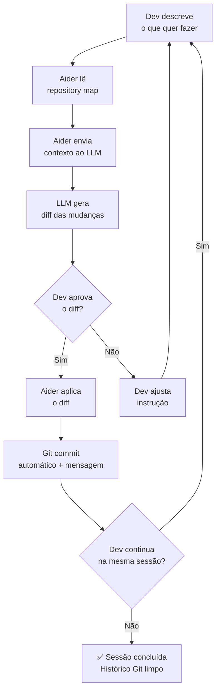

# Aider — o pair programmer de terminal

> [!abstract] TL;DR
> Aider é um pair programmer AI de terminal open-source (Apache 2.0), criado por Paul Gauthier em 2023. Git-first por design: cada edição vira um commit atômico com mensagem descritiva gerada pelo LLM. Model-agnostic — funciona com Claude, GPT, DeepSeek e Ollama — o que elimina lock-in de vendor. O diferencial não é autonomia (não é agente), mas *controle* — você aprova cada diff, o histórico Git é impecável, e o Architect Mode usa dois modelos em série (um para raciocinar, outro para editar). Para devs sêniors que querem IA sem abrir mão de auditabilidade, o Aider é o melhor representante do polo "controle máximo" no espectro de agentes de codificação.

## O que é

Você está revisando o PR de um colega e percebe que o histórico de commits não conta história nenhuma — "fix", "fix2", "revert fix2", "actually fix". Fica impossível entender o que mudou e por quê. Esse é o problema que o Aider resolve não para PRs de outros, mas para *suas próprias sessões de coding com IA*.

**Aider** (aider.chat) é um assistente de codificação CLI que funciona como par programador: você diz o que quer fazer, o Aider propõe diffs, você aprova, ele aplica e faz commit com mensagem descritiva gerada automaticamente. O resultado é um histórico Git legível, atômico, e auditável — mesmo quando você está acelerando com IA.

Criado por Paul Gauthier, ex-engenheiro do Google, em 2023. Open-source sob licença Apache 2.0, disponível em `github.com/Aider-AI/aider`. Diferente de [[05 - Claude Code — terminal-first agent|Claude Code]] e [[04 - Cursor — AI-native IDE|Cursor]], o Aider não tenta ser autônomo — ele não executa comandos sem pedir, não itera em loop sem aprovação. É *pair programmer*, não agente.

**O modelo mental certo:** pense no Aider como um programador júnior extremamente capaz sentado ao seu lado. Ele lê o código, entende a estrutura, escreve os diffs — mas você olha cada diff antes de aplicar. A autonomia fica com você; a velocidade de geração fica com a IA.

## Por que importa

- **Git-first com commits atômicos** — cada edição gera um commit com mensagem descritiva. O histórico Git de uma sessão de Aider parece um histórico de dev humano cuidadoso — reversível com `git revert`, legível com `git log`, auditável para PRs e revisões de segurança
- **Model-agnostic sem lock-in** — uma única ferramenta que funciona com Claude, GPT-4o, DeepSeek, Gemini, e modelos locais via Ollama. Troque de modelo sem trocar de workflow
- **Custo otimizável** — Architect Mode usa um modelo forte para planning (Claude Sonnet) e um modelo barato para os edits (DeepSeek V3), reduzindo custo sem sacrificar qualidade de raciocínio
- **Aider Polyglot Leaderboard** — o Aider criou um dos benchmarks mais respeitados para coding agents, com dados de qual modelo realmente performa em tasks de refactoring em Python, JavaScript, Go, Rust, etc.
- **Transparência total** — você vê exatamente o que o LLM vê (contexto enviado) e exatamente o que ele propõe (diff). Sem caixa-preta

## Histórico

| Período | Evento |
| ------- | ------ |
| 2023 | Paul Gauthier lança Aider no GitHub; suporte inicial a GPT-4 |
| Jul 2023 | Repository map com tree-sitter: síntese semântica para dar contexto ao LLM sem enviar o arquivo inteiro |
| 2024 | Suporte a Claude Opus/Sonnet, DeepSeek, Gemini, Ollama; Aider Polyglot Benchmark publicado |
| Jan 2025 | **Architect Mode** lançado — dois modelos em série (strong model para plan, weak model para edits) |
| 2025 | Aider aparece consistentemente no topo do SWE-bench verified para ferramentas CLI; comunidade ativa no Discord |
| 2026 | Referência de facto para devs que priorizam controle + auditabilidade em vez de autonomia máxima |

O Aider representa uma escola de pensamento diferente da maioria dos agentes de 2025: em vez de maximizar autonomia, maximiza *reversibilidade e controle*. Paul Gauthier, com background em engenharia de sistemas distribuídos, priorizou o Git como camada de segurança em vez de tentar substituí-lo.

## Como funciona

### O loop do pair programmer



O ponto central: o dev **aprova cada diff** antes de ser aplicado. Isso é fundamentalmente diferente do Claude Code (que itera em loop autônomo) e do Copilot (que sugere inline enquanto você digita). O Aider fica no meio: geração de código ativa, mas com humano-in-the-loop obrigatório em cada passo.

### Repository Map — o coração do contexto

O repository map é o que diferencia o Aider de um simples "cole seu código aqui". É uma síntese semântica gerada automaticamente usando **tree-sitter** (parser que entende a estrutura do código sem executá-lo):

```
src/
  auth/
    auth.service.ts   ← AuthService: login(email, pwd), logout(), validateToken(token): bool
    auth.guard.ts     ← AuthGuard: canActivate(ctx): Observable<bool>
    auth.module.ts    ← NestModule: imports=[JwtModule, UserModule]
  user/
    user.entity.ts    ← User: id, email, name, role, createdAt
    user.service.ts   ← UserService: findById(id), findByEmail(e), create(dto): Promise<User>
  payment/
    payment.service.ts ← PaymentService: charge(userId, amount), refund(txId)
```

**Por que isso importa:** em vez de enviar 400k tokens de código, o Aider envia ~5k tokens de mapa estrutural. O LLM entende o projeto sem ver cada linha — e quando precisa ver um arquivo específico, o Aider o adiciona ao contexto cirurgicamente.

> [!question] Como o tree-sitter sabe o que é uma função vs um comentário?
> tree-sitter é um parser incremental que constrói uma AST (Abstract Syntax Tree) do código em dezenas de linguagens — Python, TypeScript, Go, Rust, Java, etc. — sem depender de runtime ou compilador. O Aider usa a AST para extrair apenas assinaturas: nomes de classes, funções, tipos de parâmetros e retorno. O corpo da função nunca entra no mapa — só a interface.

### Setup e uso básico

```bash
# Instalar via pip
pip install aider-chat

# Com Claude Sonnet (performance ótima)
export ANTHROPIC_API_KEY=sk-ant-...
aider --model claude-sonnet-4-6

# Com DeepSeek (custo baixo, boa performance)
export DEEPSEEK_API_KEY=...
aider --model deepseek/deepseek-chat

# Com modelo local via Ollama (sem custo por token)
ollama pull qwen2.5:14b
aider --model ollama/qwen2.5:14b

# Adicionar arquivos específicos ao contexto
aider src/auth/auth.service.ts src/auth/auth.guard.ts
```

 > [!tip] Assista: Master Aider AI's Chat Modes: Ask, Code, Architect Explained!
> **Canal:** Happy Dave | **Duração:** ~18min | **Idioma:** EN
>
> Demo prático dos três modos do Aider — Ask (consulta sem editar), Code (edição direta) e Architect (planning separado de editing) — com um projeto real de geração de imagens. O Architect Mode em ação: o modelo propõe a solução em linguagem natural antes de escrever uma linha de código, e o dev aprova o plano antes de prosseguir com os edits.
> Trecho de destaque [0:34]: *"we've got the architect mode which will propose a solution for you then ask if you want to turn that proposal into an edit."*
>
> 🎬 [Assistir no YouTube](https://youtube.com/watch?v=92CkqX_95kA)

### Workflow típico — rate limiting num endpoint

```bash
$ aider src/auth/auth.service.ts

> Add rate limiting to the login endpoint - max 5 attempts per IP per minute
> Use Redis for distributed rate limiting

# Aider analisa o arquivo, propõe diff:
# auth.service.ts:
# + import { RateLimiterRedis } from 'rate-limiter-flexible'
# + private rateLimiter: RateLimiterRedis
# + async login(email: string, password: string, ip: string) {
# +   await this.rateLimiter.consume(ip)  // throws RateLimiterRes on exceed
#     ...código existente...

# Dev revisa o diff, digita 'y' para aceitar
# Aider aplica e cria commit:
# "feat(auth): add Redis rate limiting to login - 5 attempts/IP/minute"
```

**O que acontece quando você rejeita:** você descreve o que está errado ("use in-memory para desenvolvimento, Redis só em produção") e o Aider gera uma nova versão — sem precisar reabrir o arquivo manualmente.

### Architect Mode — dois modelos em série

Lançado em janeiro de 2025, o Architect Mode resolve um trade-off clássico: modelos mais inteligentes são melhores para raciocinar sobre o problema, mas são mais caros para gerar linha a linha de código.

```bash
# Architect Mode: Claude para raciocinar, DeepSeek para editar
aider --architect --model claude-sonnet-4-6 \
      --editor-model deepseek/deepseek-chat
```

**Como funciona na prática:**
1. **Architect (Claude Sonnet)** — recebe o pedido, analisa o repository map, raciocina sobre a solução, gera um plano em linguagem natural
2. **Editor (DeepSeek V3)** — recebe o plano do architect, gera os diffs concretos nos arquivos

O resultado: qualidade de reasoning do Claude a um custo próximo ao do DeepSeek. A economização pode chegar a 70% em projetos grandes, onde os edits são volumosos mas o raciocínio é localizado no planning.

### Modos de edição — whole, diff, udiff

O Aider suporta três estratégias para como o LLM propõe mudanças. A escolha afeta tanto a qualidade das edições quanto o custo em tokens:

| Modo | Como funciona | Melhor para |
| ---- | ------------- | ----------- |
| `whole` | LLM reescreve o arquivo inteiro | Arquivos pequenos (<100 linhas); mais confiável |
| `diff` | LLM propõe diff em formato simples | Arquivos médios; padrão do Aider |
| `udiff` | LLM propõe unified diff (formato `git diff`) | Arquivos grandes; mais preciso para edits cirúrgicos |

```bash
# Forçar um modo específico
aider --edit-format whole src/auth/auth.service.ts    # arquivo pequeno
aider --edit-format udiff src/payments/payment.service.ts  # arquivo grande
```

**Por que os modos importam:** modelos menos potentes (locais via Ollama) tendem a produzir diffs malformados com frequência. Para esses modelos, o modo `whole` é mais confiável mesmo sendo mais custoso em tokens — reescrever o arquivo inteiro evita erros de indentação e contexto no diff.

## Privacidade e segurança

O Aider oferece opções excepcionalmente granulares para controle de privacidade — muito mais que qualquer outro agente de codificação:

| Configuração | Comportamento | Quando usar |
| ------------ | ------------- | ------------ |
| API cloud (Claude/GPT) | Código enviado para servidores do provider | Projetos sem restrição de dados |
| API paga com DPA | Sem uso para treino (verificar com provider) | Projetos corporativos sensíveis |
| Ollama local | **Zero dados saem da máquina** | Código proprietário ou classificado |
| DeepSeek API | Servidores na China; verificar compliance | Verificar política da empresa |

**O modelo local como escudo de privacidade:** o Aider é a única ferramenta de codificação com IA onde você pode ter auditabilidade completa (código open-source) + zero transmissão de dados (modelo local via Ollama). Para projetos com requisitos rigorosos de compliance (LGPD, GDPR, regulação financeira), essa combinação é única no mercado.

```bash
# Configuração máxima de privacidade: modelo local + nenhum dado sai
ollama pull deepseek-coder:33b
aider --model ollama/deepseek-coder:33b \
      --no-check-update \  # sem chamada de rede para verificar updates
      src/financeiro/     # código financeiro sensível
```

> [!question] Mas modelos locais são bons o suficiente?
> Para tasks de refactoring bem definidas (renomear, mover, adicionar parâmetro), modelos 14B-33B como Qwen2.5-Coder ou DeepSeek-Coder são competentes. Para tasks que exigem raciocínio profundo (debugging de race condition, análise de algoritmo complexo), modelos locais ainda ficam atrás dos melhores da API. O Architect Mode resolve isso: use um modelo cloud apenas para o planning (que é curto), e um modelo local para os edits (que são longos e volumosos em tokens).

## Quando usar Aider

| Cenário | Aider? | Por quê |
| ------- | ------ | ------- |
| Refactoring sistemático com auditoria Git | ✅ Sim | Git-first, commits atômicos, reversibilidade |
| Código proprietário com compliance rígido | ✅ Sim (Ollama) | Zero transmissão de dados com modelo local |
| Independência de vendor de LLM | ✅ Sim | Troca de modelo sem trocar de ferramenta |
| Task longa e autônoma (>30 min sem interação) | ❌ Não | Use Claude Code; Aider não é agente autônomo |
| Debugging de produção com urgência | ⚠️ Talvez | Claude Code itera mais rápido; Aider exige aprovação |
| Geração de código multi-arquivo complexo | ⚠️ Talvez | Funciona, mas Claude Code/Cascade têm mais contexto |
| Integração com MCP tools (Supabase, Stripe) | ❌ Não | MCP não suportado nativamente; use Claude Code |
| Pair programming com controle granular | ✅ Sim | É exatamente para o que o Aider foi criado |
| Redução de custo em tasks repetitivas | ✅ Sim | Architect Mode + DeepSeek editor economiza 60-70% |

## Comparativo com concorrentes

| Aspecto | Aider | Claude Code | Copilot Agents | Windsurf Cascade |
| ------- | ----- | ----------- | -------------- | ---------------- |
| **Git-first** | ★★★★★ commit atômico automático | ★★★ | ★★ | ★★ |
| **Model choice** | ★★★★★ qualquer modelo | ★★ Claude only | ★★★ vários | ★★★ |
| **Autonomia** | ★★ pair programmer | ★★★★★ agente | ★★★★ | ★★★★★ |
| **Transparência** | ★★★★★ vê tudo | ★★★ | ★★★ | ★★★ |
| **Custo otimizável** | ★★★★★ (Architect Mode) | ★★★ | ★★★ | ★★★★ |
| **Curva de aprendizado** | ★★★★ terminal simples | ★★★★ | ★★★★★ (IDE) | ★★★★ |
| **Auditabilidade** | ★★★★★ Git logs perfeitos | ★★★ | ★★★ | ★★ |

**Veredicto:** se você otimiza para *controle + auditabilidade + independência de vendor*, o Aider é imbatível. Se você otimiza para *autonomia + velocidade* em tasks longas, Claude Code ou Cascade ganham.

## Casos práticos

### Caso 1 — Refactoring sistemático auditável

**Cenário:** você precisa renomear um método que aparece em 40 arquivos e adicionar um parâmetro obrigatório em todos os call sites — sem quebrar nada.

**Com Aider:**
```bash
aider src/ --no-auto-commits  # acumula mudanças antes de commitar
> Rename UserService.findById(id) to findByUUID(uuid: string) everywhere.
> Update all call sites with the new parameter name.
# Aider usa o repository map para identificar todos os call sites
# Propõe diffs para cada arquivo
# Dev revisa e aprova por arquivo
# Resultado: commit "refactor(user): rename findById → findByUUID across all services"
```

O Git log conta uma história clara: você consegue fazer `git revert` desse commit exato sem afetar outros commits antes ou depois.

### Caso 2 — Sessão de debug com modelo local (sem custo)

**Cenário:** debugging de rotina onde você não quer pagar por token. Código não é sensível, mas o bug é tricky.

**Com Aider + Ollama:**
```bash
ollama pull codestral:22b  # modelo especializado em código
aider --model ollama/codestral:22b src/payments/payment.service.ts

> The charge() method is returning null when amount is 0.
> It should throw a ValidationException instead.
> Add a test case for this scenario.
```

Custo: $0. Latência: mais alta que um modelo de API, mas aceitável para debugging interativo.

### Caso 3 — Review de segurança com contexto completo

**Cenário:** antes de abrir o PR, você quer que um modelo revise a implementação de autenticação com contexto total do módulo.

**Com Aider:**
```bash
aider src/auth/ --read SECURITY.md --read docs/auth-requirements.md

> Review this authentication module for security vulnerabilities.
> Focus on: JWT validation, session management, rate limiting gaps.
> Be specific about what could be exploited and how to fix it.
```

O `--read` adiciona arquivos de documentação ao contexto sem permitir que o Aider edite-os — útil para dar contexto de requisitos sem risco de o modelo propor mudanças nos docs.

### Caso 4 — Migration de biblioteca com `--lint` e `--test`

**Cenário:** migrar de uma biblioteca de validação para outra em toda a codebase.

**Com Aider + verificação automática:**
```bash
aider --lint "npm run lint" --test "npm test" \
      src/dto/ src/validators/

> Migrate all DTOs from class-validator to zod.
> Keep the same validation rules. Run lint and tests after each file.
```

Com `--lint` e `--test`, o Aider roda os comandos especificados depois de cada edição. Se o lint ou os testes falharem, ele itera automaticamente até corrigir — sem precisar de aprovação manual a cada tentativa de correção.

### Caso 5 — Auto-fix de lint e testes em CI/CD

**Cenário:** pipeline de CI falha com erros de lint em PRs de contribuidores. Em vez de comentar "por favor rode o linter", você quer auto-fix automático.

**GitHub Actions com Aider:**
```yaml
# .github/workflows/autofix.yml
name: Aider Auto-fix Lint

on: [pull_request]

jobs:
  autofix:
    runs-on: ubuntu-latest
    steps:
      - uses: actions/checkout@v4
        with:
          ref: ${{ github.head_ref }}
      
      - name: Install Aider
        run: pip install aider-chat
      
      - name: Auto-fix lint errors
        env:
          DEEPSEEK_API_KEY: ${{ secrets.DEEPSEEK_API_KEY }}
        run: |
          # Rodar lint e capturar erros
          npm run lint > lint_errors.txt 2>&1 || true
          
          # Usar Aider para corrigir os erros
          aider --model deepseek/deepseek-chat \
                --message "Fix all lint errors listed in lint_errors.txt" \
                --yes \           # não pede confirmação (modo não-interativo)
                --no-check-update \
                $(cat lint_errors.txt | grep "error" | awk '{print $1}' | sort -u)
          
          git push
```

O custo de uma correção de lint com DeepSeek V3 é de frações de centavo. Para times open-source que recebem muitos PRs externos, isso elimina o ciclo manual de "veja o erro de lint → corrija → repush".

## Armadilhas comuns

> [!warning] Aider não é agente autônomo — ajuste as expectativas
> A armadilha mais comum: configurar o Aider esperando que ele complete tasks longas de forma autônoma como o Claude Code. O Aider para e pede aprovação em cada diff — isso é uma feature, não um bug. Para tasks que exigem múltiplos passos autônomos (run tests, see failure, fix, repeat), use Claude Code. Para tasks onde você quer controle granular e histórico Git limpo, use Aider.

> [!warning] Commits automáticos podem criar histórico ruidoso
> Em sessões longas de experimentação, o Git log pode ficar com dezenas de commits incrementais: "fix: adjust auth logic", "fix: handle edge case in auth", "fix: another auth tweak". Use `--no-auto-commits` durante experimentação, e só ative commits quando o diff estiver estável. Ou use `git rebase -i` para squash antes do PR.

> [!warning] Repository map incompleto em codebases muito grandes
> Para repos com >500 arquivos, o repository map pode perder precisão — o tree-sitter processa tudo, mas o Aider pode omitir partes para caber no contexto. Sintoma: o Aider propõe mudanças que ignoram dependências que existem no código. Solução: adicione explicitamente os arquivos relevantes ao contexto (`/add <arquivo>`) em vez de depender apenas do mapa automático.

> [!warning] Model-agnostic não significa qualidade-agnostic
> Troca de modelo pode degradar a qualidade silenciosamente. Um modelo local via Ollama barato pode alucinaR APIs que não existem na biblioteca. Sempre verifique com `--lint` e `--test` ao trocar de modelo, especialmente em codebases que o modelo não foi treinado a fundo.

> [!warning] Sem suporte nativo a MCP (ainda)
> Em 2026, o Aider não implementa o protocolo MCP. Isso significa que ferramentas como Supabase, Stripe ou qualquer servidor MCP não podem ser integradas nativamente — você precisa de scripts intermediários. Para workflows que dependem fortemente de MCP, Claude Code tem vantagem.
>
> > [!info] Caducidade
> > Este fato está datado em 2026. Confira a cada revisão desta nota se o Aider já implementou suporte a MCP — se sim, atualize o parágrafo acima e remova este aviso.

## Como explicar em inglês

| Português | Inglês técnico | Contexto de uso |
| --------- | -------------- | --------------- |
| Par programador | Pair programmer | "Aider acts as an AI pair programmer" |
| Mapa de repositório | Repository map | "Aider builds a semantic repository map" |
| Commit atômico | Atomic commit | "Each change becomes an atomic Git commit" |
| Independência de modelo | Model-agnostic / vendor-neutral | "Aider is model-agnostic — bring your own API key" |
| Modo Architect | Architect Mode | "Architect Mode uses two models in series" |
| Modelo forte/fraco | Strong/weak model | "Strong model for planning, weak model for edits" |
| Controle granular | Granular control | "Aider gives granular control over each diff" |
| Reversibilidade | Reversibility / auditability | "Git history makes every change reversible" |
| Modelo local | Local model | "Use a local model via Ollama for zero API cost" |
| Diff aprovado | Approved diff | "You approve each diff before it's applied" |

> [!tip] Frase de impacto para entrevistas
> *"We use Aider for refactoring tasks because it integrates directly with Git — every AI-generated change becomes an atomic, reversible commit. That makes code reviews easier and gives us full audit trail even when we're moving fast with AI assistance."*

## O que vem a seguir

O Aider ocupa um nicho bem definido e provavelmente vai se aprofundar nele em vez de mudar de direção:

- **Melhorias no Architect Mode** — suporte a mais combinações de modelos, possivelmente com modelos de reasoning (o1, DeepSeek R1) como architect e modelos rápidos como editor
- **Suporte a MCP** — se implementado, o Aider poderia se integrar com ferramentas externas sem scripts intermediários — eliminando a única desvantagem significativa em relação ao Claude Code
- **Aider Benchmark como referência da indústria** — o Polyglot Leaderboard já é citado em papers e comparativos; deve crescer como ferramenta de avaliação neutral de modelos para coding
- **Integração com CI/CD** — Aider já tem modo não-interativo; scripts de CI que rodam Aider em PRs para auto-fix de lint e testes são um padrão emergente em 2026

**Tendência de mercado:** enquanto o mercado de agentes autônomos (Claude Code, Devin) cresce, o Aider prova que existe um segmento que prefere par programador + controle humano. Os dois modelos coexistem — cada um para um caso de uso diferente. A pergunta para 2027 é se os agentes autônomos vão evoluir para ter melhor rastreabilidade Git (ganhando o nicho do Aider) ou se o controle humano-in-the-loop vai permanecer uma preferência distinta.

Se o Aider é o polo "controle total" — um dev, um terminal, cada diff aprovado à mão —, o próximo passo natural no espectro é perguntar como fica esse mesmo terminal quando ele empurra mais a autonomia sem virar um produto fechado. É aí que entra o [[10 - OpenCode — o harness open source]]: outro CLI open-source, mas que desloca o equilíbrio na direção do agente, mantendo a filosofia de código aberto que o Aider também defende.

## Veja também

- [[05 - Claude Code — terminal-first agent]] — alternativa com mais autonomia e loop agentic completo
- [[10 - OpenCode — o harness open source]] — outro CLI open-source com mais foco em agente
- [[08 - Gemini CLI — o player Google]] — alternativa com contexto maior e multimodal
- [[11 - Comparativo — qual ferramenta para qual tarefa]] — guia de decisão entre ferramentas
- [[17 - Human-in-the-loop — quando (não) confiar]] — quando o controle humano é necessário

## Referências

- **Aider AI** — *Aider: AI pair programming in your terminal* (2026). Documentação oficial. https://aider.chat
- **Aider AI** — *Aider LLM Leaderboards* (2026). Benchmark Polyglot por linguagem. https://aider.chat/docs/leaderboards/
- **Gauthier, Paul** — *Aider GitHub Repository* (Apache 2.0). https://github.com/Aider-AI/aider
- **Gauthier, Paul** — *Architect mode: use a smart model to plan, weak model to edit* (Jan 2025). Blog post oficial. https://aider.chat/2025/01/architect.html
- **tree-sitter** — *An incremental parsing system for programming tools* (2024). Parser usado no repository map. https://tree-sitter.github.io
- **DeepSeek** — *DeepSeek-V3 Technical Report* (2024). Modelo de baixo custo usado frequentemente como editor no Architect Mode. https://arxiv.org/abs/2412.19437
- **Gauthier, Paul** — *Aider Blog: Exploring the Frontier of LLM Coding* (2024-2026). Série de posts sobre benchmarks e features do Aider. https://aider.chat/blog/
- **Gauthier, Paul** — *Aider v0.50: Repository map with tree-sitter* (2023). Post de lançamento do repository map. https://aider.chat/2023/10/22/repomap.html
- **Ollama** — *Run large language models locally* (2026). Backend para modelos locais sem custo por token. https://ollama.com
