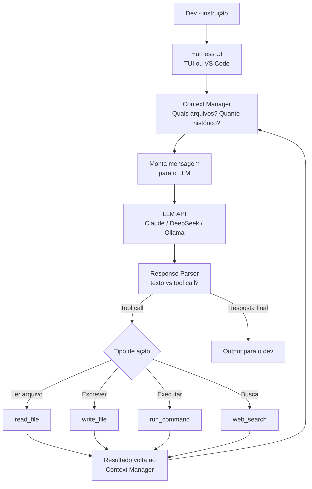

# OpenCode — o harness open source

> [!abstract] TL;DR
> Um harness de codificação é o scaffolding agentic — tool use, context management, UI, guardrails — que envolve qualquer LLM e o transforma em agente de código. OpenCode (TUI open-source da SST) e Cline (VS Code extension com 58k+ stars) lideram essa categoria em 2026. A proposta: separe a inteligência (o modelo, que você escolhe e paga diretamente) do framework (o harness, gratuito e auditável). Isso permite combinar modelos baratos como DeepSeek com um harness de qualidade — ou trocar de provider sem trocar de workflow. A limitação honesta: harness open-source depende do modelo escolhido para compensar a falta de polish das ferramentas proprietárias.

## O que é

Você quer usar Claude para coding, mas sem pagar a assinatura do Cursor ($20/mês) nem ficar preso ao Claude Code (que só funciona com modelos Anthropic). No mês que vem, sai o DeepSeek V4 que performa igual ao Claude Sonnet por 10x menos. Você quer trocar sem migrar de ferramenta. Esse é o problema que os **harnesses open-source** resolvem.

Um **harness de codificação** é o "esqueleto" em volta do LLM que provê:

- **[[Dicionário de IA#tool use|Tool use]]** — ler/escrever arquivos, executar comandos, buscar na web, fazer git commits
- **Context management** — decidir quais arquivos incluir, sumarizar histórico, manage do token budget
- **UI** — interface de terminal (TUI) ou editor (VS Code extension) para interação
- **[[Dicionário de IA#Guardrail|Guardrails]]** — permissões, confirmações antes de ações destrutivas, hooks de aprovação

O modelo é plugável — você escolhe qual LLM usar por baixo, traz sua própria API key, e paga diretamente ao provider sem markup. O harness em si é gratuito e open-source.

**Analogia de sistema:** pense no harness como um sistema operacional e no LLM como o processador. O SO (harness) gerencia memória, I/O, e processos — mas a potência de processamento (reasoning) vem do hardware (modelo). Um SO melhor não substitui um processador mais rápido, mas extrai mais dele. E, crucialmente, um SO open-source permite que você instale processadores diferentes sem pedir permissão ao fabricante — exatamente a liberdade que o Cline e o OpenCode oferecem.

## Por que importa

- **Liberdade de modelo** — use Claude Sonnet, DeepSeek V3, Qwen 3.6, ou modelos locais via Ollama — na mesma ferramenta, sem reaprender UI
- **Custo direto ao provider** — sem markup: o que a Anthropic cobra de $3/MTok você paga $3/MTok, sem assinatura adicional de plataforma
- **Auditabilidade total** — código open-source, você sabe exatamente o que o harness envia ao modelo e o que faz com a resposta
- **Vendor-neutrality estratégica** — quando DeepSeek V5 ou Llama 4 superar Claude Sonnet em coding, você troca de modelo em um parâmetro, não de ferramenta
- **Cline tem 58k+ stars** — é um dos repos open-source de mais rápido crescimento em AI coding em 2025-2026
- **Flexibilidade para times** — times podem criar políticas: "tasks de <500 tokens usam DeepSeek; tasks de >500 tokens com acesso a produção usam Claude Sonnet". O harness OSS permite automação dessas políticas; ferramentas proprietárias não expõem esse controle
- **Sem markup de plataforma** — Cursor e GitHub Copilot pagam tokens pelo usuário e repassam com markup embutido na assinatura. Com harnesses OSS, o custo por token é o preço direto da API — sem intermediário

## Histórico

> [!info] Dados sujeitos a caducidade
> Contagem de stars do Cline e as versões/marcos de OpenCode e Roo Code mudam mensalmente — trate os números abaixo como uma fotografia de 2025-2026, não como valor atual. Confira o GitHub de cada projeto antes de citar um número em conversa ou entrevista.

| Período | Evento |
| ------- | ------ |
| 2024 | **Claude Dev** (predecessor do Cline) lançado como extensão VS Code para interagir com Claude via API |
| Set 2024 | Claude Dev renomeado para **Cline** (mais genérico, model-agnostic); comunidade começa a crescer |
| Dez 2024 | Cline atinge 10k stars; adição de MCP support, multi-model |
| Jan 2025 | **Roo Code** (fork do Cline) lançado com features adicionais: múltiplos modos simultâneos, orchestration |
| Abr 2025 | **OpenCode** lançado pela equipe SST (Serverless Stack) — TUI terminal-first, model-agnostic |
| 2025 | Cline atinge 50k+ stars; Computer Use support via Anthropic API |
| 2026 | Cline com 58k+ stars; OpenCode como alternativa terminal popular; **Roo Code** torna-se a alternativa mais feature-rich para VS Code |

O crescimento do Cline reflete uma tendência mais ampla: devs querem controle sobre qual modelo usam e quanto pagam — sem ficar presos ao modelo de negócio de um produto proprietário como o Cursor.

**O movimento open-source em AI coding** é distinto do movimento open-source tradicional de décadas anteriores. Aqui, o open-source não é só sobre transparência de código — é sobre *portabilidade de workflow*. Se DeepSeek V4 superar Claude Sonnet em coding benchmarks amanhã, um usuário de Cursor precisa esperar que o Cursor integre o novo modelo. Um usuário de Cline muda um parâmetro de configuração e continua trabalhando. Essa portabilidade de workflow é a principal proposta de valor dos harnesses open-source em 2025-2026.

**SWE-Agent e o polo acadêmico:** além de OpenCode e Cline (foco em uso diário), existe o **SWE-Agent** (Princeton, MIT license) — harness voltado para research e benchmarks. SWE-Agent foi um dos primeiros agentes a obter alta performance no SWE-bench, o benchmark de resolução de issues reais do GitHub. Menos relevante para uso cotidiano, mas influente na pesquisa de como harnesses devem orquestrar tool use.

## Como funciona

### Arquitetura de um harness



O harness gerencia o loop inteiro — o modelo recebe apenas a mensagem montada e devolve uma resposta (texto ou tool call). O "cérebro" de reasoning é do modelo; o "sistema nervoso" de integração com o ambiente é do harness.

> [!question] Se o harness gerencia o loop, o que garante que ele faz isso bem?
> A qualidade do harness se manifesta em situações de borda: como ele age quando o LLM alucina um tool call malformado? Como ele decide o que incluir no contexto quando o arquivo é grande demais? Como ele apresenta um diff para aprovação de forma clara? Essas são as questões que diferenciam Claude Code (anos de refinamento) de um harness OSS mais novo. O Cline está bem nessas dimensões; ferramentas menores podem não estar. Testar com tasks reais antes de adotar é sempre a melhor avaliação.

 > [!tip] Assista: Cline + VS Code Changed How I Code Forever
> **Canal:** Mervin Praison | **Duração:** ~6min | **Idioma:** EN
>
> Demo rápido do Cline em ação: instalação, configuração com Claude e com Ollama (modelos locais), e criação de uma aplicação completa com um único prompt. O vídeo mostra na prática como o harness opera — Cline criando arquivos, editando código, abrindo o browser para testar — tudo com aprovação do dev a cada passo. Útil para ver a diferença de qualidade entre modelos potentes (Claude/GPT-4o) e modelos locais pequenos (8B) na mesma ferramenta. Trecho de destaque [0:01]: *"Cline, autonomous coding agent right in your IDE, capable of creating, editing files, executing commands, using the browser, and more with your permission every step of the way."*
>
> 🎬 [Assistir no YouTube](https://youtube.com/watch?v=KjqQC4AnJ1I)

### OpenCode — TUI terminal-first

**OpenCode** (opencode.ai) é criado pela equipe da SST (Serverless Stack — criadores do framework SST para deploy de aplicações serverless). É uma TUI (Text-based User Interface) que roda no terminal, similar ao Claude Code em experiência, mas model-agnostic e open-source:

```bash
# Instalar via script
curl -fsSL https://opencode.ai/install.sh | sh

# Usar com Claude Sonnet (traga sua API key)
export ANTHROPIC_API_KEY=sk-ant-...
opencode

# Usar com DeepSeek (muito mais barato)
export DEEPSEEK_API_KEY=...
opencode --model deepseek/deepseek-chat

# Usar com modelo local via Ollama (zero custo por token)
export OLLAMA_BASE_URL=http://localhost:11434
opencode --model ollama/qwen2.5-coder:32b

# Usar com qualquer endpoint OpenAI-compatible
export OPENAI_API_KEY=...
opencode --model openai/gpt-4o
```

O OpenCode suporta qualquer modelo via API compatível com OpenAI, além de provedores nativos (Anthropic, Google, Bedrock). Para trocar de modelo, é só mudar o parâmetro — o workflow do terminal, o historico de sessão e a configuração de projeto ficam idênticos.

### Cline — VS Code extension model-agnostic

**Cline** (github.com/cline/cline) é a extensão VS Code mais popular para agentes de IA, com 58k+ stars. Enquanto o Cursor tem seu próprio IDE, o Cline transforma o VS Code existente em ambiente agentic — sem mudar de editor:

**Funcionalidades principais:**
- **Multi-model:** Claude, GPT-4o, Gemini, DeepSeek, Llama, qualquer endpoint OpenAI-compatible
- **Task approval:** cada ação (escrever arquivo, executar comando) mostra um diff e pede aprovação
- **MCP support:** o Cline tem suporte a servidores MCP como cliente — integra com Supabase, Stripe, GitHub, Figma, etc.
- **Computer Use:** com a API Anthropic + Computer Use, pode ver a tela e interagir com UI
- **Auto-context:** crawl automático de arquivos relacionados ao contexto da task

```
# Configurar no VS Code (settings.json)
{
  "cline.apiProvider": "anthropic",
  "cline.apiKey": "sk-ant-...",
  "cline.model": "claude-sonnet-4-6",
  
  # Ou trocar para DeepSeek sem mudar mais nada:
  "cline.apiProvider": "deepseek",
  "cline.apiKey": "...",
  "cline.model": "deepseek-chat"
}
```

### Roo Code — fork do Cline com orchestration

**Roo Code** (fork do Cline, crescendo em 2025-2026) adiciona funcionalidades de orquestração que o Cline base não tem:

- **Modos personalizados** — crie personas/configurações diferentes (um modo "código", um modo "revisão", um modo "docs")
- **Orchestration** — um agente orquestrador delega subtasks a agentes especializados
- **Custo por task** — tracking de custo por sessão/task detalhado

Para workflows multi-agent em VS Code, Roo Code é mais poderoso que Cline base.

### Continue — extensão de chat + autocomplete

**Continue** (continuedev.org) cobre um caso de uso diferente do Cline: em vez de foco agentic, é chat + autocomplete configurável:

- Chat com contexto de arquivos abertos (similar ao Copilot Chat)
- Autocomplete com qualquer modelo (não apenas o OpenAI do Copilot)
- Extensão VS Code e JetBrains
- Configuração via `~/.continue/config.json` — define modelos diferentes para chat, autocomplete e embedding

O Continue não é agent-first: não itera em loop, não executa comandos de forma autônoma. É mais parecido com um Copilot configurável do que com o Cline/OpenCode. Para quem quer só o chat e o autocomplete com modelo próprio, o Continue é mais simples que o Cline.

### Configuração avançada — múltiplos modelos por tipo de task

A separação de modelos por função é um padrão poderoso que harnesses open-source permitem:

```json
// ~/.continue/config.json (Continue)
{
  "models": [
    {
      "title": "Claude Sonnet — complex tasks",
      "provider": "anthropic",
      "model": "claude-sonnet-4-6",
      "apiKey": "sk-ant-...",
      "roles": ["chat"]
    },
    {
      "title": "DeepSeek — autocomplete (fast, cheap)",
      "provider": "deepseek",
      "model": "deepseek-coder",
      "apiKey": "...",
      "roles": ["autocomplete"]
    },
    {
      "title": "Nomic Embed — embeddings (local)",
      "provider": "ollama",
      "model": "nomic-embed-text",
      "roles": ["embed"]
    }
  ]
}
```

Este padrão — modelo forte para chat, modelo rápido e barato para autocomplete, modelo local para embeddings — é impossível no Cursor ou Claude Code: eles não expõem esse nível de configuração. Com harnesses open-source, você otimiza custo e latência por tipo de operação.

## Quando usar

| Cenário | Harness OSS? | Melhor opção |
| ------- | ------------ | ------------ |
| Redução de custo com models baratos | ✅ Sim | Cline + DeepSeek V3 |
| Compliance: sem dados em cloud | ✅ Sim (Ollama) | Cline ou OpenCode + modelo local |
| VS Code como editor principal | ✅ Sim | Cline ou Continue |
| Terminal em servidor remoto/SSH | ✅ Sim | OpenCode |
| Integração MCP com ferramentas externas | ✅ Sim | Cline (melhor suporte MCP) |
| Task complexity alta e orçamento flexível | ⚠️ Depende | Claude Code para polish; Cline + Claude para custo |
| Time grande com suporte necessário | ⚠️ Cuidado | Cursor ou Claude Code têm mais suporte |
| Dev solo que experimenta modelos | ✅ Sim | Qualquer harness OSS |
| Auditoria de segurança do agente | ✅ Sim | Harness OSS é auditável; proprietário não |
| Produção em projeto crítico | ⚠️ Avaliar | Prefira ferramentas com mais track record (Claude Code, Cursor) |

## Comparativo com ferramentas proprietárias

| Aspecto | OpenCode / Cline | Claude Code | Cursor |
| ------- | ---------------- | ----------- | ------ |
| **Custo da ferramenta** | Grátis | Grátis (paga tokens) | $20/mês |
| **Liberdade de modelo** | ★★★★★ qualquer | ★★ Claude only | ★★★★ vários |
| **Qualidade do harness** | ★★★ (variável) | ★★★★★ | ★★★★★ |
| **Estabilidade** | ⚠️ OSS, ciclo rápido | ✅ Produção GA | ✅ Produção |
| **MCP support** | ★★★★★ (Cline nativo) | ★★★★★ | ★★ |
| **IDE integration** | ★★★★★ (Cline/Roo) | ★★★ (plugin) | ★★★★★ nativo |
| **Terminal-first** | ★★★★★ (OpenCode) | ★★★★★ | ★★ |
| **Comunidade** | ★★★★ (Cline 58k+) | ★★★★ | ★★★★★ |
| **Auditabilidade** | ★★★★★ código aberto | ❌ proprietário | ❌ proprietário |

**Veredicto:** para quem quer liberdade de modelo + custo direto ao provider + auditabilidade, Cline (no VS Code) ou OpenCode (no terminal) são as melhores opções. Para quem quer polish e suporte, Claude Code ou Cursor ganham.

## Casos práticos

### Caso 1 — Redução de custo 80% com DeepSeek

**Cenário:** time usa Cursor ($20/pessoa × 10 devs = $200/mês), mas a maioria das tasks são geração de código simples — scaffolding, migrations, testes boilerplate.

**Estratégia com Cline:**
```
Configuração: Cline + DeepSeek V3
Custo por task simples (10k tokens): ~$0.001
Versus: Cursor com Claude (~$0.03/task implícito no plano)
Economia: ~97% para tasks simples
```

Para tasks complexas (debugging, análise arquitetural), o time pode usar Claude Sonnet com Cline — mesmo harness, modelo mais potente, custo mais alto mas só quando necessário. A alternância é um parâmetro, não uma migração.

### Caso 2 — OpenCode em servidor remoto sem GUI

**Cenário:** você está conectado via SSH a um servidor de desenvolvimento ou a um codespace sem interface gráfica. Cursor e IDEs com extensão não funcionam.

**Com OpenCode:**
```bash
# No servidor remoto via SSH
ssh usuario@servidor.com

# OpenCode funciona em qualquer terminal TTY
export ANTHROPIC_API_KEY=sk-ant-...
opencode

# A TUI roda perfeitamente em terminal SSH
```

Cursor e Cline precisam de VS Code rodando localmente ou em servidor com Remote SSH configurado. OpenCode roda em qualquer ambiente com terminal — VMs, containers, servers de CI, codespaces sem GUI.

### Caso 3 — Auditoria de segurança com código aberto

**Cenário:** time de segurança precisa auditar qual código o agente envia para servidores externos antes de aprovar o uso em projetos com dados sensíveis.

**Com Cline/OpenCode:**
```bash
# Clonar e auditar o código do Cline
git clone https://github.com/cline/cline
# Buscar onde os dados são enviados
grep -r "fetch\|axios\|http" cline/src/api/ | grep -v ".test."
```

Com Claude Code ou Cursor, você não tem acesso ao código do cliente — precisa confiar na política de privacidade e nos termos de uso. Com Cline, o código é auditável — você sabe exatamente o que é enviado ao modelo e quando.

### Caso 4 — Experimentação de modelos na mesma codebase

**Cenário:** você quer comparar qual modelo resolve melhor sua task específica (debugging de race condition) sem mudar de ferramenta, de contexto ou de fluxo de trabalho.

**Com Cline:**
```
1. Task: "Debug this race condition in the PaymentService"
   Modelo: Claude Sonnet → identificou em 2 tentativas, custo $0.08
   
2. Mesma task, mesmo contexto:
   Modelo: DeepSeek V3 → precisou de 5 tentativas, custo $0.02
   
3. Mesma task:
   Modelo: Gemini 2.5 Pro → identificou em 3 tentativas, custo $0.06
```

O harness mantém o contexto, o histórico e a UI idênticos — você compara modelos em condições controladas.

### Caso 5 — Cline como hub central com MCP

**Cenário:** dev full-stack precisa de um agente que leia o banco de dados, consulte o Figma, abra PRs no GitHub e rode testes — tudo sem sair do editor.

**Com Cline + MCP servers:**
```json
// cline-mcp.json (configuração de servidores MCP no Cline)
{
  "mcpServers": {
    "supabase": {
      "command": "npx",
      "args": ["-y", "@supabase/mcp-server-supabase@latest"],
      "env": { "SUPABASE_URL": "...", "SUPABASE_KEY": "..." }
    },
    "github": {
      "command": "npx", 
      "args": ["-y", "@modelcontextprotocol/server-github"],
      "env": { "GITHUB_TOKEN": "..." }
    },
    "figma": {
      "command": "npx",
      "args": ["-y", "figma-mcp-server"],
      "env": { "FIGMA_TOKEN": "..." }
    }
  }
}
```

Com esses servidores configurados, o dev pode instruir o Cline: *"Veja o componente no Figma, crie o componente React correspondente, e abra um PR no GitHub"* — e o Cline executa cada passo usando os MCP servers apropriados. O Claude Code suporta o mesmo via MCP, mas o Cline permite usar DeepSeek por baixo, reduzindo o custo em ~80%.

## Armadilhas comuns

> [!warning] "Open source = mesma qualidade que proprietário"
> O harness pode ser excelente, mas o modelo barato pode não ter o reasoning necessário para tasks complexas. Um dev que tenta resolver um bug de concorrência com DeepSeek Flash via Cline e não consegue pode culpar o Cline — quando o problema é que a task exige Claude Sonnet ou Gemini 2.5 Pro. O harness é o scaffolding; o reasoning é do modelo.

> [!warning] Estabilidade variável em projetos OSS
> Ferramentas open-source têm ciclos de release mais rápidos, com mais bugs e breaking changes entre versões. Cline v3.x pode quebrar configurações do Cline v2.x sem aviso. Para uso em produção ou times maiores, mantenha versões fixadas no `extensions.json` e revise changelog antes de atualizar.

> [!warning] Menos guardrails built-in
> Ferramentas proprietárias têm mais proteções integradas — limites de ação, validações, confirmações padrão. Com harnesses open-source, você precisa configurar explicitamente o que quer aprovar vs o que pode rodar automaticamente. Para devs menos experientes, isso pode resultar em ações não intencionais (deletar arquivos, executar comandos perigosos).

> [!warning] MCP no Cline é client-side, não persiste entre sessões
> O suporte a MCP do Cline funciona bem, mas cada sessão precisa reconectar os servidores MCP. Para integrações MCP que precisam de estado persistente (ex: base de dados Supabase com contexto), verifique se o servidor MCP em uso suporta reconexão limpa.

> [!warning] OpenCode ainda é jovem (2025-2026)
> Lançado em 2025, o OpenCode tem menos tempo de mercado que o Cline e uma comunidade menor. Features esperadas (mais providers, melhor context management) podem estar em desenvolvimento. Para uso crítico, avalie o estado atual do GitHub antes de adotar.

## Como explicar em inglês

| Português | Inglês técnico | Contexto de uso |
| --------- | -------------- | --------------- |
| Harness de codificação | Coding harness / AI coding scaffold | "Cline is a coding harness, not the model itself" |
| Independente de modelo | Model-agnostic / vendor-neutral | "OpenCode is model-agnostic — bring your own key" |
| Troca de provider | Provider switching | "You can switch providers in one config line" |
| Custo direto | Direct API cost / no markup | "You pay the API directly — no Cursor markup" |
| Aprovação de tarefa | Task approval | "Every destructive action requires task approval" |
| Extensão de editor | Editor extension | "Cline is a VS Code extension" |
| Código auditável | Auditable codebase | "The harness code is fully auditable" |
| Suporte a MCP | MCP client support | "Cline has native MCP client support" |
| Interface de terminal | TUI (text-based UI) | "OpenCode provides a TUI similar to Claude Code" |
| Orquestração de agentes | Agent orchestration | "Roo Code adds agent orchestration on top of Cline" |

> [!tip] Frase de impacto para entrevistas
> *"We use Cline as our AI coding harness — it's model-agnostic, so we run Claude for complex reasoning tasks and DeepSeek for routine code generation. Same workflow, different cost profiles depending on the task."*

## O que vem a seguir

- **Convergência harness + MCP** — harnesses como Cline que implementam MCP nativamente se tornam hubs centrais para todas as ferramentas externas do dev (banco de dados, APIs, GitHub, CI/CD). Se MCP vencer como padrão da indústria, a vantagem de ferramenta proprietária em "integração nativa" se dilui — qualquer harness com MCP tem as mesmas integrações
- **Orchestration como feature padrão** — o que Roo Code adicionou como fork deve ser incorporado ao Cline e OpenCode mainstream: múltiplos agentes com papéis distintos (planner, coder, reviewer) coordenados pelo harness. Em 2025 é diferencial; em 2027 deve ser expectativa básica
- **Benchmarks de harness** — hoje os benchmarks (SWE-bench, Aider Polyglot) avaliam modelos em isolamento. A próxima geração vai avaliar harness + modelo juntos — context management, token efficiency, error recovery, custo total por task resolvida
- **Harness com memória persistente** — a maior lacuna atual: o contexto morre entre sessões. Harnesses que implementam memória de longo prazo (qual foi a decisão arquitetural da semana passada? que padrão este time usa para nomear variáveis?) vão se diferenciar dos que só têm memória de sessão
- **Consolidação ou fragmentação?** — o ecossistema de harnesses open-source pode seguir dois caminhos: consolidação em torno de 1-2 ferramentas dominantes (Cline + OpenCode), ou explosão de forks especializados (Roo Code, variantes para linguagens específicas). O histórico de OSS sugere fragmentação inicial, consolidação posterior

**O que observar para saber para onde o mercado vai:**
- Stars e issues do Cline vs OpenCode vs Roo Code no GitHub (crescimento relativo)
- Se o Claude Code ou Cursor adotam model-agnostic (que eliminaria a proposta de valor do harness OSS)
- Anúncio de funding ou aquisição do Cline pela Anthropic (já há especulação)

Esse mapa do ecossistema open-source responde "o que existe e como funciona" — mas na prática você só precisa escolher uma ferramenta para a sua próxima task. É essa escolha, entre OpenCode, Cline, Roo Code, Continue, Claude Code e Cursor, que [[11 - Comparativo — qual ferramenta para qual tarefa]] transforma em guia de decisão.

## Veja também

- [[09 - Aider — o pair programmer de terminal]] — harness open-source com foco Git e pair programming
- [[05 - Claude Code — terminal-first agent]] — harness proprietário com melhor polish e Claude only
- [[15 - MCP — o protocolo universal]] — protocolo que conecta harnesses com ferramentas externas
- [[12 - Multi-agent — workflows com múltiplos agentes]] — como harnesses como Roo Code implementam orchestration
- [[11 - Comparativo — qual ferramenta para qual tarefa]] — guia de decisão

## Referências

- **OpenCode** — *GitHub Repository* (SST, 2025-2026). Código e documentação. https://github.com/opencode-ai/opencode
- **Cline** — *GitHub Repository* (Apache 2.0). Extensão VS Code model-agnostic. https://github.com/cline/cline
- **Roo Code** — *GitHub Repository* (2025). Fork do Cline com orchestration. https://github.com/RooVetGit/Roo-Code
- **Continue** — *GitHub Repository* (Apache 2.0). Plataforma open-source para autocomplete + chat. https://github.com/continuedev/continue
- **SST** — *OpenCode: An open-source, model-agnostic AI coding tool* (2025). Post de lançamento. https://sst.dev/blog/opencode
- **Wang, John et al. (Princeton)** — *SWE-agent: Agent-Computer Interfaces Enable Automated Software Engineering* (2024). Paper original do SWE-Agent. https://arxiv.org/abs/2405.15793
- **Nakash, Zach** — *Why Cline went from 0 to 58k stars* (2025). Post analisando o crescimento do Cline como projeto open-source.
- **ModelContextProtocol.io** — *Model Context Protocol specification* (2025). Protocolo que Cline implementa como cliente MCP. https://modelcontextprotocol.io
- **Khaldi, Saoud M.** — *Cline: Open-source AI coding agent for VS Code* (2024-2026). Repositório e notas de release. https://github.com/cline/cline/releases
- **DeepSeek** — *DeepSeek-V3: Open-source frontier model* (Dez 2024). Modelo mais usado como alternativa de custo baixo em harnesses open-source. https://arxiv.org/abs/2412.19437
- **Continuedev** — *Continue: The open-source autopilot for software development* (2024). Documentação oficial com exemplos de configuração multi-model. https://docs.continue.dev
- **Anthropic** — *Computer Use (beta)* (2024). Feature do Cline que permite ao modelo ver a tela e interagir com UI via API Anthropic. https://docs.anthropic.com/en/docs/build-with-claude/computer-use
- **SWE-bench** — *Princeton NLP: Software Engineering Benchmark* (2024). Benchmark de referência para avaliação de agentes de código. https://swebench.com
- **Ollama** — *Run LLMs locally* (2026). Backend para execução de modelos locais — zero custo por token, zero dados em cloud. https://ollama.com
