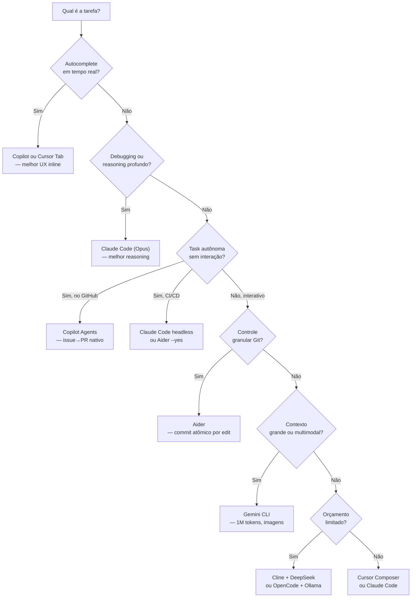

# Comparativo — qual ferramenta para qual tarefa

> [!abstract] TL;DR
> Não existe "melhor ferramenta de IA para código" — existe a ferramenta certa para a tarefa, o orçamento e o workflow. Para autocomplete inline: Copilot. Para coding em IDE com contexto visual: Cursor. Para reasoning profundo e autonomia: Claude Code. Para custo-zero: OpenCode + modelo local. Para CI/CD automatizado: Copilot Agents. Para auditabilidade Git: Aider. Para contexto de 1M tokens: Gemini CLI. A stack ideal combina 2-3 ferramentas por caso de uso — escolha por critério, não por hype. Um dev tentando resolver tudo com uma ferramenta é como tentar construir com apenas um tipo de ferramenta: funciona, mas subótimo.

## O problema da escolha

Segunda-feira, empresa nova, primeiro sprint. O tech lead pede que você use "IA para codar mais rápido". Você abre o browser: Cursor, Claude Code, Copilot, Windsurf, Gemini CLI, Aider, Cline — cada um com review de 5 estrelas, cada um se proclamando "o melhor agente de codificação de 2025". Depois de instalar quatro, você percebe que passou mais tempo configurando ferramentas do que codando.

O problema real não é que há poucas opções — é que *cada ferramenta foi otimizada para um conjunto diferente de trade-offs*, e ninguém te conta isso no marketing. Este guia faz isso.

**Por que este guia existe:** o galho de [[01 - De autocomplete a agentes autônomos|Agentes de Codificação]] cobre cada ferramenta em profundidade numa nota dedicada. Esta nota é o índice de decisão — ela não vai tão fundo quanto as notas individuais, mas responde à pergunta que as notas individuais não respondem: "dado meu contexto, qual ferramenta devo abrir agora?"

Pense nesta nota como a planta de um escritório e as notas individuais como as salas. A planta não te diz o que há dentro de cada sala — mas te diz em qual sala entrar para encontrar o que procura. Se você está em dúvida entre Cursor e Claude Code, esta é a nota. Se você já sabe que quer Claude Code e quer entender como configurar, vai para [[05 - Claude Code — terminal-first agent]].

Uma última coisa: nenhum comparativo externo substitui 30 minutos de uso na sua codebase real. Leia os cenários, olhe as tabelas, escolha a candidata mais provável — depois abra o terminal e teste. A intuição calibrada em uso real bate qualquer benchmark em contexto de entrevista ou de decisão de time.

**O framework de decisão:** toda ferramenta de IA para código envolve quatro trade-offs:
1. **Autonomia vs controle** — o agente itera sozinho ou você aprova cada passo?
2. **Integração com IDE vs terminal-first** — você quer IA no editor ou no terminal?
3. **Modelo fixo vs model-agnostic** — você aceita ficar preso a um provider pelo melhor polish?
4. **Custo de assinatura vs custo por token** — você paga por assento ou pelo que usa?

A ferramenta certa é a que resolve seus trade-offs, não a com o maior benchmark.

Existe um segundo problema além da escolha inicial: o *custo de manter a escolha atualizada*. Ferramentas de IA para código lançam atualizações de funcionalidade a cada semana. Um desenvolvedor que avaliou Cursor em Jan/2025 pode estar usando uma versão desatualizada do mental model — o Composer Agent de 2025 é substancialmente diferente do Cursor original. Revisitar a escolha a cada 6 meses é razoável; a cada semana, é paralisia.

**Como evitar a paralisia por análise:**
1. Escolha uma ferramenta principal para trabalho diário (mínimo 90 dias antes de avaliar mudança)
2. Reserve uma segunda ferramenta para tasks específicas onde a principal tem lacunas claras
3. Avalie uma nova ferramenta por mês apenas, sem migrar — só explora
4. Decida com base em uma task real do seu projeto, não em demos ou benchmarks

**Como avaliar uma nova ferramenta honestamente (protocolo mínimo):**

Use a mesma task 3 dias seguidos com a nova ferramenta e 3 dias com a atual. Meça:
- Tempo para completar a task (do início ao commit)
- Número de ciclos de correção necessários
- Custo em tokens/assinatura por dia

Se a nova ferramenta for >20% melhor nos três critérios → vale migrar. Se for >20% pior em qualquer um → descarta. Se for marginal → fica com o que você já domina (a curva de onboarding da nova ferramenta vai cancelar o ganho marginal por semanas).

## Histórico: como chegamos aqui

Para entender o comparativo atual, é necessário entender que as ferramentas não surgiram juntas — cada uma respondeu a uma limitação da geração anterior.

**2021-2022 — autocomplete dominante:** GitHub Copilot (Jun/2021) inaugurou a categoria com autocomplete por token. O modelo: completar o que você está digitando, sem entender o contexto global do projeto. Era suficientemente útil para ser adotado; insuficiente para tasks complexas. Tabnine tentou disputar a categoria, mas o gap de qualidade do Codex era grande demais.

**2023 — a virada conversacional:** ChatGPT (Nov/2022) muda a expectativa do que IA pode fazer com código — a interface conversacional revelou que você podia *explicar* o problema e receber código funcional, não só completar o que estava digitando. Cursor surgiu em 2023 como a resposta direta: IDE construída em torno de chat com contexto de arquivo. O Copilot respondeu com Copilot Chat (Mar/2023).

**2024 — multi-file e composer:** A limitação do chat se revelou: bom para um arquivo, ruim para refactoring que atravessa 10 arquivos. Cursor Composer (set/2024) foi a resposta. Cline (ex-Claude Dev, set/2024) mostrou que você podia ter o mesmo poder como plugin VS Code, não só em IDE proprietária. Aider já existia desde 2023, mas ganhou tração em 2024 com o Architect Mode (jan/2025).

**2025 — agentes autônomos e fragmentação:** Claude Code (fev/2025), Gemini CLI (jun/2025), Copilot Agents — todos chegaram ao mesmo conceito: o agente que itera sozinho, não só responde. A fragmentação do mercado cresceu junto: cada um com propostas de valor distintas (terminal-first vs IDE, modelo fixo vs agnostic, cloud vs local). OpenCode surgiu em abr/2025 como harness open-source para rodar qualquer modelo.

**2025 — fragmentação e open-source:** Ao mesmo tempo que os players proprietários cresceram (Cursor atingiu 1M+ usuários, Claude Code adotado em empresas Fortune 500), o movimento open-source ganhou força. Cline atingiu 58k+ stars no GitHub, OpenCode lançou em abr/2025, e o Aider estabeleceu o leaderboard de modelos como referência independente. A narrativa mudou de "qual IDE" para "qual harness + qual modelo".

**2026 — consolidação em stacks:** A tendência atual é o desenvolvedor não escolher *uma* ferramenta, mas montar uma *stack*: autocomplete de uma, reasoning pesado de outra, CI/CD de uma terceira. O comparativo nesta nota reflete esse estado — não "qual é a melhor" mas "qual para qual tarefa na sua stack".

> [!question] Por que nenhuma ferramenta dominou o mercado?
> Porque o espaço de decisão é genuinamente multidimensional: IDE vs terminal, modelo fixo vs agnostic, assinatura vs token, cloud vs local. Nenhuma ferramenta pode otimizar todos esses trade-offs ao mesmo tempo — e cada desenvolvedor pesa esses trade-offs de forma diferente.

## O mega-comparativo por capacidade

| Capacidade | 🥇 Melhor | 🥈 Segundo | 🥉 Terceiro |
| ---------- | --------- | ---------- | ----------- |
| **Autocomplete inline** | [[06 - GitHub Copilot e Copilot Agents\|Copilot]] | Cursor Tab | [[10 - OpenCode — o harness open source\|Continue]] |
| **Chat sobre código** | [[05 - Claude Code — terminal-first agent\|Claude Code]] | Cursor Chat | Copilot Chat |
| **Edição multi-file** | Cursor Composer | Claude Code | [[09 - Aider — o pair programmer de terminal\|Aider]] |
| **Reasoning/debugging** | Claude Code (Opus) | Cursor (Opus) | [[08 - Gemini CLI — o player Google\|Gemini CLI]] |
| **CI/CD automation** | Copilot Agents | Claude Code headless | — |
| **Liberdade de modelo** | [[10 - OpenCode — o harness open source\|Cline]] / Aider | Cursor | Gemini CLI |
| **Git integration** | Aider | Copilot | Claude Code |
| **Enterprise/compliance** | Copilot Enterprise | Cursor Business | — |
| **Custo-zero** | OpenCode + Ollama | Aider + Ollama | Continue |
| **Multimodal (imagens)** | Gemini CLI | Claude Code | Cursor |
| **Contexto ultra-longo** | Gemini CLI (1M) | Claude Code (200k) | Cursor (200k) |
| **MCP integrations** | Claude Code | Cline | — |
| **Open-source auditável** | Cline / Aider | OpenCode | Continue |

## Por perfil de desenvolvedor

| Perfil | Stack recomendada | Custo estimado |
| ------ | ----------------- | -------------- |
| **Dev júnior, aprendendo** | Copilot Free + Cursor Free Tier | $0/mês |
| **Dev pleno, produtividade** | Cursor Pro + Claude Code (tasks complexas) | $20-70/mês |
| **Dev sênior, controle** | Claude Code + Aider (git-centric) | $30-150/mês |
| **Dev indie, orçamento limitado** | Cline + DeepSeek API + Ollama | $5-15/mês |
| **Tech lead, enterprise** | Copilot Enterprise + Cursor Business | $39+/usuário/mês |
| **DevOps/CI-CD** | Copilot Agents + Claude Code headless | Variável |
| **Equipe com compliance rígido** | Aider ou Cline + Ollama local | $0 (hardware) |

### Notas sobre o comparativo por perfil

Dois perfis merecem mais contexto:

**Dev júnior, aprendendo:** a tentação é usar a ferramenta mais avançada disponível. Resista. Um júnior usando Claude Code em modo autônomo aprende menos do que um júnior usando Copilot com supervisão: a IA faz o trabalho, você aceita sem entender. Copilot (autocomplete) e Cursor Chat são melhores para aprendizado porque exigem que você entenda o que está acontecendo antes de aceitar a sugestão. Use autonomia alta depois de entender o domínio.

**Dev sênior, controle:** o sênior que usa Claude Code não o usa como oráculo — usa como par programador. A conversa é bidirecional: "isso faz sentido?", "quais são os trade-offs?", "por que não assim?". A ferramenta não substitui o julgamento de engenharia; amplifica a velocidade de explorar opções. Se você se perceber aceitando tudo que a IA sugere sem crítica, você está usando errado.

**Tech lead, enterprise:** a decisão não é só técnica — é de governança. Quais dados são enviados para qual provider? Quem tem acesso ao código gerado? Como integrar com o processo de code review existente? Copilot Enterprise tem resposta corporativa para essas perguntas (SSO, audit logs, data residency). Alternativas open-source (Cline + Ollama) respondem com "fica tudo dentro da empresa". Avaliar qual resposta satisfaz seu compliance é parte obrigatória da decisão para times enterprise.

## Por tipo de tarefa

| Tarefa | Ferramenta | Por quê |
| ------ | ---------- | ------- |
| Completar código enquanto digita | Copilot / Cursor Tab | Menor latência, melhor UX inline |
| Bug simples em 1 arquivo | Cursor Chat | Preview visual do fix |
| Refactoring em 5+ arquivos | Cursor Composer | Diffs visuais coordenados |
| Debugging de race condition | Claude Code (Opus + thinking) | Melhor reasoning |
| Feature do zero com specs | Claude Code + CLAUDE.md | Plan mode + autonomia |
| Resolver issue no GitHub | Copilot Agent | Workflow nativo issue→PR |
| Migração de dados em massa | Aider + script | Git audit trail por etapa |
| Análise de screenshot/UI | Gemini CLI | Multimodal nativo |
| Análise de codebase >200k tokens | Gemini CLI | 1M token context window |
| Experimentar modelos diferentes | OpenCode / Cline | Troca de modelo trivial |
| Code review de PR | Claude Code + Cursor | Reasoning + visual |
| Automação de lint no CI | Aider --yes | Modo não-interativo |
| Projeto GCP/Firebase | Gemini CLI | Integração nativa |

## Por custo mensal (dev full-time)

| Ferramenta | Custo ferramenta | Custo tokens (estimativa) | Total |
| ---------- | ---------------- | ------------------------- | ----- |
| Copilot Individual | $10/mês | Incluído | **$10/mês** |
| Cursor Pro | $20/mês | ~$30-100/mês* | **$50-120/mês** |
| Claude Code | $0 | ~$50-200/mês (Sonnet) | **$50-200/mês** |
| Gemini Advanced + CLI | $20/mês | Incluído (2.5 Pro) | **$20/mês** |
| Aider + DeepSeek API | $0 | ~$5-20/mês | **$5-20/mês** |
| Cline + Claude Sonnet | $0 | ~$30-100/mês (tokens diretos) | **$30-100/mês** |
| OpenCode + Ollama | $0 | $0 (hardware local) | **$0 (+GPU)** |

*\*Cursor Pro inclui 500 "fast requests" mensais; uso intensivo requer tokens extras do seu provider.*

> [!tip] Assista: Best AI Coding Tool in 2025? (Cursor vs Claude Code)
> Canal: Brandon Hancock | Duração: ~25min | Idioma: EN
>
> Análise detalhada do custo real por request (Cursor, Claude Code, Windsurf) com 4 perfis de desenvolvedor por orçamento — do "coding on budget" ao "baller". O ponto mais valioso: a comparação não é direta porque os dois usam modelos de cobrança diferentes. Trecho de destaque [18:42]: *"We're comparing apples to oranges — Cursor and all the other tools are per request. Claude Code is on a time basis."*
>
> 🎬 https://youtube.com/watch?v=sqj2ATbL7x8

**Como estimar seu custo real com Claude Code / Cline:**

A conta de tokens é calculada por entrada + saída. A entrada inclui o *context window* (todo o histórico da conversa + arquivos abertos + resultado de tools) — que cresce com cada turno. Uma sessão de debugging com 5 turnos e 3 arquivos abertos pode consumir 50-100k tokens de entrada por turno.

Estratégias para controlar custo:
- Use `/clear` entre tasks não relacionadas (zera o contexto acumulado)
- Prefira Sonnet a Opus para tasks de rotina ($3/MTok vs $15/MTok de entrada)
- Para CI/CD e scripts automatizados, use Haiku ($0.80/MTok — qualidade suficiente para tasks simples)
- Configure `CLAUDE_CODE_MAX_OUTPUT_TOKENS` para limitar respostas longas desnecessárias

**Para times:** multiplique o custo individual por 0.6-0.8 (não 1.0) — devs em reunião, code review, planejamento não usam a ferramenta o tempo todo. Um time de 5 devs não gasta 5× o custo de 1 dev em ferramentas de IA.

> [!question] Por que as comparações na internet contradizem umas às outras?
> Porque cada comparação avalia critérios diferentes (latência? qualidade? custo? UX?) em contextos diferentes (trabalho solo vs time, tarefa simples vs complexa, dev júnior vs sênior). "Cursor é melhor que Claude Code" e "Claude Code é melhor que Cursor" podem ser simultaneamente verdadeiros — dependendo de *o quê* está sendo medido. Quando ler comparações online, procure primeiro o critério usado, não a conclusão.

## Como usar este guia

Este comparativo não é uma receita — é um framework. O contexto sempre vence a tabela. Antes de escolher uma ferramenta, responda estas quatro perguntas:

**1. Qual é a tarefa específica?**
Não "codar" — mas "refatorar 15 arquivos para substituir axios por fetch" ou "debugar memory leak em Node.js em produção". Quanto mais específico, mais fácil é apontar a ferramenta certa.

**2. Qual é a restrição mais dura?**
Custo? Privacidade? IDE? Modelo específico? Identifique o *hard constraint* primeiro e elimine ferramentas que não passam nele.

**3. Qual é a tolerância para interação humana?**
Algumas tasks você quer supervisionar cada passo (migrations críticas → Aider). Outras você quer delegar e revisar o resultado (gerar testes → Copilot Agents). Isso define o eixo autonomia/controle.

**4. Você já tem uma ferramenta que faz 80% do trabalho?**
Se sim, pergunte se vale o custo de onboarding de uma ferramenta nova para ganhar os 20% restantes. Muitas vezes não vale.

Depois dessas quatro perguntas, consulte as tabelas. Elas organizam o *acervo*, mas não substituem o julgamento.

**Armadilha do "deixa eu testar todas":** testar quatro ferramentas em paralelo por uma semana cada não é avaliação — é turismo. Você não aprende nenhuma bem o suficiente para julgar com equidade. Escolha duas no máximo (sua atual + uma candidata), use durante 3 semanas numa tarefa real, depois decida.

## O mapa de decisão

## Cenários de escolha

### Cenário 1 — Dev sênior em empresa fintech

**Contexto:** código proprietário com dados financeiros, compliance rígido (não pode enviar para cloud sem aprovação), team de 5 devs, projeto Java + React.

**Stack recomendada:**
- **Para dia-a-dia:** Cline + modelo local via Ollama (DeepSeek-Coder:33b) — zero dados na nuvem, zero custo adicional
- **Para tasks críticas:** Aider + Claude Sonnet (API paga com Data Processing Agreement com Anthropic) — auditabilidade Git completa
- **Para code review:** Claude Code com plano pago ($20 Max) — reasoning superior, sessões pontuais

**Por que não Cursor:** requer verificação de que dados não são enviados para treino; para compliance, a auditabilidade do código aberto (Cline/Aider) é mais fácil de defender.

### Cenário 2 — Dev indie, aplicativo SaaS

**Contexto:** desenvolvendo sozinho, orçamento máximo de $50/mês de IA, precisa de velocidade, stack TypeScript + Node.js.

**Stack recomendada:**
- **Para a maior parte do trabalho:** Cursor Pro ($20/mês) + Cursor Tab — melhor UX, autocomplete, multi-file
- **Para tasks de debugging difícil:** Claude Code ($0 ferramenta, ~$10/mês estimado para 5-10 sessions/mês) — quando Cursor não resolve

**Custo total: ~$30/mês**, abaixo do teto de $50.

**Por que não Claude Code para tudo:** Cursor tem melhor UX para trabalho diário em IDE; Claude Code compensa com reasoning superior quando necessário.

### Cenário 3 — Time de CI/CD e DevOps

**Contexto:** pipeline de CI que analisa PRs, roda testes, gera changelogs, atualiza documentação automaticamente.

**Stack recomendada:**
- **Análise e feedback de PR:** Copilot Agents (integração nativa GitHub)
- **Auto-fix de lint:** Aider em modo `--yes` (não-interativo) com modelo barato
- **Geração de changelog:** Gemini Flash (~$0.001/execução)
- **Análise de impacto de mudanças:** Gemini CLI (1M tokens processa o repo inteiro)

**Por que Gemini Flash para CI:** a tarefa de changelog é repetitiva, simples, e roda centenas de vezes por mês. Gemini Flash a $0.075/MTok é 40× mais barato que Claude Sonnet para a mesma qualidade em tasks simples.

### Cenário 4 — Refactoring de codebase legado

**Contexto:** sistema legado 10 anos de idade, 200k+ linhas de código, precisa migrar de biblioteca obsoleta.

**Stack recomendada:**
- **Mapeamento inicial:** Gemini CLI — entender a codebase inteira em uma sessão com 1M tokens de contexto
- **Refactoring com auditoria:** Aider — cada migração de arquivo vira um commit atômico, reversível, com mensagem descritiva
- **Validação de cada mudança:** scripts de lint + testes via `--test` no Aider

**Por que Aider aqui:** um refactoring de 200k linhas sem auditabilidade é um pesadelo de debugging. O Aider garante que cada passo seja rastreável no Git.

### Cenário 5 — Time de pesquisa/IA experimentando modelos

**Contexto:** equipe de ML/AI que precisa comparar saídas de modelos diferentes (GPT-4o, Claude 3.7, Gemini 2.5 Pro, DeepSeek-V3) para tasks de codificação específicas.

**Stack recomendada:**
- **Teste A/B de modelos:** Cline ou Aider (model-agnostic) — troca de modelo via config, sem mudar workflow
- **Análise de custo:** Aider com `--model` flag para cada rodada — log de tokens exato por run
- **Tasks de contexto longo:** Gemini CLI para avaliar o comportamento de modelos com contexto >100k tokens

**Por que não Cursor:** o Cursor abstrai a escolha de modelo de forma que dificulta comparar respostas entre providers. Para pesquisa, você quer controle total sobre *qual* modelo gerou *qual* saída.

### Cenário 6 — Desenvolvedor em máquina sem internet

**Contexto:** trabalho em ambiente air-gapped (máquina desconectada) — banco, governo, defesa, P&D proprietário.

**Stack recomendada:**
- **IDE primário:** VS Code + Continue com modelo local
- **Modelo local:** Ollama com Code Llama 34b ou DeepSeek-Coder-V2:16b (funciona offline)
- **Harness:** Cline ou Aider + endpoint local (`--model ollama/deepseek-coder-v2`)
- **Setup:** `OLLAMA_BASE_URL=http://localhost:11434` + configurar harness para apontar ao endpoint local

**Trade-off real:** a qualidade de modelos locais em 2026 está a ~80% de modelos cloud em tasks simples, mas cai para ~60% em reasoning complexo. Para tasks críticas em ambiente air-gapped, aceitar essa limitação ou adquirir GPU maior (A100/H100) para modelos de 70b+.

## Armadilhas comuns na escolha

> [!warning] "Vou usar a ferramenta que passou no benchmark"
> Benchmarks (SWE-bench, HumanEval, LiveCodeBench) medem o *modelo* em condições controladas, não a *ferramenta* no seu workflow real. Uma nota alta no SWE-bench não significa que a ferramenta vai resolver seu bug de produção mais rápido. Teste em tasks reais do seu projeto antes de decidir.

> [!warning] "Preciso de apenas uma ferramenta"
> Cada ferramenta foi otimizada para um conjunto diferente de casos de uso. Tentar cobrir tudo com uma ferramenta é como tentar fazer tudo com um martelo — tecnicamente possível, mas subótimo. A stack de dois-três ferramentas (Cursor para IDE + Claude Code para reasoning + Copilot para autocomplete) é mais eficiente que uma só.

> [!warning] Custo acumulado invisível
> $20/mês de Cursor + $100/mês de tokens (Composer + Composer agent mode) = $120/mês por dev. Multiplique por um time de 10 e são $1.200/mês em ferramentas de IA. Monitore o consumo de tokens desde o início e defina políticas de uso por tipo de tarefa.

> [!warning] Trocar de ferramenta constantemente
> O custo de reaprender uma nova ferramenta (configuração, CLAUDE.md/CURSOR.md/GEMINI.md, plugins, keybindings, workflows) pode cancelar os ganhos de produtividade por semanas. Escolha, configure bem, domine — só troque quando tiver evidência clara de que a nova ferramenta resolve um problema que a atual não resolve.

> [!warning] Escolher por hype em vez de critério
> Toda ferramenta tem um pico de hype quando lança. Em 2024 foi Cursor, em 2025 foi Claude Code, em 2026 já são mencionados outros concorrentes. O critério deve ser: resolve meus trade-offs? Cabe no meu orçamento? Se a resposta for sim, o hype é irrelevante.

> [!warning] Ignorar a curva de onboarding
> Toda ferramenta de IA exige configuração para funcionar bem no seu projeto: CLAUDE.md, CURSOR.md, GEMINI.md, `.aider.conf.yml`, políticas de segurança de tools, templates de projeto. Um dev que instala a ferramenta e usa sem configurar está comparando a versão degradada contra a versão configurada do concorrente. A curva de onboarding real é de 1-2 semanas de uso intensivo, não 30 minutos de demo.

> [!warning] Usar ferramenta de agente para tarefa de chat simples
> Claude Code, Copilot Agents e Cline em modo agêntico consomem muito mais tokens que um chat simples — porque o agente itera, usa tools, relê arquivos múltiplas vezes. Para "me explique este código" ou "como faço X em Python", use Copilot Chat ou Cursor Chat. Reserve o modo agêntico para tasks que genuinamente precisam de iteração autônoma.

## Matriz de decisão rápida

Quando o tempo é curto e você precisa escolher agora:

| Se você precisa de... | Use |
| --------------------- | --- |
| Autocomplete rápido sem configuração | Copilot |
| IDE com IA para trabalho diário | Cursor Pro |
| Debugging difícil que o Cursor não resolveu | Claude Code |
| Implantar feature do zero com autonomia | Claude Code (plan mode) |
| Migrar código com auditoria Git | Aider |
| Analisar screenshot, diagrama ou UI | Gemini CLI |
| Processar codebase inteira (>100k linhas) | Gemini CLI |
| Gastar menos de $15/mês | Aider + DeepSeek API |
| Gastar $0 sem GPU | OpenCode + Ollama (qualidade menor) |
| Compliance/dados não podem sair da empresa | Cline + Ollama local |
| Task de CI automatizada sem humano | Copilot Agents ou Aider `--yes` |
| Comparar múltiplos modelos | Cline ou Aider (model-agnostic) |

Essa tabela resolve 80% das decisões. Para os 20% restantes — leia os cenários acima.

> [!question] E o Windsurf, Tabnine, Amazon CodeWhisperer?
> Este comparativo foca nas ferramentas com maior adoção e proposta de valor distinta no mercado em 2026. Windsurf (IDE da Codeium) tem cobertura completa na nota [[07 - Windsurf e Cascade]]: é relevante como alternativa ao Cursor com modelo Cascade proprietário e um plano gratuito mais generoso. Amazon CodeWhisperer foi renomeado para Amazon Q Developer em 2024 — focado em ecossistema AWS, pouco relevante fora dele. Tabnine mantém adoção em enterprises com compliance que exigem on-premise, mas perdeu market-share significativo para Copilot Enterprise. Devin e agentes cloud autônomos têm nota dedicada: [[13 - Devin e agentes autônomos cloud]].

## Como explicar em inglês

| Português | Inglês técnico | Contexto de uso |
| --------- | -------------- | --------------- |
| Guia de decisão | Decision guide / tool selection guide | "Use this as a decision guide for AI tools" |
| Sweet spot | Sweet spot | "Cursor's sweet spot is multi-file editing" |
| Pilha de ferramentas | Tool stack / toolkit | "My AI coding stack is Cursor + Claude Code" |
| Custo por token | Cost per token | "DeepSeek has a much lower cost per token" |
| Caso de uso | Use case | "What's the main use case for this tool?" |
| Rastreabilidade | Auditability / traceability | "Aider provides full Git auditability" |
| Autonomia vs controle | Autonomy vs control | "The autonomy vs control trade-off" |
| Modelo fixo | Model lock-in | "Cursor has model lock-in; Cline doesn't" |
| Benchmark | Benchmark | "Don't choose by benchmark alone" |
| Assinatura vs pago por uso | Subscription vs pay-per-use | "Copilot is subscription; Claude Code is pay-per-use" |
| Agente de codificação | Coding agent | "Claude Code is a coding agent, not just a chat tool" |
| Janela de contexto | Context window | "Gemini CLI has a 1M token context window" |
| Completar código inline | Inline code completion | "Copilot's strength is inline code completion" |
| Modo autônomo | Agentic mode / autonomous mode | "In agentic mode, the tool iterates without asking" |
| Revisão de código | Code review | "We use Claude Code for AI-assisted code review" |
| Harness | Harness / scaffolding | "Cline is a harness — it wraps any model" |
| Integração contínua | CI/CD (continuous integration/delivery) | "Copilot Agents integrates with our CI/CD pipeline" |
| Modelo local | Local model | "We run a local model via Ollama for compliance" |

> [!tip] Frase de impacto para entrevistas
> *"We don't use just one AI coding tool — we have a stack. Cursor for daily IDE work, Claude Code for complex debugging, and Aider for migrations where we need full Git auditability. Each tool has its sweet spot, and combining them is more effective than trying to force one tool for everything."*

## O que vem a seguir

O landscape de ferramentas de IA para código está mudando mais rápido do que qualquer outra área de software. O comparativo que você acabou de ler estará parcialmente desatualizado em 6 meses. Não porque as ferramentas desaparecem, mas porque novos players ou features mudam onde cada ferramenta brilha.

Alguns vetores a monitorar:

- **Model-agnostic como commodity** — se Cursor ou Claude Code se tornarem model-agnostic, a proposta de valor do Cline/OpenCode se dilui. Em 2026, ainda há diferenciação clara; em 2027, pode não haver
- **MCP como hub de integração** — ferramentas que implementam MCP bem se tornam hubs para ecossistema de ferramentas. Isso pode mudar qual ferramenta domina uma categoria
- **Preço dos modelos caindo** — preços de APIs caem historicamente 2-5× por ano. A análise de custo deste comparativo pode estar desatualizada em 12 meses
- **Agentes autônomos de longa duração** — tasks que hoje levam 30 min de interação humana podem ser delegadas completamente em 2027. Isso mudará o critério de "autonomia vs controle". Ver [[16 - O loop agentic — plan, act, observe]] para entender o mecanismo por trás disso
- **Memória persistente de projeto** — ferramentas que conseguirem manter memória de longo prazo do projeto (não só o contexto da sessão atual) vão ter uma vantagem enorme. CLAUDE.md é um passo nessa direção; memória semântica persistente é o próximo
- **Vercel v0, Bolt, Lovable — o segmento de prototipagem** — uma categoria que este comparativo não cobre: ferramentas para gerar protótipos visuais/UIs do zero a partir de texto. Para código de produção, essas ferramentas ficam fora do escopo; para MVPs e provas de conceito, já são competidoras reais do Cursor
- **Consolidação via aquisição** — é provável que algumas ferramentas (Cursor? Cline?) sejam adquiridas por empresas maiores nos próximos 24 meses, mudando quem controla o roadmap

**Como manter-se atualizado:** Aider publica rankings mensais de modelos em tasks reais; Stack Overflow Developer Survey cobre adoção anual; o canal da Pragmatic Engineer (Gergely Orosz) analisa tendências com dados de times reais. Essas três fontes cobrem o suficiente sem precisar ler cada launch no Twitter.

A nota [[18 - Benchmarks e avaliação — SWE-bench e além]] expande como interpretar os benchmarks que cada ferramenta usa para se autopromover.

**Uma previsão calibrada:** em 2028, o mercado de ferramentas de IA para código provavelmente terá 2-3 vencedores claros (como IDEs: VS Code, JetBrains, um terceiro) e uma longa cauda de ferramentas nicho. O que vai determinar os vencedores não é quem tem o melhor modelo hoje (isso muda mensalmente), mas quem tem o melhor *acoplamento com o workflow do desenvolvedor* — o arquivo de configuração mais poderoso, o melhor entendimento do projeto, a integração mais profunda com Git/CI/CD. As ferramentas que vencerem serão as que entenderem que o modelo é commodity e o *contexto do projeto* é o diferencial.

## Veja também

As notas de cada ferramenta entram em profundidade onde este comparativo necessariamente é superficial — leia a nota específica quando for avaliar uma ferramenta para adoção real:

- [[04 - Cursor — AI-native IDE]] — arquitetura do Cursor (Composer, Chat, Tab), modelos disponíveis, configuração e preços; capstone do segmento IDE proprietária
- [[05 - Claude Code — terminal-first agent]] — como funciona o loop agentic do Claude Code, CLAUDE.md, plan mode e integração com MCP
- [[06 - GitHub Copilot e Copilot Agents]] — cobertura completa do Copilot: autocomplete, Chat, Copilot Agents e Enterprise
- [[07 - Windsurf e Cascade]] — alternativa ao Cursor com Flows e modelo proprietário Cascade
- [[08 - Gemini CLI — o player Google]] — Gemini CLI: 1M token context, multimodal, open-source e integração GCP
- [[09 - Aider — o pair programmer de terminal]] — Aider: git-first, Architect Mode, model-agnostic, repository map via tree-sitter
- [[10 - OpenCode — o harness open source]] — Cline, OpenCode, Roo Code e Continue; como harnesses open-source diferem de ferramentas proprietárias
- [[12 - Multi-agent — workflows com múltiplos agentes]] — quando usar múltiplos agentes em paralelo, padrões de orquestração
- [[16 - O loop agentic — plan, act, observe]] — o mecanismo fundamental que todas essas ferramentas implementam
- [[18 - Benchmarks e avaliação — SWE-bench e além]] — como interpretar SWE-bench, LiveCodeBench e os leaderboards que cada ferramenta usa em seu marketing

## Referências

- **Artificial Analysis** — *AI Coding Tool Comparison* (2026). Benchmarks independentes de modelos e ferramentas — cobertura ampla de latência, custo e qualidade. https://artificialanalysis.ai
- **Stack Overflow** — *Developer Survey 2026 — AI Tools*. Dados de adoção por categoria e perfil de desenvolvedor, maior amostra da indústria. https://survey.stackoverflow.co/2026
- **Aider** — *LLM Leaderboards for Coding* (2026). Ranking de modelos em tasks reais de refactoring — único ranking que usa edições reais de código, não respostas de chat. https://aider.chat/docs/leaderboards/
- **The Pragmatic Engineer** — *Best AI coding tools in 2026* (Gergely Orosz, mai/2026). Análise de adoção em times de engenharia com dados de surveys proprietários. https://newsletter.pragmaticengineer.com
- **GitHub** — *Octoverse 2025: The state of AI coding tools*. Dados de adoção em projetos open-source no GitHub. https://octoverse.github.com
- **Anthropic** — *Claude Code documentation: Best practices*. Guia oficial de uso de Claude Code incluindo configuração via CLAUDE.md. https://docs.anthropic.com/claude-code
- **Cursor** — *Cursor changelog and documentation*. Histórico de features e roadmap do Cursor IDE. https://cursor.com/changelog
- **Cline** — *Cline GitHub repository*. Código-fonte e documentação do Cline (harness VS Code, 58k+ stars). https://github.com/cline/cline
- **Windsurf** — *Windsurf documentation: Cascade and Flows*. Documentação do modelo Cascade e do sistema Flows da Codeium. https://docs.windsurf.com
- **Google** — *Gemini CLI GitHub repository*. Documentação oficial e changelog do Gemini CLI. https://github.com/google-gemini/gemini-cli
- **Ollama** — *Ollama model library*. Catálogo de modelos disponíveis para execução local, incluindo DeepSeek-Coder e Code Llama. https://ollama.com/library
- **DeepSeek** — *DeepSeek-Coder-V2: Breaking the Barrier of Closed-Source Models in Code Intelligence* (2024). Artigo técnico do modelo que popularizou IA de código de baixo custo. https://arxiv.org/abs/2406.11931
