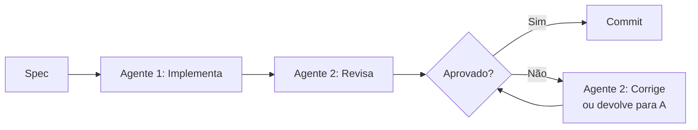
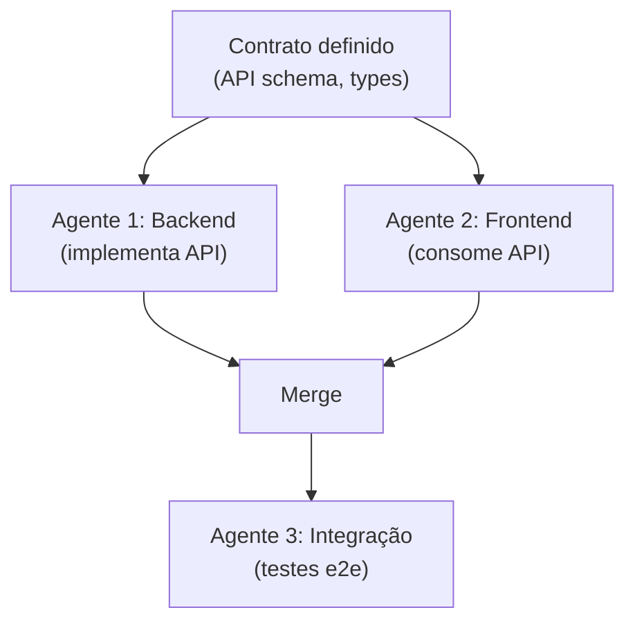
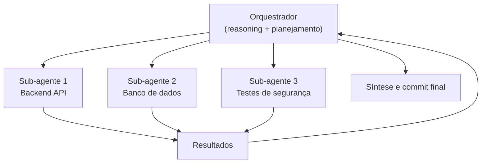

# Multi-agent — workflows com múltiplos agentes

> [!abstract] TL;DR
> Multi-agent é o padrão de usar dois ou mais agentes AI trabalhando em paralelo ou em pipeline na mesma codebase. Três padrões fundamentais: pipeline (A implementa, B revisa), paralelo (A no backend, B no frontend) e hierárquico (um orquestrador delega para sub-agentes especializados). O padrão mais estável é pipeline — o paralelo funciona, mas somente quando as tarefas são verdadeiramente independentes e os agentes trabalham em módulos disjuntos. O hierárquico é o mais poderoso, mas exige que o orquestrador seja capaz de raciocinar sobre dependências. Em 2026, ferramentas como Claude Code, Devin e Copilot Agents implementam variantes desses padrões com graus diferentes de maturidade.

## O problema que multi-agent resolve

Você delegou uma feature inteira para um agente. Ele vai bem nos primeiros 10 minutos — escreve o endpoint, cria o schema, conecta o banco. Então trava. O agente não consegue escrever os testes porque eles dependem de um usuário de teste que ainda não existe no banco de dados, e ao mesmo tempo ele está tentando implementar a lógica de negócios que depende de um serviço ainda não criado. Um agente único serializa tudo — ele não consegue fazer A, B e C em paralelo quando eles dependem uns dos outros.

Multi-agent é a resposta: você divide o problema em partes que podem ser trabalhadas simultaneamente ou em sequência com feedback loops, e atribui cada parte a um agente especializado. O resultado é como a diferença entre um programador solo e uma equipe — não o triplo de velocidade (há overhead de coordenação), mas potencialmente o dobro, com qualidade maior.

A questão não é "multi-agent é melhor?" — é "quando a tarefa justifica o overhead de coordenação?"

**Os dois tipos de paralelismo:** há paralelismo de *velocidade* (fazer a mesma task mais rápido dividindo o trabalho) e paralelismo de *qualidade* (fazer a mesma task melhor usando múltiplas perspectivas). O primeiro exige tarefas independentes. O segundo — como o padrão de revisão adversarial — funciona até em tarefas sequenciais, porque o objetivo não é dividir o trabalho, é atacar o mesmo output de ângulos diferentes.

Pense na analogia com times de engenharia: Sprint planning (hierárquico), backend + frontend em paralelo (paralelo), e code review separado de quem implementou (pipeline) — são os mesmos três padrões que o multi-agent reproduz, só que com agentes em vez de pessoas. A diferença é que agentes são mais baratos e mais rápidos do que desenvolvedores humanos — mas ainda herdam os mesmos trade-offs de coordenação.

## Histórico: como chegamos aqui

**2022-2023 — agente único como padrão:** A primeira geração de ferramentas (Copilot, Cursor, Cline) trabalhava com um único agente e um único contexto. A limitação era clara: um agente não consegue trabalhar em backend e frontend ao mesmo tempo, ou implementar e revisar a mesma mudança com perspectivas diferentes.

**2024 — primeiros experimentos paralelos:** A comunidade começou a experimentar sessões paralelas de Claude via API e tmux — dois terminais, dois contextos, trabalhando em módulos diferentes. Era frágil (conflitos de arquivo, sem coordenação real), mas mostrou o potencial.

**2025 — frameworks de orquestração:** LangGraph, CrewAI, AutoGen e similares formalizaram os padrões de multi-agent com primitivas de orquestração (state machine, message passing, tool use compartilhado). Claude Code lançou suporte a sub-agentes via `Task` tool — um agente pode agora spawnar outros agentes e esperar seus resultados.

**2026 — integração nas ferramentas mainstream:** Devin e Copilot Agents implementam hierarquia nativamente. Claude Code estabilizou o padrão de sub-agentes. A questão de "como fazer multi-agent" foi respondida — a questão atual é "quando faz sentido".

O que mudou de 2024 para 2026 não foi só a disponibilidade das ferramentas — foi a maturação dos padrões. Em 2024, multi-agent era experimental e frágil. Em 2026, há padrões estabelecidos (pipeline, paralelo, hierárquico), ferramentas que os implementam nativamente, e evidência suficiente sobre quando cada um funciona. O risco não é mais "vai funcionar?" — é "vale o overhead?"

> [!question] Por que multi-agent não é o padrão para tudo?
> Overhead real: cada agente adicional replica o contexto (custo de tokens), adiciona latência de coordenação, e aumenta a superfície de inconsistências. Um único agente com contexto bem estruturado muitas vezes supera dois agentes mal coordenados. O padrão multi-agent brilha em tarefas genuinamente paralelizáveis com contratos de interface claros entre elas.

## Os três padrões fundamentais

### Padrão 1: Pipeline (implementa → revisa)

O mais estável. Um agente faz, outro verifica. O segundo agente tem perspectiva diferente — ele vê o output como uma caixa preta a ser avaliada, não como o processo que construiu.



Exemplo com Claude Code:

```bash
# Sessão 1: Agente que implementa
claude "Implement user registration endpoint per spec.md. \
  Write the handler, model, and migration."

# Sessão 2: Agente que revisa (novo contexto — perspectiva independente)
claude "Review the changes in the last commit. Check for: \
  1. Security issues (SQL injection, missing auth) \
  2. Missing test coverage \
  3. Code style violations \
  4. Missing error handling"
```

**Por que novo contexto no revisor?** Um agente que implementou algo tem viés de confirmação — ele "sabe" como o código funciona. Um agente com contexto limpo avalia como um revisor humano externo.

**Variação: pipeline de 3 fases:**

```bash
# Fase 1: Implementa
claude "Implement the payment webhook handler per spec.md"

# Fase 2: Testa
claude "Write unit and integration tests for the webhook handler \
  just committed. Run them and fix failures."

# Fase 3: Documenta
claude "Document the webhook handler: docstring, README section, \
  and usage examples. Base it only on the code — don't invent behavior."
```

Cada fase tem um agente independente, em ordem. O produto de cada fase é o input da próxima.

### Padrão 2: Paralelo (módulos disjuntos)

Dois ou mais agentes trabalhando simultaneamente em partes diferentes do codebase. Funciona quando há contratos claros entre os módulos (API schema, interface types) definidos antes dos agentes começarem.



```bash
# Pré-condição: schema definido em openapi.yaml

# Terminal 1 — Backend (trabalha em /backend/)
claude "Implement the endpoints defined in openapi.yaml. \
  Work only in the /backend/ directory."

# Terminal 2 — Frontend (trabalha em /frontend/)
claude "Build the React components that consume the API \
  defined in openapi.yaml. Work only in /frontend/."

# Após ambos finalizarem:
# Terminal 3 — Integração
claude "Run the e2e tests and fix any integration issues \
  between the /backend/ and /frontend/ implementations."
```

> [!warning] O contrato vem antes dos agentes
> Agentes paralelos sem contrato de interface vão tomar decisões inconsistentes. O backend pode retornar `{ user_id: 123 }` enquanto o frontend espera `{ userId: 123 }`. Defina o schema/interface ANTES de iniciar os agentes paralelos — nunca depois.

### Padrão 3: Hierárquico (orquestrador + sub-agentes)

O mais poderoso e o mais complexo. Um agente central (orquestrador) decompõe o problema, delega partes para sub-agentes especializados, e sintetiza os resultados.



Com Claude Code (Task tool):

```bash
# O orquestrador define o plano e invoca sub-agentes:
claude --model claude-opus-4-8 "
You are the orchestrator for implementing the payment feature.

1. Spawn a subagent to implement the payment API endpoint
2. Spawn a subagent to create the database migration
3. Spawn a subagent to add security tests
4. After all complete, review consistency and create final commit.

Use the Task tool to spawn each subagent in parallel.
"
```

O orquestrador usa um modelo com mais capacidade de reasoning (Opus); os sub-agentes podem usar Sonnet para economizar custo.

**Por que Opus só no orquestrador:** o orquestrador toma as decisões difíceis — decompor o problema, identificar dependências, verificar consistência do output dos sub-agentes. Essas são as tasks que realmente exigem reasoning profundo. Os sub-agentes executam tarefas bem definidas e repetíveis onde Sonnet é suficiente. A proporção de custo típica: 1 chamada Opus (orquestrador) + N chamadas Sonnet (sub-agentes) é mais barata que N+1 chamadas Opus.

> [!question] Qual é o limite prático de sub-agentes em paralelo?
> Na prática, 3-5 sub-agentes são o teto útil para a maioria das tasks. Acima disso, o overhead de síntese (orquestrador processando 10 reports) cresce mais rápido do que o ganho de paralelismo. Para tarefas de migração em lote (50+ arquivos), use paralelismo em lotes de 5-10, não todos de uma vez.

### Custo real de multi-agent

Antes de usar qualquer padrão, faça a conta:

```
Custo multi-agent = (custo do orquestrador) + Σ(custo de cada sub-agente × tokens médios)
Custo single-agent = custo de tokens do agente único

Vale a pena se: ganho de velocidade × valor do seu tempo > diferença de custo
```

Exemplo concreto: migração de 80 arquivos.
- Single-agent: 12h × $0 de custo de tempo humano + ~$8 de tokens = $8 + seu tempo
- Multi-agent (4 agentes): 3h × $0 + ~$32 de tokens = $32 + seu tempo

Se sua hora de espera vale mais de $8, o multi-agent compensa. Se não (ex: CI rodando à noite sem ninguém esperando), o single-agent é mais econômico.

## Quando usar cada padrão

| Cenário | Padrão | Por quê |
| ------- | ------- | ------- |
| Feature com backend + frontend separados | Paralelo | Módulos com contrato claro |
| Implementar + code review | Pipeline | Perspectiva independente |
| Bug crítico que precisa de 3 ângulos diferentes | Pipeline (3 revisores) | Detecção adversarial |
| Migração de 50 arquivos | Paralelo por lote | Tarefas idênticas e independentes |
| Feature complexa com múltiplas camadas | Hierárquico | Decomposição e síntese |
| Task simples de refactoring | Nenhum | Um agente suficiente |
| Dois agentes no mesmo arquivo | Evitar | Conflito garantido |
| Geração de testes em paralelo com o código | Pipeline | Testes dependem do contrato do código |
| Code review de segurança crítico | Pipeline (3 revisores) | Perspectivas especializadas |
| Documentação de 40+ módulos | Paralelo | Módulos independentes |

**Regra prática:** se você consegue descrever a divisão de trabalho em menos de 2 frases por agente, o paralelismo provavelmente funciona. Se a divisão exige uma explicação longa de dependências, use pipeline ou single-agent.

> [!tip] Assista: How We Build Effective Agents — Barry Zhang, Anthropic
> **Canal:** AI Engineer | **Duração:** ~18min | **Idioma:** EN
>
> Barry Zhang (Anthropic) apresenta no AI Engineer Summit 2025 a framework interna da Anthropic para decidir quando usar agentes versus workflows — exatamente o raciocínio que está por trás da tabela acima. O argumento central: agente é para tarefas *ambíguas e valiosas* cujo custo de erro é verificável; workflow é para tudo com fluxo de decisão mapeável. Trecho de destaque [12:41]: *"I have a personal conviction that we will see a lot more multi-agent collaborations in production… They're well parallelized. They have very nice separation of concerns, and having a subagent will really protect the main agent's context window."*
>
> 🎬 https://www.youtube.com/watch?v=D7_ipDqhtwk

## Casos práticos

### Caso 1 — Implementação full-stack em paralelo

**Cenário:** nova feature de upload de documentos (backend S3 + frontend drag-and-drop). Prazo apertado.

**Setup:**
1. Definir o contrato: endpoint `POST /api/upload`, response `{ url, key }`, tamanho máximo 10MB
2. Agente 1 (Terminal 1): implementa o endpoint com Multer + S3 SDK, só em `/backend/`
3. Agente 2 (Terminal 2): implementa o componente React com `react-dropzone`, só em `/frontend/`
4. Agente 3 (após ambos): testes de integração e fix de CORS

**Resultado:** 40 minutos vs ~90 minutos sequencial. A chave foi o contrato definido antes.

### Caso 2 — Revisão de segurança adversarial

**Cenário:** código de autenticação crítico antes de ir para produção. Não confiar em apenas um revisor.

**Setup:**
```bash
# Três revisores independentes com perspectivas diferentes

# Revisor 1: OWASP Top 10
claude "Review auth.py for OWASP Top 10 vulnerabilities only. \
  Focus on: injection, broken auth, sensitive data exposure."

# Revisor 2: Race conditions e concorrência
claude "Review auth.py for race conditions, timing attacks, \
  and concurrency issues."

# Revisor 3: Completude de testes
claude "Review the test coverage for auth.py. Identify \
  missing edge cases and boundary conditions."
```

**Por que 3 revisores:** cada um tem um viés de busca diferente. O que o revisor 1 vai perder por focar em OWASP, o revisor 2 ou 3 pode encontrar.

### Caso 3 — Pipeline de code review com três perspectivas

**Cenário:** PR com lógica de autenticação que precisa passar por security review antes do merge. A equipe não tem capacity de review humano naquele sprint.

**Setup (3 revisores especializados em pipeline):**

```bash
# Revisor 1: Segurança (OWASP Top 10)
claude "Review the diff in this PR for OWASP Top 10 vulnerabilities. \
  Focus ONLY on security issues — injection, broken auth, sensitive data exposure, \
  missing authorization checks. Output a numbered list of findings."

# Revisor 2: Lógica de negócio
claude "Review the diff in this PR for business logic correctness. \
  Does it handle all edge cases? Are there race conditions? \
  Are there missing validation checks? Output findings."

# Revisor 3: Qualidade e testes
claude "Review the diff in this PR. Check: \
  1. Test coverage — what's missing? \
  2. Error handling — what can fail silently? \
  3. Observability — are there missing logs/metrics? \
  Output findings as a checklist."

# Orquestrador: sintetiza os três reports
claude "You have received three independent code review reports.
  Deduplicate, prioritize by severity (Critical/High/Medium/Low),
  and produce a final review checklist for the developer."
```

**Por que não um único revisor:** um agente instruído a "revisar tudo" inevitavelmente prioriza um ângulo (geralmente o primeiro item da instrução) e superficializa os outros. Três revisores especializados com instrução estreita encontram mais problemas.

### Caso 4 — Geração de documentação em paralelo

**Cenário:** 40 módulos sem documentação, cada um independente.

```bash
# Cada agente documenta um grupo de módulos
for group in auth payments users reports orders inventory; do
  claude "Document all functions in /src/$group/. \
    Generate JSDoc comments from the code. \
    Do NOT modify logic — only add documentation." &
done
wait
echo "All documentation agents completed"
```

**Resultado:** 20 minutos vs ~2h sequencial. Só funciona porque os módulos são independentes — `auth` não importa de `payments`.

### Caso 5 — Migração em lote com paralelo controlado

**Cenário:** migrar 80 endpoints de Express 4 para Express 5 (breaking changes no error handling).

**Setup:**
- Dividir os 80 endpoints em 4 grupos de 20 (por domínio funcional)
- Rodar 4 agentes em paralelo, cada um em seu grupo
- Agente de validação final verifica consistência

```bash
# Cada agente recebe só os arquivos do seu grupo
claude "Migrate the files in /backend/routes/auth/ from Express 4 to 5. \
  Use the migration guide in MIGRATION.md. Only touch files in /auth/."

claude "Migrate the files in /backend/routes/payments/ from Express 4 to 5. \
  Use the migration guide in MIGRATION.md. Only touch files in /payments/."
```

**Resultado:** 4h vs ~12h sequencial. O overhead de coordenação foi ~30 minutos de setup.

## Armadilhas comuns

> [!warning] Conflitos de edição em arquivo compartilhado
> Dois agentes editando o mesmo arquivo ao mesmo tempo é receita para corrupção — um sobrescreve o trabalho do outro, ou o Git não consegue fazer merge automático. Solução: certifique-se de que os agentes trabalham em módulos/diretórios disjuntos, ou use branches separadas com merge controlado no final.

> [!warning] Custo multiplicado sem ganho proporcional
> 3 agentes em paralelo = 3x o custo de tokens, mais o custo do orquestrador. Se as tarefas têm dependências serializantes (A precisa terminar para B começar), o paralelismo não reduz o wall clock time — só multiplica o custo. Calcule se o ganho de velocidade justifica.

> [!warning] Inconsistência semântica entre agentes
> Agentes paralelos não compartilham contexto. O agente do backend pode nomear uma função `create_user()` enquanto o agente do frontend assume `createUser()`. Defina convenções (naming, response shape, error codes) no contrato de interface antes de iniciar os agentes — nunca deixe para harmonizar depois.

> [!warning] "O orquestrador vai resolver tudo"
> Um orquestrador fraco (modelo pequeno, prompt vago) vai delegar mal, não verificar conflitos, e sintetizar resultados inconsistentes. O orquestrador precisa ser o modelo mais capaz da stack — economizar aqui é economizar no lugar errado. Use Opus para o orquestrador, Sonnet para os sub-agentes.

> [!warning] Paralelizar sem contrato de interface
> O erro mais comum: dois agentes trabalhando em paralelo sem um contrato claro do que cada um produz. O backend retorna `{ data: { user: { id: 1 } } }`, o frontend espera `{ user_id: 1 }`. Definir o schema primeiro não é burocracia — é o que torna o paralelo possível.

## Como explicar em inglês

| Português | Inglês técnico | Contexto de uso |
| --------- | -------------- | --------------- |
| Multi-agent | Multi-agent | "We used a multi-agent approach for this migration" |
| Orquestrador | Orchestrator | "The orchestrator decomposes and delegates tasks" |
| Sub-agente | Subagent | "Each subagent works on an isolated module" |
| Paralelo | Parallel / concurrent | "We ran three agents in parallel" |
| Pipeline | Pipeline | "We use a pipeline pattern: implement then review" |
| Hierárquico | Hierarchical | "A hierarchical agent pattern with one orchestrator" |
| Contrato de interface | Interface contract / API contract | "Define the API contract before spawning agents" |
| Contexto isolado | Isolated context | "Each agent runs in isolated context" |
| Conflito de edição | Edit conflict / merge conflict | "Parallel agents caused a merge conflict" |
| Revisão adversarial | Adversarial review | "We use adversarial review with three independent agents" |
| Dependência serializante | Serializing dependency | "This task has serializing dependencies — parallel won't help" |
| Overhead de coordenação | Coordination overhead | "The coordination overhead ate most of the speed gain" |
| Viés de confirmação | Confirmation bias | "A fresh context avoids confirmation bias in review" |
| Spawn | Spawn | "The orchestrator spawns subagents for each module" |

> [!tip] Frase de impacto para entrevistas
> *"For our security-critical code, we use an adversarial multi-agent pattern: three independent agents review the same code from different angles — OWASP vulnerabilities, concurrency issues, and test coverage. Each agent is unaware of the others' findings, which eliminates confirmation bias."*
>
> *"The key insight about multi-agent is that it solves two different problems: speed (parallel agents on independent modules) and quality (adversarial agents on the same output). Confusing the two leads to bad architecture choices — you don't need parallel agents to improve review quality, you just need independent context windows."*

## O que vem a seguir

Multi-agent em 2026 ainda é uma prática emergente — funciona, mas requer cuidado. Os próximos desenvolvimentos a monitorar:

- **Memória compartilhada entre agentes** — o próximo passo é agentes que compartilham estado de forma controlada, não só se comunicam via arquivos e interfaces
- **Orquestração nativa nas IDEs** — Cursor, Claude Code e Copilot Agents estão adicionando primitivas de orquestração nativas. Em 2027, spawnar sub-agentes pode ser tão simples quanto "criar uma nova aba"
- **Custo de tokens caindo** — o principal freio para multi-agent é custo. Com Gemini Flash a $0.075/MTok e DeepSeek a $0.10/MTok, a equação muda: vale usar 5 agentes baratos onde antes você usaria 1 agente caro
- **Frameworks madurecendo** — LangGraph e CrewAI estão ganhando adoção. Em breve haverá padrões estabelecidos (como REST para APIs) para orquestração multi-agent

As notas [[16 - O loop agentic — plan, act, observe]] e [[17 - Human-in-the-loop — quando (não) confiar]] aprofundam os mecanismos que cada agente usa internamente — entender o loop de um agente é pré-requisito para orquestrar múltiplos.

**O que observar no mercado:**
- GitHub Copilot Agents expandindo para workflows multi-step dentro do GitHub (issue → código → PR → review)
- Claude Code Task tool ganhando suporte a checkpoints entre sub-agentes (persistência de estado)
- LangGraph e CrewAI crescendo como camada de orquestração agnóstica de modelo
- Custo de tokens de modelos rápidos (Flash, Haiku) tornando multi-agent mais viável financeiramente

**Qual padrão vai dominar?** A hipótese mais provável é que o padrão hierárquico vai dominar em 2027-2028, porque ele escala melhor: um orquestrador inteligente pode decidir dinamicamente se usa paralelo ou pipeline dependendo da task, em vez de o desenvolvedor ter que decidir a priori. Mas isso requer orquestradores com reasoning muito melhor do que o atual — o orquestrador de hoje ainda comete erros de planejamento que um sênior não cometeria.

**Quando parar de usar multi-agent (o sinal de maturidade):** se você se percebe passando mais tempo debugando conflitos e inconsistências entre agentes do que ganhando velocidade, o overhead de coordenação superou o benefício. Multi-agent é uma ferramenta, não uma meta. Single-agent bem configurado com CLAUDE.md e contexto estruturado muitas vezes supera multi-agent mal coordenado.

O benchmark para você usar: se a task cabe em um contexto de 200k tokens e não tem partes genuinamente paralelizáveis, single-agent é a escolha certa. Multi-agent adiciona overhead que só vale quando a task excede esses limites ou quando perspectivas independentes geram valor real (revisão adversarial, especialização por domínio).

## Veja também

A nota [[11 - Comparativo — qual ferramenta para qual tarefa]] cobre quando multi-agent faz sentido em função do orçamento e do tipo de task (coluna CI/CD no mega-comparativo). A nota [[18 - Benchmarks e avaliação — SWE-bench e além]] inclui como multi-agent afeta os resultados de benchmarks — sistemas multi-agent alcançam resultados mais altos no SWE-bench do que agentes únicos, mas com custo proporcionalmente maior.

- [[05 - Claude Code — terminal-first agent]] — sessões paralelas via tmux e Task tool
- [[06 - GitHub Copilot e Copilot Agents]] — agentes em pipeline no GitHub (issue → PR)
- [[13 - Devin e agentes autônomos cloud]] — implementação hierárquica em cloud
- [[16 - O loop agentic — plan, act, observe]] — o ciclo interno de cada agente individual
- [[17 - Human-in-the-loop — quando (não) confiar]] — quando inserir checkpoints humanos no pipeline

## Referências

- **Anthropic** — *Build multi-agent systems: Orchestrator and subagent patterns* (2025). Guia oficial de padrões de multi-agent no Claude — inclui exemplos de Task tool e padrões de sub-agentes. https://docs.anthropic.com/en/docs/build-with-claude/agents
- **LangGraph** — *Multi-Agent Architectures* (2026). Framework open-source para orquestração com state machines. https://langchain-ai.github.io/langgraph/concepts/multi_agent/
- **CrewAI** — *CrewAI documentation: Hierarchical Process* (2026). Framework de orquestração hierárquica. https://docs.crewai.com/how-to/hierarchical-process
- **Lilian Weng** — *LLM-powered Autonomous Agents* (2023). Referência fundacional sobre padrões de agentes autônomos e multi-agent. https://lilianweng.github.io/posts/2023-06-23-agent/
- **Wang et al.** — *A Survey on Large Language Model based Autonomous Agents* (2024). Survey acadêmico sobre taxonomia de agentes e padrões de orquestração. https://arxiv.org/abs/2308.11432
- **AutoGen Team (Microsoft)** — *AutoGen: Enabling Next-Gen LLM Applications via Multi-Agent Conversation* (2023). Paper que popularizou o conceito de conversação entre agentes para resolver tasks complexas. https://arxiv.org/abs/2308.08155
- **Harrison Chase** — *LangGraph: A library for building stateful multi-agent applications* (2024). Introdução ao LangGraph como framework de estado para agentes. https://blog.langchain.dev/langgraph/
- **GitHub Blog** — *GitHub Copilot coding agent: how it works* (2025). Explicação do modelo de orquestração interno do Copilot Agents (issue → plano → sub-tasks → PR). https://github.blog/engineering/copilot-coding-agent
- **tmux documentation** — Manual de referência para sessões paralelas no terminal (útil para multi-agent com Claude Code). https://github.com/tmux/tmux/wiki
- **Anthropic** — *Claude Code: Sub-agents and Task tool* (2026). Documentação de como Claude Code implementa sub-agentes nativamente. https://docs.anthropic.com/claude-code/subagents
- **CrewAI** — *Multi-Agent Collaboration: How Specialized Roles Improve AI Task Completion* (2025). Como a especialização de agentes por papel (implementador, revisor, tester) melhora resultados. https://blog.crewai.com/multi-agent-collaboration
