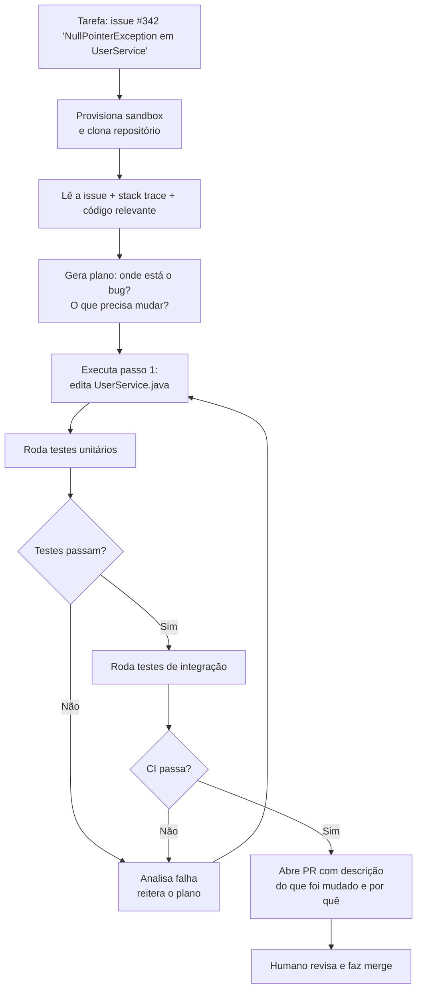

# Devin e agentes autônomos cloud

> [!abstract] TL;DR
> Agentes autônomos cloud (Devin, Copilot Agents, Factory.ai) recebem uma tarefa, criam um ambiente isolado, e entregam código sem interação humana durante a execução. A diferença fundamental para ferramentas interativas (Cursor, Claude Code) é a autonomia: você delega e volta. Em 2026, funcionam bem para tarefas bem-definidas com critério de sucesso verificável (bugs com stack trace, migrações de API, atualizações de dependência), mas ainda frágeis para trabalho criativo e arquitetural. A taxa de resolução autônoma em SWE-bench gira em torno de 40-55% para os melhores sistemas — estagiário diligente, não engenheiro sênior. O segredo de uso eficaz é a especificidade do prompt: hipótese clara, critério verificável de conclusão, contexto suficiente. PRs de agentes exigem revisão rigorosa — o agente pode resolver o sintoma visível e introduzir debt técnico não óbvio.

## O problema que os agentes autônomos resolvem

Imagine que você tem 200 issues abertas no backlog. Algumas são simples — stack traces claras, bugs de validação, dependências desatualizadas. Mas você tem tempo para resolver talvez 5 issues por dia, e elas consomem contexto cognitivo que poderia ir para trabalho de design e arquitetura. A pergunta é: existe alguma dessas 200 issues que um agente poderia resolver de forma autônoma, sem você precisar conduzir o processo passo a passo?

Essa é a proposta dos agentes autônomos cloud: delegação assíncrona. Você aponta o agente para uma tarefa bem-definida, vai fazer outra coisa, e o agente entrega um PR. Não é pair programming — é mais parecido com contratar um estagiário e dar a ele uma tarefa com contexto suficiente para executar de forma independente.

O trade-off é fundamental: mais autonomia = menos controle e visibilidade durante a execução. Ferramentas interativas como Claude Code ou Cursor te mantêm no loop a cada passo. Agentes autônomos trabalham em silos e só te chamam quando precisam de input humano (ou quando falham). Isso é uma funcionalidade para certas tarefas — e uma limitação para outras.

A analogia mais precisa é a diferença entre um contratado assíncrono e um pair programmer. O contratado assíncrono é mais escalável — você pode ter 10 trabalhando em paralelo enquanto você faz outra coisa — mas requer briefing mais cuidadoso e supervisão do entregável. O pair programmer itera com você em tempo real, capta nuances não-verbalizadas, e pode desviar do caminho errado antes de terminar a tarefa inteira. Para cada projeto e tipo de tarefa, um é mais adequado que o outro.

> [!question] Por que não usar Claude Code para tudo se ele pode fazer o mesmo?
> Claude Code e agentes autônomos cloud diferem em duas dimensões: ambiente e supervisão. Claude Code roda no seu ambiente local, com acesso direto ao seu terminal, editor e context. Agentes cloud rodam em sandboxes isolados (container ou VM) com acesso controlado ao repositório. A vantagem do cloud é escala: você pode rodar 10 instâncias em paralelo enquanto trabalha. A desvantagem é a distância: o agente não tem contexto implícito do seu ambiente, das suas preferências, nem das decisões arquiteturais não documentadas.

## Histórico: de Devin ao ecossistema atual

**Março 2024 — o momento Devin:** A Cognition Labs apresentou o Devin com um vídeo demonstrando o agente completando tarefas complexas de engenharia de ponta a ponta. O hype foi imenso — manchetes sobre "o fim do emprego de programador". Na sequência, pesquisadores independentes apontaram que o vídeo editava falhas e que a taxa de sucesso real era muito menor que a demonstrada. Mas o conceito estava lançado.

**Mid-2024 — benchmark honesto:** O SWE-bench (Jimenez et al., 2024) se estabeleceu como o benchmark de referência — dado um issue real do GitHub, o sistema consegue resolver e criar um PR que passa nos testes? Devin e seus contemporâneos marcavam 13-20% no SWE-bench verified. Modestamente útil, não transformador. Mais revelador ainda foi o teste independente da equipe answer.ai — um mês de uso real com 20 tasks variadas, de projetos novos a modificações em código existente. Taxa de sucesso: 15%. A diferença entre os demos polidos e a realidade de produção foi o primeiro sinal claro de que o campo precisava de mais honestidade nas métricas.

No mesmo período, pesquisadores independentes começaram a desmistificar o vídeo original do Devin — mostrando que a demonstração "ao vivo" usava edições estratégicas que ocultavam falhas e retentativas. Não foi um escândalo, mas uma lição sobre como avaliar demos de agentes: sempre exija testes em tarefas suas, no seu repositório, sem seleção prévia.

**Late-2024 — GitHub Copilot Agents:** A Microsoft integrou agentes autônomos diretamente no GitHub — issue → agente → PR, sem sair do ambiente GitHub. Distribuição massiva instantânea. Factory.ai, SWE-agent (Princeton), e Codex (OpenAI) entraram no espaço.

**2025 — consolidação e especialização:** O mercado se dividiu entre generalistas (Devin) e especialistas (Factory para workflows de CI/CD, Copilot Agents para o ecossistema GitHub, Amazon Q Developer para AWS). As taxas de SWE-bench subiram para 30-50% nos melhores sistemas, mas com ressalvas sobre as tarefas selecionadas.

**2026 — mainstream cauteloso:** A narrativa de "substituição" cedeu à de "aceleração". Times usam agentes autônomos para o "trabalho mecânico" (bugs óbvios, migrações, boilerplate), liberando engenheiros para o trabalho de design e integração. O ROI é real, mas estreito.

> [!question] Por que a taxa de sucesso caiu tanto entre os demos e os testes reais?
> Os demos iniciais do Devin foram cuidadosamente selecionados — tarefas em que o agente tinha boa performance, sem os casos que travavam. Os testes independentes (como o da equipe answer.ai) usaram tarefas reais do backlog de um projeto existente, incluindo código legado, convenções implícitas e bugs que dependiam de contexto não documentado. A diferença de 85pp (demo vs produção) é principalmente explicada pelo *selection bias* dos demos — não por desonestidade, mas por um viés natural de mostrar o que funciona melhor. A lição: sempre teste qualquer agente no *seu* backlog real antes de comprometer time com a ferramenta.

## Como funciona internamente

O coração de um agente autônomo cloud é uma implementação do loop plan-act-observe dentro de um ambiente sandboxed. O agente não tem acesso irrestrito ao seu sistema — ele trabalha em uma cópia isolada do repositório, com ferramentas específicas.



**O conjunto de ferramentas típico de um agente cloud:**
- Leitura e escrita de arquivos no repositório
- Execução de shell (testes, build, lint)
- Busca semântica na codebase
- Navegação na web (para ler documentação)
- Acesso à issue tracker (GitHub Issues, Jira)

**Por que o sandbox isolado importa:** o agente não tem acesso ao seu banco de dados de produção, às suas secrets, nem ao seu ambiente local. Isso é uma restrição de segurança, mas também uma limitação de contexto — o agente não sabe coisas que "todo mundo no time sabe mas ninguém documentou".

**O orçamento de tentativas:** agentes autônomos modernos têm um limite de iterações para evitar loops infinitos. Se depois de N tentativas o CI ainda não passa, o agente para e reporta o estado atual, deixando para o humano decidir o próximo passo.

**O passo de planejamento: o mais importante e o mais frágil.** Antes de escrever qualquer linha de código, agentes autônomos modernos geram um plano explícito — uma sequência de passos que o agente vai seguir. Esse plano é, na prática, uma hipótese sobre onde está o problema e como resolvê-lo. Se a hipótese estiver errada (bug em lugar diferente do stack trace, causa raiz em outro módulo), o agente pode executar o plano perfeitamente e ainda assim entregar uma solução errada. A qualidade do plano é o gargalo — e o passo de planejamento melhora dramaticamente com contexto rico (stack trace completa, código relevante pre-filtrado, descrição do comportamento esperado vs observado).

**Contexto de projeto: o maior diferencial de qualidade.** Agentes com acesso a um `README` detalhado, `ADRs` e comentários explicativos no código produzem PRs notavelmente melhores do que em projetos com código silencioso. Não é coincidência — o agente usa exatamente o mesmo contexto que um novo contratado usaria no primeiro dia. Projetos com boa documentação interna têm taxas de sucesso 20-30pp maiores em benchmarks reais.

### A anatomia de um prompt eficaz para agentes cloud

A diferença entre uma task bem-sucedida e uma que falha está quase sempre na especificidade do prompt. Agentes autônomos interpretam instruções literalmente — não inferem intenção.

**Prompt fraco:**
```
Fix the login bug
```

**Prompt eficaz:**
```
Bug report: users with email addresses containing '+' (e.g., user+tag@example.com)
cannot log in. The error is "Invalid email format" thrown in UserValidator.java:47.

Steps to reproduce:
1. Try logging in with email "test+alias@example.com"
2. Observe the 400 response from POST /api/auth/login

Expected: login succeeds ('+' is valid per RFC 5321)
Actual: 400 "Invalid email format"

Files likely involved: UserValidator.java, AuthController.java
Success criterion: the existing test suite passes + new test covering '+' in email passes.
```

A diferença não é só verbosidade — é dar ao agente os três elementos que ele precisa: (1) hipótese sobre onde está o problema, (2) como reproduzir, (3) critério claro de completude. Com esses três elementos, a taxa de resolução autônoma mais que dobra.

## O ecossistema em 2026

> [!info] Data de validade
> As taxas de SWE-bench e o posicionamento de cada player abaixo mudam mensalmente — novos releases e re-treinamentos deslocam os números com frequência. Trate os valores como uma fotografia de 2026, não como referência estável; confira a fonte original antes de citar em contexto que exija precisão atual.

| Ferramenta | Empresa | Diferencial | SWE-bench |
| ---------- | ------- | ----------- | --------- |
| Devin | Cognition Labs | Generalista, primeiro do mercado | ~40-50% |
| Copilot Agents | Microsoft/GitHub | Integrado ao GitHub, zero-setup | ~35-45% |
| Factory.ai | Factory | Foco em workflows de CI/CD e automação | ~30-40% |
| Amazon Q Developer | Amazon | Especializado em AWS e Java | ~30-40% |
| SWE-agent | Princeton (open source) | Referência acadêmica e para pesquisa | ~25-35% |
| Codex | OpenAI | Integrado à OpenAI Platform | ~40-50% |

**Devin (Cognition Labs)** foi o primeiro a criar expectativas de mercado sobre o que um agente autônomo poderia fazer. O produto real é mais modesto — mas útil. Funciona melhor em projetos com boas práticas de engenharia: testes automatizados, documentação clara, CI/CD configurado. Projetos legados sem testes são um pesadelo para qualquer agente.

**Copilot Agents (GitHub/Microsoft)** tem a vantagem da distribuição: qualquer usuário do GitHub pode ativar com zero setup. A integração nativa com Issues, PRs e Actions cria um loop natural. A desvantagem é que roda em infraestrutura compartilhada — sem customização do ambiente de execução.

**Factory.ai** se diferencia ao focar em *fluxos de engenharia*, não só issues individuais: pode coordenar múltiplos agentes em pipeline (um abre o PR, outro faz review, outro valida cobertura de testes). Mais poder, mais complexidade de configuração.

**SWE-agent (Princeton)** é open source e academicamente importante: permite reproduzir benchmarks e estudar o comportamento dos agentes. Na prática, é mais ferramenta de pesquisa do que produto de produção.

> [!warning] SWE-bench não conta a história completa
> As taxas de SWE-bench são medidas em problemas selecionados do GitHub. No mundo real, o agente frequentemente encontra: contexto de negócio não documentado, testes insuficientes, e code smell que dificulta o raciocínio automatizado. A taxa de sucesso em produção costuma ser 15-20pp abaixo do SWE-bench reported.

## Onde funciona bem e onde não funciona

| Tarefa | Resultado típico | Por quê |
| ------ | ---------------- | ------- |
| Bug com stack trace clara | ✅ 60-70% de resolução autônoma | Hipótese clara, critério verificável (testes passam) |
| Atualização de dependência com changelog | ✅ Mecânica e verificável | Pattern matching + fix de breaking changes |
| Migração de API (v1 → v2) com docs | ⚠️ 50-60% com docs boas | Sucesso proporcional à qualidade da documentação |
| Bug de lógica de negócio complexa | ⚠️ 30-40% | Requer entendimento de contexto de domínio |
| Feature do zero sem spec detalhada | ❌ Qualidade insuficiente | Sem critério claro de "bom", gera soluções literais |
| Refactoring arquitetural | ❌ Não recomendado | Decisões de design exigem julgamento humano |
| Segurança crítica | ❌ Não delegar sem revisão dupla | Erros têm consequências graves e difíceis de detectar |

**A regra prática do critério verificável:** se você consegue escrever uma frase que descreva "a tarefa está completa quando...", o agente tem uma chance real. Se você não consegue — se o critério de completude é subjetivo ou contexto-dependente — o agente vai entregar algo que *parece* completo mas não é.

> [!tip] Assista: Devin AI — Is the First AI Software Engineer Ready? Real World Testing Results
> **Canal:** AI com Foco | **Duração:** ~10min | **Idioma:** EN
>
> Análise independente dos primeiros testes reais do Devin em produção — um mês de uso com 20 tarefas reais categorizadas (novos projetos, pesquisa, modificação de código existente). O resultado é honesto sobre as limitações: taxa de sucesso de apenas 15% nas 20 tarefas testadas. O trecho mais revelador é a comparação com ferramentas interativas como Cursor: "I personally like Cursor because there's this human-in-the-loop component — if something goes wrong I can help it fix it." Um contraponto importante ao hype inicial de 2024. Trecho de destaque [4:08]: *"out of the 20 tasks that were assigned, it failed on 14, it succeeded on three, and the rest were inconclusive — so the success rate is only about 15%."*
>
> 🎬 https://www.youtube.com/watch?v=-6e7897zLQM

## Casos práticos

### Caso 1 — Triage de bugs em lote

**Cenário:** 40 bugs abertos no backlog, todos com stack traces. Sprint planning na segunda-feira.

**Setup:**
1. Filtrar issues com stack trace e prioridade "low/medium"
2. Enviar para Devin ou Copilot Agents em paralelo (máximo 5-8 simultâneos para controle)
3. Revisar os PRs abertos antes da sprint planning

**Resultado típico:** 20-25 das 40 issues resolvidas autonomamente. As 15-20 restantes precisam de input humano ou são complexas demais para delegação. Isso libera ~2 dias de trabalho de engenharia.

**O que revisar nos PRs:** lógica do fix (está correto?), escopo (mudou mais do que o necessário?), testes adicionados (cobrem o caso de regressão?).

### Caso 2 — Migração de dependência com breaking changes

**Cenário:** atualizar Spring Boot 3.3 → 3.5 em um monolito com 150 endpoints. O migration guide documenta as breaking changes.

**Setup:**
```bash
# Via Copilot Agents ou equivalente
# Issue template que o agente vai receber:
"""
Migrate this project from Spring Boot 3.3 to 3.5.
Follow the migration guide at: [URL]
Known breaking changes:
1. @Transactional on test methods now requires explicit rollback config
2. WebFlux error handling changed to use ProblemDetail
3. Several @ConditionalOnMissingBean behaviors changed

Success criteria: all existing tests pass, no deprecated API warnings.
"""
```

**Resultado:** em projetos bem testados, o agente resolve 70-80% das mudanças mecanicamente. O restante (edge cases não cobertos por testes, configurações implícitas) requer intervenção humana.

**Lição aprendida:** quanto melhor a cobertura de testes, maior a taxa de sucesso do agente — o agente usa os testes como feedback loop para saber se está progredindo.

### Caso 3 — Geração de documentação de API

**Cenário:** 200 endpoints sem documentação. Time novo no projeto precisa de uma visão geral.

**Setup:**
1. Dividir endpoints em grupos por domínio funcional
2. Agente lê o código e gera Swagger/OpenAPI annotations e descrições

**Resultado:** economiza 2-3 dias de trabalho de documentação, mas o output precisa de revisão para garantir que as descrições reflitam a intenção de negócio (não apenas o que o código faz mecanicamente).

**Anti-padrão:** usar o agente para documentar código com lógica de negócio implícita. O agente descreve *o que o código faz*, não *por que faz assim*.

### Caso 4 — Criação de testes de regressão para bug fixado

**Cenário:** o time descobriu e fixou manualmente um bug crítico de segurança (injeção de parâmetros). O fix está correto, mas não há testes de regressão. Se o bug voltar, ninguém vai notar até impactar usuários.

**Setup:**
```
Context: we fixed a parameter injection bug in OrderService.java (commit abc123).
The fix is in the `processOrder` method — we added input validation before
calling the SQL layer.

Task: Create regression tests for this fix. Look at the commit diff to understand
what was changed, then write tests that would fail without the fix and pass with it.
Cover: (1) the exact input that triggered the bug, (2) boundary conditions,
(3) similar inputs that should NOT trigger the vulnerability.

Success: tests are in the correct test class, follow existing test conventions,
and all pass with the current code.
```

**Resultado:** o agente lê o diff, entende o pattern de injeção, e escreve testes de regressão que cobrem o vetor de ataque. Isso é especialmente eficaz porque os testes são derivados diretamente do comportamento — o agente tem evidência concreta do bug para basear os testes.

### Caso 5 — Fix de vulnerabilidade em dependência

**Cenário:** Dependabot abre 30 PRs de segurança, todas com CVE classificado como "high" ou "critical". Nenhum PR do Dependabot passa nos testes automaticamente por causa de breaking changes.

**Setup:**
```
Para cada PR do Dependabot que falhou:
- Ler o CVE e o changelog da dependência
- Identificar as breaking changes que quebraram os testes
- Fixar o código para usar a nova API
- Garantir que os testes passam
```

**Resultado:** 20-25 dos 30 PRs resolvidos sem intervenção humana. O padrão se repete: quanto mais mecânica a mudança (trocar API deprecated por nova equivalente), maior o sucesso.

### Caso 6 — Geração de dados de seed para ambientes de desenvolvimento

**Cenário:** o time acabou de criar um novo módulo de e-commerce com 12 entidades relacionadas. Cada desenvolvedor que configura o ambiente local precisa de dados de teste realistas — mas gerar isso manualmente leva 2-3h por pessoa.

**Setup:**
```
Look at the entity models in /src/models/ and create database seed scripts that:
1. Generate 50 realistic users with varied data (not just "User1", "User2")
2. Generate 200 products across 5 categories with realistic names, prices, descriptions
3. Generate 500 orders with varied statuses and realistic history
4. Ensure referential integrity — every FK points to an existing record
5. Output: a single seed.sql file that runs on a clean database

Use the existing seed pattern in /src/seeds/auth_seed.sql as style reference.
Do NOT use production data — generate synthetic data only.
```

**Resultado:** o agente examina os schemas, gera dados coerentes (preços em range realista, datas em ordem cronológica, FKs válidos). Task ideal para autonomia: critério claro (script executa sem erros), baixo risco, sem contexto de negócio implícito.

## Agentes autônomos vs interativos: quando escolher cada um

A escolha entre delegar de forma autônoma (Devin, Copilot Agents) e trabalhar interativamente (Claude Code, Cursor) não é uma questão de qual ferramenta é melhor — é uma questão de qual modo de trabalho serve à tarefa.

| Dimensão | Agente autônomo cloud | Agente interativo (Claude Code) |
| -------- | --------------------- | ------------------------------- |
| **Supervisão** | Assíncrona — você revisa o PR depois | Síncrona — você acompanha a cada passo |
| **Contexto** | Repositório + issue + docs públicas | Seu ambiente completo + contexto implícito |
| **Adequado para** | Tarefas bem-definidas com critério verificável | Tarefas exploratórias, criativas, arquiteturais |
| **Custo de erro** | Descoberto no PR review | Descoberto em tempo real |
| **Custo computacional** | Compute cloud + tokens | Tokens no seu terminal |
| **Velocidade de feedback** | 15-60 minutos | Segundos a minutos |
| **Paralelização** | Sim — múltiplas tasks em paralelo | Não — foco em uma task por vez |
| **Contexto de negócio** | Limitado ao que está documentado | Rico — você explica em tempo real |

**Heurística prática:** se você consegue escrever a tarefa em um ticket Jira bem estruturado e um novo contratado poderia executar no primeiro dia com acesso ao repositório e à documentação — use agente autônomo. Se a tarefa requer decisões que dependem de contexto que só você tem na cabeça — use agente interativo.

O modelo que emerge em times mais maduros em 2026: agentes autônomos para o "trabalho mecânico" (triage, migrações, boilerplate), agentes interativos para o "trabalho criativo" (design, debugging complexo, refactoring com julgamento). Não é um ou outro — são camadas complementares.

**Custo-benefício realista para um time de 5 engenheiros:** se cada engenheiro delega 3 tasks simples por semana para agentes autônomos (bugs de 30min que o agente resolve em 45min de clock time), com 40-50% de taxa de aceitação sem revisão pesada, o time recupera o equivalente a ~1 engenheiro dedicado meio período ao backlog mecânico. Para times maiores, a matemática favorece ainda mais, especialmente para migrações e boilerplate em escala.

## Armadilhas comuns

> [!warning] Revisar como se fosse código de alguém que você não conhece
> PRs de agentes autônomos precisam de revisão com MAIS rigor, não menos. O agente resolve o sintoma visível (testes passam), mas pode introduzir debt técnico, abordagens não idiomáticas, ou ignorar convenções não documentadas do projeto. Use o mesmo checklist que você usaria para um PR de um contratado externo.

> [!warning] Tarefa vaga = resultado literal
> "Melhore a performance do endpoint /users" vai gerar algo que *parece* mais rápido mas pode incluir cache sem invalidação, índices desnecessários, ou otimizações que só funcionam em dados de teste. Especificidade é o insumo do agente: "Adicione um índice composto em (user_id, created_at) na tabela orders e meça o impacto no endpoint GET /users/:id/orders com query EXPLAIN ANALYZE" é o tipo de task que o agente consegue executar bem.

> [!warning] Custo de sandbox pode surpreender
> Cada execução provisiona e mantém um ambiente cloud durante toda a execução — que pode durar 15-60 minutos. Em escala (50 tarefas em paralelo, com retentativas), o custo de compute é significativo. Calcule antes de automatizar em lote.

> [!warning] "O agente entende o contexto do projeto"
> O agente entende o que está no repositório. Não entende: decisões arquiteturais tomadas em reunião, convenções que "todo mundo sabe", o motivo por trás de soluções não-óbvias, nem o contexto de negócio não documentado. Projetos com boa documentação (ADRs, comentários explicativos, CLAUDE.md) têm taxas de sucesso significativamente maiores com agentes autônomos.

> [!warning] Feedback loop lento para tarefas erradas
> Para tarefas que um desenvolvedor resolveria em 20 minutos, um agente autônomo pode levar 45 minutos (provisionamento, múltiplas tentativas, raciocínio subótimo). O ciclo de "esperar, revisar, pedir correção" é mais lento do que resolver interativamente. Use agentes autônomos para tarefas que você *não quer interromper seu trabalho para fazer* — não para as que você quer ver acontecer em tempo real.

> [!warning] Não confundir "os testes passam" com "o bug foi resolvido"
> O critério de sucesso dos agentes autônomos é o CI passar. Mas CI passa não implica que o bug foi corretamente diagnosticado e resolvido — pode implicar que o agente adicionou um `try/catch` que engole o erro silenciosamente, ou que ajustou um teste para que ele passe com o comportamento bugado, ou que resolveu um sintoma diferente do que causou o bug. Revise o diff prestando atenção especial a: mudanças em testes, adição de tratamento de exceção, e verificações se a lógica de negócio está correta (não apenas se o erro desapareceu).

## Como explicar em inglês

| Português | Inglês técnico | Contexto de uso |
| --------- | -------------- | --------------- |
| Agente autônomo cloud | Autonomous cloud agent | "We're evaluating autonomous cloud agents for bug triage" |
| Ambiente isolado / sandbox | Sandboxed environment | "Each task runs in an isolated sandboxed environment" |
| Delegação assíncrona | Async delegation | "Autonomous agents enable async delegation of mechanical tasks" |
| Critério verificável | Verifiable success criterion | "Task success requires a verifiable criterion — e.g., tests pass" |
| Taxa de resolução | Resolution rate | "Devin's resolution rate on SWE-bench is around 40-50%" |
| Triage de bugs | Bug triage | "We use agents for bug triage on low-priority issues" |
| Provisionar sandbox | Provision sandbox | "The agent provisions a fresh sandbox per task" |
| Orçamento de tentativas | Retry budget | "We cap the agent at 5 retry attempts before escalating" |
| Feedback loop | Feedback loop | "Tests provide the feedback loop for the agent to self-correct" |
| Revisão de PR | PR review | "Agent-generated PRs require stricter PR review" |
| Contexto não documentado | Undocumented context | "Agents fail when they lack undocumented context" |
| Migração de dependência | Dependency migration | "Autonomous agents handle dependency migrations well" |
| Revisão de PR de agente | Agent-generated PR review | "Agent PRs require stricter review than human PRs" |
| Hype vs realidade | Hype vs reality | "The 15% success rate shows the gap between hype and reality" |
| Contexto de negócio | Business context | "Agents lack business context not documented in the repo" |
| Responsabilidade | Accountability | "Who is accountable for bugs introduced by autonomous agents?" |
| Memória persistente | Persistent memory | "Persistent memory across tasks is the next frontier" |
| Taxa de aceitação de PR | PR acceptance rate | "We track the PR acceptance rate for agent-generated PRs" |
| Agente generalista | Generalist agent | "Generalist agents underperform specialized agents on domain tasks" |

> [!question] Como medir o ROI de agentes autônomos no seu time?
> A métrica mais honesta não é "quantas issues o agente tentou" — é "quantos PRs do agente foram aceitos sem modificação significativa pelo revisor humano". Um PR aceito significa que o agente resolveu o problema corretamente, no estilo do projeto, sem introduzir debt. Um PR que precisa de reescrita parcial pode ter custado mais tempo do que teria levado para um humano resolver diretamente.

> [!tip] Frase de impacto para entrevistas
> *"We use autonomous cloud agents for the mechanical layer — dependency updates, bug triage from stack traces, migration scripts. The rule is simple: if you can write a done criterion in one sentence and tests validate it, the agent can probably handle it. If the success criterion is subjective or requires undocumented context, we keep it in the interactive loop with Claude Code instead."*

## O que vem a seguir

Em 2026, agentes autônomos cloud são ferramentas de produtividade complementares, não substitutas. Os próximos desenvolvimentos a observar:

**Contexto persistente entre execuções** — hoje, cada tarefa começa do zero. O próximo passo é agentes que acumulam conhecimento sobre o projeto ao longo do tempo: convenções, padrões frequentes, histórico de decisões. Isso eleva a taxa de sucesso em projetos com code quality alta.

**Integração com issue trackers e planejamento** — em vez de você selecionar as issues para delegar, o próprio agente vai sugerir "essas 15 issues são delegáveis com alta probabilidade de sucesso". O humano aprova o lote, o agente executa.

**Agentes especializados por domínio** — um agente de segurança que conhece OWASP e CVEs em profundidade vai superar um agente generalista em tarefas de security patching. Especialização vai ser a próxima diferenciação de mercado.

**Multi-agent dentro dos agentes cloud** — Devin e Copilot Agents já fazem isso internamente: um sub-agente planeja, outro implementa, outro valida. A maturação desse padrão interno vai elevar a taxa de SWE-bench para 60-70%+ nos melhores sistemas em 2027-2028.

**O benchmark que importa mais que o SWE-bench:** taxa de aceitação de PRs em produção real, sem seleção de tarefas. Quando esse número chegar a 50%+ em uma amostra representativa de issues, a categoria vai ter provado seu valor além do hype.

**Regra dos três parâmetros para prompts bem-sucedidos:** nas tasks que mais frequentemente resultam em PRs aceitos de agentes autônomos, há consistentemente três elementos presentes: (1) hipótese explícita sobre a causa raiz ("o bug está provavelmente em X porque Y"), (2) critério de sucesso verificável por CI ("todos os testes passam, sem warnings de lint"), e (3) escopo delimitado ("apenas modifique arquivos em /src/auth/"). Faltando qualquer um dos três, a taxa de sucesso cai dramaticamente.

A noção de que agentes autônomos vão "substituir programadores" não envelheceu bem — mas a de que vão "substituir parte das tasks repetitivas" está envelhecendo bem. O desenvolvedor de 2027 provavelmente revisa PRs de agentes tanto quanto escreve código novo.

**Como avaliar um agente antes de adotar:** antes de comprometer o time com um agente autônomo, crie um "pilot bench".

Pegue 20-30 issues fechadas do seu backlog e deixe o agente tentar resolver em modo isolado. Métricas para acompanhar:

- **Taxa de sucesso limpo:** PR aceito sem modificação significativa
- **Taxa de falso positivo:** PR que parecia correto mas introduziu debt ou comportamento errado
- **Taxa de falha óbvia:** PR claramente errado, fácil de detectar na revisão

Essa última métrica — falsos positivos — é a mais perigosa. Uma ferramenta com 40% de taxa de sucesso mas 20% de falsos positivos convincentes é mais arriscada do que uma com 20% de taxa de sucesso e falhas óbvias.

**O risco estrutural que merece atenção:** à medida que mais código é escrito por agentes, a codebase acumula padrões que "funcionam" mas que nenhum humano revisou com profundidade. Se a revisão de PRs de agentes for superficial ("os testes passam, aprova"), o débito técnico pode crescer de formas não óbvias — código correto mas não idiomático, soluções que não escalam, ausência de tratamento de edge cases que o agente não considerou. A disciplina de revisão de PRs de agentes vai se tornar uma competência de engenharia em si.

**O que monitorar nos próximos 12-18 meses:**
- Taxa de aceitação de PRs de agentes em produção real (não SWE-bench selecionado) chegando a 50%+ como sinal de maturidade
- Agentes com memória persistente do projeto — eliminando o cold-start de contexto
- Modelos especializados em código (treinados em commits + code review + issues) superando os generalistas em tarefas de engenharia
- Regulação de rastreabilidade: quem é responsável por um bug introduzido por um agente autônomo? (questão jurídica ainda sem resposta em 2026)

****A questão de responsabilidade que ninguém responde ainda:** quando um agente autônomo introduz uma vulnerabilidade de segurança em produção — quem é responsável? O desenvolvedor que aprovou o PR? A empresa que fez o produto? Essa pergunta não tem resposta legal estabelecida em 2026, mas vai moldar como times de risco e compliance permitem (ou bloqueiam) o uso de agentes autônomos em contextos críticos.

Tudo isso pressupõe que você já decidiu *o quê* delegar ao agente cloud. Mas há uma camada anterior, igualmente decisiva: *como* o ambiente em que ele opera está configurado. Um agente autônomo com acesso a um repositório sem `AGENTS.md`, sem convenções documentadas e sem exemplos de padrões aceitáveis enfrenta exatamente o mesmo problema de contexto ausente descrito ao longo desta nota — só que amplificado, porque não há humano por perto pra preencher a lacuna em tempo real. A nota seguinte, [[14 - agents.md e configuração de projeto]], trata exatamente dessa configuração: como comunicar ao agente — autônomo ou interativo — as convenções, restrições e contexto de projeto que normalmente vivem só na cabeça do time.

## Veja também

A nota [[18 - Benchmarks e avaliação — SWE-bench e além]] aprofunda o SWE-bench e suas limitações como proxy de performance real — contexto fundamental para interpretar os números desta nota com ceticismo saudável. A nota [[17 - Human-in-the-loop — quando (não) confiar]] aborda o ponto de inserção de supervisão humana, que é exatamente o dilema central dos agentes autônomos: onde você coloca os checkpoints sem eliminar o benefício da autonomia?

- [[05 - Claude Code — terminal-first agent]] — alternativa interativa: você conduz, o agente executa
- [[06 - GitHub Copilot e Copilot Agents]] — Copilot Agents: agente autônomo nativo no GitHub
- [[12 - Multi-agent — workflows com múltiplos agentes]] — padrões de orquestração que agentes cloud implementam internamente (pipeline, paralelo, hierárquico)
- [[16 - O loop agentic — plan, act, observe]] — o ciclo interno de qualquer agente autônomo, incluindo os cloud
- [[17 - Human-in-the-loop — quando (não) confiar]] — onde colocar checkpoints humanos sem matar a autonomia
- [[18 - Benchmarks e avaliação — SWE-bench e além]] — SWE-bench, suas limitações, e métricas mais honestas para agentes autônomos
- [[11 - Comparativo — qual ferramenta para qual tarefa]] — tabela comparativa de todas as ferramentas incluindo agentes autônomos cloud, com foco em custo e perfil de desenvolvedor

> [!question] Vale a pena montar um processo de "auditoria de agentes" no time?
> Sim — e o processo é simples. A cada trimestre, pegue 20-30 tasks que os agentes resolveram (aceitas e rejeitadas) e analise os padrões: que tipos de tasks têm taxa de aceitação alta? Onde o agente consistentemente falha? Com o tempo, você constrói um "perfil de delegabilidade" específico do seu projeto. Isso é mais valioso do que os benchmarks genéricos — o seu repositório, o seu historial de bugs, as suas convenções.

## Referências

- **Cognition Labs** — *Devin: The First AI Software Engineer* (2024). Apresentação original do Devin e seu conjunto de capacidades. https://www.cognition.ai/blog/introducing-devin
- **Jimenez et al.** — *SWE-bench: Can Language Models Resolve Real-World GitHub Issues?* (2024). O benchmark de referência para agentes de código autônomos. https://arxiv.org/abs/2310.06770
- **GitHub Blog** — *GitHub Copilot coding agent: how it works* (2025). Arquitetura do Copilot Agents — issue tracker, sandbox, e ciclo de PR. https://github.blog/engineering/copilot-coding-agent
- **Factory.ai** — *Factory Documentation: Droids for software engineering teams* (2026). Overview do modelo de agentes especializados em CI/CD. https://docs.factory.ai
- **Wang et al.** — *OpenHands: An Open Platform for AI Software Developers as Generalist Agents* (2024). Framework open source para agentes de software e análise de capacidades. https://arxiv.org/abs/2407.16741
- **Anthropic** — *Building effective agents* (2024). Guia de boas práticas para agentes autônomos, incluindo quando usar agentes vs workflows. https://www.anthropic.com/engineering/building-effective-agents
- **SWE-agent Team (Princeton)** — *SWE-agent: Agent-Computer Interfaces Enable Automated Software Engineering* (2024). Paper do SWE-agent open source e análise de interfaces para agentes de código. https://arxiv.org/abs/2405.15793
- **answer.ai team** — *Thoughts on a month with Devin* (2024). Teste independente de 20 tarefas reais com Devin — 15% de taxa de sucesso, análise de falhas por categoria. Um dos primeiros relatos honestos de uso em produção. https://www.answer.ai/posts/2024-04-03-devin
- **Microsoft Research** — *GitHub Copilot Workspace: Technical Preview* (2025). Arquitetura do Copilot Workspace como agente autônomo integrado ao ciclo GitHub — issue → plano → código → PR. https://githubnext.com/projects/copilot-workspace
- **Xu et al.** — *Theagentcompany: Benchmarking LLM Agents on Consequential Real World Tasks* (2024). Benchmark de agentes em tarefas de trabalho real (não só código), incluindo navegação web, busca de informação e interação com sistemas. https://arxiv.org/abs/2412.14161
- **Chen et al.** — *Evaluating Large Language Models Trained on Code* (2021). Paper do Codex/HumanEval — base histórica para entender como modelos de código são avaliados, precursor dos benchmarks modernos como SWE-bench. https://arxiv.org/abs/2107.03374
- **Peng et al.** — *The Impact of AI on Developer Productivity: Evidence from GitHub Copilot* (2023). Estudo empírico de 70+ desenvolvedores; 55% de aumento na velocidade de conclusão de tasks — linha de base para comparar benefícios de ferramentas de IA. https://arxiv.org/abs/2302.06590
