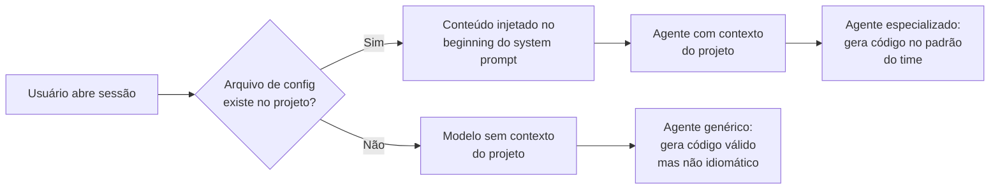
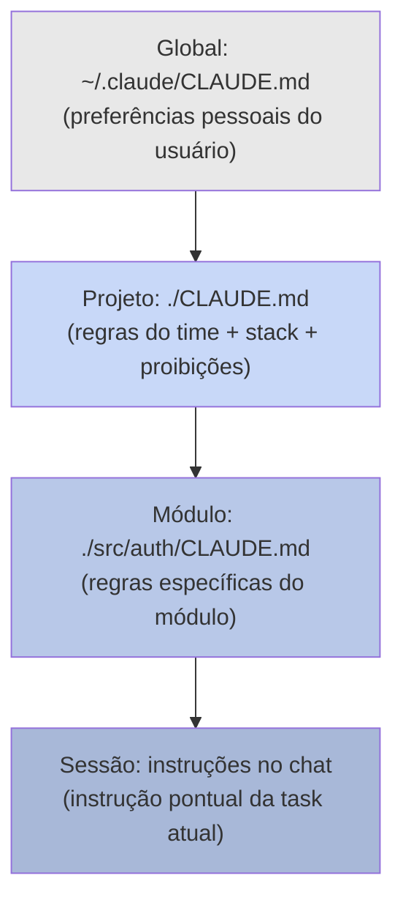

# agents.md e configuração de projeto

> [!abstract] TL;DR
> Arquivos de configuração de agentes (CLAUDE.md, .cursorrules, copilot-instructions.md, GEMINI.md, AGENTS.md) são **[[Dicionário de IA#system prompt|system prompts]] persistentes** que residem no repositório e são carregados automaticamente a cada sessão. Eles transformam um modelo genérico em um especialista do seu codebase — definindo padrões de código, proibições, arquitetura e contexto do projeto. Sem eles, o agente gera código que funciona mas não pertence ao projeto. Com eles, o agente produz código que parece ter sido escrito pelo time. São a alavanca de produtividade mais subestimada em projetos que usam IA intensamente.

## O problema que a configuração resolve

Você abriu uma sessão do Claude Code em um projeto novo. Você pede "adicione validação no endpoint de criação de usuário". O agente escreve uma validação funcional — mas usa `console.error` em vez do seu logger customizado, não aplica o pattern `Result<T, E>` que o time adota para error handling, e importa `zod` direto quando vocês têm um wrapper interno. O código funciona, mas é alien — você vai ter que corrigir três coisas antes de poder fazer o commit.

Agora imagine a mesma sessão com um `CLAUDE.md` bem escrito no projeto. O agente lê o arquivo na inicialização, sabe que o projeto usa `Result<T, E>`, que o logger customizado está em `@/lib/logger`, que Zod é sempre importado via o wrapper interno em `@/lib/validate`. Ele gera o código correto na primeira tentativa.

Arquivos de configuração de agentes são a diferença entre um assistente que você precisa supervisionar constantemente e um que opera dentro dos seus padrões por default. Não é magia — é o mesmo mecanismo de um system prompt de API, só que persistido no repositório e automaticamente injetado.

> [!question] Por que isso é subestimado se parece simples?
> Porque os efeitos são invisíveis quando funcionam. Quando o agente gera código correto sem correções, ninguém nota que o `CLAUDE.md` estava fazendo o trabalho. Quando o agente gera código errado, a causa mais comum — e menos investigada — é a ausência ou desatualização do arquivo de configuração. O ROI só fica evidente quando você compara sessões com e sem configuração lado a lado.

## Como funciona

### O mecanismo de carregamento

Cada ferramenta tem um mecanismo diferente, mas o princípio é o mesmo: o arquivo é lido na inicialização e injetado como parte do system prompt antes de qualquer mensagem do usuário.



Arquivos de configuração por ferramenta:

| Ferramenta | Arquivo | Localização |
| ---------- | ------- | ----------- |
| Claude Code | `CLAUDE.md` | Raiz, ou qualquer diretório (hierarquia) |
| Cursor | `.cursorrules` | Raiz do projeto |
| GitHub Copilot | `.github/copilot-instructions.md` | `.github/` |
| Gemini CLI | `GEMINI.md` | Raiz do projeto |
| Genérico | `AGENTS.md` ou `agents.md` | Raiz do projeto |
| OpenAI Codex | `AGENTS.md` | Raiz do projeto |

### Hierarquia de configuração (Claude Code)

Claude Code tem o sistema de hierarquia mais sofisticado — configs são empilhadas, do mais global ao mais específico:



Configs mais específicas sobrescrevem as mais gerais. Um `CLAUDE.md` em `/src/auth/` pode dizer "aqui usamos sempre bcrypt com 12 rounds" — e essa instrução vai prevalecer sobre qualquer menção mais genérica de criptografia no arquivo raiz.

**A hierarquia pessoal:** o `~/.claude/CLAUDE.md` global permite que cada desenvolvedor do time tenha suas preferências pessoais (tom de resposta, formato de explicações, ferramentas preferidas) sem sobrepor as regras do projeto. É o equivalente ao `.gitconfig` pessoal dentro da estrutura de configuração compartilhada do projeto.

> [!tip] Assista: 900+ hours of Learning Claude Code/Cursor in 10 minutes
> **Canal:** AI Senior Engineer | **Duração:** ~10min | **Idioma:** EN
>
> Um senior software engineer destila um ano de uso intensivo de Claude Code e Cursor em hacks práticos. O ponto central sobre `CLAUDE.md` e cursor rules aparece em [8:07] com uma heurística simples que captura a essência do por que esses arquivos funcionam: *"The way I think about it is like documentation for your app. Stuff that you keep repeating again and again — if you find yourself repeating it, just put it in these files."* A lógica é exatamente a do DRY principle aplicada ao contexto de IA: em vez de explicar os mesmos padrões em cada sessão, você os documenta uma vez e o agente os aplica em todas.
>
> 🎬 https://www.youtube.com/watch?v=iltdFNpl73I

### A anatomia de um arquivo bem escrito

```markdown
# [CLAUDE.md / AGENTS.md / .cursorrules]

## Sobre o projeto
[1-3 frases: o que é, para quem, propósito de negócio]
Stack: [linguagem + versão, framework + versão, banco, auth, infra]

## Arquitetura
[Camadas ou módulos principais com uma linha de propósito cada]
[Referência a ADRs ou documentação se existir]

## Regras de código
- [Regra específica e verificável, não vaga]
- [Regra de testing patterns]
- [Regra de error handling]

## Proibições (NUNCA / NEVER)
- NUNCA [ação perigosa ou anti-padrão crítico]
- NUNCA [ação que o agente tende a fazer errado]

## Comandos úteis
- `make test` — roda todos os testes
- `make lint` — verifica estilo
- `make build` — compila o projeto

## Convenções de nomenclatura
- Arquivos: kebab-case
- Classes/interfaces: PascalCase
- Variáveis: camelCase
```

**O que torna uma regra boa:** regras verificáveis e específicas. "Use TypeScript correto" é vaga — o agente não sabe o que isso significa. "NUNCA use `any` em TypeScript; se precisar de tipo dinâmico, use `unknown` com type guard" é específica e o agente consegue aplicar.

## Exemplo real: projeto TypeScript + Next.js

```markdown
# CLAUDE.md — EstudeMe

## Sobre
EstudeMe é um SaaS de flashcards com spaced repetition para estudantes de concursos.
Stack: Next.js 15 (App Router), TypeScript strict, tRPC v11, Drizzle ORM, PostgreSQL 16, Clerk auth.
Infra: Vercel (deploy), PlanetScale (banco), Resend (email).

## Arquitetura
- `/src/app` — Pages, layouts e route handlers (Next.js App Router)
- `/src/server` — Backend tRPC: routers, procedures, contexto de auth
- `/src/shared` — Types TypeScript, utils, constants compartilhados entre cliente e servidor
- `/src/components` — Componentes React (base: shadcn/ui)
- `/src/lib` — Wrappers internos: logger, validate (Zod), env, prisma
- `/drizzle` — Schemas e migrations (nunca edite arquivos de migration gerados)

## Regras de código
- TypeScript strict — NUNCA use `any`, use `unknown` com type guard se necessário
- Functional components com hooks — NUNCA classes React
- Server Components por default — 'use client' só quando precisar de estado ou events
- Error handling com `Result<T, E>` pattern (importar de `@/lib/result`)
- Validação com Zod via wrapper `@/lib/validate` — nunca Zod direto
- Logger via `@/lib/logger` — NUNCA use `console.log` ou `console.error` em produção
- Testes com Vitest + React Testing Library
- Imports absolutos com `@/` — nunca `../../../` relativo profundo

## Proibições
- NUNCA modifique testes existentes para fazê-los passar
- NUNCA delete ou edite arquivos em `/drizzle/migrations/`
- NUNCA instale dependências sem listar no chat aguardando aprovação
- NUNCA faça git push sem perguntar explicitamente ao usuário
- NUNCA crie componentes com mais de 200 linhas — refatore em sub-componentes
- NUNCA exponha env vars diretamente — use sempre `env.ts` com validação
- NUNCA use `fetch` direto — use o client tRPC ou os helpers de `@/lib/api`

## Comandos
- `pnpm test` — roda testes (Vitest)
- `pnpm lint` — ESLint + Prettier (auto-fix com `pnpm lint:fix`)
- `pnpm build` — build de produção Next.js
- `pnpm db:push` — push schema Drizzle para DB dev
- `pnpm db:generate` — gera nova migration a partir do schema
- `pnpm typecheck` — verifica tipos TypeScript sem compilar
```

## Cross-tool strategy: uma fonte de verdade

Se o time usa múltiplas ferramentas (alguns usam Cursor, outros Claude Code, CI usa Copilot), mantenha um `AGENTS.md` canônico e derive os outros:

```
AGENTS.md              ← fonte de verdade (formato neutro)
├── CLAUDE.md          ← derivado para Claude Code (pode ter detalhes específicos)
├── .cursorrules       ← derivado para Cursor (mesmas regras, formato .cursorrules)
└── .github/copilot-instructions.md  ← derivado para Copilot
```

A vantagem: ao atualizar a stack (migração de Next.js 14 → 15, por exemplo), você atualiza `AGENTS.md` e propaga. Sem fonte de verdade, cada arquivo diverge — e diferentes membros do time têm experiências inconsistentes.

> [!question] Vale a pena manter múltiplos arquivos sincronizados?
> O overhead existe, mas é menor do que parece. Na prática, a maioria dos times acaba adotando principalmente uma ferramenta e mantendo os outros por completude. Se o time usa 90% Claude Code e 10% Cursor, o `CLAUDE.md` é o arquivo que realmente importa — o `.cursorrules` pode ser uma cópia simplificada ou um pointer para o `AGENTS.md`.

## Casos práticos

### Caso 1 — Projeto sem configuração vs com configuração (TypeScript)

**Sem CLAUDE.md:**
```typescript
// Código gerado pelo agente — funciona, mas é alien
async function createUser(data: any) {
  try {
    const user = await db.users.create({ data });
    console.log('User created:', user.id);
    return { success: true, user };
  } catch (error) {
    console.error('Error:', error);
    return { success: false, error: 'Something went wrong' };
  }
}
```

**Com CLAUDE.md (regras: Result pattern, logger, Zod, sem `any`):**
```typescript
// Código gerado com configuração — idiomático ao projeto
import { Result, ok, err } from '@/lib/result';
import { logger } from '@/lib/logger';
import { validate, UserCreateSchema } from '@/lib/validate';

async function createUser(rawData: unknown): Promise<Result<User, CreateUserError>> {
  const validation = validate(UserCreateSchema, rawData);
  if (!validation.success) return err({ type: 'VALIDATION', errors: validation.errors });

  try {
    const user = await db.users.create({ data: validation.data });
    logger.info('User created', { userId: user.id });
    return ok(user);
  } catch (error) {
    logger.error('Failed to create user', { error });
    return err({ type: 'DATABASE', cause: error });
  }
}
```

A diferença não é estilo — é a diferença entre código que cabe no código review de 5 minutos e código que precisa de 30 minutos de refactoring.

### Caso 2 — Configuração hierárquica para módulo crítico

**Problema:** o módulo de pagamentos do projeto tem regras extras de segurança que não se aplicam ao resto do código. O `CLAUDE.md` raiz tem as regras gerais — mas para pagamentos você quer guardrails adicionais.

**Solução:** `src/payments/CLAUDE.md` com regras extras:
```markdown
# CLAUDE.md — Módulo de Pagamentos

> Regras adicionais ao CLAUDE.md raiz. Todas as regras raiz também se aplicam.

## Regras específicas de pagamentos
- NUNCA logar dados de cartão de crédito, nem parcialmente
- NUNCA armazenar CVV — nem temporariamente em memória
- SEMPRE usar idempotency keys em chamadas ao Stripe
- NUNCA retornar erro 5xx sem log de auditoria com trace ID
- Toda operação financeira DEVE ter um teste de integração com mock do Stripe

## Proibições adicionais
- NUNCA simplificar validação de Webhook Stripe (sempre verificar assinatura)
- NUNCA remover retry logic de processamento de pagamento
```

O agente aplica as regras raiz + módulo quando está trabalhando em `/src/payments/`, e só as regras raiz quando está em outros módulos.

### Caso 3 — Onboarding de novo membro com CLAUDE.md

**Problema:** novo desenvolvedor no time, primeiro sprint. Sem `CLAUDE.md`, o agente vai gerar código em qualquer padrão — e o code review vai ter que cobrir o básico que o time já decidiu.

**Com `CLAUDE.md` bem escrito:** o agente funciona como um guia silencioso — gera código nos padrões do time, menciona o logger correto, usa os wrappers internos. O code review do primeiro sprint pode focar em lógica de negócio, não em "use o logger nosso, não o console.log".

**Métricas reais (anedóticas):** times que documentam bem o `CLAUDE.md` reportam 40-60% menos comentários de code review sobre estilo e convenções nas primeiras 4 semanas de um novo membro — porque o agente já ensinou os padrões através do código que ele gera.

### Caso 4 — Hierarquia para monorepo com múltiplas linguagens

**Problema:** monorepo com `/backend` (Java 21 + Spring Boot), `/frontend` (TypeScript + React), e `/infra` (Terraform). As regras de código são radicalmente diferentes por módulo. Um único `CLAUDE.md` raiz seria genérico demais — e um arquivo com regras de Java + TypeScript + Terraform vai confundir o agente.

**Solução com hierarquia:**
```
CLAUDE.md (raiz)          ← regras globais: Git flow, PR conventions, CI pipeline
├── backend/CLAUDE.md     ← Java 21 conventions, Spring Boot patterns, JUnit 5
├── frontend/CLAUDE.md    ← TypeScript strict, React Server Components, Playwright
└── infra/CLAUDE.md       ← Terraform best practices, AWS naming, state management
```

Cada `CLAUDE.md` de módulo abre com `> Regras adicionais ao CLAUDE.md raiz.` para sinalizar extensão, não substituição. O agente ao trabalhar em `/backend` carrega raiz + backend. Ao trabalhar em `/frontend`, carrega raiz + frontend.

**Resultado:** sem hierarquia, o agente gerava Java com convenções TypeScript e Terraform com lógica de Spring. Com hierarquia, cada módulo recebe instrução especializada sem conflito entre as stacks.

**Uma armadilha clássica do monorepo:** o `CLAUDE.md` raiz fica gigante porque tenta cobrir todas as stacks. A hierarquia resolve esse problema naturalmente — a raiz fica com as regras verdadeiramente compartilhadas (Git, CI, PR conventions), e cada módulo tem autonomia. Um `CLAUDE.md` raiz de monorepo com mais de 100 linhas é sinal de que a hierarquia não foi usada adequadamente.

**Manutenção em equipes grandes:** quando múltiplos times possuem diferentes módulos, o `CLAUDE.md` de cada módulo pode ter um "dono" explícito — o time que o mantém. A raiz tem dono compartilhado (geralmente platform/DevEx). Isso evita que o arquivo seja atualizado por ninguém porque "todo mundo é responsável" — que é a mesma razão pela qual documentação de projeto sem dono explícito fica desatualizada em meses.

## Checklist de configuração

Ao criar ou revisar o arquivo de configuração, verifique:

**Conteúdo mínimo:**
- [ ] Descrição do projeto (1-3 frases: o quê, para quem, stack principal)
- [ ] Arquitetura documentada (módulos principais com propósito)
- [ ] Regras de código verificáveis (não vagas)
- [ ] Seção de proibições com "NUNCA/NEVER" explícito
- [ ] Comandos de build/test/lint listados
- [ ] Convenções de nomenclatura (arquivos, classes, variáveis)

**Qualidade:**
- [ ] Cada regra é verificável (o agente consegue saber se está seguindo)
- [ ] Proibições cobrem os erros que o agente já cometeu no projeto
- [ ] Arquivo com menos de 150 linhas (conciso > completo)
- [ ] Referências a wrappers internos e bibliotecas custom (não só as de mercado)

**Processo:**
- [ ] Arquivo commitado no repositório (não só local)
- [ ] Todos os membros do time sabem que existe e estão usando
- [ ] Revisão agendada quando a stack ou arquitetura mudar
- [ ] Dono explícito do arquivo definido (não "todo mundo")
- [ ] Incluso no onboarding de novos membros do time

**Hierarquia (Claude Code):**
- [ ] `~/.claude/CLAUDE.md` para preferências pessoais (tom, formato)
- [ ] `./CLAUDE.md` raiz para regras do projeto
- [ ] `./módulo/CLAUDE.md` para módulos com regras críticas específicas
- [ ] Módulos sensíveis (pagamentos, auth, infra) têm `CLAUDE.md` próprio

**Cross-tool (se o time usa mais de uma ferramenta):**
- [ ] `AGENTS.md` na raiz como source of truth
- [ ] `.cursorrules`, `copilot-instructions.md` derivados do `AGENTS.md`
- [ ] Processo de sync definido quando `AGENTS.md` muda

## Armadilhas comuns

A maioria dos problemas com arquivos de configuração de agentes se divide em duas categorias: arquivos que foram mal escritos no início, e arquivos que eram bons mas ficaram para trás enquanto o projeto evoluía. As armadilhas abaixo cobrem os dois padrões.

> [!warning] Arquivo sem proibições é arquivo incompleto
> Regras positivas ("use X") são fáceis de lembrar de escrever. Proibições ("NUNCA faça Y") são o que realmente previne os erros mais custosos. Os erros que o agente comete de forma consistente — usar `any` em TypeScript, fazer `git push` sem confirmar, deletar arquivos que não deveria — são exatamente os que precisam de uma linha com "NUNCA". Sem elas, o agente vai repetir os mesmos erros em cada sessão.

> [!warning] Arquivo muito longo dilui atenção
> Um `CLAUDE.md` com 200+ regras é contraproducente — o modelo tem janela de contexto limitada e prioriza as primeiras e últimas seções. Concentre nas regras que geram os maiores erros quando ausentes. Regra de ouro: se você nunca viu o agente violar uma regra em potencial, você provavelmente não precisa escrever ela. Escreva as que você já viu o agente errar.

> [!warning] Arquivo desatualizado é pior que arquivo ausente
> Um `CLAUDE.md` que diz "usamos Next.js 13 Pages Router" quando o projeto migrou para App Router vai confundir o agente ativamente. Desatualização silenciosa — sem sinalização de que a informação está errada — é mais perigosa do que ausência total. Adicione uma revisão do `CLAUDE.md` ao processo de qualquer mudança arquitetural significativa.

> [!warning] Não commitar é desperdiçar o esforço
> Um `CLAUDE.md` local que não está no repositório beneficia só você. O time todo — e os novos membros que vêm depois — fica sem o contexto. Commite o arquivo no repositório, trate-o com o mesmo cuidado que trata documentação de arquitetura. Opcional: configure um CI check que avisa quando o `CLAUDE.md` não foi atualizado junto com mudanças em arquivos de configuração críticos (`package.json`, arquivos de config de framework).

> [!warning] Regras vagas não funcionam
> "Use boas práticas de segurança" não instrui o agente — ele já assume que segue boas práticas. "NUNCA interpolate strings em SQL diretamente — use sempre parâmetros preparados" é uma instrução que o agente consegue aplicar. Quanto mais específica e verificável a regra, mais eficaz ela é.

## Como explicar em inglês

| Português | Inglês técnico | Contexto de uso |
| --------- | -------------- | --------------- |
| Arquivo de configuração de agente | Agent configuration file / AI instruction file | "We maintain an agent configuration file for each project" |
| System prompt persistente | Persistent system prompt | "CLAUDE.md acts as a persistent system prompt for the project" |
| Regras do projeto | Project rules / coding standards | "The agent follows project rules defined in CLAUDE.md" |
| Proibições | Prohibitions / guardrails | "We use guardrails to prevent the agent from doing X" |
| Hierarquia de configuração | Configuration hierarchy | "Claude Code supports a configuration hierarchy from global to module-level" |
| Fonte de verdade | Source of truth | "AGENTS.md is our source of truth for AI configuration" |
| Código idiomático | Idiomatic code | "With the config file, the agent generates idiomatic code for our stack" |
| Onboarding | Onboarding | "The config file accelerates onboarding — the agent teaches the patterns" |
| Arquivo desatualizado | Stale config file | "A stale config file is worse than no config — it actively misleads the agent" |
| Regra verificável | Verifiable rule | "Write verifiable rules, not vague ones" |
| Cross-tool | Cross-tool | "We use a cross-tool strategy with AGENTS.md as the single source of truth" |
| Contexto do projeto | Project context | "Without config, the agent lacks project context" |

> [!tip] Frase de impacto para entrevistas
> *"We maintain a CLAUDE.md in every project — it's the most underrated productivity tool when using AI heavily. It defines our coding standards, prohibitions, and architecture context as a persistent system prompt. With it, the agent generates idiomatic code on the first attempt. Without it, you're correcting the same patterns in every PR review."*

## O que vem a seguir

Em 2026, arquivos de configuração de agentes são opt-in e manuais — você cria e mantém. A próxima evolução é torná-los mais dinâmicos e mais automatizados:

**Geração automática de configuração:** ferramentas que analisam o repositório e geram um draft do `CLAUDE.md` com base no código existente (stack detectada, patterns frequentes, dependências principais). Primeiros experimentos existem em 2026, mas a qualidade ainda requer revisão humana significativa.

**Configuração como código verificada por CI:** `CLAUDE.md` não é código, mas vai começar a ser tratado como tal — com linting (regras vagas flagadas automaticamente), com testes (o agente consegue seguir as regras?) e com alertas de staleness (arquivo não atualizado há X meses enquanto o `package.json` mudou).

**Memória persistente do projeto:** o próximo passo além de arquivos estáticos é agentes que aprendem com o projeto ao longo do tempo — acumulando conhecimento sobre decisões, padrões que funcionam e padrões que falharam. O `CLAUDE.md` se torna o ponto de entrada, mas o agente complementa com contexto acumulado de sessões anteriores.

**Multi-agent com configuração compartilhada:** quando múltiplos agentes trabalham no mesmo projeto (padrão hierárquico), o `CLAUDE.md` se torna o contrato compartilhado entre eles — não apenas entre humano e agente. O orquestrador e os sub-agentes precisam de contexto consistente para não trabalhar em direções opostas.

A configuração de projeto em 2026 é como um `Makefile` em 2010 — parece pequeno detalhe, mas é a infraestrutura que torna o trabalho colaborativo possível.

**O padrão que está emergindo nos times mais maduros:** o `CLAUDE.md` começa como um arquivo de texto simples, mas evolui para um artefato de engenharia tratado com a mesma seriedade que um ADR. Times avançados:
1. Versionam o `CLAUDE.md` com changelogs ("2026-05-15: adicionado módulo payments com regras de PCI-DSS")
2. Fazem PR review de mudanças no `CLAUDE.md` com o mesmo rigor que fazem de código
3. Têm testes de "compliance com o CLAUDE.md" — rodam prompts-padrão e verificam se a saída respeita as regras
4. Têm um dono explícito do `CLAUDE.md` no time — responsável por mantê-lo atualizado

Esse nível de maturidade parece excessivo para times pequenos, mas em times de 10+ engenheiros usando IA intensamente, o `CLAUDE.md` desatualizado é um source de inconsistência silenciosa que se acumula como technical debt.

**A questão de privacidade que vale considerar:** em alguns contextos, o `CLAUDE.md` pode conter informações sensíveis — nomes de sistemas internos, padrões de segurança específicos, URLs de ambientes internos. Se o repositório é público ou se há risco de exposição, crie um `.claude/local_config.md` para as partes sensíveis e mantenha o `CLAUDE.md` público com apenas as regras gerais. Ferramentas como Claude Code suportam configs locais que não são commitadas.

## Veja também

A nota [[05 - Claude Code — terminal-first agent]] aprofunda o `CLAUDE.md` especificamente para Claude Code — incluindo `settings.json`, permissões e o sistema de hooks. A nota [[04 - Cursor — AI-native IDE]] cobre o `.cursorrules` em detalhe e como Cursor lê e prioriza as regras.

- [[02 - Vibe coding vs engenharia disciplinada]] — por que configuração é parte da disciplina de engenharia com IA
- [[04 - Cursor — AI-native IDE]] — `.cursorrules` em detalhe
- [[05 - Claude Code — terminal-first agent]] — `CLAUDE.md` em detalhe, settings.json, permissões
- [[12 - Multi-agent — workflows com múltiplos agentes]] — como configuração funciona em contexto multi-agent
- [[13 - Devin e agentes autônomos cloud]] — configuração de agentes autônomos cloud (instruções via issue, não arquivo)

## Referências

- **Anthropic** — *CLAUDE.md Guide: Project configuration for Claude Code* (2026). Documentação oficial do CLAUDE.md — hierarquia, sintaxe, boas práticas. https://docs.anthropic.com/claude-code/claude-md
- **Cursor** — *.cursorrules Documentation* (2026). Referência oficial para configuração de regras no Cursor. https://docs.cursor.com/context/rules
- **GitHub** — *GitHub Copilot custom instructions* (2025). Documentação oficial do copilot-instructions.md — sintaxe e limitações. https://docs.github.com/en/copilot/customizing-copilot/adding-custom-instructions-for-github-copilot
- **OpenAI** — *AGENTS.md specification* (2025). Formato canônico para configuração cross-tool de agentes de código. https://openai.github.io/codex/reference/agents-md
- **Simon Willison** — *Writing effective prompts for AI coding assistants* (2024). Blog post com análise de estratégias de configuração — inclui comparação de CLAUDE.md vs .cursorrules em projetos reais. https://simonwillison.net/2024/coding-assistants-prompts
- **Cursor Community** — *.cursorrules repository* (2025). Repositório open source com examples de .cursorrules para diferentes stacks — Go, Rust, Django, Next.js etc. https://github.com/PatrickJS/awesome-cursorrules
