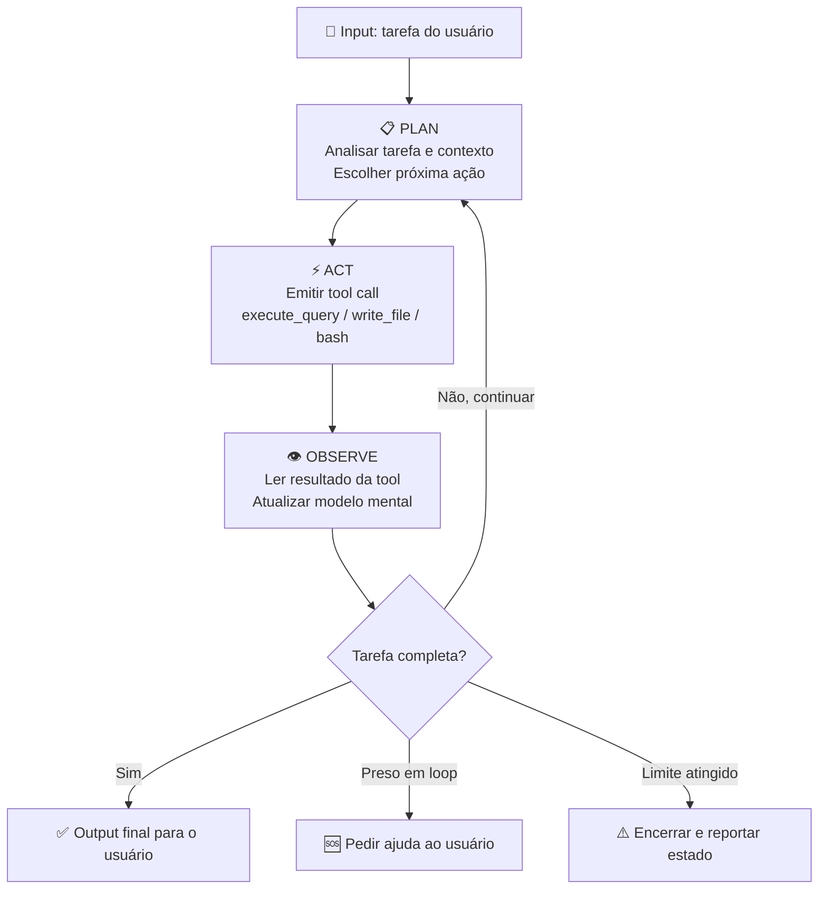
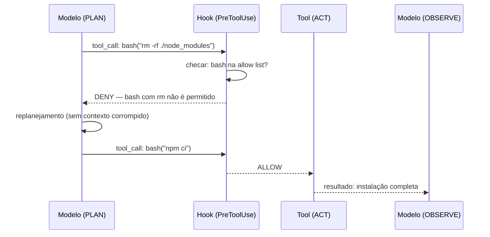

# O loop agentic — plan, act, observe

> [!abstract] TL;DR
> Todo agente de codificação opera com o mesmo ciclo fundamental: **Plan** (analisar a tarefa e decidir o próximo passo), **Act** (executar uma ação via tool), **Observe** (analisar o resultado e decidir se acabou ou continua). Esse ciclo — formalmente chamado de padrão ReAct (Reasoning + Acting) — se repete até a tarefa ser concluída, o agente ficar preso, ou o limite de iterações ser atingido. Entender esse loop é essencial para três coisas: debugar quando o agente erra (o problema está sempre em uma das três fases), configurar guardrails nos pontos certos (hooks interceptam a fase ACT), e estimar custos (cada iteração acumula contexto e os tokens não são baratos em sessões longas).

## Por que você deveria entender isso

Imagine uma cena familiar: você pede ao agente para "corrigir o bug no módulo de autenticação". Ele começa, faz algumas coisas, e então... fica em loop. Lê o mesmo arquivo quatro vezes. Tenta a mesma correção, verifica que não funcionou, tenta de novo. Vinte minutos depois, a sessão custou $3 e o bug continua lá.

Qual foi o problema? Sem entender o loop, a resposta é "o agente falhou". Com o loop em mente, você consegue ser específico: ele planejou errado (estava olhando para o arquivo errado), ou executou errado (a tool retornou um erro que ele não interpretou corretamente), ou observou errado (achava que o teste havia passado quando na verdade havia um segundo grupo de testes que não rodou).

O loop agentic não é um detalhe de implementação — é o modelo mental que separa quem usa IA de forma reativa de quem usa de forma intencional. Mais do que isso: é o vocabulário para conversar com precisão sobre onde e por que as coisas deram errado quando deram.

## O ciclo fundamental



O diagrama parece simples, mas esconde complexidade importante: a fase PLAN não é um passo separado — ela acontece dentro do próprio modelo a cada geração de token. O modelo decide simultaneamente o que pensar e o que fazer. A distinção Plan/Act/Observe é uma abstração didática sobre o que é um processo contínuo.

## As três fases em detalhe

### Fase 1: PLAN — raciocínio antes da ação

O modelo recebe como contexto: a tarefa original do usuário, o histórico de todas as iterações anteriores (cada tool call + resultado), as ferramentas disponíveis (com suas descrições), e o arquivo de configuração (CLAUDE.md).

A partir disso, ele produz um raciocínio interno e decide: qual tool chamar, com quais argumentos, e por quê. Em modelos com thinking extendido (como Claude 3.7 Sonnet com extended thinking ativo), esse raciocínio é explícito e visível. Em modelos padrão, acontece dentro da geração do token.

**O que afeta a qualidade do planejamento:**

| Fator | Impacto | Controle do desenvolvedor |
|-------|---------|--------------------------|
| Qualidade da instrução inicial | Alto | Escrever specs claras |
| Contexto de projeto (CLAUDE.md) | Alto | Configurar arquivos de config |
| Histórico acumulado | Médio | Limpar contexto quando necessário |
| Qualidade do modelo | Alto | Escolher modelo adequado |
| Thinking budget | Médio | Habilitar extended thinking |
| Descrições das tools | Médio | Escrever boas descrições no MCP server |

A última linha é subestimada: a descrição de uma tool é literalmente o que o modelo usa para decidir quando e como invocá-la. `get_count: "Returns count"` e `get_active_user_count: "Returns the number of active users (last_login within 30 days, not soft-deleted) from the production database"` levam a comportamentos radicalmente diferentes.

### Fase 2: ACT — a execução via tool call

O modelo emite um **[[Dicionário de IA#tool call|tool call]]** — uma invocação estruturada com nome da tool e argumentos:

```json
{
  "tool": "write_file",
  "arguments": {
    "path": "src/auth/auth.service.ts",
    "content": "// conteúdo gerado..."
  }
}
```

O runtime intercepta esse tool call (aqui entram os hooks `PreToolUse`), executa a ação, e retorna o resultado para o modelo.

**Tools comuns em agentes de coding:**

| Tool | Fase de uso | Tipo | Risco |
|------|------------|------|-------|
| `read_file` | Investigação | Read-only | Baixo |
| `list_dir` | Investigação | Read-only | Baixo |
| `grep_search` | Investigação | Read-only | Baixo |
| `write_file` | Implementação | Write | Médio |
| `replace_file` | Implementação | Write | Médio |
| `bash` | Verificação/deploy | Execute | Alto |
| `browser` | Pesquisa | Read-only | Baixo |
| `mcp_execute_query` | Dados | Execute | Médio-Alto |

**O pattern que funciona:** agentes bons começam na zona Read-only (investigar), sobem para Write (implementar), e terminam na zona Execute (verificar com testes). Agentes que começam executando sem investigar cometem mais erros.

### Fase 3: OBSERVE — interpretação do resultado

O resultado da tool volta como conteúdo adicional no contexto. O modelo lê e decide:

- A ação teve o efeito esperado?
- O output mostra sucesso ou falha?
- Há informações que mudam o plano?
- A tarefa está completa ou há próximo passo?

**Um caso de OBSERVE errado — e por que importa:**

```bash
# O agente rodou: npm test
# E recebeu como output:
Test Suites: 4 passed, 4 total
Tests:       47 passed, 47 total
```

O agente conclui: "testes passando, tarefa completa". Mas o script de teste tem um bug: ele só roda os testes unitários. Os testes de integração, que precisavam de uma variável de ambiente que não estava configurada, foram silenciosamente ignorados — e o `npm test` não sinalizou isso como erro.

O agente observou corretamente o que estava disponível para observar. O problema estava na ferramenta de verificação, não no agente. Essa distinção importa para debugging: antes de culpar o raciocínio do modelo, verifique se o feedback que você está dando a ele é confiável.

**Por que OBSERVE é a fase mais subestimada:** desenvolvedores geralmente focam em melhorar o PLAN (dar instrução melhor) ou o ACT (adicionar mais tools). Mas a qualidade do OBSERVE — o que o modelo lê e como interpreta — determina a qualidade do próximo PLAN. Um loop com excelente planejamento e execução mas observação ruim vai divergir progressivamente da realidade. O feedback loop contamina: garbage em OBSERVE resulta em garbage no próximo PLAN.

**Como melhorar a fase OBSERVE sem mudar o agente:** revise o output das suas tools de verificação. `npm test` retornando só "47 passed" é menos útil que um script que retorna o coverage, lista os suites que rodaram, e sinalizaria explicitamente se a variável de ambiente de integração não estivesse configurada. O agente observa o que a tool expõe — melhorar as tools melhora o observar sem mudar o modelo.

## Hooks: interceptando a fase ACT

O modelo mental Plan/Act/Observe tem um ponto de intervenção natural: **entre** Plan e Act, antes que a ação seja executada. É exatamente onde o sistema de hooks de agentes como o Claude Code opera.



O hook `PreToolUse` pode aprovar, negar ou modificar um tool call antes da execução. O hook `PostToolUse` lê o resultado antes de devolvê-lo ao modelo — útil para filtrar output excessivo ou adicionar contexto.

**Por que isso importa para o loop:** sem hooks, o modelo recebe todo o resultado bruto da tool — incluindo stack traces de 200 linhas, logs de compilação, saídas formatadas para humanos que o modelo não precisa parsear inteiramente. Hooks que filtram e resumem o output podem reduzir o tamanho do contexto em cada iteração, reduzindo custo e melhorando a relevância do que o modelo observa.

## O custo crescente do loop

Cada iteração acumula contexto. A iteração 10 envia como input todos os resultados das iterações 1-9 além da tarefa original. Isso tem implicações financeiras diretas:

| Iteração | Input tokens (acumulado) | Output tokens | Custo aprox. (Claude Sonnet) |
|----------|-------------------------|---------------|------------------------------|
| 1 | 5k (system + task) | 1k | $0.03 |
| 2 | 8k (+resultado 1) | 1.5k | $0.05 |
| 5 | 20k | 2k | $0.09 |
| 10 | 50k | 3k | $0.20 |
| 20 | 120k | 5k | $0.43 |
| 50 | 300k+ | 10k | $1.05 |

*Valores aproximados para Claude Sonnet em 2026. Variam por modelo e provider.*

**A matemática do loop longo:** uma sessão de 50 iterações custa quase o mesmo que 50 sessões de 1 iteração — porque o custo dominante é o input, que cresce linearmente com o histórico. A otimização mais eficaz não é usar modelos mais baratos: é reduzir o número de iterações com specs claras, contexto de projeto bem configurado, e plan mode antes de executar.

**Context compaction:** agentes como Claude Code implementam compactação automática de contexto quando o histórico se aproxima do limite da janela de contexto. A compactação resume iterações antigas em uma representação mais densa, preservando informação crítica mas descartando detalhes desnecessários. Isso mantém o custo gerenciável em sessões muito longas — mas tem um trade-off: informações compactadas podem ser perdidas ou distorcidas. Se o agente parece ter "esquecido" algo que aconteceu cedo na sessão, compactação pode ser a causa.

**Estratégia de custo por tipo de tarefa:**
- *Investigação/análise* (só leitura): custo baixo por iteração, mas muitas iterações — use subagente com contexto limpo
- *Implementação de feature* (iterativa): custo médio, 15-30 iterações esperadas — use plan mode, `/clear` entre sub-tarefas  
- *Debugging de bug complexo*: custo alto por iteração (output verboso das tools), imprevisível — set max_iterations agressivo e checkpoints

> [!tip] Assista: ReAct: Synergizing Reasoning and Acting in Language Models (Paper Explained)
> **Canal:** Yannic Kilcher | **Duração:** ~26min | **Idioma:** EN
>
> Yannic Kilcher faz um walkthrough do paper original de ReAct (Yao et al., 2023) que formalizou o padrão Plan-Act-Observe que todo agente de 2026 usa. O que torna esse vídeo especialmente útil para quem trabalha com agentes de coding é a análise dos experimentos de ablation [17:42]: o paper compara ReAct puro, chain-of-thought puro, e a combinação — e mostra que o raciocínio isolado sem ação (só pensar) é sistematicamente inferior ao ciclo completo. O trecho mais revelador é a análise de falha [21:08]: agentes ReAct falham por "propagação de erro" — uma observação errada em uma iteração contamina o planejamento de todas as seguintes. Esse é exatamente o padrão que você vê quando um agente "vai na direção errada" em uma sessão longa. Trecho de destaque [21:08]: *"When the first action is wrong, and ReAct observes an incorrect result, it then reasons from incorrect premises — and the error compounds over the next steps."*
>
> 🎬 https://www.youtube.com/watch?v=NaVCGLMBo1g

## Otimizando o número de iterações

A pergunta prática: como fazer o agente chegar ao resultado correto em menos iterações?

| Técnica | Redução estimada | Como aplicar |
|---------|-----------------|--------------|
| **Spec clara e específica** | 40-60% | Em vez de "melhore o código", diga "extraia a lógica de cálculo de desconto em uma função pura `calcDiscount(price, tier)` com tipo de retorno `Decimal`" |
| **Contexto de projeto (CLAUDE.md)** | 20-30% | O agente não precisa gastar iterações "descobrindo" os padrões do projeto — eles estão documentados |
| **Plan Mode antes de executar** | 30-50% | Concentra raciocínio antes da execução; elimina re-planejamento mid-loop |
| **Testes como feedback explícito** | 20-40% | "Rode `npm test -- auth.spec.ts` após cada mudança" é melhor que "verifique se funciona" — dá feedback determinístico |
| **Subagentes para sub-tarefas** | 30-60% | Cada sub-agente começa com contexto limpo; elimina o custo crescente de um contexto único |
| **`/clear` entre tarefas independentes** | 50-80% para a segunda tarefa | Reinicia o contexto; a segunda tarefa começa na iteração 1, não na iteração 50 |

**A heurística prática:** se você está na iteração 10+ e o agente ainda está na fase de investigação (lendo arquivos, explorando a base de código), o problema quase sempre é a instrução inicial — muito vaga, sem contexto suficiente, ou sem feedback confiável definido.

## Falhas comuns no loop

| Falha | Fase afetada | Sintoma observável | Causa raiz |
|-------|-------------|-------------------|-----------|
| **Loop infinito** | Plan | Mesma ação repetida sem progresso | Sem `max_iterations`, plan sem sair do estado atual |
| **Tool errada** | Plan | Usa bash onde read_file resolveria | Descrição de tool ruim ou contexto insuficiente |
| **Observação errada** | Observe | "Passou" quando falhou | Output ambíguo da tool, parsing incorreto |
| **Contexto perdido** | Plan | Esquece o que tentou antes | Contexto compactado ou história muito longa |
| **Scope creep** | Plan | Começa a "melhorar" coisas não pedidas | Sem guardrails de escopo no CLAUDE.md |
| **Erro silencioso** | Act/Observe | Tool falha sem sinalizar claramente | Tratamento de erro ruim no server MCP |
| **Otimismo prematuro** | Observe | Conclui tarefa antes de verificar | Sem step de verificação explícito na instrução |
| **Hallucination de resultado** | Observe | "Arquivo criado" quando não foi | Tool não confirmou; adicionar `read_file` de verificação depois de writes |
| **Over-specification** | Plan | Agente implementa além do pedido | Especificação aberta demais; delimitar escopo explicitamente |

**Como distinguir onde o loop falhou:** leia o histórico em ordem cronológica. A primeira iteração onde o output divergiu do esperado é geralmente onde o problema foi introduzido — não onde os sintomas aparecem. Sintomas emergem iterações depois, quando o estado incorreto se propaga. Esse padrão de "propagação de erro" é o mecanismo central que o paper de ReAct analisa [21:08 do vídeo acima].

## ReAct vs outras arquiteturas de agente

O padrão ReAct é o mais comum em agentes de coding, mas não é o único. Vale entender os outros para reconhecer quando cada um aparece:

| Arquitetura | Descrição | Quando é melhor | Agente que usa |
|-------------|-----------|----------------|---------------|
| **ReAct** (Plan/Act/Observe) | Loop de raciocínio + ação intercalados | Tarefas iterativas com feedback de tool | Claude Code, Cursor, a maioria dos agentes |
| **Chain of Thought** (sem ação) | Raciocínio em cadeia, sem tool calls | Análise pura, sem necessidade de executar | Modelos em modo conversacional |
| **Tree of Thought** | Explora múltiplos branches em paralelo antes de escolher | Problemas com múltiplas soluções plausíveis | Experimental, pesquisa |
| **Plan and Execute** | Gera plano completo primeiro, depois executa sem replanejar | Tarefas bem definidas onde replanejar é caro | Agentes com planning separado |
| **LATS** (Language Agent Tree Search) | Combina MCTS com LLM para explorar o espaço de soluções | Otimização, código que precisa de muitas tentativas | Experimental, SWE-bench |

**Para agentes de coding:** ReAct domina por uma razão prática — o "mundo" do código tem estado (arquivos, testes, banco de dados), e o agente precisa observar esse estado após cada ação antes de decidir o próximo passo. Abordagens como Plan and Execute pressupõem que o plano completo pode ser gerado sem feedback intermediário, o que raramente é verdade em codebases reais (você descobre dependências escondidas, comportamentos inesperados, arquivos que não existiam onde esperava).

**ReAct como caso especial de OODA:** militares familiarizados com teoria de tomada de decisão vão reconhecer o loop OODA (Observe, Orient, Decide, Act) de John Boyd. ReAct é essencialmente OODA com Observe e Orient colapsados em uma única fase de raciocínio. A diferença chave: OODA é pensado para situações adversariais onde o oponente também age — ReAct assume um ambiente não-adversarial onde o "mundo" (codebase) responde de forma determinística às ações.

## Como diferentes agentes implementam o loop

O loop Plan/Act/Observe é universal, mas cada ferramenta o implementa com controles diferentes:

| Agente | Controle de iterações | Visibilidade do loop | Interrupção humana |
|--------|----------------------|---------------------|-------------------|
| **Claude Code** | `--max-turns N` | Thinking visível (com extended thinking) | CTRL+C a qualquer momento |
| **Cursor** | Sem controle direto | Tool calls visíveis no sidebar | Botão Stop |
| **GitHub Copilot Agents** | Definido pelo workflow | Log de steps no PR | Cancelar o workflow |
| **Devin** | Sessão com timeout | Log detalhado de ações | Intervenção via chat |
| **OpenAI Codex** | Max turns configurável | Streaming de tool calls | API de cancelamento |

**O que isso significa na prática:** Claude Code oferece o controle mais granular sobre o loop — você pode definir o limite de turns, ver o raciocínio interno, e interromper a qualquer ponto com contexto do estado atual. Ferramentas como Devin operam em "set and forget" — você define a tarefa e o agente trabalha autonomamente, com intervenção humana como exceção, não regra.

A escolha entre esses modelos de controle depende do tipo de tarefa e do custo aceitável de erro — exatamente o tema da nota [[17 - Human-in-the-loop — quando (não) confiar|Human-in-the-loop]].

## Casos práticos

### Caso 1 — Debugando onde o loop quebrou

**Cenário:** você pede ao agente "implemente paginação na listagem de usuários" e ele trabalha por 15 minutos. O resultado final não funciona — a segunda página sempre retorna os mesmos itens da primeira.

**Como investigar com o modelo mental do loop:**

1. **Fase PLAN:** o agente entendeu o que é cursor-based pagination vs offset-based? Se o histórico mostra que ele implementou `LIMIT 10 OFFSET page*10`, ele usou a abordagem errada para uma tabela com write-heavy load.

2. **Fase ACT:** ele rodou os testes? Quais? Se rodou só testes unitários com dados mockados, não teria detectado o problema com dados reais.

3. **Fase OBSERVE:** o agente viu falha em alguma iteração e a ignorou, ou nunca teve feedback de falha?

**O que isso revela:** o problema não foi "o agente não sabe implementar paginação" — foi que as ferramentas de verificação disponíveis (testes unitários com mocks) não capturavam o comportamento real. A correção é: antes de pedir a implementação, confirme que existe um teste de integração que valida paginação com dados reais.

### Caso 2 — Usando Plan Mode para encurtar o loop

**Cenário:** refactoring de um módulo legado de 3.000 linhas. Sem planejamento, o agente começa a editar arquivos em ordem não ideal, desfaz mudanças que dependem de outras não feitas ainda, e após 20 iterações o código está em estado inconsistente.

**Com Plan Mode ativado primeiro:**

```
"Antes de editar qualquer arquivo, mostre o plano completo:
quais arquivos editar, em que ordem, e qual é a dependência entre as edições."
```

O agente produz um plano de 12 passos. Você revisa, identifica que ele planejou editar `UserService` antes de `UserRepository` (na direção errada da dependência), reordena, e então dá o go. As 20 iterações viram 12 — e cada uma delas tem um objetivo claro que você pode verificar.

**O que Plan Mode faz ao loop:** concentra todo o raciocínio na fase PLAN antes de entrar em qualquer ciclo ACT/OBSERVE. Isso elimina o custo de planejamento nas iterações intermediárias — o agente não precisa mais "descobrir o que fazer" enquanto executa.

### Caso 3 — Loop infinito e como prevenir

**Cenário real:** agente tentando fazer um teste passar. O teste falha com `TypeError: Cannot read property 'id' of undefined`. O agente:

- Iteração 1: adiciona null check → teste ainda falha (erro diferente agora)
- Iteração 2: ajusta o null check → teste falha de novo
- Iteração 3: reverte para a versão anterior achando que foi "pior" → volta ao erro original
- Iteração 4: adiciona null check de novo (mesma coisa da iteração 1)
- ... 12 iterações depois, $4 gastos, teste ainda falha

**O problema:** o agente entrou em loop porque nunca investigou a causa raiz. Ele estava tratando o sintoma (o tipo errado no teste) em vez do problema (o factory de dados do teste não estava criando o campo `id` corretamente).

**Como prevenir:**
1. Configure `max_iterations: 5` para o tipo de tarefa (a maioria dos fixes de teste não deve precisar de mais)
2. Instrua explicitamente: "Se após 3 tentativas o teste ainda falha, pare e explique o que você entende sobre a causa raiz antes de continuar"
3. Use `bash` para rodar `node -e "console.log(require('./test/factories/user').create())"` — verificar o output do factory antes de tentar corrigir o teste

### Caso 4 — Monitorando o loop em tempo real

**Cenário:** tarefa de médio porte — migrar a autenticação de JWT para OAuth 2.0. Estimativa: 20-30 arquivos afetados, 2-3 horas de trabalho manual. Você não quer supervisionar cada iteração, mas também não quer descobrir no final que o agente foi na direção errada.

**Estratégia de monitoramento do loop:**

1. **Plan explícito primeiro:** "Antes de editar qualquer arquivo, liste os arquivos que serão afetados, a ordem de edição, e o que mudará em cada um."

2. **Checkpoints definidos:** "A cada 10 iterações, faça um resumo de: o que foi feito, o que falta, e se há algo bloqueante."

3. **Feedback gate em pontos críticos:** "Quando chegar na edição do `auth.middleware.ts`, mostre o diff para aprovação antes de continuar."

4. **Verificação incremental:** "Após cada arquivo editado, rode `npx tsc --noEmit` para verificar que não há erros de tipo introduzidos."

**O resultado:** o loop roda com autonomia máxima nos passos mecânicos (atualização de imports, renomeação de variáveis), mas tem checkpoints nos pontos de decisão (mudança de contrato da API, alteração de comportamento de segurança). Você economiza 80% da supervisão sem abdicar do controle nos momentos que importam.

**Uma heurística útil:** classifique cada step em "mecânico" (determinístico, fácil de reverter) vs "estratégico" (decisão com consequências). Loop autônomo nos mecânicos, checkpoint nos estratégicos.

## Armadilhas comuns

> [!warning] Sem limite de iterações, um loop infinito custa caro de verdade
> O problema do loop infinito não é teórico — é financeiro e de qualidade. Um agente preso em 50 iterações sem chegar a lugar nenhum pode custar $5-15 em uma única sessão, além de deixar o código em estado inconsistente. Configure sempre `max_iterations` ou limite de tempo para sessões agentic. Em Claude Code: `--max-turns 20` na linha de comando. O limite ideal depende da tarefa: bugs simples (5-10), refactoring (20-30), features complexas (50+).

> [!warning] "O agente vai descobrir sozinho" é a receita para mais iterações
> Quanto mais ambígua a instrução, mais o agente gasta iterações na fase PLAN tentando inferir o que você quis dizer. Uma instrução como "melhore o desempenho" é um convite para dezenas de iterações explorando diferentes abordagens. "Identifique as 3 queries mais lentas usando o profiler, proponha índices para as que não têm, e escreva a migration" é uma instrução que começa na fase ACT quase imediatamente.

> [!warning] Ignorar o custo acumulado do contexto é queimar dinheiro sem perceber
> A iteração 50 de uma sessão custa ~35x mais em input tokens que a iteração 1 — porque o contexto acumulado de 49 iterações anteriores é reenviado integralmente. Para tarefas longas, use `/clear` entre sub-tarefas independentes, ou use subagentes para manter cada contexto pequeno. O `/checkpoint` antes do `/clear` preserva o estado relevante.

> [!warning] Não verificar com testes reais é confiar demais na fase OBSERVE
> O agente só pode observar o que as tools reportam. Se os testes não cobrem o comportamento que você quer verificar, o agente vai "observar sucesso" onde há falha. A responsabilidade de ter feedback confiável é do desenvolvedor — o agente não pode inventar testes que não existem.

> [!warning] Pular Plan Mode para "ser mais rápido" frequentemente é o contrário
> A tentação é ir direto para a execução — afinal, Plan Mode parece "overhead". Na prática, para tarefas com mais de 3 passos interdependentes, pular o plano normalmente resulta em mais iterações de correção do que o próprio plan teria custado. Plan Mode paga por si mesmo em tarefas de médio e longo porte.

> [!warning] Feedback ambíguo da tool contamina todas as iterações seguintes
> Se a tool retorna `{"status": "ok"}` quando esperaria `{"status": "ok", "rows_affected": 0}`, o agente pode interpretar "ok" como sucesso quando na verdade a operação não teve efeito. A qualidade do OBSERVE depende diretamente da qualidade do output das tools. Quando o loop dá respostas estranhas em iterações avançadas, verifique se o output das tools nas iterações anteriores era realmente inequívoco — ou se havia ambiguidade que o modelo resolveu de forma incorreta.

## Como explicar em inglês

| Português | Inglês técnico | Contexto de uso |
|-----------|---------------|----------------|
| Loop agentic | Agentic loop | "The agentic loop is the core execution model for AI agents" |
| Padrão ReAct | ReAct pattern | "Claude Code implements the ReAct pattern — Reasoning and Acting" |
| Raciocínio + ação | Reasoning and acting | "Each iteration involves reasoning about the context, then acting via tools" |
| Chamada de ferramenta | Tool call | "The model emits a tool call, which the runtime intercepts and executes" |
| Contexto acumulado | Accumulated context | "The accumulated context grows with each iteration, increasing token costs" |
| Limite de iterações | Max iterations / turn limit | "Set a turn limit to prevent runaway loops" |
| Escopo crescente | Scope creep | "Without guardrails, agents tend toward scope creep" |
| Observação errada | Misobservation / incorrect observation | "The agent failed due to misobservation — the test runner output was ambiguous" |
| Modo de planejamento | Plan mode | "Use plan mode before execution for complex multi-step tasks" |
| Guardrails | Guardrails | "Hooks act as guardrails that intercept tool calls before execution" |
| Contexto de projeto | Project context | "Project context from CLAUDE.md improves the quality of the planning phase" |
| Propagação de erro | Error propagation | "A wrong observation in iteration 1 causes error propagation in subsequent steps" |

> [!tip] Frase de impacto para entrevistas
> *"Every AI coding agent runs the same fundamental loop: plan the next action, act by calling a tool, observe the result, and repeat. The key insight is that failures are always locatable to one of those three phases — which makes debugging much more systematic. If the agent is going in circles, you look at the planning phase. If it seems to succeed but doesn't, you look at the observation phase. That mental model transforms 'the AI failed' into 'the AI failed here, for this reason, and here's how to fix it.'"*

## O que vem a seguir

O padrão ReAct é a base — mas a pesquisa em 2025-2026 está expandindo o modelo em várias direções:

**Loops com reflexão explícita:** além de Plan/Act/Observe, alguns sistemas adicionam uma fase de "Critique" — o agente avalia criticamente sua própria saída antes de apresentar ao usuário. O [[12 - Multi-agent — workflows com múltiplos agentes|padrão pipeline]] com agente A implementando e agente B revisando é uma implementação externa desse mecanismo.

**Loops com memória persistente:** o contexto acumulado dentro de uma sessão é descartado ao final. Sistemas que mantêm memória entre sessões (via arquivos, bancos de dados, ou memória vetorial) permitem que o loop aprenda com iterações passadas — não repete abordagens que já falharam, reconhece padrões de código que já viu antes.

**Loops adaptativos ao custo:** agentes que monitoram o custo acumulado da sessão e ajustam a estratégia — usando modelos mais baratos para steps de investigação e escalando para modelos mais capazes só nas decisões críticas. O orquestrador escolhe o modelo por step, não por sessão inteira.

**Loops com verificação formal:** em domínios onde correção é crítica (código financeiro, sistemas de saúde), o loop incorpora verificadores formais na fase OBSERVE — não só "os testes passaram" mas "a prova de corretude é válida". Ainda experimental em 2026, mas a direção é clara.

O loop agentic é o equivalente computacional do método científico para IA: hipótese → experimento → observação → nova hipótese. A diferença é que o "experimento" acontece em milissegundos e o "laboratório" é o seu repositório de código.

**A questão filosófica que o loop levanta:** até que ponto o "planejamento" de um LLM é planejamento real? O modelo não mantém estado entre tokens — cada token é gerado condicionado apenas no que veio antes, sem um "estado interno" separado do contexto. O que parece planejamento é raciocínio emergente a partir do contexto acumulado. Isso tem implicações práticas: o "plano" do agente pode mudar radicalmente se a ordem das informações no contexto mudar, porque não há uma representação interna do plano — há apenas a próxima previsão de token condicionada em tudo que o modelo já gerou.

**Implicação para debugging:** se o agente "mudou de ideia" no meio de uma tarefa, não foi porque reconsiderou estrategicamente — foi porque o contexto acumulado levou a uma previsão diferente. Verificar o histórico do loop geralmente revela o momento exato onde uma observação particular "virou a chave" e mudou a direção.

**Loops concorrentes em multi-agent:** quando o padrão pipeline usa agente A implementando e agente B revisando, você tem dois loops rodando em sequência. Quando o padrão paralelo usa múltiplos agentes em módulos independentes, você tem múltiplos loops rodando simultaneamente. A coordenação entre loops — como eles compartilham resultados, como um loop pode bloquear esperando resultado de outro — é o design space dos sistemas multi-agent modernos. Ver [[12 - Multi-agent — workflows com múltiplos agentes]] para o panorama completo.

## Veja também

- [[05 - Claude Code — terminal-first agent]] — o agente que implementa o loop com mais controle granular (hooks, Plan Mode, max_turns)
- [[15 - MCP — o protocolo universal]] — as tools que alimentam a fase ACT do loop
- [[17 - Human-in-the-loop — quando (não) confiar]] — onde colocar o humano no ciclo e quando deixar o loop rodar autonomamente
- [[12 - Multi-agent — workflows com múltiplos agentes]] — como múltiplos loops agentic se coordenam em workflows complexos

## Checklist de uso saudável do loop

Antes de iniciar uma sessão agentic longa, verifique:

- [ ] A instrução é específica o suficiente para não precisar de muitas iterações de esclarecimento
- [ ] O mecanismo de feedback (testes, linting, type check) é confiável e não ambíguo
- [ ] `max_iterations` ou `--max-turns` está configurado para o tipo de tarefa
- [ ] Há checkpoints em steps estratégicos (não só ao final)
- [ ] O contexto de projeto (CLAUDE.md) está atualizado
- [ ] Para tarefas longas: sub-tarefas independentes serão separadas com `/clear`
- [ ] O agente sabe como sinalizar quando está preso (instrução: "se após 3 tentativas não progredir, pare e explique o bloqueio")
- [ ] Para sessões com risco de escopo: proibições explícitas no CLAUDE.md ou na instrução ("não edite arquivos fora de `src/auth/`")
- [ ] Se o agente vai usar MCP servers: só os servers necessários para a tarefa estão ativos nessa sessão
- [ ] Há uma forma de verificar o resultado final independentemente do que o agente reportou (ex: rodar o build você mesmo, não confiar só no "build passou" do agente)

## Referências

- **Yao et al.** — *ReAct: Synergizing Reasoning and Acting in Language Models* (2023). O paper que formalizou o padrão Plan/Act/Observe — inclui experimentos de ablation mostrando a superioridade do ciclo completo vs chain-of-thought puro. Disponível em https://arxiv.org/abs/2210.03629
- **Anthropic** — *Building Effective Agents* (2025). Guia prático para design de loops agentic — inclui análise de custo por iteração, estratégias de guardrails e quando usar subagentes. https://www.anthropic.com/research/building-effective-agents
- **Anthropic** — *Claude Code: Understanding the agentic loop* (2026). Documentação específica de como Claude Code implementa o loop, incluindo max_turns, hooks PreToolUse/PostToolUse e context compaction. https://docs.anthropic.com/claude-code/agentic-loop
- **Shinn et al.** — *Reflexion: Language Agents with Verbal Reinforcement Learning* (2023). Extensão do ReAct com fase de auto-reflexão — relevante para entender a direção de loops com critique explícita. https://arxiv.org/abs/2303.11366
- **Yann LeCun / Boyd** — Para quem quer ir mais fundo na teoria do loop de controle: o OODA Loop de John Boyd (1970s, teoria militar) é o antecedente intelectual direto do ReAct. A sequência Observe→Orient→Decide→Act mapeia quase 1:1 com o loop agentic moderno.
