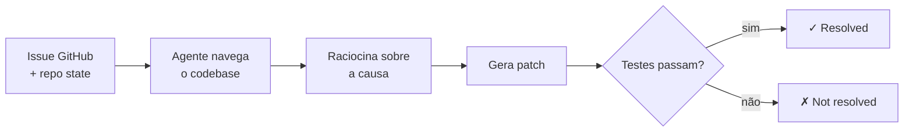
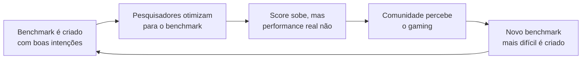

# Benchmarks e avaliação — SWE-bench e além

> [!abstract] TL;DR
> Antes de assinar qualquer plano Enterprise de ferramenta de IA, você precisa de uma forma objetiva de medir o que ela resolve. O SWE-bench virou o padrão da indústria: um conjunto de issues reais do GitHub onde o agente precisa gerar um patch que passe nos testes existentes. Em maio de 2026, os melhores agentes resolvem ~72% das issues na versão Verified — mas esse número diz mais sobre o scaffold do que sobre o modelo. Para o engenheiro individual, o benchmark que importa é o que você constrói com issues do seu próprio codebase.

---

## O problema: como comparar o incomparável?

Imagine que você precisa decidir entre quatro ferramentas de agente de codificação. O vendedor A diz "nosso agente é 40% mais produtivo". O vendedor B mostra um gráfico com "92% de acurácia em tarefas de codificação". O vendedor C exibe um score de 69% no SWE-bench. Como você compara isso?

Sem um benchmark padronizado, cada empresa inventa sua métrica favorita — e inevitavelmente escolhe o teste em que ganha. O mesmo problema que a indústria de GPUs resolveu com benchmarks como SPEC CPU, a indústria de agentes de IA tentou resolver com o SWE-bench.

A questão mais honesta não é "qual agente é melhor?" mas: **"melhor em quê, medido como, com qual scaffolding?"**

É a mesma questão que separa um engenheiro que toma decisão técnica com rigor de um que toma decisão por viés de confirmação. O primeiro lê a metodologia. O segundo lê o headline. Este capítulo é sobre como ser o primeiro.

**O que você vai aprender aqui:**
- Como o SWE-bench funciona mecanicamente e por que virou padrão
- Por que o scaffold importa tanto quanto (ou mais que) o modelo
- Quais outros benchmarks existem e quando usar cada um
- Como construir sua própria suite de avaliação com issues reais do seu codebase

---

## O que é o SWE-bench

**SWE-bench** (Software Engineering Benchmark) é um dataset criado pela Universidade de Princeton e publicado em 2023. Ele contém issues reais de repositórios populares do GitHub — Django, Flask, scikit-learn, Pillow, entre outros — com seus respectivos patches de solução.

O protocolo de avaliação é simples na ideia, difícil na execução:

1. O agente recebe a descrição da issue e o estado do repositório no momento da issue
2. O agente navega o codebase, raciocina sobre o problema, gera um patch
3. O patch é aplicado ao repositório e os testes existentes são executados
4. **Vitória**: patch resolve a issue sem quebrar nenhum teste existente

Isso é diferente de "escrever uma função a partir de uma docstring" (HumanEval). É trabalho de engenharia de software de verdade: entender um bug relatado por um usuário, encontrar onde está o problema em um codebase real, e corrigir sem criar regressões.



---

## Versões do SWE-bench

| Versão | Issues | Curação | Uso principal |
|---|---|---|---|
| **SWE-bench Full** | 2.294 | Automática | Pesquisa acadêmica |
| **SWE-bench Verified** | 500 | Revisão humana | Comparação entre agentes |
| **SWE-bench Lite** | 300 | Filtragem automática | Prototipagem rápida |

A versão **Verified** é a mais usada para comparações públicas. Humanos revisaram cada issue para garantir que: a descrição é clara, o patch oficial está correto, e os testes realmente detectam a falha. Isso remove issues ambíguas onde múltiplas soluções seriam válidas.

---

## Leaderboard atual (maio 2026)

> [!warning] Este leaderboard caduca rápido
> Modelos e scores mudam mensalmente — o que está abaixo é um snapshot de maio de 2026, não um ranking permanente. Antes de decidir com base nele, confira o estado atual em [swebench.com](https://swebench.com) ou no [Artificial Analysis](https://artificialanalysis.ai).

| Agente / Modelo | SWE-bench Verified | Notas |
|---|---|---|
| Claude Opus 4.6 + scaffold best-of-N | ~72% | Líder com scaffolding otimizado |
| GPT-5.4 + OpenAI scaffold | ~69% | Forte, contexto longo ajuda |
| Gemini 3.1 Pro | ~65% | Melhora com janela de 2M tokens |
| DeepSeek V4 | ~63% | Impressionante para open-weight |
| Qwen 3.6 Plus | ~61% | Melhor em workflows agentics |
| Devin (SWE-agent autônomo) | ~55-60% | Scaffold proprietário autônomo |

> [!warning] Scaffolding importa tanto quanto o modelo
> O mesmo Claude Opus pode variar de 50% a 72% dependendo de como o codebase é indexado, quais ferramentas estão disponíveis, e como os prompts são construídos. Comparar modelos sem controlar o scaffold é comparar um piloto de F1 numa corrida de rua versus uma pista profissional — e declarar que ele é o melhor piloto do mundo.

---

## Como o scaffold afeta o score

Pense no scaffold como o ambiente de trabalho do agente: ele determina quais ferramentas estão na bancada, como o código é apresentado, e quantas tentativas o agente pode fazer.

Scaffoldings comuns e seu impacto:

| Técnica de scaffold | Impacto no score | Custo |
|---|---|---|
| **Tree-sitter indexação** | +5-8% | Médio |
| **Busca semântica no repo** | +4-7% | Alto |
| **Best-of-N sampling** | +3-10% | Alto (N× custo) |
| **Prompt de contexto completo** | +2-5% | Médio |
| **Retry com feedback de testes** | +8-15% | Alto |

A implicação prática: uma empresa pode publicar "nosso modelo aumentou 5% no SWE-bench" quando na verdade melhorou o scaffold, não o modelo. **Leia as seções de metodologia antes de comparar leaderboards.**

**Reprodutibilidade como critério de confiança**

Um score publicado sem metodologia reprodutível não é ciência — é marketing. Antes de confiar em um número, verifique:

1. O código de avaliação está disponível publicamente?
2. Os parâmetros de temperatura e sampling estão fixados?
3. O número de tentativas por issue está documentado? (best-of-1 vs best-of-5 são mundos diferentes)
4. Qual versão exata do modelo foi usada? (versões do mesmo modelo mudam silenciosamente)

Provedores sérios publicam todos esses detalhes. Quando as condições de avaliação estão ocultas, o score serve ao marketing, não à tomada de decisão.

---

## Limitações do SWE-bench

| Limitação | Por que importa |
|---|---|
| **Selection bias** | Issues são de repos Python maduros com testes bem escritos. Código legado sem testes, TypeScript, Java, Go — sub-representados. |
| **Snapshot temporal** | Issues são de 2019-2024. Modelos treinados em dados mais recentes podem ter "visto" os patches durante o pré-treino. |
| **Sem verificação de qualidade** | Um patch que faz os testes passarem pode introduzir novos bugs. O SWE-bench não captura dívida técnica gerada. |
| **Sem medição de processo** | Mede resultado final. Não captura se o agente segue convenções de código, escreve commits descritivos, ou lida bem com ambiguidade. |
| **Benchmark gaming** | Provedores otimizam scaffolding especificamente para SWE-bench. Performance "na vida real" pode ser bem menor. |
| **Custo invisível** | Um agente que resolve 72% das issues mas usa 10× mais tokens que outro que resolve 65% pode não ser melhor custo-benefício. |

---

## Além do SWE-bench

O SWE-bench não é o único benchmark. Dependendo do que você precisa medir:

| Benchmark | O que mede | Foco | Quando usar |
|---|---|---|---|
| **HumanEval+** | Geração de função a partir de docstring | Coding isolado | Comparar capacidade base de geração |
| **MBPP** | Problemas básicos de programação | Fundamentos | Modelos menores ou fine-tuning |
| **LiveCodeBench** | Problemas de competição após cutoff | Anti-contaminação | Verificar se o modelo "memorizou" |
| **Aider Polyglot** | Edit performance em múltiplas linguagens | Multi-linguagem | Times com stack diverso |
| **Terminal-Bench** | Tarefas de terminal e DevOps | Agentes de infra | Automação de infraestrutura |
| **LMSYS Chatbot Arena** | Preferência humana em respostas | Qualidade percebida | Avaliação qualitativa |
| **Seu próprio codebase** | Performance no SEU contexto | O que realmente importa | Decisão de compra/adoção |

> [!tip] Assista: SWE-bench — Measuring Language Models on Real-World GitHub Issues
> **Canal:** Princeton NLP | **Duração:** ~18min | **Idioma:** EN
>
> Os autores explicam as decisões de design: por que issues reais do GitHub em vez de problemas sintéticos, como a curadoria humana mudou o Verified set, e o que os números *não* capturam sobre qualidade de engenharia. Trecho de destaque [11:42]: *"The agent needs to understand not just the bug report, but the implicit conventions of the codebase — the style, the architecture, what a 'good fix' looks like for this project."*
>
> 🎬 https://www.youtube.com/watch?v=jiarYJJ7hJc

---

## LiveCodeBench: o benchmark anti-contaminação

Um problema sério com qualquer benchmark estático: os modelos são treinados com dados da internet, e os problemas do benchmark eventualmente chegam ao conjunto de treinamento.

O **LiveCodeBench** resolve isso coletando problemas continuamente de plataformas de competição (LeetCode, Codeforces, AtCoder) *após* a data de corte de cada modelo. Isso significa que o modelo não pode ter "memorizado" a solução.

Os resultados são humilhantes comparados ao SWE-bench: mesmo os melhores modelos resolvem 60-70% dos problemas "fáceis" do LiveCodeBench, e apenas 20-30% dos "médios". Isso sugere que parte do score do SWE-bench reflete memorização de padrões vistos durante o treinamento.

---

## A Lei de Goodhart e o ciclo de vida dos benchmarks

Há uma lei econômica que todo engenheiro que usa benchmarks precisa conhecer: a **Lei de Goodhart**. Formulada pelo economista britânico Charles Goodhart nos anos 1970, ela diz:

> *"Quando uma medida se torna um alvo, ela deixa de ser uma boa medida."*

No contexto de benchmarks de IA, o ciclo funciona assim:



O SWE-bench passou exatamente por esse ciclo. Quando foi lançado em 2023, os melhores agentes resolviam ~4% das issues. Em 2026, chegam a 72%. Parte desse ganho é melhora real dos modelos. Parte é especialização de scaffold para o benchmark específico. Distinguir os dois é o desafio.

**Indicadores de benchmark gaming:**
- Score no benchmark cresce muito mais rápido que relatos de produtividade reportados por usuários
- Metodologia de avaliação não é publicada ou muda entre versões sem documentação clara
- Provider não publica scores em benchmarks alternativos (onde pode performar pior)
- Diferença grande entre score no Verified (curado) e no Full (bruto) sem explicação

---

## Interpretando diferenças estatísticas

Um erro comum: tratar diferenças de 2-3 pontos percentuais como decisivas. Mas com 500 issues (SWE-bench Verified), a margem de erro estatística é relevante.

Para uma taxa de resolução de 70% em 500 amostras, o intervalo de confiança de 95% é aproximadamente:

```
±√(0.70 × 0.30 / 500) × 1.96 ≈ ±4%
```

Isso significa: a diferença entre 69% e 72% **não é estatisticamente significativa** com o tamanho atual do Verified set. Provedores que divulgam diferenças menores que 4-5% entre seus modelos e o concorrente estão sendo imprecisos (ou desonestos).

**Regras práticas para comparar scores:**

| Diferença | Interpretação | Ação |
|---|---|---|
| < 3 pontos | Ruído estatístico | Não decide por benchmark; avalie no seu contexto |
| 3-8 pontos | Diferença real mas pequena | Considere custo, UX e ecossistema |
| > 8 pontos | Diferença significativa | Benchmark pode ser fator decisivo |
| > 15 pontos | Gap grande | Valide se o scaffold é comparável |

---

## Checklist de avaliação responsável

Antes de usar scores de benchmark em decisões de adoção:

- [ ] A versão do benchmark está documentada? (Full / Verified / Lite)
- [ ] O scaffold de avaliação está descrito em detalhes suficientes para replicação?
- [ ] O provider publica scores em múltiplos benchmarks (não só aquele em que ganha)?
- [ ] A diferença de score é maior que a margem de erro estatística (~4% para Verified)?
- [ ] O benchmark inclui linguagens e tipos de issues relevantes para o seu stack?
- [ ] Você testou pelo menos uma vez no seu próprio codebase antes de decidir?
- [ ] O custo por issue resolvida foi calculado, não apenas a taxa de resolução?

---

## Como avaliar para o SEU codebase

O benchmark que realmente importa é o que você constrói com o seu código. O processo:

**Passo 1 — Monte a suite**
- Colete 15-25 issues resolvidas do seu repositório nos últimos 6 meses
- Inclua bugs, features pequenas e refatorações
- Certifique-se que cada issue tem testes que verificam a correção

**Passo 2 — Baseline**
- Para cada issue, reverta o commit de solução
- Dê ao agente: a descrição da issue + o estado do repo antes da correção
- Registre: resolveu? Quantas iterações? Quantos tokens? Quanto tempo?

**Passo 3 — Meça o que importa para você**

| Métrica | Por que importa |
|---|---|
| Taxa de resolução | Eficácia bruta |
| Taxa de resolução sem revisão humana | Autonomia real |
| Custo por issue resolvida | ROI |
| Qualidade do código gerado | Dívida técnica criada |
| Falsos positivos (parece certo, mas não é) | Confiabilidade |

**Passo 4 — Documente o processo, não só o resultado** Registre qual versão do modelo foi testada, qual configuração de scaffold, e as condições do teste. Sem isso, você não consegue comparar a avaliação de daqui a 3 meses com a atual — e vai voltar à estaca zero.

**Passo 5 — Refaça após 3 meses** Modelos melhoram rápido. O agente que perdeu sua avaliação hoje pode vencer na próxima rodada. Uma suite de avaliação que você roda trimestralmente é mais valiosa do que um benchmark público que você leu uma vez.

**Exemplo de scorecard de avaliação interna:**

| Ferramenta | Taxa resolução | Taxa sem revisão | Custo/issue | Score UX | Nota final |
|---|---|---|---|---|---|
| Claude Code | 18/20 (90%) | 14/20 (70%) | $0.12 | 4.2/5 | A |
| Cursor | 15/20 (75%) | 11/20 (55%) | $0.08 | 4.5/5 | B+ |
| GitHub Copilot | 12/20 (60%) | 8/20 (40%) | $0.05 | 4.0/5 | B |

---

## Casos práticos

### Caso 1 — Startup avaliando qual ferramenta adotar

Uma startup de 8 engenheiros precisa escolher entre Claude Code, Cursor e Copilot. Em vez de confiar no SWE-bench, pegam 20 issues resolvidas do próprio repo (TypeScript + Node.js) e testam cada ferramenta. Resultado: Copilot vence em issues de autocompleção simples, Claude Code vence em issues que exigem entender a arquitetura. Eles adotam Claude Code como principal e Copilot como copiloto de autocomplete — uma conclusão que o leaderboard público jamais revelaria.

### Caso 2 — Time questionando upgrade de modelo

Um time usa GPT-4o e considera migrar para Claude Opus. O SWE-bench mostra Claude +8%. Mas quando testam no próprio codebase Java + Spring Boot, a diferença cai para +2% — dentro da margem de erro. Decidem não migrar por enquanto e reavaliar em 6 meses quando o custo-benefício puder ser reavaliado com dados frescos.

### Caso 3 — Pesquisador comparando scaffoldings

Um pesquisador quer saber se adicionar busca semântica ao scaffold melhora o score. Roda SWE-bench Lite com e sem o componente. Resultado: +6.5% nos repos menores, +2.1% nos maiores (codebase grande dilui o sinal da busca semântica). Publica os dois números e não esconde a variância — o rigor é o que torna o resultado credível.

### Caso 4 — Empresa justificando investimento em infra de IA

O CTO precisa justificar $200k/ano em ferramentas de agente. Constroem uma suite interna com 50 issues históricas e medem que o agente resolve 60% sem intervenção humana. Com cada issue historicamente levando 3h de engenheiro e 1.200 issues por ano, o ROI fica evidente mesmo nas estimativas conservadoras. O diferencial: eles usaram dados reais do próprio repositório, não o SWE-bench — e isso tornou a argumentação irrefutável para o conselho.

---

## Armadilhas comuns

> [!warning] "72% no SWE-bench = 72% dos meus bugs resolvidos"
> Falso. Seu codebase pode estar em linguagem diferente (Python é sobre-representado), ter testes fracos (que não detectam bugs), ou ter issues de domínio que requerem contexto de negócio que o agente não tem. O número do SWE-bench é um teto otimista, não uma previsão do mundo real.

> [!warning] Escolher modelo apenas pelo leaderboard
> O leaderboard do SWE-bench é um snapshot de um dia. O scaffold otimizado de hoje vira o padrão de amanhã, e os rankings mudam mensalmente. Um modelo em 3º lugar num benchmark geral pode ser o melhor para o seu stack específico.

> [!warning] Ignorar o custo por issue resolvida
> Um agente que resolve 72% das issues usando 5× mais tokens que outro que resolve 65% pode custar mais por resultado. Calcule sempre: `custo total / issues resolvidas`, não apenas a taxa de resolução.

> [!warning] Confundir "passa no teste" com "código correto"
> O agente pode gerar um patch que faz os testes passarem sem realmente entender o problema — adicionando casos especiais, desativando validações, ou copiando comportamento de outro teste. Revisar os patches aprovados é parte do processo, não opcional.

> [!warning] Usar benchmarks estáticos em ciclos longos de avaliação
> Se você avalia ferramentas uma vez por ano, está usando scores desatualizados de 8-12 meses atrás. Nessa velocidade de evolução, é o equivalente a comparar smartphones com benchmark de 2 gerações atrás.

---

## Como explicar em inglês

Benchmarks para agentes de IA têm vocabulário técnico específico. Saber articular esses conceitos em inglês é necessário para ler papers, participar de discussões e avaliar ferramentas do mercado.

**Descrevendo o SWE-bench:**
- "SWE-bench measures an agent's ability to resolve real GitHub issues end-to-end"
- "The Verified split was curated by human reviewers to remove ambiguous issues"
- "A score of 72% means the agent generated a passing patch for 72% of the test issues"

**Falando sobre scaffold e avaliação:**
- "We're seeing significant scaffold dependency — the same model scores 15 points differently depending on the evaluation harness"
- "LiveCodeBench addresses contamination by continuously pulling fresh problems from competitive programming platforms"
- "Our internal benchmark uses 20 historical issues from our own codebase to measure tool-specific performance"

### Tabela PT ↔ EN

| Português | Inglês |
|---|---|
| Benchmark | Benchmark |
| Conjunto de avaliação | Evaluation dataset / test suite |
| Issue resolvida | Resolved issue |
| Patch | Patch / diff |
| Scaffolding | Scaffold / evaluation harness |
| Taxa de resolução | Resolution rate / pass rate |
| Viés de seleção | Selection bias |
| Contaminação de dados | Data contamination / benchmark leakage |
| Conjunto curado | Curated split |
| Custo por resolução | Cost per resolved issue |
| Falso positivo | False positive |
| Regressão | Regression |
| Benchmark gaming | Benchmark gaming / Goodhart's law |
| Avaliação interna | Internal benchmark / in-house evaluation |
| Janela de contexto | Context window |

---

## O que vem a seguir

Saber avaliar ferramentas com critério técnico é a diferença entre adotar por marketing e adotar por evidência. O próximo passo natural é integrar esse conhecimento às decisões práticas do time:

- **[[11 - Comparativo — qual ferramenta para qual tarefa]]** — como traduzir scores de benchmark em decisões de adoção, considerando stack, tamanho do time e budget
- **[[13 - Devin e agentes autônomos cloud]]** — quem lidera nos benchmarks de agentes autônomos e o que isso significa para adoção em produção
- **[[07 - Panorama de modelos 2026]]** — visão completa dos modelos disponíveis, com performance em benchmarks e custo por token

A tendência para os próximos 18 meses é clara: benchmarks estáticos como o SWE-bench serão complementados por avaliações contínuas (LiveCodeBench style) e por suites proprietárias de cada empresa. O melhor agente não será o que lidera o leaderboard público — será o que o seu time aprende a avaliar e medir com rigor.

Três forças estão redesenhando o cenário de avaliação:

- **Benchmarks contínuos** — no lugar de datasets fixos que ficam contaminados, coleta automatizada de novos problemas de competições, PRs open-source, e issues de produção anonimizadas
- **Avaliação multimodal** — não apenas "o patch passou nos testes", mas também qualidade do código gerado, tempo de execução, custo de tokens, e satisfação do desenvolvedor
- **Suites proprietárias obrigatórias** — regulações de IA (EU AI Act) podem exigir que empresas comprovem performance em benchmarks auditáveis antes de implantar agentes autônomos em produção

O engenheiro que entende como benchmarks funcionam — e suas limitações — está melhor equipado para navegar esse cenário do que aquele que apenas lê o leaderboard.

Esta é a última nota do galho Agentes de Codificação. Boa parte do que separou os agentes no leaderboard — indexação do repo, busca semântica, prompt de contexto completo — é, no fundo, [[Context Engineering|engenharia de contexto]]: o que você decide colocar (ou não) na janela do agente. E o acesso a ferramentas externas que hoje pesa tanto no scaffold tende a padronizar-se via [[MCP]], o que deve tornar comparações entre agentes mais justas — e, paradoxalmente, mais fáceis de gamear de novas formas.

---

## Checklist final

Antes de decidir com base em benchmarks:

- [ ] Li a metodologia, não só o headline
- [ ] Verifiquei se a diferença de score é maior que a margem de erro (~4% para Verified)
- [ ] Considerei o custo por issue resolvida, não só a taxa de resolução
- [ ] Testei (mesmo que brevemente) no meu próprio codebase
- [ ] Não confundi "passa no teste" com "código correto e sem regressão"

---

## Veja também

- [[07 - Panorama de modelos 2026]] — scores por modelo e comparativo de capacidades
- [[11 - Comparativo — qual ferramenta para qual tarefa]] — decisão prática baseada em contexto
- [[13 - Devin e agentes autônomos cloud]] — líderes nos benchmarks de autonomia

---

## Referências

- **Jimenez et al.** — *SWE-bench: Can Language Models Resolve Real-World GitHub Issues?* Princeton NLP, 2023. Paper original — https://arxiv.org/abs/2310.06770
- **SWE-bench** — *Leaderboard* (swebench.com). Rankings atualizados com metodologia documentada.
- **Jain et al.** — *LiveCodeBench: Holistic and Contamination-Free Evaluation of LLMs for Code.* 2024 — https://arxiv.org/abs/2403.07974
- **Artificial Analysis** — *Coding Model Benchmark* (2026). Comparativo independente com controle de scaffold.
- **Aider** — *Aider LLM Leaderboards* (aider.chat). Performance em edição de código multi-linguagem — https://aider.chat/docs/leaderboards/
- **Goodhart, C.** — *Problems of Monetary Management: The U.K. Experience.* 1975. A lei que governa por que qualquer benchmark vira alvo e perde utilidade quando se torna padrão.
- **Princeton NLP** — *SWE-bench Verified: Human-Verified Instances.* 2024. Metodologia da versão curada — https://arxiv.org/abs/2405.15793
