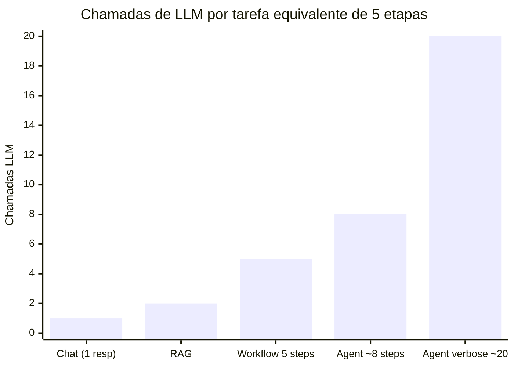
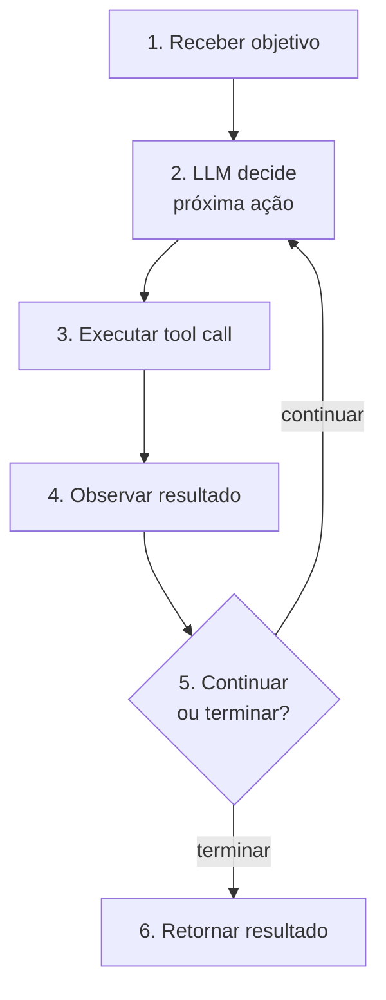
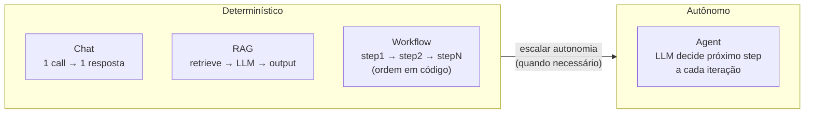

# O que é um agent

Às 3h da manhã, um pipeline de triagem de suporte ao cliente parou de responder — sem erro, sem log, sem stack trace. Quarenta minutos depois, a causa: o LLM retornou uma categoria que não estava no `if/elif` do passo seguinte, e o sistema silenciosamente travou em vez de escalar para atendimento humano. O produto chamava aquilo de "agent inteligente". No código, era uma sequência de cinco chamadas LLM onde **o programador tinha decidido cada passo de antemão** — a ordem, as condições de transição, o que fazer com cada resultado.

Nenhum agent estava presente para tomar uma decisão adaptativa. E é exatamente por isso que o sistema quebrou quando o mundo real trouxe uma entrada que o programador não previu.

Essa distinção não é filosófica. Ela tem consequências diretas no custo de manutenção, no blast radius de falhas, e na velocidade com que o sistema lida com o inesperado. Construir um workflow e chamá-lo de agent é o anti-pattern que esta nota existe para prevenir.

> [!abstract] TL;DR
> Um **AI agent** é um sistema que combina um [[Dicionário de IA#LLM (Large Language Model)|LLM]] (cérebro), um conjunto de **ferramentas** (mãos), e um **loop de execução** com autonomia de decisão. Dado um objetivo, o agent decide sozinho o que fazer em cada passo: qual tool chamar, com quais argumentos, quando pedir mais informação, quando terminar. Isso é o que distingue agent de chat, de pipeline RAG, e de workflow hardcoded. **Autonomia de decisão no loop é o que define um agent.**

## A definição operacional

```
Chat       = LLM(input) → output
RAG        = retrieve(input) → LLM(context+input) → output
Workflow   = step1 → step2 → step3 → ...           (ordem fixa)
Agent      = LLM decide próximo step iterativamente até terminar
```

A linha que separa: **quem decide a próxima ação?**

- Chat / RAG / Workflow: você decide (no código).
- Agent: o LLM decide (em runtime).



> Agents custam mais tokens por tarefa do que workflows equivalentes — o preço da autonomia. A decisão de usar agent deve ser justificada pelo valor da adaptabilidade dinâmica, não pelo fascínio técnico.

## Anatomia mínima



## Diferenciador chave: autonomia no loop

**Chat simples:** você manda 1 pergunta, recebe 1 resposta. Sem ferramentas, sem iteração.

**Prompt com RAG:** pipeline fixo. O sistema decide "buscar antes" e "responder depois". O LLM não decide o quê buscar.

**Workflow hardcoded:** sequência fixa de chamadas LLM. Programador desenhou a ordem.

**Agent:** dada a tarefa, o LLM decide a cada turno. Decisão iterativa, não-determinística.



```mermaid
quadrantChart
    title Autonomia vs Previsibilidade por padrão
    x-axis Baixa Autonomia --> Alta Autonomia
    y-axis Baixa Previsibilidade --> Alta Previsibilidade
    quadrant-1 Ideal para produção crítica
    quadrant-2 Evitar (risco sem controle)
    quadrant-3 Protótipos / exploração
    quadrant-4 Workflows bem definidos
    Chat: [0.1, 0.9]
    RAG: [0.2, 0.85]
    Workflow: [0.3, 0.95]
    Agent simples: [0.65, 0.55]
    Multi-agent: [0.9, 0.3]
```

## Quando NÃO usar agent

> [!warning] Anti-pattern: agent prematuro
> A maior parte das tarefas que parece "precisar de agent" funciona melhor como **workflow determinístico**. Anthropic: *"use workflows when you can, agents when you must"*.

| Tarefa | Padrão certo |
|---|---|
| Classificar tickets | LLM call simples |
| Resumir email | LLM call simples |
| Buscar e responder Q&A | RAG pipeline |
| Multi-step com ordem previsível | Workflow |
| Multi-step **com decisões dinâmicas** | Agent |

> [!warning] Chamar de "agent" não elimina a fragilidade
> O incidente do início desta nota — o pipeline de triagem que travou às 3h — não era um agent, mas o rótulo do produto dizia que era. Batizar um workflow hardcoded de "agent inteligente" não muda seu comportamento em runtime: a estrutura continua sendo `if/elif` fixo, sem capacidade de lidar com o inesperado. O problema não é o nome — é achar que o nome resolveu o design. Só existe autonomia real se o LLM efetivamente decide o próximo passo; se não decide, é workflow com marketing de agent.

## Quando usar agent

Sinais:

- **Decisão depende de resultados intermediários**
- **Espaço de busca aberto** (research, debugging exploratório)
- **Tarefa é open-ended**
- **Sub-tarefas variáveis** dependendo do contexto

Exemplos: research assistant, coding agent (Claude Code, Cursor), debugging agent, customer support com escalação.

## O que diferencia um senior em agents

> [!tip]
> 1. Sabe quando NÃO usar agent
> 2. Desenha tools como APIs de verdade: descrições claras, tipos, erros úteis, sem sobreposição
> 3. Sempre define `max_steps` e [[Dicionário de IA#Guardrail|guardrails]]
> 4. Trata ações destrutivas com human-in-the-loop
> 5. Instrumenta tudo: cada [[Dicionário de IA#tool call|tool call]], input, output, latência, custo
> 6. Entende que agents falham de formas novas
> 7. Decompõe em [[Dicionário de IA#subagent|sub-agents]] quando a tarefa é complexa
> 8. Mede resultado, não processo
> 9. Pratica [[Dicionário de IA#prompt injection|prompt injection]] defense
> 10. Tem evaluation de agent, não só de LLM

> [!warning] `max_steps` sem limite é fatura em aberto, não guardrail
> Um agent sem teto de iterações não é "mais autônomo" — é um loop que paga a cada volta. Se o LLM entra num ciclo de tentativa-erro (tool falha, agent tenta de novo, falha de novo, tenta outra abordagem), cada volta é uma chamada LLM completa, com o histórico inteiro da conversa recomputado no contexto. Sem `max_steps`, um bug de lógica trivial — uma tool que devolve erro genérico, um objetivo mal especificado — vira uma fatura de milhares de chamadas antes que alguém perceba. Definir `max_steps` não é detalhe de implementação: é o guardrail mínimo entre "agent autônomo" e "agent que queima orçamento sozinho".

## A pergunta de teste

> *"Esse problema requer que o LLM decida o próximo step em runtime, ou eu consigo escrever a ordem dos steps em código?"*

Se você consegue escrever em código → workflow.
Se não consegue → talvez agent.

## Como explicar em inglês

An AI agent is a system where an LLM makes decisions autonomously at runtime — choosing which tool to call, with what arguments, and whether to continue or stop. The key differentiator from chatbots, RAG pipelines, and hardcoded workflows is *where decision-making lives*: in a workflow, the programmer encodes every transition in code; in an agent, the model decides the next step given intermediate results. The canonical structure is a while-loop — the LLM picks an action, the harness executes it, the result comes back as an observation, and the model decides what to do next. This non-deterministic, adaptive execution is powerful for open-ended tasks but comes with real costs: unpredictability, harder debugging, and higher token spend per request. The senior judgment call in agent design isn't "how do I build the loop" — it's recognizing when a deterministic workflow would have been cheaper, faster, and more reliable.

| Português | English |
|---|---|
| agente de IA | AI agent |
| chamada de ferramenta | tool call |
| loop de execução | execution loop / agent loop |
| autonomia de decisão | decision autonomy |
| fluxo determinístico | deterministic workflow |
| resultado intermediário | intermediate result |
| espaço de busca aberto | open-ended search space |
| human-in-the-loop | human-in-the-loop |
| guardrail | guardrail |
| decomposição de tarefas | task decomposition |
| agente prematuro (anti-pattern) | premature agent |
| passo de execução | execution step |

## O que vem a seguir

Até aqui, a definição foi de fora para dentro: o que separa agent de chat, de RAG, de workflow — autonomia de decisão no loop. Mas "o LLM decide o próximo passo" ainda é uma caixa-preta. Como, exatamente, o LLM decide? Que forma tem esse loop no código? Onde entra o *raciocínio* — o LLM parando pra "pensar" antes de agir — e onde entra a *execução* — a chamada de fato da tool?

[[02 - O loop ReAct e native tool use]] abre essa caixa: o padrão ReAct (Reason + Act) que formalizou o ciclo pensar → agir → observar, e como as APIs modernas (tool calling nativo) implementam esse mesmo ciclo sem exigir que o LLM narre seu raciocínio em texto livre a cada passo. Sem esse mecanismo concreto, "autonomia de decisão" continua sendo um conceito — com ele, vira algo que se implementa, debuga e instrumenta.

## Ver mais

- **Anthropic — *Building Effective Agents*** (2024): O guia oficial que estabelece a distinção entre workflows e agents com exemplos de produção reais. Cobre os cinco padrões de workflow canônicos, os critérios para escalar para agent, e as armadilhas de implementação mais custosas. Ponto de partida obrigatório antes de qualquer arquitetura.
- **OpenAI — *A Practical Guide to Building Agents*** (2025): Perspectiva prática e provider-agnóstica sobre arquitetura de agents — escolha de modelo, design de tools, orquestração e avaliação. Bom complemento ao guia Anthropic por abordar pattern selection com exemplos de múltiplas verticais (suporte, pesquisa, coding).
- **Lilian Weng — *LLM Powered Autonomous Agents*** (lilianweng.github.io, 2023): O survey mais citado sobre anatomia de agents — planning, memory e tool use como três dimensões ortogonais. Base teórica para entender os componentes antes de estudar frameworks modernos ou debater arquitetura com colegas.

## Veja também

- [[02 - O loop ReAct e native tool use]]
- [[03 - Tool design — princípios e categorias]]
- [[08 - Patterns comuns de agents]]
- [[Agentes de Codificação]]
- [[Anatomia dos LLMs|01 - O que é um LLM]]

## Referências

- **Anthropic** — [*Building Effective Agents*](https://www.anthropic.com/research/building-effective-agents) (2024)
- **Anthropic** — *Effective Context Engineering for AI Agents* (2025)
- **OpenAI** — [*A Practical Guide to Building Agents*](https://openai.com/business/guides-and-resources/a-practical-guide-to-building-ai-agents/) (2025)
- **Yao et al.** — [*ReAct: Reasoning and Acting*](https://arxiv.org/abs/2210.03629) (arxiv 2022)
- **Lilian Weng** — [*LLM Powered Autonomous Agents*](https://lilianweng.github.io/posts/2023-06-23-agent/) (2023)
