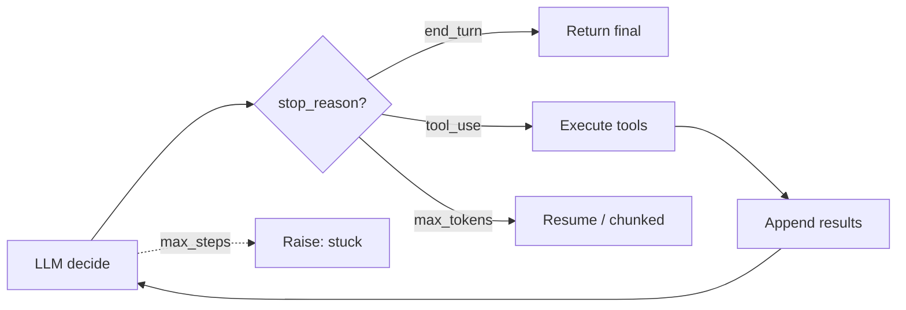
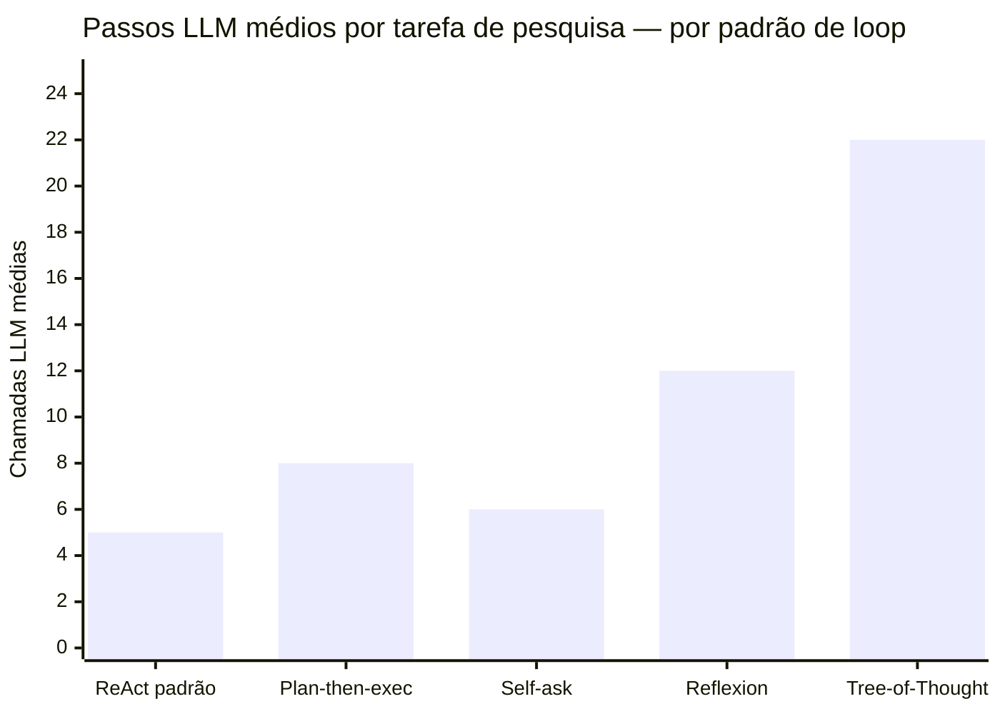
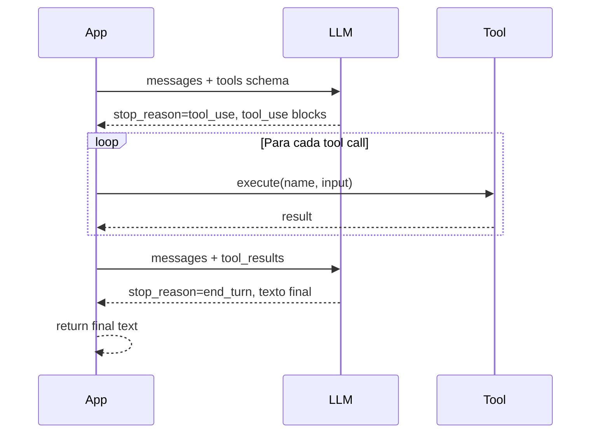

# O loop ReAct e native tool use

O agent estava em produção há dois dias quando o monitoramento começou a acusar timeout em 100% das requisições acima de um certo threshold de complexidade. Nenhuma exception, nenhum erro de tool — o processo simplesmente nunca terminava. Reproduzindo localmente, o problema ficou visível no handler do while-loop:

```python
# BUG: sem branch para stop_reason == "end_turn"
while True:
    response = client.messages.create(...)
    if response.stop_reason == "tool_use":
        # executa tools, alimenta resultado, continua o loop
        ...
    # nenhum else/elif aqui — quando o LLM termina normalmente
    # (end_turn), o loop simplesmente itera de novo e espera
    # uma tool call que nunca vai chegar
```

O handler verificava `stop_reason == "tool_use"` para saber se devia continuar, mas não tinha nenhum branch para `stop_reason == "end_turn"`. Toda vez que o LLM terminava normalmente, o loop não saía — ficava esperando uma próxima tool call que nunca viria. O fix é trivial uma vez visto — tratar `end_turn` como condição de saída explícita, exatamente como no `run_agent` da próxima seção:

```python
# FIX: end_turn sai do loop
if response.stop_reason == "end_turn":
    return final_answer
```

O bug foi escrito por alguém que entendia ReAct como conceito mas não tinha mapeado como ele se traduz para a API moderna. No paper original de 2022, o loop era textual — você lia "Final Answer:" no output e saía. Em 2026, com native tool use, o contrato é diferente: é o `stop_reason` que governa a saída, não o conteúdo do texto. Confundir os dois modelos custa um incidente de produção.

Esta nota cobre os dois contratos — o mental model do ReAct e a mecânica real da API — e os pontos onde eles divergem de formas que ficam invisíveis até virarem bug.

> [!abstract] TL;DR
> **[[Dicionário de IA#ReAct|ReAct]]** (Reasoning + Acting), introduzido por Yao et al. em 2022, virou o padrão mental de agents. Combina raciocínio (*"thoughts"*) com ações (tool calls) e observações em loop. Em 2026, ninguém mais formata ReAct textualmente — LLMs modernos têm **[[Dicionário de IA#tool use|native tool use]]** (Anthropic, OpenAI, Google), e o loop é gerenciado pelo SDK. **Mas o mental model é o mesmo.** Um agent é um while loop que termina quando o LLM diz "acabei" (`end_turn`) ou bate `max_steps`.

## ReAct — o padrão original

```text
Objective: "Find the 5 most recent papers about context engineering and summarize them."

Thought: I need to search for recent papers on this topic.
Action: web_search(query="context engineering LLM agents 2025", limit=10)
Observation: [lista de 10 resultados]

Thought: I have candidates. I need to read the top 5.
Action: read_url(url="https://arxiv.org/abs/2506.12345")
Observation: [conteúdo do paper 1]

... (repete para papers 2-5)

Thought: I have enough. Let me synthesize.
Final answer: [sumário estruturado dos 5 papers]
```

Três elementos sempre presentes:

| Elemento | Função |
|---|---|
| **Thought** | Raciocínio sobre próximo passo |
| **Action** | Tool call concreta |
| **Observation** | Resultado da tool, alimentado de volta |

## Native tool use — como funciona em 2026

LLMs modernos não pedem ReAct textual — eles têm **tool use nativo**, com schema estruturado.

```python
from anthropic import Anthropic

client = Anthropic()

tools = [
    {
        "name": "web_search",
        "description": "Search the web for recent articles and pages",
        "input_schema": {
            "type": "object",
            "properties": {
                "query": {"type": "string"},
                "limit": {"type": "integer", "default": 10}
            },
            "required": ["query"]
        }
    }
]

def run_agent(objective: str, max_steps: int = 15):
    messages = [{"role": "user", "content": objective}]

    for step in range(max_steps):
        response = client.messages.create(
            model="claude-sonnet-4-6",
            max_tokens=4096,
            tools=tools,
            messages=messages
        )
        messages.append({"role": "assistant", "content": response.content})

        if response.stop_reason == "end_turn":
            final = next((b.text for b in response.content if b.type == "text"), "")
            return final

        tool_results = []
        for block in response.content:
            if block.type == "tool_use":
                result = execute_tool(block.name, block.input)
                tool_results.append({
                    "type": "tool_result",
                    "tool_use_id": block.id,
                    "content": result
                })
        messages.append({"role": "user", "content": tool_results})

    raise RuntimeError("Max steps exceeded")
```

Esse é o **"hello world" de um agent**. Todos os frameworks são variações disso.

## Os 4 stop reasons que importam

| `stop_reason` | Significado | O que fazer |
|---|---|---|
| `end_turn` | Agent terminou — tem resposta final | Sair do loop |
| `tool_use` | Agent quer chamar tool | Executar + alimentar resultado |
| `max_tokens` | Geração foi cortada | Aumentar `max_tokens` ou re-prompt |
| `stop_sequence` | Bateu em sequência de parada | Tratar conforme caso |

## Padrões dentro do loop

### 1. Tool use paralelo

LLMs modernos podem retornar **múltiplas tool calls** num mesmo turno. Vantagem: latência menor (executar em paralelo no seu código).

### 2. Chain-of-thought entrelaçado

Em modelos com **extended thinking** (Claude 4+), o [[Dicionário de IA#Chain-of-Thought (CoT)|reasoning]] fica em block separado, **invisível** ao próximo turno mas usado pelo modelo para decisão.

### 3. Self-correction

Quando tool retorna erro, agent vê e tenta de novo:

```
Action: read_url("https://fake.com/missing")
Observation: 404 not found
Thought: URL deu 404. Vou tentar outra fonte.
Action: read_url("https://other.com/article")
```

Padrão poderoso. Requer descrições de erro claras (ver [[03 - Tool design — princípios e categorias]]).

## O loop visualizado em produção



## Pitfalls do loop

> [!warning] 1. `max_steps` ausente
> Agent decide errado, fica em loop, queima budget. **Sempre** defina `max_steps`. Padrão: 15-30.

> [!warning] 2. Tool result silencioso
> Tool retorna `None`, agent não sabe que falhou, repete. **Fix:** sempre retorne mensagem informativa.

> [!warning] 3. Output gigante de tool
> Tool retorna 50K tokens. Atenção dilui ([[Context Engineering|03 - Context rot e atenção diluída]]). **Fix:** truncate, paginar, ou retornar só relevante.

> [!warning] 4. Loop sem progresso
> Agent chama mesma tool com mesmos args repetidamente. **Fix:** detectar duplicação, abortar, injetar prompt "tente algo diferente".

## Variantes além de ReAct

| Padrão | Diferença |
|---|---|
| **Plan-then-execute** | Plano completo primeiro, depois executa. Menos flexível, mais previsível |
| **Self-ask** | Decompõe pergunta em sub-perguntas, responde cada uma |
| **Reflexion** | Reflete sobre falhas antes de tentar de novo (custo alto) |
| **Tree-of-Thought** | Explora múltiplos caminhos, escolhe melhor (custo muito alto) |

ReAct continua sendo o **default certo** na maioria dos casos.



> ReAct é o mais eficiente para a maioria dos casos. Reflexion e Tree-of-Thought entregam qualidade superior em tarefas abertas, mas o custo em tokens pode ser 4–5× o de ReAct simples. Escolha pelo custo de erro, não pela elegância do padrão.



## Do pattern à camada: loop engineering (2026)

Tudo acima descreve o loop como **um padrão que você usa**: escolhe ReAct, monta o `while`, define `max_steps`, segue a vida. Em 2026 o vocabulário mudou. O termo que circula é **loop engineering** — o reconhecimento de que esse `while` deixou de ser detalhe de implementação e virou um **artefato que você projeta** deliberadamente.

Qual a diferença na prática? "Usar ReAct" responde *o que o agent faz a cada passo*. Loop engineering responde *quem governa o passo seguinte*: as condições de parada (não só `end_turn`/`max_steps`, mas critérios de "bom o suficiente"), a detecção de loop infinito, a política de retry escalonado, e — crucialmente — **onde entra o humano**. O ponto de aprovação (HITL) não é uma feature solta; é uma decisão de design do loop, igual ao `max_steps`.

> [!info] Onde os pitfalls viram disciplina
> Repare que os quatro pitfalls da seção anterior (max_steps ausente, tool result silencioso, output gigante, loop sem progresso) são exatamente o que loop engineering nomeia como objeto de projeto. O que antes era "lista de coisas pra não esquecer" agora tem nome: é a engenharia do control loop.

Esse loop é uma das seis dimensões do design de [[03-Dominios/Tecnologia/IA/Anatomia de Agents/11 - Harness engineering — a terceira camada|harness engineering]]. Um preprint recente — *Harness Engineering for Language Agents* — propõe a decomposição **CAR (Control / Agency / Runtime)**, e é o eixo **Runtime** que captura precisamente a parte do loop que **um diagrama ReAct ingênuo não mostra**: como o estado é carregado adiante de passo a passo e como as falhas são tratadas ao longo do tempo. O diagrama Mermaid lá em cima desenha o fluxo feliz; o Runtime é o que acontece quando a tool morre no passo 7 e você precisa decidir se reidrata o contexto, faz backoff ou aborta.

> [!caution] Maturidade das fontes
> Tanto o CAR quanto os NLAHs abaixo vêm de **preprints não revisados por pares** (início de 2026). São vocabulário emergente, úteis pra pensar — não cânone estabelecido. Trate como lentes, não como lei.

Há ainda uma forma de **externalizar** esse design: os **NLAHs (Natural-Language Agent Harnesses)**. A ideia é escrever o comportamento do harness — fronteiras de papel, semântica de estado, tratamento de falha — em **linguagem natural editável em texto puro**, em vez de cravá-lo em código. A promessa é baixar a barreira de adoção: você ajusta a política do loop editando um prompt, não refatorando um `for`. É uma abordagem emergente, ainda em formação — sem evidência de que iguale código nativo em performance.

> [!summary] Em uma frase
> ReAct te dá o passo; loop engineering te dá a camada que governa a sequência de passos — e o Runtime do CAR é o nome pra parte dela que nenhum diagrama de loop desenha.

## Como explicar em inglês

The ReAct pattern — Reasoning + Acting — is the foundational mental model for AI agents. At each step, the model produces a thought (reasoning about what to do next), selects an action (a tool call), and receives an observation (the tool result), then repeats. In modern LLM APIs this is implemented via native tool use: you define tool schemas, the model returns structured tool-call blocks rather than free text, and your code executes them and feeds results back as tool-result messages. The loop exits when `stop_reason` is `end_turn` (the model is done) or when `max_steps` is reached. The practical discipline around this loop — stop conditions beyond `max_steps`, stuck-loop detection, retry escalation, and where human approval gates belong — is what "loop engineering" names. ReAct gives you the step; loop engineering gives you the control layer that governs the sequence of steps.

| Português | English |
|---|---|
| loop do agent | agent loop |
| pensamento / raciocínio | thought / reasoning |
| ação | action |
| observação | observation |
| uso nativo de ferramentas | native tool use |
| schema de ferramenta | tool schema |
| razão de parada | stop reason |
| turno de execução | execution turn |
| passos máximos | max steps |
| engenharia de loop | loop engineering |
| auto-correção | self-correction |
| uso paralelo de ferramentas | parallel tool use |

## Ver mais

- **Yao et al. — *ReAct: Synergizing Reasoning and Acting in Language Models*** (arxiv:2210.03629, 2022): O paper original que nomeou o padrão. Fundamental para entender o fundamento teórico antes de usar implementações modernas — especialmente a justificativa de por que intercalar raciocínio com ação melhora a qualidade versus chain-of-thought puro.
- **Anthropic — *Tool use documentation*** (docs.anthropic.com, 2026): Referência técnica canônica para implementar o loop com a API Claude — schemas de tools, parallel tool calls, handling de erros, streaming com tool use. Leitura obrigatória antes de qualquer implementação em produção.
- **Harness Engineering for Language Agents** (preprints.org:10.20944/preprints202603.1756, 2026): Formaliza o loop engineering como disciplina com a decomposição CAR (Control/Agency/Runtime). O eixo Runtime cobre exatamente o que o diagrama ReAct básico não mostra: como estado é carregado entre passos e como falhas são tratadas ao longo do tempo. *Preprint não revisado por pares — vocabulário emergente.*

## O que vem a seguir

Tudo nesta nota assume que o loop roda — o `while`, o `stop_reason`, os pitfalls. Mas o ritmo do loop (quantos passos, quanta observação por passo, quando ele trava) depende de algo que ainda não foi examinado: o **design de cada tool** que o agent chama. Um `read_url` que devolve 50K tokens crus força truncamento e paginação manual a cada passo; um `web_search` com schema mal descrito gera tool calls errados que o loop então precisa detectar e corrigir via self-correction. O loop reage ao design da tool — não o contrário. [[03 - Tool design — princípios e categorias]] cobre como projetar tools que fazem o loop ReAct rodar limpo em vez de compensar, passo a passo, decisões ruins tomadas na camada de baixo.

## Veja também

- [[01 - O que é um agent]]
- [[03 - Tool design — princípios e categorias]]
- [[05 - Planning — plan-then-execute, dynamic, hierarchical]]
- [[Anatomia dos LLMs|09 - APIs de LLM — anatomia de uma chamada]]
- [[Economia de Tokens|03 - Por que agentes gastam tanto]]

## Referências

- **Yao et al.** — *ReAct: Reasoning and Acting* (arxiv:2210.03629)
- **Schick et al.** — *Toolformer* (arxiv:2302.04761)
- **Anthropic** — *Tool use documentation* (2026)
- **OpenAI** — *Function calling guide* (2026)
- **Harness Engineering for Language Agents** — [preprints.org 10.20944/preprints202603.1756](https://doi.org/10.20944/preprints202603.1756) (2026). Decompõe o design de harness em CAR (Control/Agency/Runtime); o Runtime cobre carregamento de estado e tratamento de falhas ao longo do loop. *Preprint.*
- **Pan et al.** — *Natural-Language Agent Harnesses* — [arXiv:2603.25723](https://arxiv.org/abs/2603.25723) (2026). Comportamento do harness escrito em linguagem natural editável em texto puro, em vez de código hard-coded. *Preprint.*
