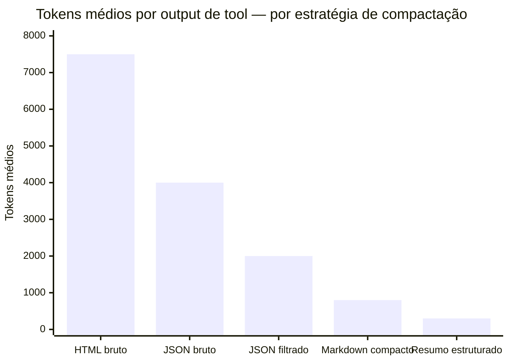
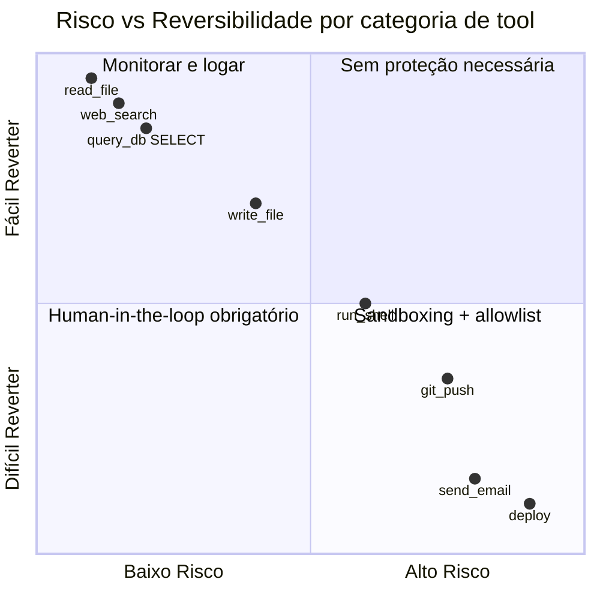
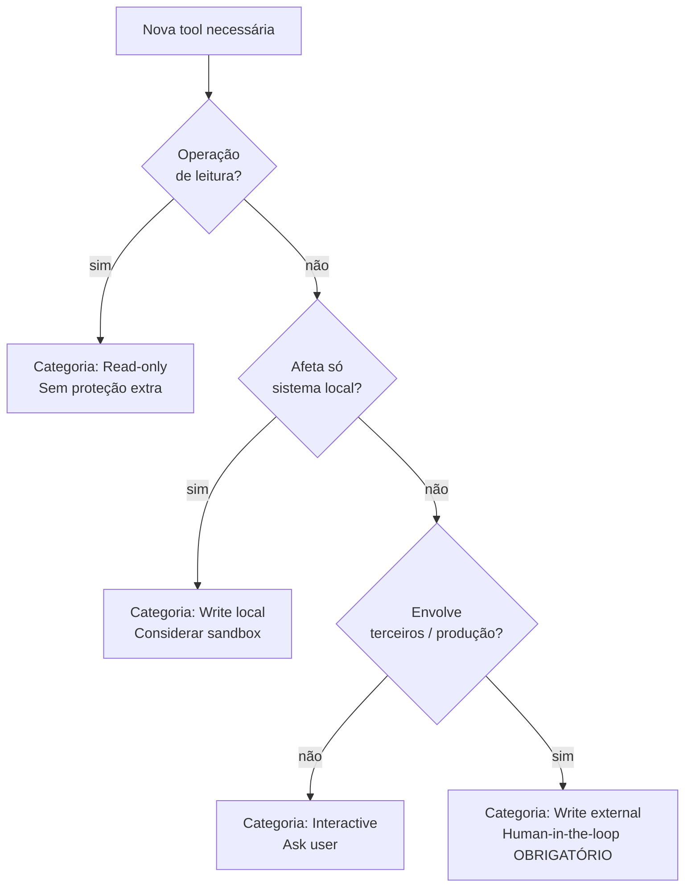

# Tool design — princípios e categorias

Em produção, o agent de suporte ao cliente errava na escolha de tool em quase metade dos casos de busca. `search_docs`, `search_faq` e `search_knowledge_base` — todas com descrição de uma linha, todas com escopos sobrepostos. O agent escolhia quase aleatoriamente. O resultado: respostas com conteúdo técnico entregue para usuário final pedindo FAQ básico, hallucinations quando a tool retornava contexto irrelevante, e retries que triplicaram o custo de tokens da sessão.

A correção levou quatro horas. Não foi refatorar o modelo, nem ajustar o system prompt, nem mudar o framework. Foi reescrever as descrições das tools: o quê cada uma faz, quando usar, o que retorna, e quando **não** usar. A taxa de seleção correta de tool subiu de 55% para 97%. Nenhuma outra mudança produziu ganho comparável.

Tool design é a alavanca mais subestimada em agent engineering. O modelo lê a descrição para decidir quando chamar. Descrição ambígua = decisão errada = degradação silenciosa de todo o restante do sistema.

> [!abstract] TL;DR
> Tools são o que transforma um [[Dicionário de IA#LLM (Large Language Model)|LLM]] em agent. **Tool design é 60% do trabalho** — descrição confusa = agent confuso. Princípios: nome claro e único, descrição como API docstring, inputs tipados com schema, outputs compactos e estruturados, erros informativos, sem sobreposição, idempotência quando possível. Categorias: read-only, write local, write external, interactive, meta. Tools destrutivas SEMPRE têm human-in-the-loop ou sandboxing.

## A regra fundamental

> *"A tool without a clear description is worse than no tool at all."*

O modelo lê **a descrição** para decidir quando usar. Se descrição é ambígua, o agent escolhe errado — e você não sabe se o problema é o modelo ou sua tool.

## Os 7 princípios

### 1. Nome claro e único

```python
# Errado
tools = ["search", "find", "query"]

# Certo
tools = ["search_docs", "search_web", "query_database"]
```

Nome diz **o quê** + **escopo**. Sem ambiguidade.

### 2. Descrição como API docstring

```python
# Certo
{
    "name": "search_docs",
    "description": (
        "Search internal documentation for relevant pages. "
        "Use when user asks 'how do I X?' or wants to find existing docs. "
        "Returns top 10 results with title, url, and snippet. "
        "Do NOT use for searching code (use search_code instead)."
    )
}
```

Cobrir: **o que faz, quando usar, o que retorna, quando NÃO usar**.

### 3. Inputs tipados com schema completo

```json
{
    "input_schema": {
        "type": "object",
        "properties": {
            "query": {"type": "string", "description": "Search query"},
            "limit": {"type": "integer", "minimum": 1, "maximum": 50, "default": 10}
        },
        "required": ["query"]
    }
}
```

Cada parâmetro com **tipo, descrição, default**. Schema validation pega erros antes de tool executar.

### 4. Outputs compactos e estruturados

JSON estruturado quando possível. Truncate snippets. Agent não precisa do HTML cru — só do que importa pra decidir.

### 5. Erros informativos

```python
# Certo
return f"ERROR: invalid date format. Got 'date', expected ISO 8601 (YYYY-MM-DD)"
```

Erro **informativo** vira feedback que o agent usa para auto-correção.

### 6. Sem sobreposição

`search_docs / search_articles / search_knowledge / search_kb` → agent confuso. **Consolide.**

### 7. Idempotência quando possível

`get_user(id)` é idempotente. `create_user(name)` não é — chamar 2x cria 2 usuários. Em tools não-idempotentes: documente, considere idempotency key.

## As 5 categorias de tools

### Read-only (segura)

| Exemplo | Uso |
|---|---|
| `web_search` | Buscar online |
| `read_file` | Ler arquivo |
| `query_db` | SELECT no DB |
| `list_directory` | Listar arquivos |

### Write local (média)

| Exemplo | Uso |
|---|---|
| `write_file` | Salvar arquivo |
| `edit_file` | Modificar arquivo |
| `run_shell_command` | Comando local |
| `git_commit` | Commit local |

> [!warning] `run_shell_command` é a tool mais perigosa
> Sempre com **allowlist** ou **sandbox**. Ver [[Segurança e Guardrails|06 - Permissões e sandboxing]].

### Write external (alta)

| Exemplo | Cuidado |
|---|---|
| `send_email` | Email enviado, irrecuperável |
| `git_push` | Histórico público alterado |
| `deploy` | Produção tocada |

**Sempre** human-in-the-loop ou confirmação explícita.

### Interactive

| Exemplo | Uso |
|---|---|
| `ask_user` | Pergunta de esclarecimento |
| `request_confirmation` | "Tem certeza?" |
| `wait_for_approval` | Pausa até humano aprovar |

### Meta (introspecção)

| Exemplo | Uso |
|---|---|
| `get_schema` | Schema de DB |
| `record_finding` | Salvar finding com fonte |

## Tools destrutivas — o protocolo

> [!danger] Sempre combine 2+ destas:
> 1. **Human-in-the-loop** — confirmação síncrona
> 2. **Sandbox** — Docker, gVisor
> 3. **Allowlist** — só certos targets
> 4. **Audit log** — toda chamada gravada
> 5. **Reversibilidade** — undo possível

Tools como `rm -rf`, `DROP TABLE`, `git push --force` **nunca** sem essas defesas.

## Compactação de tool outputs

Padrão essencial para [[Economia de Tokens|07 - Compressão de tool definitions|reduzir contexto]]: truncate, paginar, ou retornar só o que importa.

## Anti-patterns

- **Descrição genérica** — agent não sabe quando usar
- **Output bruto** (HTML, JSON gigante) — context rot
- **Erros como `"Error"`** — agent não sabe corrigir
- **Tools redundantes** — agent fica confuso
- **Tools destrutivas sem proteção** — incidente esperando

## Métricas

| Métrica | Alvo |
|---|---|
| **Tools por agent** | 5-15 (acima → confusão) |
| **Tokens médios em output de tool** | <2K |
| **% [[Dicionário de IA#tool call\|tool calls]] com erro corrigido pelo agent** | >70% |
| **% tool calls que precisaram retry** | <10% |



> Passar HTML bruto de uma página web para o agent consome ~25× mais tokens que um resumo estruturado do mesmo conteúdo. O agent não precisa do HTML — precisa do que importa para decidir. Compactar outputs de tool é um dos maiores redutores de custo em agent engineering.





## Como explicar em inglês

Tool design is the layer of agent engineering most directly responsible for task success rate. An LLM picks a tool by reading its name and description — ambiguous or overlapping descriptions cause the model to select incorrectly, leading to wrong results or expensive retries. Each tool should have a single, unambiguous name that includes both what it does and its scope (`search_web` vs `search_docs` vs `search_codebase`), a description that covers what it does, when to use it, what it returns, and when NOT to use it, fully-typed input schemas with descriptions and defaults for every parameter, and compact structured outputs — raw HTML or unfiltered JSON burns context and dilutes attention. Tool outputs should contain only what the model needs to decide the next step. Beyond design principles, categorizing tools by risk — read-only, write-local, write-external, interactive, meta — determines what safety controls are required before the agent can call them.

| Português | English |
|---|---|
| ferramenta (do agent) | tool |
| chamada de ferramenta | tool call |
| schema de entrada | input schema |
| output de ferramenta | tool output |
| sobreposição de ferramentas | tool overlap |
| descrição da ferramenta | tool description |
| idempotência | idempotency |
| ferramenta destrutiva | destructive tool |
| human-in-the-loop | human-in-the-loop |
| auditoria de chamadas | tool call audit log |
| allowlist | allowlist |
| compactação de output | output compaction |

## Ver mais

- **Anthropic — *Tool use best practices*** (docs.anthropic.com, 2026): Documentação canônica sobre como estruturar tools para a API Claude — input schemas, parallel tool use, streaming, e boas práticas de descrição. Referência técnica antes de qualquer implementação.
- **Anthropic — *Building Effective Agents*** (2024): A seção sobre tool design cobre os padrões de description engineering com exemplos concretos e o princípio "a tool without a clear description is worse than no tool". Fonte das métricas de 5-15 tools por agent.
- **OpenAI — *Function calling guide*** (platform.openai.com, 2026): Perspectiva provider-agnóstica sobre function calling — schemas, parallel calls, error handling. Útil para entender o design de tool em contexto multi-provider.

## Veja também

- [[02 - O loop ReAct e native tool use]]
- [[06 - Multi-agent — orchestrator e sub-agents]]
- [[Economia de Tokens|07 - Compressão de tool definitions]]
- [[Segurança e Guardrails|06 - Permissões e sandboxing]]
- [[Agentes de Codificação|15 - MCP — o protocolo universal]]

## Referências

- **Anthropic** — *Tool use best practices* (2026)
- **Anthropic** — *Building Effective Agents* (2024)
- **OpenAI** — *Function calling guide* (2026)
