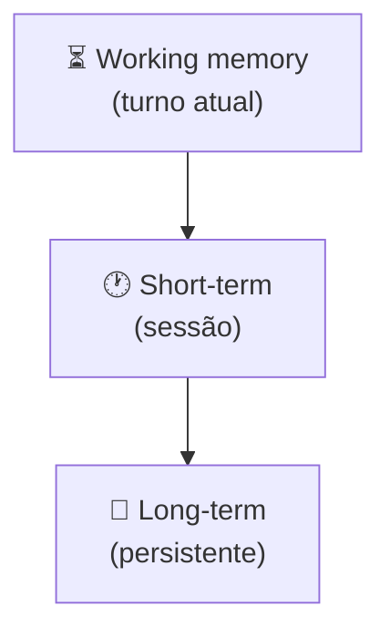
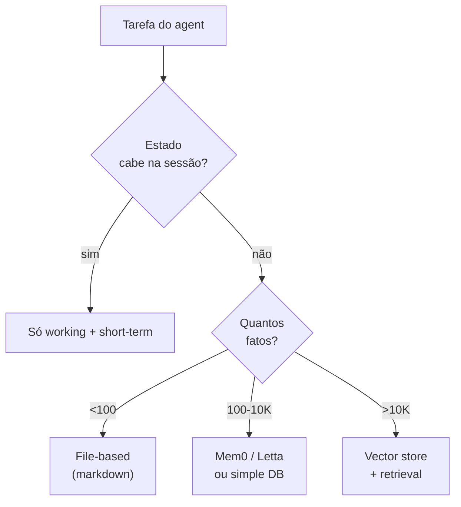
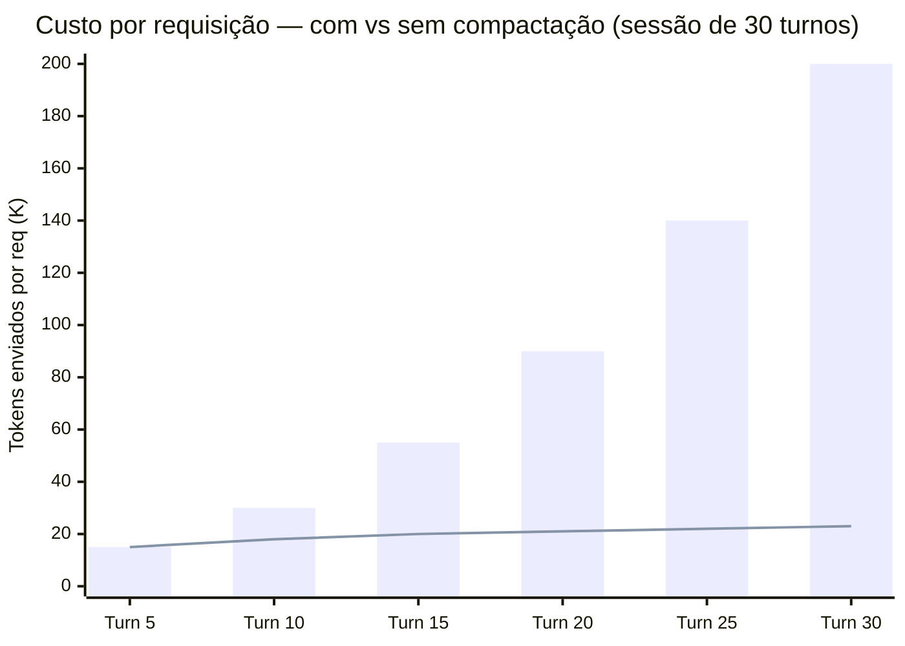
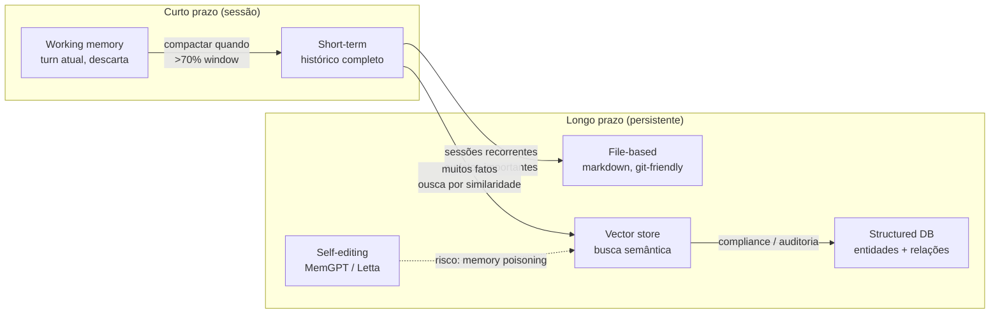

# Memory em agents

Três horas dentro de uma sessão de debugging assistida por agent, o sistema começou a contradizer a si mesmo. Recomendou adicionar um índice a uma coluna que tinha rejeitado 40 passos atrás por cardinalidade baixa. Releu um arquivo de configuração que já havia analisado. Propôs um fix para um bug que ele mesmo tinha marcado como resolvido na hora 2.

Não era o modelo piorando ao longo do tempo. Era o contexto: 180K tokens de histórico carregados integralmente em cada requisição. A atenção do modelo se dissolvia no oceano de turnos anteriores — call stack do passo 12, observação do passo 27, raciocínio do passo 43 — todos presentes, nenhum com peso suficiente para ser confiável. Sem compactação, cada requisição ficava mais cara e menos útil ao mesmo tempo.

Esse é o problema que o design de memória em agents existe para resolver. Memory não é uma feature opcional — é o que separa um agent que funciona por 50 turnos de um que para de ser confiável no turno 8. A questão não é "preciso de long-term memory?", mas "o que precisa sobreviver ao turno atual, e em qual formato?"

> [!abstract] TL;DR
> Agents precisam **lembrar** entre passos. Três tipos coexistem: **short-term** ([[Dicionário de IA#working memory|working memory]] carregada no prompt, limitada pela context window, descarta ao terminar), **long-term** (persistente entre sessões, em arquivo/DB/[[Dicionário de IA#vector store|vector store]]), e **structured state** (NOTES.md, TODO.md). Compactação é essencial — context cresce, atenção dilui ([[Context Engineering|03 - Context rot e atenção diluída]]). Para deep dive em sistemas avançados (MemGPT, Letta, Mem0, Zep), ver a trilha [[Memória de Agentes]].

## Os 3 tipos



| Tipo | Onde mora | Vida útil | Tamanho |
|---|---|---|---|
| **Working memory** | Prompt do turno | Segundos | Ilimitado dentro da janela |
| **Short-term** | Histórico da sessão | Horas | Cresce — precisa compactar |
| **Long-term** | DB, files, vector store | Dias a anos | Ilimitado |

## Working memory — o scratchpad

Espaço de raciocínio dentro do prompt do turno atual. Em modelos com extended thinking (Claude 4+, o1), fica em block separado.

**Características:**
- Descartado após o turno (em models com thinking)
- Não consome tokens do output (em modelos modernos)
- Permite raciocínio antes da ação

## Short-term memory — o histórico

O histórico da conversa atual. Cresce a cada turno.

**Problema clássico:** sessão de 50 turnos vira contexto de 200K tokens. [[Context Engineering|03 - Context rot e atenção diluída|Atenção dilui]], custo explode.

**Mitigações:**
- Compactação automática ([[Context Engineering|07 - Compressão e pruning de informação]])
- Sliding window (manter só últimos N turnos)
- Sumarização periódica
- Sub-agents com contexto isolado ([[06 - Multi-agent — orchestrator e sub-agents]])

## Long-term memory — o que persiste

Info que sobrevive entre sessões em [[Dicionário de IA#long-term memory|long-term memory]]. Várias estratégias:

### File-based (markdown)

```
project/
└── .agent-memory/
    ├── NOTES.md         # observações e decisões
    ├── TODO.md          # próximos passos
    ├── DECISIONS.md     # log de ADRs
    └── facts/
```

**Prós:** simples, inspecionável, git-friendly, agent pode editar como qualquer arquivo
**Contras:** não escala para milhares de fatos
**Use quando:** projeto solo ou time pequeno, codebase ou vault Obsidian

Detalhamento em [[Context Engineering|10 - Structured state tracking]].

### Vector store

Embeddings de memórias passadas, recuperadas por similaridade semântica.

**Prós:** escalável, busca natural por significado
**Contras:** menos controlável, pode trazer noise
**Tools:** Pinecone, Weaviate, Qdrant, Mem0/Zep

### Structured DB

Tabelas com entidades, relações, fatos. Máxima estrutura.

**Use quando:** compliance pesado, auditoria total

### Self-editing memory (MemGPT, Letta)

LLM tem ferramentas para escrever, ler, podar a própria memória durante reasoning.

Deep dive em [[Context Engineering|08 - Memória agentica — self-editing memory]].

## Working memory compaction — o pattern essencial

Quando histórico passa do limite, **resuma e substitua**. Claude Code faz isso automaticamente. Em código próprio, dispare quando tokens > 70% da janela.

## Decisão: que memória usar?



## Sinais que precisa de long-term memory

- Mesmo usuário interage múltiplas vezes
- Agent deveria "lembrar" preferências
- Decisões anteriores precisam ser referenciadas
- Histórico cumulativo é diferencial competitivo

## Sinais que NÃO precisa

- Cada sessão é stateless (chatbot anônimo)
- Aplicação é one-shot
- Compliance proíbe retenção
- Time pequeno sem orçamento para manter memória

## Anti-patterns

> [!warning] Achatar tudo em short-term
> Context rot inevitável.

> [!warning] Long-term sem TTL
> Fato de 2024 ainda servido em 2026.

> [!warning] Sem compactação
> Sessão de 8h envia 800K tokens em cada turno.

> [!warning] Vector store para tudo
> Muito barulho; markdown basta para a maioria.

> [!warning] Self-editing memory sem governance
> Memory poisoning, PII leak.

## Para deep dive

A trilha [[Memória de Agentes]] tem 24 notas dedicadas: taxonomia ([[Dicionário de IA#episodic memory|episódica]], [[Dicionário de IA#semantic memory|semântica]], procedural), implementações (OpenKB, MemGPT/Letta, Mem0, Zep, Graphiti, Generative Agents Stanford), comparativo crítico, guia de implementação.



> A barra mostra o custo sem compactação (crescimento linear). A linha mostra com compactação ativa a cada ~5 turnos — o custo se estabiliza porque o histórico é resumido em vez de acumulado. Em sessions longas, a diferença é de 5–10× em tokens e a qualidade de resposta é melhor, não pior.



## Como explicar em inglês

Memory in agents refers to the mechanisms by which a system retains and retrieves information across turns and sessions. Working memory is the current-turn scratch space — typically the model's extended thinking block, which doesn't persist. Short-term memory is the conversation history appended to each request; it grows linearly and is the most common source of runaway costs in long sessions. Without compaction — summarizing and replacing old turns — every request after the first 20 or 30 turns sends the full accumulated history, making each call simultaneously more expensive and less reliable as attention dilutes. Long-term memory encompasses anything that survives session boundaries: markdown files in the agent's workspace (simple, inspectable, git-friendly), vector stores (semantic retrieval at scale), structured databases (entities and relations for compliance-heavy use cases), and self-editing memory systems like MemGPT/Letta where the model itself manages read/write/prune operations on its own memory store.

| Português | English |
|---|---|
| memória de trabalho | working memory |
| memória de curto prazo | short-term memory |
| memória de longo prazo | long-term memory |
| janela de contexto | context window |
| compactação de contexto | context compaction / summarization |
| armazenamento vetorial | vector store |
| memória episódica | episodic memory |
| memória semântica | semantic memory |
| estado estruturado | structured state |
| recuperação por similaridade | semantic retrieval |
| diluição de atenção | attention dilution / context rot |
| memória auto-editável | self-editing memory |

## Ver mais

- **Packer et al. — *MemGPT: Towards LLMs as Operating Systems*** ([arxiv:2310.08560](https://arxiv.org/abs/2310.08560), 2023): O paper que introduziu a ideia de memory management auto-editável — o LLM decide o que mover entre working memory e long-term storage. Base teórica para entender sistemas como Letta.
- **Anthropic — *Effective Context Engineering for AI Agents*** (2025, URL a confirmar): Cobre compaction strategies, structured state tracking, e como projetar sistemas de memória que escalam com sessões longas. Referência prática diretamente aplicável.
- **Lilian Weng — *LLM Powered Autonomous Agents*** ([lilianweng.github.io](https://lilianweng.github.io/posts/2023-06-23-agent/), 2023): A seção de Memory ainda é a melhor introdução concisa à taxonomia completa: sensory, short-term, long-term — com exemplos de implementação de cada tipo.

## O que vem a seguir

Memory resolve a pergunta "o que o agent lembra?" — qual fato sobrevive ao turno atual, em qual formato, por quanto tempo. Mas lembrar não é agir: um agent pode ter o histórico perfeitamente compactado e a memória de longo prazo bem estruturada e ainda assim travar decidindo o que fazer com esse conhecimento no próximo passo. É a pergunta que [[05 - Planning — plan-then-execute, dynamic, hierarchical]] resolve — como o agent transforma o que sabe (memory) em uma sequência de ações (planning), seja num plano fixo antes de agir, seja replanejando dinamicamente a cada observação nova.

## Veja também

- [[02 - O loop ReAct e native tool use]]
- [[05 - Planning — plan-then-execute, dynamic, hierarchical]]
- [[Context Engineering|05 - Camadas de contexto — persistente, temporal, transiente]]
- [[Context Engineering|07 - Compressão e pruning de informação]]
- [[Context Engineering|08 - Memória agentica — self-editing memory]]
- [[Context Engineering|10 - Structured state tracking]]
- [[Memória de Agentes]]

## Referências

- **Packer et al.** — *MemGPT: Towards LLMs as Operating Systems* (2023)
- **Anthropic** — *Effective context engineering for AI agents* (2025)
- **Letta** — *Memory Blocks documentation* (2025)
