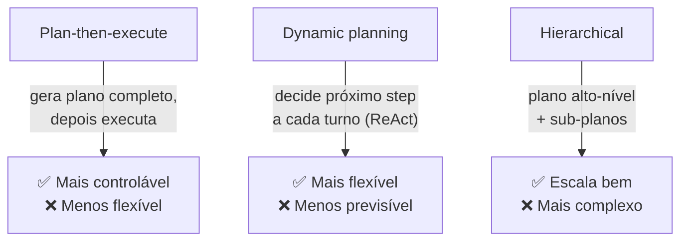
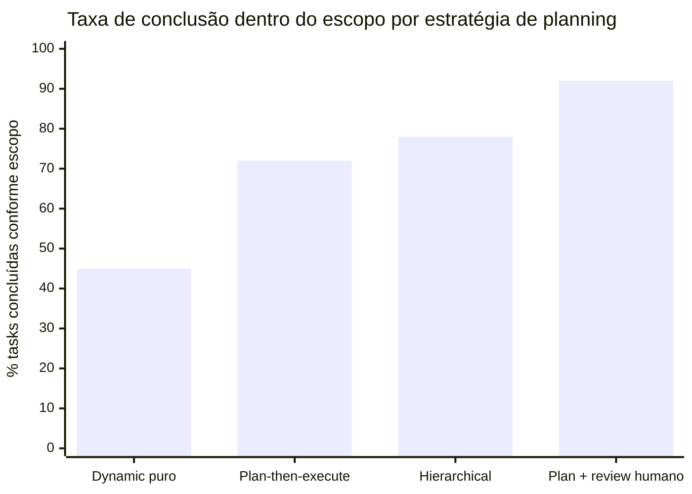
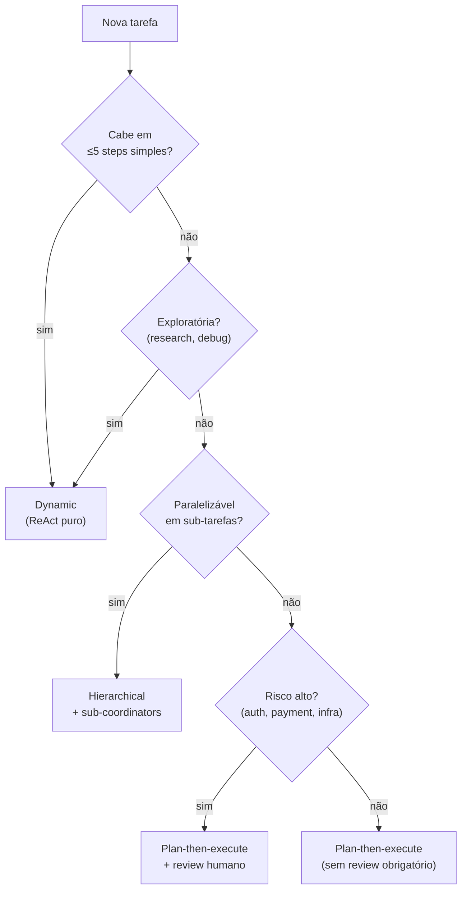
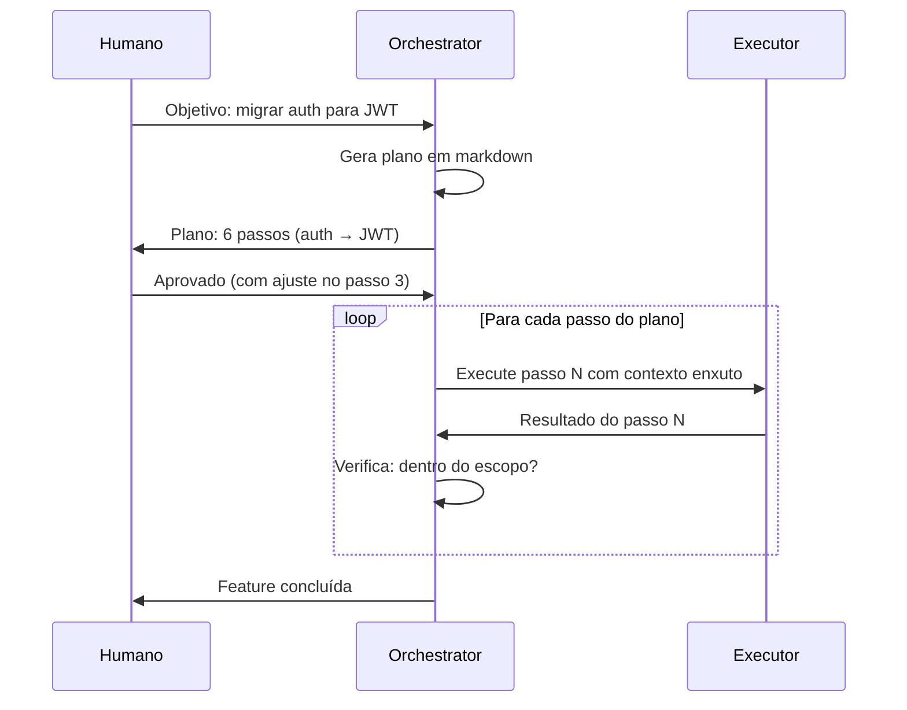

# Planning — plan-then-execute, dynamic, hierarchical

A feature de migração de auth para JWT estava 60% concluída quando o desenvolvedor percebeu que o agent tinha começado a renomear variáveis no módulo de user, que não estava no escopo. Nas próximas 20 mensagens, o agent alternava entre completar a migração, desfazer as renomeações, e revisitar decisões que já haviam sido tomadas. O contexto estava cheio de "Vou fazer X" seguido de "Na verdade, vou fazer Y" — sem estado explícito do que havia sido concluído.

O problema não era o modelo. Era a ausência de um plano em markdown, revisado antes da execução. Sem um artefato estruturado que definisse escopo, sequência e critério de conclusão para cada passo, o agent tratou todas as decisões como igualmente abertas em cada turno. A falta de planejamento explícito não deixa o agent livre — deixa ele sem âncora.

Esta nota cobre as três estratégias de planning para agents, quando usar cada uma, e por que o padrão "escreva o plano antes de tocar o código" elimina a maior classe de erros em coding agents.

> [!abstract] TL;DR
> Para tarefas complexas, agents se beneficiam de **[[Dicionário de IA#planning|planejamento explícito]]** antes de executar. Três estratégias: **plan-then-execute** (gera plano em markdown, revisa, depois executa — mais controlável), **dynamic** (decide próximo passo a cada iteração — mais flexível, padrão de [[Dicionário de IA#ReAct|ReAct]] puro), e **hierarchical** (plano alto-nível com sub-planos). Pattern recomendado em coding agents: sempre pedir plano em markdown antes de tocar código em features não-triviais. Esse padrão **elimina a maior parte** dos *"o agent foi fazer outra coisa"*.

## As 3 estratégias



## Estratégia 1 — Plan-then-execute

**Como funciona:**
1. Agent recebe objetivo
2. Em vez de agir, primeiro **gera plano** em markdown
3. Humano revisa (opcionalmente) e aprova
4. Agent executa cada passo do plano
5. Se desviar, registra e (opcionalmente) pausa

**Quando usar:**
- Tarefas grandes com decisões importantes
- Coding em features não-triviais
- Custo de erro alto
- Humano precisa entender antes de aprovar

**Exemplo (Claude Code):**

```
User: "Refatore auth para usar JWT em vez de sessions"

Agent:
## Plano de refatoração — auth → JWT
1. Analisar uso atual de sessions em src/auth/
2. Adicionar lib jsonwebtoken
3. Criar src/auth/jwt.ts com sign/verify
4. Migrar src/middleware/auth.ts
5. Atualizar testes em tests/auth/
6. Verificar refresh token flow

[Aguardando aprovação]
```

## Estratégia 2 — Dynamic planning

**Como funciona:** ReAct puro — sem plano antecipado. Cada decisão acontece em runtime.

**Quando usar:**
- Tarefas exploratórias (research, debugging)
- Espaço de busca aberto
- Plano antecipado seria especulação
- Pequena escala (1-10 steps)

**Exemplo:**
```
User: "Debug why API /payments returns 500"

Agent:
[Step 1] Vou ler logs recentes... → encontra erro de DB
[Step 2] Vou checar conexão... → conexão ok
[Step 3] Vou ler código do endpoint... → encontra null pointer em line 42
[Step 4] Vou propor fix...
```

Cada decisão vem do passo anterior. Não dava pra prever.

## Estratégia 3 — Hierarchical planning

**Como funciona:** plano de N níveis. Topo é abstrato; folhas são executáveis.

**Quando usar:**
- Tarefas grandes que não cabem em um único plano linear
- Multi-team ou multi-agent
- Quando algumas partes são paralelizáveis

**Exemplo:**

```
Plano: "Lançar feature X em produção"

Sub-plano A: Backend
  1. Migration de DB
  2. Endpoints
  3. Testes integração

Sub-plano B: Frontend (paralelo a A após contracts)
  1. Componentes
  2. Integração
  3. Testes

Sub-plano C: Deploy (depois de A e B)
  1. Staging
  2. Validação
  3. Production rollout
```

Conecta com [[Spec-Driven Development|09 - SDD com agentes — coordinator, implementor, validator|multi-agent CIV]] e [[06 - Multi-agent — orchestrator e sub-agents]].

## Heurística: qual estratégia usar?

| Sinal | Estratégia |
|---|---|
| Tarefa cabe em <5 steps simples | Dynamic |
| Tarefa exploratória (research, debugging) | Dynamic |
| Coding em feature de >1 dia | Plan-then-execute |
| Mudança em código que afeta múltiplos arquivos | Plan-then-execute |
| Risco alto (auth, payment, infra) | Plan-then-execute |
| Multi-agent paralelizável | Hierarchical |
| Decomposição clara em sub-tarefas | Hierarchical |

## O padrão "plan-then-execute" em Claude Code

> [!quote] Anthropic best practice
> *"Para qualquer feature não-trivial, peça ao Claude Code primeiro um plano em markdown. Revise. Aprove. Aí execute."*

Esse padrão sozinho elimina ~80% dos casos de "agent foi pelo caminho errado".

## Re-planning durante execução

Quando algo muda durante execução, **agent deve pausar e re-planejar**. Detectar surpresa: resultado contradiz expectativa, descoberta de constraint não considerada, ou tool retorna algo inesperado.

## Anti-patterns

> [!warning] Plano sempre, em todo passo
> Overhead ridículo em tarefas simples.

> [!warning] Plano nunca
> Agent vibe-coding, vai pelo caminho errado.

> [!warning] Plano sem revisão
> Humano não viu, perde benefício.

> [!warning] Re-plan silencioso
> Agent muda de plano sem registrar; vira drift.

> [!warning] Hierarchical raso
> Só 2 níveis quando precisava 3-4.

> [!warning] Plano em prosa
> Não-executável; use markdown estruturado.

## Métricas

| Métrica | Alvo |
|---|---|
| **% tarefas grandes com plano antecipado** | >80% |
| **% planos aprovados sem mudança** | 30-60% |
| **% steps executados conforme plano** | >85% |
| **% re-plans silenciosos detectados** | <5% |



> Dynamic puro falha frequentemente em tarefas com escopo aberto porque o agent não tem âncora. Plan + review humano é o teto porque um humano valida o escopo antes da execução. A diferença entre 72% e 92% é o custo do review — ou do não-review.





## Como explicar em inglês

Planning in agent systems refers to the deliberate generation of a structured task decomposition before execution begins. The key architectural choice is when and whether to commit to a plan. In dynamic planning (pure ReAct), the agent decides each step at runtime given the previous result — optimal for exploratory tasks where the path can't be known in advance. In plan-then-execute, the agent first produces a structured markdown plan, which can be reviewed and approved by a human before any action is taken — this single pattern eliminates the majority of "agent went off-track" failures in coding tasks. Hierarchical planning adds a second tier: a high-level plan decomposed into parallel sub-plans, each of which can itself be plan-then-execute. The signal to use hierarchical planning is whether sub-tasks are genuinely independent and parallelizable; without that, hierarchical planning is added complexity with no benefit. Re-planning during execution is normal and healthy — but must be explicit and logged, not silent.

| Português | English |
|---|---|
| planejamento | planning |
| plano explícito | explicit plan |
| plano-e-executa | plan-then-execute |
| planejamento dinâmico | dynamic planning |
| planejamento hierárquico | hierarchical planning |
| re-planejamento | re-planning |
| desvio de plano | plan drift |
| aprovação do plano | plan review / plan approval |
| artefato de plano | plan artifact |
| critério de conclusão | completion criterion |
| sub-tarefa paralelizável | parallelizable sub-task |
| agente sem âncora | unanchored agent |

## Ver mais

- **Anthropic — *Best practices for Claude Code: Planning*** (2026): A recomendação oficial de pedir plano em markdown antes de qualquer feature não-trivial, com exemplos de como estruturar o prompt para obter um plano útil e auditável.
- **Wei et al. — *Plan-and-Solve Prompting*** (arxiv:2305.04091, 2023): https://arxiv.org/abs/2305.04091 — Paper que demonstra que fazer o modelo planejar explicitamente antes de resolver melhora a qualidade em raciocínio matemático e lógico. Base teórica para o padrão plan-then-execute.
- **Yao et al. — *Tree of Thoughts*** (arxiv:2305.10601, 2023): https://arxiv.org/abs/2305.10601 — Exploração de múltiplos planos em paralelo com backtracking — o extremo sofisticado de planning. Mais útil para entender os limites do dynamic planning do que para implementar diretamente.
- **Anthropic — *Building Effective Agents*** (2024): https://www.anthropic.com/research/building-effective-agents — Discute quando um plano estruturado (workflow) é preferível a um agent com autonomia total, e onde fica a fronteira entre os dois.

## O que vem a seguir

Um plano em markdown — mesmo hierárquico — ainda ancora um único agent. Ele resolve o problema de "o agent foi fazer outra coisa" dentro de uma sessão, mas não resolve o problema de escala: quando a tarefa é grande demais para um agent (mesmo bem planejado) executar sozinho, sub-tarefas paralelizáveis do plano hierárquico precisam virar sub-agents de fato — com seu próprio contexto, ferramentas e retorno controlado. [[06 - Multi-agent — orchestrator e sub-agents]] cobre essa transição: como um orchestrator distribui os sub-planos da estratégia hierárquica entre sub-agents reais.

## Veja também

- [[02 - O loop ReAct e native tool use]]
- [[06 - Multi-agent — orchestrator e sub-agents]]
- [[Spec-Driven Development|02 - O que é Spec-Driven Development]]
- [[Spec-Driven Development|05 - Fase Design e Plan — arquitetura e decomposição]]
- [[Agentes de Codificação|03 - O comprehension gate]]

## Referências

- **Anthropic** — *Best practices for Claude Code: Planning* (2026)
- **Anthropic** — *Building Effective Agents* (2024) — https://www.anthropic.com/research/building-effective-agents
- **Wei et al.** — *Plan-and-Solve Prompting* (arxiv 2023) — https://arxiv.org/abs/2305.04091
- **Yao et al.** — *Tree of Thoughts* (arxiv 2023) — https://arxiv.org/abs/2305.10601
