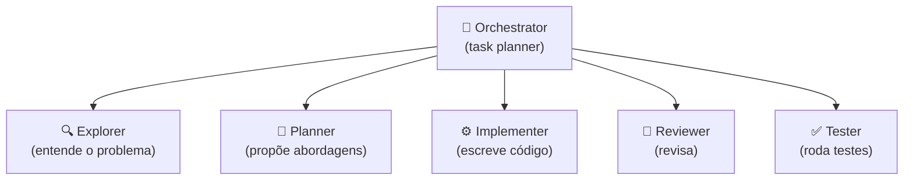
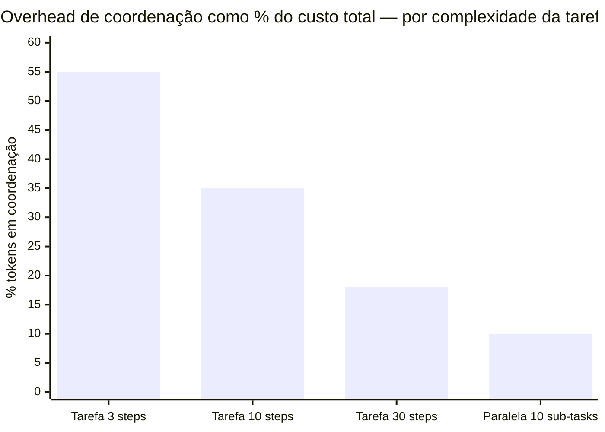
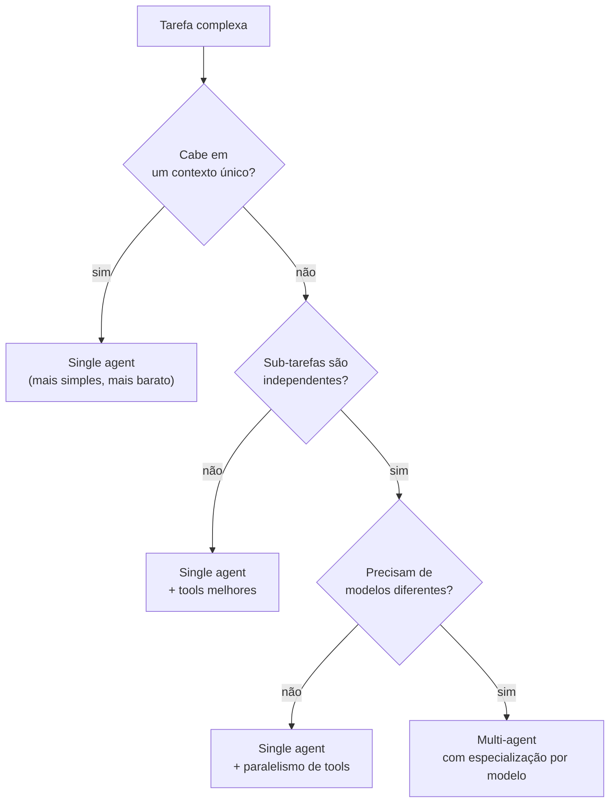
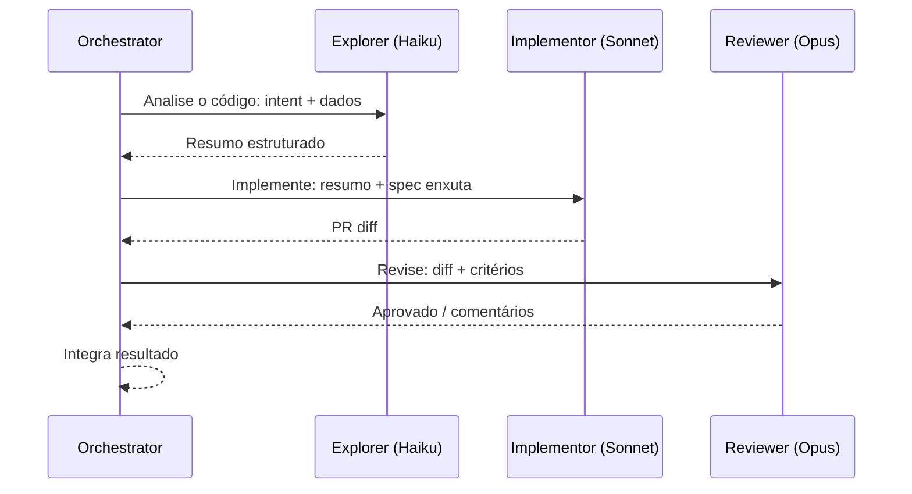

# Multi-agent — orchestrator e sub-agents

A sprint durou três dias para implementar o que parecia ser uma análise de código. O sistema tinha cinco agents: um orchestrator, um explorer de código, um analyzer de segurança, um formatter de relatório, e um validator. O problema: a tarefa real era "ler 10 arquivos, identificar imports não-utilizados, listar no relatório". Dois LLM calls com boas tools teriam resolvido em 30 segundos.

Em vez disso, três dias foram gastos depurando a camada de coordenação — handoffs que perdiam contexto, orchestrator que entrava em loop quando um sub-agent retornava formato diferente do esperado, e custo de tokens 3× maior que o necessário porque cada sub-agent recebia um histórico inflado. O sistema funcionou, eventualmente, mas o custo de construí-lo excedeu por muito o valor que entregou.

Multi-agent é arquitetura de escala, não de elegância. Antes de partir para ele, a pergunta certa é: um único agent bem desenhado, com boas tools e um system prompt focado, resolve isso? Se sim — fique no single.

> [!abstract] TL;DR
> Para tarefas grandes, um **[[Dicionário de IA#orchestrator-worker|agent orchestrator]]** delega para **[[Dicionário de IA#subagent|sub-agents]] especializados**. Cada sub-agent tem contexto pequeno e focado, falhas localizadas não contaminam o todo, paralelização vira possível, e cada sub-agent pode usar modelo diferente (Haiku para Explorer, Sonnet para Implementer, Opus para Reviewer). Custo: overhead de coordenação, handoff é onde info se perde, debugging mais complexo. **Single agent bem desenhado > multi-agent confuso.** Use sub-agents quando tarefa não cabe num contexto só, ou quando especialização claramente ajuda.

## A premissa



Cada papel **isolado** com contexto próprio. Orchestrator coordena handoffs.

## Vantagens

- **Cada sub-agent tem contexto pequeno e focado** — combate [[Context Engineering|03 - Context rot e atenção diluída|context rot]]
- **Falhas localizadas** não contaminam o todo
- **Paralelização**: múltiplos sub-agents independentes rodam concorrentes
- **Especialização por modelo**: Explorer pode ser Haiku, Implementer Sonnet, Reviewer Opus
- **Custo otimizado**: modelos baratos onde dá

## Desvantagens

- **Overhead de coordenação** — mais tokens, mais latência
- **Handoff é onde informação se perde**
- **Debugging mais complexo** — bug pode estar em qualquer sub-agent
- **Premature abstraction** — multi-agent prematuro vira pior que single

## Quando usar sub-agents

✅ **Use:**
- Tarefa não cabe em um único contexto
- Especialização claramente ajuda (research vs implement)
- Sub-tarefas paralelizáveis
- Cada sub-agent precisa de tools muito diferentes
- Audit trail por papel é requisito (compliance)

❌ **NÃO use:**
- Tarefa pequena (1-3 steps) — overhead supera ganho
- Sub-tarefas têm muito contexto compartilhado
- Time não tem expertise para debugar coordenação
- Sem métrica clara de quando coordenação está dando errado

## A escada — suba um degrau por vez

As listas acima dizem *se* você deve sair do agente único. Falta o *quanto*: multi-agent não é um interruptor, é uma escada de cinco degraus, e a maioria dos sistemas em produção para no primeiro ou no segundo. Subir um degrau custa token, latência e superfície de bug — então cada subida precisa ser paga por um ganho que você consiga nomear.

| # | Degrau | Quando | O que ele custa |
| --- | --- | --- | --- |
| 1 | **Um agente com boas ferramentas** | resolve a maioria dos casos reais — comece aqui e fique aqui | nada além do óbvio |
| 2 | **Cadeia fixa** (etapa A → etapa B) | o fluxo é conhecido e sequencial | perde adaptação; em compensação é trivial de testar |
| 3 | **Roteador** | um classificador barato manda para o especialista certo | uma classificação a mais por request |
| 4 | **Paralelo** (fan-out / fan-in) | N sub-tarefas independentes e um agregador | N contextos simultâneos; ganho é tempo de parede, não token |
| 5 | **Orquestrador + sub-agentes** | o mais poderoso e o mais caro de operar | coordenação, handoff, debugging distribuído |

Repare que os degraus 2 e 3 nem são multi-agent no sentido forte — são **código chamando o modelo em pontos definidos**. É a faixa que resolve mais problema por unidade de complexidade, e a que times pulam com mais frequência, indo direto do 1 para o 5 porque o 5 é o que aparece nas demos.

> [!important] A regra que economiza meses
> **Se um agente com ferramentas boas não resolve, dois agentes com ferramentas ruins também não vão resolver.** Coordenação é problema difícil em sistema distribuído e entre pessoas; com modelo não é diferente. Antes de acrescentar o segundo agente, esgote os três consertos que custam menos: ferramenta melhor descrita ([[03 - Tool design — princípios e categorias|tool design]]), contexto melhor montado ([[03-Dominios/Tecnologia/IA/Context Engineering/04 - Context pipelines — montagem dinâmica|context pipeline]]), eval melhor ([[03-Dominios/Tecnologia/IA/Evaluation/01 - Eval-driven development — a disciplina|EDD]]). Quase sempre um dos três era o problema.

O critério de subida não é a moda nem a complexidade aparente da tarefa — é a **natureza dela**. Pesquisa de mercado com cinco concorrentes investigados em contextos separados e um agregador é o encaixe perfeito do degrau 4: paralelizável, read-heavy, partes independentes, e o tempo de parede despenca. A *mesma* arquitetura aplicada a implementar uma feature produz dois agentes editando os mesmos arquivos, com decisões incompatíveis e merge impossível. Mesmo padrão, resultado oposto, porque a segunda tarefa é de escrita coordenada sobre estado compartilhado.

## Padrões de orquestração

### Pattern 1 — Coordinator-Implementor-Verifier (CIV)

Padrão peer-reviewed (VeriMAP, EACL 2026). Orchestrator transforma spec em DAG. Implementors trabalham em paralelo. Validator verifica saídas antes de aceitar.

Detalhamento em [[Spec-Driven Development|09 - SDD com agentes — coordinator, implementor, validator]].

### Pattern 2 — Specialist subagents (Kiro)

Em vez de implementors genéricos, **subagents especializados**:

- `security-reviewer`
- `api-contract-validator`
- `db-migration-writer`
- `test-author`

Orchestrator escolhe specialist por tipo de task.

### Pattern 3 — Hierarchical (multi-level)

Orchestrator delega a **sub-coordinators** para mega-tasks:

```
Orchestrator
├── Sub-coordinator A (feature 1)
│   ├── Implementor A1
│   └── Implementor A2
└── Sub-coordinator B (feature 2)
    ├── Implementor B1
    └── Implementor B2
```

Útil em features grandes ou multi-equipes.

### Pattern 4 — Conversational multi-agent (AutoGen)

Múltiplos agents conversam entre si até chegar a consenso. Mais experimental; menos previsível.

## Implementações em 2026

| Stack | Como fazer multi-agent |
|---|---|
| **Claude Code** | `Task` tool com `subagent_type` (general-purpose, explore, plan) |
| **LangGraph** | StateGraph com nodes coordinator/sub-agent |
| **Kiro** | Custom subagents nativos |
| **OpenAI Swarm** | Handoffs entre agents |
| **CrewAI** | Crew com roles + tasks |
| **Custom** | Loop em código próprio |

## A regra de ouro do handoff

> [!warning] Não passe histórico bruto
>
> Padrão errado: orchestrator passa histórico inteiro para sub-agent.
> Resultado: sub-agent vê demais, contexto inflado, decisões erradas.
>
> Padrão certo: orchestrator passa **resumo + intent + dados estruturados**.
> Sub-agent recebe contexto enxuto, foca na sub-tarefa.

```python
# Errado
sub_agent.run(history=orchestrator.full_history)

# Certo
sub_agent.run(
    summary=summarize(orchestrator.history),
    intent="Validar compliance da proposta",
    structured_data={
        "decision": orchestrator.decision,
        "constraints": orchestrator.constraints
    }
)
```

## Especialização por modelo

```python
# Modelos diferentes por papel
orchestrator = "claude-opus-4"      # raciocínio sobre o todo
explorer = "claude-haiku-4-5"        # rápido e barato
implementer = "claude-sonnet-4-6"    # equilíbrio
reviewer = "claude-opus-4"           # análise crítica
```

Custo total **menor** que single Opus. Latência total similar (paralelismo compensa).

## Métricas

| Métrica | Alvo |
|---|---|
| **Speedup vs single-agent** | 2-4x em features com tasks paralelizáveis |
| **% tasks aprovadas em primeira validation** | >75% |
| **Coordinação overhead** | <20% do tempo total |
| **Tokens por feature (multi vs single)** | Comparável ou menor |

## Anti-patterns

> [!warning] Multi-agent prematuro
> "Vamos fazer 5 agents especializados" para task simples.

> [!warning] Coordinator sem paralelismo
> Vira chain inútil — coordena sequencialmente o que já era sequencial.

> [!warning] Implementors recebendo plan completo
> Perde isolamento de contexto — cada sub-agent volta a ver demais.

> [!warning] Validator com prompt = "is this good?"
> Viés de aceitar — sem critério objetivo, o validator tende a aprovar.

> [!warning] Sem fallback quando task falha 3+ vezes
> Coordinator entra em loop, retentando a mesma abordagem que já falhou.

> [!warning] Custos não monitorados
> N agents × tokens vira custo escondido — sem visibilidade, a fatura só aparece no fim do mês.

## Single agent bem desenhado > multi-agent confuso

> [!tip]
> Antes de partir para multi-agent, pergunte:
> 1. Single agent bem promptado resolve isso?
> 2. Tools bem desenhadas resolveriam o problema do contexto?
> 3. Sub-agent é arquitetura ou complexidade gratuita?
>
> Se resposta é "sim" para 1-2, **fique single**.



> Para tarefas pequenas, mais da metade dos tokens vão para coordenação (handoff summaries, routing, retry logic) — não para o trabalho real. Multi-agent só fica eficiente quando a tarefa é grande o suficiente para diluir esse overhead.





## Como explicar em inglês

A multi-agent system is an architecture where a primary agent (the orchestrator) delegates subtasks to specialized sub-agents, each with its own isolated context and, optionally, a different model. The core benefits are context isolation (each sub-agent sees only what it needs to decide), parallelism (independent sub-tasks run concurrently), and model specialization (cheap, fast models for exploration; expensive, capable models for review). The core costs are coordination overhead (tokens spent on handoffs, routing, and retry logic that don't contribute to the task), handoff quality (information is always lost or distorted when summarized across agents), and debugging complexity (a bug can live in any agent or in the coordination layer). The most common mistake is premature multi-agent — building five specialized agents for a task that a single well-prompted agent with two good tools would handle faster, cheaper, and more reliably.

| Português | English |
|---|---|
| orquestrador | orchestrator |
| sub-agente | sub-agent |
| handoff | handoff |
| isolamento de contexto | context isolation |
| especialização por papel | role specialization |
| sobrecarga de coordenação | coordination overhead |
| agente especialista | specialist agent |
| paralelismo de agentes | agent parallelism |
| arquitetura multi-agente | multi-agent architecture |
| agent prematuro | premature agent / premature multi-agent |
| trilha de auditoria | audit trail |
| fallback de coordenação | coordination fallback |

## O que vem a seguir

Saber *quando* orquestrar (esta nota) e *como* fazer o handoff sem perder contexto (regra de ouro acima) ainda deixa uma pergunta em aberto: com o quê construir isso na prática? Os padrões descritos aqui — CIV, hierárquico, conversacional — não são teoria abstrata; em 2026 cada um tem um framework que o implementa nativamente, com um trade-off diferente embutido. [[07 - Frameworks 2026]] mapeia essas opções — LangGraph, CrewAI, OpenAI Swarm/Agents SDK, Claude Agent SDK e outros — e, mais importante, **o que cada um sacrifica** em troca da conveniência: controle explícito de estado vs. produtividade, portabilidade vs. features nativas do provider, maturidade vs. simplicidade do modelo mental.

## Ver mais

- **Anthropic — *Building Effective Agents*** (2024): A seção sobre multi-agent tem os critérios canônicos de quando escalar de single para multi — incluindo a regra "single agent bem desenhado > multi-agent confuso". Fonte das boas práticas de handoff e especialização por modelo. [anthropic.com/research/building-effective-agents](https://www.anthropic.com/research/building-effective-agents)
- **Anthropic — *Subagents in the SDK*** (Claude Agent SDK docs): Documentação técnica do mecanismo de sub-agents — como despachar, como receber resultados, como isolar contexto. Referência de implementação. [docs.claude.com/en/docs/agent-sdk/subagents](https://docs.claude.com/en/docs/agent-sdk/subagents)
- **Augment Code — *Coordinator-Implementor-Verifier Pattern*** (2026): Descreve o padrão CIV, com DAG de tasks, implementors paralelos e validação antes de aceitar. Modelo arquitetural concreto para sistemas multi-agent em coding. [augmentcode.com/guides/coordinator-implementor-verifier](https://www.augmentcode.com/guides/coordinator-implementor-verifier)

## Veja também

- [[01 - O que é um agent]]
- [[03 - Tool design — princípios e categorias]]
- [[05 - Planning — plan-then-execute, dynamic, hierarchical]]
- [[Economia de Tokens|10 - Sub-agentes especializados]]
- [[Spec-Driven Development|09 - SDD com agentes — coordinator, implementor, validator]]
- [[Context Engineering|09 - Shared memory em multi-agent]]
- [[07 - Frameworks 2026]]

## Referências

- **Anthropic** — *Building Effective Agents* (2024) — https://www.anthropic.com/research/building-effective-agents
- **Anthropic** — *Subagents in the SDK* (Claude Agent SDK docs) — https://docs.claude.com/en/docs/agent-sdk/subagents
- **Augment Code** — *Coordinator-Implementor-Verifier Pattern* (2026) — https://www.augmentcode.com/guides/coordinator-implementor-verifier
- **VeriMAP** — Xu, Zhang, Mitra, Hruschka — *Verification-Aware Planning for Multi-Agent Systems*, EACL 2026 — https://aclanthology.org/2026.eacl-long.353.pdf
- **OpenAI Swarm** — https://github.com/openai/swarm (2024+)
