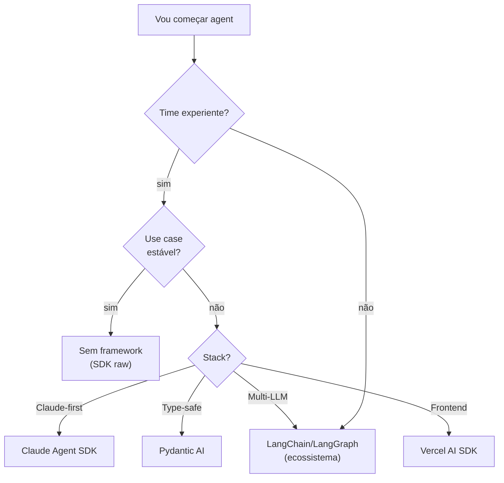
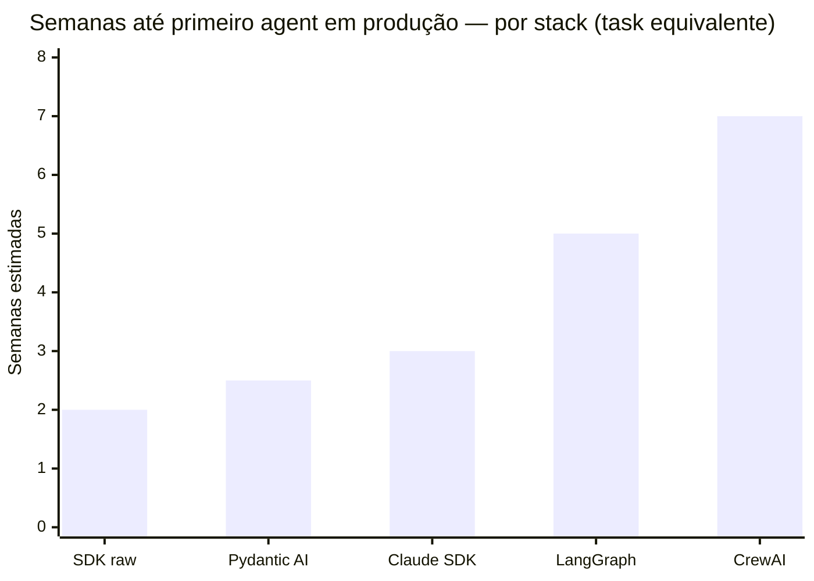
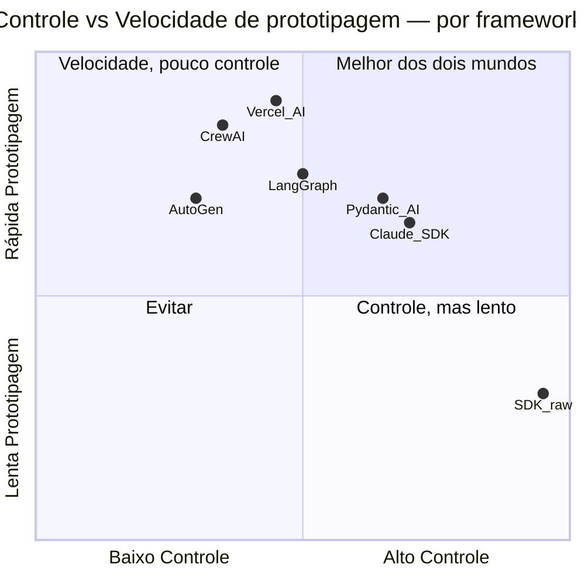

# Frameworks 2026 — Claude Agent SDK, LangGraph, AutoGen, CrewAI

A equipe escolheu LangChain porque "tem tudo". Seis semanas depois, estavam gastando mais tempo depurando a camada de abstração do framework do que escrevendo lógica de negócio. A versão do LangChain atualizou duas vezes durante o desenvolvimento, quebrando o código nas duas ocasiões. Três dos cinco engenheiros nunca haviam depurado os internos do LangChain e ficaram bloqueados por dias tentando rastrear bugs que estavam no framework, não no código deles.

O projeto teria levado duas semanas com SDK raw e 400 linhas de código próprio. Em vez disso, levou oito — e entregou um sistema que o time tinha medo de atualizar.

Escolher framework é uma decisão de arquitetura com efeitos duradouros. A questão correta não é "qual framework usar?" mas "o pain de manter código próprio excede o pain de manter este framework?" Esta nota mapeia as opções reais de 2026 com os critérios honestos para cada escolha.

> [!abstract] TL;DR
> O ecossistema de frameworks para agents em 2026 estabilizou em 5 grandes opções: **Claude Agent SDK** (oficial Anthropic), **LangGraph** (mais popular para workflows complexos), **CrewAI** (multi-agent role-based), **AutoGen** (Microsoft, conversational), **Pydantic AI** (TypeScript/Python type-safe). Mas o movimento crescente é **"sem framework"**: SDK raw + 500 linhas de código próprio. Frameworks engessam, mudam frequentemente, são difíceis de debugar. **Use framework quando o pain de não ter excede o pain de ter.**

## O panorama em uma tabela

> [!info] Validade dos dados desta tabela
> Landscape verificado via registries oficiais (PyPI/npm) em 2026-07-03. Confirmado: `claude-agent-sdk` (Python) em **0.2.110** e `@anthropic-ai/claude-agent-sdk` (TypeScript) em **0.3.200**; `pydantic-ai` em **v2.4.0**. LangGraph segue como a opção mais citada para workflows stateful complexos em múltiplas comparações independentes de 2026 — mas rankings de popularidade (posição exata, market share) variam por fonte e mudam rápido. Estes números se movem em dias (o TS SDK subiu de .197 para .200 no mesmo dia desta verificação): não os trate como fixos — confira o changelog oficial antes de fixar uma dependência (links na seção Referências).

| Framework | Linguagem | Forte em | Quando usar |
|---|---|---|---|
| **Claude Agent SDK** | Python | Integração nativa Claude, [[Dicionário de IA#MCP (Model Context Protocol)\|MCP]] | Comprometido com Claude |
| **LangChain / LangGraph** | Python, JS | Ecossistema enorme, workflows complexos | Múltiplas integrações + state graph |
| **CrewAI** | Python | Multi-agent role-based | Protótipos multi-agent |
| **AutoGen** | Python | Conversational multi-agent | Pesquisa, experimental |
| **Pydantic AI** | Python | Type-safe, [[Dicionário de IA#structured output\|structured outputs]] | Times type-first |
| **Vercel AI SDK** | TypeScript | Frontend Next.js/React + LLM | SPA/webapp com IA |
| **Sem framework** | Qualquer | Controle total, debug fácil | Time experiente, use case estável |

## Claude Agent SDK

Framework oficial da Anthropic para construir agents com Claude.

```python
from anthropic import Anthropic
# (Claude Agent SDK abstrai o loop, tools, observabilidade)

agent = Agent(
    model="claude-sonnet-4-6",
    tools=[search_tool, read_tool],
    max_steps=15,
    observability=langfuse_client
)

result = agent.run("Pesquise X e sintetize")
```

**Prós:**
- Integração nativa com Claude ([[Dicionário de IA#tool use|tool use]] otimizado)
- Observabilidade built-in
- Suporte nativo a MCP

**Contras:**
- Lock-in Anthropic (otimizado para Claude)
- Menos maduro que LangChain

**Use quando:** comprometido com Claude e quer o melhor do Claude.

## LangChain / LangGraph

O framework mais popular para agents em Python/JS.

- **LangChain:** abstrações de "chain" e "agent", muitas integrações
- **LangGraph:** layer para grafos de execução, stateful workflows, cycles, branches

```python
from langgraph.graph import StateGraph

class AgentState(TypedDict):
    messages: list
    findings: list

graph = StateGraph(AgentState)
graph.add_node("researcher", researcher_fn)
graph.add_node("writer", writer_fn)
graph.add_edge("researcher", "writer")
```

**Prós:**
- Ecossistema enorme, integra com tudo
- LangSmith para observabilidade
- StateGraph é poderoso para multi-agent

**Contras:**
- Abstrações pesadas
- Mudanças frequentes (debugging difícil)
- Curva de aprendizado íngreme

**Use quando:** projetos que precisam de múltiplas integrações e estão ok com overhead.

## CrewAI

Framework especializado em multi-agent orchestration.

```python
from crewai import Crew, Agent, Task

researcher = Agent(role="Researcher", goal="Find sources")
writer = Agent(role="Writer", goal="Synthesize findings")

task = Task(description="Research X", agent=researcher)
crew = Crew(agents=[researcher, writer], tasks=[task])
crew.kickoff()
```

**Prós:**
- Paradigma claro de "crew" (papéis + tarefas)
- Boa para ideação e protótipos

**Contras:**
- Menos maduro
- Documentação variável

**Use quando:** protótipos multi-agent, ideação rápida.

## AutoGen (Microsoft)

Framework de multi-agent conversational.

**Prós:**
- Paradigma claro de conversação
- Suporte a human-in-the-loop

**Contras:**
- Mais acadêmico, menos otimizado para prod
- Output pode ser caro (agents conversam muito)

**Use quando:** pesquisa, experimentação multi-agent.

## Pydantic AI

Framework type-safe focado em structured outputs.

```python
from pydantic_ai import Agent

class ResearchResult(BaseModel):
    findings: list[str]
    sources: list[str]
    confidence: float

agent = Agent(
    "claude-sonnet-4-6",
    result_type=ResearchResult,
    tools=[search, read]
)

result = agent.run_sync("Pesquise X")
print(result.data.findings)  # type-safe
```

**Prós:**
- Type-safe (Pydantic validation)
- Structured outputs garantidos
- Bom DX

**Contras:**
- Menos integrações que LangChain

**Use quando:** time prefere type-first development.

## Vercel AI SDK

Framework para aplicações Next.js/React com LLM.

**Prós:**
- Excelente DX em frontend
- Streaming nativo, hooks React

**Contras:**
- Focado em aplicações web
- Não para agents servidor-puros

**Use quando:** SPA/webapp com IA.

## "Sem framework" — o movimento crescente

Em 2026, muita gente está voltando para **SDK raw + código próprio**. Razões:

> [!quote] Simon Willison e devs senior
> *"Frameworks são abstrações que engessam. Um agent de 500 linhas em TypeScript raw é mais fácil de debugar, mais fácil de otimizar custo, mais fácil de adaptar."*

**Quando "sem framework" vence:**
- Time sabe o que está fazendo
- Use case estável (não muda toda semana)
- Custo importa muito
- Debug é prioritário

**Quando framework vale:**
- Time precisa de muitas integrações
- Velocidade de prototipagem > controle
- Time menos experiente

## Heurística de escolha



## A pergunta de teste

> *"O pain de manter framework excede o pain de manter código próprio?"*

Se sim → use framework.
Se não → comece sem.



> SDK raw é mais rápido para uso cases simples e estáveis. Frameworks ganham quando o time precisa de integrações ou de acelerar prototipagem. A curva inverte depois de 2 semanas: frameworks poupam integração mas cobram dívida de abstração em debugging e upgrades.

> [!warning] Estimativas, não medição
> As semanas-até-produção do gráfico acima são uma estimativa qualitativa desta nota (task equivalente, não benchmark publicado) — não foi possível confirmar um estudo controlado que meça esses números com precisão. Trate como ordem de grandeza relativa entre stacks, não como dado cravado.



## Anti-patterns

> [!warning] Framework como religião
> Escolheu LangChain, força em tudo — inclusive nos casos em que uma chamada direta de API resolveria em 20 linhas.

> [!warning] Framework para protótipo
> Overhead de configuração e abstração em algo que ia mudar de qualquer forma na semana seguinte.

> [!warning] Sem framework + sem disciplina
> Sem os trilhos de um framework, o código vira spaghetti — ninguém documentou o "framework implícito" que o time inventou.

> [!warning] Trocar framework no meio do projeto
> Custo enorme de reescrita e retreinamento do time; raramente vale a pena, mesmo quando o framework original decepciona.

> [!warning] Framework cutting-edge em produção
> Versões mudam rápido demais, breaking changes chegam sem aviso — como a versão do LangChain que quebrou duas vezes na história de abertura desta nota.

## Métricas para avaliar adoção

| Métrica | Alvo |
|---|---|
| **Tempo até primeiro agent funcional** | <2 dias |
| **Linhas de código de glue** | <500 |
| **% de bugs que vêm do framework** | <30% |
| **Curva de onboarding novo dev** | <1 semana |

## Como explicar em inglês

The agent framework landscape in 2026 has consolidated around a handful of options with distinct positions. LangGraph (the graph-execution layer built on top of LangChain) is the most popular choice for complex stateful workflows — its `StateGraph` abstraction handles branching, cycles, and multi-agent coordination well, but carries significant abstraction overhead and a steep learning curve. Claude Agent SDK is Anthropic's native offering, optimized for Claude with built-in MCP support and observability. Pydantic AI prioritizes type-safe structured outputs with full Pydantic validation, which appeals to teams that want guaranteed output schemas. CrewAI offers a role-based multi-agent paradigm useful for rapid prototyping but less suited for production systems. The growing counter-movement is "no framework" — raw SDK with bespoke orchestration code. For stable use cases on experienced teams, 300–500 lines of custom code with direct API calls is often faster to ship, easier to debug, cheaper to operate, and simpler to upgrade than any framework. The right question isn't "which framework" but "does the cost of maintaining this framework exceed the cost of maintaining custom code?"

| Português | English |
|---|---|
| framework de agents | agent framework |
| lock-in de framework | framework lock-in |
| sem framework (abordagem) | no-framework approach / raw SDK |
| abstração | abstraction |
| grafo de execução | execution graph / state graph |
| observabilidade | observability |
| integração de ferramentas | tool integration |
| output estruturado | structured output |
| prototipagem rápida | rapid prototyping |
| custo de manutenção | maintenance cost |
| multi-agente baseado em papéis | role-based multi-agent |
| engessamento de framework | framework rigidity |

## O que vem a seguir

Escolher (ou recusar) um framework resolve só a camada de infraestrutura. Continua faltando responder: como o agent decide quando parar de chamar tools? Como ele lida com um passo que falha no meio de uma cadeia longa? Como se evita que o contexto exploda depois de 20 turnos? Essas perguntas não têm resposta no LangGraph nem no "sem framework" — são **patterns** que qualquer stack precisa implementar, framework por baixo ou não. [[08 - Patterns comuns de agents]] cataloga esses padrões recorrentes — retry, reflection, human-in-the-loop, guardrails — que sobrevivem à troca de framework porque não são sintaxe, são forma.

## Ver mais

- **LangGraph — *documentation*** (langchain-ai.github.io/langgraph, 2026): Documentação oficial do LangGraph — StateGraph, nodes, edges, parallelism, checkpointing. Referência técnica indispensável antes de adotar LangGraph em produção.
- **Pydantic AI — *documentation*** (ai.pydantic.dev, 2026): Como construir agents type-safe com validação Pydantic nativa, streaming, e structured outputs garantidos. Melhor introdução para times que já usam Pydantic.
- **Simon Willison — *blog on agents and frameworks*** (simonwillison.net, 2024-2026): Cobertura consistente e crítica do ecossistema de frameworks, com post-mortems de adoções problemáticas. Perspectiva pragmática de "sem framework" que equilibra o entusiasmo padrão.

## Veja também

- [[01 - O que é um agent]]
- [[02 - O loop ReAct e native tool use]]
- [[06 - Multi-agent — orchestrator e sub-agents]]
- [[Agentes de Codificação|10 - OpenCode — o harness open source]]
- [[Agentes de Codificação|13 - Devin e agentes autônomos cloud]]

## Referências

- **Anthropic** — *Claude Agent SDK docs* (2026)
- **Anthropic** — *claude-agent-sdk-python CHANGELOG* (github.com/anthropics/claude-agent-sdk-python, verificado 2026-07-03)
- **Pydantic** — *pydantic-ai releases* (github.com/pydantic/pydantic-ai/releases, verificado 2026-07-03)
- **LangChain** — *python.langchain.com* (2026)
- **CrewAI** — *docs.crewai.com* (2026)
- **AutoGen** — *microsoft.github.io/autogen* (2026)
- **Pydantic AI** — *ai.pydantic.dev* (2026)
- **Vercel AI SDK** — *sdk.vercel.ai* (2026)
- **Simon Willison** — *blog on agents and frameworks* (2024-2026)
