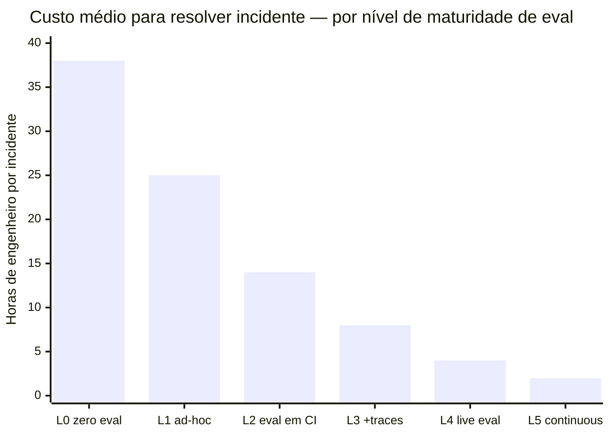
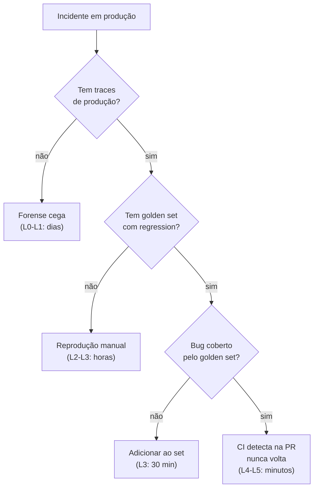

# Evaluation de agents

Três meses em produção e o agent "funcionava a maior parte do tempo." Então chegou o relatório: o agent havia deletado arquivos que deveria apenas ter renomeado — em um diretório de produção. O time não conseguiu reproduzir o bug. Não havia trace do que aconteceu. Não havia baseline para comparar. Nenhuma golden task cobria aquele caso edge. O único "eval" que tinham era: "testei manualmente antes de shipar."

A investigação levou dois dias de forense reconstituindo o histórico de mensagens a partir de logs fragmentados. O bug nunca foi reproduzido com certeza. E a próxima feature ficou congelada por três semanas enquanto o time decidia se podia confiar no agent.

Sem evaluation estruturada, agent em produção é caixa preta cara. Não é "ideal ter eval" — é a diferença entre conseguir iterar e ficar com medo do próprio sistema. Esta nota define o mínimo viável de eval e a cadência para escalar além disso.

> [!abstract] TL;DR
> Agents são **harder de avaliar** que LLMs puros porque o processo é não-determinístico e tem múltiplos steps. **Métricas fundamentais:** task completion rate, steps per task, cost per task, latency, human intervention rate, error types. **Métodos:** golden set de tasks, LLM-as-judge para output aberto, trace review humana semanal (1-2h), regression tests acumulados. Sem evaluation, agent em produção é caixa preta. **"Olhei e tá bom" não escala.**

> [!info] Trilha mestre
> Esta nota é o deep-dive de evaluation **no contexto de agents**. Pra disciplina geral de evaluation (golden datasets, rubrics, LLM-as-judge, frameworks 2026, eval em CI), veja a trilha [[Evaluation]].

## Por que eval de agent é diferente

LLM puro:
```
Input X → output Y → match com expected
```

Agent:
```
Input X → 12 steps com decisões intermediárias → output Y
       → como avaliar o processo, não só o output?
```

Agent com mesmo input pode tomar **caminhos diferentes** e chegar a outputs **igualmente válidos**. Eval precisa ser semântica E processual.

## Métricas fundamentais

### 1. Task completion rate

```
TCR = % de tasks que terminaram com resultado correto
```

**Alvo:** >75% para agents em produção; >90% para tasks bem-definidas.

A métrica mais importante. Se baixa, todas as outras são irrelevantes.

### 2. Steps per task

Eficiência. Agent que termina em 5 steps > agent que termina em 30 com mesmo resultado.

**Cuidado:** menos steps **só importa** se completion rate é igual ou melhor. Agent rápido + errado é pior.

### 3. Cost per task

```
Cost = sum(tokens × price) por task
```

**Alvo:** budget definido por task antes de rodar. Acima → kill switch ([[Economia de Tokens|15 - Orçamento e hard limits]]).

### 4. Latency (p50, p99)

Quanto demora? p99 é mais importante que p50 — picos matam UX.

### 5. Human intervention rate

Quantas vezes humano precisou intervir?

**Alvo:** decrescente ao longo do tempo. Se sobe, agent está degradando.

### 6. Error types

Catalogar falhas:

| Tipo | Exemplo |
|---|---|
| **Loop infinito** | `max_steps` saturado sem terminar |
| **Wrong tool** | Chamou `delete_file` quando devia `read_file` |
| **Wrong argument** | Tool correto, args errados |
| **Hallucinated tool** | Inventou tool que não existe |
| **Lost context** | "Esqueceu" instrução do início |
| **Premature termination** | Disse "pronto" sem fazer |

## Métodos de eval

### Golden set de tasks

30-100 tasks representativas com resultado esperado. Rode a cada mudança significativa.

```yaml
- id: research_001
  task: "Pesquise últimos 5 papers de context engineering"
  expected:
    findings_count: 5
    sources_required: true
    completion_rate: 1.0

- id: coding_002
  task: "Adicione validação de email ao formulário"
  expected:
    test_pass: true
    files_modified: ["src/forms/Email.tsx", "tests/forms/Email.test.tsx"]
```

### LLM-as-judge

Para resultados abertos, modelo forte avalia output do agent.

```
Judge prompt:
Task: {task}
Expected: {expected}
Agent output: {output}
Agent steps: {trace}

Avalie (0-10):
- Correção do output
- Eficiência do processo
- Aderência à task
```

Cuidados em [[Anatomia dos LLMs|17 - Evaluation de LLMs em produção]].

### Trace review humana

> [!tip] O eval mais valioso
> *"Invista 1-2h/semana lendo [[Dicionário de IA#tracing|traces]] de produção. Você vai encontrar bugs que nenhum eval automatizado pega."*

Padrão: amostragem aleatória de 10-20 traces/semana. Catalogue erros não cobertos por golden set → adicionar.

### Regression tests

Quando bug é encontrado em produção:
1. Reproduza em golden set
2. Adicione ao set permanentemente
3. CI roda golden set a cada mudança
4. Bug nunca volta

**Nunca perca a mesma regressão duas vezes.**

## Frameworks de eval

| Tool | Forte em |
|---|---|
| **[[Dicionário de IA#Langfuse\|Langfuse]]** | Open source, traces + golden sets |
| **LangSmith** | Integração LangChain, eval pipelines |
| **Braintrust** | Eval-first, comparação de versions |
| **Helicone** | Proxy + analytics |
| **[[Dicionário de IA#Arize Phoenix\|Arize Phoenix]]** | Sessions com timeline |
| **OpenAI Evals** | Framework open source |

## Cadência recomendada

| Cadência | O que fazer |
|---|---|
| **A cada mudança** | Roda golden set; bloqueia merge se TCR cai >5% |
| **Semanal** | Trace review humana (1-2h); identifica novos error types |
| **Mensal** | Revisão de métricas, ajuste de targets |
| **Trimestral** | Audit completo; comparação inter-versions |

## Eval em produção (live)

Diferente de eval pre-merge:

- **Sample rate:** 1-5% das tasks reais
- **A/B test:** comparar prompt v1 vs v2 com métricas de negócio
- **Alerts:** TCR cai >5% → alerta imediato
- **Drift detection:** distribuição de error types muda → investigar

## Maturidade

> [!example] Diagnóstico
>
> | Nível | Sinal |
> |---|---|
> | **0 — Zero eval** | "Olhei e tá bom" |
> | **1 — Golden set ad-hoc** | Lista de tasks em planilha; rodada manual eventual |
> | **2 — Eval em CI** | Golden set roda automaticamente em PR |
> | **3 — Eval + traces** | Traces de prod + LLM-as-judge para tarefas subjetivas |
> | **4 — Live eval** | Sample em prod, A/B test, alerts |
> | **5 — Continuous** | Golden set evolui com casos reais; regression tests acumulados |



> Cada nível de maturidade de eval reduz o custo de incidente porque reduz o tempo de diagnóstico. Nível 0 exige forense: reconstituir o estado interno de um agent não-determinístico a partir de logs fragmentados pode levar dias. Nível 5 detecta a regressão no CI antes de chegar a produção.



## Anti-patterns

- **Eval só pre-launch** — não detecta degradação em prod
- **Métricas só de processo** ("agent rodou em 5 steps!") sem completion
- **Sem regression tests** — mesmos bugs voltam mês a mês
- **Trace review nunca** — bugs não-óbvios passam batido
- **Judge igual ao avaliado** — viés de auto-aprovação
- **Sem error type catalog** — cada bug é "novo" mesmo sendo recorrente

## Métricas-alvo em 2026

| Métrica | Alvo |
|---|---|
| **Task completion rate** | >75% |
| **Cost per task vs budget** | <100% (sempre) |
| **Human intervention rate** | <20% |
| **Trace review semanal** | 1-2h, 10-20 traces |
| **Regression tests cumulativos** | Cresce mensalmente |

## Como explicar em inglês

Evaluating agents is fundamentally harder than evaluating single-turn LLM calls because the output of an agent depends on a non-deterministic sequence of intermediate decisions, not just a mapping from input to output. Two agents can take completely different paths through a task and both produce correct results — or one can take the "right" path and still produce the wrong answer because a tool returned unexpected data at step 7. Effective agent evaluation requires measuring both task completion rate (did it finish with the right result?) and process quality (did it do so efficiently, without loops, without calling wrong tools?). The minimum viable evaluation for a production agent is a golden set of 30–100 representative tasks run on every significant change, a weekly 1–2 hour human trace review session, and an error type catalog that grows with regression tests. LLM-as-judge is useful for open-ended tasks where expected output varies. Without structured evaluation, you can't safely iterate on a deployed agent — every change is a gamble.

| Português | English |
|---|---|
| avaliação de agent | agent evaluation |
| taxa de conclusão de tarefa | task completion rate |
| conjunto dourado | golden set / golden dataset |
| teste de regressão | regression test |
| LLM como juiz | LLM-as-judge |
| rastreamento de execução | execution trace / tracing |
| catálogo de erros | error type catalog |
| revisão de trace | trace review |
| avaliação em CI | CI-based evaluation |
| avaliação em produção | live evaluation / production eval |
| intervenção humana | human intervention |
| detecção de drift | drift detection |

## Ver mais

- **Eugene Yan — *Patterns for Building LLM-based Systems*** (eugeneyan.com, 2024): A seção de evaluation é a referência mais citada sobre como estruturar golden sets, LLM-as-judge e cadência de eval para sistemas em produção. Densamente sourced.
- **Langfuse — *Agent evaluation docs*** (langfuse.com, 2026): Documentação técnica de como configurar golden sets, scores automáticos, e trace review na plataforma. Inclui exemplos de schema de task e rubrics de judge.
- **Braintrust — *AI evaluation best practices*** (braintrustdata.com, 2026): Guia end-to-end de como criar datasets de eval, versionar experimentos, e comparar prompts em múltiplas métricas simultaneamente. Bom para times montando pipeline de eval do zero.

## Veja também

- [[Evaluation]]
- [[01 - O que é um agent]]
- [[Anatomia dos LLMs|17 - Evaluation de LLMs em produção]]
- [[Segurança e Guardrails|10 - Métricas de qualidade AI — defect escape rate, rework ratio]]
- [[Spec-Driven Development|07 - Fase Validate — spec como contrato executável]]
- [[Agentes de Codificação|18 - Benchmarks e avaliação — SWE-bench e além]]

## Referências

- **Anthropic** — *Best practices for Claude Code: Evaluation* (2026)
- **Anthropic** — *Building Effective Agents* (2024)
- **Langfuse** — *Agent evaluation docs* (2026)
- **Braintrust** — *AI evaluation best practices* (2026)
- **Eugene Yan** — *Patterns for Building LLM-based Systems* (2024)
