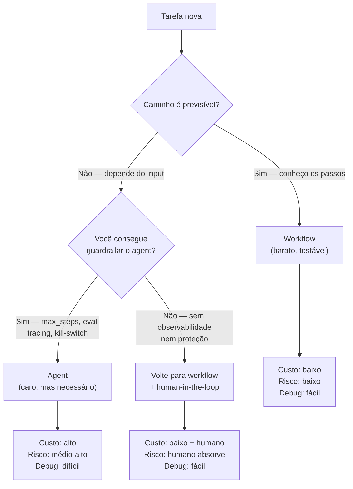

# Workflow vs Agent — quando usar cada um

> [!abstract] TL;DR
> A decisão arquitetural mais consequente em sistemas com [[Dicionário de IA#LLM (Large Language Model)|LLM]]: **workflow** quando o caminho é previsível, **agent** quando o caminho precisa ser descoberto em runtime. Workflow é mais barato, mais testável, mais debugável — e resolve a maioria dos casos. Agent é mais caro, mais frágil, propenso a loop infinito — e ainda assim é necessário quando a tarefa exige escolha dinâmica de ferramentas e iteração de plano. A regra cardinal da Anthropic: *"workflows when you can, agents when you must"*. Não construa agent por padrão.

## A distinção da Anthropic

O artigo *Building Effective Agents* (Anthropic, 2024) cristalizou o vocabulário usado hoje na indústria:

- **Building blocks** — átomos: LLM + retrieval + tools + memory.
- **Workflows** — building blocks orquestrados em **caminho predefinido** por código. O programador desenha o fluxo; o LLM preenche os nós.
- **Agents** — LLM em **loop dinâmico**, decidindo a próxima ação a cada iteração até alcançar uma condição de parada.

A diferença não é binária — é um espectro. Mas a divisão ajuda a escolher a abordagem certa para a tarefa certa, em vez de tratar tudo como agent porque "agent é o que está em alta".

## Quando workflow é melhor

- **Passos conhecidos** — você consegue desenhar o flowchart inteiro antes de rodar uma linha.
- **Ferramentas fixas** — cada passo usa uma tool específica, sem escolha em runtime.
- **Risco baixo de divergência** — não há perigo de o sistema "se perder" no caminho.
- **Confiabilidade > flexibilidade** — você prefere errar de forma previsível a errar de forma criativa.
- **Custo controlado** — workflow gasta tokens proporcionais ao número de passos; agent pode espiralar.
- **Testes fáceis** — cada nó testável isoladamente, com inputs/outputs claros.
- **Compliance ou auditoria** — caminho fixo facilita justificar cada decisão.

Exemplos: pipelines de classificação, [[Dicionário de IA#RAG (Retrieval-Augmented Generation)|RAG]] tradicional, geração de relatórios com seções fixas, triagem de tickets, ETL com etapas LLM.

## Quando agent é melhor

- **Passos desconhecidos** — você não consegue desenhar o flowchart porque ele depende do input.
- **Escolha dinâmica de tools** — qual ferramenta usar depende do que foi observado no passo anterior.
- **Planejamento iterativo** — o plano precisa ser revisado conforme novos resultados aparecem.
- **Busca aberta** — tarefas exploratórias onde não há fim definido por código.
- **Guardrails robustos disponíveis** — você consegue limitar `max_steps`, validar ações destrutivas, monitorar custo.
- **Trade-off aceitável** — você aceita pagar mais por flexibilidade real.

Exemplos: [[Agentes de Codificação|coding agents]] (Claude Code, Cursor), agents de pesquisa multi-hop, automação de browser para tarefas variadas, debugging assistido.

## A árvore de decisão



A pergunta verdadeira não é "workflow ou agent?" — é "tenho infraestrutura para operar agent com segurança?". Sem [[09 - Evaluation de agents|evaluation]], [[Dicionário de IA#Observability|observabilidade]] e [[Dicionário de IA#Guardrail|guardrails]], agent vira caixa-preta cara.

## Templates pseudo-code

Workflow tem forma de **receita** — passos numerados, entradas explícitas, ponto de aprovação opcional, comportamento em falha definido.

```text
workflow [workflow_name]:
  trigger: [trigger]
  input: [input_1], [input_2]
  steps:
    1. [step_1]
    2. [step_2]
    3. [step_3]
  approval_required_before: [action]
  output: [final_output]
  failure_handling: if [failure], then [response]
```

Agent tem forma de **loop** — plano gerado dinamicamente, próxima ação escolhida em cada iteração, condições de parada e de falha checadas a cada passo.

```text
agent_loop(goal):
  plan = create_plan(goal)
  while not complete:
    next_action = choose_next_action(plan, observations)
    if requires_approval(next_action):
      ask_for_approval(next_action)
    result = execute(next_action)
    observations.append(result)
    plan = update_plan(goal, observations)
    if stopping_condition_met: complete = true
    if failure_condition_met: stop_and_ask_for_help()
  return final_output
```

Repare na assimetria: workflow tem `steps:` listados; agent tem `while not complete:`. Essa é a diferença essencial — caminho declarado vs caminho descoberto.

## Custos e riscos

Agent não é "workflow com mais inteligência" — é uma máquina mais cara e mais frágil. Os custos não são só financeiros:

- **Tokens** — cada chamada de tool replica o contexto inteiro do agent. Um agent com 20 iterações pode custar 50x mais que um workflow equivalente. Ver [[Economia de Tokens|03 - Por que agentes gastam tanto]].
- **Avaliação** — workflow se avalia output a output. Agent exige avaliação de **trajetória** (a sequência de decisões), não só do resultado final. Ferramentas como golden set perdem força porque o caminho varia.
- **Loops infinitos** — agent sem `max_steps` ou sem condição de parada robusta pode iterar até estourar budget. Caso clássico: tentar a mesma tool repetidamente com input ligeiramente diferente.
- **Debug difícil** — quando algo dá errado, você precisa reconstruir o estado interno (plano + observations) pra entender por que o agent escolheu aquela ação. Sem [[Dicionário de IA#tracing|tracing]] estruturado, é forense.
- **Falhas criativas** — workflow falha de jeito previsível. Agent inventa formas novas de falhar — chama tool errada, alucina parâmetro, prefere a solução errada por "raciocínio" mal-construído.

## Padrão híbrido

Sistemas reais raramente são puro workflow ou puro agent. O padrão mais comum em produção é **orchestrator-workers**: um workflow externo determinístico que invoca **agents** apenas em sub-tarefas onde a flexibilidade é necessária. A Anthropic descreve esse pattern no próprio artigo *Building Effective Agents*.

Exemplo conceitual:

```text
workflow process_research_request:
  steps:
    1. classify_topic(input)                # LLM determinístico
    2. retrieve_initial_sources(topic)      # determinístico
    3. invoke agent(deep_research, sources) # agent com max_steps=10
    4. format_report(agent_output)          # determinístico
```

A pesquisa profunda é genuinamente exploratória — agent faz sentido ali. Mas classificar tópico, buscar fontes iniciais e formatar relatório são previsíveis — workflow puro é mais barato e confiável.

Detalhamento dessa coordenação em [[06 - Multi-agent — orchestrator e sub-agents]].

## Fontes

- **@hooeem** — *Become an AI Engineer*, capítulo #13 (Workflow vs Agent) e #18 Step 7 (templates pseudo-code).
- **Anthropic** — [*Building Effective Agents*](https://www.anthropic.com/research/building-effective-agents) (2024). Definição canônica de building blocks → workflows → agents e do padrão orchestrator-workers.

## Veja também

- [[05 - Planning — plan-then-execute, dynamic, hierarchical]] — estratégias de plano que mudam o perfil do agent
- [[06 - Multi-agent — orchestrator e sub-agents]] — orchestrator-workers em detalhe
- [[08 - Patterns comuns de agents]] — pattern 6 (workflow híbrido) e anti-patterns por confusão
- [[03-Dominios/Tecnologia/IA/AI Engineering Stack/08 - Workflow vs Agent Layer]] — esta decisão dentro do stack de engenharia
