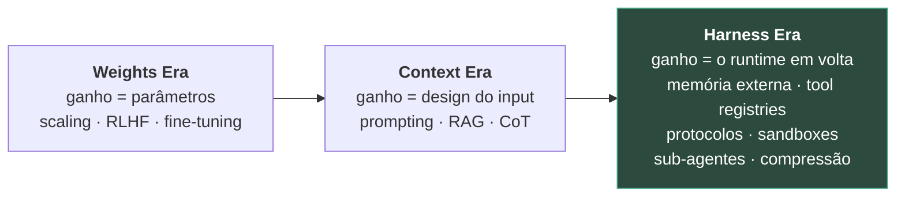
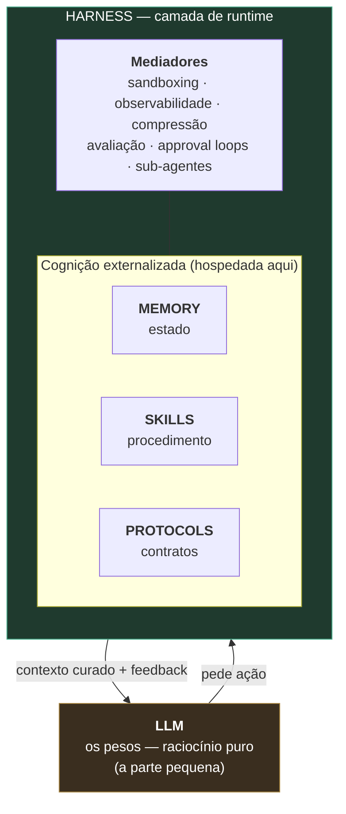
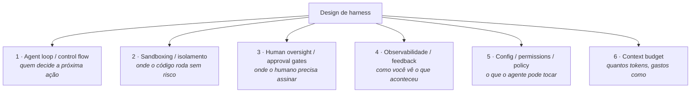
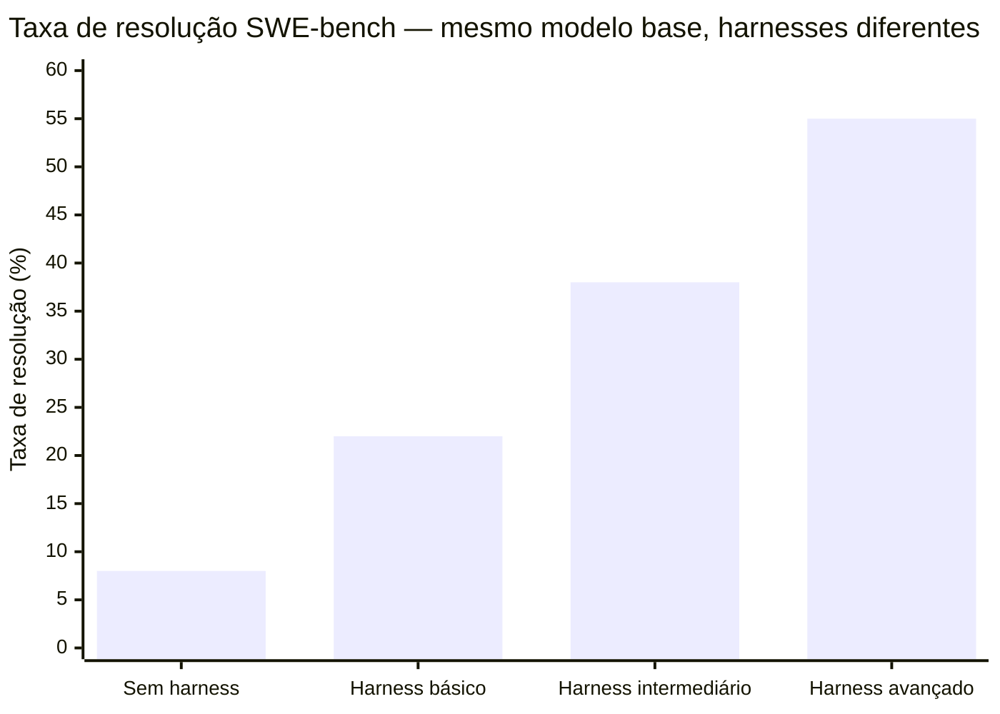

# Harness engineering — a terceira camada

A equipe atualizou o modelo de v1 para v2 e a performance do agent caiu 12%. Não era o modelo novo — em benchmarks isolados, v2 era claramente superior. O problema estava no harness: quinze hooks, prompts customizados e lógicas de retry construídos ao longo de seis meses para compensar limitações específicas do v1. Quando v2 chegou com raciocínio melhor e saídas mais estruturadas, algumas dessas compensações passaram a *brigar* com as capacidades naturais do novo modelo. Um sistema que não deveria existir — prompt que inibia tool-use paralelo porque v1 ficava confuso — agora causava regressão em v2, que lidava bem com paralelismo.

O diagnóstico levou duas semanas porque o time não sabia distinguir o que era capacidade do modelo e o que era artefato do harness. Não havia separação clara entre "decisão do modelo" e "comportamento injetado pelo runtime". A solução foi auditar o harness peça a peça, documentar o motivo de cada hook, e remover o que era compensação por limitação já resolvida.

Esse episódio captura a tese central desta nota: **o harness determina tanto quanto o modelo**. E por isso precisa ser tratado como um artefato de engenharia que envelhece, com ownership, ciclo de manutenção, e documentação do porquê de cada decisão — não só do quê.

> [!abstract] TL;DR
> O **harness** é a camada de runtime que envolve o [[Dicionário de IA#LLM (Large Language Model)|LLM]] e transforma capacidade bruta em ação governada: memória externa, registries de tools, protocolos, sandboxes, orquestração de sub-agentes e pipelines de compressão. Em 2026 o campo o nomeou como a **terceira era** da capacidade de agentes — depois dos *pesos* e do *contexto* — e começou a formalizá-lo academicamente. A tese dura, repetida da academia à Anthropic: **boa parte do ganho que se credita ao "modelo novo" é na verdade do harness.** Mas há um porém honesto — existem pelo menos quatro taxonomias concorrentes do harness e **nenhuma venceu**; trate-as como lentes complementares, não como verdade assentada.

## Por que o LLM é a parte pequena do agente

A imagem intuitiva de um agente é "um modelo com ferramentas parafusadas". A arquitetura real inverte isso. O modelo é deliberadamente **fino** — uma engine de raciocínio que, sozinha, não lê um arquivo, não consulta um banco, não lembra do que fez ontem. Toda a inteligência *operacional* é empurrada pra fora e composta em runtime por uma camada que a literatura de 2026 batizou de **harness**.

> [!info] A analogia do sistema operacional
> Se o modelo é a **CPU** — poder de processamento cognitivo bruto —, o harness é o **sistema operacional**: cura o contexto, faz o "boot" da sessão, provê os drivers (o tratamento de tools) e governa a execução. A frase que captura a divisão de trabalho: *"the harness does not reason; it executes"*. Quando o agente decide ler um arquivo, o modelo não realiza a ação — ele **pede**, e o harness orquestra num ambiente controlado e devolve o resultado pro contexto.

A consequência prática é elegante: *"a lightweight harness abstracts the infrastructure away from the LLM, allowing developers to easily swap out the underlying 'CPU' without rewriting the 'Operating System'"*. Trocar o modelo deveria ser trocar a CPU, não reescrever o SO inteiro.

## As três eras: pesos → contexto → harness

O survey de abril/2026 que unificou esse vocabulário (*Externalization in LLM Agents*, arXiv:2604.08224) propõe uma progressão histórica de **onde vem o ganho de capacidade**:

Por que isso não é só renomear "engenharia de software de agentes"? Porque cada era esgotou o retorno marginal da anterior. Empilhar parâmetros tem custo crescente e retorno decrescente; refinar o prompt resolve muito, mas bate num teto quando a tarefa é longa e o estado não cabe na janela. O que sobra — e é onde 2025-2026 concentrou o avanço — é **a engenharia do que cerca o modelo**. Martin Fowler resumiu na forma mais curta possível: *"Agent = Model + Harness"*.

> [!summary]
> A "terceira camada" não substitui as duas primeiras — soma a elas. A pergunta mudou de *"qual modelo?"* pra *"qual modelo **dentro de qual harness**?"*.

## A decomposição funcional: Memory, Skills, Protocols — e o harness que as hospeda

O mesmo survey oferece a decomposição funcional mais citada do que um agente externaliza. São **três dimensões** de cognição externalizada, mais o harness que as abriga:

- **Memory** — o estado que o modelo não deveria carregar nos pesos nem na janela: contexto de trabalho, conhecimento semântico, experiência episódica e memória personalizada, cada um com seu próprio ciclo de vida. (No vault: [[Memória de Agentes]] inteira, e [[04 - Memory em agents]].)
- **Skills** — o conhecimento *procedural*: procedimentos operacionais, heurísticas de decisão e restrições normativas que especializam o modelo geral por tarefa. (No vault: [[03-Dominios/Tecnologia/IA/Context Engineering/11 - Skills e instructions como contexto|Skills como contexto]] e [[03-Dominios/Tecnologia/IA/Claude Code/Skills e MCP/index|Skills e MCP]].)
- **Protocols** — os *contratos de interação*: agente↔usuário, agente↔agente e agente↔tools são três superfícies distintas, cada uma com seus modos de falha. (No vault: [[MCP]].)

A nuance que separa quem leu o paper de quem leu o resumo de LinkedIn:

> [!warning] O harness NÃO é uma quarta forma de externalização
> *"The harness is the engineering layer that hosts all three dimensions and provides the orchestration logic, constraints, observability, and feedback loops that make externalized cognition cohere in practice... not a fourth kind of externalization... it is the runtime environment within which these forms operate."* Memory, Skills e Protocols são **o que** se externaliza; o harness é **onde** isso roda.

Entre o núcleo-harness e os três módulos ficam os **mediadores** — *sandboxing, observabilidade, compressão, avaliação, approval loops e orquestração de sub-agentes*. Eles governam como o harness alcança o mundo e como o estado volta pra dentro.

A pergunta de projeto que esse mapa destrava: **para qualquer capacidade nova, onde ela mora?** Conhecimento estável vai pra Memory; playbook aprendido vira Skill; contrato de comunicação vira Protocol; governança de loop vira mediador. *Harness design becomes a question of what to externalize, and how to mediate it.*

## Quatro mapas do mesmo território

Aqui está o achado honesto que o senso comum esconde: **não há uma taxonomia canônica do harness.** Há pelo menos quatro, propostas em 2026 por grupos diferentes, e — crucial — três delas são *não* peer-reviewed e refletem a lente dos próprios autores. Saber que elas competem é mais valioso que decorar qualquer uma.

| Taxonomia | Origem | Eixos / componentes | Status |
|---|---|---|---|
| **Memory / Skills / Protocols + Harness** | Survey arXiv:2604.08224 (abr/2026) | 3 externalizações hospedadas por 1 runtime | preprint |
| **6 dimensões analíticas** | Mesmo survey, §6.2 | loop/control flow · sandboxing · human oversight · observabilidade · config/policy · context budget | preprint |
| **11 aspectos** | NLAHs, Pan et al. (arXiv:2603.25723, mar/2026) | agent loops · tool design · context eng · filesystem · memory/state · validação/parada · safety/sandbox · runtime defaults · observabilidade/replay · retry/recovery · budget | preprint |
| **CAR — Control / Agency / Runtime** | *Harness Engineering for Language Agents* (preprint, abr/2026) | que instruções continuam autoritativas (Control) · que ações estão disponíveis (Agency) · como estado/falha atravessam o tempo (Runtime) | preprint, audita 63 trabalhos |
| **5 pilares operacionais** | Glosa [[02-Glosas/2026-ai-agent-harness-5-core-pillars\|AIQuinta]] (abr/2026) | tool orchestration · context/memory · sub-agentes · guardrails/HITL · observabilidade | blog |
| **7 componentes autoráveis** | Playbook Anthropic / Claude Code | CLAUDE.md · hooks · skills · plugins · MCP · LSP · subagents | prática industrial |

> [!question]- Por que tantas taxonomias, e o que fazer com isso?
> Porque o campo é jovem e ninguém ganhou o direito de definir o vocabulário ainda. Repare que as listas **não são contraditórias** — são cortes diferentes do mesmo objeto. A do survey é *"o que se externaliza"*; a CAR é *"o que o harness decide"*; a de 11 aspectos é *"que perguntas de projeto responder"*; a da Anthropic é *"que artefatos eu escrevo"*. Use-as como lentes: quando estiver desenhando, a CAR pergunta as coisas certas; quando estiver auditando seu setup, os 7 componentes da Anthropic são acionáveis. **O fato de nenhuma ter vencido é, ele mesmo, o estado da arte de junho/2026.**

## As seis dimensões analíticas do design de harness

Das taxonomias acima, a mais útil como *checklist de projeto* é a das seis dimensões do survey (§6.2). Tratar harness como disciplina de engenharia estruturada significa decidir conscientemente cada uma:

Cada dimensão tem um galho do vault que a aprofunda: o **loop** em [[02 - O loop ReAct e native tool use]] e [[03-Dominios/Tecnologia/IA/Claude Code/Mental Model/01 - O loop agentic|O loop agentic]]; **sandboxing/permissions** em [[Segurança e Guardrails]] e [[03-Dominios/Tecnologia/IA/Claude Code/Hooks e Guardrails/index|Hooks e Guardrails]]; **observabilidade** em [[Observability]]; **context budget** em [[Context Engineering]] e [[Economia de Tokens]]. O harness, nesse sentido, não é um galho novo — é o **nome da costura** entre os galhos que você já tem.

> A variação de 8% para 55% com o **mesmo modelo** ilustra a tese CAR: muito do que se credita a "modelo melhor" em leaderboards é ganho de harness. Um HarnessCard — reportando o contexto de execução além do modelo — seria necessário para comparações honestas.

## Ganhos harness-sensitive: por que o benchmark mente um pouco

Aqui está a contribuição mais afiada de 2026, do preprint *Harness Engineering for Language Agents* (a proposta CAR). Os autores argumentam que muito do ganho de performance reportado de agentes é **atribuível à camada de harness, não ao modelo base** — *"many reported agent gains may be partly harness-sensitive rather than purely model-driven"*.

Pense no que isso quer dizer pra forma como lemos um leaderboard. Quando o "Modelo X v2" sobe 8 pontos no SWE-bench, quanto disso é o modelo e quanto é o scaffold de execução que rodou em volta dele? Hoje, os rankings confundem as duas coisas. A proposta dos autores é um artefato leve de reporte — o **HarnessCard** — para que *"progress in language agents should report not only the model, but also the harness layer that turns capability into governed action"*.

> [!example] Onde isto morde no vault
> Essa é a versão acadêmica da tese que a nota [[03-Dominios/Tecnologia/IA/Claude Code/Mental Model/09 - O harness como terceira camada|O harness como terceira camada]] já defendia em escala prática: *"the ecosystem built around the model — the harness — determines how Claude Code performs more than the model alone"*. Para a disciplina de [[Evaluation]], a implicação é concreta: um eval que não fixa o harness está medindo uma variável confundida.

> [!warning] Armadilha: benchmark sem HarnessCard mede a variável errada
> Um número de leaderboard sozinho — "Modelo X: 55% no SWE-bench" — não diz se o ganho veio do modelo ou do scaffold que rodou em volta dele. Sem reportar o harness (ou fixá-lo como controle), dois times podem rodar o "mesmo" benchmark com harnesses diferentes e tirar conclusões opostas sobre qual modelo é melhor — quando na verdade compararam qual *harness* era melhor. É o mesmo erro metodológico de comparar resultado de experimento sem controlar a variável que mais pesa. A implicação prática, de novo: antes de decidir "trocar de modelo" a partir de um benchmark, pergunte que harness gerou aquele número — e se o seu está no mesmo patamar.

> [!caution] Honestidade sobre a fonte
> O HarnessCard e a decomposição CAR vêm de um **preprint não peer-reviewed**; é uma *posição argumentada*, não um achado validado pela comunidade. Cite como proposta, não como consenso.

## A disputa em aberto: um agente ou muitos?

Se há uma pergunta que o campo **não** resolveu, é esta: um único agente generalista performa melhor, ou a melhor performance vem de uma arquitetura multi-agente? A própria Anthropic, no fim de 2025, deixou explícito que está em aberto — *"it's still unclear whether a single, general-purpose coding agent performs best across contexts, or if better performance can be achieved through a multi-agent architecture."*

Os dados disponíveis pedem ceticismo com o hype multi-agente: estudos comparativos mostram ganhos frequentemente **marginais (~4% relativo) a um custo de compute ~4x maior**, e há tarefas onde um único agente com few-shot vence. Editorialmente a Anthropic se inclina a multi-agente como *direção* para 2026 — mas direção não é ciência assentada. Detalhe da mecânica em [[06 - Multi-agent — orchestrator e sub-agents]].

## "Build to delete": o harness envelhece

Um harness não é set-and-forget. O conselho que atravessa as fontes é *"build to delete"*: mantenha-o **modular**, não superengenheire o control flow, confie no raciocínio do modelo e deixe a camada pronta pra adaptar quando a próxima geração de modelos chegar. Instruções escritas pro modelo de hoje podem **trabalhar contra** o de amanhã — um hook que compensava uma limitação vira ruído quando a limitação some. O tratamento prático dessa manutenção (ciclo de 3-6 meses, sinais de drift, ownership) está em [[03-Dominios/Tecnologia/IA/Claude Code/Mental Model/09 - O harness como terceira camada|O harness como terceira camada]].

> [!warning] Armadilha: hook compensatório que sobrevive à limitação que o motivou
> É exatamente o episódio que abre esta nota: um prompt que inibia tool-use paralelo porque v1 "ficava confuso" continuou vivo depois que v2 chegou lidando bem com paralelismo — e passou a *brigar* com a capacidade nova em vez de proteger uma fraqueza que já não existia. O padrão generaliza: toda peça do harness escrita para compensar uma limitação específica do modelo carrega uma data de validade implícita, amarrada ao ciclo de vida daquele modelo. Sem documentar *por que* o hook existe (não só o que ele faz), ninguém sabe quando ele parou de proteger e começou a atrapalhar — e a auditoria vira arqueologia de duas semanas, como no caso real.

## Onde cada peça mora — o mapa do vault

O valor de nomear o harness é que ele organiza galhos que pareciam soltos. Use este mapa como índice funcional:

| Função do harness | Galho que aprofunda |
|---|---|
| Estado externalizado (Memory) | [[Memória de Agentes]] · [[04 - Memory em agents]] |
| Curadoria de contexto / budget | [[Context Engineering]] · [[Economia de Tokens]] |
| Procedimento (Skills) + protocolos | [[03-Dominios/Tecnologia/IA/Claude Code/Skills e MCP/index\|Skills e MCP]] · [[MCP]] |
| Loop / control flow | [[02 - O loop ReAct e native tool use]] · [[03-Dominios/Tecnologia/IA/Claude Code/Mental Model/01 - O loop agentic\|O loop agentic]] |
| Sandboxing / approval / policy | [[Segurança e Guardrails]] · [[03-Dominios/Tecnologia/IA/Claude Code/Hooks e Guardrails/index\|Hooks e Guardrails]] |
| Observabilidade / feedback | [[Observability]] |
| Avaliação (do modelo **e** do harness) | [[Evaluation]] |
| Orquestração de sub-agentes | [[06 - Multi-agent — orchestrator e sub-agents]] |
| Instanciação concreta (Claude Code) | [[03-Dominios/Tecnologia/IA/Claude Code/Mental Model/09 - O harness como terceira camada\|O harness como terceira camada]] |

## Como explicar em inglês

Harness engineering is the discipline of designing the runtime layer that wraps an LLM and transforms raw model capability into governed, reliable action. The model is the reasoning engine — it decides what to do next — but it cannot read files, query databases, remember what it did yesterday, or enforce safety constraints on its own. All of that operational intelligence is externalized into the harness: memory stores, tool registries, sandboxes, context compression pipelines, sub-agent orchestration, approval gates, and observability infrastructure. The 2026 academic framing names three eras of agent capability gains — the Weights Era (more parameters), the Context Era (better prompting and retrieval), and the Harness Era (better runtime engineering) — and argues that many reported agent performance gains are harness-sensitive rather than purely model-driven. The CAR decomposition (Control/Agency/Runtime) provides the most useful lens for harness design: Control is what instructions remain authoritative over what the model decides; Agency is what actions are available; Runtime is how state and failures persist across the loop over time. The practical implication for engineering: the harness ages independently of the model, compensating behaviors become liabilities when the model improves, and "build to delete" means keeping each harness component justifiable and removable.

| Português | English |
|---|---|
| harness (camada) | harness |
| engenharia de harness | harness engineering |
| externalização cognitiva | cognitive externalization |
| era dos pesos | weights era |
| era do contexto | context era |
| era do harness | harness era |
| decomposição CAR | CAR decomposition (Control/Agency/Runtime) |
| ganhos harness-sensíveis | harness-sensitive gains |
| cartão de harness | HarnessCard |
| construir para deletar | build to delete |
| mediadores (harness) | harness mediators |
| loop de aprovação | approval loop |

## O que vem a seguir

Esta é a última nota do galho Anatomia de Agents — e não por acaso ela fecha em harness. O galho começou perguntando "o que é um agent" ([[01 - O que é um agent]]), passou pelo loop que decide a próxima ação ([[02 - O loop ReAct e native tool use]]), pelo estado que sobrevive entre passos ([[04 - Memory em agents]]), pela orquestração de múltiplos agentes ([[06 - Multi-agent — orchestrator e sub-agents]]) e pelo critério de quando vale a pena montar tudo isso ([[10 - Workflow vs Agent — quando usar cada um]]). O harness é onde essas peças soltas se juntam num runtime só — por isso ele fecha o galho em vez de abrir mais um tópico.

Mas fechar o galho não fecha o assunto. Cada dimensão funcional mapeada aqui — Memory, budget de contexto, avaliação — tem seu próprio galho no vault, com profundidade que esta nota deliberadamente não tenta replicar:

- **[[Context Engineering]]** aprofunda a dimensão 6 do checklist (context budget): como decidir o que entra na janela, quando comprimir, e por que "mais contexto" nem sempre é "melhor contexto". Se o harness é o SO, Context Engineering é o gerenciador de memória virtual — decide o que fica residente e o que vai pra disco.
- **[[Memória de Agentes]]** aprofunda a função Memory que esta nota só nomeia (estado externalizado): os ciclos de vida distintos de contexto de trabalho, conhecimento semântico e experiência episódica que [[04 - Memory em agents]] introduziu e que o survey de externalização usa como uma das três dimensões hospedadas pelo harness.
- **[[09 - Evaluation de agents]]**, a nota anterior neste mesmo galho, fecha o ciclo com a pergunta que esta nota deixa em aberto: se benchmarks sem HarnessCard medem variável confundida, como desenhar um eval que separa ganho de modelo de ganho de harness? É o loop de melhoria que valida — ou desmente — toda decisão de design discutida aqui.

O fio que amarra os três: harness é a camada que hospeda e governa; Context Engineering e Memória de Agentes são duas das coisas que ele governa; Evaluation é como você descobre se governou bem.

## Ver mais

- **Zhou et al. — *Externalization in LLM Agents: A Unified Review*** (arXiv:2604.08224, 2026): O survey mais abrangente sobre o que agentes externalizam — Memory, Skills, Protocols — e o harness como runtime que hospeda tudo isso. A progressão weights→context→harness vem daqui. *Preprint.*
- **Anthropic Applied AI — *Effective harnesses for long-running agents*** (anthropic.com/engineering, nov/2025): A perspectiva prática da Anthropic sobre design de harness com o Claude Agent SDK — o que "build to delete" significa em produção e como o Claude Code instancia os princípios desta nota.
- **Harness Engineering for Language Agents** (preprints.org:10.20944/preprints202603.1756, abr/2026): Propõe a decomposição CAR e o HarnessCard, e argumenta que performance em benchmarks deve reportar o harness junto ao modelo. Inclui auditoria de 63 trabalhos anteriores. *Preprint, não peer-reviewed — vocabulário emergente.*

## Fontes

- **Chenyu Zhou, Zhuosheng Zhang, Weinan Zhang et al.** — [*Externalization in LLM Agents: A Unified Review of Memory, Skills, Protocols and Harness Engineering*](https://arxiv.org/html/2604.08224v1) (arXiv:2604.08224, abr/2026). Decomposição Memory/Skills/Protocols + harness-runtime; as 6 dimensões analíticas; a progressão weights→context→harness. *Preprint, não peer-reviewed.*
- **Anthropic Applied AI** — [*Effective harnesses for long-running agents*](https://www.anthropic.com/engineering/effective-harnesses-for-long-running-agents) (nov/2025). Claude Agent SDK como *"general-purpose agent harness"*; "build to delete".
- **Pan et al.** — [*Natural-Language Agent Harnesses*](https://arxiv.org/pdf/2603.25723) (arXiv:2603.25723, mar/2026). Os 11 aspectos da engenharia de harness. *Preprint.*
- **Harness Engineering for Language Agents: The Harness Layer as Control, Agency, and Runtime** — [preprint 10.20944/preprints202603.1756](https://www.preprints.org/manuscript/202603.1756) (abr/2026). Decomposição CAR; tese "harness-sensitive gains"; proposta HarnessCard. *Preprint, não peer-reviewed.*
- [[02-Glosas/2026-ai-agent-harness-5-core-pillars|What is an AI Agent Harness? 5 Core Pillars]] — Duc Nguyen (AIQuinta, abr/2026). A analogia CPU/SO e os 5 pilares operacionais.

## Veja também

- [[03-Dominios/Tecnologia/IA/Claude Code/Mental Model/09 - O harness como terceira camada|O harness como terceira camada (Claude Code)]] — a instanciação concreta deste conceito num harness real
- [[01 - O que é um agent]] — o que o harness está cercando
- [[06 - Multi-agent — orchestrator e sub-agents]] — a disputa um-agente-vs-muitos em detalhe
- [[10 - Workflow vs Agent — quando usar cada um]] — quando você sequer precisa de um harness de agente
- [[Context Engineering]] · [[Memória de Agentes]] · [[Evaluation]] — as dimensões funcionais aprofundadas
