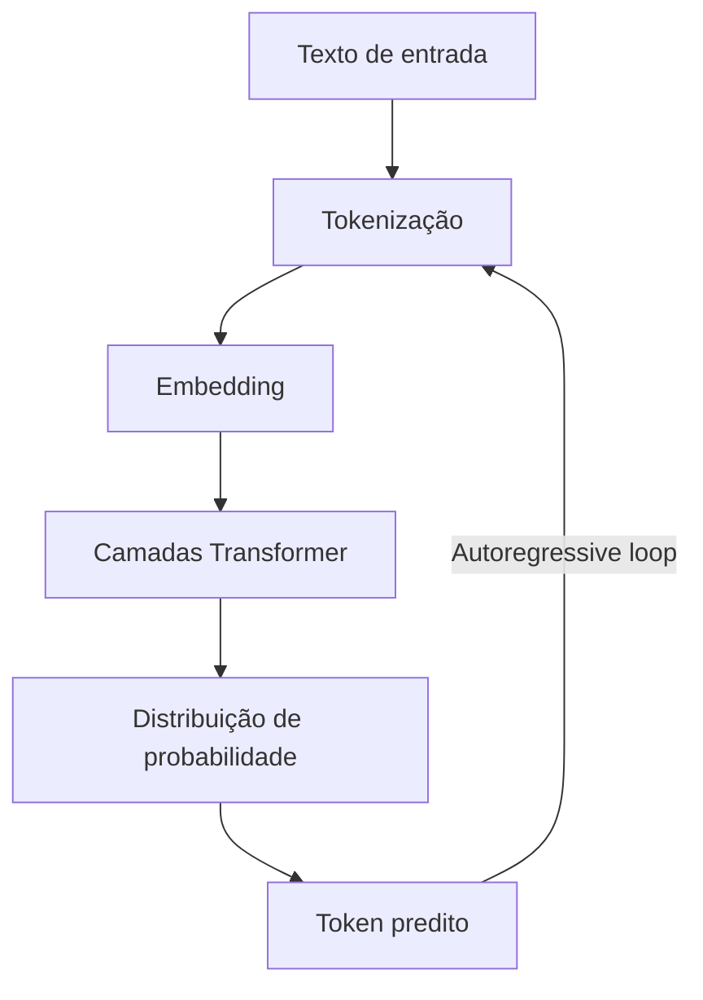

# O que é um LLM

> [!abstract] TL;DR
> Um Large Language Model é uma rede neural treinada em bilhões de tokens de texto para prever a próxima palavra — e, por extensão, para raciocinar, gerar código, traduzir e conversar. Em 2026, LLMs são a infraestrutura central da engenharia de software assistida por IA, com modelos que variam de 7 bilhões a mais de 1 trilhão de parâmetros e custam desde zero (open-weight) até centenas de dólares por milhão de tokens.

> [!tip] Comece pelos vídeos
> Dois explicadores conceituais para ver antes (ou junto) da leitura — o mecanismo de "prever a próxima palavra" em forma visual.

**Em inglês — 3Blue1Brown (8 min), a animação que popularizou o tema:**


**Em português — Curso em Vídeo / Guanabara (~19 min), com mais calma:**


## O que é

Um **Large Language Model** (LLM) é um modelo de machine learning baseado na arquitetura **[[Dicionário de IA#transformer|Transformer]]** que aprende padrões estatísticos de linguagem a partir de quantidades massivas de texto. O treinamento consiste essencialmente em uma tarefa: dado um contexto de [[Dicionário de IA#Token|tokens]] anteriores, prever o próximo token. Essa tarefa simples, repetida trilhões de vezes sobre corpora enormes, produz modelos capazes de:

- **Gerar texto** coerente e contextualmente relevante
- **Raciocinar** sobre problemas lógicos e matemáticos
- **Escrever e depurar código** em dezenas de linguagens
- **Traduzir** entre idiomas naturais e formais
- **Seguir instruções** complexas e multi-step

Uma capacidade merece destaque: o **in-context learning** — o modelo aprende uma tarefa nova só a partir de exemplos colocados no prompt (*few-shot*), sem nenhum ajuste de pesos, generalizando o padrão durante a própria inferência. É isso que faz *prompting* funcionar.

O termo "large" refere-se à escala de parâmetros — os pesos numéricos que codificam o conhecimento do modelo. Vale a analogia de Grant Sanderson (3Blue1Brown): treinar um LLM é como **ajustar os botões de uma máquina gigantesca**. Cada "botão" é um parâmetro; ninguém os ajusta à mão — eles começam aleatórios (o modelo só cospe ruído) e o treino os afina trilhões de vezes até as previsões ficarem boas. O que põe o "large" no nome é justamente a quantidade: **centenas de bilhões** desses botões. Modelos modernos variam de ~7B (bilhões) de parâmetros (executáveis em hardware de consumo) até >1T (trilhão), acessíveis apenas via API ou clusters de GPUs.

> [!info] A escala do treino é difícil de imaginar
> Para ter noção do volume de texto: se um humano lesse sem parar, 24 horas por dia, todo o corpus usado para treinar o GPT-3, levaria **mais de 2.600 anos** — e os modelos desde então treinam em muito, muito mais. (3Blue1Brown, *LLMs explained briefly*.)

### O mecanismo, concretamente

Toda essa capacidade nasce de uma única operação — e vale vê-la em ação antes de seguir. Dê ao modelo o trecho:

> `O céu é ___`

O LLM não "decide" a próxima palavra. Ele calcula uma **distribuição de probabilidade sobre todo o vocabulário** — um número para cada um dos ~100 mil tokens possíveis:

```
azul    ████████████  55%
claro   ██             9%
lindo   █              6%
escuro  █              5%
...     (mais ~100 mil tokens, cada um com uma fatia minúscula)
```

Em seguida ele **escolhe um** token (em geral o mais provável, mas nem sempre — esse "nem sempre" é o tema da [[05 - Completação — o loop autoregressivo|completação]]), **anexa ao texto** e repete a conta: agora a entrada é `O céu é azul` e ele prevê o próximo token. Uma redação inteira, um programa, uma demonstração matemática — tudo sai dessa mesma operação repetida token a token. **Tudo o que um LLM faz é consequência de prever a próxima palavra bem o suficiente.**

## Por que importa

Sem entender o que é um LLM, um engenheiro de software cai em três armadilhas:

1. **Antropomorfismo** — tratar o modelo como um colega que "entende" e "pensa", quando na verdade ele calcula distribuições de probabilidade sobre tokens
2. **Caixa preta** — usar a ferramenta sem entender por que ela falha, alucina ou custa caro
3. **Decisões cegas** — escolher modelo errado para a tarefa (pagar caro por [[Dicionário de IA#flagship model|flagship]] quando um modelo budget resolve, ou usar budget onde precisa de reasoning)

## Como funciona

### O ciclo fundamental



1. **Tokenização** — o texto é quebrado em unidades chamadas tokens (ver [[02 - Tokens e tokenização]])
2. **[[Dicionário de IA#embedding|Embedding]]** — cada token é convertido em um vetor numérico de alta dimensão
3. **Processamento** — os vetores passam por dezenas de camadas Transformer com mecanismo de atenção (ver [[04 - Atenção e o mecanismo transformer]])
4. **Predição** — o modelo produz uma distribuição de probabilidade sobre todo o vocabulário para o próximo token
5. **Geração** — o token mais provável (ou um [[05 - Completação — o loop autoregressivo|amostrado]]) é selecionado, anexado ao texto, e o ciclo recomeça

> [!note] Determinístico, mas nunca igual
> Uma curiosidade que o 3Blue1Brown destaca (vídeo no topo da nota): o modelo em si é **determinístico** (mesmos pesos, mesma conta), mas a mesma pergunta costuma dar respostas diferentes a cada vez. O motivo é a **amostragem** — na hora de escolher o próximo token, deixa-se entrar um pouco de acaso. É o tema da [[05 - Completação — o loop autoregressivo|nota de completação]].

Esse ciclo descreve um modelo **já pronto**, rodando. Mas como ele chega a esse ponto? A construção de um LLM tem fases bem distintas — e cada uma deixa uma marca no comportamento final.

### Fases de construção de um LLM

| Fase                    | O que acontece                                                                 | Custo típico |
| ----------------------- | ------------------------------------------------------------------------------ | ------------ |
| **Pré-treino**          | Modelo aprende linguagem a partir de trilhões de tokens da web, livros, código | $10M–$100M+  |
| **SFT** *(supervised fine-tuning)* | Ajuste supervisionado: pares instrução→resposta de alta qualidade ensinam o modelo a *responder*, não só completar | $100K–$1M    |
| **RLHF / RLAIF**        | Alinhamento com preferências — *humanas* (RLHF) ou geradas por outro modelo de IA (RLAIF) — via reinforcement learning | $100K–$1M    |
| **Quantização**         | Compressão dos pesos para reduzir memória e custo de inferência                | Baixo        |

O que sai do **pré-treino** é um *base model*: um autocompletador puro, que continua qualquer texto mas não "responde" a instruções. O comportamento de assistente — seguir ordens, conversar, recusar — vem da camada fina de **post-training** (SFT + RLHF) aplicada sobre esse modelo-base. Por isso a mesma arquitetura de "prever o próximo token" produz tanto um autocomplete quanto um chatbot: a diferença está no que veio *depois* do pré-treino, não no mecanismo.

Essas fases produzem modelos de tamanhos e propósitos muito diferentes. O mercado de 2026 se organiza, grosso modo, em cinco categorias:

### Categorias de modelos (2026)

| Categoria | Exemplos | Parâmetros ativos | Uso típico |
|-----------|----------|-------------------|------------|
| **Frontier (flagship)** | GPT-5.4, Claude Opus 4.6, Gemini 3.1 Pro | 200B–1T+ | Raciocínio complexo, arquitetura |
| **Mid-tier** | Claude Sonnet 4.6, Gemini Flash | 50B–200B | Codificação diária, chat |
| **Budget** | GPT-4.1 Nano, Haiku 4.5, Flash-Lite | 7B–50B | Autocomplete, tarefas simples |
| **Open-weight** | Llama 4, DeepSeek V4, Qwen 3.6 | 7B–700B | Self-hosting, pesquisa, soberania |
| **Reasoning** | o4, Claude Thinking, Gemini Deep Think | Variável | Problemas matemáticos, lógica |

Repare na coluna *parâmetros ativos*: ela aponta para a decisão arquitetural mais importante de 2026.

### Dense vs MoE — a bifurcação arquitetural

A diferença mais importante entre modelos em 2026:

- **Dense** — todos os parâmetros são ativados para cada token. Simples, estável, mas caro em escala. Exemplo: Llama 3 70B.
- **Mixture-of-Experts (MoE)** — apenas um subconjunto de "especialistas" é ativado por token, via um roteador. Permite ter 1T de parâmetros totais com custo de [[Dicionário de IA#inference|inferência]] de um modelo de 100B. Exemplo: DeepSeek V4, Mixtral. Ver [[09 - Dense vs Mixture-of-Experts]].

## O quadro em 2026

Três deslocamentos recentes mudam o que "LLM" significa na prática — e nenhum deles aparece nas definições de 2020.

### LLM já não é só texto
Os modelos de fronteira de 2026 (GPT-5.x, Claude Opus 4.x, Gemini 3.x, Llama 4) são **nativamente multimodais**: processam imagem, áudio e vídeo no mesmo modelo, não como plugins acoplados. Tecnicamente são *[[Dicionário de IA#foundation model|foundation models]]* — o "L" de *Language* virou herança histórica. A tarefa de fundo segue idêntica (prever o próximo token); o que muda é que o vocabulário passa a incluir tokens de outras modalidades.
### A escala parou de ser o eixo
A premissa que definiu 2018–2023 — "mais parâmetros e mais dados = mais capacidade" — bateu em retornos decrescentes. Ilya Sutskever declarou na NeurIPS 2024 que "o pré-treino como o conhecemos vai acabar"; Sara Hooker batizou o fenômeno de *a morte lenta do scaling* (2026). O eixo de progresso migrou do **tamanho do modelo** para o **compute de inferência** — modelos de raciocínio que "pensam" mais antes de responder (ver [[15 - Reasoning models e chain-of-thought]]) — e para dados e treino melhores.

### "Capacidades emergentes" são contestadas
A ideia de que certas habilidades *surgem* de repente acima de uma escala crítica é disputada. Schaeffer et al. (2023) mostraram que muitas "emergências" são artefato da métrica escolhida. Um exemplo concreto: numa tarefa de somar números de 5 dígitos, medir por **acerto exato** (a conta inteira certa ou errada) mostra 0% por muito tempo e então um salto repentino — mas medir por **dígitos corretos** revela o modelo melhorando aos poucos o tempo todo. O "salto" era da régua, não do modelo: trocar a métrica descontínua (acerto/erro) por uma contínua faz a curva suave aparecer. Tratar emergência como fato consumado é arriscado.

## Glossário

| Termo              | Definição                                                              |
| ------------------ | ---------------------------------------------------------------------- |
| **Parâmetro**      | Um peso numérico aprendido durante o treinamento                       |
| **Token**          | Unidade mínima de texto que o modelo processa                          |
| **Inferência**     | O processo de gerar respostas a partir de um modelo treinado           |
| **Context window** | Quantidade máxima de tokens que o modelo pode "ver" de uma vez         |
| **Embedding**      | Representação vetorial de um token em espaço contínuo                  |
| **Autoregressive** | Geração sequencial: cada token depende dos anteriores                  |
| **Open-weight**    | Modelo com pesos públicos (não necessariamente open-source na licença) |

## Armadilhas

- **"A IA entende"** — LLMs calculam correlações estatísticas. Não entendem no sentido humano. Produzem texto plausível, não verdadeiro. [[Dicionário de IA#Hallucination|Alucinações]] são consequência direta disso.
- **"Maior é melhor"** — um modelo de 7B bem ajustado pode superar um flagship genérico em tarefas específicas, e modelos menores e mais novos batem os maiores e mais antigos: o Llama-3 8B (2024) superou o Falcon 180B (2023) em um ano; via destilação, um T5 de 770M chegou a igualar o PaLM 540B (redução de >700×). Tamanho importa, mas dados, treino e fine-tuning importam mais.
- **"Open-source = grátis"** — rodar um modelo de 70B localmente exige ~40GB de VRAM. O hardware tem custo significativo.
- **Ignorar a família do modelo** — cada família (GPT, Claude, Gemini, Llama) tem personalidade e pontos fortes diferentes. Testar em uma e assumir que serve para outra é receita para surpresa.

## O LLM em uma frase

Se for para guardar uma coisa só: **um LLM é uma máquina de prever o próximo token, treinada em escala absurda, cujas demais habilidades — raciocinar, programar, traduzir — emergem dessa única tarefa feita bem o suficiente.** Tudo o que vem a seguir neste galho destrincha as peças do ciclo que você viu aqui: como o texto vira tokens, como tokens viram vetores, o mecanismo de atenção que os processa, e como a resposta sai token a token.

E o começo desse ciclo é o primeiro passo do diagrama lá em cima — **quebrar o texto em tokens**. É exatamente onde a próxima nota pega: [[02 - Tokens e tokenização]].

## Veja também
- [[02 - Tokens e tokenização]] — como o texto vira números
- [[03 - Embeddings — do token ao vetor]] — como o ID do token vira um vetor com significado
- [[04 - Atenção e o mecanismo transformer]] — o mecanismo central da arquitetura
- [[05 - Completação — o loop autoregressivo]] — como o texto sai, token a token, e o papel da amostragem
- [[07 - Panorama de modelos 2026]] — quem é quem no mercado
- [[09 - Dense vs Mixture-of-Experts]] — a escolha arquitetural mais impactante
- [[18 - Como LLMs são treinados — pretraining, SFT, RLHF]] — pré-treino, SFT e RLHF em detalhe
- [[06 - A janela de contexto]] — o limite de tokens que o modelo enxerga
- [[15 - Reasoning models e chain-of-thought]] — o compute de inferência que virou o novo eixo
- [[20 - Compressão de modelos — quantização e destilação]] — por que um modelo menor pode bater um maior (o caso T5/PaLM)

## Como explicar em inglês

A **Large Language Model** (LLM) is a neural network trained on billions of tokens of text to predict the next token in a sequence. This single objective — given all previous context, what comes next? — when applied at massive scale, produces models capable of coding, reasoning, translating, and following complex instructions. The key mental model: an LLM doesn't "know" things in the human sense; it learns statistical correlations between tokens. When it generates text, it's sampling from a probability distribution over all possible next tokens. This is why it can produce confident-sounding hallucinations — there's no internal "truth flag," only what's statistically plausible given the context. In 2026, LLMs span from 7B open-weight models (running on consumer hardware) to 1T+ parameter frontier models (accessible only via API), organized into tiers by capability and cost.

| PT | EN |
|----|---|
| Modelo de linguagem grande | Large Language Model (LLM) |
| Parâmetros / pesos | Parameters / weights |
| Janela de contexto | Context window |
| Incorporação | Embedding |
| Geração autoregressiva | Autoregressive generation |
| Aprendizado em contexto | In-context learning |
| Modelo de pesos abertos | Open-weight model |
| Modelo de fronteira | Frontier model |
| Modelos de mistura de especialistas | Mixture of Experts (MoE) |
| Capacidades emergentes | Emergent capabilities |
| Alucinação | Hallucination |

## Ver mais

- [Andrej Karpathy — *[1hr Talk] Intro to Large Language Models*](https://www.youtube.com/watch?v=zjkBMFhNj_g) (2023, 1h) — a palestra-panorama que mapeia o campo inteiro: o que é o modelo, como é treinado, para onde vai. O melhor próximo passo em vídeo depois dos 8 minutos do 3Blue1Brown.
- [Andrej Karpathy — *Deep Dive into LLMs like ChatGPT*](https://www.youtube.com/watch?v=7xTGNNLPyMI) (2025, 3h31) — o mergulho longo e completo: tokenização, treino, pós-treino e inferência destrinchados. Para quando a curiosidade virar compromisso.

## Referências
- **Vaswani et al.** — *Attention Is All You Need* (2017). O paper que introduziu a arquitetura Transformer.
- **Brown et al.** — *Language Models are Few-Shot Learners* (GPT-3, 2020). Popularizou o *in-context learning* e a tese de que escala gera capacidades emergentes — tese hoje contestada (ver Schaeffer et al., 2023).
- **Raschka, Sebastian** — *Build a Large Language Model from Scratch* (2024). Guia prático de construção de LLMs.
- **Clarifai** — *LLM Architecture Explained* (2026). Overview das arquiteturas modernas.
- **Schaeffer et al.** — [*Are Emergent Abilities of Large Language Models a Mirage?*](https://arxiv.org/abs/2304.15004) (2023). Argumenta que boa parte da "emergência" é artefato da métrica escolhida.
- **Raschka, Sebastian** — [*Base vs. Instruct vs. Reasoning Models*](https://sebastianraschka.com/faq/docs/base-vs-instruct-vs-reasoning-model.html) (FAQ). Distingue os tipos de modelo pelo estágio de treino.
- **Hooker, Sara** — [*On the Slow Death of Scaling*](https://papers.ssrn.com/sol3/papers.cfm?abstract_id=5877662) (2026). A virada do eixo escala→adaptabilidade; exemplos de modelos pequenos superando grandes.
- **Google Research** — [*Distilling Step-by-Step*](https://research.google/blog/distilling-step-by-step-outperforming-larger-language-models-with-less-training-data-and-smaller-model-sizes/) (2023). Um T5 de 770M iguala o PaLM 540B via destilação.
- **Aditya J.** — [*Beyond Text: The Rise of Large Multimodal Models — A 2026 Deep Dive*](https://medium.com/@adityaj5400/beyond-text-the-rise-of-large-multimodal-models-a-2026-deep-dive-0843292fa048) (2026). Multimodalidade nativa como padrão nos modelos de fronteira.
- **3Blue1Brown (Grant Sanderson)** — [*Large Language Models explained briefly*](https://www.youtube.com/watch?v=LPZh9BOjkQs) (2024). Intro visual ao mecanismo de prever o próximo token; origem da analogia dos "botões" e do dado dos 2.600 anos de leitura usados no corpo desta nota.
