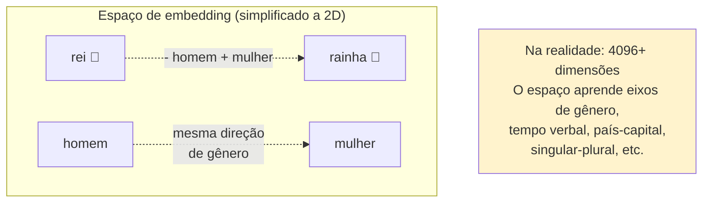
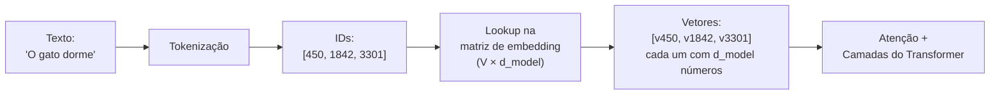

# Embeddings — do token ao vetor

> [!abstract] TL;DR
> Um **embedding** é a tradução de um token em uma lista de números (um vetor) que o modelo consegue processar. O passo anterior — [[02 - Tokens e tokenização|tokenização]] — quebra o texto em tokens e dá a cada um um número de identidade (ID). Esse ID, sozinho, não tem significado. O embedding resolve isso: troca o ID por um vetor de centenas ou milhares de números, aprendido durante o treino, posicionado num espaço onde **significados parecidos ficam perto**. É por isso que o modelo "sabe" que *rei* e *rainha* são parentes e que *rei* e *mesa* não são — a semelhança virou distância geométrica.

> [!tip] Comece pelo vídeo
> Sandeco (Decomplicated IA) mostra, em ~18 minutos e em português, como o GPT transforma cada palavra em vetor — exatamente o tema desta nota:


## O que é

A nota anterior fechou com uma pergunta em aberto: o token virou um número (`"gato"` → `1842`), e um número sozinho não significa nada — como o modelo extrai *sentido* de um índice? Esta nota responde.

Depois da [[02 - Tokens e tokenização|tokenização]], cada token vira um **ID inteiro** — uma posição no vocabulário (ex: `"gato"` → token `1842`). Mas o número `1842` não carrega nenhum significado: é só um endereço. Token `1843` poderia ser `"geladeira"`, sem nenhuma relação, mesmo o número estando colado.

Um **embedding** é o vetor que substitui esse ID por significado processável:

```
token "gato"  → ID 1842 → [ 0.12, -0.88,  0.34, ...,  0.21 ]
token "felino"→ ID 5530 → [ 0.15, -0.85,  0.39, ...,  0.19 ]   ← perto de "gato"
token "asfalto"→ ID 0901 → [-0.77,  0.23,  0.12, ..., -0.64 ]   ← longe
```

Cada token deixa de ser um ponto isolado e passa a ser uma **coordenada num espaço de muitas dimensões**. A quantidade de números em cada vetor é um hiperparâmetro chamado **`d_model`** (a "dimensão do modelo"): tipicamente de **768** (modelos menores, como o BERT) a **4096 ou mais** (modelos grandes — o GPT-3 usa 12.288).

> [!info] Embedding ≠ token
> Token e embedding são confundidos o tempo todo, mas são camadas diferentes:
> - **Token**: o pedaço de texto e seu ID (output da tokenização).
> - **Embedding**: o vetor de números que representa aquele token (o que o modelo de fato processa).
>
> A tokenização é uma tabela determinística (texto ↔ ID); o embedding é uma representação **aprendida** (ID → vetor com significado).

## Por que importa

Embeddings são **a ponte entre o mundo humano e o mundo computacional**. O ser humano é bom com palavras; o computador, com números. Uma rede neural só faz uma coisa: multiplica e soma números. Ela não pode operar sobre a string `"gato"` — precisa de vetores. O embedding é o que torna o texto "calculável".

Mas por que não usar o ID direto, ou um número por palavra? Duas armadilhas que o embedding evita:

1. **IDs não têm semântica nem escala.** Alimentar o número `1842` numa rede neural sugere falsamente que ele é "maior" que `5` e "menor" que `9000` — uma ordem que não significa nada. Números grandes ainda dominam o cálculo e desestabilizam o treino.
2. **One-hot encoding perde o significado.** A alternativa clássica — um vetor gigante com `1` na posição do token e `0` em todas as outras — trata todos os tokens como **igualmente distantes** entre si. Nesse esquema, *gato* está tão longe de *felino* quanto de *asfalto*. Toda a relação semântica se perde.

O embedding resolve os dois: vetores densos, de escala controlada, **posicionados pela semântica**.

## A intuição: significado vira geometria

A ideia central — e o que torna embeddings fascinantes — é que, depois do treino, **relações de significado viram operações geométricas** no espaço vetorial.

O exemplo clássico (dos embeddings estáticos do Word2Vec, 2013) é a aritmética de analogias:

```
vetor("rei") - vetor("homem") + vetor("mulher") ≈ vetor("rainha")
```

A "direção" que separa *homem* de *mulher* é mais ou menos a mesma que separa *rei* de *rainha*. O espaço aprendeu, sozinho, um eixo aproximado de "gênero" — sem ninguém ter programado isso. Padrões análogos aparecem para tempo verbal, plural, capital-de-país, e muitos outros.



A proximidade entre dois embeddings costuma ser medida por **similaridade de cosseno** (o ângulo entre os vetores, não a distância absoluta): cosseno perto de `1` = muito parecidos; perto de `0` = sem relação.

> [!question]- Por que medir por ângulo (cosseno), e não por distância?
> Porque num espaço de embeddings é a **direção** que carrega o significado — o *tamanho* do vetor costuma codificar outra coisa (frequência, "intensidade"). Dois vetores podem ter comprimentos bem diferentes e ainda assim apontar para o mesmo lado: mesmo sentido, intensidades distintas. O cosseno olha só o ângulo, então os trata como parecidos; a distância euclidiana, sensível ao comprimento, poderia dizer que estão longe. Como é a direção que importa, compara-se por ângulo — cosseno perto de 1 = quase mesma direção; perto de 0 = perpendiculares, sem relação.

> [!tip] Por que isso é poderoso
> O modelo nunca recebeu uma definição de "rei" ou uma regra de gramática. A geometria emergiu de prever texto: tokens que aparecem em contextos parecidos acabam com vetores parecidos. Significado, aqui, é **estatística de coocorrência** transformada em espaço.

## Como funciona

Por dentro, a camada de embedding é simples: uma **tabela de consulta** (lookup table).



1. **Uma matriz gigante.** O modelo guarda uma matriz com `V` linhas (uma por token do vocabulário) e `d_model` colunas. Cada linha *é* o embedding daquele token. É a **mesma tabela de embedding** dimensionada pelo tamanho do vocabulário discutida em [[02 - Tokens e tokenização]].
2. **A consulta.** Para o token de ID `1842`, o modelo simplesmente pega a linha `1842` da matriz. Sem cálculo — é um acesso por índice.
3. **De onde vêm os números.** No começo do treino, a matriz é preenchida com **valores aleatórios**. Durante o pré-treinamento, o **backpropagation** refina esses vetores milhões de vezes: prevê o próximo token, mede o erro, corrige na direção que o reduz. Aos poucos, tokens que aparecem em contextos parecidos são empurrados para perto uns dos outros. A semântica não é injetada — é **destilada dos dados**.

É também por isso que `d_model` define o tamanho do modelo: cada token ocupa uma linha de `d_model` números na entrada (e outra na saída), então dobrar `d_model` infla a contagem de parâmetros. O salto de dimensão é parte de por que modelos "maiores" têm mais parâmetros.

## Embeddings estáticos vs. contextuais

Há uma distinção que confunde quem está começando, e vale fixar.

| | **Estáticos** (Word2Vec, GloVe) | **Contextuais** (Transformers: BERT, GPT) |
| --- | --- | --- |
| Vetor por token | **Um fixo**, sempre o mesmo | **Muda conforme a frase** |
| Polissemia | Não resolve | Resolve |
| Origem | Modelos dedicados (pré-2018) | Emergem dentro do LLM |

O embedding da **tabela de lookup** é estático: o token `"banco"` começa com o mesmo vetor, esteja a frase falando de *banco de praça* ou *banco de dinheiro*. Esse vetor inicial é apenas o **ponto de partida**.

O que torna os LLMs poderosos é que esse vetor é **contextualizado camada a camada** pelo [[04 - Atenção e o mecanismo transformer|mecanismo de atenção]]: depois de passar pelo modelo, o vetor de `"banco"` numa frase sobre rios fica diferente do `"banco"` numa frase sobre juros. O embedding de entrada é a semente; a atenção é o que a faz florescer no contexto.

## Onde entra no pipeline

Embeddings são o **segundo passo** da jornada de um texto pelo Transformer:

```
texto → [tokenização] → IDs → [embedding] → vetores
      → [+ positional encoding] → [atenção / camadas] → previsão do próximo token
```

- O passo anterior é a [[02 - Tokens e tokenização|tokenização]].
- Logo depois, soma-se o **positional encoding** (a informação de *ordem* das palavras), porque a tabela de embedding sozinha não sabe se *"gato"* veio antes ou depois de *"mordeu"*.
- Em seguida vem a [[04 - Atenção e o mecanismo transformer|atenção]], que mistura os vetores conforme o contexto.

Sem embeddings, não há nada para a atenção operar — eles são o substrato numérico de tudo o que vem depois.

## Armadilhas

> [!warning] Confundir embedding com tokenização
> Tokenização é uma tabela fixa texto↔ID; embedding é uma representação aprendida ID→vetor. Uma é determinística, a outra emerge do treino.

> [!warning] Achar que o vetor de entrada é "o significado final"
> O embedding da tabela é estático e descontextualizado. O significado sensível ao contexto só aparece *depois* das camadas de atenção.

> [!warning] Tratar dimensão como qualidade absoluta
> Mais dimensões (`d_model` maior) dá mais capacidade de representação, mas também mais parâmetros e custo. Não existe "quanto mais, melhor" — é um trade-off.

> [!warning] Misturar embeddings de modelos diferentes
> O espaço vetorial de cada modelo é próprio: um vetor do modelo A não tem sentido no espaço do modelo B. Isso importa muito em busca/[[16 - Fine-tuning vs prompting vs RAG|RAG]].

## Embeddings além do input: busca e RAG

Embeddings não servem só *dentro* do modelo. Como eles transformam texto em vetores onde proximidade = similaridade de significado, são a base de **busca semântica** e de [[16 - Fine-tuning vs prompting vs RAG|RAG]]: você transforma documentos em vetores, transforma a pergunta em vetor, e recupera os documentos mais próximos.

Esse uso aplicado — escolher um **modelo de embedding** (text-embedding-3, Voyage, Cohere), dimensões matryoshka, custo, e o casamento com o índice vetorial — é uma decisão de engenharia tratada em detalhe em [[03 - Embeddings — representação semântica]] (galho de RAG e Vector Databases). Esta nota cobre o *conceito*; aquela cobre a *escolha de ferramenta*.

## Embeddings em uma frase

Se for para guardar uma coisa só: **um embedding troca o ID sem-sentido de um token por um vetor aprendido, posicionado num espaço onde proximidade = semelhança de significado — é o que torna o texto calculável.**

Mas esse vetor de entrada é só a **semente**: ele é estático, o mesmo para o `"banco"` de praça e o de dinheiro. Falta o contexto entrar em cena e diferenciar os dois. Esse é o trabalho da próxima nota — o **mecanismo de atenção**, que pega esses vetores e deixa cada um "olhar" para os outros, reescrevendo-se conforme a vizinhança. É a [[04 - Atenção e o mecanismo transformer]].

## Como explicar em inglês

An **embedding** converts a token ID (just a number with no semantic content) into a dense vector of floating-point numbers learned during training, placed in a high-dimensional space where **semantic similarity becomes geometric proximity**. The classic demonstration is the Word2Vec analogy: `vec("king") - vec("man") + vec("woman") ≈ vec("queen")` — the model learned a "gender direction" in vector space without any explicit programming. In Transformers, the lookup-table embedding is **static** (the same vector for "bank" regardless of context), but it's **contextualized** layer by layer by the attention mechanism: after passing through the model, "bank" in a river sentence has a different vector than "bank" in a finance sentence.

| PT | EN |
|----|---|
| Incorporação / representação vetorial | Embedding |
| Espaço vetorial | Vector space |
| Tabela de consulta | Lookup table |
| Dimensão do modelo | Model dimension (d_model) |
| Similaridade de cosseno | Cosine similarity |
| Embedding estático | Static embedding |
| Embedding contextual | Contextual embedding |
| Codificação posicional | Positional encoding |
| Vocabulário | Vocabulary |
| Polissemia | Polysemy |
| Analogia vetorial | Vector analogy |

## Ver mais

- [3Blue1Brown — *Transformers, the tech behind LLMs (Chapter 5)*](https://www.youtube.com/watch?v=wjZofJX0v4M) (2024, 27 min) — a partir da ideia de "embutir uma palavra", trata os embeddings como pontos e direções num espaço de significado (a aritmética rei−homem+mulher, os 12.288 eixos do GPT-3). O tratamento visual definitivo.
- **[Jay Alammar — The Illustrated Word2vec](https://jalammar.github.io/illustrated-word2vec/)** — Alammar desenha embeddings de forma visual e progressiva, mostrando como o treino por coocorrência empurra tokens parecidos para perto. O complemento ideal para quem quer ver o espaço em 2D antes de imaginar em 4096 dimensões.

## Fontes

- [Você Não Sabe Como o GPT Processa Cada Palavra — Sandeco](https://youtube.com/watch?v=_G_--YC5Xd4) (glosa de vídeo)

## Referências

- **Mikolov et al.** — *Efficient Estimation of Word Representations in Vector Space* (2013). O paper do Word2Vec; origem da aritmética de analogias (`rei - homem + mulher ≈ rainha`).
- **Alammar, Jay** — [*The Illustrated Word2vec*](https://jalammar.github.io/illustrated-word2vec/). Visualização didática de embeddings estáticos.
- **Alammar, Jay** — [*The Illustrated Transformer*](https://jalammar.github.io/illustrated-transformer/). Onde a camada de embedding entra no Transformer.
- **3Blue1Brown** — [*But what is a GPT? / Attention in transformers*](https://www.3blue1brown.com/lessons/gpt). Embeddings como pontos num espaço de significado.
