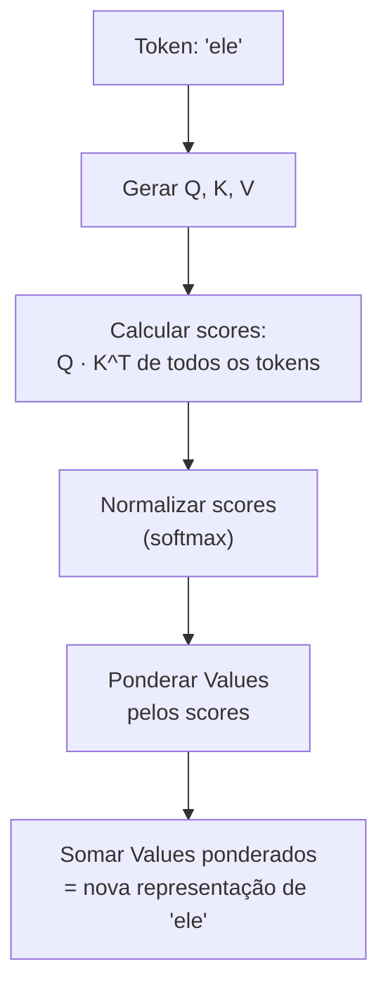
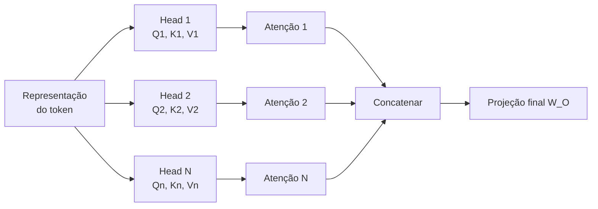
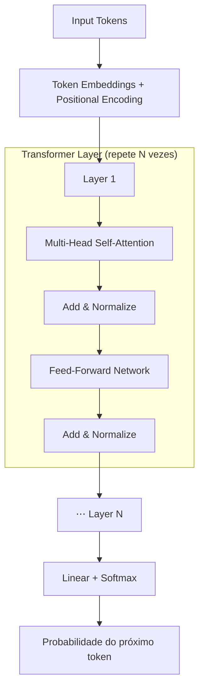

# Atenção e o mecanismo transformer

> [!abstract] TL;DR
> O mecanismo de atenção é o coração dos LLMs. Ele permite que cada token "olhe" para todos os outros tokens no contexto e construa, a partir deles, uma versão enriquecida de si mesmo — uma **média ponderada** onde o peso de cada token é a sua *relevância*. Esses pesos saem de um trio de vetores por token: **Query** ("o que procuro?"), **Key** ("o que ofereço?") e **Value** ("qual é minha informação?"). Multi-head attention faz isso várias vezes em paralelo, cada "cabeça" com uma lente diferente. É isso que torna os LLMs capazes de entender contexto, resolver referências e processar sequências inteiras de uma vez — substituindo a leitura sequencial das antigas redes recorrentes.

> [!tip] Comece pelo vídeo
> 3Blue1Brown desenha a atenção como ninguém: Query, Key e Value viram setas num espaço, e a matriz de pesos se forma passo a passo na sua frente (EN, legendado, ~26 min). É o tratamento visual definitivo do que esta nota explica em texto:


> [!abstract] Guia de leitura
> Esta nota é o **núcleo conceitual** da atenção (nível Adepto): o que ela é e como o Transformer é montado em volta dela. Os aprofundamentos de **engenharia de inferência** — que afogavam o conceito central — viraram brotos Magus separados:
> - [[04a - KV cache, prefill e decode — a física da inferência]] — por que contexto longo é caro
> - [[04b - Encolhendo o KV cache — MHA, MQA, GQA, MLA]] — as variantes de atenção
> - [[04c - Atenção eficiente — FlashAttention, sparse e híbrida]] — atacando o custo O(n²)
>
> Leia esta primeiro; os brotos quando for otimizar ou servir um modelo.

## O que é

O **[[Dicionário de IA#transformer|Transformer]]** é a arquitetura de rede neural introduzida por Vaswani et al. em 2017, no paper de título provocador *"Attention Is All You Need"*. O título é literal: a grande aposta foi **jogar fora a recorrência** e deixar só a atenção.

Mas o que é essa "recorrência"? É o jeito como as redes anteriores liam texto: em **cadeia, um token por vez**, cada passo dependendo do resultado do anterior — como anotar uma frase inteira num único bilhete que você reescreve a cada palavra nova. Era ela que tornava o treino lento e a memória curta, exatamente como o próximo parágrafo detalha.

Para entender por que isso foi revolucionário, vale lembrar o que veio antes. Modelos de linguagem usavam **RNNs** (Recurrent Neural Networks): processavam o texto **uma palavra por vez**, da esquerda para a direita, carregando um "estado de memória" que era atualizado a cada token. Isso tinha três problemas sérios:

- **Era sequencial.** Para processar a palavra 100, você precisava ter processado as 99 anteriores em ordem. Não dá para paralelizar — e treinar em GPUs (que são máquinas massivamente paralelas) fica desperdiçado.
- **Esquecia o passado distante.** A informação de uma palavra lá no começo tinha que sobreviver, intacta, passando por dezenas de atualizações de estado até chegar ao fim da frase. Na prática, ela se diluía — o famoso problema de dependências de longo alcance.
- **Tratava todos os tokens com o mesmo canal estreito.** Tudo precisava caber num único vetor de estado que era reescrito a cada passo.

O Transformer substituiu a recorrência por **[[Dicionário de IA#attention|atenção]]** — um mecanismo que olha para **todos os tokens de uma vez**, calculando diretamente a relação de cada token com todos os outros. Sem passar o estado de mão em mão: cada par de tokens tem um caminho direto. Isso resolve os três problemas de uma tacada — paraleliza o treino, encurta a distância entre tokens distantes para "um passo", e dá a cada token um canal rico para puxar informação de onde precisar.

> [!example]- RNN vs. atenção: o mesmo problema, duas físicas
> Para resolver "a quem 'ele' se refere" oito palavras atrás, uma **RNN** precisa que a informação de "animal" sobreviva sendo reescrita a cada uma das oito atualizações de estado intermediárias — e a cada passo ela compete com tudo o mais que entrou. É um telefone-sem-fio: quanto mais longe, mais degradado o sinal. A **atenção** liga "ele" a "animal" **diretamente**, com um único produto escalar, dê 8 ou 800 palavras de distância entre eles. A distância deixa de degradar o sinal — ela só encarece a conta (o tal O(n²) que mora nos [[04a - KV cache, prefill e decode — a física da inferência|brotos de inferência]]).

## Por que importa

A atenção não é um detalhe técnico — ela explica diretamente o comportamento que você observa nos LLMs:

- **Por que LLMs são bons em contexto** — cada token é enriquecido pela informação de todos os outros, então o modelo "entende" que *ele* se refere a *animal*, que *banco* é de praça ou de dinheiro conforme a vizinhança.
- **Por que a paralelização destravou a escala** — calcular a atenção de todos os tokens ao mesmo tempo é exatamente o tipo de trabalho que GPUs fazem rápido. Foi isso que tornou viável treinar modelos gigantes.
- **Por que contexto longo custa caro** — a atenção compara cada token com todos os outros, então o custo cresce com o *quadrado* do tamanho da sequência. (O detalhamento dessa conta e dos truques para domá-la está em [[04a - KV cache, prefill e decode — a física da inferência|KV cache, prefill e decode]].)

[[04 - Atenção e o mecanismo transformer-image-01.jpg]]
![[04 - Atenção e o mecanismo transformer-image-01.jpg]]

>[!info]- 💸 Por que dobrar o contexto quadruplica o custo?
>
> O custo computacional e de memória não cresce de forma direta (linear), mas sim de forma **quadrática (\(O(N^2)\))**.
>
> #### 1. A Matriz de Atenção Quadrática
>
> Para que o modelo entenda o significado de uma palavra, ele precisa compará-la com **todas as outras palavras** já ditas no texto.
>
> - Se o contexto tem **1.000 tokens**, o modelo faz 1.000 × 1.000 = **1 milhão de conexões**.
> - Se o contexto sobe para **100.000 tokens**, o modelo precisa processar 100.000 × 100.000 = **10 bilhões de conexões** apenas para manter a atenção.
>
> #### 2. O Gargalo do KV Cache (Memória RAM da GPU)
>
> Durante a geração de texto (loop autorregressivo), o modelo precisa guardar os cálculos anteriores em um "bloco de notas temporário" chamado **KV Cache**.
>
> - Esse cache consome gigabytes de memória **VRAM** ultrarrápida das placas de vídeo (como as H100 ou B200).
> - Quanto maior o contexto, menos espaço sobra na memória para processar requisições de outros usuários ao mesmo tempo, reduzindo a eficiência do servidor.
>
> #### 3. Latência de Inicialização (Prefill)
>
> Antes de começar a escrever a primeira palavra da resposta, a GPU precisa ler e processar todo o seu prompt gigante de uma só vez. Isso exige picos massivos de processamento energético e poder computacional, gerando custos operacionais altíssimos para as empresas de IA.

## A intuição: "quem é relevante pra mim?"

Antes de qualquer fórmula, fixe a ideia central, porque tudo o resto é só a mecânica dela:

> **Cada token reescreve a si mesmo como uma mistura dos outros tokens, dando mais peso aos que importam para ele.**

É uma **média ponderada** — e o que entra na média não são as palavras, são os **vetores**. Lembre da nota anterior: cada token já virou um [[03 - Embeddings — do token ao vetor|embedding]], uma lista de números. Misturar "⅔ de animal + ⅓ de rua" é somar os vetores deles, coordenada a coordenada. A atenção decide só os *pesos* dessa soma — quanto do vetor de cada token entra na nova versão do vetor de cada outro.

Considere a frase:

> *"O animal não atravessou a rua porque **ele** estava cansado."*

Quando o modelo processa "ele", ele precisa descobrir a quem "ele" se refere. O mecanismo de atenção calcula um peso de relevância de "ele" para cada outra palavra:

- **Alta atenção para "animal"** — é a referência provável; é o que "ele" significa aqui.
- **Baixa atenção para "rua"** — gramaticalmente possível, mas semanticamente é "animal" quem cansa.
- **Atenção moderada para "cansado"** — descreve o estado de "ele".

O resultado: a representação interna de "ele" é **reescrita puxando informação de "animal"**. Depois dessa passada, o vetor de "ele" carrega, nele mesmo, o "ser animal". É assim que o modelo resolve a correferência sem nenhuma regra gramatical programada — só pesos aprendidos.

> [!tip] Uma analogia: busca numa biblioteca
> Imagine que cada token faz uma **busca** contra todos os outros:
> - A **Query** é o que você digita na busca — "estou procurando o sujeito de quem 'ele' fala".
> - Cada token oferece uma **Key**, como a etiqueta na lombada de um livro — "eu sou um substantivo animado, candidato a sujeito".
> - E cada token tem um **Value**, o conteúdo do livro — a informação que ele entrega se for escolhido.
>
> Você compara sua Query com **todas** as Keys, vê quais combinam melhor, e leva de volta uma **mistura dos Values** — mais do livro que casou bem, menos dos que casaram mal. A atenção é exatamente isso, feito com vetores e em paralelo para todos os tokens ao mesmo tempo.

## Os três vetores: Query, Key, Value
[[04 - Atenção e o mecanismo transformer - query-key-value.png]]
![[04 - Atenção e o mecanismo transformer - query-key-value.png]]

De onde saem essa Query, Key e Value? De **três matrizes de pesos aprendidas** (W_Q, W_K, W_V). O [[Dicionário de IA#embedding|embedding]] de cada token é multiplicado por cada uma delas, gerando três vetores diferentes a partir do mesmo token — três "lentes" sobre a mesma palavra:

| Vetor         | Papel                      | Analogia                 |
| ------------- | -------------------------- | ------------------------ |
| **Query (Q)** | "O que estou procurando?"  | A pergunta de busca      |
| **Key (K)**   | "O que eu ofereço?"        | O índice de um documento |
| **Value (V)** | "Qual é minha informação?" | O conteúdo do documento  |

As três matrizes são o que o modelo **aprende** no treino. Não há nada de mágico nos vetores em si: o que torna a atenção poderosa é que, depois de bilhões de exemplos, W_Q e W_K aprendem a fazer Queries e Keys de tokens relacionados "casarem" (**produto escalar** alto — a medida de quanto dois vetores apontam na mesma direção, detalhada no passo do cálculo abaixo), e W_V aprende a empacotar, no Value, a informação que vale a pena propagar.

Concretamente: se o embedding do token tem dimensão `d_model` (digamos 4096) e cada *head* (uma das várias "cabeças" de atenção que rodam em paralelo — detalhadas na seção **Multi-Head Attention**, adiante) trabalha em `d_k` (digamos 128), então W_Q, W_K e W_V são matrizes de forma `4096 × 128`. Multiplicar o embedding por cada uma projeta o token de 4096 dimensões para os três vetores de 128. **E não, projetar "para baixo" não joga informação fora**: cada head se especializa de propósito num pedaço menor, e a dimensão cheia é recomposta quando todas as cabeças são concatenadas. Essas matrizes nascem aleatórias e são lapidadas pelo [[Dicionário de IA#backpropagation|backpropagation]] junto com o resto do modelo — ninguém define "esta coluna detecta sujeitos". A especialização **emerge** da pressão de prever o próximo token, repetida bilhões de vezes.

> [!question] Q, K e V vêm todos do mesmo token?
> Na **self-attention** (o que roda dentro de um LLM) sim: Q, K e V são três projeções **do mesmo conjunto de tokens** — a sequência atende a si mesma. Existe também a **cross-attention**, usada em arquiteturas encoder-decoder (tradução, alguns modelos multimodais): ali o Q vem de uma sequência (ex.: o texto sendo gerado) e K/V vêm de outra (ex.: a imagem ou o texto-fonte). LLMs decoder-only modernos usam só self-attention mascarada; a cross-attention reaparece quando há duas sequências distintas para casar.

## O cálculo, passo a passo

Com Q, K e V em mãos, a atenção de um token é calculada em quatro passos:



1. **Score (similaridade).** Para o token atual, calcula-se o produto escalar da sua Query com a Key de cada token: `score = Q · Kᵀ`. O produto escalar mede **alinhamento**: dois vetores apontando na mesma direção dão um número alto; perpendiculares dão zero. Um score alto significa "esta Key combina com o que minha Query procura".
2. **Escala.** Divide-se cada score por `√d_k` (a raiz da dimensão das Keys). É um ajuste para o softmax não ficar instável — explicado logo abaixo.
3. **Normalização (softmax).** Os scores crus viram **proporções que somam 1** — os pesos da média ponderada.
4. **Output (média ponderada).** Multiplica-se o Value de cada token pelo seu peso e soma-se tudo: `output = Σ (peso_i × V_i)`. Esse é o novo vetor do token — uma mistura dos Values, dosada pela relevância.

### O softmax — e por que não um `argmax`?

O passo 3 merece atenção própria, porque é onde a "decisão" acontece — e é o conceito que mais confunde quem está começando.

Os dois, `softmax` e `argmax`, são parentes do `max`, e a diferença explica metade da atenção. O **`argmax`** responde "qual o maior?" e devolve **só o vencedor** — útil para *decidir*, mas descontínuo: um empurrãozinho nos scores ou não muda nada, ou faz o vencedor pular de posição. Sem derivada útil, não dá para treinar com **gradiente** — o sinal que, durante o treino, diz a cada parâmetro para que lado (e quanto) mexer a fim de reduzir o erro; é o motor da [[18 - Como LLMs são treinados — pretraining, SFT, RLHF|fase de treino]].

O **softmax** é o `max` "amolecido" (*soft*). Ele pega os scores crus e devolve uma lista do mesmo tamanho que (a) é toda positiva e (b) **soma exatamente 1** — viram proporções. A fórmula exponencia cada score (`eˣ`, que garante positividade e amplifica diferenças) e divide pela soma de todos:

$$\text{softmax}(x_i) = \frac{e^{x_i}}{\sum_j e^{x_j}}$$

Por exemplo, os scores `[1,2 , 3,8 , 0,5]` viram `[0,07 , 0,90 , 0,03]`. Repare: o índice que o `argmax` escolheria leva 90%, mas os outros **não zeram**. E é isso que importa para a atenção — ela quer *misturar* vários Values numa média ponderada, não escolher um só. Sendo suave e diferenciável, o softmax ainda permite calcular gradiente e treinar.

> [!info] O botão da temperatura
> Tanto o `softmax` quanto o `argmax` têm um botão de "dureza", a **temperatura**: dividir os scores por um número pequeno antes de exponenciar deixa o softmax "pontudo" (quase `argmax`); por um grande, "achatado" (quase uniforme). No limite `T → 0`, **softmax vira argmax**. É literalmente o mesmo botão que o `√d_k` mexe aqui na atenção e que a "temperature" do playground mexe na geração de texto (ver [[05 - Completação — o loop autoregressivo|completação]]). Origem do nome: a *distribuição de Boltzmann* da física, onde `T` é temperatura de verdade; o termo "softmax" foi cunhado por John Bridle em 1989.

### Por que dividir por `√d_k`?

Aquele passo 2 (a escala) tem uma razão estatística precisa.

Conforme `d_k` cresce, o produto escalar `Q·K` soma mais termos e sua **variância** cresce proporcionalmente a `d_k` — ou seja, o desvio-padrão cresce com `√d_k`. Dividir por `√d_k` traz essa variância de volta para ~1, mantendo os scores numa faixa onde o softmax tem gradiente saudável.

Por que não dividir por `d_k`, ou por nada? Dividir por `d_k` corrigiria *demais* (encolheria os scores até quase uniformes). Não dividir deixaria o softmax **saturar** — com scores grandes, ele vira quase um `argmax`, o gradiente some e o treino emperra. É um ajuste de escala, não um número mágico.

### Uma passada de atenção com números de verdade

Nada fixa a intuição como ver a conta rodar. Vamos atender "ele" a dois tokens — "animal" e "rua" — com vetores de dimensão 2 (`d_k = 2`) para caber na cabeça.

**Vetores já projetados (saídas de W_Q, W_K, W_V):**
- Q(ele) = `[1, 0]`
- K(animal) = `[1, 0]`  ·  K(rua) = `[0, 1]`
- V(animal) = `[10, 0]`  ·  V(rua) = `[0, 10]`

**1. Scores (Q·Kᵀ):**
- score(animal) = 1·1 + 0·0 = **1**
- score(rua) = 1·0 + 0·1 = **0**
- 

**2. Escala (÷√2 ≈ ÷1,41):** `[0,71 , 0]`

**3. Softmax de `[0,71 , 0]`:** e^0,71 ≈ 2,03 · e^0 = 1 → pesos ≈ **`[0,67 , 0,33]`**

**4. Output (média ponderada dos V):** 0,67·`[10, 0]` + 0,33·`[0, 10]` = **`[6,7 , 3,3]`**

A nova representação de "ele" puxou ~⅔ de "animal" e ~⅓ de "rua" — porque a Query de "ele" estava alinhada com a Key de "animal". Inverta `K(animal)` para `[0, 1]` e o resultado se inverte: é assim que **pesos aprendidos redirecionam para onde a atenção flui**. O treino não programa "ele → animal"; ele ajusta as matrizes até que esse alinhamento aconteça sozinho.

### A geometria por trás: alinhamento no espaço

Por que o produto escalar `Q·K` mede "relevância"? Porque ele mede **alinhamento geométrico**. Vale a relação `Q·K = |Q| · |K| · cos(θ)`, onde θ é o ângulo entre os dois vetores: mesma direção → valor grande; perpendiculares → zero; opostos → negativo.

Então a atenção, geometricamente, é isto: a Query de um token é uma **seta** apontando para uma região do espaço ("é por aqui que está o que eu procuro"). Cada Key é outra seta. Os scores altos saem dos tokens cuja Key aponta para perto da Query. O treino, ajustando W_Q e W_K, vai **girando essas setas** até que tokens relacionados fiquem alinhados e os irrelevantes fiquem perpendiculares. É exatamente essa imagem — setas num espaço, ângulos se fechando entre o que combina — que o vídeo do 3Blue1Brown no topo anima em movimento. Se a fórmula ainda parece abstrata, é porque ela é só a versão algébrica de "veja para onde cada seta aponta e misture o conteúdo das que apontam para perto de mim".

> [!info] Por que Q e K têm a mesma dimensão, mas V pode ter outra
> Q e K precisam morar no **mesmo espaço** para o ângulo entre eles fazer sentido — por isso ambos têm dimensão `d_k`. O Value não entra em nenhum produto escalar; ele é apenas *carregado* na média ponderada. Por isso, em princípio, V poderia ter outra dimensão (`d_v`) — embora na prática quase todos usem `d_v = d_k`.

### A matriz de atenção: todos os tokens de uma vez

Descrevi o cálculo para um token ("ele"), mas o modelo faz isso para **todos os tokens ao mesmo tempo**. Empilhe todas as Queries numa matriz Q e todas as Keys numa matriz K, e `Q·Kᵀ` produz de uma vez uma **matriz N×N de scores**: a célula na linha *i*, coluna *j* diz "quanto o token *i* atende ao token *j*".

É essa matriz que aparece nas famosas visualizações de atenção em forma de **mapa de calor**: cada célula é um peso, com as regiões mais quentes onde a atenção se concentra. Depois do softmax (aplicado linha a linha) e da máscara causal (que apaga o triângulo do "futuro"), essa matriz multiplica V e entrega, de uma tacada, a nova representação de todos os tokens. É essa formulação **matricial** — e não um laço token a token — que faz a atenção voar nas GPUs. E é o tamanho dessa matriz N×N que vira o problema de memória atacado em [[04c - Atenção eficiente — FlashAttention, sparse e híbrida|atenção eficiente]].

### Fórmula canônica

Os quatro passos, condensados na fórmula que você verá em todo paper:

> [!warning] Fómula de cálculo de atenção:
> $$\text{Attention}(Q, K, V) = \text{softmax}\left(\frac{QK^T}{\sqrt{d_k}}\right)V$$
>
> Leia da direita para a esquerda das operações: 
> - `QKᵀ` são os scores
> - `√d_k` é a escala
> - `softmax` são os pesos, 
> - a multiplicação final por `V` é a média ponderada. 

Toda a intuição desta seção mora nesse quadro.

## A máscara causal — por que o modelo não pode "espiar o futuro"

Se a atenção deixa cada token olhar para todos os outros em paralelo, surge um problema no treino: prever o próximo token vira trapaça se o modelo já enxerga a resposta à frente. A solução é a **máscara causal** (*causal mask*).

Antes do softmax, os scores `Q·Kᵀ` de todas as posições **futuras** são zerados — tecnicamente, setados para −∞. Como o softmax de −∞ é 0, cada token fica matematicamente proibido de atender a qualquer token à sua direita: só "vê" a si mesmo e ao passado.

Visualmente, para uma sequência de 4 tokens, a máscara é um **triângulo** — cada linha só enxerga as colunas até a diagonal:

```
              atende a →
           T1    T2    T3    T4
   T1   [  ✓     ✗     ✗     ✗  ]
   T2   [  ✓     ✓     ✗     ✗  ]
   T3   [  ✓     ✓     ✓     ✗  ]
   T4   [  ✓     ✓     ✓     ✓  ]
```

T1 só pode atender a si mesmo; T4 já vê a frase inteira até ali. As células ✗ (o triângulo superior, o "futuro") recebem −∞ antes do softmax e viram peso 0. É literalmente esse triângulo que separa um [[Dicionário de IA#GPT (Generative Pre-trained Transformer)|GPT]] (que **gera**, olhando só para trás) de um [[Dicionário de IA#BERT (Bidirectional Encoder Representations from Transformers)|BERT]] (que só **lê**, olhando para os dois lados).

> [!info] É isso que define um modelo *decoder-only*
> Um Transformer "decoder-only" (GPT, Llama, etc.) é, na prática, **definido por essa máscara**. Ela vale tanto na geração token-a-token quanto no processamento do prompt inteiro — por isso o modelo consegue treinar todas as posições de uma sequência **em paralelo** e mesmo assim manter a regra "só o passado conta". O que é paralelo é o *cálculo* (todas as posições de uma vez), não o *alcance* (cada token enxerga apenas para trás). Encoders bidirecionais como o BERT não usam essa máscara — aí sim cada token vê todos os outros.

## Multi-Head Attention

Até aqui descrevemos **uma** passada de atenção. Mas uma só captura um tipo de relação por vez — e a linguagem tem muitos tipos de relação acontecendo ao mesmo tempo. A solução: rodar a atenção **N vezes em paralelo** (geralmente 32-128 "heads"), cada uma com seu próprio trio de matrizes W_Q/W_K/W_V. Cada head aprende a detectar um padrão diferente:

Por "relação" (ou "padrão") aqui, entenda *quais tokens devem se atender* — e isso não é programado por ninguém: a head aprende W_Q/W_K que fazem certos pares se alinharem (Query e Key com produto escalar alto). A "relação sintática", por exemplo, é só uma head cujas matrizes passaram a alinhar a Query de um verbo com a Key do seu sujeito. É **geometria aprendida, não uma regra** — e o exemplo de duas cabeças mais abaixo mostra isso concretamente.

| Head   | Pode aprender a detectar               |
| ------ | -------------------------------------- |
| Head 1 | Referências pronominais (ele → animal) |
| Head 2 | Relações sintáticas (sujeito → verbo)  |
| Head 3 | Padrões de código (variável → tipo)    |
| Head N | Outros padrões emergentes              |

Os outputs de todos os heads são concatenados e projetados por uma matriz final (W_O) para produzir a representação final do token:



> [!question]- Se o modelo divide a dimensão entre N heads, cada head não fica "burro"?
> Cada head opera num subespaço de dimensão `d_model/N` (ex.: d_model = 4096 e 32 heads → 128 por head). Individualmente é mais pobre, sim — mas a aposta é que **especialização vence capacidade bruta**: um head de 128 dims focado em correferência rende mais que um head de 4096 tentando capturar tudo de uma vez. A concatenação no fim recompõe a dimensão cheia, e a projeção W_O aprende a misturar os subespaços. Não é fatiar por fatiar: é fatorar um problema grande em vários menores e independentes que rodam em paralelo.

### Duas cabeças, duas relações: um exemplo

Pegue a frase *"O programador corrigiu o bug que ele tinha introduzido."* Imagine duas cabeças trabalhando na mesma passada:

- A **cabeça de sintaxe**, processando "introduzido", pergunta (via sua Query) "quem é meu sujeito?". Sua Key casa forte com **"ele"**.
- A **cabeça de correferência**, processando "ele", pergunta "a quem me refiro?". Sua Key casa com **"programador"**.

Nenhuma sabe da outra; cada uma tem seu próprio W_Q/W_K/W_V e seu próprio alinhamento de setas. Uma costura *introduzido → ele*; a outra, *ele → programador*. Depois da projeção W_O, o token sai carregando as duas relações ao mesmo tempo. Empilhe isso por dezenas de camadas e o modelo monta, peça por peça, a teia completa de "quem fez o quê a quem" — sem nenhuma regra gramatical explícita.

> [!question]- Por que não uma única cabeça gigante em vez de N pequenas?
> Porque relações diferentes pedem **alinhamentos diferentes** no espaço. Uma cabeça só teria que encontrar um único conjunto de direções que servisse para sintaxe, correferência, concordância de número e tudo mais simultaneamente — um compromisso medíocre em tudo. Várias cabeças menores deixam cada uma esculpir a própria geometria, especializada. É o mesmo princípio de montar um time de especialistas em vez de um generalista tentando fazer tudo sozinho.

## Positional encoding — atenção não sabe ordem

Há um detalhe que a fórmula esconde: a atenção pura é **permutation-invariant**. Os scores `Q·Kᵀ` não mudam se você embaralhar os tokens — a média ponderada é a mesma independente da ordem. Sem informação posicional, *"cão morde homem"* e *"homem morde cão"* produziriam as mesmas representações. É por isso que todo Transformer injeta a posição nos [[03 - Embeddings — do token ao vetor|embeddings]] — e a forma de fazer isso evoluiu:

- **Posicional absoluto** (paper original) — soma um vetor de posição ao embedding. Simples, mas generaliza mal além do comprimento visto no treino.
- **[[Dicionário de IA#RoPE (Rotary Position Embedding)|RoPE]]** (padrão moderno) — em vez de somar, **rotaciona pares de dimensões de Q e K** por um ângulo proporcional à posição (pense em cada par como o ponteiro de um relógio: o token na posição 50 gira 50 "tiquinhos"). Assim o produto escalar `Q·K` passa a depender da **distância relativa** entre os tokens: o que importa é "quão longe", não "em qual posição absoluta".
- **[[Dicionário de IA#YaRN|YaRN]]** (extensão de contexto) — reescala as frequências do RoPE para esticar a janela além do comprimento de pretraining, usando ~10x menos tokens de treino que métodos anteriores. É assim que modelos treinados em 4K chegam a 128K+.

> [!question] Como "rotacionar" um vetor codifica posição? (a intuição do RoPE)
> Pense em cada par de dimensões de Q e K como as coordenadas de um **ponteiro de relógio**. O RoPE gira esse ponteiro por um ângulo proporcional à posição do token: o da posição 1 gira um tiquinho; o da posição 50, cinquenta tiquinhos. Quando depois você calcula `Q·K` entre dois tokens, o resultado passa a depender da **diferença** de ângulos — ou seja, de quão distantes eles estão, não de onde estão em absoluto. Dois tokens a 3 posições de distância produzem o mesmo "desencontro de ponteiros" estejam no início ou no fim do texto. É por isso que o RoPE generaliza bem para comprimentos novos: ele ensina o modelo a raciocinar sobre *distância relativa*, que é o que de fato importa na linguagem.

## A arquitetura completa do Transformer

A atenção é a estrela, mas não trabalha sozinha. Uma camada de Transformer combina atenção com mais algumas peças, e o modelo empilha essa camada N vezes:



> [!question] O "Linear + Softmax" do fim é o mesmo softmax da atenção?
> Não — é a mesma *função*, em outro lugar e com outro papel. O **softmax da atenção** roda dentro de cada camada e distribui pesos **sobre os tokens** (quem atende a quem). O **softmax do fim** roda uma vez só, na saída da última camada, e distribui probabilidades **sobre o vocabulário inteiro** — é ele que escolhe o próximo token. Mesma matemática (transformar números em proporções que somam 1), alvos diferentes. Esse passo final é o tema de [[05 - Completação — o loop autoregressivo|completação]].

Cada camada combina:

1. **Self-attention** — captura relações entre tokens (o mecanismo de *roteamento*: quem fala com quem).
2. **Feed-forward network** — processa cada token independentemente (onde fica o "conhecimento" armazenado).
3. **Residual connections + layer norm** — estabilizam o treinamento em redes profundas, dando ao gradiente um "atalho" para fluir até as primeiras camadas.

> [!warning] O diagrama acima é *post-norm* — e quase nenhum LLM moderno usa isso
> O paper original normaliza **depois** de somar o resíduo (*post-norm*, o "Add & Normalize" do diagrama). Parece detalhe de ordem, mas em redes profundas o post-norm trava: gradientes explodem ou somem, e o treino só converge com *warm-up* cuidadoso de learning rate — num teste de 29 camadas, o post-norm sequer convergiu. Praticamente todos os LLMs modernos (GPT-3, Llama, PaLM) inverteram para **pre-norm**: normalizar *antes* do sub-layer, deixando a conexão residual como um "atalho limpo" para o gradiente. O preço é uma leve perda de fidelidade representacional, mas a estabilidade compensa. De brinde, a norma deixou de ser LayerNorm e virou **RMSNorm**: só reescala (não centraliza nem aprende *bias*), o que corta um parâmetro por camada e sai mais barato. É o padrão da família Llama em diante.

## A Feed-Forward Network — onde mora o conhecimento

A atenção recebe toda a atenção (trocadilho intencional), mas ~⅔ dos [[Dicionário de IA#parameters / weights|parâmetros]] de um Transformer estão na **FFN** — a rede feed-forward que vem depois da atenção em cada camada. Se a atenção é o mecanismo de *roteamento* (quem fala com quem), a FFN é a *memória* (o que se sabe).

Ela é deceptivamente simples — roda em cada token de forma independente:

> [!warning] Fórmula FFN
>
> $$\text{FFN}(x) = W_{down} \cdot \text{ativação}(W_{up} \cdot x)$$

Termo a termo, onde `x` é o vetor do token que entra na camada:

- **Up-projection** (`W_up · x`) — expande a dimensão do token, tipicamente para `d_ff ≈ 4 × d_model` (ex.: 4096 → 16384).
- **Ativação** não-linear (a `ativação(...)`) — GELU no GPT, **SwiGLU** na família Llama; é o que dá à camada poder de representar funções complexas.
- **Down-projection** (`W_down`) — comprime de volta para `d_model`.

Esse "incha → processa → comprime" é onde os fatos ficam guardados: estudos de interpretabilidade mostram que as camadas FFN funcionam como uma memória chave-valor, com neurônios específicos ativando para conceitos específicos (*"a capital da França é…"*). A atenção **move** informação entre posições; a FFN **transforma** a informação de cada posição com base no que aprendeu no pré-treino.

> [!question] Então o custo de um LLM é tudo atenção?
> Só em contexto longo. Para sequências curtas, a **FFN domina os FLOPs** — ela roda em todo token e é ~4x mais larga que o modelo. A atenção, sendo O(n²), só ultrapassa a FFN quando n fica grande. Por isso otimizar atenção importa para contexto longo, mas a contagem de parâmetros e o custo de prompts curtos são governados pela FFN — exatamente o que o [[09 - Dense vs Mixture-of-Experts|Mixture-of-Experts]] ataca ao tornar a FFN esparsa.

## O fluxo residual — como o token evolui camada a camada

Falta uma peça para o quadro fechar. As camadas não são uma esteira onde cada uma descarta o trabalho da anterior: elas compartilham um **fluxo residual** (*residual stream*) — um vetor por token que atravessa o modelo de ponta a ponta e que cada sub-camada **lê e reescreve por adição**.

Lembra do "Add & Normalize" do diagrama? O "Add" é exatamente isto: a saída de cada sub-camada é **somada de volta** ao vetor que entrou, em vez de substituí-lo:

$$x' = x + \text{Atenção}(x) \qquad\text{e depois}\qquad x'' = x' + \text{FFN}(x')$$

A consequência conceitual é grande. Acompanhe o vetor de **"ele"** começando a jornada como o [[03 - Embeddings — do token ao vetor|embedding]] cru e descontextualizado. A cada camada:

1. A **atenção** lê o fluxo, encontra "animal" e **escreve** nele "sou um animal".
2. A **FFN** lê o fluxo já enriquecido e **escreve** o que sabe sobre animais e cansaço.
3. A camada seguinte lê o resultado e refina mais — ligando "cansado" a "não atravessou".

Camada após camada, o vetor de "ele" **acumula** contexto, como um documento que vários revisores anotam em sequência sem apagar as anotações anteriores. Ao chegar à última camada, ele já não é "ele" genérico: carrega "ele = o animal que estava cansado e por isso não atravessou". É desse vetor final que sai a previsão do próximo token (ver [[05 - Completação — o loop autoregressivo|completação]]).

> [!tip] Por que o "atalho" residual importa tanto
> As conexões residuais não são só um truque para o gradiente fluir (embora também sejam — ver o callout sobre pre-norm). Conceitualmente, elas são o que permite a informação **persistir**: sem a soma, cada camada teria que reconstruir do zero tudo o que importa. Com ela, uma camada pode fazer uma contribuição pequena e cirúrgica, confiando que o resto continua intacto no fluxo. É por isso que se fala no fluxo residual como a "memória de trabalho" compartilhada do Transformer — e é nele que a pesquisa de interpretabilidade vai "ler" o que o modelo está construindo.

## Da atenção à inferência — para onde foi o resto

Você reparou que esta nota não falou de KV cache, FlashAttention ou das variantes MQA/GQA/MLA. Isso é proposital: esse material é **engenharia de inferência** (nível Magus) e ganhou brotos próprios, para não afogar o conceito de atenção. Quando quiser entender *por que rodar um LLM custa o que custa*, siga em ordem:

> [!abstract] Os brotos de engenharia de inferência
> - [[04a - KV cache, prefill e decode — a física da inferência]] — o custo quadrático, as duas fases da inferência e o KV cache.
> - [[04b - Encolhendo o KV cache — MHA, MQA, GQA, MLA]] — as variantes de atenção que reduzem a memória.
> - [[04c - Atenção eficiente — FlashAttention, sparse e híbrida]] — os ataques à própria conta O(n²), e os attention sinks.

## Armadilhas

- **"O modelo lê da esquerda pra direita"** — na geração sim, mas durante o processamento do input, a self-attention vê todos os tokens simultaneamente (limitada pela máscara causal a olhar só para trás).
- **"Atenção = compreensão"** — atenção é correlação estatística. O modelo pode dar peso alto a um token por razões estatísticas, não semânticas. O peso alto significa "estes vetores se alinham", não "o modelo entendeu".
- **Confundir o score (atenção) com o output** — a atenção produz *pesos*; o que sai da camada é a *média ponderada dos Values*. Token com peso alto contribui mais, mas o resultado é sempre uma mistura.
- **Confundir [[Dicionário de IA#parameters / weights|parâmetros]] com atenção** — os pesos das camadas feed-forward (não a atenção) são onde o "conhecimento factual" do modelo reside. Atenção é o mecanismo de busca/organização; a FFN é a memória.

## A atenção em uma frase

Se for para guardar uma coisa só: **a atenção faz cada token se reescrever como uma média ponderada dos outros, onde os pesos saem do alinhamento entre Queries e Keys, e o conteúdo misturado são os Values.** Tudo o mais é consequência disso — o multi-head faz a mistura por várias lentes em paralelo; a máscara causal proíbe olhar para o futuro; o positional encoding devolve a noção de ordem; o fluxo residual deixa o enriquecimento acumular camada a camada; e a FFN, entre uma atenção e outra, guarda o conhecimento. O Transformer é essa peça repetida dezenas de vezes — e foi ela que tornou os LLMs possíveis.

## Como explicar em inglês

The attention mechanism computes, for each token, a weighted average of all other tokens' values, where the weights come from the alignment between the current token's **Query** vector and other tokens' **Key** vectors — formalized as `softmax(QKᵀ/√d_k)V`. The three projections (Q, K, V) are learned linear maps of the input embeddings: Q asks "what am I looking for?", K signals "what do I offer?", V carries "what I contribute if attended." **Multi-head attention** runs this in parallel across H independent heads, each attending to different semantic or syntactic patterns. The **causal mask** prevents each position from seeing future tokens (decoder-only). **Positional encoding** (RoPE in modern models) injects position into Q and K. The **feed-forward layers** between attention blocks (~2/3 of parameters) act as key-value memories storing factual knowledge. The **residual stream** — a skip connection accumulating outputs layer by layer — is what makes stacking dozens of layers possible without gradient vanishing.

| PT | EN |
|----|---|
| Atenção | Attention |
| Atenção de múltiplas cabeças | Multi-head attention (MHA) |
| Consulta / Chave / Valor | Query / Key / Value (Q/K/V) |
| Máscara causal | Causal mask |
| Codificação posicional | Positional encoding |
| Incorporação posicional rotacional | Rotary Position Embedding (RoPE) |
| Fluxo residual | Residual stream |
| Camada feed-forward | Feed-forward layer (FFN) |
| Normalização de camada | Layer normalization |
| Cabeça de atenção | Attention head |
| Autoatenção | Self-attention |
| Escalamento | Scaling (the √d_k factor) |

## Veja também

- [[01 - O que é um LLM]] — contexto geral da arquitetura
- [[03 - Embeddings — do token ao vetor]] — o que a atenção contextualiza camada a camada
- [[05 - Completação — o loop autoregressivo]] — o que acontece depois da última camada (logits → softmax → amostragem)
- [[06 - A janela de contexto]] — a consequência prática da atenção
- [[09 - Dense vs Mixture-of-Experts]] — como MoE modifica as camadas feed-forward
- Os brotos Magus de inferência
	- [[04a - KV cache, prefill e decode — a física da inferência]] 
	- [[04b - Encolhendo o KV cache — MHA, MQA, GQA, MLA]] 
	- [[04c - Atenção eficiente — FlashAttention, sparse e híbrida]] 
## Ver mais

- [3Blue1Brown — *Transformers, the tech behind LLMs (Ch.5)*](https://www.youtube.com/watch?v=wjZofJX0v4M) (2024, 27 min) — o capítulo anterior ao do topo: mostra **onde** a atenção se encaixa na pilha completa (embeddings → atenção → FFN → saída). Veja antes do Ch.6 se quiser o panorama da arquitetura.
- [Andrej Karpathy — *Let's build GPT: from scratch, in code, spelled out*](https://www.youtube.com/watch?v=kCc8FmEb1nY) (2023, 1h56) — implementa a self-attention mascarada linha a linha em PyTorch. O deep-dive técnico definitivo: depois de assistir, a fórmula `softmax(QKᵀ/√d_k)V` deixa de ser abstrata.

## Referências

- **Vaswani et al.** — *Attention Is All You Need* (NeurIPS, 2017). O paper fundador.
- **Alammar, Jay** — [*The Illustrated Transformer*](https://jalammar.github.io/illustrated-transformer/). O passo a passo visual de Q/K/V e multi-head.
- **MachineLearningMastery** — [*A Gentle Introduction to Attention Masking in Transformer Models*](https://machinelearningmastery.com/a-gentle-introduction-to-attention-masking-in-transformer-models/) (2024). A máscara causal que define modelos decoder-only.
- **Peng et al.** — [*YaRN: Efficient Context Window Extension of Large Language Models*](https://arxiv.org/abs/2309.00071) (2023). Extensão de contexto via reescala do RoPE.
- **Why Pre-Norm Became the Default in Transformers** — [Medium](https://medium.com/@ashutoshs81127/why-pre-norm-became-the-default-in-transformers-4229047e2620) (2025). Pre-norm vs post-norm e a adoção de RMSNorm.
- **Geva et al.** — [*Transformer Feed-Forward Layers Are Key-Value Memories*](https://arxiv.org/abs/2012.14913) (EMNLP, 2021). Evidência de que o conhecimento factual reside nas camadas feed-forward.
