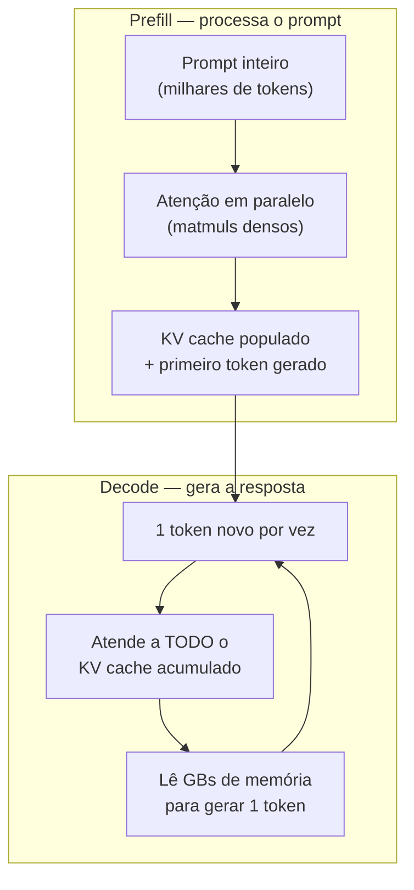

# KV cache, prefill e decode — a física da inferência

> [!info] Broto de [[04 - Atenção e o mecanismo transformer]]
> Esta é uma nota **Magus**: um aprofundamento da nota-mãe sobre atenção. Lá você aprende *o que é* a atenção e *como* o Transformer é montado. Aqui a pergunta muda: **quando o modelo está rodando de verdade, o que custa caro — e por quê?** Se você ainda não viu Query/Key/Value e a fórmula `softmax(QKᵀ/√d_k)V`, leia a [[04 - Atenção e o mecanismo transformer|nota 04]] primeiro; o resto daqui assume isso.

> [!abstract] TL;DR
> A mesma fórmula de atenção roda sob **duas físicas completamente diferentes** durante a inferência. No **prefill** (processar o prompt), todos os tokens entram em paralelo: a GPU faz matmuls densos e fica *compute-bound* — limitada pela velocidade de cálculo. No **decode** (gerar a resposta token a token), cada token novo precisa "reler" todo o passado: a GPU fica *memory-bound* — limitada pela velocidade de **leitura de memória**. O que torna o decode memory-bound é o **KV cache**: a estrutura que guarda as Keys e Values de todos os tokens já vistos para não recomputá-los. Entender esse cache explica metade da engenharia de inferência moderna — e por que contexto longo é caro de um jeito que o tamanho do modelo não captura.

## Por que isso importa

Quase toda métrica de produção de um LLM — latência, custo por token, quantos usuários cabem numa GPU, por que a primeira palavra demora e as seguintes saem rápido — cai diretamente desta divisão. Quem só conhece "o modelo tem N parâmetros" não consegue explicar por que **dobrar o contexto** pode quebrar o orçamento de memória enquanto o número de parâmetros não muda. A resposta mora aqui.

## O custo quadrático — a conta que assombra o contexto

Antes das duas fases, é preciso ver de onde vem a pressão. O cálculo `Q·Kᵀ` compara **cada token com todos os outros**. Dobre a sequência e você não dobra o trabalho: você o quadruplica.

| Tokens no contexto | Comparações       | Custo relativo |
| ------------------ | ----------------- | -------------- |
| 1.000              | 1.000.000         | 1x             |
| 10.000             | 100.000.000       | 100x           |
| 100.000            | 10.000.000.000    | 10.000x        |
| 1.000.000          | 1.000.000.000.000 | 1.000.000x     |

É o famoso **O(n²)**. É por isso que contextos de 1M de tokens exigem hardware especializado e a pilha de otimizações que detalho no broto irmão [[04c - Atenção eficiente — FlashAttention, sparse e híbrida|atenção eficiente]].

> [!question]- Se a atenção é O(n²), como modelos de 1M de tokens existem?
> Por uma pilha de truques que atacam ângulos diferentes da mesma conta — nenhum resolve sozinho:
> - O **FlashAttention** derruba a *constante* (não materializa a matriz N×N na memória lenta).
> - A **sparse/hybrid attention** quebra o próprio O(n²), fazendo a maioria das camadas olhar só localmente.
> - O **KV cache** + GQA/MLA fazem a memória caber.
> - A **paged attention** elimina o desperdício de alocação.
>
> É a combinação que torna 1M de tokens economicamente viável. O KV cache é a peça desta nota; as outras estão em [[04b - Encolhendo o KV cache — MHA, MQA, GQA, MLA|MHA→MLA]] e [[04c - Atenção eficiente — FlashAttention, sparse e híbrida|atenção eficiente]].

## As duas fases da atenção: prefill e decode

A inferência de um LLM não é um processo único. Ela tem dois atos, com gargalos opostos.

| Fase | O que acontece | Gargalo |
| ---- | -------------- | ------- |
| **Prefill** | O prompt inteiro é processado em paralelo — matmuls densos sobre milhares de tokens | **Compute-bound**: 90-95% de utilização de GPU (H100) |
| **Decode** | Cada token novo atende a todo o KV cache acumulado | **Memory-bound**: a intensidade aritmética cai ~2 ordens de magnitude; o limite vira a *largura de banda de memória* |

A intuição da diferença: no **prefill**, a GPU tem milhares de tokens para mastigar de uma vez — trabalho denso e paralelo, exatamente o que ela adora; ela passa quase todo o tempo *calculando*. No **decode**, ela gera **um token de cada vez**, e para isso precisa varrer o KV cache inteiro da memória. O cálculo em si é minúsculo; o tempo vai quase todo em *esperar a memória chegar*. A GPU fica ociosa, faminta por dados — é o oposto do prefill.

Essa divisão explica fatos de produção que parecem desconexos:

- **TTFT (time-to-first-token) e tokens/s são métricas independentes** — uma mede o prefill, a outra o decode. Um modelo pode ter TTFT alto e throughput alto, ou o contrário.
- **Batching grande melhora o throughput do decode** (amortiza as leituras de memória entre vários usuários), mas **não acelera o prefill** de uma request individual.
- **Provedores fazem prefill-decode disaggregation** — separam as duas fases em GPUs distintas, cada uma otimizada para seu gargalo.

> [!tip] Uma metáfora
> Prefill é **ler um livro inteiro de uma vez** com os olhos voando pela página — limitado pela velocidade de leitura do cérebro (compute). Decode é **escrever a continuação palavra por palavra, releitura completa do livro a cada palavra nova** — limitado pela velocidade de folhear de volta (memória). É a releitura que mata, e é ela que o KV cache existe para baratear.

## O KV cache — o monstro de memória que governa a inferência

Você acabou de ver que o decode é *memory-bound*. O **KV cache** é a razão exata disso — e entender essa única estrutura explica metade da engenharia de inferência moderna.

**O problema.** Na geração autoregressiva, cada token novo precisa atender a *todos* os anteriores — ou seja, precisa das Keys e Values de todo o passado. Sem cache, a cada passo o modelo recomputaria K e V da sequência inteira: gerar o token 1.000 recomputaria 999 pares K/V; o token 1.001, mais 1.000… um desperdício O(n²) só para reconstruir o que já se sabia.

**A solução.** Computa-se K e V de cada token **uma única vez**, quando ele entra, e guarda-se na memória da GPU. Cada token novo só calcula o *seu* Q, K, V; os K/V antigos vêm do cache. O custo de gerar um token cai de O(n²) para O(n) — ao preço de carregar o cache inteiro da memória a cada passo. É *exatamente* esse carregamento que torna o decode memory-bound.

> [!question]- Por que cachear K e V, mas não o Q?
> Porque o Q de um token é usado **uma vez só**: no passo em que esse token é gerado, para perguntar ao passado. Depois disso, ninguém mais consulta o Q dele. Já o K e o V de cada token são consultados por **todos os tokens futuros** — então vale a pena guardá-los. Cachear o Q não economizaria nada.

**O custo.** O cache cresce **linearmente** com o contexto, e a conta é brutal:

$$\text{KV por token} = 2 \times L \times n_{kv} \times d_{head} \times \text{bytes}$$

(o 2 é um para K e outro para V; L = número de camadas; n_kv = número de KV heads; bytes = 2 em FP16/BF16).

| Modelo | Config | KV/token | Cache p/ 100k tokens |
| ------ | ------ | -------- | -------------------- |
| Llama 2 70B (MHA) | 80 cam · 64 heads · d=128 | ~2,5 MB | **~250 GB** |
| Llama 3 70B (GQA) | 80 cam · **8** KV heads · d=128 | ~0,31 MB | ~31 GB |

Uma H100 tem 80 GB. O KV cache de um único contexto de 100k tokens em MHA puro **não cabe na placa** — e é por isso que toda a engenharia de inferência gira em torno de encolher esse cache. As otimizações que atacam essa linha (GQA, MLA, paged attention) estão no broto [[04b - Encolhendo o KV cache — MHA, MQA, GQA, MLA]].

> [!warning] O cache é por-request e por-token
> Diferente dos pesos do modelo (que são fixos e compartilhados por todos os usuários), o KV cache é **privado de cada conversa** e **cresce com cada token gerado**. É por isso que servir muitos usuários com contextos longos esgota a VRAM bem antes de esgotar o compute — e por que [[03-Dominios/Tecnologia/IA/Anatomia dos LLMs/13 - Prompt caching e otimizações de API|prompt caching]] (reaproveitar o prefill de prefixos repetidos) virou uma alavanca econômica central.

## Veja também

- [[04 - Atenção e o mecanismo transformer]] — a nota-mãe: o que é atenção, Q/K/V, softmax, multi-head
- [[04b - Encolhendo o KV cache — MHA, MQA, GQA, MLA]] — as variantes de atenção que atacam o tamanho do cache
- [[04c - Atenção eficiente — FlashAttention, sparse e híbrida]] — atacando a própria conta O(n²)
- [[06 - A janela de contexto]] — a consequência prática: quanto cabe e quanto custa
- [[03-Dominios/Tecnologia/IA/Anatomia dos LLMs/13 - Prompt caching e otimizações de API]] — reaproveitar o prefill de prefixos repetidos
- [[14 - Streaming, batching e latência]] — TTFT, tokens/s e batching na prática

## Referências

- **Towards Data Science** — [*Prefill Is Compute-Bound. Decode Is Memory-Bound.*](https://towardsdatascience.com/prefill-is-compute-bound-decode-is-memory-bound-why-your-gpu-shouldnt-do-both/) (2025). As duas físicas da inferência.
- **Analytics Vidhya** — [*How KV Caching Makes Modern LLMs Fast?*](https://www.analyticsvidhya.com/blog/2025/11/kv-caching-guide/) (2025). A matemática do KV cache e por que ele domina a memória no decode.
- **Vaswani et al.** — *Attention Is All You Need* (NeurIPS, 2017). O paper fundador da atenção.
