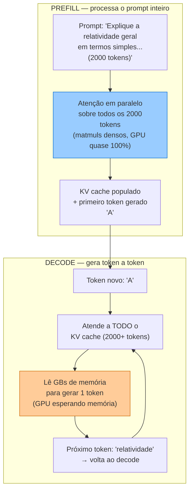
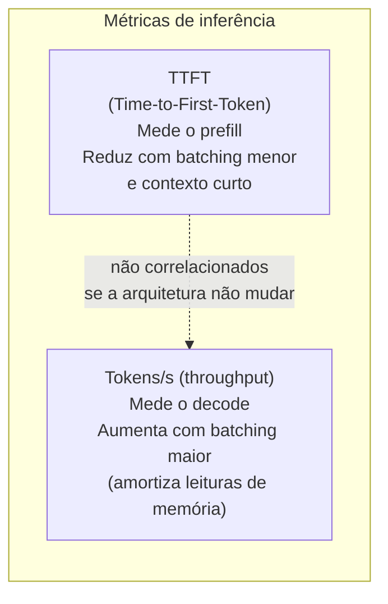
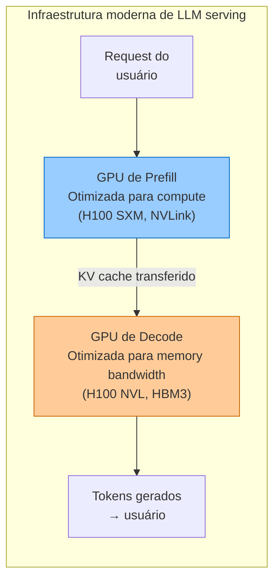
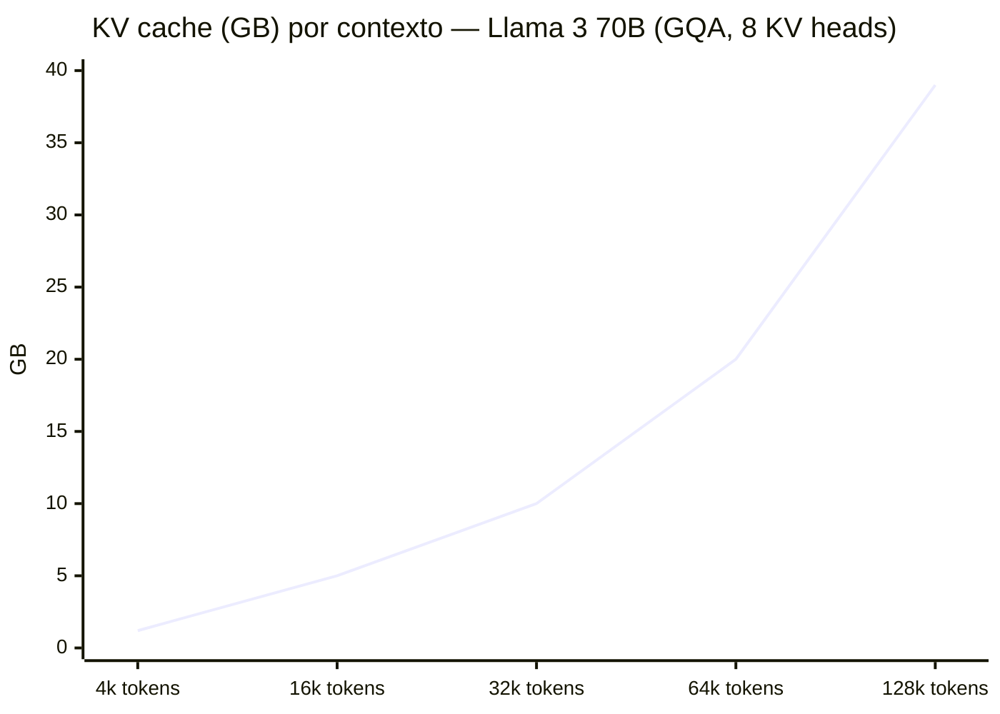

# KV cache, prefill e decode — a física da inferência

> [!info] Broto de [[04 - Atenção e o mecanismo transformer]]
> Esta é uma nota **Magus**: um aprofundamento da nota-mãe sobre atenção. Lá você aprende *o que é* a atenção e *como* o Transformer é montado. Aqui a pergunta muda: **quando o modelo está rodando de verdade, o que custa caro — e por quê?** Se você ainda não viu Query/Key/Value e a fórmula `softmax(QKᵀ/√d_k)V`, leia a [[04 - Atenção e o mecanismo transformer|nota 04]] primeiro; o resto daqui assume isso.

> [!abstract] TL;DR
> A mesma fórmula de atenção roda sob **duas físicas completamente diferentes** durante a inferência. No **prefill** (processar o prompt), todos os tokens entram em paralelo: a GPU faz matmuls densos e fica *compute-bound* — limitada pela velocidade de cálculo. No **decode** (gerar a resposta token a token), cada token novo precisa "reler" todo o passado: a GPU fica *memory-bound* — limitada pela velocidade de **leitura de memória**. O que torna o decode memory-bound é o **KV cache**: a estrutura que guarda as Keys e Values de todos os tokens já vistos para não recomputá-los. Entender esse cache explica metade da engenharia de inferência moderna — e por que contexto longo é caro de um jeito que o tamanho do modelo não captura.

## Por que isso importa

Quase toda métrica de produção de um LLM — latência, custo por token, quantos usuários cabem numa GPU, por que a primeira palavra demora e as seguintes saem rápido — cai diretamente desta divisão. Quem só conhece "o modelo tem N parâmetros" não consegue explicar por que **dobrar o contexto** pode quebrar o orçamento de memória enquanto o número de parâmetros não muda. A resposta mora aqui.

## O custo quadrático — a conta que assombra o contexto

Antes das duas fases, é preciso ver de onde vem a pressão. O cálculo `Q·Kᵀ` compara **cada token com todos os outros**. Dobre a sequência e você não dobra o trabalho: você o quadruplica.

| Tokens no contexto | Comparações       | Custo relativo |
| ------------------ | ----------------- | -------------- |
| 1.000              | 1.000.000         | 1×             |
| 10.000             | 100.000.000       | 100×           |
| 100.000            | 10.000.000.000    | 10.000×        |
| 1.000.000          | 1.000.000.000.000 | 1.000.000×     |

É o famoso **O(n²)**. É por isso que contextos de 1M de tokens exigem hardware especializado e a pilha de otimizações que detalho no broto irmão [[04c - Atenção eficiente — FlashAttention, sparse e híbrida|atenção eficiente]].

> [!question]- Se a atenção é O(n²), como modelos de 1M de tokens existem?
> Por uma pilha de truques que atacam ângulos diferentes da mesma conta — nenhum resolve sozinho:
> - O **FlashAttention** derruba a *constante* (não materializa a matriz N×N na memória lenta).
> - A **sparse/hybrid attention** quebra o próprio O(n²), fazendo a maioria das camadas olhar só localmente.
> - O **KV cache** + GQA/MLA fazem a memória caber.
> - A **paged attention** elimina o desperdício de alocação.
>
> É a combinação que torna 1M de tokens economicamente viável. O KV cache é a peça desta nota; as outras estão em [[04b - Encolhendo o KV cache — MHA, MQA, GQA, MLA|MHA→MLA]] e [[04c - Atenção eficiente — FlashAttention, sparse e híbrida|atenção eficiente]].

## As duas fases da atenção: prefill e decode

A inferência de um LLM não é um processo único. Ela tem dois atos, com gargalos opostos.

| Fase | O que acontece | Gargalo | GPU utilization (H100) |
| ---- | -------------- | ------- | ----------------------- |
| **Prefill** | O prompt inteiro é processado em paralelo — matmuls densos sobre milhares de tokens | **Compute-bound**: limitado pela velocidade de cálculo | ~90-95% |
| **Decode** | Cada token novo atende a todo o KV cache acumulado — uma passagem de olho por toda a memória | **Memory-bound**: limitado pela velocidade de *leitura de memória* | ~10-30% |

A intuição: no **prefill**, a GPU tem milhares de tokens para mastigar de uma vez — trabalho denso e paralelo, exatamente o que ela adora; ela passa quase todo o tempo *calculando*. No **decode**, ela gera **um token de cada vez**, e para isso precisa varrer o KV cache inteiro da memória. O cálculo em si é minúsculo; o tempo vai quase todo em *esperar a memória chegar*. A GPU fica ociosa, faminta por dados.

> [!tip] Uma metáfora
> Prefill é **ler um livro inteiro de uma vez** com os olhos voando pela página — limitado pela velocidade de leitura do cérebro (compute). Decode é **escrever a continuação palavra por palavra, relendo todo o livro a cada nova palavra** — limitado pela velocidade de folhear (memória). É a releitura que mata; o KV cache existe para baratear essa releitura.

## As consequências operacionais da divisão

Essa divisão explica fatos de produção que parecem desconexos quando você não sabe a causa:

**TTFT e tokens/s são métricas completamente independentes:**

Um modelo pode ter TTFT alto (prefill lento) e throughput alto (decode rápido), ou o inverso. Ajustar um sem cuidado pode degradar o outro.

> [!warning] Armadilha: TTFT e throughput não são correlacionados
> É tentador tratar "latência do LLM" como uma métrica única. Não é. TTFT mede o prefill (compute-bound); tokens/s mede o decode (memory-bound). Otimizar um não move o outro na mesma direção — reduzir o batch size pode melhorar o TTFT de uma request individual e ao mesmo tempo piorar o throughput agregado do servidor. Confundir as duas métricas leva a otimizar a coisa errada para o problema que o usuário realmente sente.

**Batching melhora o throughput, mas não o TTFT:**

Quando 8 usuários fazem decode simultaneamente, a GPU carrega o KV cache dos 8 em batch — a leitura de memória é amortizada entre 8 requests, dividindo o custo por 8. O throughput melhora linearmente com o batch size (até o limite de VRAM). O TTFT de *cada request individual*, porém, não melhora — o prefill é inerentemente sequencial dentro de uma request.

**Prefill-decode disaggregation** — a consequência arquitetural mais profunda:

Separar as duas fases em GPUs distintas (cada uma otimizada para seu gargalo) é a direção da infraestrutura de produção de 2025-2026. O custo: transferência do KV cache entre GPUs (que pode ser GBs por request).

## O KV cache — o monstro de memória que governa a inferência

Você acabou de ver que o decode é *memory-bound*. O **KV cache** é a razão exata disso — e entender essa única estrutura explica metade da engenharia de inferência moderna.

**O problema:** Na geração autoregressiva, cada token novo precisa atender a *todos* os anteriores — ou seja, precisa das Keys e Values de todo o passado. Sem cache, a cada passo o modelo recomputaria K e V da sequência inteira: gerar o token 1.000 recomputaria 999 pares K/V; o token 1.001, mais 1.000… um desperdício O(n²) só para reconstruir o que já se sabia.

**A solução:** Computa-se K e V de cada token **uma única vez**, quando ele entra, e guarda-se na VRAM. Cada token novo só calcula o *seu* Q, K, V; os K/V antigos vêm do cache. O custo de gerar um token cai de O(n²) para O(n) — ao preço de carregar o cache inteiro da memória a cada passo. É *exatamente* esse carregamento que torna o decode memory-bound.

> [!question]- Por que cachear K e V, mas não o Q?
> Porque o Q de um token é usado **uma vez só**: no passo em que esse token é gerado, para perguntar ao passado. Depois disso, ninguém mais consulta o Q dele. Já o K e o V de cada token são consultados por **todos os tokens futuros** — então vale a pena guardá-los. Cachear o Q não economizaria nada.

**O custo:** O cache cresce **linearmente** com o contexto, e a conta é brutal:

$$\text{KV por token} = 2 \times L \times n_{kv} \times d_{head} \times \text{bytes}$$

O 2 é um para K e outro para V. Para modelos reais (FP16, 2 bytes):

| Modelo | Config | KV/token | Cache p/ 100k tokens |
| ------ | ------ | -------- | -------------------- |
| Llama 2 70B (MHA) | 80 cam · 64 heads · d=128 | ~2,5 MB | **~250 GB** |
| Llama 3 70B (GQA) | 80 cam · **8** KV heads · d=128 | ~0,31 MB | **~31 GB** |

Uma H100 tem 80 GB. Com os pesos do modelo ocupando ~35 GB (Llama 3 70B em BF16), sobram ~45 GB para o KV cache — o que corresponde a ~145k tokens de contexto em GQA. Um único usuário com contexto de 200k tokens já esgota a GPU. É por isso que toda a engenharia de inferência gira em torno de encolher esse cache.

> [!warning] Armadilha: dobrar o contexto não dobra o custo de compute
> A tentação é pensar "2× mais tokens no prompt = 2× mais caro para rodar". Falso em dois sentidos opostos. No **prefill**, o custo é O(n²) — dobrar o contexto **quadruplica** o compute, não duplica. No **decode**, o "custo" que explode não é compute, é **memória**: o KV cache cresce linearmente, mas é a VRAM disponível (fixa, ~80 GB numa H100) que quebra primeiro, muito antes de o compute virar o gargalo. Confundir "mais tokens" com "mais compute proporcional" é o erro clássico de quem estima capacidade de servir sem separar as duas físicas.

> [!warning] O cache é por-request e por-token
> Diferente dos pesos do modelo (fixos e compartilhados entre todos os usuários), o KV cache é **privado de cada conversa** e **cresce com cada token gerado**. É por isso que servir muitos usuários com contextos longos esgota a VRAM muito antes de esgotar o compute — e por que [[13 - Prompt caching e otimizações de API|prompt caching]] (reaproveitar o prefill de prefixos repetidos) virou uma alavanca econômica central.

## Como explicar em inglês

LLM inference has two physically distinct phases. The **prefill** phase processes the entire prompt in parallel — massive matrix multiplications that keep the GPU compute-bound. The **decode** phase generates one token at a time, and each token must attend to every previously generated token via the KV cache: the GPU becomes memory-bound, spending most of its time waiting for data from HBM rather than calculating. The **KV cache** stores the Key and Value tensors of every seen token to avoid recomputing them, but grows linearly with context length — this is the single biggest factor explaining why doubling the context window can break the memory budget without changing the model size.

| PT | EN |
|----|---|
| Prefill | Prefill |
| Decodificação (geração) | Decode / decoding |
| Limitado por compute | Compute-bound |
| Limitado por memória | Memory-bound |
| Cache de Key/Value | KV cache |
| Tempo até o primeiro token | Time-to-first-token (TTFT) |
| Tokens por segundo | Tokens per second (throughput) |
| Largura de banda de memória | Memory bandwidth |
| Desagregação prefill-decode | Prefill-decode disaggregation |
| Atenção por página | Paged attention |
| Batching de requests | Request batching |

## Ver mais

- **[Andrej Karpathy — Intro to Large Language Models (2023)](https://www.youtube.com/watch?v=zjkBMFhNj_g)** — seção de inferência (~minuto 45) cobre KV cache e por que o decode é diferente do prefill. Uma das melhores introduções de alto nível para quem já sabe programar.
- **[Towards Data Science — Prefill Is Compute-Bound. Decode Is Memory-Bound.](https://towardsdatascience.com/prefill-is-compute-bound-decode-is-memory-bound-why-your-gpu-shouldnt-do-both/)** — artigo curto com os números reais de utilização de GPU em cada fase.
- **[vLLM — Paged Attention paper](https://arxiv.org/abs/2309.06180)** — como a paged attention resolve a fragmentação de memória do KV cache em serving de alta concorrência.

## O que vem a seguir

Você já sabe *por que* o KV cache existe e *por que* ele cresce até quebrar o orçamento de VRAM. A pergunta natural agora é: dá para encolher esse cache sem perder qualidade? É exatamente aí que mora o broto irmão [[04b - Encolhendo o KV cache — MHA, MQA, GQA, MLA]] — a família de variantes (Multi-Head, Multi-Query, Grouped-Query, Multi-Head Latent Attention) que ataca o tamanho do cache compartilhando ou comprimindo Keys e Values entre heads, trocando um pouco de expressividade por memória de sobra.

## Veja também

- [[04 - Atenção e o mecanismo transformer]] — a nota-mãe: o que é atenção, Q/K/V, softmax, multi-head
- [[04b - Encolhendo o KV cache — MHA, MQA, GQA, MLA]] — as variantes de atenção que atacam o tamanho do cache
- [[04c - Atenção eficiente — FlashAttention, sparse e híbrida]] — atacando a própria conta O(n²)
- [[06 - A janela de contexto]] — a consequência prática: quanto cabe e quanto custa
- [[13 - Prompt caching e otimizações de API]] — reaproveitar o prefill de prefixos repetidos
- [[14 - Streaming, batching e latência]] — TTFT, tokens/s e batching na prática

## Referências

- **Towards Data Science** — [*Prefill Is Compute-Bound. Decode Is Memory-Bound.*](https://towardsdatascience.com/prefill-is-compute-bound-decode-is-memory-bound-why-your-gpu-shouldnt-do-both/) (2025). As duas físicas da inferência.
- **Analytics Vidhya** — [*How KV Caching Makes Modern LLMs Fast?*](https://www.analyticsvidhya.com/blog/2025/11/kv-caching-guide/) (2025). A matemática do KV cache e por que ele domina a memória no decode.
- **Vaswani et al.** — *Attention Is All You Need* (NeurIPS, 2017). O paper fundador da atenção.
- **Kwon et al.** — [*Efficient Memory Management for Large Language Model Serving with PagedAttention*](https://arxiv.org/abs/2309.06180) (2023). A solução de fragmentação de VRAM do KV cache em serving.
