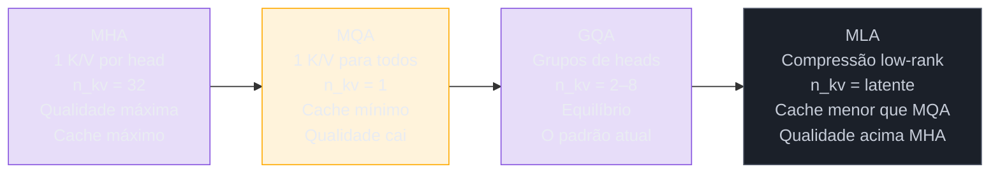
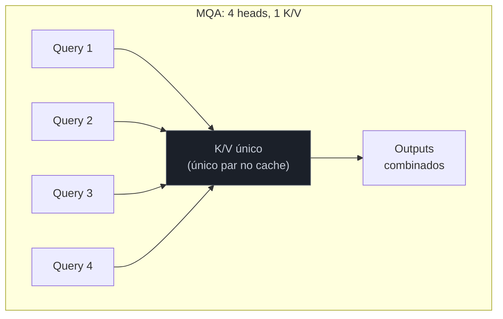
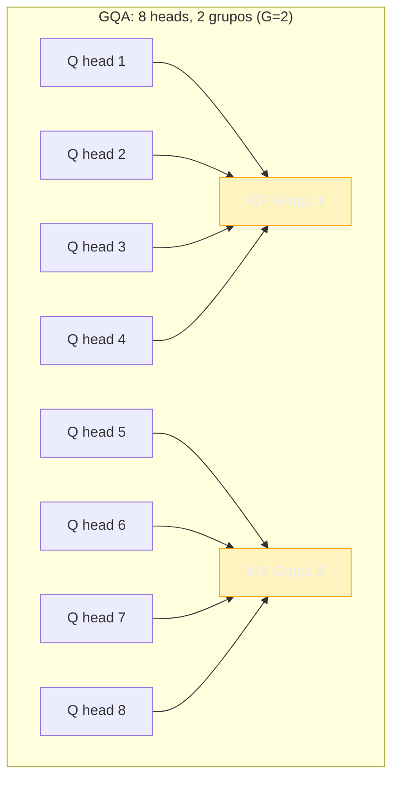
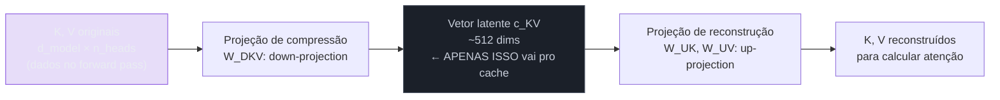
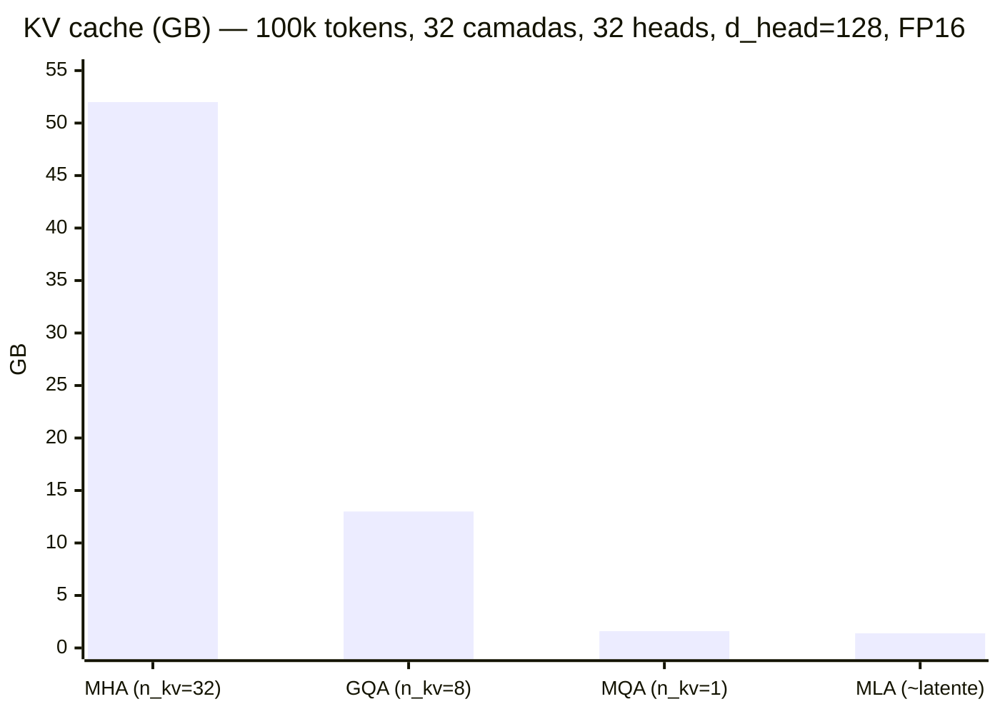

# Encolhendo o KV cache — MHA, MQA, GQA, MLA

> [!info] Broto de [[04 - Atenção e o mecanismo transformer]]
> Nota **Magus**. Continuação direta de [[04a - KV cache, prefill e decode — a física da inferência|KV cache, prefill e decode]] — leia aquele broto primeiro: ele mostra *por que* o KV cache domina a memória do decode. Aqui a pergunta é o passo seguinte: **como encolher esse cache sem destruir a qualidade do modelo?**

> [!abstract] TL;DR
> A fórmula do cache é `2 × L × n_kv × d_head × seq_len × bytes`. Camadas (L) e dimensão por head (d_head) são fixas. A **única alavanca real é n_kv** — quantos conjuntos distintos de Key/Value o modelo precisa guardar. MHA (original): n_kv = n_heads. MQA: n_kv = 1. GQA: n_kv = poucos grupos. MLA: comprime K/V em vetor latente low-rank, quebrando o trade-off qualidade vs. memória. A evolução de MHA → MQA → GQA → MLA é a história de como os modelos modernos tornaram viável contexto de 100k–1M tokens.

## Por que isso importa: o impasse da janela longa

[[04a - KV cache, prefill e decode — a física da inferência|Você já viu]] que o KV cache de um contexto de 100k tokens em MHA puro não cabe em uma GPU. Sem uma solução para isso, contexto longo seria economicamente impossível. Nenhum dos modelos com janela de 128k, 200k ou 1M tokens existiria.

Esta é a corrida de engenharia que tornou viável o que hoje parece banal — e cai em entrevista de qualquer vaga de infra de LLM.

## A única alavanca: n_kv

Olhe de novo a fórmula:

$$\text{KV cache} = 2 \times L \times n_{kv} \times d_{head} \times T \times \text{bytes}$$

Onde:
- $2$ = Key + Value (dois tensores)
- $L$ = número de camadas (e.g., 32 para Llama 3 70B)
- $n_{kv}$ = número de grupos de K/V **← a única alavanca livre**
- $d_{head}$ = dimensão por head (e.g., 128)
- $T$ = número de tokens no contexto
- $bytes$ = 2 (FP16) ou 1 (INT8)

Para um modelo com $L=32$, $d_{head}=128$, $T=100.000$, em FP16 ($bytes=2$):

| Variante | n_kv | KV cache (100k tokens) | vs. MHA |
|----------|------|------------------------|---------|
| MHA | 32 | **52 GB** | 1× |
| GQA (8 grupos) | 8 | **13 GB** | 4× menor |
| MQA | 1 | **1,6 GB** | 32× menor |
| MLA | ~3–4 equiv.* | **~1,4 GB** | 37× menor |

*MLA comprime em dimensão latente (~512), não em n_kv diretamente — o equivalente é aproximado.*

Toda a tabela abaixo é uma forma diferente de mexer no n_kv — ou de atacar o problema de ângulo diferente (MLA).

## A evolução em quatro movimentos

### MHA — Multi-Head Attention (2017)

O original. 32 heads → 32 conjuntos independentes de K/V. Cada head tem total liberdade para "olhar" para o que quiser no contexto, com seu próprio par Key/Value.

- **Vantagem:** qualidade máxima — cada head pode especializar sua atenção de forma independente
- **Problema:** cache proporcional a n_heads. Com 32 heads e 100k tokens, ~52 GB. Impraticável para janelas longas.

### MQA — Multi-Query Attention (Shazeer, 2019)

Primeira grande pancada: e se *todos* os heads compartilhassem **um único** par K/V, mudando apenas a Query entre heads?

O cache encolhe de n_heads × (K+V) para apenas 1 × (K+V). Para 32 heads: **32× menor**. De 52 GB → 1,6 GB.

O custo: com um único par K/V, todos os heads "veem" o mesmo contexto comprimido. O modelo perde nuance — em modelos grandes, a qualidade degrada de forma perceptível em tarefas que exigem raciocínio de múltiplos ângulos sobre o contexto.

> [!warning] Armadilha: MQA some com nuance justamente onde ela mais importa
> Em modelos pequenos, o corte de n_kv=1 quase não se nota — não há muita especialização entre heads para perder. Mas em modelos grandes, onde os heads de fato se especializavam em ângulos diferentes do contexto (um head rastreando sintaxe, outro relação de longa distância, outro entidades), forçar todos a compartilhar um único K/V apaga essa divisão de trabalho. O sintoma aparece em benchmarks de raciocínio multi-hop ou de recuperação de múltiplos fatos no contexto — não em perplexity média, que costuma parecer aceitável. É por isso que MQA praticamente não sobreviveu em modelos de fronteira: o dial foi puxado longe demais.

### GQA — Grouped-Query Attention (Google, 2023)

O meio-termo que venceu. Em vez de 1 K/V para todos ou n_heads K/Vs distintos, GQA divide os heads em **G grupos** (e.g., G=8), cada grupo com seu próprio K/V:

Com G=8 grupos (de 32 heads), o cache encolhe 4× comparado ao MHA — de 52 GB → 13 GB para 100k tokens. A perda de qualidade é mínima: os heads dentro de um grupo ainda têm Queries independentes; só o K/V é compartilhado.

GQA é o padrão de Llama 2/3, Mistral e Qwen: o dial sintonizado no ponto certo entre MHA e MQA.

> [!question]- Dá para ligar GQA num modelo já treinado em MHA?
> Não é troca imediata — mas dá para converter com *uptraining*: agrupam-se os K/V heads (média dos pesos) e re-treina-se com uma fração pequena do compute original (~5%). O modelo se reacomoda ao novo regime de compartilhamento. Foi assim que o Llama 2 adicionou as versões GQA. Trocar a arquitetura de atenção tem custo — mas é ordens de grandeza mais barato que treinar do zero.

> [!warning] Armadilha: GQA não é uma flag que se liga — é um re-treino
> É tentador achar que dá pra pegar um checkpoint MHA pronto e "religar" pra GQA mudando um parâmetro de config no momento da inferência. Não dá: os pesos de projeção K/V foram treinados para produzir um par por head; agrupá-los sem ajuste degrada a qualidade imediatamente, porque o modelo nunca aprendeu a operar com K/V compartilhado entre heads do mesmo grupo. O caminho real é o uptraining descrito acima — agrupar os pesos e re-treinar com uma fatia do compute original. Ignorar essa etapa (ou orçar a migração como "custo zero") é o erro mais comum de quem decide adotar GQA em um modelo legado.

### MLA — Multi-head Latent Attention (DeepSeek, 2024)

MLA muda a estratégia completamente. Em vez de reduzir o número de K/V (dial MQA/GQA), MLA **comprime** Key e Value num vetor latente de baixa dimensão antes de armazenar no cache:

O cache armazena apenas o vetor comprimido (~512 dimensões) em vez dos K/V completos (n_heads × d_head = 32 × 128 = 4096 por camada). Na hora de calcular a atenção, o vetor latente é "descomprimido" via up-projection.

**O resultado surpreendente:** o MLA consegue cache *menor que o MQA* e qualidade *acima do MHA*. Por quê? A compressão low-rank atua como um regularizador que força o modelo a extrair representações mais compactas e generalizáveis — é um gargalo de informação que, paradoxalmente, melhora a qualidade.

> [!tip] A intuição do MLA em uma frase
> MQA/GQA economizam **jogando informação fora** (menos K/V distintos). MLA economiza **comprimindo** (guarda uma versão enxuta e reconstrói quando precisa) — por isso consegue cache pequeno *sem* o sacrifício de qualidade. É a diferença entre apagar fotos e zipar a pasta de fotos.

> [!warning] Armadilha: MLA troca memória por compute no decode
> A tabela de "cache menor" esconde um custo que não aparece nela: a up-projection (W_UK, W_UV) que reconstrói K e V a partir do vetor latente precisa rodar a cada passo de decode, para cada token novo. Isso é FLOPs extras no caminho crítico da geração — exatamente onde o decode já é bound por latência, não por throughput. MLA vence a conta de memória, mas quem projeta o serving precisa orçar esse compute adicional; tratar MLA como "ganho grátis" de cache é ignorar metade da troca.

## Comparativo final: o que cada variante escolhe sacrificar

| Variante | Sacrifício | Ganho | Em produção |
|----------|-----------|-------|-------------|
| **MHA** | Cache máximo (~52 GB/100k) | Qualidade máxima | GPT-2, BERT, modelos antigos |
| **MQA** | Qualidade cai em escala | Cache 32× menor | PaLM, alguns modelos de edge |
| **GQA** | Leve perda de nuance | Cache 4–8× menor | Llama 2/3, Mistral, Qwen |
| **MLA** | Custo de up-projection em cada step | Cache 37× menor que MHA, qualidade acima | DeepSeek V2/V3 |

## O que vem a seguir

MHA → MQA → GQA → MLA ataca o problema pelo lado do **tamanho** do KV cache: menos bytes armazenados por token. Mas há um segundo eixo de custo que essas variantes não tocam — o cálculo da atenção em si é O(n²) no comprimento do contexto, e mover esse cache (mesmo pequeno) entre memória HBM e SRAM da GPU também consome tempo. Esse é o ataque de [[04c - Atenção eficiente — FlashAttention, sparse e híbrida|FlashAttention e as atenções esparsas/híbridas]]: em vez de encolher o que fica no cache, reduzir o custo de computar e mover a atenção inteira. As duas frentes são complementares — um modelo de produção moderno (DeepSeek V3, por exemplo) tipicamente combina MLA/GQA *com* um kernel de atenção eficiente.

## Como explicar em inglês

Multi-Head Attention variants all address the same bottleneck: the KV cache grows linearly with sequence length, making long contexts prohibitively expensive. The key parameter is n_kv — how many distinct Key/Value sets the model stores. MHA keeps one per head (maximum quality, maximum cache). MQA collapses all heads to a single KV pair (minimum cache, quality degrades at scale). GQA groups heads to share KV pairs, hitting the sweet spot between the two. MLA takes a different approach: it compresses K and V into a low-rank latent vector before caching, then reconstructs them at attention time — achieving smaller cache than MQA while matching or exceeding MHA quality.

| PT | EN |
|----|---|
| Atenção multi-cabeça | Multi-Head Attention (MHA) |
| Atenção multi-query | Multi-Query Attention (MQA) |
| Atenção de query agrupada | Grouped-Query Attention (GQA) |
| Atenção latente multi-cabeça | Multi-head Latent Attention (MLA) |
| Vetor latente | Latent vector |
| Projeção de compressão | Down-projection / compression projection |
| Projeção de reconstrução | Up-projection / reconstruction projection |
| Matriz de baixo rank | Low-rank matrix |
| Grupos de heads | Head groups |
| Re-treinamento de conversão | Uptraining |

## Ver mais

- **[Understand Grouped Query Attention — MHA, MQA e GQA (2025)](https://www.youtube.com/watch?v=kx3rETIxo4Q)** — cobertura da progressão MHA → MQA → GQA enquadrando o GQA como ponte para a atenção latente. Publicado abr/2025.
- **[Gen AI Transformer Attention — MHA, MQA & GQA (2024)](https://www.youtube.com/watch?v=p7tkYIH46zg)** — visão compacta das três variantes em um único vídeo. Publicado jun/2024.
- **[Flash Attention from First Principles — Umar Jamil](https://www.youtube.com/watch?v=zy8ChVd_oTM)** — derivação matemática do FlashAttention (IO-aware, tiling) e implementação em Triton. Complemento ideal para a nota [[04c - Atenção eficiente — FlashAttention, sparse e híbrida]].

## Veja também

- [[04a - KV cache, prefill e decode — a física da inferência]] — por que o cache importa (pré-requisito desta nota)
- [[04 - Atenção e o mecanismo transformer]] — a nota-mãe: o que são os heads e o mecanismo de atenção
- [[04c - Atenção eficiente — FlashAttention, sparse e híbrida]] — o outro ataque: reduzir o custo O(n²) do cálculo da atenção
- [[08 - Modelos chineses — DeepSeek, Qwen, Kimi, GLM]] — MLA e GQA em produção no DeepSeek e Qwen
- [[09 - Dense vs Mixture-of-Experts]] — a outra grande alavanca de eficiência (FFN esparsa vs. densa)

## Referências

- **Shazeer, Noam** — [*Fast Transformer Decoding: One Write-Head is All You Need*](https://arxiv.org/abs/1911.02150) (2019). O paper original do Multi-Query Attention.
- **Ainslie et al.** — [*GQA: Training Generalized Multi-Query Transformer Models from Multi-Head Checkpoints*](https://arxiv.org/abs/2305.13245) (Google, 2023). Grouped-Query Attention e o uptraining.
- **DeepSeek-AI** — [*DeepSeek-V2: A Strong, Economical, and Efficient Mixture-of-Experts Language Model*](https://arxiv.org/abs/2405.04434) (2024). Multi-head Latent Attention (MLA) e a compressão low-rank do KV cache.
