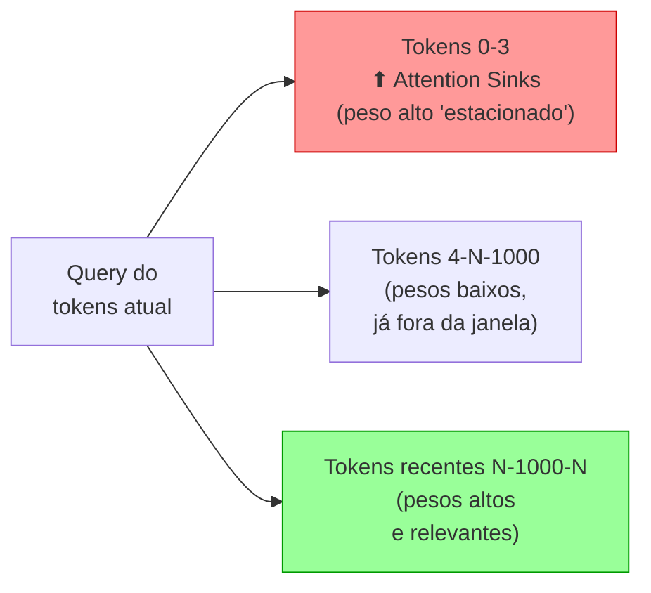
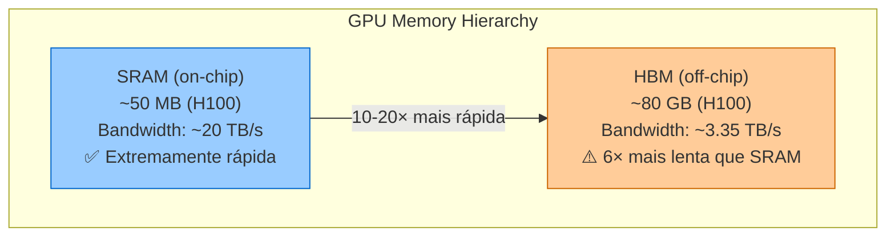
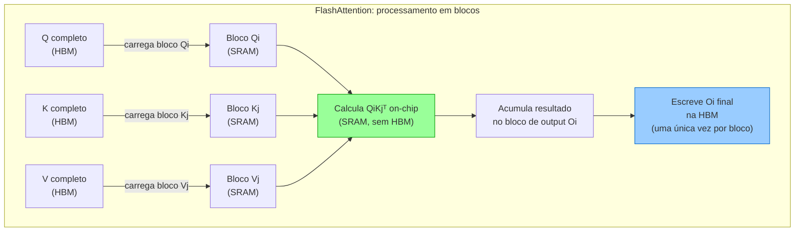
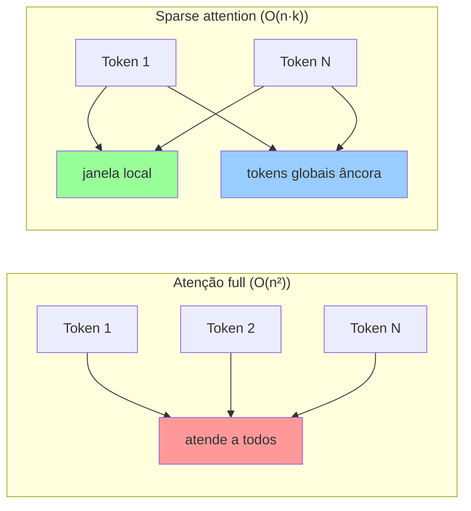
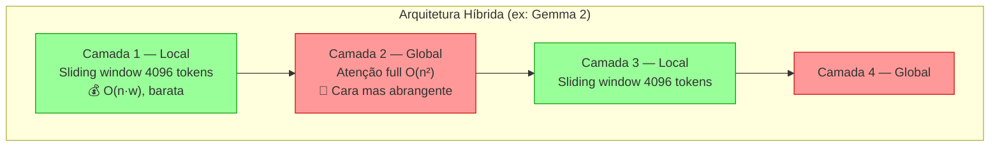

# Atenção eficiente — FlashAttention, sparse e híbrida

> [!info] Broto de [[04 - Atenção e o mecanismo transformer]]
> Nota **Magus**. Enquanto [[04a - KV cache, prefill e decode — a física da inferência|KV cache]] e [[04b - Encolhendo o KV cache — MHA, MQA, GQA, MLA|MHA→MLA]] atacam a **memória do decode**, este broto ataca a **conta O(n²) do prefill em si** — como fazer o cálculo da atenção custar menos sem mudar (ou quase) o resultado. Leia a [[04 - Atenção e o mecanismo transformer|nota-mãe]] antes; tudo aqui assume a fórmula `softmax(QKᵀ/√d_k)V`.

> [!abstract] TL;DR
> A atenção é O(n²), mas há duas famílias de ataque. A primeira mantém o resultado **exato** e só muda a *física da execução*: o **FlashAttention** nunca escreve a matriz N×N na memória lenta da GPU — calcula a atenção em blocos que cabem na memória rápida on-chip (SRAM). A segunda família muda a *matemática*: a **sparse attention** faz cada token atender só a um subconjunto relevante (quebrando o O(n²)), e a **atenção híbrida** intercala camadas locais baratas com poucas camadas globais. Como pano de fundo, um efeito estrutural do softmax — os **attention sinks** — explica por que jogar fora os primeiros tokens do contexto destrói o modelo mesmo que eles não carreguem conteúdo importante.

## Por que isso importa: o problema da memória de atenção

Contexto de 128k ou 1M tokens não existe por uma ideia só — é uma pilha de otimizações que atacam ângulos diferentes da mesma conta O(n²). O FlashAttention é o kernel padrão de fato: se você treina ou serve qualquer modelo desde 2022, está usando. A fronteira 2025-2026 (sparse treinável) é o que decide se janelas gigantes serão caras ou baratas na próxima geração.

Antes de entrar no FlashAttention, vale quantificar o problema. Para calcular a atenção de N tokens, o algoritmo ingênuo materializa a matriz de scores $QK^T$ com dimensão N×N:

| N (tokens) | Tamanho da matriz QKᵀ (FP16) | Cabe na SRAM de uma GPU? |
|------------|-------------------------------|--------------------------|
| 1.024      | ~2 MB                         | Sim                       |
| 4.096      | ~32 MB                        | Às vezes (H100: ~50MB)   |
| 16.384     | ~512 MB                       | Não                       |
| 128.000    | ~32 GB                        | Absolutamente não         |
| 1.000.000  | ~2 TB                         | Impossível                |

Para N=128k, a matriz QKᵀ tem **16 bilhões de floats** — e ainda há a leitura/escrita de duas matrizes desse tamanho para o softmax. Sem FlashAttention, contexto longo simplesmente não escala.

## Attention sinks — o paradoxo do primeiro token

Antes de atacar o O(n²), convém entender um efeito colateral estrutural do softmax que condiciona todas as otimizações que vêm depois.

O softmax obriga os pesos de atenção a **somarem 1** para cada token. Quando a query de um token não encontra match forte em nenhum token anterior, o modelo ainda é obrigado a distribuir essa atenção em algum lugar — e despeja nos **primeiros tokens** da sequência. Como esses tokens são visíveis a quase todos os tokens subsequentes (natureza autoregressiva), o treinamento os converte em **attention sinks**: tokens que recebem atenção alta sistematicamente sem carregar semântica proporcional a esse peso.

A consequência de produção é contraintuitiva: **remover os primeiros tokens do KV cache** (como faria uma sliding window ingênua) **destrói a qualidade** — não por perder contexto antigo, mas por remover o destino padrão da atenção sobrando. Sem os sinks, o softmax fica instável.

O **StreamingLLM** explora exatamente esse insight: em vez de descartar os primeiros tokens, mantém permanentemente apenas os 4 primeiros (os sinks) e desliza a janela para o resto. Resultado: processamento de 4M+ tokens com estabilidade, consumindo KV cache constante — e sem retreino do modelo.

## FlashAttention — atenção que evita a memória lenta

> [!question]- Se a atenção é O(n²) em FLOPs, por que dizem que o gargalo é memória, não compute?
> Em GPUs modernas, FLOPs são baratos e a *transferência de dados* é cara. O custo dominante da atenção não é multiplicar matrizes — é **materializar a matriz N×N na HBM** (High Bandwidth Memory: a memória principal da GPU, vasta mas lenta) e lê-la de volta para o softmax. Para N=128k, esse tráfego de memória domina o relógio por uma ordem de grandeza vs. a aritmética pura.

A GPU tem duas hierarquias de memória radicalmente diferentes:

A **atenção ingênua** usa a HBM liberalmente:
1. Lê Q, K da HBM → escreve QKᵀ na HBM (~32 GB para N=128k)
2. Lê QKᵀ da HBM → aplica softmax → escreve na HBM (outra leitura + escrita de 32 GB)
3. Lê softmax output + V da HBM → computa produto final

Para N=128k: **~200 GB de tráfego de memória** só para calcular atenção, em cada camada, em cada step.

O **FlashAttention** elimina esse tráfego com dois insights:

**Insight 1 — Tiling (blocos que cabem na SRAM):**

A matriz N×N **nunca é materializada** — ela é calculada um bloco de cada vez, inteiramente dentro da SRAM rápida.

**Insight 2 — Online softmax:**

O softmax exige o valor máximo e a soma exponencial da linha inteira para normalizar. Num cálculo normal, você precisa da linha completa antes de softmax-izar. Com o FlashAttention, a linha é calculada em pedaços — então o softmax é calculado *incrementalmente*, atualizando as estatísticas (máximo atual $m$, soma atual $\ell$) a cada bloco novo. O resultado matemático é **idêntico ao softmax sobre a linha inteira** — sem perda de precisão.

> [!question]- Por que a versão 4 do FlashAttention é tanto mais rápida se a ideia é a mesma?
> A ideia central — nunca materializar N×N, calcular em blocos na SRAM — é idêntica desde FA1 (2022). O que evolui são os detalhes de hardware-software co-design: FA2 (2023) reorganizou loops para maximizar uso de tensor cores. FA3 (2024) adicionou warp specialization e FP8 para Hopper. FA4 (2026) reprojeta o pipeline para Blackwell, reduzindo rescaling no softmax em ~90% — chegando a 22% mais rápido que o kernel cuDNN para o mesmo resultado exato.

> [!warning] FlashAttention não acelera o decode token a token
> Todo o ganho do FlashAttention vem de amortizar o tráfego de memória sobre um **bloco** de queries processado de uma vez — é isso que torna o tiling e o online softmax valiosos. No decode autoregressivo, cada step gera **um único token novo**, ou seja, a query é uma linha só: não há bloco de queries para amortizar. O gargalo do decode passa a ser outro — ler o KV cache inteiro da HBM a cada token (é o problema atacado por [[04a - KV cache, prefill e decode — a física da inferência|KV cache]] e [[04b - Encolhendo o KV cache — MHA, MQA, GQA, MLA|MHA→MLA]]). Por isso o FlashAttention é a peça que faz o **prefill** escalar, não a que faz o decode ser rápido.

## Vídeo: FlashAttention derivado do zero

Umar Jamil deriva o FlashAttention matematicamente desde os primeiros princípios — mostrando o problema de memória, o tiling, o online softmax — e depois implementa em Python com Triton. É a explicação técnica mais acessível do mecanismo real:

## Sparse e híbrida — quando O(n²) é alto demais

O FlashAttention baixa a *constante* do O(n²), mas o expoente permanece. Para quebrar o próprio expoente, é preciso fazer cada token atender a **menos** tokens.

| Otimização             | O que faz                                             | Complexidade     |
| ---------------------- | ----------------------------------------------------- | ---------------- |
| **Sparse Attention**   | Cada token atende só a um subconjunto relevante        | O(n·√n) ou O(n·log n) |
| **Paged Attention**    | Gerencia KV cache como "páginas" de memória virtual    | O(n) em memória  |
| **NSA (2025)**         | Sparse attention treinável com kernels hardware-aligned | O(n·k)          |
| **DSA (DeepSeek)**     | Lightning indexer: heads leves selecionam atenção plena | O(n·k)          |

A fronteira 2025-2026 é a **sparse attention treinável** — não um truque aplicado na inferência, mas esparsidade aprendida durante o treino. O **NSA** (*Native Sparse Attention*, fev/2025) treina o modelo já esparso; o **DSA** (DeepSeek-V3.2-Exp, set/2025) usa um *lightning indexer* — heads leves que pontuam quais tokens merecem atenção plena — atingindo 640 TFlops no prefill.

> [!warning] NSA e DSA não se aplicam a um modelo já treinado
> Diferente do FlashAttention (kernel exato, plugável em qualquer modelo já treinado) e até do StreamingLLM (remendo de inferência sem retreino), o padrão de esparsidade do NSA e do DSA é **parte da arquitetura** — aprendido durante o pré-treino junto com todos os outros pesos. Não dá para pegar um modelo com atenção densa já pronto e "ligar" NSA/DSA nele: a esparsidade precisa estar presente desde o início do treino para o modelo aprender a rotear informação certa para os tokens certos. Adotar essas técnicas é uma decisão que se toma **antes** de treinar, não depois.

### Atenção híbrida: local + global intercalados

Uma rota paralela à esparsidade pura: em vez de toda camada pagar O(n²), o modelo intercala dois tipos de camadas:

A maior parte do trabalho fica local e barata (O(n·w), onde w é o tamanho da janela). Só as camadas globais pagam O(n²) — e são minorias. O **Gemma 2** alterna 1:1 (janela de 4096 tokens nas camadas locais). O **GPT-OSS** usa janelas menores (128 tokens) com menos camadas globais ainda.

> [!warning] Cuidado com a dosagem de camadas locais
> Janelas pequenas demais ou camadas globais de menos degradam a qualidade — o modelo perde alcance de longo prazo. A atenção híbrida é **treinada na arquitetura** (diferente do StreamingLLM, que é remendo na inferência): errar os hiperparâmetros exige retreino completo.

## Como explicar em inglês

FlashAttention doesn't approximate attention — it computes exactly the same result as standard attention, but reorganizes the calculation to avoid writing the N×N attention matrix to slow HBM. Instead, it tiles Q, K, V into small blocks that fit in fast SRAM, computes attention on-chip block by block, and uses an online softmax to combine results incrementally. This turns a memory-bound operation into a compute-bound one, dramatically reducing wall-clock time and memory usage for long contexts. Sparse and hybrid attention go further by changing the O(n²) algorithm itself: sparse attention routes each token to a relevant subset of positions, while hybrid architectures alternate cheap local layers with a few expensive global ones.

| PT | EN |
|----|---|
| Atenção ingênua | Naive attention |
| Memória rápida on-chip | On-chip SRAM / fast memory |
| Memória lenta da GPU | HBM / off-chip memory |
| Divisão em blocos | Tiling |
| Softmax incremental | Online softmax |
| Ralos de atenção | Attention sinks |
| Janela deslizante | Sliding window |
| Atenção esparsa | Sparse attention |
| Atenção híbrida | Hybrid attention |
| Atenção local | Local attention |
| Atenção global | Global attention |
| Esparsidade treinável | Trainable sparsity / native sparse attention |

## O que vem a seguir

Este broto fechou o quadro de otimizações que atacam o **como** a atenção é calculada — kernel exato, esparsidade e arquitetura híbrida. A próxima nota, [[05 - Completação — o loop autoregressivo]], sai do mecanismo de atenção isolado e volta para o **loop** que o usa a cada passo: como o modelo escolhe o próximo token, por que esse loop é sequencial por natureza, e como prefill e decode (vistos em [[04a - KV cache, prefill e decode — a física da inferência]]) se encaixam nesse ciclo token a token.

## Ver mais

- **[Flash Attention Derived and Coded from First Principles — Umar Jamil](https://www.youtube.com/watch?v=zy8ChVd_oTM)** — derivação matemática do FlashAttention (IO-aware, tiling, online softmax) com implementação em Python/Triton. Nível Magus, sem exigir conhecimento prévio de CUDA.
- **[FlashAttention-2: Faster Attention with Better Parallelism — Tri Dao](https://tridao.me/blog/2022/flash-attention/)** — o post original do autor; leitura essencial para entender as versões do algoritmo.
- **[Efficient Streaming Language Models with Attention Sinks — StreamingLLM](https://arxiv.org/abs/2309.17453)** — paper dos attention sinks e da solução StreamingLLM; leitura direta.

## Veja também

- [[04 - Atenção e o mecanismo transformer]] — a nota-mãe: softmax, máscara causal, multi-head
- [[04a - KV cache, prefill e decode — a física da inferência]] — o ataque pela memória do decode
- [[04b - Encolhendo o KV cache — MHA, MQA, GQA, MLA]] — o ataque pelo tamanho do cache
- [[06 - A janela de contexto]] — a consequência: janelas de 1M tokens
- [[08 - Modelos chineses — DeepSeek, Qwen, Kimi, GLM]] — DSA e atenção esparsa em produção

## Referências

- **Dao, Tri et al.** — [*FlashAttention: Fast and Memory-Efficient Exact Attention with IO-Awareness*](https://arxiv.org/abs/2205.14135) (2022). A otimização que viabilizou contextos longos.
- **Dao, Tri** — [*FlashAttention-4: Algorithm and Kernel Pipelining Co-Design*](https://tridao.me/blog/2026/flash4/) (2026). O kernel de atenção mais otimizado para Blackwell.
- **Xiao et al.** — [*Efficient Streaming Language Models with Attention Sinks*](https://arxiv.org/abs/2309.17453) (2023). O paper dos attention sinks e do StreamingLLM.
- **Yuan et al.** — [*Native Sparse Attention: Hardware-Aligned and Natively Trainable Sparse Attention*](https://arxiv.org/abs/2502.11089) (2025). Sparse attention treinável (DeepSeek).
- **Gemma Team** — [*Gemma 2: Improving Open Language Models at a Practical Size*](https://arxiv.org/abs/2408.00118) (Google, 2024). Atenção híbrida local/global intercalada.
