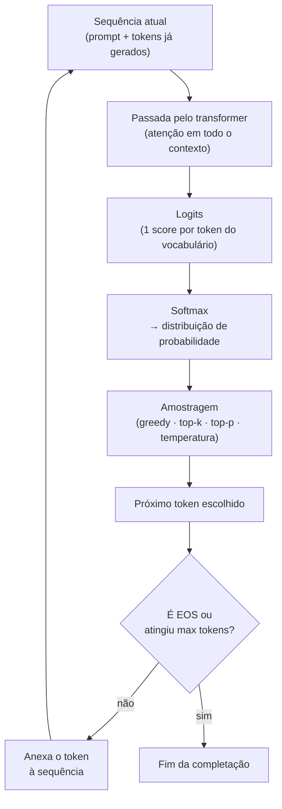

# Completação — o loop autoregressivo

> [!abstract] TL;DR
> Um LLM não escreve a resposta inteira de uma vez — ele gera **um token por vez**, em loop. A cada passo, a [[04 - Atenção e o mecanismo transformer|passada pelo transformer]] produz um **logit** (uma pontuação crua) para *cada* token do vocabulário; o **softmax** transforma esses logits numa distribuição de probabilidade; uma **estratégia de amostragem** (greedy, top-k, top-p, temperatura) escolhe o próximo token; ele é **anexado** ao texto, e tudo recomeça — agora com um token a mais de entrada. Isso é a **completação**: o modelo "completa" a sequência, relendo o que ele mesmo acabou de escrever, até soltar um token de parada. Toda a criatividade aparente mora num único ponto — a amostragem.

## O que é

No vocabulário de LLMs, todo input se divide em duas partes:

- **Prompt** — o texto que você dá ao modelo.
- **Completação** (*completion*) — o texto que o modelo produz a partir dali.

O nome vem do enquadramento original do GPT: o modelo não "responde", ele **completa uma sequência**. Você dá `"O céu é"` e ele completa com `" azul"`. Chat, instrução, código, tradução — por baixo, é tudo completação de texto. A interface de chat é só açúcar por cima desse mecanismo cru: as mensagens são formatadas num único texto longo, e o modelo continua de onde parou.

> [!info] "Completar texto" não é pouco
> Parece um truque simples — prever a próxima palavra. Mas para prever bem o próximo token de *qualquer* texto humano (uma prova de matemática, um diálogo, código que compila), o modelo é forçado a aprender gramática, fatos, raciocínio e estilo. A capacidade emerge do objetivo. Veja [[01 - O que é um LLM]].

## Por que importa

Entender a completação como **loop**, e não como uma "resposta mágica", é o que separa quem usa LLM no escuro de quem entende o que está pagando e por quê:

- **Custo e latência** nascem aqui: cada token de saída é uma passada inteira pela rede (ver [[06 - A janela de contexto#O custo real do contexto: prefill, decode e KV cache|prefill vs decode]]). Gerar 500 tokens custa mais latência que ler 5.000 de prompt.
- **`temperature`, `top_p`, `top_k`** só fazem sentido quando você sabe que eles atuam na *escolha* do token, não no "pensamento" do modelo (ver [[11 - APIs de LLM — anatomia de uma chamada]]).
- **Não-determinismo**: por que a mesma pergunta dá respostas diferentes? Porque a amostragem sorteia. Saber disso é saber quando travar (`temperature=0`) e quando soltar.
- **Alucinação** tem raiz aqui: o modelo *sempre* tem uma distribuição de próximos tokens e *sempre* amostra um — ele nunca "não sabe", apenas atribui probabilidade. Confiança não é verdade.

## Como funciona: a camada de saída

Depois que o texto passa por [[02 - Tokens e tokenização|tokenização]], [[03 - Embeddings — do token ao vetor|embeddings]] e por todas as camadas de [[04 - Atenção e o mecanismo transformer|atenção]], o modelo tem, para a **última posição**, um vetor de estado final. Falta o passo que vira texto:

1. **Projeção para o vocabulário.** Esse vetor final é multiplicado por uma matriz de saída (a *unembedding*, muitas vezes amarrada à própria tabela de embedding). O resultado é um vetor com **um número por token do vocabulário** — tipicamente dezenas de milhares de valores. Cada número é um **logit**: a pontuação crua de "quão provável é que este seja o próximo token".

2. **Softmax → distribuição.** Logits não somam 1 e podem ser negativos. O **softmax** os transforma numa distribuição de probabilidade legítima (tudo entre 0 e 1, somando 1):
   $$\text{softmax}(x_i) = \frac{e^{x_i}}{\sum_j e^{x_j}}$$
   É exatamente o **mesmo softmax** que a [[04 - Atenção e o mecanismo transformer|atenção]] usa para normalizar scores — só que agora aplicado **sobre o vocabulário**, não sobre posições. (A nota 04 tem o callout que destrincha softmax vs. argmax.)

3. **Amostragem.** Da distribuição, escolhe-se *um* token. Como escolher é uma decisão de estratégia — a próxima seção.

> [!note] Só a última posição importa na geração
> Durante a geração, o transformer computa logits para todas as posições, mas só interessa a **última**: "dado tudo até aqui, qual o próximo token?". As posições anteriores já foram decididas. (No treino é diferente: todos os alvos são conhecidos e todas as posições são usadas de uma vez — por isso o treino paraleliza e a geração não.)

## O loop autoregressivo

O token escolhido é **anexado** à sequência, e o processo recomeça com a entrada um token mais longa. **Autoregressivo** quer dizer exatamente isso: cada saída vira parte da próxima entrada — o modelo lê o que ele mesmo acabou de escrever.



Um passeio concreto:

```
prompt: "O céu é"
  → [passada] → " azul"   → "O céu é azul"
  → [passada] → " e"      → "O céu é azul e"
  → [passada] → " claro"  → "O céu é azul e claro"
  → [passada] → <EOS>     → para.
```

> [!warning] Por que parece que o modelo "pensa antes de responder"
> Não pensa. Cada token é uma passada completa e independente pela rede. O que dá a ilusão de raciocínio é (a) a [[04 - Atenção e o mecanismo transformer|atenção]] deixando cada passo enxergar todo o contexto anterior, e (b) — nos *reasoning models* — o modelo gastar muitos tokens "pensando em voz alta" antes da resposta final (ver [[15 - Reasoning models e chain-of-thought]]). O mecanismo continua sendo um token de cada vez.

### A conexão com prefill, decode e KV cache

O loop tem duas fases, detalhadas em [[06 - A janela de contexto#O custo real do contexto: prefill, decode e KV cache|A janela de contexto]] e em [[04 - Atenção e o mecanismo transformer|Atenção e o mecanismo transformer]]:

- **Prefill** — a primeira passada processa o prompt inteiro de uma vez (paralelizável) e produz o logit do primeiro token.
- **Decode** — daí em diante é token a token, sequencial, cada novo token atendendo a todo o histórico.

Para não recomputar tudo a cada passo, o modelo guarda as chaves/valores das posições já vistas no **KV cache**. Esta nota não reexplica essa mecânica — ela é o "esqueleto" sobre o qual a amostragem roda. O foco aqui é a *decisão*: dada a distribuição, qual token sai.

## Estratégias de amostragem

Até os logits, o transformer é **determinístico**: a mesma entrada produz os mesmos logits. Toda a variação ("criatividade") entra na hora de escolher o token a partir da distribuição. As estratégias:

### Greedy (argmax)

Pega sempre o token de **maior probabilidade**. Totalmente determinístico. Bom para tarefas factuais e extração, mas tende a ficar **repetitivo** e a cair em loops (`"muito muito muito…"`), porque ignora a riqueza da distribuição.

### Temperatura

Antes do softmax, divide-se cada logit por um número `T`, a **temperatura** — o "botão de dureza" da distribuição:

- `T < 1` **afia** a distribuição (concentra massa no topo → mais conservador/determinístico).
- `T > 1` **achata** a distribuição (espalha massa → mais diverso/arriscado).
- `T → 0` vira greedy; `T = 1` usa a distribuição crua.

> [!example] Temperatura na prática (3 tokens, logits `[2,0 · 1,0 · 0,1]`)
> | | token A | token B | token C |
> |---|---|---|---|
> | **T = 1** (crua) | 66% | 24% | 10% |
> | **T = 0,5** (afiada) | 86% | 12% | 2% |
> | **T = 2** (achatada) | 50% | 30% | 20% |
>
> Mesma rede, mesmos logits — só o `T` muda. Em `T=0,5` o modelo quase sempre escolhe A; em `T=2` C ganha uma chance real de aparecer. É o mesmo mecanismo que a [[04 - Atenção e o mecanismo transformer|nota da atenção]] descreve para o softmax dos scores, agora aplicado à saída.

### Top-k

Mantém só os **`k` tokens mais prováveis**, zera o resto, renormaliza e amostra. Limita o estrago (nunca escolhe um token absurdo), mas `k` é fixo: num momento em que só 2 tokens fazem sentido, um `k=50` ainda deixa entrar 48 ruins; num momento ambíguo, pode cortar opções legítimas.

### Top-p (nucleus sampling)

Mantém o **menor conjunto de tokens cuja probabilidade acumulada ≥ `p`** (ex.: `p=0,9` → o "núcleo" que cobre 90% da massa), renormaliza e amostra. A vantagem sobre o top-k é ser **adaptativo**: quando o modelo está confiante (um token domina), o núcleo encolhe; quando está incerto (massa espalhada), o núcleo cresce. Hoje é o default mais comum, frequentemente combinado com temperatura.

> [!tip] Como pensar nos três juntos
> **Temperatura** decide o quão "ousada" é a distribuição; **top-k** e **top-p** decidem quais caudas cortar antes de sortear. Para saída factual/estruturada: `temperature` baixa (ou 0). Para texto criativo: `temperature` ~0,7–1,0 + `top_p` ~0,9. Mexa em **um** de cada vez — `temperature` e `top_p` juntos no talo brigam entre si.

### Penalidades (de repetição/frequência)

Ajustes opcionais que **subtraem** dos logits de tokens já usados, para reduzir repetição. Úteis contra loops, mas em excesso forçam o modelo a evitar palavras necessárias (artigos, nomes próprios).

## Controle do loop: quando parar

O loop não roda para sempre. Ele termina quando:

- **Token de parada (EOS)** — o modelo amostra um token especial de "fim de sequência" que ele aprendeu a emitir quando a resposta está completa. É o término "natural".
- **`max_tokens`** — teto rígido definido na chamada de API. Atingiu, corta — mesmo no meio de uma frase. Resposta truncada quase sempre é isto.
- **Stop sequences** — strings que você define ("\n\n", "</fim>") que, ao aparecerem, encerram a geração. Úteis para formatos estruturados.

> [!warning] Truncamento ≠ o modelo "terminou"
> Se a saída corta no meio de uma palavra ou de um JSON, quase sempre bateu o `max_tokens`, não o EOS. Verificar o motivo de parada (`stop_reason`/`finish_reason`) é parte de tratar LLM como dependência não-confiável.

## Armadilhas

- **Achar que o modelo "pensa" e depois "escreve".** Não há rascunho interno: cada token é uma passada e uma amostragem. O que existe de "pensar" é o próprio texto gerado (chain-of-thought).
- **Confundir confiança com verdade.** O modelo *sempre* tem uma distribuição e *sempre* amostra. Probabilidade alta não é fato — é só o que combina estatisticamente com o contexto. Daí a alucinação.
- **Mexer em `temperature` e `top_p` ao mesmo tempo, no escuro.** São dois cortes na mesma distribuição; combinados sem critério, dão resultado imprevisível.
- **Esperar determinismo com `temperature > 0`.** Qualquer temperatura positiva sorteia. Para reprodutibilidade, `temperature=0` (greedy) — e ainda assim pode haver pequena variação por causa de não-determinismo numérico em GPU/batch.
- **Ignorar o motivo de parada.** Tratar toda saída como completa, sem checar se foi EOS ou truncamento por `max_tokens`.

## Veja também

- [[04 - Atenção e o mecanismo transformer]] — a passada que produz os logits; o softmax que esta nota reaproveita na saída
- [[06 - A janela de contexto]] — prefill/decode/KV cache: a mecânica de inferência sobre a qual o loop roda
- [[11 - APIs de LLM — anatomia de uma chamada]] — `temperature`, `top_p`, `max_tokens` como parâmetros de API
- [[15 - Reasoning models e chain-of-thought]] — quando o modelo gasta tokens "pensando" antes da resposta
- [[01 - O que é um LLM]] — a previsão do próximo token como objetivo de onde tudo emerge

## Referências

- **Karpathy, Andrej** — [*Let's build GPT from scratch*](https://www.youtube.com/watch?v=kCc8FmEb1nY). Implementa o loop de geração e a amostragem do zero.
- **Karpathy, Andrej** — [*Deep Dive into LLMs like ChatGPT*](https://www.youtube.com/watch?v=7xTGNNLPyMI). Tokenização → geração → sampling, em profundidade.
- **Alammar, Jay** — [*The Illustrated GPT-2*](https://jalammar.github.io/illustrated-gpt2/). Visualiza a camada de saída (logits) e a geração autoregressiva.
- **Holtzman et al.** — *The Curious Case of Neural Text Degeneration* (2019). O paper que introduziu o **nucleus sampling (top-p)** e explicou por que greedy/beam degeneram.
