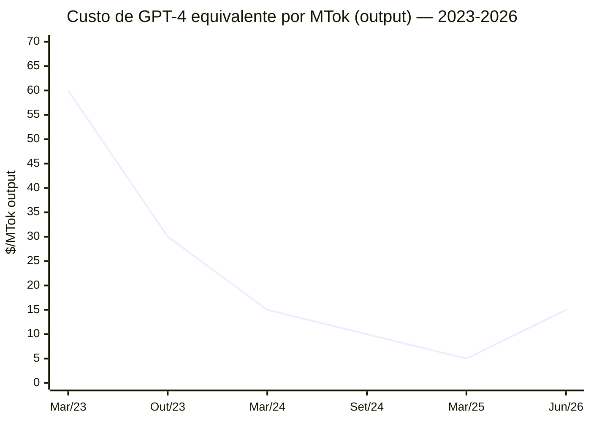
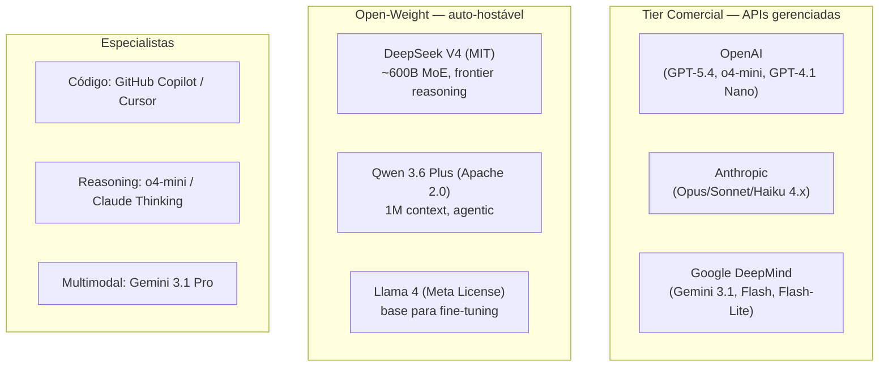
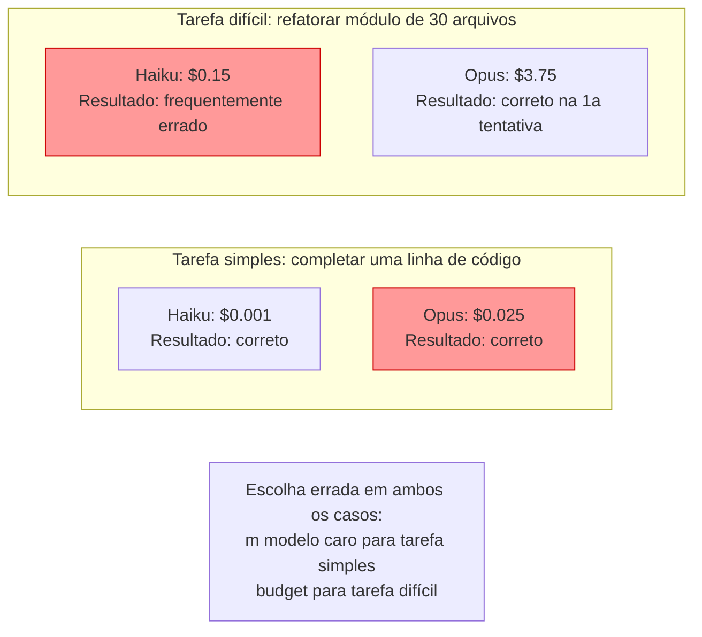
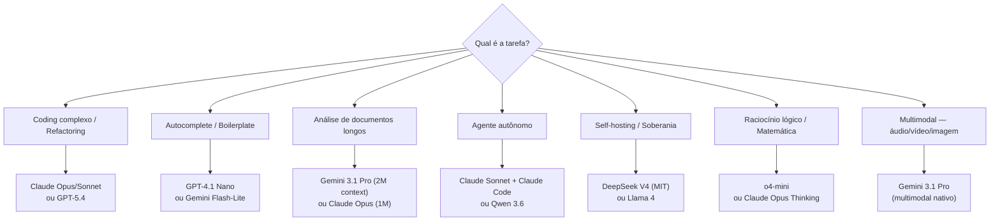
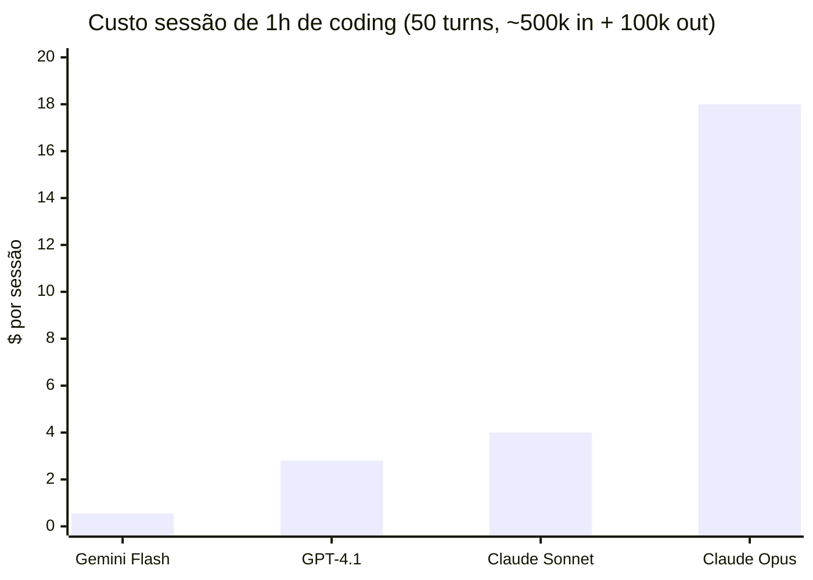

# Panorama de modelos 2026

> [!abstract] TL;DR
> Em 2026, o mercado de LLMs é maduro e estratificado: três providers dominam o tier comercial (OpenAI, Anthropic, Google) e dois players chineses lideram o open-weight (DeepSeek, Alibaba/Qwen). Não existe "melhor modelo" — existe o modelo certo para a tarefa. A escolha cruza três eixos: capacidade de raciocínio, custo por token e tipo de integração (API, IDE, self-hosting). Usar flagship para tudo é tão errado quanto usar budget para tudo.

## O problema que o panorama resolve

Em 2023, a escolha era simples: GPT-4 para o que importava, GPT-3.5 para o resto. Hoje você tem dezenas de modelos competitivos no tier de produção. Cada provider tem 3–5 modelos. Existe open-weight que compete com flagship comercial. Os preços caíram 10–50× em 3 anos para capacidade equivalente.

A abundância criou um problema novo: **o custo de escolher errado virou real**. Usar Claude Opus para autocomplete de código é como contratar cirurgião para remendar uma camisa — caro, lento, e a camisa sai igual. Usar budget model para um agente multi-arquivo que precisa de raciocínio profundo gera código que compila mas está errado de formas sutis. A habilidade de 2026 não é "qual modelo é mais inteligente" — é **model routing**: escolher o modelo certo para cada tipo de tarefa.

> [!question]- Por que os preços caíram tão rápido?
> Três forças juntas: (1) **hardware ficou mais barato** — GPUs de nova geração com maior throughput por dólar; (2) **eficiência de inferência melhorou** — quantização, MQA/GQA, FlashAttention, MoE reduzem o custo por token sem degradar qualidade; (3) **competição aumentou** — quando DeepSeek lança um modelo open-weight com qualidade de flagship a custo de commodity, todos os providers são forçados a baixar preços ou perder mercado. Os modelos de 2026 custam entre 10× e 50× menos que capacidade equivalente em 2023.

## A anatomia do mercado

O mercado atual tem três camadas de oferta com lógicas de negócio distintas:

**Lógica do tier comercial:** APIs como produto, monetização por uso, SLA empresarial, suporte. Dependência de vendor em troca de conveniência.

**Lógica do open-weight:** modelo disponível para download e self-hosting. Privacidade, customização (fine-tuning), sem custo por token. DeepSeek MIT = você pode usar, modificar e redistribuir comercialmente.

## Os grandes players (maio 2026)

> [!info] Caducidade — preços e benchmarks mudam mensalmente
> Os preços por token e os scores de benchmark abaixo são um retrato de maio de 2026. Providers ajustam preços e lançam novas versões com frequência mensal ou maior. Trate os números como ordem de grandeza para comparação relativa entre tiers, não como cotação vigente — confira o pricing atual na documentação do provider antes de decidir.

### OpenAI

| Modelo | Tipo | Context | Input $/MTok | Output $/MTok | Melhor para |
| --------- | --------- | ------- | ------------ | ------------- | --------------------------------- |
| GPT-5.4 | Flagship | 1.1M | ~$2.50 | ~$15.00 | Raciocínio geral, knowledge depth |
| o4-mini | Reasoning | 200k | ~$1.10 | ~$4.40 | Lógica, matemática, planejamento |
| GPT-4.1 | Mid-tier | 1M | ~$2.00 | ~$8.00 | Equilíbrio custo-qualidade |
| GPT-4.1 Nano | Budget | 1M | ~$0.10 | ~$0.40 | Autocomplete, tarefas simples |

**Forças:** Ecossistema maduro, integração enterprise, GPT Store, Batch API com 50% de desconto. **Fraquezas:** Pricing premium, menos transparente sobre arquitetura.

### Anthropic

| Modelo | Tipo | Context | Input $/MTok | Output $/MTok | Melhor para |
| ----------------- | -------- | ------- | ------------ | ------------- | ------------------------------------ |
| Claude Opus 4.6 | Flagship | 1M | $5.00 | $25.00 | Coding complexo, raciocínio profundo |
| Claude Sonnet 4.6 | Mid-tier | 200k | $3.00 | $15.00 | Codificação diária, agents |
| Claude Haiku 4.5 | Budget | 200k | $1.00 | $5.00 | Rápido, tarefas simples |

**Forças:** Melhor reasoning para código, Claude Code (terminal agent), [[Dicionário de IA#Prompt caching|prompt caching]] maduro, 128k output tokens no Opus. **Fraquezas:** Mais caro token por token, menos modelos no lineup.

### Google DeepMind

| Modelo | Tipo | Context | Input $/MTok | Output $/MTok | Melhor para |
| --------------------- | -------- | ------- | ------------ | ------------- | -------------------------------- |
| Gemini 3.1 Pro | Flagship | 1M–2M | ~$2.00 | ~$12.00 | Multimodal, contexto ultra-longo |
| Gemini 3 Flash | Mid-tier | 1M | ~$0.50 | ~$3.00 | Custo-benefício, velocidade |
| Gemini 2.5 Flash-Lite | Budget | 1M | ~$0.10 | ~$0.40 | Classificação, extração |

**Forças:** Contexto mais longo (2M experimental), multimodal nativo (áudio, vídeo, imagem), integração GCP, preço competitivo. **Fraquezas:** Menos consistente em coding puro que Claude, ecossistema de tools menos maduro.

### Open-Weight (ver detalhes em [[08 - Modelos chineses — DeepSeek, Qwen, Kimi, GLM]])

| Modelo | Origem | Parâmetros | Licença | Melhor para |
| ------------- | ------------------- | -------------------- | ------------- | ------------------------------- |
| DeepSeek V4 | DeepSeek (China) | MoE, ~600B total | MIT | Raciocínio, coding defensivo |
| Qwen 3.6 Plus | Alibaba (China) | MoE | Apache 2.0 | Agentes, contexto longo (1M) |
| Llama 4 | Meta (EUA) | Dense + MoE variants | Llama License | Base para fine-tuning |
| Kimi K2.6 | Moonshot AI (China) | — | Proprietário* | Sub-agentes, multi-file editing |
| GLM-5.1 | Zhipu AI (China) | — | MIT | Engenharia agentic |

*\*Kimi tem modelo via API; não é fully open-weight.*

## Por que providers têm tiers — a lógica econômica

Por que a Anthropic vende Haiku, Sonnet e Opus em vez de "um modelo"? Por que não basta o melhor?

**A resposta é aritmética.** Para um autocomplete de 50 tokens, a diferença de qualidade entre Haiku e Opus é imperceptível. A diferença de custo é 25×. Para uma feature multi-arquivo que exige raciocínio de 100k tokens, a diferença de qualidade *é* perceptível — e o custo absoluto é alto o suficiente para justificar o modelo melhor.

A estratégia correta é **model routing**: detectar a complexidade da tarefa e escolher o tier correspondente. Uma sessão de codificação bem roteada pode custar 3–5× menos que "usar Opus para tudo" e ter qualidade equivalente ou superior (porque evita timeout por custo e retries por qualidade ruim).

## Mapa de decisão

## Comparativo de performance e custo

### SWE-bench Verified (referência de coding, abril 2026)

| Modelo | Score | Notas |
| --------------- | ----- | ------------------------------- |
| Claude Opus 4.6 | ~72% | Líder em coding agentic |
| GPT-5.4 | ~69% | Forte em reasoning geral |
| Gemini 3.1 Pro | ~65% | Melhora com contexto longo |
| DeepSeek V4 | ~63% | Impressionante para open-weight |
| Qwen 3.6 Plus | ~61% | Melhor em workflows agentic |

> [!warning] Benchmarks são guia, não verdade
> SWE-bench mede performance do **scaffolding + modelo**. O mesmo modelo com scaffolding diferente pode ter scores muito diferentes. Teste no seu codebase.

### Custo por tarefa real (estimativa para coding task típica)

| Tarefa | Tokens estimados | Claude Sonnet | GPT-4.1 | Gemini Flash |
| ------------------------------ | ------------------- | ------------- | ------- | ------------ |
| Fix de bug simples | ~5k in + 2k out | $0.045 | $0.026 | $0.009 |
| Refactoring de arquivo | ~20k in + 10k out | $0.21 | $0.12 | $0.04 |
| Feature multi-file (agent) | ~100k in + 30k out | $0.75 | $0.44 | $0.14 |
| Sessão de agent (1h, 50 turns) | ~500k in + 100k out | $4.00 | $2.80 | $0.55 |

O Gemini Flash custa 7× menos que Claude Sonnet para a mesma sessão. No benchmark, a diferença de qualidade é menor que 7×. Em tarefas de coding padrão, a maioria dos engenheiros não percebe a diferença de 7%–12% de score em SWE-bench — percebe a diferença de $13.45/sessão multiplicada por 20 sessões por semana = $270/semana.

## Armadilhas comuns

> [!warning] "O benchmark mais alto = o melhor"
> Benchmarks medem cenários controlados. Performance real depende do seu tipo de código, linguagem, e workflow.

> [!warning] Vendor lock-in
> Construir toda a stack ao redor de um provider. Se o preço sobe ou o modelo degrada, a migração é dolorosa. Use abstrações.

> [!warning] Ignorar o mid-tier
> A maioria das tarefas de codificação não precisa de [[Dicionário de IA#flagship model|flagship]]. Claude Sonnet ou GPT-4.1 resolvem 90% dos casos a metade do custo.

> [!warning] "Open-weight é pior"
> DeepSeek V4 compete com flagships em coding e reasoning. Qwen 3.6 lidera em agentic. O gap fechou significativamente.

> [!warning] Comparar preço por token sem comparar output por tarefa
> Se o Haiku produz um output que exige 3 tentativas e o Sonnet acerta na primeira, o Haiku não é mais barato.

## O que vem a seguir

O panorama que você acabou de ler trata os players chineses — DeepSeek, Qwen, Kimi, GLM — como uma linha na tabela de "Open-Weight". Isso esconde a história mais interessante: como um laboratório sem acesso às GPUs de ponta da Nvidia (por causa das sanções de exportação dos EUA) conseguiu treinar um modelo que compete com flagships ocidentais, e por que isso forçou o mercado inteiro a repensar preço e arquitetura. [[08 - Modelos chineses — DeepSeek, Qwen, Kimi, GLM]] entra nesse mergulho: as inovações técnicas específicas (MoE agressivo, MLA, treinamento em FP8), as implicações geopolíticas de MIT/Apache 2.0 vindo de labs chineses, e o que isso significa para quem decide entre "pagar API" e "hospedar o próprio modelo".

## Como explicar em inglês

The LLM market in 2026 is mature and stratified: three commercial providers dominate the API tier (OpenAI, Anthropic, Google), while Chinese open-weight models (DeepSeek, Qwen) compete at the frontier for self-hosting. Every provider runs a tier strategy — flagship, mid-tier, and budget models — because not every task justifies frontier compute. The skill that differentiates developers in 2026 is **model routing**: matching task complexity to the right model tier. Prices have fallen 10–50× since 2023 due to hardware improvements, inference efficiency gains (GQA, MoE, quantization), and competitive pressure from open-weight models.

| PT | EN |
|----|---|
| Modelo flagship | Flagship model |
| Tier intermediário | Mid-tier model |
| Modelo budget | Budget model / lightweight model |
| Peso aberto | Open-weight |
| Auto-hospedagem | Self-hosting |
| Roteamento de modelo | Model routing |
| Eficiência de inferência | Inference efficiency |
| Janela de contexto | Context window |
| Capacidade agêntica | Agentic capability |
| Fine-tuning | Fine-tuning |
| Benchmark | Benchmark |
| Lock-in de vendor | Vendor lock-in |

## Ver mais

- **[Andrej Karpathy — State of LLMs 2025](https://www.youtube.com/watch?v=zjkBMFhNj_g)** — overview do landscape de modelos e tendências de capacidade. Karpathy é ex-OpenAI e uma das melhores vozes técnicas do espaço.
- **[Artificial Analysis — LLM Leaderboard](https://artificialanalysis.ai)** — comparativo independente, atualizado frequentemente: benchmarks, preço, velocidade de inferência, latência por provider.
- **[Simon Willison — LLM Price Tracker](https://simonwillison.net)** — blog técnico com histórico de preços e análise de cada lançamento de modelo. Essencial para acompanhar o mercado.

## Veja também

- [[08 - Modelos chineses — DeepSeek, Qwen, Kimi, GLM]] — deep dive nos players chineses
- [[09 - Dense vs Mixture-of-Experts]] — a arquitetura por trás das diferenças de custo (MoE explica DeepSeek V4)
- [[12 - Pricing de APIs — como calcular custos]] — como traduzir preços por token em custo real
- [[17 - O futuro dos LLMs — tendências 2026-2027]] — para onde o mercado está indo

## Referências

- **Anthropic** — *Claude Model Card* (2026). Especificações e benchmarks.
- **OpenAI** — *GPT-5 System Card* (2026). Detalhes de capabilities e safety.
- **Google DeepMind** — *Gemini 3 Technical Report* (2026). Arquitetura e benchmarks.
- **Artificial Analysis** — *LLM Leaderboard* (2026). Comparativo independente de preço e performance.
- **SWE-bench** — *SWE-bench Verified Leaderboard* (abr. 2026). Benchmark de coding agentic.
