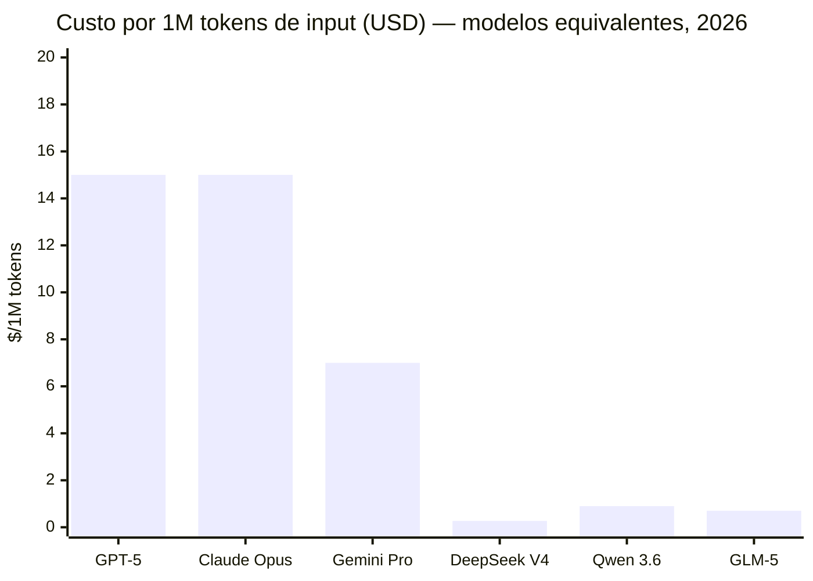
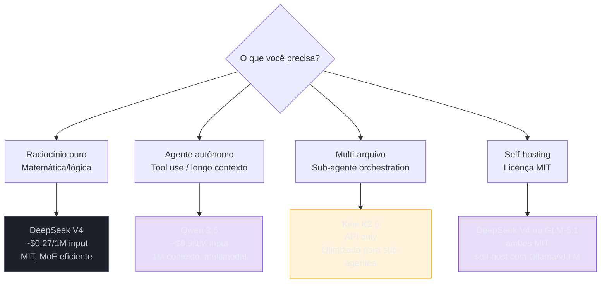

# Modelos chineses — DeepSeek, Qwen, Kimi, GLM

> [!abstract] TL;DR
> Os modelos chineses deixaram de ser "alternativa barata" e viraram competidores de fronteira. DeepSeek V4 compete com Claude em raciocínio puro sob licença MIT. Qwen 3.6 é o melhor modelo open-weight para workflows agentic com 1M de contexto. Kimi K2.6 domina sub-agentes. GLM-5.1 é forte em engenharia de longo prazo. Todos são significativamente mais baratos que equivalentes ocidentais e a maioria tem licenças permissivas (MIT ou Apache 2.0).

## O choque de janeiro de 2025

Em janeiro de 2025, a DeepSeek publicou o relatório técnico do V3: treinado por **$6 milhões**, performance equivalente ao GPT-4o em benchmarks de matemática e coding. O GPT-4o custou estimados $100 milhões para treinar.

Duas hipóteses: ou a equipe de Hangzhou descobriu algo que o restante da indústria de IA — com seus $10 bilhões em GPUs H100 — havia perdido; ou os números de custo ocidentais eram inflados. A resposta foi "os dois": DeepSeek publicou inovações genuínas em eficiência de treinamento (MLA, DeepSeekMoE), *e* os custos da OpenAI e Anthropic incluem muito além do compute puro.

O impacto foi concreto. Em fevereiro de 2025, o governo americano incluiu a DeepSeek na lista de entidades de segurança nacional. A Nvidia perdeu $500 bilhões de capitalização em um dia. A tese de que "quem tem mais GPUs ganha" ficou mais frágil.

Para engenheiros, a questão prática é mais simples: modelos chineses open-weight são competitivos em qualidade e custam 5-20x menos por token nas APIs. Ignorá-los é deixar dinheiro na mesa.

## O que é

O ecossistema chinês de LLMs open-weight amadureceu em 2025-2026 a ponto de oferecer alternativas viáveis — e em alguns casos superiores — aos modelos ocidentais para tarefas específicas. Os quatro players principais são:

1. **DeepSeek** — foco em raciocínio e eficiência
2. **Qwen** (Alibaba Cloud) — foco em agentes e multimodal
3. **Kimi** (Moonshot AI) — foco em edição multi-arquivo e sub-agentes
4. **GLM** (Zhipu AI) — foco em engenharia de software de longo prazo

## Por que importa

- **Custo** — modelos chineses open-weight via API (Together, Fireworks, SiliconFlow) custam 5x–20x menos que [[Dicionário de IA#flagship model|flagships]] ocidentais
- **Soberania** — licenças MIT/Apache permitem uso irrestrito, sem dependência de vendor
- **Self-hosting** — VRAM requirements são otimizados via MoE, viabilizando rodar localmente
- **Competição** — a qualidade desses modelos força Anthropic, OpenAI e Google a baixar preços



## Como funciona

### DeepSeek V4

| Aspecto | Detalhe |
| ------------------- | -------------------------------------------------------- |
| **Arquitetura** | Mixture-of-Experts |
| **Contexto** | 128k–163k tokens |
| **Licença** | MIT |
| **Força principal** | Raciocínio matemático, coding defensivo, lógica complexa |
| **Self-hosting** | Viável com multi-GPU (otimizado para MoE [[Dicionário de IA#inference\|inference]]) |

DeepSeek se destacou por publicar papers detalhados sobre suas técnicas de treinamento, incluindo **Multi-Head Latent Attention (MLA)** e **DeepSeekMoE** — inovações que influenciaram toda a indústria.

**Quando escolher DeepSeek:**

- Tarefas que exigem raciocínio preciso e defensivo
- Self-hosting com orçamento de GPU otimizado
- Projetos que exigem licença MIT estrita

### Qwen 3.6 (Alibaba Cloud)

| Aspecto | Detalhe |
| ------------------- | -------------------------------------------------------- |
| **Arquitetura** | Mixture-of-Experts otimizado para agentes |
| **Contexto** | Até 1M tokens |
| **Licença** | Apache 2.0 |
| **Força principal** | Workflows agentic, multimodal (visão/vídeo), multilíngue |
| **Self-hosting** | Ollama suporta, múltiplas quantizações disponíveis |

Qwen é o modelo chinês mais versátil. A série 3.6 trouxe melhorias significativas em:

- **Agentic coding** — melhor que DeepSeek em workflows com [[Dicionário de IA#tool use|tool use]]
- **Contexto longo** — 1M tokens com boa retenção
- **Multimodal** — visão nativa permite debugging visual

**Quando escolher Qwen:**

- Construção de agentes autônomos
- Processamento de grandes codebases (1M contexto)
- Projetos que precisam de capabilities multimodais

### Kimi K2.6 (Moonshot AI)

| Aspecto | Detalhe |
| ------------------- | ------------------------------------------------------ |
| **Disponibilidade** | API (não totalmente open-weight) |
| **Força principal** | Sub-agentes, edição multi-arquivo, workflows paralelos |
| **Contexto** | Longo (detalhes variam por tier) |

Kimi se diferencia por ser otimizado para **orquestração de sub-agentes**. Enquanto outros modelos são bons em tarefas isoladas, Kimi é projetado para:

- Dividir tarefas complexas em sub-tarefas
- Coordenar múltiplos agentes trabalhando em paralelo
- Manter coerência em edições multi-arquivo

**Quando escolher Kimi:**

- Workflows que envolvem decomposição de tarefas
- Edição coordenada de múltiplos arquivos
- Cenários de multi-agent orchestration

### GLM-5.1 (Zhipu AI)

| Aspecto | Detalhe |
| ------------------- | -------------------------------------------------------- |
| **Licença** | MIT (algumas variantes) |
| **Força principal** | Engenharia de software complexa, tarefas de longo prazo |
| **Diferencial** | Performance estável em sessões longas de desenvolvimento |

GLM é menos conhecido no Ocidente mas tem adoção significativa em empresas chinesas de tecnologia para engenharia de software.

**Quando escolher GLM:**

- Projetos de engenharia de longo prazo com muitas iterações
- Quando MIT license é requisito e DeepSeek não atende ao caso

## Comparativo

> [!info] Caducidade
> Esta tabela captura um instantâneo (DeepSeek V4, Qwen 3.6, Kimi K2.6, GLM-5.1 e os preços listados). Modelos chineses versionam rápido — em poucos meses os números de preço/benchmark ficam defasados. Antes de decidir, confira a documentação oficial do provedor para a versão e o preço vigentes.

| Critério | DeepSeek V4 | Qwen 3.6 | Kimi K2.6 | GLM-5.1 |
| ------------------ | ------------ | ----------------- | ------------ | -------- |
| **Reasoning puro** | ★★★★★ | ★★★★ | ★★★ | ★★★★ |
| **Agentic coding** | ★★★ | ★★★★★ | ★★★★★ | ★★★★ |
| **Context window** | 163k | 1M | Variável | Variável |
| **Self-hosting** | Viável (MoE) | Viável (Ollama) | Não | Parcial |
| **Licença** | MIT | Apache 2.0 | Proprietário | MIT |
| **Custo via API** | Muito barato | Barato | Moderado | Barato |
| **Multimodal** | Texto+código | Texto+visão+vídeo | Texto | Texto |



## Na prática

### Setup com DeepSeek via Ollama

```bash
# Instalar Ollama
curl -fsSL https://ollama.com/install.sh | sh

# Baixar e rodar DeepSeek Coder
ollama run deepseek-coder-v4:33b

# Usar como API local (OpenAI-compatible)
curl http://localhost:11434/v1/chat/completions \
  -H "Content-Type: application/json" \
  -d '{"model": "deepseek-coder-v4:33b", "messages": [{"role": "user", "content": "Explain quicksort"}]}'
```

### Setup com Qwen via API (SiliconFlow)

```bash
# Via API de terceiros (muito mais barato que provedores ocidentais)
curl https://api.siliconflow.cn/v1/chat/completions \
  -H "Authorization: Bearer $SF_API_KEY" \
  -d '{"model": "Qwen/Qwen3.6-Plus", "messages": [{"role": "user", "content": "Refactor this code..."}]}'
```

## Armadilhas

> [!warning] "Modelo chinês = cópia inferior"
> Falso em 2026. DeepSeek V4 supera GPT-4.1 em benchmarks de matemática. Qwen 3.6 lidera em agentic.

> [!warning] Censura e alinhamento
> Modelos chineses têm alinhamento diferente dos ocidentais. Para coding, isso raramente importa. Para geração de conteúdo, pode afetar.

> [!warning] Latência de API
> APIs hospedadas na China podem ter latência alta para usuários nas Américas/Europa. Use provedores intermediários (Together, Fireworks, Groq).

> [!warning] Versioning confuso
> A nomenclatura muda rapidamente. "DeepSeek V3" pode se referir a versões diferentes dependendo da data. Sempre verifique o modelo exato na documentação.

> [!warning] Suporte e documentação
> Documentação primária frequentemente em mandarim. Comunidades em inglês são menores.

## Como explicar em inglês

Chinese open-weight models became frontier competitors in 2025-2026. **DeepSeek V3/V4** demonstrated that training efficiency innovations (Multi-Head Latent Attention, Mixture-of-Experts sparsity) could close the gap with Western models at 1/15 the compute cost. **Qwen** (Alibaba) leads on agentic workflows and has the longest context window (1M tokens) of any open-weight model. **Kimi** (Moonshot AI) is optimized for multi-agent orchestration — decomposing complex tasks across parallel sub-agents. The key practical consideration for Western developers is accessing these models through intermediary APIs (Together, Fireworks, SiliconFlow) to avoid high latency from Chinese data centers. All major Chinese models expose OpenAI-compatible APIs, so integration is usually a one-line change.

| PT | EN |
|----|---|
| Modelos chineses | Chinese models / Chinese open-weight models |
| Modelo de fronteira | Frontier model |
| Orquestração de sub-agentes | Sub-agent orchestration |
| Atenção de cabeça múltipla latente | Multi-Head Latent Attention (MLA) |
| Modelo aberto | Open-weight model |
| Provedor intermediário | Intermediary API provider |
| Licença permissiva | Permissive license |
| Soberania de modelo | Model sovereignty |

## Ver mais

- **[DeepSeek AI — DeepSeek-V3 Technical Report (2024)](https://arxiv.org/abs/2412.19437)** — o paper que sacudiu a indústria. Detalha MLA (Multi-Head Latent Attention), DeepSeekMoE e as técnicas de treinamento que permitiram performance de fronteira com ~$6M de compute.
- **[Sebastian Raschka — Understanding DeepSeek's Architecture (2025)](https://magazine.sebastianraschka.com)** — análise linha a linha das inovações técnicas do DeepSeek, comparando com GPT e Llama. Raschka é um dos melhores explicadores de arquiteturas de LLM.
- **[SiliconFlow — Open Model API Hosting](https://siliconflow.cn)** — plataforma de hospedagem para modelos chineses com API OpenAI-compatible, baixíssima latência para regiões asiáticas e suporte a DeepSeek/Qwen/GLM.

## O que vem a seguir

Boa parte do que torna esses modelos baratos e rápidos não é sorte de engenharia isolada — é uma escolha arquitetural comum aos quatro: usar Mixture-of-Experts em vez de uma rede densa. É essa escolha que explica por que o DeepSeek V4 custa centavos por milhão de tokens enquanto ativa só uma fração dos seus parâmetros a cada passagem, e por que "self-hosting viável" aparece tanto nesta nota. Para entender o mecanismo por trás desse número — o que exatamente é um "expert", como o roteador decide qual ativar, e o trade-off que isso implica em VRAM vs. compute — veja [[09 - Dense vs Mixture-of-Experts]], a espinha dorsal da eficiência chinesa.

## Veja também

- [[07 - Panorama de modelos 2026]] — contexto geral do mercado
- [[09 - Dense vs Mixture-of-Experts]] — a arquitetura que torna modelos chineses eficientes
- [[10 - Modelos locais e self-hosting]] — como rodar esses modelos localmente

## Referências

- **DeepSeek AI** — *DeepSeek-V3 Technical Report* (2025). Detalhes de MLA e DeepSeekMoE.
- **Alibaba Cloud** — *Qwen Technical Report* (2026). Arquitetura e benchmarks da série 3.x.
- **Moonshot AI** — *Kimi Technical Report* (2026). Abordagem de sub-agentes.
- **SiliconFlow** — *Open Model Hosting* (2026). Plataforma de hosting para modelos chineses com API unificada.
