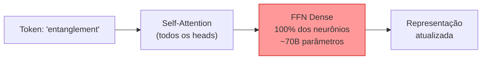
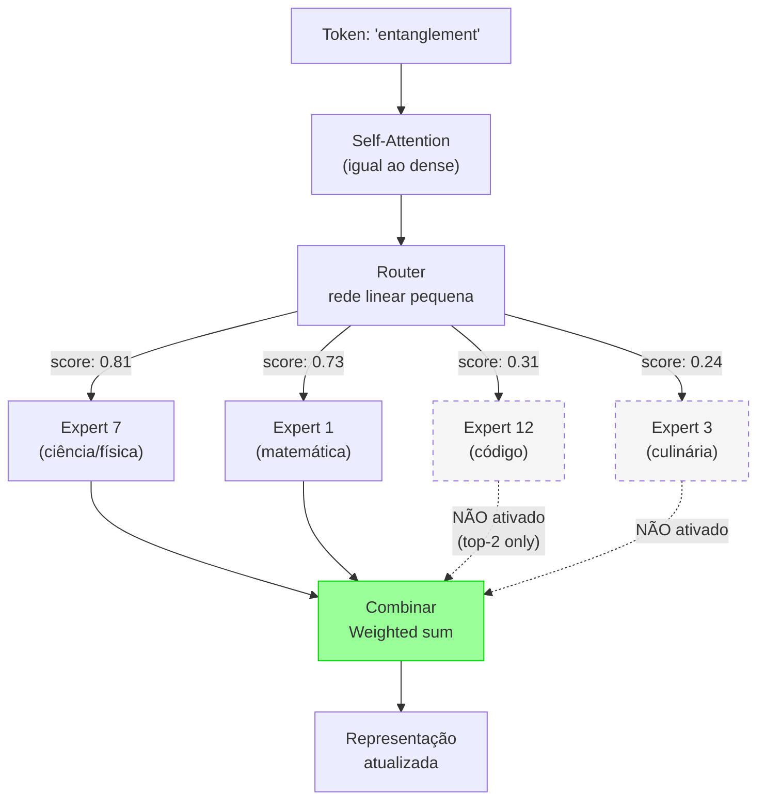
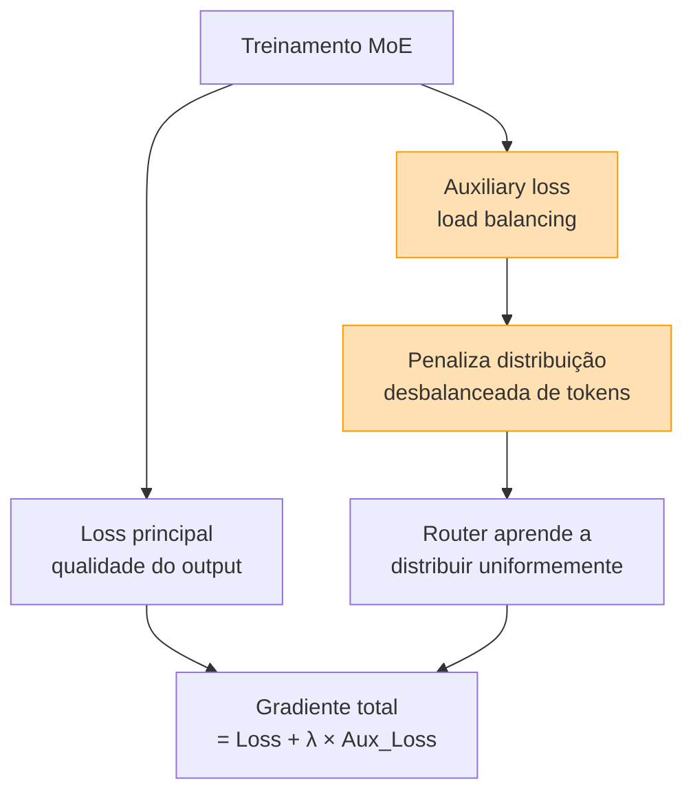
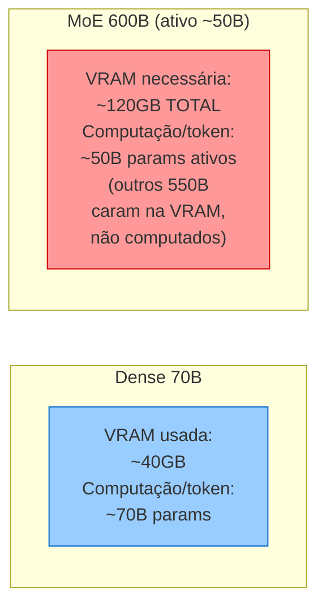

# Dense vs Mixture-of-Experts

> [!abstract] TL;DR
> Dense models ativam todos os parâmetros para cada token — simples mas caro. Mixture-of-Experts (MoE) ativa apenas um subconjunto de "especialistas" por token via um roteador, permitindo modelos com 600B–1T de parâmetros totais que inferem com o custo de um model de 50–200B. MoE é a arquitetura dominante em modelos frontier de 2026. A escolha entre dense e MoE determina custo, latência e viabilidade de self-hosting — mas é uma escolha que o usuário comum não faz diretamente: ela já veio embutida no modelo que você escolheu.

## O problema que a arquitetura resolve

Imagine que você quer construir um LLM melhor. O caminho mais óbvio: adicione mais parâmetros. Um modelo com 140B de parâmetros é melhor que um com 70B, que é melhor que um com 7B. Problema: dobrar os parâmetros dobra o custo de inferência. Cada token processado ativa **todos** os parâmetros — 100% deles, toda vez.

Isso cria uma muralha econômica. Para competir com modelos de 140B em qualidade, você precisaria de 140B de parâmetros ativos. Para superar a 300B? Você precisaria de 300B de computação por token. Com os custos de GPU atuais, isso torna modelos acima de ~100B proibitivamente caros para servir a usuários em escala.

MoE resolve isso com uma pergunta: **e se nem todo token precisar de todos os especialistas?** O token "quantum entanglement" precisa que os parâmetros de culinária processem ele? Claramente não. O token "béchamel" precisa que os parâmetros de física processem ele? Também não.

A intuição central do MoE: **roteamento dinâmico por token**. Em vez de ativar tudo, ativa apenas os parâmetros mais relevantes para aquele token específico. O modelo pode ter 600B de parâmetros totais, mas ativar apenas 50B por token. Qualidade de 600B, custo de 50B.

> [!question]- Mas espera — o router não é um custo extra?
> Sim, o router é um custo adicional — mas é mínimo. O router é uma rede linear simples (uma multiplicação de matriz) que opera sobre o embedding do token e produz um vetor de scores para cada expert. O custo é negligenciável comparado ao custo dos experts em si: uma fração de 1% do custo total de inferência.

## A analogia da cozinha especializada

Pense em dois modelos de restaurante:

**Dense = cozinha clássica**: cada pedido passa pela mão de todos os chefs. O chef de confeitaria, o grelhador, o saucier, o tournant — todos verificam cada pedido, mesmo que o pedido seja apenas "uma salada". Ineficiente, mas simples: todo mundo sabe o que fazer em qualquer situação.

**MoE = cozinha de especialistas**: o maître (router) lê o pedido e encaminha para os especialistas certos. Prato de peixe? Chef de frutos do mar + chef de molhos. Sobremesa de chocolate? Chef confeiteiro + expert em fermentação de cacau. Nenhum especialista ve todos os pedidos — cada um é ativado só quando o pedido é relevant para sua especialidade.

O maître (router) precisa ser excelente. Se ele sempre manda tudo para os mesmos dois chefs, os outros ficam ociosos e o benefício da especialização se perde. Isso é **expert collapse** — o maior desafio de treinar MoE.

## Arquitetura dense: todos os neurônios, sempre

Em cada camada do [[04 - Atenção e o mecanismo transformer|transformer]], todo token passa por dois blocos:

1. **Self-attention** — o token "olha" para os outros tokens (já vimos isso na nota 04)
2. **Feed-Forward Network (FFN)** — uma rede densa que transforma o vetor de representação do token

Em um dense, o FFN ativa **todos os seus neurônios** para cada token:

Se o modelo tem 70B de parâmetros e ~65% deles estão nas FFNs, cada token ativa ~45B de parâmetros só no FFN. Simples, previsível, mas linearmente caro com o tamanho do modelo.

> [!question]- Por que a maioria dos parâmetros fica no FFN e não na atenção?
> Regra empírica dos transformers: nas camadas de atenção, o número de parâmetros escala com `d_model² × 4` (para Q, K, V, O). Nas FFNs, escala com `d_model × d_ffn × 2`, e `d_ffn` é tipicamente 4× `d_model`. Resultado: FFNs são ~4× maiores que as camadas de atenção. É exatamente por isso que MoE substitui as FFNs — é onde está a maior parte do peso.

## Arquitetura MoE: roteamento dinâmico

No MoE, cada FFN é substituída por um **banco de experts** — múltiplas FFNs independentes — com um **router** que decide quais experts processar cada token:

**Como o router decide?** É uma multiplicação de matriz: ele pega o vetor de representação do token (dimensão `d_model`, tipicamente 4096–8192) e multiplica por uma matriz de pesos `W_router` de dimensão `d_model × num_experts`. O resultado é um vetor de scores, um por expert. Os `top-K` experts (tipicamente K=2) são selecionados. Os outros são ignorados completamente — zero computação.

### Exemplo numérico: roteamento passo-a-passo

Modelo hipotético: 8 experts, top-2 routing. Token chegando: "momentum" (contexto: equação de física).

**Passo 1 — Router calcula scores:**

| Expert | Especialidade (informalmente) | Score bruto |
|--------|-------------------------------|-------------|
| E1     | matemática/física             | 2.41        |
| E2     | linguagem/texto               | 0.83        |
| E3     | código/programação            | 0.91        |
| E4     | ciências naturais             | 1.87        |
| E5     | economia/finanças             | 0.12        |
| E6     | história/cultura              | 0.34        |
| E7     | engenharia aplicada           | 1.22        |
| E8     | conhecimento geral            | 0.67        |

**Passo 2 — Softmax sobre os 8 scores → probabilidades:**
Após softmax: E1=0.38, E4=0.21, E7=0.12, E3=0.09, ...

**Passo 3 — Top-2 selection: E1 (0.38) e E4 (0.21).**
Os outros 6 experts: contribuição zero, zero computação.

**Passo 4 — Normalizar os pesos dos 2 selecionados:**
$w_{E1} = \frac{0.38}{0.38 + 0.21} = 0.644$, $\quad w_{E4} = \frac{0.21}{0.38 + 0.21} = 0.356$

**Passo 5 — Output final:**
$output = 0.644 \times FFN_{E1}(token) + 0.356 \times FFN_{E4}(token)$

O token foi processado por 2 de 8 experts. Se cada expert tem ~10B de parâmetros, 20B foram ativados de 80B totais — 25%.

### Números reais (2026)

| Modelo         | Tipo  | Parâmetros totais | Parâmetros ativos/token | Configuração         |
| -------------- | ----- | ----------------- | ----------------------- | -------------------- |
| Llama 3 70B    | Dense | 70B               | 70B                     | —                    |
| DeepSeek V4    | MoE   | ~600B             | ~50B                    | 128 experts, top-8   |
| Mixtral 8x22B  | MoE   | 141B              | ~39B                    | 8 experts, top-2     |
| Llama 4 Scout  | MoE   | ~109B             | ~17B                    | 16 experts, top-2    |
| GPT-5.x        | MoE*  | ~1T+              | ~200B*                  | Não divulgado        |
| Gemini 3.x Pro | MoE*  | ~1T+              | Não divulgado           | Não divulgado        |

*Arquitetura inferida; OpenAI e Google não publicam detalhes arquiteturais.*

A proporção típica: parâmetros ativos = 10–25% dos parâmetros totais. DeepSeek V4 com 128 experts ativa 8 por token (top-8) = 6.25% dos experts, correspondendo a ~8.3% dos parâmetros totais.

## Vídeo: como o MoE funciona visualmente

Jay Alammar — um dos melhores educadores de ML — tem um guia visual do MoE que mostra o mecanismo de roteamento de forma animada, cobrindo tanto LLMs quanto Vision Language Models:

## O problema do load balancing: o maior desafio técnico do MoE

O roteamento dinâmico cria um problema que não existe em dense: e se o router aprender a mandar tudo para os mesmos experts?

Se o Expert 1 processar 80% dos tokens e o Expert 8 processar 0.1%, você tem:
- Expert 1 sobrecarregado → gargalo de throughput
- Experts 2–8 subutilizados → 87.5% dos parâmetros desperdiçados
- O modelo efetivamente encolhe para 1/8 da capacidade prometida

Isso é chamado de **expert collapse** — o modelo colapsa de volta para o comportamento de um dense pequeno, mas carregando o peso de todos os experts na memória.

### Como o treinamento combate o colapso

A **auxiliary loss** (ou *load balancing loss*) é adicionada durante o treinamento:

$$L_{aux} = N_{experts} \cdot \sum_{i=1}^{N} f_i \cdot p_i$$

Onde:
- $f_i$ = fração de tokens roteados para o expert $i$ nesse batch
- $p_i$ = probabilidade média atribuída ao expert $i$ pelo router
- $N_{experts}$ = número total de experts

Quando a distribuição é perfeitamente uniforme, $f_i = p_i = 1/N$ para todo $i$, e $L_{aux}$ é minimizado. Quando um expert domina ($f_1 \to 1, p_1 \to 1$), $L_{aux}$ dispara — penalizando o router e forçando redistribuição.

> [!question]- Por que multiplicar $f_i \times p_i$ e não só $f_i$?
> $f_i$ sozinho é não-diferenciável (depende do argmax). $p_i$ é a probabilidade softmax, que é diferenciável. Multiplicar os dois cria uma proxy diferenciável que ainda captura o sinal de desbalanceamento: se o router sempre atribui alta probabilidade ao Expert 1 ($p_1$ alto), a loss cresce mesmo quando $f_1$ ainda não explodiu — agindo preventivamente.

### Expert parallelism: o custo de distribuir

Em modelos grandes (DeepSeek V4 com 128 experts), os experts são distribuídos em diferentes GPUs — cada GPU "possui" um subconjunto de experts. Quando um token é roteado para um expert em outra GPU, ele precisa ser **transferido via rede inter-GPU**.

Isso cria um trade-off de latência: quanto mais experts (mais especialização potencial), mais comunicação inter-GPU. DeepSeek V4 resolveu parte disso com um design de "auxiliary loss-free" routing que usa um mecanismo de device-limited routing — tokens só podem ir para experts nas GPUs locais ou vizinhas, reduzindo o cross-GPU traffic.

## Implicações para self-hosting: o paradoxo da memória

O maior equívoco sobre MoE: "como ativa poucos parâmetros por token, precisa de menos memória".

**Falso.** Todos os parâmetros precisam estar carregados na VRAM, mesmo que apenas uma fração seja computada a cada token. Um MoE de 600B precisa de ~120GB de VRAM (quantizado INT4). Um dense de 70B precisa de ~40GB.

| Aspecto                  | Dense 70B                  | MoE 600B (ativo ~50B)                           |
| ------------------------ | -------------------------- | ----------------------------------------------- |
| VRAM necessária          | ~40GB (quantizado INT4)    | ~120–150GB (todos os experts na memória)         |
| Velocidade de inferência | Previsível                 | Rápida por token (mas carrega VRAM pesada)       |
| Throughput (tokens/s)    | ~30–60 tokens/s em A100    | ~20–40 tokens/s (mais VRAM → menor batch size)  |
| Multi-GPU                | Necessário acima de 40B    | Necessário (expert parallelism)                 |
| Latência por token       | Linear com parâmetros      | Menor que dense de qualidade equivalente        |

A economia do MoE é em **FLOPs (computação)**, não em **memória**. A VRAM é proporcional ao total de parâmetros, não aos parâmetros ativos.

## Vídeo: MoE na prática — comparativo arquitetural

Maarten Grootendorst (pesquisador Google DeepMind, criador do BERTopic) tem um guia visual e aprofundado sobre MoE que inclui o mecanismo de routing, load balancing e as variações arquiteturais dos modelos modernos:

## Dense vs MoE na prática: quando usar o quê

| Cenário                                | Recomendação                                                       |
| -------------------------------------- | ------------------------------------------------------------------ |
| API cloud (não self-hosting)           | **MoE indiretamente** — os melhores modelos de API já são MoE     |
| Self-hosting com 1 GPU (<48GB VRAM)    | **Dense 7B–14B** — cabe e roda estável                            |
| Self-hosting com 2–4 GPUs (~80–160GB)  | **Dense 70B** ou **MoE pequeno (Mixtral 8x7B)**                   |
| Self-hosting com cluster de GPUs       | **MoE grande** — melhor qualidade/custo com expert parallelism     |
| Fine-tuning simples (LoRA)             | **Dense** — processo mais estável e documentado                    |
| Fine-tuning de MoE                     | **Possível**, mas requer expertise extra (router pode desestabilizar) |
| Máxima qualidade por token (produção)  | **MoE flagship** — DeepSeek V4, fronteiras GPT/Gemini             |
| Previsibilidade de latência            | **Dense** — comportamento mais uniforme sem spikes de routing      |

## Armadilhas comuns

> [!warning] MoE precisa de MAIS memória, não menos
> Todos os parâmetros precisam estar na VRAM, mesmo que só uma fração seja ativada por token. Um MoE de 600B total precisa de ~120–150GB de VRAM (quantizado INT4), versus ~40GB para um dense de 70B. A economia é em computação (FLOPs), não em memória. Confundir os dois é o erro mais comum de quem planeja rodar MoE localmente.

> [!warning] "MoE é melhor em tudo"
> MoE troca complexidade de treinamento e memória total por eficiência de inferência. Para modelos pequenos (<14B), dense é mais simples e eficiente — você não ganha nada com routing overhead em modelos onde todos os parâmetros cabem confortavelmente numa GPU.

> [!warning] Confundir parâmetros totais com ativos
> "Esse modelo tem 600B de parâmetros" não significa que ele é 8x melhor que um de 70B em todas as tarefas. Compare parâmetros *ativos* para estimativas de qualidade de inferência, e parâmetros *totais* para estimativas de VRAM. São duas métricas independentes.

> [!warning] Ignorar a qualidade do router
> Um router mal treinado (expert collapse parcial) pode direcionar tokens para experts subótimos, degradando a qualidade abaixo de um dense menor. A qualidade do MoE depende criticamente da qualidade do treinamento do router — não só da escala total.

## O que vem a seguir

Você já sabe que MoE não economiza VRAM — economiza FLOPs. Mas isso ainda deixa uma pergunta prática em aberto: **quanta VRAM, exatamente, você precisa para rodar um modelo específico na sua própria máquina?** A tabela de "Implicações para self-hosting" acima dá a intuição (dense 70B ≈ 40GB, MoE 600B ≈ 120GB), mas o cálculo real depende de quantização, contexto e overhead do KV cache — e o "paradoxo da memória" do MoE muda a conta de um jeito que surpreende quem vem do mundo dense: você pode ter GPU de sobra para computar mas não ter memória suficiente para sequer carregar o modelo. [[10 - Modelos locais e self-hosting]] fecha essa conta com números concretos por modelo e por configuração de hardware.

Há também uma segunda pergunta, adjacente: se dense e MoE têm perfis de custo tão diferentes, faz sentido usar sempre o mesmo modelo para tudo? Não — e é exatamente esse o argumento de [[09 - Model routing — modelo certo para a tarefa]], no galho [[Economia de Tokens]]: tarefas simples não precisam de um MoE flagship de 600B, e rotear a tarefa certa para o modelo certo é onde a arquitetura discutida aqui vira economia real de custo em produção.

## Como explicar em inglês

Mixture-of-Experts is an architecture where each transformer layer contains multiple parallel FFN subnetworks (the "experts"), and a small router network decides which two or three experts process each token. Only those selected experts are activated — the rest contribute zero computation. This allows models with 600B total parameters to infer at the cost of a 50B model, by activating roughly 8–25% of parameters per token. The tradeoff: all parameters must still reside in GPU memory, so VRAM requirements are proportional to total parameters, not active ones. The main training challenge is expert collapse, prevented by an auxiliary load-balancing loss.

| PT                            | EN                                |
|-------------------------------|-----------------------------------|
| Modelo denso                  | Dense model                       |
| Mistura de especialistas      | Mixture of Experts (MoE)          |
| Roteador / portão             | Router / Gate                     |
| Expert                        | Expert                            |
| Parâmetros ativos             | Active parameters                 |
| Parâmetros totais             | Total parameters                  |
| Seleção dos top-K             | Top-K routing / Top-K selection   |
| Colapso de experts            | Expert collapse                   |
| Perda de balanceamento de carga | Load balancing loss / Auxiliary loss |
| Paralelismo de experts        | Expert parallelism                |
| Roteamento limitado por device | Device-limited routing            |
| Modelo esparso                | Sparse model                      |

## Ver mais

- **[A Visual Guide to Mixture of Experts in LLMs — Jay Alammar](https://www.youtube.com/watch?v=sOPDGQjFcuM)** — guia animado que cobre MoE em LLMs e Vision Language Models; tom visual, sem fórmulas pesadas. Ideal para primeiro contato.
- **[Mixture of Experts (MoE), Visually Explained — Maarten Grootendorst](https://www.youtube.com/watch?v=0QQlYR1r6pQ)** — aprofunda o mecanismo de routing, load balancing e as inovações dos modelos 2024-2026. Do mesmo autor do BERTopic.
- **[CMU Advanced NLP 2024 — Ensembling and Mixture of Experts](https://www.youtube.com/watch?v=E4Rg4qTw4xw)** — aula acadêmica (~90min) cobrindo MoE desde os fundamentos teóricos de ensembling até as arquiteturas modernas. Para quem quer o rigor matemático completo.

## Veja também

- [[01 - O que é um LLM]] — contexto geral da arquitetura transformer
- [[04 - Atenção e o mecanismo transformer]] — como funciona o FFN que os experts substituem
- [[08 - Modelos chineses — DeepSeek, Qwen, Kimi, GLM]] — DeepSeek V4, referência de inovação em MoE
- [[10 - Modelos locais e self-hosting]] — como planejar VRAM para MoE na prática
- [[20 - Compressão de modelos — quantização e destilação]] — quantização reduz VRAM; combina com MoE

## Referências

- **Shazeer et al.** — *Outrageously Large Neural Networks: The Sparsely-Gated Mixture-of-Experts Layer* (Google, 2017). Paper fundador de MoE para NLP.
- **DeepSeek AI** — *DeepSeek-V3 Technical Report* (2025). Inovações em auxiliary loss-free routing e device-limited routing.
- **Jiang et al. (Mistral AI)** — *Mixtral of Experts* (2024). Primeira implementação MoE amplamente adotada na comunidade open-source.
- **Meta AI** — *The Llama 4 Herd: The Beginning of a New Era of Natively Multimodal AI at Meta* (2025). MoE com 16 experts em modelos de produção open-source.
- **Raschka, Sebastian** — *Understanding and Using Mixture of Experts* (2024). Explicação acessível do mecanismo e das implicações práticas.
