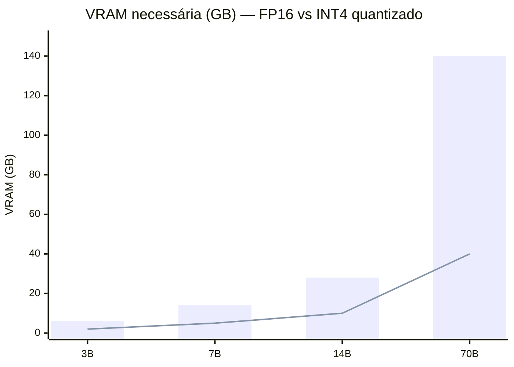
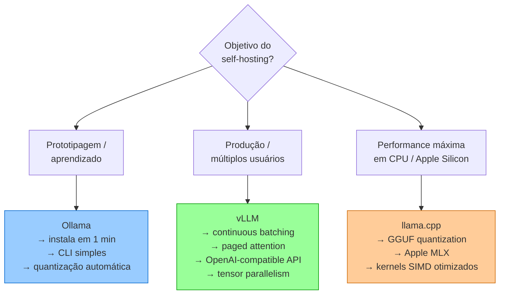

# Modelos locais e self-hosting

> [!abstract] TL;DR
> Rodar LLMs localmente em 2026 é viável para modelos de até ~70B parâmetros em hardware de consumo e até ~600B em clusters de GPUs. Ollama é o caminho rápido (instala em 1 minuto, roda via CLI). vLLM é a solução de produção (throughput alto, concurrent users). A decisão de self-host vs API depende de volume, privacidade e tolerância à complexidade operacional. A maioria dos engenheiros ganha mais usando APIs e investindo o tempo economizado em context engineering.

## A pergunta real: quando vale a pena?

Uma chamada ao Claude Sonnet custa $0.30 por 50k tokens de input + 10k de output. Uma RTX 4090 custa ~$1.800 e consome ~450W. Por que alguém consideraria rodar localmente?

A resposta tem três dimensões que raramente são discutidas juntas:

**Privacidade real:** quando o dado não pode sair da máquina — código-fonte proprietário, dados de saúde, informação jurídica. Com API, o texto que você envia passa pelos servidores do provider. Mesmo com NDAs e SOC2, há empresas cujo compliance não permite isso.

**Economia em escala:** a API parece barata por chamada, mas escala com uso. Um produto com 10.000 chamadas/dia a 50k tokens cada custa $1.800/dia no Sonnet. Uma A100 de $2.500/mês de aluguel pode processar isso e muito mais. O ponto de cruzamento é real — e chega mais rápido do que parece.

**Soberania técnica:** sem rate limits, sem latência de rede, sem dependência do uptime de terceiros, sem risco de mudança de pricing ou descontinuação de modelo. Para infraestrutura crítica, essa independência tem valor.

O que self-hosting *não resolve*: acesso a modelos frontier (Opus 4.6, GPT-5.4 não são open-weight), complexidade operacional (quem atualiza o modelo quando sai versão nova?), e o custo de oportunidade de manutenção.

## O que é

**Self-hosting** é rodar um [[Dicionário de IA#LLM (Large Language Model)|LLM]] na sua própria máquina ou infraestrutura, em vez de usar APIs de terceiros (OpenAI, Anthropic, Google). Em 2026, duas ferramentas dominam:

- **Ollama** — foco em simplicidade, experiência de desenvolvedor, prototipagem
- **vLLM** — foco em throughput, produção, múltiplos usuários concorrentes

## Hardware necessário

A regra de ouro: **VRAM é o recurso limitante**. O modelo inteiro (todos os [[Dicionário de IA#parameters / weights|parâmetros]], incluindo experts em MoE) precisa caber na VRAM.

| Modelo | Parâmetros | VRAM (FP16) | VRAM (INT4 quantizado) | GPU recomendada |
| ------------------ | ---------- | ----------- | ---------------------- | -------------------- |
| Llama 3.2 3B | 3B | ~6GB | ~2GB | Qualquer GPU moderna |
| Qwen 2.5 7B | 7B | ~14GB | ~5GB | RTX 3060 12GB |
| DeepSeek Coder 14B | 14B | ~28GB | ~10GB | RTX 4090 24GB |
| Llama 3 70B | 70B | ~140GB | ~40GB | 2x RTX 4090 ou A100 |
| DeepSeek V3 | ~600B MoE | ~1.2TB | ~120GB | 8x A100 80GB |



**Requisitos mínimos do sistema:**

- **RAM:** 16GB mínimo, 32GB+ recomendado
- **Storage:** NVMe SSD (modelos são grandes: 4GB–120GB)
- **GPU:** NVIDIA com CUDA (preferencial), Apple Silicon M-series, AMD ROCm (suporte parcial)

## Apple Silicon: o caminho acessível

Macs com chips M-series usam **memória unificada** — a mesma RAM serve como VRAM:

| Mac | Memória unificada | Modelos que rodam |
| ------------------------- | ----------------- | -------------------------------- |
| M4 Pro 24GB | 24GB | Até 14B confortável |
| M4 Max 64GB | 64GB | Até 33B, 70B quantizado apertado |
| Mac Studio M2 Ultra 128GB | 128GB | 70B confortável, MoE menores |

## Ollama — setup em 1 minuto

```bash
# Instalar
curl -fsSL https://ollama.com/install.sh | sh

# Rodar um modelo (baixa automaticamente na primeira vez)
ollama run llama3.2       # 3B, roda em qualquer GPU
ollama run qwen2.5:14b    # 14B, precisa de ~10GB VRAM
ollama run deepseek-coder-v2:33b  # 33B, precisa de ~20GB VRAM

# API OpenAI-compatible (automática na porta 11434)
curl http://localhost:11434/v1/chat/completions \
  -H "Content-Type: application/json" \
  -d '{
    "model": "qwen2.5:14b",
    "messages": [{"role": "user", "content": "Explain quicksort in Python"}]
  }'
```

**Integrações úteis:**

- **Continue** (VS Code) — usa Ollama como backend
- **OpenCode** — suporta Ollama como provider
- **Cursor** — pode apontar para API local (via proxy)

## vLLM — produção e throughput

```bash
# Instalar
pip install vllm

# Servir modelo com OpenAI-compatible API
vllm serve meta-llama/Llama-3-70b-Instruct \
  --tensor-parallel-size 2 \
  --gpu-memory-utilization 0.9 \
  --max-model-len 32768

# Otimizações adicionais
  --quantization awq \
  --enable-prefix-caching
```

## Ollama vs vLLM — quando usar cada um



## Quando vale a pena self-host?

| Cenário | Self-host? | Motivo |
| ---------------------------------------- | -------------- | ------------------------------------ |
| Developer solo, <100 calls/dia | **Não** | API é mais barato e fácil |
| Startup, 1000+ calls/dia | **Talvez** | Calcular custo de GPU vs API |
| Empresa com dados sensíveis | **Sim** | Privacidade justifica a complexidade |
| Experimentação e aprendizado | **Sim** | Ollama torna isso trivial |
| Produção com SLA | **Sim (vLLM)** | Controle total de latência e uptime |
| Precisa de modelo frontier (Opus, GPT-5) | **Não** | Modelos frontier não são open-weight |

## Cálculo de custo: self-host vs API

Para 100.000 chamadas/dia com ~2k tokens cada:

| Opção | Custo mensal estimado |
| ------------------------------------ | --------------------- |
| **Claude Sonnet via API** | ~$1,200/mês |
| **GPT-4.1 Nano via API** | ~$30/mês |
| **RTX 4090 (depreciação + energia)** | ~$150/mês |
| **Cloud GPU (A100 spot)** | ~$500–800/mês |

> [!warning] O custo escondido do self-hosting
> O preço do hardware é só parte do custo. Somar: tempo de setup, manutenção, monitoramento, atualizações de modelo, e o custo de oportunidade de não estar desenvolvendo. Para volumes baixos (<10k calls/dia), APIs budget (GPT-4.1 Nano, Gemini Flash-Lite) costumam ganhar na conta total mesmo em FP32.

## Ferramentas

| Ferramenta | Tipo | Melhor para | Custo |
| ------------------------- | ----------- | --------------------------------------- | ----------------------- |
| **Ollama** | CLI/Desktop | Prototipagem, dev local | Gratuito |
| **vLLM** | Server | Produção, multi-user | Gratuito (infra é paga) |
| **llama.cpp** | CLI | Performance máxima em CPU/Apple Silicon | Gratuito |
| **text-generation-webui** | Web UI | Interface visual para experimentar | Gratuito |
| **LM Studio** | Desktop app | GUI amigável para modelos locais | Gratuito |

## Armadilhas

- **"Self-hosting é sempre mais barato"** — para volume baixo (<1000 calls/dia com modelos budget), API é quase sempre mais econômico quando se conta tempo de manutenção.
- **"Qualquer GPU serve"** — modelos úteis para coding (14B+) exigem no mínimo 10GB de VRAM. GPUs com 6-8GB rodam apenas modelos de 3B-7B.
- **Quantização degrada qualidade** — INT4 é significativamente pior que FP16 para raciocínio complexo. Para coding, use pelo menos INT8 ou Q5_K_M.
- **"Modelo local = 100% privado"** — se o modelo foi treinado em dados similares aos seus, pode "vazar" informações do treinamento. Privacidade de inferência ≠ privacidade de treinamento.
- **Ignorar atualizações** — modelos open-weight atualizam a cada 2-3 meses. Ficar preso em uma versão antiga é perder performance significativa.

## Como explicar em inglês

Self-hosting LLMs means running the model on your own infrastructure instead of using a provider's API. The key constraint is **VRAM**: the full model (including all expert weights in MoE models) must fit in GPU memory. In 2026, consumer hardware can comfortably run 7B–14B models (RTX 4090 = 24GB) and quantized 70B models across two GPUs. **Ollama** is the developer-experience path — one command to download and run any Hugging Face model locally with an OpenAI-compatible API. **vLLM** is the production path — continuous batching, paged attention, tensor parallelism for multi-user serving. The break-even point where self-hosting beats API costs is lower than most engineers expect, but the operational overhead (maintenance, updates, monitoring) is higher.

| PT | EN |
|----|---|
| Auto-hospedagem | Self-hosting |
| Memória de vídeo | VRAM (Video RAM) |
| Memória unificada | Unified memory |
| Quantização | Quantization |
| Paralelismo tensorial | Tensor parallelism |
| Agrupamento contínuo | Continuous batching |
| Atenção paginada | Paged attention |
| Modelo de peso aberto | Open-weight model |
| Largura de banda de memória | Memory bandwidth |

## Ver mais

- **[Andrej Karpathy — LLMs in laptops (2024)](https://www.youtube.com/watch?v=zjkBMFhNj_g)** — Karpathy demonstra rodando modelos Llama localmente e explica os tradeoffs de VRAM vs compute. Boa introdução ao hardware necessário.
- **[Ollama — Getting Started](https://ollama.com)** — documentação oficial com lista completa de modelos disponíveis, comandos e integrações com ferramentas de coding.
- **[vLLM Blog — PagedAttention](https://vllm.ai/blog/2023/06/20/vllm.html)** — explicação técnica de por que o vLLM consegue 24x mais throughput que implementações ingênuas, com benchmarks.

## Veja também

- [[08 - Modelos chineses — DeepSeek, Qwen, Kimi, GLM]] — modelos open-weight disponíveis para self-hosting
- [[09 - Dense vs Mixture-of-Experts]] — impacto da arquitetura (MoE) na VRAM necessária
- [[11 - APIs de LLM — anatomia de uma chamada]] — o caminho alternativo (API cloud)
- [[20 - Compressão de modelos — quantização e destilação]] — a teoria da quantização que você aplica aqui

## Referências

- **Ollama** — *Documentation* (ollama.com). Guia oficial de instalação e uso.
- **vLLM Project** — *Documentation* (vllm.readthedocs.io). Referência técnica de deployment.
- **Georgi Gerganov** — *llama.cpp* (GitHub). Implementação de referência para inferência em CPU.
- **HuggingFace** — *Open LLM Leaderboard* (2026). Rankings de modelos open-weight.
