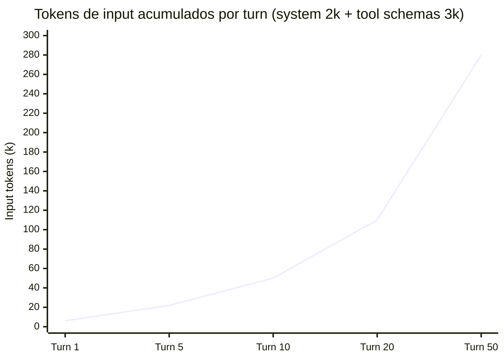
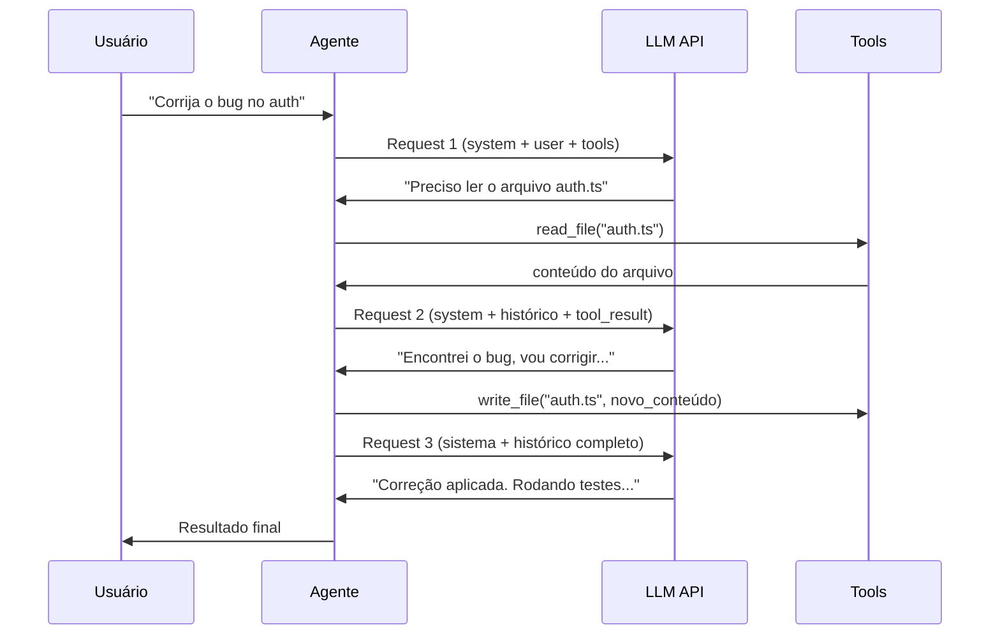

# APIs de LLM — anatomia de uma chamada

> [!abstract] TL;DR
> Uma chamada de API de LLM é um POST HTTP com um array de mensagens (system, user, assistant), parâmetros de controle (temperature, max_tokens) e opcionalmente definições de tools. A resposta vem com o texto gerado e metadados de uso (tokens consumidos). Entender essa anatomia é fundamental para debugar problemas, otimizar custos e construir agentes — porque cada "conversa" com um LLM é na verdade uma série de chamadas HTTP stateless.

## O que ninguém te conta sobre "memória" de conversa

Você abre o Claude, faz uma pergunta, e na segunda mensagem pergunta "pode expandir o ponto 3?". O modelo responde como se lembrasse o que acabou de dizer. Parece memória. Não é.

Cada chamada de API é **completamente stateless**. O servidor não guarda nada entre requests. Quando você envia a segunda mensagem, sua ferramenta (Claude.ai, Cursor, API direta) está enviando **toda a conversa desde o início** de volta ao servidor: a mensagem 1, a resposta 1, a mensagem 2 — tudo num único array `messages`. O modelo vê o histórico completo a cada vez porque você reenviu tudo.

Isso tem duas consequências que afetam custo e arquitetura:

1. **Custo cresce com o número de turns.** Numa conversa de 10 messages com sistema de 2k tokens, a décima chamada já envia ~15-20k tokens de input antes mesmo de você digitar sua pergunta. É custo acumulativo, não fixo.
2. **Você controla o que "o modelo lembra".** Como você monta o array `messages` é uma decisão de engenharia. Pode truncar histórico antigo, resumir turnos, excluir mensagens irrelevantes. "Memória" de LLM é sempre implementada, nunca mágica.

Essa compreensão é o que separa quem *usa* uma API de LLM de quem *entende* o que está fazendo — e o segundo tipo constrói sistemas mais baratos, mais rápidos e mais confiáveis.

## O que é

A API de um LLM é a interface HTTP que permite enviar prompts e receber respostas programaticamente. O formato **Chat Completions** (padronizado pela OpenAI e adotado por quase todos os providers) é o padrão da indústria em 2026.

Cada chamada é **stateless** — o modelo não "lembra" interações anteriores. O "histórico de conversa" é reenviado integralmente a cada request.

## Por que importa

- **Custo** — cada campo do request consome tokens. Campos desnecessários desperdiçam dinheiro.
- **Debugging** — 90% dos problemas com LLMs estão no request (contexto mal formado, roles errados, temperature inadequada)
- **Agentes** — ferramentas como Claude Code e Cursor constroem requests complexos por baixo dos panos. Entender a anatomia ajuda a configurá-los melhor.

## Como funciona

### A jornada completa de uma chamada (~400ms)

Antes de detalhar request e response, vale entender o que acontece **do lado do servidor** entre o `POST` sair da sua máquina e a resposta começar a streamar de volta. Toda chamada percorre sete estágios — e ~95% do tempo de espera está concentrado em apenas um deles.

![[jornada-completa-chamada-api-llm.jpeg]]

| Estágio              | Tempo típico | O que rola                                                                                     |
| -------------------- | ------------ | ---------------------------------------------------------------------------------------------- |
| 1. API Gateway       | ~5ms         | TLS termination, auth (API key), rate limiting — onde o billing começa                         |
| 2. Load Balancer     | ~2ms         | Routing geográfico, health checks, escolha do cluster de GPU                                   |
| 3. Tokenization      | ~3ms         | Texto vira IDs de tokens (BPE/SentencePiece). É aqui que `Token Count × $/1k` é calculado      |
| 4. Model Router      | ~1ms         | Escolhe qual cluster atende (small/large/MoE/embedding) — model-version routing acontece aqui  |
| 5. **[[Dicionário de IA#inference\|Inference Engine]]** | **300–800ms** | Prefill (paralelo) + Decode (autoregressivo, token a token) + Attention + GPU compute     |
| 6. Post-Processing   | ~5ms         | Safety filters, format validation, stop sequences                                              |
| 7. Response & Billing | ~5ms        | Serialização JSON (ou stream SSE), cálculo final de custo, logging                             |

Três implicações práticas pro que vem a seguir neste artigo:

- **Tokenização (estágio 3) acontece antes da inferência** — por isso `tools` e mensagens longas no `messages` aumentam o custo *antes* mesmo do modelo gerar qualquer coisa.
- **Inference engine (estágio 5) domina a latência** — otimizações como [[13 - Prompt caching e otimizações de API|prompt caching]] e [[14 - Streaming, batching e latência|streaming]] atacam exatamente essa fase.
- **Billing começa no estágio 1** — toda request autenticada conta, mesmo que falhe depois. Por isso `usage` no response é o seu único termômetro confiável.

### Anatomia do Request

```json
{
  "model": "claude-sonnet-4.6",
  "max_tokens": 4096,
  "temperature": 0.3,
  "system": "Você é um engenheiro de software sênior...",
  "messages": [
    {
      "role": "user",
      "content": "Refatore este código para usar async/await"
    },
    {
      "role": "assistant",
      "content": "Vou analisar o código..."
    },
    {
      "role": "user",
      "content": "Agora adicione tratamento de erros"
    }
  ],
  "tools": [
    {
      "name": "read_file",
      "description": "Lê conteúdo de um arquivo",
      "input_schema": {
        "type": "object",
        "properties": {
          "path": {"type": "string"}
        }
      }
    }
  ]
}
```

### Campos do Request

| Campo         | Obrigatório | Descrição                                   | Impacto em tokens                               |
| ------------- | ----------- | ------------------------------------------- | ----------------------------------------------- |
| `model`       | Sim         | Qual modelo usar                            | Nenhum (metadata)                               |
| `messages`    | Sim         | Array de mensagens com roles                | **Principal consumidor** de input tokens        |
| `system`      | Não*        | [[Dicionário de IA#system prompt\|Instruções de sistema]]                       | Input tokens (cacheable)                        |
| `max_tokens`  | Sim†        | Limite máximo de output                     | Limita output tokens (e custo)                  |
| `temperature` | Não         | [[Dicionário de IA#temperature\|Criatividade]] (0=determinístico, 1=criativo) | Nenhum                                          |
| `top_p`       | Não         | Nucleus sampling                            | Nenhum                                          |
| `tools`       | Não         | [[Dicionário de IA#tool definition\|Definições de ferramentas]]                   | **Consumidor oculto** — schemas JSON são tokens |
| `tool_choice` | Não         | Forçar ou sugerir uso de tool               | Nenhum                                          |
| `stop`        | Não         | Sequências que param a geração              | Nenhum                                          |
| `stream`      | Não         | Habilitar streaming SSE                     | Nenhum                                          |

*\*Em Anthropic é campo separado; em OpenAI é uma mensagem com `role: "system"`. †Anthropic exige; OpenAI tem default.*

### Roles e sua função

| Role        | Quem fala                       | Consumo                     | Cacheable?             |
| ----------- | ------------------------------- | --------------------------- | ---------------------- |
| `system`    | O desenvolvedor (instruções)    | Input tokens                | ✅ Sim (prompt caching) |
| `user`      | O humano (perguntas, contexto)  | Input tokens                | ⚠️ Parcial              |
| `assistant` | O modelo (respostas anteriores) | Input tokens (no histórico) | ⚠️ Parcial              |
| `tool`      | Resultado de uma ferramenta     | Input tokens                | ❌ Geralmente não       |

### Anatomia do Response

```json
{
  "id": "msg_01XF...",
  "model": "claude-sonnet-4.6",
  "content": [
    {
      "type": "text",
      "text": "Aqui está o código refatorado..."
    }
  ],
  "usage": {
    "input_tokens": 2847,
    "output_tokens": 1253,
    "cache_read_input_tokens": 1500,
    "cache_creation_input_tokens": 0
  },
  "stop_reason": "end_turn"
}
```

### O campo `usage` — seu monitor de custos

| Métrica                       | Significado                                           |
| ----------------------------- | ----------------------------------------------------- |
| `input_tokens`                | Total de tokens de input (prompt + histórico + tools) |
| `output_tokens`               | Tokens gerados pelo modelo                            |
| `cache_read_input_tokens`     | Tokens lidos do cache (mais baratos)                  |
| `cache_creation_input_tokens` | Tokens escritos no cache (custo normal)               |

### O custo acumulativo de uma conversa de agente

Cada turn de uma conversa de agente reenvia o histórico inteiro. O custo de input cresce quase linearmente com os turns:



Turn 50 de uma sessão de agente envia ~280k tokens de input — só em histórico acumulado, antes de qualquer work novo. Por isso sessões longas de agente são desproporcionalmente caras, e por isso técnicas como **prompt caching** (cachear o system prompt e início do histórico) e **context compression** (resumir turnos antigos) são essenciais em agentes de produção.

### Temperature e suas consequências

| Temperature | Comportamento                            | Quando usar                             |
| ----------- | ---------------------------------------- | --------------------------------------- |
| 0.0         | Determinístico, sempre a mesma resposta  | Código, refactoring, dados estruturados |
| 0.1–0.3     | Quase determinístico, pequenas variações | Coding geral, análise                   |
| 0.5–0.7     | Criativo mas controlado                  | Escrita de docs, brainstorming          |
| 0.8–1.0     | Altamente variável                       | Geração criativa, exploração            |

### O ciclo de um agente

O que uma ferramenta como Claude Code faz por baixo dos panos:



Cada seta para a API é uma chamada HTTP completa, com o histórico inteiro reenviado. É por isso que sessões longas de agentes ficam caras.

## Armadilhas

- **"A API lembra o que falei antes"** — não. Cada chamada é stateless. O histórico é reenviado integralmente.
- **Ignorar tool definitions nos tokens** — schemas JSON de ferramentas consomem 500-2000 tokens facilmente. 10 ferramentas com descriptions verbosas podem consumir 5k+ tokens de input em cada chamada.
- **max_tokens muito alto** — não custa nada configurar, mas se o modelo gerar até o limite, você paga. Defina o mínimo razoável para a tarefa.
- **Temperature 0 para tudo** — temperature 0 é boa para código, mas pode causar repetição em texto longo. Para documentação, use 0.2-0.4.
- **Não monitorar `usage`** — se você não loga os tokens consumidos por chamada, não tem como identificar onde está o desperdício.

## Como explicar em inglês

An LLM API call is a stateless HTTP POST containing a `messages` array (system, user, assistant roles), control parameters (temperature, max_tokens), and optional tool definitions. The server holds no state between requests — "conversation memory" is an illusion maintained by the client resending the full message history on every call. This has a critical cost implication: in an agentic session, turn 10 sends 10× the tokens of turn 1, because it includes the entire prior conversation as input tokens. The `usage` field in the response is the authoritative cost meter — input_tokens counts everything you sent (messages + system prompt + tool definitions), output_tokens counts what the model generated. Tool definitions are a hidden input cost: 10 tools with verbose descriptions can consume 5k+ input tokens per call before the model even reads your message.

| PT | EN |
|----|---|
| Chamada de API | API call |
| Sem estado | Stateless |
| Mensagens | Messages |
| Papel / função | Role |
| Prompt de sistema | System prompt |
| Tokens de entrada | Input tokens |
| Tokens de saída | Output tokens |
| Definições de ferramentas | Tool definitions |
| Esquema de ferramenta | Tool schema |
| Motivo de parada | Stop reason / finish reason |
| Streaming de eventos enviados pelo servidor | Server-Sent Events (SSE) streaming |

## Ver mais

- **[Anthropic — Messages API Reference (2026)](https://docs.anthropic.com/en/api/messages)** — a referência completa do formato Anthropic: campos, roles, tool use, streaming. O ponto de partida para qualquer integração com Claude.
- **[OpenAI — Chat Completions API Reference (2026)](https://platform.openai.com/docs/api-reference/chat)** — o formato que se tornou o padrão da indústria (OpenAI-compatible API). Quase todos os providers (Ollama, vLLM, SiliconFlow) implementam essa interface.
- **[Simon Willison — Understanding LLM APIs (2024)](https://simonwillison.net)** — Willison (criador do Datasette, co-criador do Django) escreve análises acessíveis e precisas sobre APIs de LLM, com foco em casos de uso práticos e armadilhas comuns.

## Veja também

- [[12 - Pricing de APIs — como calcular custos]] — traduzindo tokens em dinheiro
- [[13 - Prompt caching e otimizações de API]] — reduzindo custo de chamadas repetitivas
- [[14 - Streaming, batching e latência]] — performance da comunicação

## Referências

- **OpenAI** — *Chat Completions API Reference* (2026). Documentação canônica do formato.
- **Anthropic** — *Messages API Reference* (2026). Formato com variações (system separado, tool use).
- **Google** — *Gemini API Reference* (2026). Formato com integrações multimodais.
