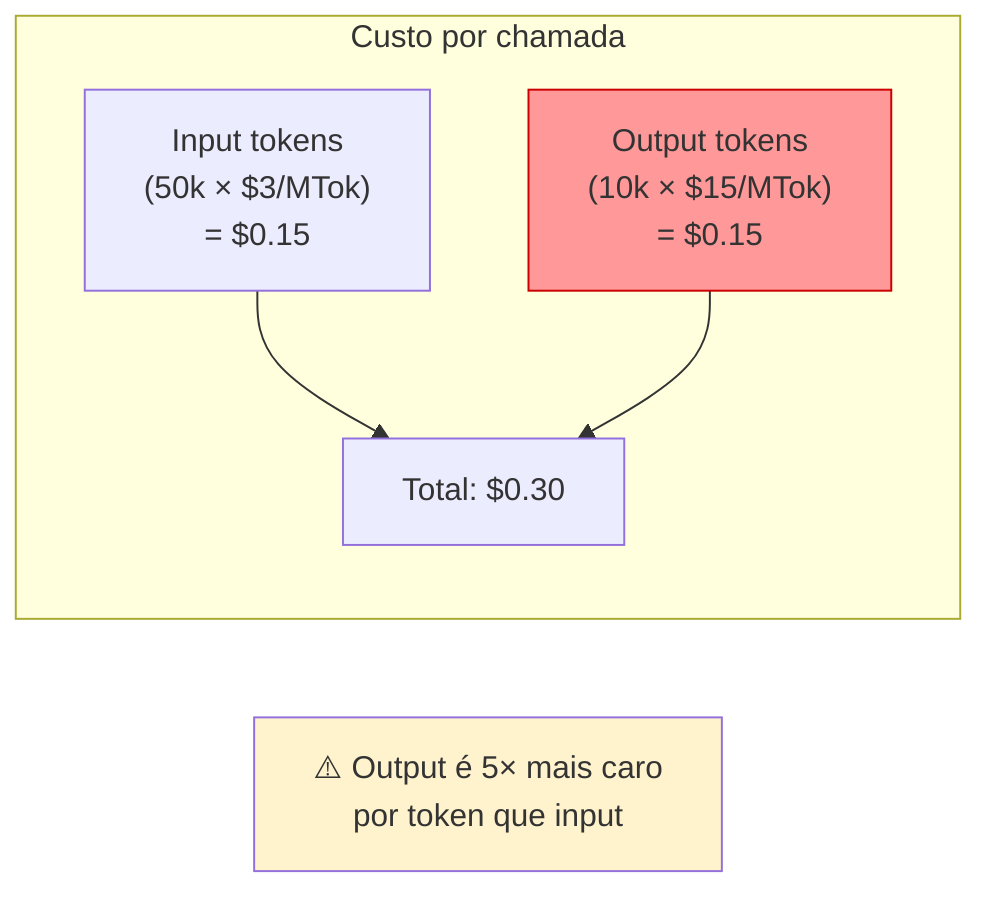
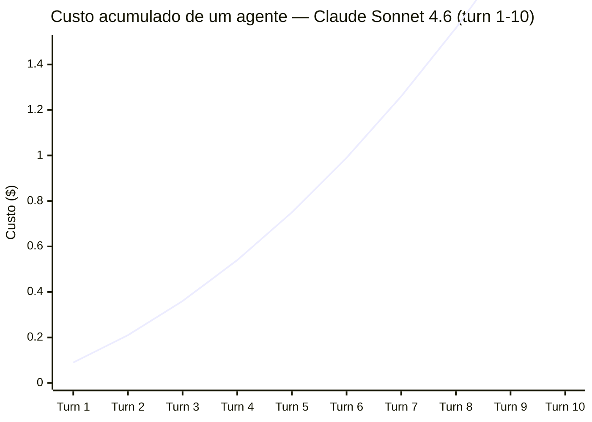
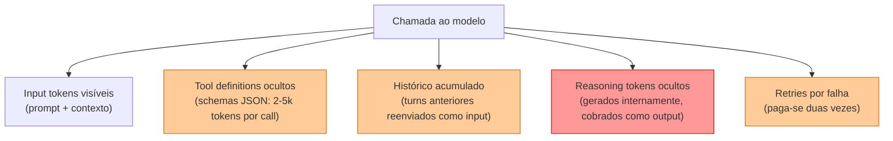

# Pricing de APIs — como calcular custos

> [!abstract] TL;DR
> APIs de LLM cobram por milhão de tokens (MTok), com preços separados para input e output — output é 3–6× mais caro. Em 2026, custos variam de $0.10/MTok (modelos budget) a $25/MTok (flagships). Prompt caching reduz input em até 90%. Batch APIs dão 50% de desconto. A fórmula do custo real é: `(input_tokens × preço_input + output_tokens × preço_output) ÷ 1.000.000`. Não controlar isso é queimar dinheiro.

## O problema que o pricing resolve — ou cria

Imagine um agente de código que você construiu funcionando muito bem num teste. 80 chamadas ao dia, contextos razoáveis, resultados excelentes. Você lança para 10 usuários. Dois meses depois, a fatura do provider chega: $2.400 no mês.

O que aconteceu? Você não mediu. Cada chamada acumulava o histórico completo do agente como input. Na turn 50, o agente reenviava as 49 turns anteriores. Output tokens eram 4× mais caros que input e você não tinha notado. Sem caching no system prompt de 10k tokens, você pagava por ele em cada chamada.

Pricing de API de LLM não é uma taxa fixa — é um **sistema de custos compostos** que acelera com o tamanho do contexto, o número de turns e a verbosidade do modelo. Entender a mecânica antes de escalar é a diferença entre $5/dia e $150/dia para o mesmo trabalho.

## A fórmula fundamental

```
Custo = (input_tokens × preço_input / 1M) + (output_tokens × preço_output / 1M)
```

**Exemplo concreto com Claude Sonnet 4.6:**

- Input: 50.000 tokens × $3.00/MTok = $0.15
- Output: 10.000 tokens × $15.00/MTok = $0.15
- **Total: $0.30 por chamada**

A assimetria input/output é estrutural — output é mais caro porque **o decode é mais caro computacionalmente** que o prefill (ver [[04a - KV cache, prefill e decode — a física da inferência]]). Providers repassam essa assimetria diretamente no preço.



## Tabela de preços (maio 2026)

| Provider      | Modelo                | Tier      | Input $/MTok | Output $/MTok | Cache Read |
| ------------- | --------------------- | --------- | ------------ | ------------- | ---------- |
| **Anthropic** | Claude Opus 4.6       | Flagship  | $5.00        | $25.00        | $0.50      |
|               | Claude Sonnet 4.6     | Mid       | $3.00        | $15.00        | $0.30      |
|               | Claude Haiku 4.5      | Budget    | $1.00        | $5.00         | $0.10      |
| **OpenAI**    | GPT-5.4               | Flagship  | ~$2.50       | ~$15.00       | ~$0.25     |
|               | o4-mini               | Reasoning | ~$1.10       | ~$4.40        | —          |
|               | GPT-4.1 Nano          | Budget    | ~$0.10       | ~$0.40        | ~$0.01     |
| **Google**    | Gemini 3.1 Pro        | Flagship  | ~$2.00       | ~$12.00       | ~$0.20     |
|               | Gemini 3 Flash        | Mid       | ~$0.50       | ~$3.00        | ~$0.05     |
|               | Gemini 2.5 Flash-Lite | Budget    | ~$0.10       | ~$0.40        | —          |

> [!question]- Por que output custa 3–6× mais que input por token?
> Porque o decode (geração de tokens) é inerentemente mais caro que o prefill (processamento do input). No decode, a GPU gera um token de cada vez e precisa carregar o KV cache inteiro da memória a cada step — operação memory-bound com baixo aproveitamento de compute. No prefill, todos os tokens do input são processados em paralelo com alta utilização de GPU. Os providers repassam essa assimetria computacional diretamente nos preços. É o mesmo motivo pelo qual modelos de reasoning (o4, Claude Thinking) são ainda mais caros no output: eles geram muitos "reasoning tokens" internos além da resposta visível.

## Como o custo explode em agentes

O ponto mais contraintuitivo do pricing de LLM: em agentes multi-turn, o input **cresce a cada turn** porque o histórico completo é reenviado como contexto.



O crescimento não é linear — é **quadrático**. O input da turn N inclui o histórico das turns 1 a N-1. Para um agente com turns custosas, o custo total escala com N² em relação ao custo da turn 1. Uma sessão de 50 turns pode custar 1.250× o custo de uma única turn (não 50×).

**Exemplo concreto:** agente de coding com system prompt 5k tokens + 5k de contexto por turn + 3k de output:

| Turn | Input tokens | Output tokens | Custo (Sonnet 4.6) | Custo acum. |
|------|-------------|----------------|---------------------|-------------|
| 1 | 10k | 3k | $0.075 | $0.075 |
| 5 | 30k | 3k | $0.135 | $0.47 |
| 10 | 55k | 3k | $0.21 | $1.17 |
| 20 | 105k | 3k | $0.36 | $3.10 |
| 50 | 255k | 3k | $0.81 | $13.50 |

A sessão de 50 turns que "parecia barata" custou $13.50 — e escala linearmente com o número de usuários.

## Mecanismos de desconto

| Mecanismo                  | Desconto típico | Como funciona                                                                   |
| -------------------------- | --------------- | ------------------------------------------------------------------------------- |
| **Prompt caching**         | 50–90% no input | Partes estáticas (system prompt, docs) cacheadas entre chamadas. Cache read ~10% do preço de input |
| **Batch API**              | ~50% em tudo    | Enviar tasks em lote para processamento assíncrono (SLA de horas, não segundos) |
| **Commitment plans**       | 20–40%          | Comprometer volume mensal com o provider                                        |
| **Provedor intermediário** | Variável        | Together, Fireworks, Groq oferecem modelos open-weight com markup menor         |

**O impacto real do prompt caching num agente:** se o system prompt tem 10k tokens e você faz 100 chamadas/dia com Sonnet 4.6:
- Sem caching: 100 × 10k × $3/MTok = $3/dia só no system prompt
- Com caching (cache read a $0.30/MTok): 100 × 10k × $0.30/MTok = $0.30/dia
- **Economia: $2.70/dia → $81/mês** só no system prompt

## Custos ocultos que as pessoas esquecem



| Item                       | Por que é custo oculto                                                                                |
| -------------------------- | ----------------------------------------------------------------------------------------------------- |
| **Tool definitions**       | Schemas JSON de ferramentas são input tokens — 10 tools podem consumir 2–5k tokens por chamada        |
| **Histórico acumulado**    | Cada turn do agente reenvia todo o histórico. Turn 50 inclui turns 1–49 como input                   |
| **Reasoning tokens**       | Modelos de reasoning (o4, Claude Thinking) geram tokens internos de "pensamento" cobrados como output |
| **Retries**                | Se o agente erra e tenta de novo, paga-se duas vezes                                                  |
| **Contexto desnecessário** | Arquivos inteiros no prompt quando só 20 linhas eram relevantes                                       |

## Simulação: custo de um dia de desenvolvimento

Cenário: engenheiro usando Claude Sonnet 4.6 como agente de codificação, 8h de trabalho.

| Atividade                          | Chamadas | Input/chamada | Output/chamada | Subtotal    |
| ---------------------------------- | -------- | ------------- | -------------- | ----------- |
| Debugging (5 bugs)                 | 25       | 30k tokens    | 5k tokens      | $2.63       |
| Feature nova (2 features)          | 40       | 50k tokens    | 15k tokens     | $15.00      |
| Refactoring                        | 10       | 80k tokens    | 20k tokens     | $5.40       |
| Code review                        | 5        | 100k tokens   | 10k tokens     | $2.25       |
| **Total sem otimização**           | **80**   | —             | —              | **$25.28**  |
| **Total com prompt caching (70%)** | **80**   | —             | —              | **~$12.00** |

## Ferramentas de monitoramento

| Ferramenta                | O que faz                                                  |
| ------------------------- | ---------------------------------------------------------- |
| **ccusage**               | Monitora consumo do Claude Code por sessão                 |
| **Langfuse**              | Tracing de LLM com custo por chamada                       |
| **Helicone**              | Proxy que loga e visualiza consumo                         |
| **Dashboard do provider** | Visão geral de gastos na conta                             |
| **Planilha simples**      | Log diário de `usage.input_tokens` + `usage.output_tokens` |

## Checklist

- [ ] Definir orçamento diário/mensal antes de começar
- [ ] Configurar alertas de gasto no dashboard do provider
- [ ] Ativar prompt caching para system prompts e docs estáticos
- [ ] Usar Batch API para tarefas não urgentes
- [ ] Monitorar `usage` no response de cada chamada
- [ ] Revisar tool definitions — remover descrições verbosas
- [ ] Considerar modelo budget para tarefas simples (model routing)
- [ ] Sumarizar histórico longo em vez de acumular indefinidamente

## Armadilhas comuns

> [!warning] "$3/MTok é barato" — até você escalar
> Para uma chamada isolada, sim. Para 1000 chamadas/dia de um agente com 50k tokens de input cada, são $150/dia → $4.500/mês. O pricing parece barato no nível da chamada individual e caro no nível do produto em escala. Calcule *antes* de comprometer com um modelo.

> [!warning] Output tokens custam 3–6× mais — e agentes geram muito
> Um modelo verboso que gera 5× mais texto que o necessário custa 5× mais em output. Para agentes, instrua o modelo a ser conciso. Use format constraints no system prompt.

> [!warning] Não separar input e output no cálculo
> Cálculos que usam "preço médio por token" subestimam custos reais porque ignoram a assimetria. Sempre calcule input e output separadamente.

> [!warning] Reasoning tokens invisíveis
> Modelos de reasoning podem gastar 10–50× mais em tokens internos do que o output visível. Monitore `thinking_tokens` (Anthropic) ou `reasoning_tokens` (OpenAI) no response object — eles somem na fatura mesmo sem aparecer no output.

> [!warning] "Caching resolve tudo"
> Caching ajuda com partes *estáticas*. Se cada chamada tem contexto significativamente diferente (ex.: o conteúdo de cada email para classificar), o cache hit rate é próximo de zero. Caching só ajuda quando partes fixas do prompt são substanciais e repetidas.

## Como explicar em inglês

LLM APIs charge per million tokens, with input and output priced separately — output is typically 3–6× more expensive because token generation (decode) is computationally costlier than processing input (prefill). In multi-turn agents, costs compound because the full conversation history is resent as input on every turn: a 50-turn agent session doesn't cost 50× the first turn, it costs roughly 50²/2 × the first turn cost. The main levers are prompt caching (reduce repeated static input by up to 90%), batch APIs (50% discount for async jobs), and model routing (use a budget model for classification, a mid-tier for drafting, the flagship only for the hardest reasoning).

| PT | EN |
|----|---|
| Custo por milhão de tokens | Cost per million tokens ($/MTok) |
| Tokens de entrada | Input tokens |
| Tokens de saída | Output tokens |
| Cache de prompt | Prompt cache / prompt caching |
| Leitura de cache | Cache read |
| API em lote | Batch API |
| Tokens de raciocínio | Reasoning tokens |
| Roteamento de modelo | Model routing |
| Custo oculto | Hidden cost |
| Contexto desnecessário | Unnecessary context |

## Veja também

- [[02 - Tokens e tokenização]] — como contar tokens antes de calcular o custo
- [[11 - APIs de LLM — anatomia de uma chamada]] — a estrutura do request que gera custo
- [[13 - Prompt caching e otimizações de API]] — como reduzir a conta com caching e batching

## Referências

- **Anthropic** — *API Pricing* (2026). Tabela oficial de preços.
- **OpenAI** — *API Pricing* (2026). Tabela oficial de preços.
- **Artificial Analysis** — *LLM Cost Comparison* (2026). Comparativo independente.
- **CostGoat** — *LLM API Pricing Tracker* (2026). Agregador de preços atualizado.
