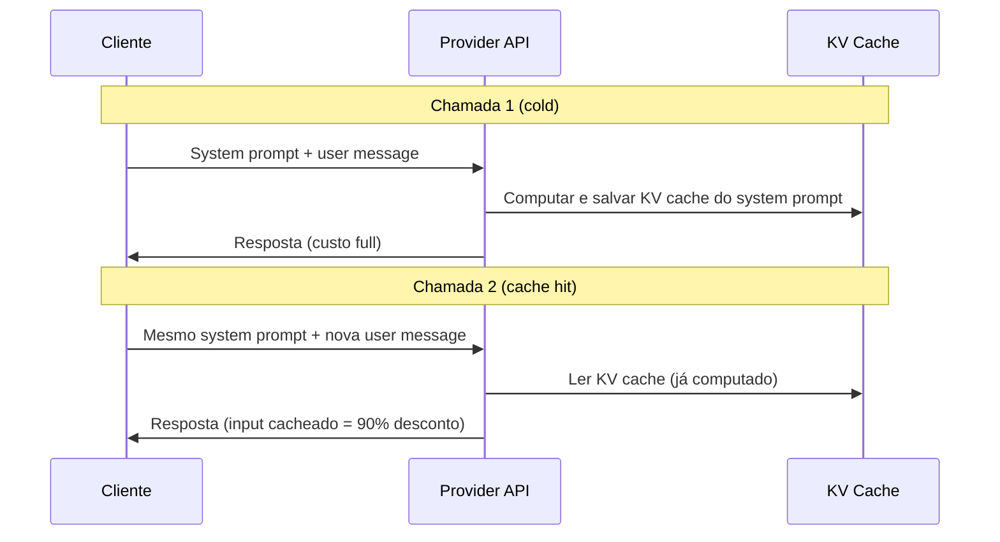
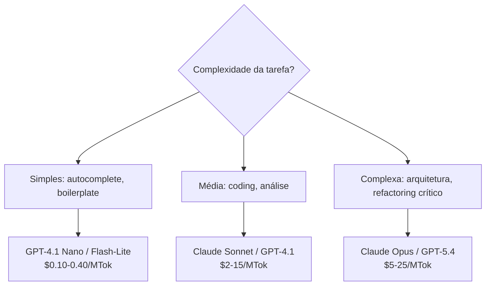
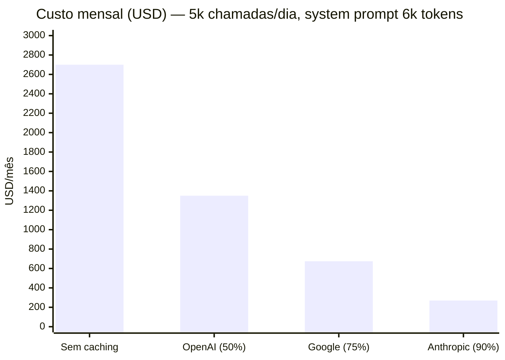

# Prompt caching e otimizações de API

Você olha a fatura de LLM do mês. São $2.700. Você esperava $500. Você audita o uso token a token e descobre: 70% do custo vem do mesmo system prompt de 6.000 tokens sendo reenviado e reprocessado do zero em cada uma das 5.000 chamadas diárias. O texto não muda. A instrução não muda. Mas a conta cresce a cada request como se fosse sempre a primeira vez.

Esse cenário é a regra, não a exceção — e a solução existe desde 2024: prompt caching. O provider computa o KV cache do seu system prompt uma vez, armazena por 5 minutos, e nas chamadas seguintes apenas lê da memória, cobrando 10% do preço normal de input. Naquele exemplo de $2.700/mês, habilitar caching para o system prompt reduziria para ~$270/mês. A diferença — $2.430 — é literalmente queimar compute que você já pagou uma vez.

Esta nota explica como o mecanismo funciona, como configurar em cada provider, e como combinar caching com Batch API e model routing para reduzir a conta mensal em 70-80%.

> [!abstract] TL;DR
> Prompt caching permite reutilizar tokens de input que não mudam entre chamadas (system prompt, documentação, esquemas), reduzindo custo de input em até 90%. Em 2026, Anthropic, OpenAI e Google oferecem caching nativo. A combinação de caching + Batch API + model routing pode reduzir a conta mensal de LLM em 70-80%. Não usar essas otimizações é literalmente queimar dinheiro.

## O que é

**[[Dicionário de IA#Prompt caching|Prompt caching]]** é um mecanismo em que o provider armazena a representação computada ([[Dicionário de IA#KV cache|KV cache]]) de partes do prompt que se repetem entre chamadas. Na segunda chamada com o mesmo prefixo, o modelo pula a fase de "prefill" desses tokens, economizando compute e cobrando menos.

## Por que importa

Em workflows agentic, a mesma estrutura se repete em cada chamada:

- System prompt (~1-3k tokens)
- Documentação de projeto (~5-20k tokens)
- Definições de ferramentas (~2-5k tokens)

Sem caching, esses tokens são reprocessados a cada turn. Com caching, são lidos da memória com **desconto de 80-90% no preço**.

## Como funciona

### O mecanismo



### Implementação por provider

#### Anthropic (Claude)

```json
{
  "model": "claude-sonnet-4.6",
  "system": [
    {
      "type": "text",
      "text": "Você é um engenheiro de software sênior...",
      "cache_control": {"type": "ephemeral"}
    }
  ],
  "messages": [...]
}
```

- **Desconto de leitura:** ~90% (ex: $3.00 → $0.30 por MTok)
- **Custo de escrita:** ~25% a mais que preço normal (pago apenas na primeira vez)
- **TTL:** 5 minutos (renovado a cada uso)
- **Mínimo para cachear:** 1.024 tokens (Sonnet/Opus), 2.048 (Haiku)

#### OpenAI (GPT)

```json
{
  "model": "gpt-5.4",
  "messages": [
    {"role": "system", "content": "...instrução longa e estável..."}
  ]
}
```

- **Automático:** OpenAI cacheia prefixos comuns automaticamente (sem `cache_control` explícito)
- **Desconto de leitura:** ~50%
- **Sem custo de escrita:** Caching é transparente

#### Google (Gemini)

```python
# Via API, usar Context Caching
cached_content = genai.caching.create(
    model='gemini-3.1-pro',
    display_name='project-docs',
    contents=[large_document],
    ttl=datetime.timedelta(hours=1)
)
```

- **Mais flexível:** Permite cachear documentos inteiros com TTL configurável
- **Desconto de leitura:** ~75%
- **Custo de storage:** Cobrança por hora de cache armazenado

### Comparativo de caching

| Feature                 | Anthropic                   | OpenAI            | Google                    |
| ----------------------- | --------------------------- | ----------------- | ------------------------- |
| **Controle**            | Explícito (`cache_control`) | Automático        | Explícito (API separada)  |
| **Desconto de leitura** | ~90%                        | ~50%              | ~75%                      |
| **Custo de escrita**    | 25% a mais                  | Nenhum            | Custo de storage por hora |
| **TTL**                 | 5 min (renova)              | Automático        | Configurável (1h–24h)     |
| **Mínimo**              | 1.024 tokens                | Não documentado   | Não documentado           |
| **Melhor para**         | System prompts estáveis     | Tudo (automático) | Documentos grandes        |

### Outras otimizações de API

#### Batch API

Enviar tasks em lote para processamento assíncrono:

| Provider  | Desconto | SLA de entrega | Melhor para                                           |
| --------- | -------- | -------------- | ----------------------------------------------------- |
| Anthropic | ~50%     | Até 24h        | Geração de testes, documentação, refactoring em massa |
| OpenAI    | ~50%     | Até 24h        | Processamento de dados, migrações                     |

```json
// Anthropic Batch API
{
  "requests": [
    {"custom_id": "task-1", "params": {"model": "claude-sonnet-4.6", "messages": [...]}},
    {"custom_id": "task-2", "params": {"model": "claude-sonnet-4.6", "messages": [...]}},
    // ...até 10.000 requests
  ]
}
```

#### Model routing (cascading)

Usar o modelo certo para cada tarefa:



#### Compressão de tool definitions

Antes:

```json
{
  "name": "read_file",
  "description": "Reads the complete contents of a file from the local filesystem. This tool supports reading text files as well as some binary files such as images. The file path must be an absolute path to ensure correct resolution.",
  "input_schema": {
    "type": "object",
    "properties": {
      "path": {
        "type": "string",
        "description": "The absolute path to the file that should be read from the local filesystem."
      }
    },
    "required": ["path"]
  }
}
```

Depois (economiza ~60% dos tokens de tool definitions):

```json
{
  "name": "read_file",
  "description": "Read file contents. Absolute path.",
  "input_schema": {
    "type": "object",
    "properties": {
      "path": {"type": "string"}
    },
    "required": ["path"]
  }
}
```

### Impacto combinado

| Otimização                     | Redução de custo           | Esforço |
| ------------------------------ | -------------------------- | ------- |
| Prompt caching (system + docs) | 30-50% do total            | Baixo   |
| [[Dicionário de IA#batch API\|Batch API]] para tarefas offline | 50% nessas tarefas         | Baixo   |
| Model routing                  | 40-60% nas tarefas simples | Médio   |
| Compressão de tools            | 5-10% do input             | Baixo   |
| Compactação de histórico       | 20-40% em sessões longas   | Médio   |
| **Combinação de todas**        | **60-80% do total**        | Médio   |

## O que caching significa em números

Para tornar concreto: 5.000 chamadas por dia com um system prompt de 6.000 tokens — cenário típico de produto com assistente IA. O custo mensal varia radicalmente dependendo do provider e se caching está habilitado:



A diferença entre "sem caching" e "Anthropic com caching" é **$2.430/mês** — com três linhas de configuração. Nos provedores onde o caching é automático (OpenAI), o ganho vem sem configuração nenhuma, mas é menor (50%). A Anthropic exige `cache_control` explícito, mas entrega o maior desconto da indústria.

## Armadilhas

> [!warning] "Caching resolve tudo"
> Só funciona para partes estáticas do prompt. Se cada chamada tem contexto completamente diferente, [[Dicionário de IA#Cache hit rate|cache hit rate]] é zero.

> [!warning] TTL de 5 minutos
> No Anthropic, o cache expira em 5 minutos sem uso. Em workflows com pausas longas (esperar CI, review), o cache frio é recomputado.

> [!warning] Custo de escrita do cache
> Na Anthropic, a primeira chamada custa 25% a mais. Se o padrão de uso é chamada única sem reuso, caching é mais caro.

> [!warning] Comprimir demais as tools
> Tool descriptions muito curtas podem confundir o modelo sobre quando e como usar a ferramenta. Encontre o equilíbrio.

> [!warning] Não medir o impacto
> Implementar otimização sem comparar `cache_read_input_tokens` antes e depois é otimizar às cegas.

## Como explicar em inglês

Prompt caching is a provider-side optimization where the KV cache of repeated prompt sections (typically the system prompt, tool definitions, or reference documents) is computed once, stored for a TTL window (5 minutes for Anthropic), and read from memory on subsequent calls at a steep discount — 90% off for Anthropic, 75% for Google, 50% for OpenAI. The constraint is strict prefix matching: the cached content must be identical and appear at the same position in the request. Anthropic requires explicit `cache_control: {type: "ephemeral"}` markers; OpenAI caches automatically. The Batch API is a complementary technique: bundling non-time-sensitive requests for asynchronous processing at 50% cost reduction with up to 24h turnaround. Model routing (also called cascading) routes simple tasks to cheaper models, reserving expensive frontier models only for tasks that genuinely require them.

| PT | EN |
|----|---|
| Cache de prompt | Prompt caching |
| Cache de contexto | Context caching |
| Acerto de cache | Cache hit |
| Erro de cache | Cache miss |
| Cache frio / cache quente | Cold cache / warm cache |
| Prefixo de prompt | Prompt prefix |
| Controle de cache | Cache control |
| API em lote | Batch API |
| Roteamento de modelo | Model routing / model cascading |
| Tempo de expiração | TTL (Time-to-Live) |
| Tokens lidos do cache | Cache read tokens |
| Tokens escritos no cache | Cache write tokens |

## Ver mais

- **[Anthropic — Prompt Caching (2026)](https://docs.anthropic.com/en/docs/build-with-claude/prompt-caching)** — documentação oficial com exemplos de `cache_control`, tabela de mínimos por modelo (1.024 tokens para Sonnet/Opus, 2.048 para Haiku), e análise de quando caching cobra 25% a mais na primeira chamada. O ponto de partida para qualquer implementação com Claude.
- **[Anthropic — Message Batches API (2026)](https://docs.anthropic.com/en/docs/build-with-claude/message-batches)** — guia da Batch API com formato de request, limite de 10.000 requests por batch, e padrões para workflows assíncronos — geração de documentação, testes em massa, refactoring de datasets — onde latência de até 24h é aceitável em troca de 50% de desconto.
- **[OpenAI — Prompt Caching (2026)](https://platform.openai.com/docs/guides/prompt-caching)** — documentação do caching automático da OpenAI: sem `cache_control` explícito, 50% de desconto em prefixos elegíveis, e como verificar cache hits via `cached_tokens` no campo `usage` do response. Útil para entender as diferenças entre abordagens automáticas vs. explícitas.

## O que vem a seguir

Caching resolve o lado do **custo**: menos tokens de input reprocessados, menos dinheiro por chamada. Mas custo e latência são problemas distintos — uma chamada pode estar barata (cache quente, 90% de desconto) e ainda assim lenta, se a resposta for gerada token a token sem streaming, ou se o batch de 10.000 requests estiver represado esperando o SLA de 24h. [[14 - Streaming, batching e latência]] cobre esse outro eixo: como entregar a primeira palavra da resposta mais rápido (streaming), como agrupar chamadas sem sacrificar a experiência do usuário (batching), e onde a latência de rede e de inferência realmente se escondem.

## Veja também

- [[12 - Pricing de APIs — como calcular custos]] — os preços que o caching reduz
- [[11 - APIs de LLM — anatomia de uma chamada]] — a estrutura do request que é cacheada
- [[14 - Streaming, batching e latência]] — otimizações de performance

## Referências

- **Anthropic** — *Prompt Caching Documentation* (2026). Guia oficial com exemplos.
- **OpenAI** — *Prompt Caching Guide* (2026). Documentação do caching automático.
- **Google** — *Context Caching in Gemini* (2026). API de caching explícito.
