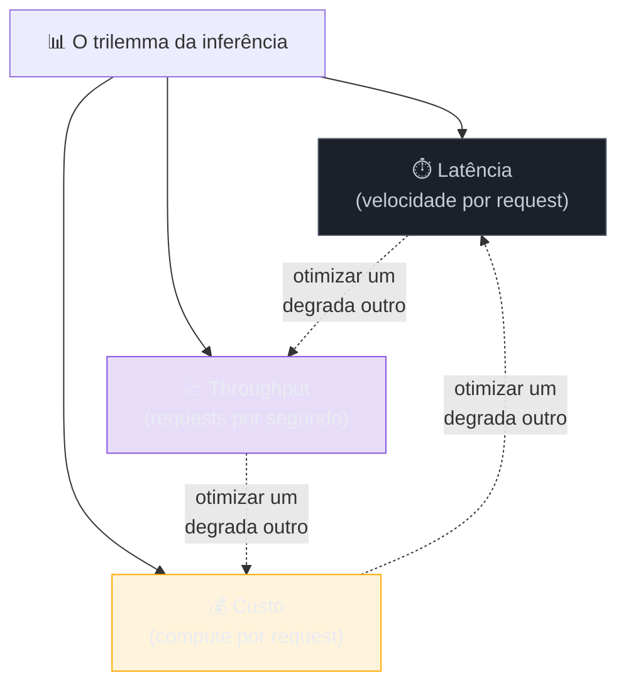
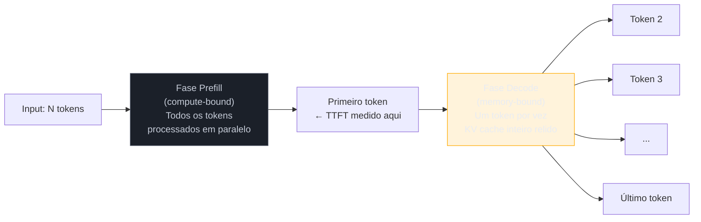
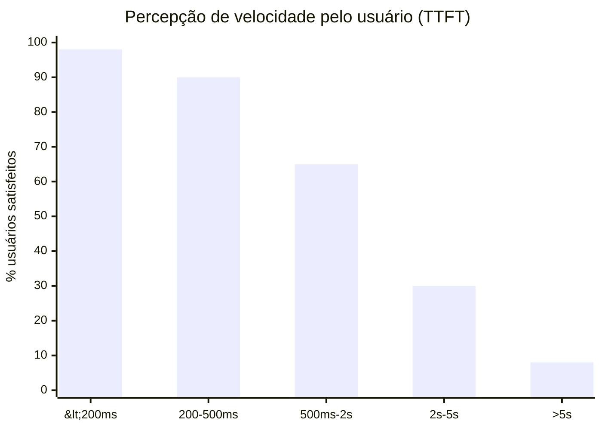
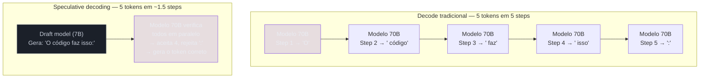
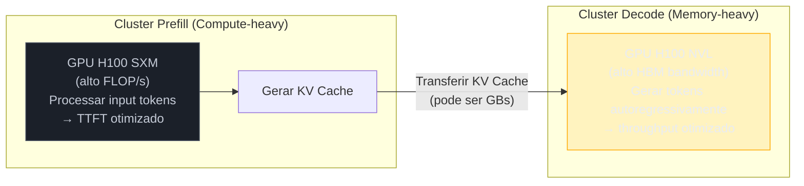

# Streaming, batching e latência

> [!abstract] TL;DR
> A experiência de velocidade de um LLM é definida por duas métricas: TTFT (tempo até o primeiro token aparecer) e TPOT (tempo entre tokens seguintes). TTFT depende do tamanho do input (fase prefill); TPOT depende do hardware de inferência (fase decode). Streaming via SSE é obrigatório para UX responsiva. Batching aumenta throughput mas pode degradar TTFT individual. Em 2026, a fronteira é "inferência desagregada" — prefill e decode em hardware separado.

## O que o usuário experimenta — e por que importa

O usuário abre a caixa de chat, digita a pergunta e pressiona Enter. Agora ele está olhando para uma tela em branco. Quanto tempo vai ficar assim?

Se forem 3 segundos, a maioria dos usuários assume que algo travou. Se for 300ms, parece instantâneo. Essa percepção não depende da qualidade da resposta — depende de quanto tempo a caixa fica vazia. E o tempo que a caixa fica vazia é o **TTFT**: Time To First Token, o tempo até o primeiro caractere aparecer.

Mas tem um segundo fenômeno: depois que os tokens começam a aparecer, com que velocidade eles chegam? Um modelo que gera 5 tokens por segundo parece lento mesmo que o TTFT seja baixo — o usuário vê a resposta "gotejando". Um modelo que gera 60 tokens por segundo parece rápido mesmo que tenha demorado 800ms para começar.

TTFT e velocidade de geração são dois gargalos separados, com causas físicas separadas, e otimizados por meios diferentes. Confundir os dois é construir o produto errado.

## Latência em LLMs não é um número único

É um sistema de trade-offs entre três dimensões:



Otimizar uma frequentemente degrada outra. O trabalho do engenheiro é encontrar o equilíbrio certo para cada caso de uso.

## As duas fases da inferência



| Fase | O que faz | Bottleneck | Métrica |
| ----------- | --------------------------------------------- | ----------------------- | ---------- |
| **Prefill** | Processa todos os input tokens, cria [[Dicionário de IA#KV cache\|KV cache]] | **Compute** (FLOPs) | TTFT |
| **Decode** | Gera tokens autoregressivamente, um por vez | **Memória** (bandwidth) | TPOT / ITL |

Ver os detalhes físicos em [[04a - KV cache, prefill e decode — a física da inferência]].

## Métricas de performance

| Métrica | O que mede | Bom | Aceitável | Ruim |
| --------------- | ------------------------------- | ----------------- | --------- | ------- |
| **TTFT** | Tempo até o primeiro token | <500ms | 500ms–2s | >2s |
| **TPOT / ITL** | Tempo entre tokens consecutivos | <30ms | 30–80ms | >100ms |
| **TPS** | Tokens por segundo (output) | >50 tps | 20–50 tps | <20 tps |
| **E2E latency** | Tempo total da chamada | Depende do output | — | — |



> [!warning] P99 importa mais que a média
> Se o TTFT médio é 300ms mas P99 é 5s, 1 em cada 100 requests parece que "travou". Usuários que experimentam P99 ruim formam opiniões negativas sobre o produto inteiro. Monitore P50, P95, P99 — não só média.

## Streaming via SSE

**Server-Sent Events (SSE)** é o protocolo padrão para streaming de LLMs. Em vez de esperar a resposta completa, o servidor envia tokens incrementalmente:

```
# Request com streaming
POST /v1/chat/completions
{"model": "claude-sonnet-4.6", "stream": true, "messages": [...]}

# Response (SSE)
data: {"type":"content_block_delta","delta":{"text":"Aqui"}}
data: {"type":"content_block_delta","delta":{"text":" está"}}
data: {"type":"content_block_delta","delta":{"text":" o"}}
data: {"type":"content_block_delta","delta":{"text":" código"}}
data: {"type":"message_stop"}
```

**Por que streaming é obrigatório:**

- **Percepção de velocidade** — o usuário vê progresso imediatamente, mesmo que o tempo total seja igual
- **Early termination** — se a resposta já está errada, o usuário pode cancelar sem esperar o output completo
- **Progress feedback** — em agentes, mostra o "pensamento" do modelo em tempo real

> [!question]- Streaming deixa a resposta mais rápida?
> Não — o tempo total da chamada é o mesmo. Streaming melhora a **percepção** de velocidade, não a velocidade real. O modelo ainda gera todos os tokens na mesma sequência; a diferença é que você os recebe conforme são gerados em vez de aguardar o fim. Para o usuário, isso faz toda a diferença — a caixa em branco dura apenas até o primeiro token, não até a resposta completa. Para pipelines de backend que processam a resposta em batch (classificação, extração), streaming não ajuda: você precisa do output completo antes de começar.

## Batching e seus trade-offs

| Tipo de batching | Como funciona | Impacto |
| ----------------------- | -------------------------------------------------- | --------------------------------------------- |
| **Static batching** | Agrupa N requests, processa juntas, retorna juntas | Throughput alto, latência individual alta |
| **Continuous batching** | Insere/remove requests do batch a cada iteração | Throughput alto, latência individual moderada |
| **Dynamic batching** | Ajusta batch size baseado em load e SLOs | Melhor equilíbrio |

**Continuous batching** é o estado da arte em 2026 (usado por vLLM, TGI, TensorRT-LLM):

- Quando um request no batch termina, seu slot é imediatamente preenchido por um novo request
- Isso mantém a GPU ocupada sem fazer novos requests esperarem pelo batch inteiro

## Speculative decoding — gerar mais rápido sem mudar o modelo

Speculative decoding é uma das otimizações mais engenhosas de 2024-2026. A ideia: o decode é lento porque gera **um token por vez** com o modelo principal (grande, caro). E se um modelo menor (draft model) gerasse 5 tokens de uma vez como "especulação", e o modelo principal verificasse todos os 5 em paralelo?



Se o draft model especula bem (taxa de aceitação alta), o throughput pode dobrar ou triplicar sem mudar a distribuição de probabilidade do modelo principal — a verificação garante que o resultado seja matematicamente idêntico ao que o modelo principal geraria.

## Otimizações de latência (2026)

| Otimização | O que faz | Ganho |
| --------------------------- | --------------------------------------------------------------------- | ---------------------------------------------- |
| **Prefix caching** | Reutiliza KV cache de prefixos comuns | TTFT -50-85% |
| **FlashAttention 3** | Computação de atenção I/O-aware | 2-4x mais rápido |
| **Speculative decoding** | Draft model propõe, principal verifica em batch | Throughput 2-3x |
| **Quantização (INT8/INT4)** | Reduz tamanho dos pesos | TPOT -30-50%, mais batches |
| **Inferência desagregada** | Prefill e decode em GPUs separadas | TTFT e throughput otimizados independentemente |

## Inferência desagregada: a fronteira

Em 2026, a técnica mais avançada é **separar prefill e decode em hardware diferente**:



Benefício: cada cluster é otimizado para seu bottleneck específico. Custo: a transferência do KV cache entre GPUs adiciona latência e usa largura de banda de rede.

## Quando usar / quando não usar

| Cenário | Streaming? | Batching? | Modelo rápido? |
| -------------------------- | ---------- | ------------------------ | ------------------- |
| Chat interativo | ✅ Sempre | ❌ Latência individual | ✅ Flash/Nano |
| Agente de coding | ✅ Sempre | ❌ Sequencial | ⚠️ Depende da tarefa |
| Geração de testes em massa | ❌ Opcional | ✅ Batch API | ✅ Budget |
| Pipeline de dados | ❌ Não | ✅ Batch API + concurrent | ✅ Budget |

## Armadilhas

> [!warning] "Streaming é mais rápido"
> Não. O tempo total é o mesmo. Streaming melhora a **percepção** de velocidade, não a velocidade real.

> [!warning] Otimizar só TTFT
> Em agentes, TPOT importa mais porque a resposta precisa estar completa antes de prosseguir para o próximo step.

> [!warning] Ignorar P99 latency
> Média de TTFT pode ser 300ms, mas P99 pode ser 5s. O tail latency é o que o usuário percebe como "travou".

> [!warning] "GPU mais cara = mais rápida"
> Nem sempre. Para decode, bandwidth de memória importa mais que compute. Uma A100 pode perder para hardware com HBM3.

> [!warning] Não configurar timeouts
> Sem timeout, uma chamada que trava pode bloquear um pipeline inteiro. Configure 30-60s para interativo, 5-10min para batch.

## Como explicar em inglês

LLM performance involves two independent metrics: **TTFT** (time-to-first-token) measures how long before the first character appears — driven by the prefill phase (processing the input prompt), which is compute-bound. **TPOT** (time per output token) measures how fast tokens stream after the first — driven by the decode phase, which is memory-bandwidth-bound. Streaming via SSE makes the blank-box wait feel shorter (the user sees progress immediately) without changing the total time. Batching improves GPU utilization (and therefore throughput) by processing multiple requests together, but can increase individual TTFT. The frontier optimization in 2026 is prefill-decode disaggregation — splitting the two phases onto separate hardware, each optimized for its bottleneck.

| PT | EN |
|----|---|
| Tempo até o primeiro token | Time To First Token (TTFT) |
| Tempo entre tokens | Time Per Output Token (TPOT) |
| Tokens por segundo | Tokens per second (TPS) |
| Latência de ponta a ponta | End-to-end latency |
| Latência de cauda | Tail latency (P99) |
| Eventos enviados pelo servidor | Server-Sent Events (SSE) |
| Cancelamento antecipado | Early termination |
| Agrupamento de requisições | Batching / request batching |
| Agrupamento contínuo | Continuous batching |
| Decodificação especulativa | Speculative decoding |
| Inferência desagregada | Prefill-decode disaggregation |

## Ver mais

- **[Andrej Karpathy — LLM Serving (parte do AI Talk 2024)](https://www.youtube.com/watch?v=zjkBMFhNj_g)** — Karpathy explica as fases de inferência e por que batching é a alavanca principal de throughput. Recomendado especialmente a partir do minuto 45.
- **[Databricks — Continuous Batching Explained (2023)](https://www.databricks.com/blog/llm-inference-performance-engineering-best-practices)** — artigo técnico com medições reais de latência com e sem continuous batching. Inclui gráficos de GPU utilization.
- **[vLLM Blog — PagedAttention and Speculative Decoding](https://vllm.ai)** — o paper do PagedAttention (a base do vLLM) e adições sobre speculative decoding, escritos pela equipe que construiu o serving framework dominante em 2024-2026.

## O que vem a seguir

Tudo até aqui assumiu que o modelo gera tokens de forma direta: prefill, decode, um token de cada vez (ou especulado em lote, no caso do speculative decoding), sem pausa para "pensar" antes de responder. Mas há uma classe de modelos que quebra essa premissa — os **reasoning models**, que geram uma cadeia de raciocínio (chain-of-thought) antes da resposta final. Isso muda drasticamente o perfil de latência: o TTFT deixa de ser "tempo até o primeiro token útil" e passa a incluir um bloco inteiro de tokens de raciocínio que o usuário nem sempre vê. Ver [[15 - Reasoning models e chain-of-thought]] para como isso reconfigura os trade-offs de streaming, batching e percepção de velocidade discutidos nesta nota.

## Veja também

- [[04a - KV cache, prefill e decode — a física da inferência]] — os dois gargalos físicos que definem TTFT e TPOT
- [[11 - APIs de LLM — anatomia de uma chamada]] — a estrutura que é streamada
- [[13 - Prompt caching e otimizações de API]] — caching para reduzir TTFT em chamadas repetidas
- [[06 - A janela de contexto]] — contexto grande = prefill mais lento = TTFT maior

## Referências

- **Kwon et al.** — *Efficient Memory Management for Large Language Model Serving with PagedAttention* (vLLM, 2023). O paper que revolucionou batching e serving de LLMs.
- **BentoML** — *The LLM Inference Trilemma* (2025). Framework para pensar em latência vs throughput vs custo.
- **NVIDIA** — *TensorRT-LLM Best Practices* (2026). Guia de otimização de inferência para H100.
- **Databricks** — *Continuous Batching Explained* (2025). Explicação acessível do conceito com benchmarks.
