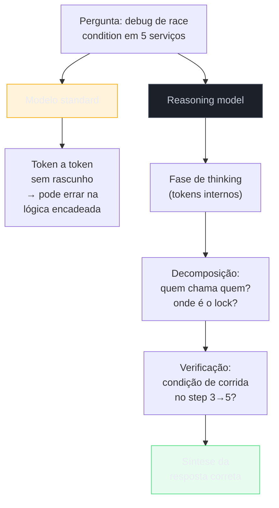
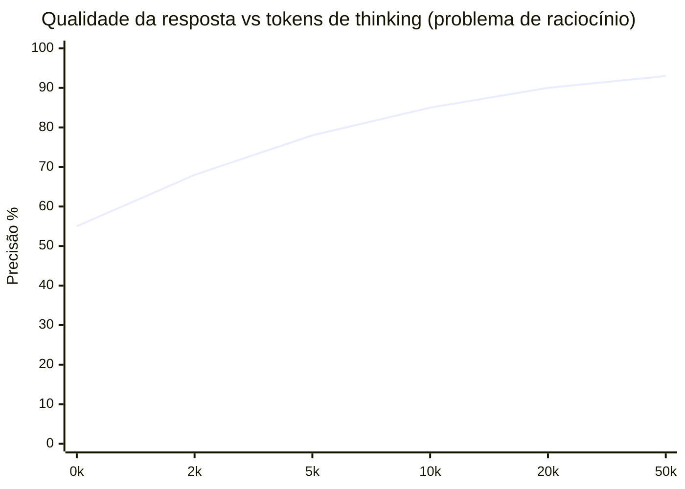
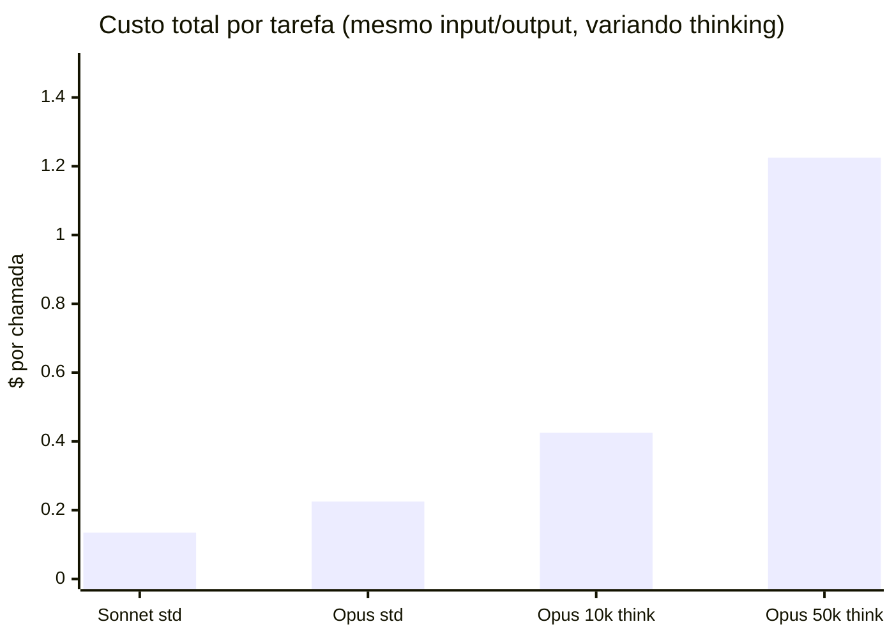

# Reasoning models e chain-of-thought

> [!abstract] TL;DR
> Reasoning models (OpenAI o-series, Claude Thinking, Gemini Deep Think) são LLMs treinados para "pensar antes de responder", gerando tokens internos de raciocínio antes do output visível. Isso melhora dramaticamente performance em matemática, lógica e problemas complexos — mas custa 2-10x mais porque os tokens de pensamento são cobrados como output. Em 2026, saber quando ativar reasoning e quando usar um modelo standard é uma competência essencial para controlar custos.

## O problema que reasoning resolve — e o que não resolve

Peça a um modelo standard para resolver uma equação de segundo grau. Ele provavelmente acerta. Peça para ele debugar uma race condition num sistema distribuído com 5 microserviços interdependentes, onde o bug só aparece sob carga específica com o timeout do Redis configurado acima de 30ms. Ele provavelmente **erra** — não por falta de conhecimento, mas porque a resposta exige uma cadeia de inferência que o decode token-a-token não consegue sustentar.

O decode autoregressivo tem um problema estrutural para raciocínio profundo: cada token é gerado olhando para o passado, mas a "resposta" a uma pergunta complexa requer saltos de lógica que aparecem mais tarde. É como tentar escrever a conclusão de um argumento antes de ter desenvolvido as premissas. Modelos standard frequentemente "chegam à resposta" em vez de "raciocinar até a resposta".

Reasoning models resolvem isso com uma fase de "rascunho" antes do output: geram tokens de pensamento que decompõem o problema, exploram abordagens, verificam inconsistências — e só então produzem a resposta. O rascunho é pago (tokens de output) mas não visível ao usuário ou, em alguns providers, é visível como "thinking".



## O que é

**Reasoning models** são LLMs que, antes de gerar a resposta final, produzem uma cadeia de "pensamento" (chain-of-thought) composta por tokens internos que decompõem o problema em passos. Esses tokens podem ser:

- **Visíveis** — exibidos ao usuário (Claude Thinking com `thinking` habilitado)
- **Ocultos** — processados internamente mas não incluídos no response (OpenAI o-series)

O conceito evolui do **chain-of-thought prompting** (2022), que descobriu que pedir ao modelo "pense passo a passo" melhorava resultados. Reasoning models incorporam isso no treinamento via reinforcement learning — não é mais uma técnica de prompt, é uma capacidade estrutural do modelo.

## Por que importa

| Sem reasoning | Com reasoning |
| ------------------------------------- | ------------------------------------------------------ |
| Responde rápido, pode errar em lógica | Pensa antes, muito mais preciso em problemas complexos |
| Custo previsível | Custo variável (depende da complexidade) |
| Bom para tarefas diretas | Essencial para problemas multi-step |

Para engenheiros de software, reasoning models são particularmente úteis em:

- Debugging de problemas complexos com múltiplas dependências
- Arquitetura de sistemas (trade-offs, decisões de design)
- Refactoring que exige entender o impacto em cascata
- Problemas algorítmicos e otimização

## Test-time compute scaling — a nova fronteira

Até 2024, "mais compute" significava "mais parâmetros" (treinar um modelo maior). A descoberta de 2024-2025 foi que você pode obter resultados melhores **gastando mais compute na inferência** — deixando o modelo "pensar mais tempo" em vez de apenas ser maior.



A curva tem retornos decrescentes: ir de 0 para 5k tokens de thinking dá um salto enorme; ir de 20k para 50k é ganho marginal. O `budget_tokens` do Claude Thinking existe exatamente para sintonizar nesse ponto.

## Implementação por provider

### OpenAI — série o

| Modelo | Thinking | Custo relativo | Uso |
| ------- | ---------------- | ---------------- | -------------------- |
| o4-mini | Oculto (interno) | 2-5x vs GPT-4.1 | Raciocínio acessível |
| o4 | Oculto (interno) | 5-10x vs GPT-4.1 | Máxima performance |

```json
// Os tokens de thinking são cobrados mas não visíveis
{
  "usage": {
    "input_tokens": 1500,
    "output_tokens": 800,
    "reasoning_tokens": 12000
  }
}
```

Os `reasoning_tokens` aparecem no usage mas não no content — são cobrados ao preço de output (o mais caro) sem que o usuário veja.

### Anthropic — Claude Thinking

| Modo | Thinking | Controle |
| ----------------- | -------------------------- | ------------------------ |
| Standard | Desabilitado | Normal |
| Extended thinking | Visível (bloco `thinking`) | `thinking.budget_tokens` |

```json
// Ativar extended thinking no Claude
{
  "model": "claude-opus-4.6",
  "thinking": {
    "type": "enabled",
    "budget_tokens": 10000
  }
}
```

O thinking budget permite controlar custos: limitar a 5k tokens para tarefas moderadas, expandir para 50k+ para problemas profundos.

### Google — Gemini Thinking

Gemini 3.x oferece modo de "deep thinking" com funcionalidade similar, onde o modelo produz passos de raciocínio antes da resposta final.

## O custo real do reasoning

Exemplo: pedir para refatorar um módulo de autenticação.

| Modelo | Input | Thinking | Output visível | Custo total |
| ---------------------------------- | ---------- | ---------- | -------------- | ----------- |
| Claude Sonnet (standard) | 20k tokens | 0 | 5k tokens | $0.135 |
| Claude Opus (standard) | 20k tokens | 0 | 5k tokens | $0.225 |
| Claude Opus (thinking, 10k budget) | 20k tokens | 8k tokens | 5k tokens | $0.425 |
| Claude Opus (thinking, 50k budget) | 20k tokens | 40k tokens | 5k tokens | $1.225 |



**O reasoning pode custar 5-10x mais** que uma chamada standard para a mesma tarefa. Para tarefas que exigem raciocínio profundo, o custo extra é justificado pelo ganho de qualidade. Para tarefas diretas, é desperdício puro.

## Chain-of-thought prompting vs reasoning models

| Aspecto | CoT Prompting | Reasoning Models |
| ----------------- | ------------------------------------- | ------------------------------------------- |
| **Como funciona** | "Pense passo a passo" no prompt | Treinamento dedicado (RL) |
| **Qualidade** | Melhora modesta | Melhora dramática |
| **Custo** | Gera mais output tokens visíveis | Gera tokens de pensamento (visíveis ou não) |
| **Controle** | Depende do modelo seguir a instrução | Built-in, consistente |
| **Melhor para** | Modelos standard em tarefas moderadas | Problemas realmente complexos |

> [!warning] CoT prompting está obsolescendo
> Em 2026, para modelos avançados (Claude 4.x, GPT-5.x), prompts do tipo "pense passo a passo" podem até *degradar* performance. Esses modelos já raciocinam internamente. Forçar CoT adiciona verbosidade sem benefício. Use reasoning models nativos quando precisar de raciocínio profundo.

## Quando usar / quando não usar

| Tarefa | Standard | Reasoning |
| --------------------------- | ---------------------- | ------------------------ |
| Autocomplete de código | ✅ | ❌ Desperdício |
| Fix de bug simples | ✅ | ❌ Overhead desnecessário |
| Refactoring complexo | ⚠️ Pode errar | ✅ |
| Debugging de race condition | ❌ Frequentemente falha | ✅ |
| Decisão de arquitetura | ⚠️ Superficial | ✅ |
| Geração de testes unitários | ✅ | ❌ |
| Problema algorítmico | ❌ | ✅ Essencial |
| Chat casual | ✅ | ❌ Desperdício extremo |

## Armadilhas

> [!warning] "Sempre usar reasoning"
> Para tarefas simples, reasoning é desperdício. Autocomplete com o4 em vez de GPT-4.1 Nano é pagar 40x mais pelo mesmo resultado.

> [!warning] Não limitar o thinking budget
> Sem limite, o modelo pode "pensar" por 100k+ tokens em problemas difíceis. Use `budget_tokens` para controlar.

> [!warning] "Reasoning tokens são baratos"
> Não são. São cobrados como output tokens (a tier mais cara). 50k tokens de pensamento no Claude Opus = $1.25 só em thinking.

> [!warning] Confundir CoT com reasoning nativo
> Adicionar "pense passo a passo" em um modelo que já faz reasoning internamente gera overhead sem benefício.

> [!warning] Ignorar reasoning tokens no monitoramento
> Se você monitora só `output_tokens`, os `reasoning_tokens` ocultos (OpenAI) ficam invisíveis na análise de custos.

## O que vem a seguir

Reasoning ataca um dos três eixos de adaptação de um LLM a uma tarefa — o de "pensar mais" na própria inferência. Os outros dois eixos são treinar o modelo (fine-tuning) e dar a ele acesso a conhecimento externo (RAG). A próxima nota, [[16 - Fine-tuning vs prompting vs RAG]], compara esses três caminhos e ajuda a decidir quando vale a pena treinar um modelo, quando basta um prompt bem escrito e quando o problema é, na verdade, falta de contexto — não falta de raciocínio.

## Como explicar em inglês

Reasoning models (OpenAI o-series, Claude Extended Thinking, Gemini Deep Think) generate a hidden "scratchpad" of reasoning tokens before producing the final visible response. These thinking tokens are generated autoregressively just like regular tokens, but are charged as output (the most expensive tier) even when invisible to the user. The key insight is **test-time compute scaling**: you can improve answer quality by spending more compute at inference time (more thinking tokens) rather than only at training time (larger models). This makes reasoning models excellent for multi-step logical problems but wasteful for simple tasks — using o4 for code autocomplete is like hiring a PhD to fill in a form.

| PT | EN |
|----|---|
| Modelo de raciocínio | Reasoning model |
| Cadeia de pensamento | Chain-of-thought (CoT) |
| Pensamento estendido | Extended thinking |
| Tokens de raciocínio | Reasoning tokens |
| Orçamento de tokens de pensamento | Thinking token budget |
| Compute em tempo de inferência | Test-time compute |
| Raciocínio oculto | Hidden reasoning |
| Decomposição do problema | Problem decomposition |
| Passo a passo | Step by step |

## Ver mais

- **[OpenAI — Learning to Reason with LLMs (2024)](https://openai.com/index/learning-to-reason-with-llms/)** — blog post original que introduziu o1, explicando como o RL sobre raciocínio melhora drasticamente a performance em matemática e coding.
- **[Snell et al. — Scaling LLM Test-Time Compute (2024)](https://arxiv.org/abs/2408.03314)** — o paper que formalizou "mais compute na inferência = melhor resultado", mostrando que um modelo menor com mais thinking pode superar um modelo maior sem thinking em problemas difíceis.
- **[3Blue1Brown — Solving Hard Problems with AI Reasoning](https://www.youtube.com/@3blue1brown)** — Grant Sanderson (3Blue1Brown) explorou modelos de reasoning aplicados a problemas matemáticos de olimpíada. Demonstração visual do tipo de raciocínio multi-step que esses modelos executam.

## Veja também

- [[12 - Pricing de APIs — como calcular custos]] — impacto dos reasoning tokens na conta
- [[07 - Panorama de modelos 2026]] — quais modelos oferecem reasoning
- [[01 - O que é um LLM]] — contexto geral da arquitetura

## Referências

- **Wei et al.** — *Chain-of-Thought Prompting Elicits Reasoning in Large Language Models* (Google, 2022). Paper fundador de CoT.
- **OpenAI** — *Learning to Reason with LLMs* (2024). Blog post introduzindo o1.
- **Anthropic** — *Extended Thinking Documentation* (2026). Guia oficial do Claude Thinking.
- **Snell et al.** — *Scaling LLM Test-Time Compute* (2024). Fundamentação teórica de "mais compute na inferência".
