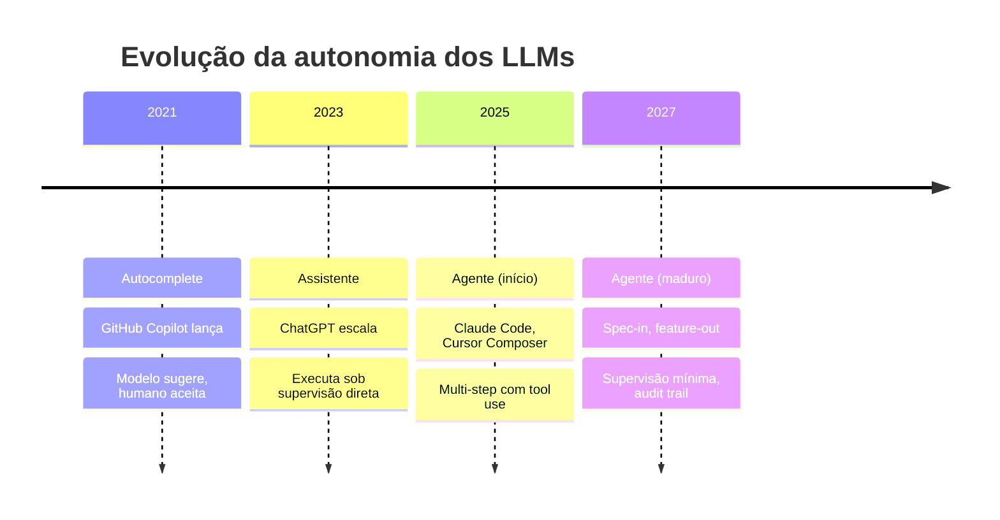
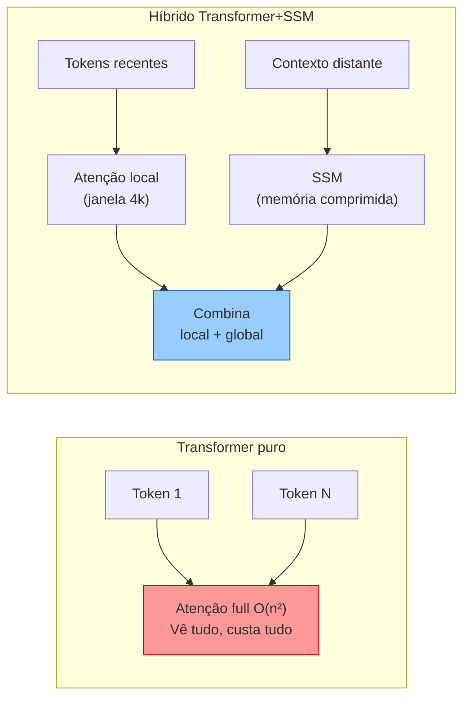
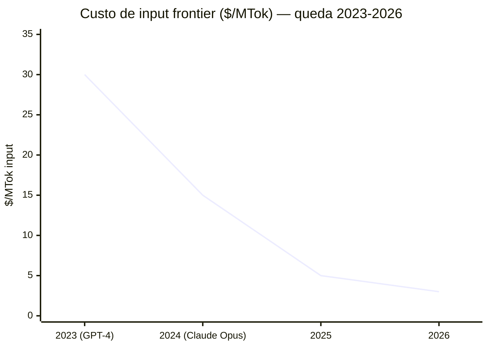
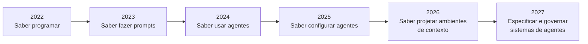

# O futuro dos LLMs — tendências 2026-2027

> [!abstract] TL;DR
> O campo está convergindo em cinco direções: (1) agentes verdadeiramente autônomos que executam tarefas de ponta a ponta, (2) contexto "infinito" via arquiteturas híbridas Transformer+SSM, (3) modelos multimodais nativos que operam igualmente em texto, imagem, áudio e vídeo, (4) commoditização via modelos open-weight chineses que forçam preços para baixo, e (5) a emergência de "context engineering" como disciplina central da engenharia de software. O engenheiro de 2027 provavelmente não escreve código — ele escreve especificações e governa agentes.

## Por que *agora*?

Em 2023, os LLMs eram ferramentas de sugestão: o humano dirigia, o modelo completava. Hoje, em 2026, o padrão está migrando para supervisão: o modelo planeja e executa, o humano revisa o resultado. Essa mudança não é acidental — ela reflete a convergência de quatro fatores que estavam faltando antes:

**Confiabilidade de ferramenta:** Tool use (function calling) ficou robusto o suficiente para agentes multi-step terminarem sem loops infinitos ou alucinações de nome de função. Em 2023, um agente de 10 steps explodia em 30% das tentativas; em 2026, a taxa de falha caiu a ponto de agentes de 50+ steps serem praticáveis.

**Contexto suficiente:** Com 200k–1M de tokens de janela, o agente pode "ver" um repositório inteiro sem precisar de um RAG elaborado para cada consulta. O limite ainda existe, mas deixou de ser o gargalo primário.

**Custo tolerável:** O preço por tarefa caiu 10-50× em 3 anos. O que custava $5 agora custa $0.20. Isso move a equação de "laboratório" para "produto viável".

**Hardware de inferência:** GPUs especializadas e frameworks de serving (vLLM, TensorRT-LLM) reduziram a latência o suficiente para experiências interativas em tempo real com modelos grandes.

O resultado é que as tendências de 2026-2027 não são ficção científica — são extrapolações de trajetórias em curso e aceleradas.

## Tendência 1 — Agentes autônomos como padrão

O ciclo **sugestão → assistência → autonomia** está se completando:

| Era | Período | Interação |
| ------------------ | ------------- | --------------------------------------------------------------------- |
| Autocomplete | 2021-2023 | Modelo sugere, humano aceita/rejeita |
| Assistente | 2023-2025 | Modelo executa tarefas sob supervisão direta |
| **Agente** | **2025-2027** | **Modelo planeja e executa tarefas multi-step com supervisão mínima** |
| Co-piloto autônomo | 2027+ | Modelo recebe spec, entrega feature testada |

**Sinais concretos (2026):**

- Devin opera em sandbox isolada sem intervenção humana
- Claude Code e Cursor executam sessões de 50+ steps com [[Dicionário de IA#tool use|tool use]]
- GitHub Copilot Agents resolvem issues diretamente
- O conceito de "comprehension gate" — se o humano não entende a mudança, não faz merge

> [!question]- O que torna um agente realmente autônomo — e o que ainda falta?
> O bottleneck não é mais inteligência, é **confiança operacional**. Um agente tecnicamente capaz de refatorar 50 arquivos ainda exige supervisão humana porque: (1) erros são difíceis de detectar sem executar todos os testes, (2) o modelo não sabe o que não sabe sobre a base de código, (3) side-effects são difíceis de rastrear. As ferramentas que estão sendo construídas (sandboxes, audit trails, rollback automático, test harnesses) são a infraestrutura de confiança que transforma agentes "capazes" em agentes "implantáveis". O problema é menos o modelo e mais o **ambiente ao redor dele**.

## Tendência 2 — Contexto infinito

A corrida por contexto cada vez maior continua, mas com mudança de abordagem:

| Abordagem | Contexto | Trade-off |
| --------------------------- | ---------- | --------------------------------- |
| Brute-force (mais tokens) | 1M–2M | Caro, atenção degradada no meio |
| **Híbrido Transformer+SSM** | 10M+ | Melhor retenção, menor custo O(n) |
| **Memória persistente** | "Infinito" | Requer infra de memory management |

State Space Models (SSMs) como Mamba estão sendo integrados em arquiteturas Transformer para processar contextos ultra-longos com complexidade linear O(n) em vez de quadrática O(n²). A [[04 - Atenção e o mecanismo transformer|atenção tradicional]] compara cada token com todos os outros (O(n²)). O SSM processa a sequência como um filtro com "memória comprimida" — perde alguns detalhes, mas escala linearmente.

**Implicação:** A distinção entre "janela de contexto" e "memória" vai se borrar. LLMs de 2027 provavelmente terão memória nativa persistente — sem RAG explícito para conversas longas.

## Tendência 3 — Multimodal nativo

Modelos que processam texto, imagem, áudio e vídeo com a mesma facilidade:

| Capacidade | 2024 | 2026 | 2027 (projetado) |
| ------------------------- | ------------------- | --------------------- | ---------------- |
| Texto → texto | ✅ Excelente | ✅ Excelente | ✅ Excelente |
| Imagem → texto | ✅ Bom | ✅ Excelente | ✅ Excelente |
| Texto → imagem | ✅ Separado (DALL-E) | ⚠️ Integrado em alguns | ✅ Nativo |
| Áudio → texto | ⚠️ Whisper separado | ✅ Nativo (Gemini) | ✅ Universal |
| Vídeo → texto | ❌ Experimental | ⚠️ Gemini, Qwen | ✅ Standard |
| Texto → código → execução | ❌ | ⚠️ Agentes de coding | ✅ End-to-end |

**Implicação para engenheiros:** Debugging visual (screenshot → diagnóstico → fix), geração de UI a partir de wireframes, e análise de logs de vídeo se tornam workflows padrão.

## Tendência 4 — Commoditização via open-weight

A trajetória de preço está em queda livre. O evento mais significativo foi o DeepSeek V2 (2024), que demonstrou que frontier capabilities eram alcançáveis com orçamentos de treinamento 10× menores — e publicou as técnicas. Toda a indústria adotou MoE esparso, MLA, treinamento com FP8. O efeito cascata nas margens dos providers fechados foi imediato.

| Ano | Custo frontier (input/MTok) | Melhor open-weight |
| ---- | ------------------------------------- | --------------------- |
| 2023 | $30.00 (GPT-4) | Llama 2 70B |
| 2024 | $10.00 (Claude 3 Opus) | Llama 3 70B |
| 2025 | $5.00 | DeepSeek V3 |
| 2026 | $2.00–5.00 | DeepSeek V4, Qwen 3.6 |
| 2027 | $0.50–2.00 (projetado) | ? |

**Drivers da commoditização:**

- DeepSeek publica técnicas de treinamento eficiente que toda a indústria adota
- Alibaba/Qwen distribui modelos de 1M de contexto sob Apache 2.0
- Meta continua investindo em Llama como "infraestrutura aberta"
- Provedores de hosting (Together, Fireworks, Groq) competem por menor preço

## Tendência 5 — Context engineering como disciplina

A habilidade mais valiosa está se deslocando de "escrever código" para "projetar ambientes de informação para agentes":

**O que isso significa na prática:**

- `agents.md`, `.cursorrules`, `CLAUDE.md` se tornam artefatos de engenharia tão importantes quanto código
- Spec-Driven Development substitui vibe coding em ambientes profissionais
- O engenheiro se torna "arquiteto de informação para agentes"

> [!question]- Skills fundamentais ficam obsoletas?
> Não — elas ficam *necessárias em nível mais profundo*. Um engenheiro que não entende arquitetura de software não consegue especificar sistemas para agentes. "Garbage in, garbage out" vale para specs também: se a especificação está errada, o agente entrega código tecnicamente correto e funcionalmente errado. O que muda é o *onde* a habilidade é aplicada: menos em escrever código linha a linha, mais em definir invariantes, contratos de interface, e critérios de aceitação que o agente vai respeitar (ou não). Entender TypeScript continua valendo; escrever funções de utilidade manualmente, cada vez menos.

## Debates e controvérsias

| Debate | Lado A | Lado B |
| ---------------------------------- | ---------------------------------------------- | ----------------------------------------------------- |
| **"IA substitui devs"** | Sim, para tarefas repetitivas de implementação | Não, aumenta demanda por arquitetos e revisores |
| **"Scaling laws acabaram"** | Sim, retornos decrescentes em pré-treino bruto | Não, test-time compute (reasoning) é a nova fronteira |
| **"Open-weight alcançou closed"** | Sim, em coding e reasoning específico | Não, em capability geral e safety |
| **"Context infinito elimina [[Dicionário de IA#RAG (Retrieval-Augmented Generation)\|RAG]]"** | Sim, para bases pequenas-médias | Não, para bilhões de documentos e custo |

## Armadilhas

- **"O modelo de 2027 resolve tudo"** — modelos melhores não eliminam a necessidade de engenharia. Apenas deslocam o trabalho de "escrever código" para "especificar e validar".
- **Apostar tudo em um provider** — o mercado está volátil. Abstração de providers é essencial.
- **Ignorar skills fundamentais** — se você não entende arquitetura de software, um agente melhor não resolve.
- **"Open-weight = commodity sem diferenciação"** — o modelo é commodity, mas o sistema (contexto, tools, guardrails) ao redor dele é o diferencial competitivo.

## Como explicar em inglês

The LLM landscape is converging on five trends: truly autonomous agents (multi-step execution with minimal human oversight), near-infinite context via Transformer+SSM hybrid architectures, native multimodal models processing text/image/audio/video equally, commoditization driven by open-weight Chinese models, and "context engineering" emerging as a core software engineering discipline. The key inflection point is that the bottleneck shifted from model intelligence (which is now good enough for most tasks) to operational trust infrastructure — sandboxes, audit trails, rollback, and test harnesses that make capable agents deployable in production.

| PT | EN |
|----|---|
| Agente autônomo | Autonomous agent |
| Supervisão mínima | Minimal oversight |
| Contexto infinito | Infinite context |
| Modelo híbrido | Hybrid model |
| Modelo de estado de espaço | State Space Model (SSM) |
| Memória persistente | Persistent memory |
| Commoditização | Commoditization |
| Peso aberto | Open-weight |
| Engenharia de contexto | Context engineering |
| Compute em tempo de teste | Test-time compute |
| Leis de escalonamento | Scaling laws |

## Ver mais

- **[Andrej Karpathy — Software 3.0 (2025)](https://www.youtube.com/watch?v=LCEmiRjPEtQ)** — Karpathy cunhou o termo "Software 3.0" para descrever LLMs como um novo tipo de computador programável por linguagem natural. Uma das formulações mais influentes sobre para onde o campo vai.
- **[Dwarkesh Patel — Entrevistas sobre Scaling (2024-2025)](https://www.youtube.com/c/DwarkeshPatel)** — série de entrevistas longas com pesquisadores (Sutskever, Anthropic, DeepMind) sobre os limites das scaling laws e o que vem depois.
- **[Anthropic — Core Views on AI Safety](https://www.anthropic.com/core-views)** — posição da Anthropic sobre trajetória de capabilities e por que segurança e autonomia são inseparáveis.

## Veja também

- [[07 - Panorama de modelos 2026]] — o estado atual que dá base para essas projeções
- [[01 - O que é um LLM]] — fundamentos da arquitetura que está evoluindo
- [[08 - Modelos chineses — DeepSeek, Qwen, Kimi, GLM]] — os drivers da commoditização

## Referências

- **Anthropic** — *Core Views on AI Safety* (2026). Visão de longo prazo sobre evolução de capabilities.
- **Google DeepMind** — *Gemini 3 Technical Report* (2026). Roadmap implícito de multimodal.
- **Gu, Dao** — *Mamba: Linear-Time Sequence Modeling with Selective State Spaces* (2023). Arquitetura SSM.
- **Sutskever, Ilya** — *Talks on Scaling Laws* (2024-2025). Perspectivas sobre limites do scaling.
- **DeepSeek-AI** — *DeepSeek-V2: Technical Report* (2024). Técnicas de treinamento eficiente que redefiniram o custo de frontier.
