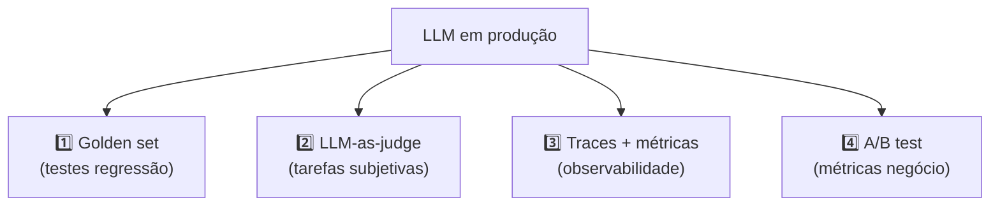
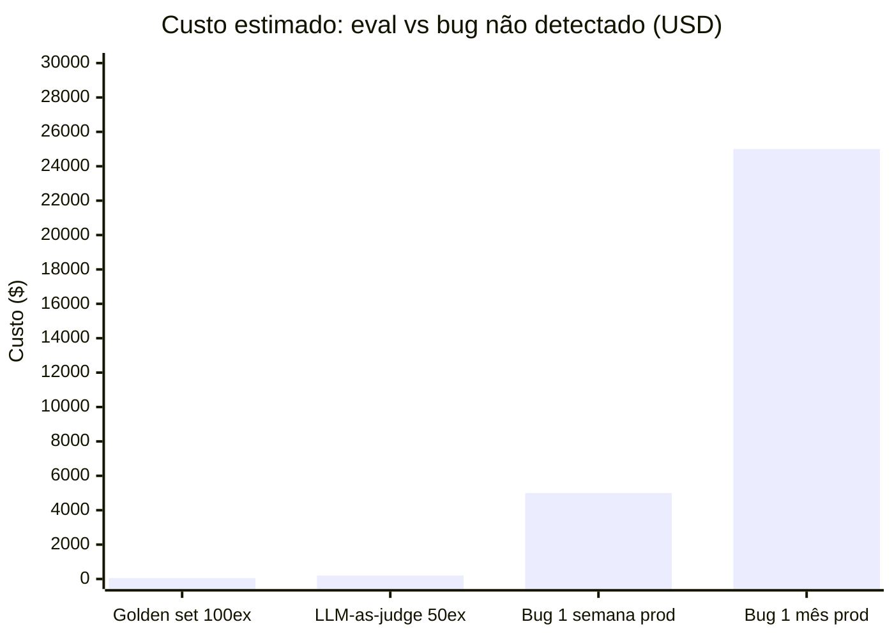

# Evaluation de LLMs em produção

Você mudou o system prompt na terça. Na quarta, o VP de produto perguntou se a qualidade estava melhor. Você respondeu "acho que sim". Na sexta, um usuário reportou que o modelo estava gerando respostas mais longas e com mais jargão técnico. Mais um. Ou não. Você não sabe — e esse é exatamente o problema.

Em software tradicional, essa cena seria impensável. Você tem testes. Uma mudança que quebra comportamento esperado falha no CI antes de chegar em produção. Em LLM, a maioria dos times opera no "olhei e achei melhor" — a versão de engenharia de superstição. Você troca prompt B por prompt C, a equipe acha que ficou melhor, e seis semanas depois você não consegue explicar por que a satisfação do usuário caiu 8%.

Evaluation não é "fase de QA". É o que separa engenharia de LLM de adivinhação sistemática.

> [!abstract] TL;DR
> LLM em produção sem evaluation é aposta. Não é tradeoff — é dívida. **Práticas mínimas:** golden set de 30-100 exemplos representativos rodado a cada mudança de prompt/modelo; **LLM-as-judge** para tarefas subjetivas (com cuidado de viés); **[[Dicionário de IA#tracing|traces]] e [[Dicionário de IA#Observability|observabilidade]]** instrumentando toda chamada (tokens, latência, custo, taxa de erro); **A/B test** em produção com métricas de negócio. Sem isso, "prompt engineering" vira superstição — mudou prompt, ninguém sabe se melhorou.

> [!info] Trilha mestre
> Esta nota é o deep-dive de evaluation **no contexto de LLMs em produção**. Pra disciplina geral de evaluation (golden datasets, rubrics, LLM-as-judge, frameworks 2026, eval em CI), veja a trilha [[Evaluation]].

## Por que eval é diferente em LLMs

Software tradicional:

```
Input X → função pura → Output Y → assert Y == esperado ✅
```

LLM:

```
Input X → função estocástica → Output Y (semanticamente similar a esperado, talvez)
→ ?? como medir ??
```

Não dá pra fazer `assertEqual`. Eval de LLM precisa de **métricas semânticas**, não exatas.

## Os 4 pilares de eval



Cada pilar resolve uma pergunta diferente. **Maturidade real é ter os 4.**

## Pilar 1 — Golden set

**O que é:** 30-100 exemplos representativos com resposta esperada (ou critério). Rodados a cada mudança de prompt ou modelo.

**Conteúdo do golden set:**

```yaml
- id: classify_001
  input: "App crashou na inicialização após update"
  expected:
    category: "bug"
    severity: "high"

- id: classify_002
  input: "Pode adicionar dark mode?"
  expected:
    category: "feature"
    severity: "low"

- id: extract_003
  input: "Reunião amanhã às 14h com Maria"
  expected:
    type: "meeting"
    when: "tomorrow 14:00"
    with: "Maria"
```

**Como avaliar:**

| Tipo de tarefa | Métrica |
|---|---|
| **Classificação** | Equality (`actual.category == expected.category`) |
| **Extração estruturada** | Equality + schema valid |
| **Geração de texto** | [[Dicionário de IA#embedding\|Embedding]] similarity (cosine) > threshold |
| **Geração de código** | Test pass + linter pass |
| **Resumo / criatividade** | LLM-as-judge (Pilar 2) |

**Quanto eval custa:**

```
100 exemplos × $0.01/exemplo (Sonnet) = $1 por rodada de eval
× 50 rodadas/mês (ajustes de prompt) = $50/mês

ROI: detectar 1 bug em prod paga o ano inteiro de evals.
```

## Pilar 2 — LLM-as-judge

**Quando usar:** tarefas subjetivas onde equality não funciona (resumos, escrita criativa, conversação).

**Como funciona:** modelo (geralmente mais forte) avalia output de outro modelo.

```python
JUDGE_PROMPT = """
Você é avaliador rigoroso. Dados:
- Pergunta: {question}
- Resposta correta: {expected}
- Resposta do modelo: {actual}

Avalie de 0-10 quão correta a resposta do modelo é. Seja estrito.

Output em JSON:
{{
  "score": <0-10>,
  "reason": "<justificativa curta>",
  "issues": ["<problema 1>", "<problema 2>"]
}}
"""

def llm_as_judge(question, expected, actual):
    response = client.messages.create(
        model="claude-opus-4",  # judge mais forte que o modelo avaliado
        max_tokens=300,
        messages=[{
            "role": "user",
            "content": JUDGE_PROMPT.format(
                question=question,
                expected=expected,
                actual=actual
            )
        }]
    )
    return parse_json(response.content[0].text)
```

> [!warning] Cuidados com LLM-as-judge
> - **Viés do judge** — se judge é Claude, ele tende a preferir respostas estilo Claude. Use judge **diferente** do avaliado quando possível.
> - **Custo** — judge é geralmente modelo grande. Eval com 100 exemplos × Opus é caro.
> - **Position bias** — em comparação A vs B, judges às vezes preferem o primeiro. **Randomize ordem.**
> - **Calibração** — score 7/10 do judge nem sempre é "bom". Calibre com gabarito humano antes.

## Pilar 3 — Traces e observabilidade

**Instrumentar toda chamada:**

| Métrica | O que mede | Por que importa |
|---|---|---|
| **Input tokens** | Tokens consumidos | Custo + atenção dilui ([[06 - A janela de contexto]]) |
| **Output tokens** | Tokens gerados | Custo principal |
| **Total cost** | $ por chamada | Direto pro budget |
| **TTFT** | Time to First Token | UX em streaming |
| **Total latency** | TTFT + decode time | UX geral |
| **Error rate** | timeout, rate limit, schema invalid | Reliability |
| **User feedback** | thumbs up/down, ratings | Sinal de qualidade real |

**Ferramentas em 2026:**

| Ferramenta | Forte em |
|---|---|
| **[[Dicionário de IA#Langfuse\|Langfuse]]** | Open source, self-hostable, rico em features |
| **LangSmith** | Integração nativa LangChain |
| **Helicone** | Proxy + analytics, bom pra times sem instrumentação |
| **[[Dicionário de IA#Arize Phoenix\|Arize Phoenix]]** | Sessions com timeline, debugging |
| **Braintrust** | Eval-first, comparação de versions |

**Pattern recomendado:**

```python
import langfuse

@langfuse.observe()
def classify_ticket(text: str):
    response = client.messages.create(
        model="claude-sonnet-4-6",
        max_tokens=200,
        messages=[{"role": "user", "content": text}]
    )
    # langfuse instrumenta automaticamente
    return response.content[0].text
```

Em 2-3 linhas de código você ganha trace completo + dashboard.

## Pilar 4 — A/B test em produção

**Por que:** golden set + traces medem o sistema. **A/B mede impacto no usuário.**

```python
# Pseudocode
def get_response(user_id, query):
    variant = ab_assign(user_id, "prompt_v2_test", split=0.5)

    if variant == "control":
        prompt = PROMPT_V1
    else:
        prompt = PROMPT_V2

    response = client.messages.create(
        system=prompt,
        messages=[{"role": "user", "content": query}]
    )

    log_event("ai_response", {
        "user_id": user_id,
        "variant": variant,
        "response": response.content[0].text,
    })

    return response.content[0].text
```

**Métricas para comparar:**

- Métricas de negócio: conversion, resolution time, NPS
- Métricas de uso: re-prompts, abandono
- Métricas de custo: tokens médios por interação

> [!tip] A/B test > golden set para impacto real
> Golden set diz "v2 é 5% mais preciso". A/B test diz "v2 reduz tickets de suporte em 18%". A segunda métrica vende para stakeholders.

## Maturidade — onde você está?

> [!example] Diagnóstico
>
> | Nível | Sinal |
> |---|---|
> | **Nível 0 — Zero eval** | "Olhei e tá bom" |
> | **Nível 1 — Golden set ad-hoc** | Lista de exemplos em planilha; rodada manual eventual |
> | **Nível 2 — Eval em CI** | Golden set roda automaticamente em PR de prompt |
> | **Nível 3 — Eval + observabilidade** | Traces de prod + LLM-as-judge para tarefas subjetivas |
> | **Nível 4 — A/B test em prod** | Variantes comparadas com métricas de negócio |
> | **Nível 5 — Eval continuous** | Golden set evolui com casos reais de prod, evaluation contínua |
>
> Maioria dos times está em Nível 0-1. Nível 2 é meta para 2026.

## O ROI de evaluation

O argumento financeiro é simples: eval é barato; bug em produção não é.



Um golden set de 100 exemplos rodando em CI custa ~$1/rodada (Sonnet × $0.01/exemplo) e ~$50/mês com 50 rodadas. Um bug de regressão de prompt que passa despercebido por uma semana — usuários recebendo respostas incorretas, suporte escalado, confiança perdida — custa ordens de magnitude mais. **O ROI de eval se paga na primeira regressão detectada antes de ir a produção.**

## Anti-patterns

> [!warning] Eval só "no final"
> Rodar eval uma vez, no lançamento, e nunca mais — depois disso, mudanças de prompt seguem sem rede de segurança.

> [!warning] Golden set de 5 exemplos
> Um punhado de casos não representa a distribuição real de input; regressões em casos fora dessa amostra passam batido.

> [!warning] Equality em tarefas abertas
> Usar `actual == expected` em geração de texto livre sempre vai falhar — a resposta certa raramente é a string idêntica. Use embedding similarity ou LLM-as-judge.

> [!warning] Judge igual ao avaliado
> Usar o mesmo modelo (ou família) como judge do modelo avaliado introduz viés de auto-aprovação — o judge tende a preferir respostas no seu próprio estilo.

> [!warning] Métricas de modelo, não de negócio
> "Accuracy 92%" não diz nada sobre resolution rate, churn ou satisfação — métricas de modelo e métricas de negócio medem coisas diferentes.

> [!warning] Mudar prompt sem rodar eval
> Shippar uma mudança de prompt sem rodar o golden set é operar às cegas — não há como saber se piorou até o usuário reportar.

## Métricas-alvo em 2026

| Métrica | Alvo |
|---|---|
| **Eval coverage** (% prompts com golden set) | >80% |
| **Eval frequency** (toda mudança rodada?) | Sempre |
| **Trace coverage** | 100% das chamadas em prod |
| **Custo de eval / custo total** | <5% |
| **Time to detect prompt regression** | <1 dia |
| **A/B test em features novas** | Sempre |

## O que vem a seguir

Eval te diz *se* o modelo está bom o suficiente para produção — mas não resolve o outro lado da equação: rodar esse modelo custa caro em latência, memória e $/chamada. O próximo passo natural depois de fechar o pilar de qualidade é atacar o pilar de custo/performance: [[20 - Compressão de modelos — quantização e destilação]] mostra como reduzir o tamanho do modelo (quantização) ou transferir conhecimento pra um modelo menor (destilação) sem destruir a qualidade que você acabou de aprender a medir aqui.

## Como explicar em inglês

Evaluating LLMs in production requires semantic metrics instead of exact equality — because LLM outputs are stochastic, the same input produces different outputs on different runs, and "correct" is often contextual. The four-pillar model: (1) **golden set** — 30–100 labeled examples representing the real input distribution, run automatically on every prompt or model change; (2) **LLM-as-judge** — a stronger model evaluates generated responses for subjective tasks using a rubric prompt to produce a structured score (beware: judge bias toward its own family's style); (3) **traces** — instrument every API call to capture tokens, latency, cost, and error rate, enabling regression detection and cost attribution; (4) **A/B testing** — route a percentage of production traffic to variant prompts and compare using business metrics (resolution rate, churn, NPS), not just model accuracy scores. The core engineering discipline: treat eval as continuous production infrastructure, not a one-time test phase.

| PT | EN |
|----|---|
| Avaliação | Evaluation (eval) |
| Conjunto dourado | Golden set |
| LLM como juiz | LLM-as-judge |
| Viés do juiz | Judge bias |
| Métricas de negócio | Business metrics |
| Rastreabilidade | Tracing / traces |
| Observabilidade | Observability |
| Regressão de prompt | Prompt regression |
| Cobertura de eval | Eval coverage |
| Calibração | Calibration |
| Gabarito | Ground truth |
| Teste A/B | A/B test / A/B testing |

## Ver mais

- **[Hamel Husain — Your AI product needs evals (2023)](https://hamel.ai/blog/posts/evals/)** — o post que colocou evaluation no mapa para engenheiros de LLM. Husain (ex-Fast.ai, GitHub Copilot) argumenta que a ausência de eval é o problema número 1 em projetos de LLM, e apresenta um framework prático para construir o primeiro golden set em horas — sem esperar infraestrutura ou aprovação de produto.
- **[Langfuse — LLM Observability and Evaluation (2026)](https://langfuse.com/docs)** — documentação do Langfuse: como instrumentar chamadas com `@observe()`, criar datasets de eval, configurar LLM-as-judge automático por trace, e comparar versões de prompt side-by-side no dashboard. O melhor ponto de partida para Pilar 3 (traces) e Pilar 2 (judge) simultaneamente.
- **[Eugene Yan — Patterns for Building LLM-based Systems (2024)](https://eugeneyan.com/writing/llm-patterns/)** — Eugene Yan (Amazon, ML Systems) cataloga os patterns de produção mais recorrentes em sistemas LLM. O padrão "Evals First" e a arquitetura de eval contínua são referências para qualquer equipe que quer passar do Nível 1 para o Nível 3 de maturidade.

## Veja também

- [[Evaluation]]
- [[18 - Como LLMs são treinados — pretraining, SFT, RLHF]]
- [[Economia de Tokens|04 - Monitoramento — ccusage, Langfuse, dashboards]]
- [[Segurança e Guardrails|10 - Métricas de qualidade AI — defect escape rate, rework ratio]]
- [[Anatomia de Agents|08 - Evaluation de agents]]
- [[Spec-Driven Development|07 - Fase Validate — spec como contrato executável]]

## Referências

- **Chip Huyen** — *AI Engineering* (2025), capítulo sobre evaluation.
- **Langfuse** — *Evaluation patterns documentation* (2026).
- **OpenAI** — *Evals framework (github.com/openai/evals)* (2024+).
- **Eugene Yan** — *Patterns for Building LLM-based Systems* (2024).
- **Braintrust** — *AI evaluation best practices* (2026).
