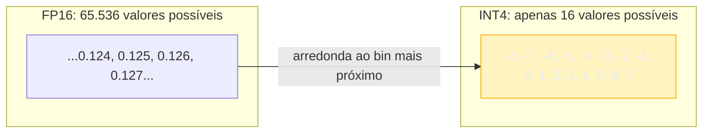
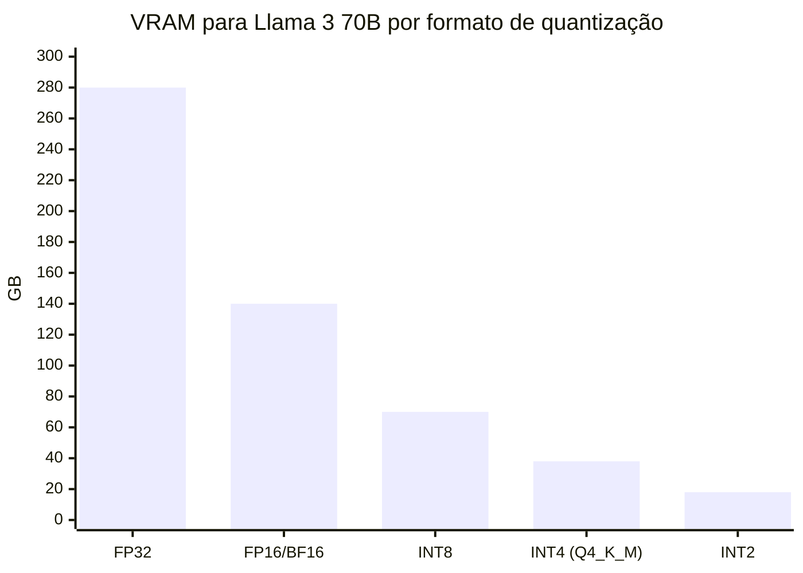
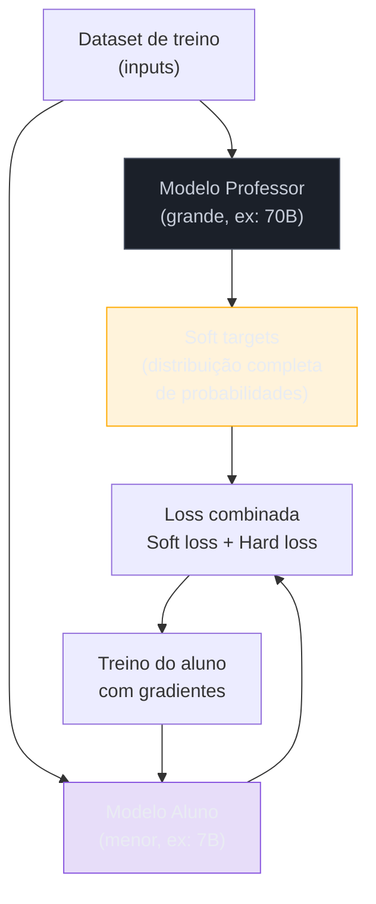
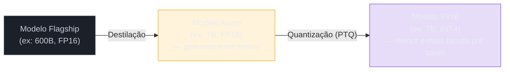

# Compressão de modelos — quantização e destilação

> [!abstract] TL;DR
> Duas famílias ortogonais para encolher um modelo. **Quantização** reduz a precisão numérica dos pesos (FP16 → INT8 → INT4): mesma arquitetura, menos bits por número — como salvar um JPEG com mais compressão. **Destilação** treina um modelo "aluno" menor para imitar um "professor" maior — como um residente aprendendo medicina ao observar um especialista, em vez de reler todos os livros. As duas trocam um pouco de qualidade por tamanho, velocidade e custo, e costumam ser combinadas: destila primeiro, quantiza depois. É a engenharia por trás de por que existe um Haiku abaixo de um Opus — e por que um modelo de 7B pode caber e rodar no seu notebook.

## O problema que a compressão resolve

Imagine que você tem acesso ao melhor modelo de linguagem do mundo: 600B de parâmetros, FP16, estado da arte em todas as tarefas. Para rodá-lo em inferência, você precisa de 1,2 TB de VRAM — o equivalente a 15 GPUs H100 apenas para carregar os pesos, antes de processar qualquer token.

Isso é economicamente inviável para a maioria das aplicações. O problema não é que o modelo é bom demais — é que ele é **grande demais** para a infraestrutura disponível.

Compressão de modelos responde à pergunta: **como extrair o máximo de qualidade possível de um modelo que caiba no hardware que você tem?** As duas rotas principais atacam ângulos completamente diferentes do mesmo problema.

## Quantização — mesmo cérebro, resolução menor

### A ideia central

Um peso de rede neural é um número de ponto flutuante. Em FP32, ele ocupa 32 bits e pode representar ~4 bilhões de valores distintos. Em FP16, 16 bits e ~65 mil valores. Em INT4, apenas 4 bits: **16 valores possíveis**.

Quantizar é "arredondar" os pesos para os bins disponíveis. O custo: um peso que valia 0.3271 pode virar 0.33 (INT8) ou 0.25 (INT4). Acumule esses erros de arredondamento em 70 bilhões de pesos e você terá alguma degradação de qualidade — mas surpreendentemente pouca nas precisões moderadas (INT8, Q5).

> [!tip] O resumo de uma frase
> Quantização = **mesmo cérebro, resolução menor**. Destilação = **cérebro menor, treinado para imitar o grande**.

### Quanto de memória você economiza

A economia de VRAM é direta: cada peso ocupa menos bytes.

**Regra de bolso:** VRAM (GB) ≈ parâmetros (B) × bytes por peso:
- FP32: 70B × 4 bytes = **280 GB** → precisa de ~4 H100 só para os pesos
- FP16: 70B × 2 bytes = **140 GB** → precisa de ~2 H100
- INT8: 70B × 1 byte = **70 GB** → cabe em 1 H100 (80 GB)
- INT4: 70B × 0.5 bytes = **~38 GB** (com overhead) → cabe numa GPU de 40 GB!

É exatamente esse cálculo que torna rodável em hardware comum um modelo que seria impossível em FP16.

### Formatos de quantização na prática

| Formato | Tipo | Quem usa | Plataforma ideal |
|---------|------|----------|-----------------|
| **GGUF** (Q4_K_M, Q5_K_M, Q8_0) | PTQ | llama.cpp, Ollama | CPU / Apple Silicon |
| **GPTQ** | PTQ (2a ordem) | AutoGPTQ | GPU NVIDIA |
| **AWQ** | PTQ (pesos salientes) | vLLM, LLMStudio | GPU NVIDIA, produção |
| **NF4 / bitsandbytes** | PTQ | QLoRA, fine-tuning | GPU NVIDIA, treino |

**GGUF k-quants** merecem atenção especial: o prefixo indica o método (`K` = k-quantization, mais inteligente que naïve per-weight), e o sufixo o tamanho do modelo (`S`, `M`, `L`). `Q4_K_M` é o padrão-ouro para rodar localmente em CPU: boa qualidade, VRAM mínima.

**AWQ** preserva os pesos *mais importantes* com maior precisão: antes de quantizar, identifica os pesos com maior ativação (os mais salientes) e aloca-lhes mais bits. Resulta em qualidade melhor que GPTQ a mesma taxa de bits.

### PTQ vs QAT

- **PTQ (Post-Training Quantization)** — quantiza um modelo já treinado. Barato, rápido, não precisa de dados de treino (ou só um pequeno conjunto de calibração). É o caminho comum.
- **QAT (Quantization-Aware Training)** — simula a quantização *durante* o treino, então o modelo "aprende" a conviver com a baixa precisão. Mais caro, mas necessário para INT2/1.58-bit de boa qualidade.

| Bits/peso | Formato | VRAM relativa | Qualidade | Melhor via |
|-----------|---------|---------------|-----------|------------|
| 32 | FP32 | 4× baseline | Referência (raro em inferência) | — |
| 16 | FP16/BF16 | 2× | Baseline de produção | — |
| 8 | INT8 | 1× | Perda quase imperceptível | PTQ |
| 4 | INT4 | ~0.5× | Perda perceptível em raciocínio complexo | PTQ ou QAT |
| 2–1.6 | INT2/BitNet | ~0.25× | Experimental, só com QAT dedicado | QAT |

## Destilação — cérebro menor, treinado para imitar o grande

### A ideia central: soft targets

A destilação (Hinton, Vinyals & Dean, 2015) parte de uma observação: um modelo treinado não só acerta a resposta certa — ele mantém uma **distribuição de probabilidade** sobre todas as respostas possíveis. E essa distribuição carrega mais informação do que o rótulo correto sozinho.

Exemplo: um classificador de "gato vs. cão" treinado sobre fotografias atribui 95% ao gato, 4% ao cão e 1% ao resto. Esses 4% dizem "gatos e cães são mais parecidos entre si do que com carros". Isso é **dark knowledge** — conhecimento estrutural sobre as relações entre classes que o rótulo correto ("gato") não carrega.

A destilação faz o aluno aprender a *imitar a distribuição completa* do professor, não só acertar o rótulo:

Para expor melhor a dark knowledge (suavizar picos de probabilidade), os logits do professor são divididos por uma **temperatura T > 1** antes do softmax. Com T=4, uma distribuição `[0.95, 0.04, 0.01]` se torna `[0.60, 0.28, 0.12]` — muito mais informativa para o aluno treinar.

### Tipos de destilação

- **Response-based** — o aluno imita os logits/saídas finais do professor. O clássico (Hinton et al.).
- **Feature-based** — o aluno imita também representações de camadas intermediárias do professor. Mais informação, mais complexo de implementar.
- **Sequence-level / data distillation** — o professor gera um corpus de saídas de alta qualidade; o aluno treina sobre esse corpus como se fossem dados reais. A fronteira com geração de dados sintéticos é tênue — e é o mecanismo por trás das variantes "mini" de modelos comerciais.

**Marcos que valem citar:**

- **DistilBERT** (Sanh et al., 2019): 40% menor, 60% mais rápido, retém ~97% do desempenho do BERT.
- **Distilling step-by-step** (Google, 2023): um T5 de 770M igualou o PaLM 540B (redução de 700×!) extraindo *rationales* do professor.
- **Modelos "mini" de famílias comerciais**: Claude Haiku, GPT-4o-mini e Gemini Flash são acreditados (sem confirmação oficial) como destilados de seus flagships.

## O pipeline completo: destilar e quantizar

As duas técnicas não são concorrentes — são camadas de um mesmo pipeline:

Primeiro reduz a *arquitetura* (menos parâmetros via destilação), depois reduz a *precisão* (menos bits via quantização). É assim que se chega a modelos que rodam em celular ou no navegador — e por que Phi-3 Mini (3.8B, INT4) funciona razoavelmente num laptop de consumo.

## Quando usar qual técnica

| Situação | Técnica | Motivo |
|----------|---------|--------|
| Já tenho o modelo, só quero em menos VRAM | **Quantização PTQ** | Barata, sem retreino, GGUF/AWQ resolvem |
| Preciso de qualidade em INT4 agressivo | **QAT** | O modelo aprende a tolerar a baixa precisão |
| Quero um modelo menor e mais rápido para uma tarefa | **Destilação** | Aluno especializado bate genéricos maiores |
| Edge / on-device, pegada mínima | **Destilação + quantização** | As duas se somam |
| Adaptar a um domínio sem encolher | [[Dicionário de IA#fine-tuning\|Fine-tuning]] | Objetivo é especializar, não reduzir |

## Armadilhas comuns

> [!warning] INT4 degrada raciocínio complexo mais do que benchmarks genéricos sugerem
> Para coding, math e raciocínio de múltiplos passos, prefira INT8 ou `Q5_K_M`; INT4 é perceptivelmente pior nesses domínios. A perplexity (métrica padrão de avaliação de quantização) não captura bem essa degradação específica. Sempre meça no *seu* golden set (ver [[19 - Evaluation de LLMs em produção]]), não só em benchmarks genéricos.

> [!warning] "Modelo menor é de graça" — a destilação tem custo
> Destilação não é grátis: exige o modelo professor rodando (custo de compute), um dataset de treino e compute de fine-tuning. O que é barato é a *inferência depois* — não o processo de destilação em si.

> [!warning] O aluno herda os vícios do professor
> Vieses, alucinações, lacunas de conhecimento e quaisquer comportamentos problemáticos do teacher passam adiante. Destilar de um modelo ruim produz um aluno ruim — menor, mas com os mesmos defeitos proporcionalmente amplificados.

> [!warning] Quantizar modelos pequenos dói mais
> Um 70B em INT4 sofre menos (proporcionalmente) que um 3B em INT4; modelos pequenos têm menos "redundância de precisão" para absorver o erro de quantização. Abaixo de 7B, INT4 pode degradar significativamente; considere INT8 ou modelos menores em FP16 em vez de modelos ainda menores em INT4.

> [!warning] Destilar de API fechada pode violar ToS
> Treinar um aluno a partir das saídas de um modelo comercial de terceiros frequentemente esbarra nos termos de uso do provider. OpenAI e Anthropic proíbem explicitamente usar saídas para treinar modelos concorrentes. Verifique antes de começar.

## O que vem a seguir

Até aqui, quantização e destilação apareceram como técnicas de *pós-treino* — formas de encolher um modelo já pronto para caber em menos VRAM ou rodar mais rápido. Mas e se a compressão entrasse *antes* do treino terminar, não depois? É exatamente o que acontece quando você faz fine-tuning: em vez de ajustar os pesos completos de um modelo em FP16, dá pra carregar o modelo já em INT4 (via NF4/bitsandbytes, visto na tabela de formatos acima) e treinar só um punhado de adaptadores por cima dele. Esse é o truque do QLoRA — quantização e fine-tuning deixam de ser etapas separadas do pipeline e passam a acontecer no mesmo lugar, o que é a razão de dar para ajustar um modelo de 65B numa única GPU de consumo. [[21 - Fine-tuning na prática — LoRA, QLoRA, DPO]] detalha o mecanismo.

## Como explicar em inglês

Quantization reduces the numerical precision of a model's weights — from FP16 (65,536 possible values per weight) to INT4 (just 16 values) — cutting memory by roughly 4× with modest quality loss. The common formats are GGUF (for CPU and Apple Silicon via llama.cpp), GPTQ (GPU-focused), and AWQ (activation-aware, better quality at the same bit rate, used by vLLM). Knowledge distillation trains a smaller "student" model to mimic the full output distribution of a larger "teacher," not just the correct label — the distribution itself carries structural knowledge about relationships between concepts ("cats resemble dogs more than cars"). The two techniques compose: distill first (smaller architecture), then quantize (fewer bits per weight).

| PT | EN |
|----|---|
| Quantização | Quantization |
| Precisão numérica | Numerical precision |
| Peso quantizado | Quantized weight |
| Quantização pós-treino | Post-Training Quantization (PTQ) |
| Treinamento ciente de quantização | Quantization-Aware Training (QAT) |
| Destilação de conhecimento | Knowledge distillation |
| Modelo professor | Teacher model |
| Modelo aluno | Student model |
| Rótulos suaves | Soft targets |
| Conhecimento oculto | Dark knowledge |
| Temperatura de destilação | Distillation temperature |
| Ativações salientes | Salient activations (AWQ) |

## Ver mais

- **[LLM Quantization Explained: GPTQ, AWQ, QLoRA, GGUF e mais](https://www.youtube.com/watch?v=WmvZwR4rKJg)** — cobre PTQ vs QAT e os três formatos principais. Publicado mar/2026.
- **[LLM Quantization — Part 1 (PTQ, QAT, GPTQ, AWQ)](https://www.youtube.com/watch?v=sLEuVm9ZdxQ)** e **[Part 2 (GGUF, GGML, llama.cpp)](https://www.youtube.com/watch?v=_3FctggJ9r4)** — série em dois episódios de ago/set 2025; cobertura sistemática de todos os formatos.
- **[Knowledge Distillation in Large Language Models (2024)](https://www.youtube.com/watch?v=1RvdM-q6kDQ)** — deep dive no paradigma teacher-student para LLMs.

## Veja também

- [[01 - O que é um LLM]] — o mito "maior é melhor" e o caso T5/PaLM
- [[09 - Dense vs Mixture-of-Experts]] — outro eixo de eficiência (esparsidade vs precisão/tamanho)
- [[10 - Modelos locais e self-hosting]] — quantização aplicada na prática (VRAM, AWQ, k-quants)
- [[16 - Fine-tuning vs prompting vs RAG]] — adaptar ≠ comprimir
- [[21 - Fine-tuning na prática — LoRA, QLoRA, DPO]] — QLoRA fine-tuna sobre um base quantizado: compressão e treino se encontram

## Referências

- **Geoffrey Hinton, Oriol Vinyals, Jeff Dean** — *Distilling the Knowledge in a Neural Network* (2015). O paper fundador da destilação e dos soft targets.
- **Victor Sanh et al. (HuggingFace)** — *DistilBERT, a distilled version of BERT* (2019). Caso de referência prático.
- **Google Research** — [*Distilling Step-by-Step*](https://research.google/blog/distilling-step-by-step-outperforming-larger-language-models-with-less-training-data-and-smaller-model-sizes/) (2023). T5 770M ≈ PaLM 540B.
- **Frantar et al.** — *GPTQ: Accurate Post-Training Quantization* (2022).
- **Lin et al.** — *AWQ: Activation-aware Weight Quantization* (2023).
- **Dettmers et al.** — *QLoRA: Efficient Finetuning of Quantized LLMs* (2023). Introduz o formato NF4.
- **Georgi Gerganov** — *llama.cpp* (GitHub). Implementação de referência dos k-quants (GGUF).
