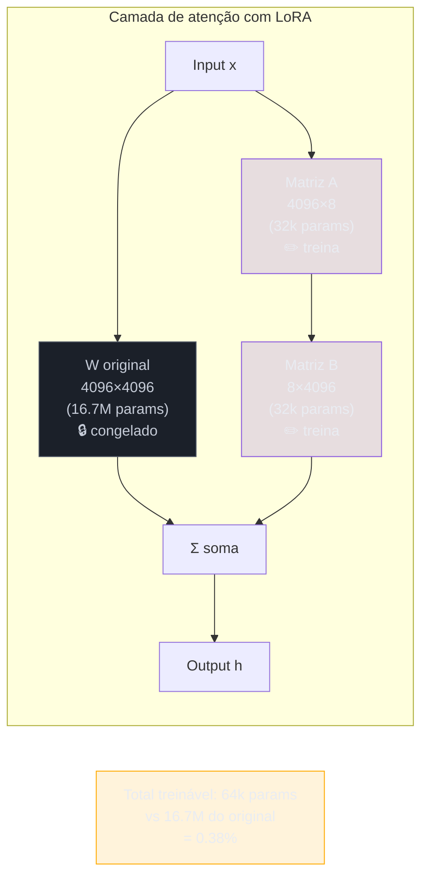
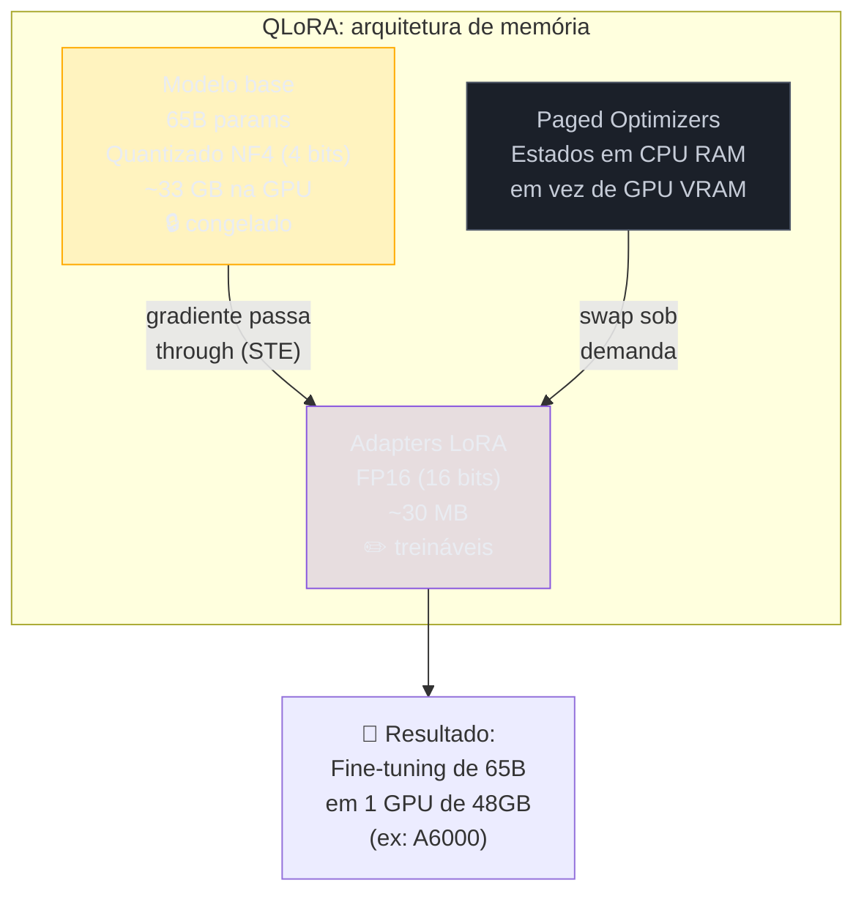
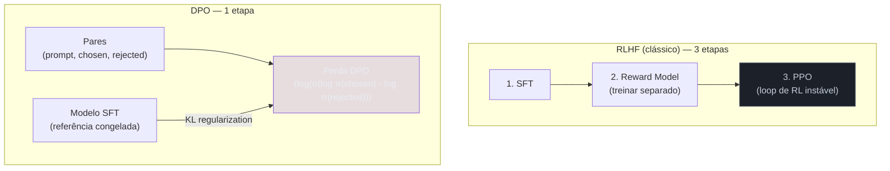
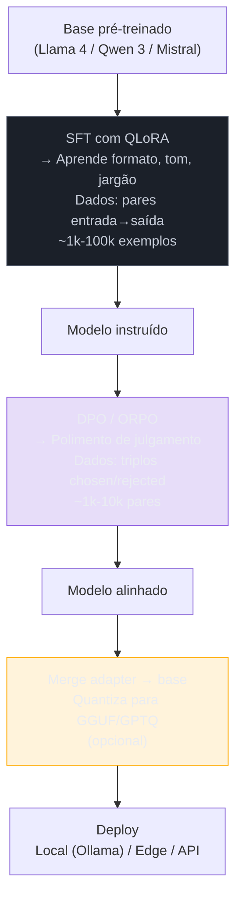

# Fine-tuning na prática — LoRA, QLoRA, DPO

> [!abstract] TL;DR
> A nota [[16 - Fine-tuning vs prompting vs RAG]] decide **quando** fine-tunar; esta mostra **como**. Três camadas. **Full fine-tuning** atualiza todos os pesos — máximo poder, custo proibitivo (precisa do modelo inteiro + estados do otimizador na memória). **PEFT** (parameter-efficient fine-tuning) congela o modelo base e treina só um punhado de pesos novos: **LoRA** injeta matrizes de baixo posto e treina <1% dos parâmetros; **QLoRA** põe LoRA em cima de um base quantizado em 4 bits, e aí um modelo de 65B fine-tuna numa única GPU. E depois do SFT vem o **alinhamento por preferência**: **DPO** substitui o RLHF (reward model + PPO) por uma perda direta sobre pares "resposta boa / resposta ruim" — mais barato e mais estável. A regra de bolso de 2026: **QLoRA para o SFT, DPO para o polimento**, full fine-tuning quase nunca.

## O insight que tornou fine-tuning acessível

Em 2021, fine-tunar um modelo de 65B parâmetros exigia um cluster de GPUs, semanas de computação e equipe especializada. Em 2023, um pesquisador com uma única GPU de consumidor (RTX 3090) podia fazer a mesma coisa em horas. O que mudou não foi o hardware — foi a descoberta de que **você não precisa atualizar todos os pesos para mudar o comportamento do modelo**.

A intuição veio de uma observação empírica: durante o fine-tuning, as atualizações de peso (ΔW) têm *posto intrínseco baixo*. Isso significa que, mesmo que ΔW seja uma matriz gigante (ex.: 4096×4096), ela pode ser aproximada por duas matrizes pequenas multiplicadas. Em vez de treinar 16 milhões de pesos, você treina apenas alguns milhares. O resultado? 99% do compute de treino reduzido, com perda de qualidade desprezível em tarefas de domínio.

Isso não era óbvio. A intuição dominante até então era "mais parâmetros = mais capacidade = melhor resultado". LoRA mostrou que, para adaptar um modelo que já sabe muita coisa, a maioria dos parâmetros é ruído — você precisa mudar uma direção específica no espaço de pesos, não todos os eixos.

## O que é

Fine-tuning é mudar os [[Dicionário de IA#parameters / weights|pesos]] do modelo — diferente de prompting/RAG, que só mexem no input (ver [[16 - Fine-tuning vs prompting vs RAG]]). Mas "fine-tuning" virou guarda-chuva para coisas bem diferentes. Vale separar **o que** você ensina de **como** você ensina:

- **SFT (Supervised Fine-Tuning)** — você dá pares `entrada → saída ideal` e o modelo aprende a imitar. Ensina **forma e comportamento**: formato de output, tom, jargão de domínio, seguir um schema. É o mesmo SFT do pipeline de treino de fronteira ([[18 - Como LLMs são treinados — pretraining, SFT, RLHF]]), só que num modelo já pronto e com seus dados.
- **Preference tuning** — em vez de uma resposta certa, você dá **duas** (uma melhor, uma pior) e ensina o modelo a preferir a melhor. Ensina **julgamento**: ser mais útil, menos prolixo, recusar o que deve recusar. DPO e RLHF vivem aqui.

> [!tip] O resumo de uma frase
> SFT ensina **a imitar um exemplo**; preference tuning ensina **a escolher entre dois**. As duas camadas mexem nos pesos — o que muda é o sinal de treino.

E há um eixo ortogonal: **quantos** pesos você toca. É aí que entram full FT, LoRA e QLoRA.

## Por que importa

| Motivação | Por que fine-tuning (e não prompt/RAG) |
| --- | --- |
| **Formato/estilo consistente em escala** | Um modelo fine-tuned "já nasce" no formato — sem gastar tokens de few-shot a cada chamada |
| **Latência e custo por chamada** | Prompt curto + modelo menor especializado bate prompt gigante num flagship |
| **Jargão e comportamento de domínio** | Padrões que nenhum prompt captura bem (clínico, jurídico, código interno) |
| **Soberania / on-prem** | Você é dono dos pesos — roda local ([[10 - Modelos locais e self-hosting]]), sem vazar dado para API |
| **Destilar um comportamento** | Capturar num modelo aberto o jeito de responder de um modelo maior (fronteira com [[20 - Compressão de modelos — quantização e destilação|destilação]]) |

> [!warning] Fine-tuning ensina forma, não fatos
> O erro clássico é fine-tunar para "ensinar conhecimento". Não funciona bem: o modelo memoriza ruído e alucina com confiança. Conhecimento que muda → **RAG**. Comportamento/formato estável → fine-tuning. Ver a árvore de decisão em [[16 - Fine-tuning vs prompting vs RAG]].

## Como funciona

### Full fine-tuning — o caminho caro

Atualiza **todos** os pesos. O problema não é a inferência, é o **treino**: com Adam em precisão mista, cada parâmetro custa ~16-20 bytes (pesos fp16 + gradientes fp16 + dois estados do otimizador em fp32 + master weights). Um modelo de **7B** já pede **~120GB** só de estado de treino — multi-GPU obrigatório. Além do custo, há o risco de **catastrophic forgetting**: ao reescrever tudo, o modelo esquece habilidades gerais. Por isso, fora de labs, full FT é raro.

### LoRA — treinar 1% e fingir que treinou tudo

A sacada (Hu et al., 2021): o **update** de peso durante o fine-tuning tem **posto intrínseco baixo** — ele não precisa de todos aqueles graus de liberdade. Então, em vez de aprender a matriz cheia `ΔW` (enorme), congela-se `W` e aprende-se `ΔW = B·A`, com `A` e `B` finas (posto `r` pequeno, tipo 8-64). Treina-se só `A` e `B` — **menos de 1% dos parâmetros**.

```
W_efetivo = W_congelado + (alpha/r)·B·A
            └─ não treina ─┘  └── treina (LoRA) ──┘
```



Consequências práticas:

- **Memória despenca** — sem estados de otimizador para bilhões de pesos; o grande custo vira só o base congelado em fp16 (~14GB para um 7B).
- **Adapters são plugáveis** — o `B·A` treinado é um arquivo de poucos MB. Você troca de "personalidade" trocando o adapter, sobre o **mesmo** base. Dá para ter dezenas.
- **Hiperparâmetros que importam:** `r` (posto — capacidade), `alpha` (escala do update), e os **target modules** (em quais projeções injetar — começa por `q_proj`/`v_proj`, expande para MLP se precisar).

> [!question]- Por que ΔW é naturalmente de posto baixo?
> Durante o fine-tuning para uma tarefa específica, o modelo está essencialmente aprendendo a "virar" sua representação interna em uma direção específica no espaço de embeddings. Essa direção é muito mais simples que o espaço completo — é como a diferença entre girar uma bússola (1 grau de liberdade) e redesenhar o mapa (infinitos). A tarefa de "aprender a responder em JSON" ou "aprender terminologia médica" requer uma transformação no espaço de saída muito mais simples que os pesos pré-treinados em sua totalidade.

### QLoRA — onde compressão e fine-tuning se encontram

QLoRA (Dettmers et al., 2023) leva LoRA ao extremo: **quantiza o base congelado para 4 bits** (formato NF4) e prende os adapters LoRA, em precisão maior, por cima. O gradiente passa **através** do base quantizado, mas só os adapters aprendem.



Com *double quantization* e *paged optimizers*, isso põe o fine-tuning de um **33B/65B numa única GPU**. É a ponte literal com a nota [[20 - Compressão de modelos — quantização e destilação]]: a quantização aqui não é só para *rodar* barato, é para *treinar* barato. Em 2026, QLoRA é o default de quem fine-tuna modelo aberto fora de um cluster.

### DPO — alinhamento por preferência sem o circo do RLHF

Depois do SFT, você quer ajustar **julgamento**. O caminho clássico, o RLHF ([[18 - Como LLMs são treinados — pretraining, SFT, RLHF]]), treina um *reward model* e depois roda PPO — duas etapas, instável, caro de acertar. O **DPO** (Rafailov et al., 2023) reformula tudo como **uma perda direta**: dado um triplo `(prompt, resposta escolhida, resposta rejeitada)`, otimize o modelo para dar mais probabilidade à escolhida que à rejeitada — sem reward model, sem loop de RL.



Um **modelo de referência** congelado (o próprio SFT) segura a rédea (um termo de KL) para o modelo não desandar. Variantes que você vai encontrar:

- **IPO** — corrige uma tendência do DPO de "overfitar" a preferência.
- **KTO** — usa rótulos binários soltos (isto é bom / isto é ruim), sem precisar de **pares** — mais fácil de coletar dado.
- **ORPO** — funde SFT + preferência numa **única** etapa, sem modelo de referência. O mais enxuto dos pipelines.

## A pipeline típica de um modelo aberto



## Quando usar qual

| Situação | Técnica | Motivo |
| --- | --- | --- |
| Tenho cluster e preciso do máximo de qualidade | **Full fine-tuning** | Só aqui vale o custo; raro |
| SFT de um modelo aberto em 1 GPU | **QLoRA** | 4-bit + adapters = cabe e é barato |
| Várias especializações sobre um base | **LoRA (adapters)** | Troca de adapter, não de modelo |
| Polir comportamento depois do SFT | **DPO** (ou ORPO) | Alinhamento estável, sem reward model |
| Só tenho rótulos "bom/ruim" avulsos | **KTO** | Dispensa pares de preferência |
| Preciso de **conhecimento atualizado** | **Nada disso → [[16 - Fine-tuning vs prompting vs RAG\|RAG]]** | Fine-tuning não guarda fatos bem |

## Ferramentas (2026)

- **HuggingFace PEFT + TRL** — `peft` implementa LoRA/QLoRA; `trl` traz `SFTTrainer`, `DPOTrainer`, `ORPOTrainer`. O caminho de referência.
- **Axolotl** — fine-tuning dirigido por arquivo de config (YAML); popular para reprodutibilidade.
- **Unsloth** — kernels otimizados: ~2× mais rápido e menos VRAM que o baseline.
- **Llama-Factory** — UI + CLI cobrindo SFT/DPO/quantização num lugar só.
- **Managed** — OpenAI fine-tuning, Together, Fireworks, Predibase: você sobe o dataset, eles treinam (geralmente LoRA por baixo) e servem.

O formato do dado é metade do jogo: SFT pede pares `instrução → resposta`; DPO pede triplos `prompt / chosen / rejected`. Dado sujo = modelo pior.

## Armadilhas

> [!warning] "Fine-tuning é sempre melhor"
> É o mais caro e o menos flexível. Esgote prompting + RAG antes ([[16 - Fine-tuning vs prompting vs RAG]]).

> [!warning] Poucos dados, ou dados sujos
> 1.000 exemplos limpos batem 100.000 ruidosos. Abaixo de ~1k, costuma memorizar em vez de generalizar.

> [!warning] `r` mal calibrado
> Posto alto demais overfita e desperdiça; baixo demais não aprende. Comece pequeno (8-16) e suba se o eval pedir.

> [!warning] Esquecer de avaliar no *seu* golden set
> Benchmark genérico mente. Meça o modelo fine-tuned na sua tarefa ([[19 - Evaluation de LLMs em produção]]).

> [!warning] DPO sobre-otimizado
> Preferência empurrada longe demais degrada qualidade geral; o termo de KL contra o modelo de referência existe para isso — não o zere.

> [!warning] Merge de LoRA em base quantizado
> Fundir o adapter de volta num base 4-bit perde precisão; sirva o adapter separado ou faça o merge em fp16.

> [!warning] Destilar de API fechada
> Treinar com saídas de um modelo comercial de terceiros costuma violar os ToS do provider (mesma armadilha da [[20 - Compressão de modelos — quantização e destilação|destilação]]).

## Como explicar em inglês

Fine-tuning updates model weights (unlike prompting/RAG, which only modify inputs). In practice, **full fine-tuning** (all weights) is rarely viable outside of ML labs due to memory cost (~16-20 bytes per parameter for optimizer states). **LoRA** makes fine-tuning practical by exploiting the empirical observation that weight updates are low-rank: instead of training ΔW (the full weight delta), it trains two small matrices A and B such that ΔW ≈ BA, reducing trainable parameters by 99%+. **QLoRA** extends LoRA by quantizing the frozen base model to 4-bit NF4, reducing GPU memory enough to fine-tune a 65B model on a single GPU. After supervised fine-tuning (SFT), **DPO** replaces the unstable RLHF pipeline (reward model + PPO) with a direct loss over preference pairs — simpler, cheaper, and more stable.

| PT | EN |
|----|---|
| Ajuste fino | Fine-tuning |
| Ajuste fino supervisionado | Supervised fine-tuning (SFT) |
| Ajuste fino eficiente em parâmetros | Parameter-Efficient Fine-Tuning (PEFT) |
| Adaptação de baixo posto | Low-Rank Adaptation (LoRA) |
| Adaptador | Adapter |
| Posto da matriz | Matrix rank |
| Esquecimento catastrófico | Catastrophic forgetting |
| Otimização direta de preferência | Direct Preference Optimization (DPO) |
| Modelo de recompensa | Reward model |
| Par de preferência | Preference pair (chosen/rejected) |
| Quantização de 4 bits | 4-bit quantization / NF4 |
| Otimizadores paginados | Paged optimizers |

## Ver mais

- **[Umar Jamil — LoRA from Scratch (2024)](https://www.youtube.com/watch?v=PXWYUTMt-AU)** — implementação matemática de LoRA passo a passo em PyTorch, derivando a decomposição de posto baixo e os gradientes. Canal técnico com implementações de paper.
- **[Sebastian Raschka — Fine-tuning LLMs (2024)](https://www.youtube.com/@SebastianRaschka)** — Raschka é o autor de "Build a Large Language Model from Scratch"; seus vídeos de fine-tuning incluem comparativos detalhados entre técnicas PEFT.
- **[HuggingFace Blog — RLHF e DPO](https://huggingface.co/blog/dpo-trl)** — implementação de referência com TRL, incluindo `DPOTrainer` e exemplos de dataset de preferência.

## O que vem a seguir

Esta é a última nota do galho **Anatomia dos LLMs**. Se você chegou até aqui, já tem o modelo: como ele é montado (tokenização, atenção, janela de contexto), como é treinado (pretraining, SFT, RLHF) e como é adaptado depois de pronto (LoRA, QLoRA, DPO). Mas um LLM fine-tuned sozinho não é um produto — é uma peça. Três trilhas fecham o resto do quebra-cabeça:

- **[[Anatomia de Agents]]** — um modelo (fine-tuned ou não) vira *agent* quando ganha um loop de decisão: observar, escolher uma ferramenta, agir, repetir. As técnicas desta nota moldam o comportamento; agents moldam o **fluxo de controle** em volta desse comportamento.
- **[[RAG e Vector Databases]]** — o callout de "Por que importa" já avisou: fine-tuning ensina forma, não fatos. Quando o conhecimento muda com frequência (documentação, base de clientes, notícias), a resposta não é re-treinar — é buscar e injetar contexto em tempo de execução. RAG é o "irmão" que resolve o que fine-tuning propositalmente não resolve.
- **[[Context Engineering]]** — junto de RAG, a outra face da mesma moeda: em vez de mudar os pesos (fine-tuning) ou buscar fatos (RAG), você desenha **o que entra no prompt** — prompt, contexto, intenção, especificação. Muita adaptação de comportamento que hoje vira LoRA começou como um problema mal-resolvido de context engineering.

A pergunta que guia qual trilha seguir: você quer mudar **como o modelo se comporta** (fine-tuning, já feito), **como ele decide e age** (Agents), **o que ele sabe no momento da chamada** (RAG) ou **o que você coloca na frente dele** (Context Engineering)? Frequentemente a resposta certa em produção é "os quatro, em camadas" — mas agora você tem o vocabulário pra escolher a dose certa de cada um.

## Veja também

- [[16 - Fine-tuning vs prompting vs RAG]] — **quando** fine-tunar (esta nota é o **como**)
- [[18 - Como LLMs são treinados — pretraining, SFT, RLHF]] — SFT e RLHF na escala de laboratório
- [[20 - Compressão de modelos — quantização e destilação]] — quantização (a base do QLoRA) e destilação
- [[10 - Modelos locais e self-hosting]] — onde o modelo fine-tuned vai rodar

## Referências

- **Hu et al.** — *LoRA: Low-Rank Adaptation of Large Language Models* (2021). [arxiv:2106.09685](https://arxiv.org/abs/2106.09685). O método PEFT dominante.
- **Dettmers et al.** — *QLoRA: Efficient Finetuning of Quantized LLMs* (2023). [arxiv:2305.14314](https://arxiv.org/abs/2305.14314). NF4, double quant, paged optimizers.
- **Rafailov et al.** — *Direct Preference Optimization* (2023). [arxiv:2305.18290](https://arxiv.org/abs/2305.18290). RLHF sem reward model.
- **Hong et al.** — *ORPO: Monolithic Preference Optimization without Reference Model* (2024). [arxiv:2403.07691](https://arxiv.org/abs/2403.07691).
- **HuggingFace** — *PEFT* e *TRL* (docs). Implementações de referência de LoRA/QLoRA e SFT/DPO/ORPO.
- **Unsloth** / **Axolotl** (GitHub) — toolchains de fine-tuning otimizadas e config-driven.
