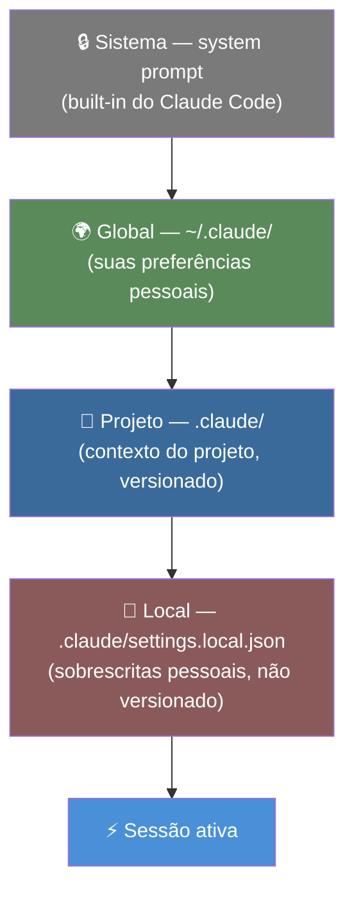
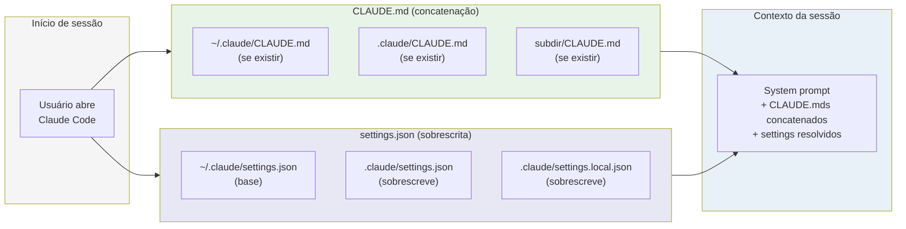

# Hierarquia de configuração — global, projeto, user

> [!abstract] TL;DR
> Claude Code lê configuração em camadas: global (`~/.claude/`) → projeto (`.claude/`) → local (`.claude/settings.local.json`). Camadas mais específicas sobrescrevem as mais gerais. CLAUDE.md é lido em todas as camadas que existirem — o conteúdo é concatenado. Entender a hierarquia é pré-requisito para configurar intencionalmente.

---

## A metáfora: jaquetas sobre camisetas

Imagine que o [[Dicionário de IA#Claude Code|Claude Code]] veste roupa em camadas. A camada mais interna é a camiseta — o system prompt padrão, que define o comportamento base. Sobre ela, uma camiseta de base pessoal — suas preferências globais em `~/.claude/`. Em seguida, uma jaqueta do projeto — o contexto específico em `.claude/`. Por último, um acessório pessoal temporário — suas sobrescritas locais em `.claude/settings.local.json`.

O resultado é o que você vê: o comportamento do agente na sessão atual. Cada camada adiciona ou substitui partes do visual. A regra geral: a camada mais externa (mais específica) vence — exceto para CLAUDE.md, onde todas as camadas são lidas e combinadas.

---

## As quatro camadas de configuração



| Camada | Localização | Para quê | Versionado? |
|--------|-------------|---------|-------------|
| Sistema | Built-in | Comportamento base do Claude Code | Não |
| Global | `~/.claude/` | Preferências pessoais para todos os projetos | Não (só sua máquina) |
| Projeto | `.claude/` | Contexto específico do projeto | Sim (compartilhado com o time) |
| Local | `.claude/settings.local.json` | Sobrescritas temporárias pessoais | Não (no .gitignore) |

---

### Camada 1: Sistema (built-in)

O system prompt padrão do Claude Code — comportamento base, quais tools usar, como pedir confirmação, como estruturar respostas. Você não edita isso diretamente.

O que o sistema define:
- Instruções de safety (pedir confirmação antes de ações destrutivas)
- Hierarquia de tools (quando usar Read vs Grep vs Bash)
- Formato de resposta padrão
- Como reportar erros e incerteza

---

### Camada 2: Global (`~/.claude/`)

Configuração que aplica a **todos os projetos** do usuário.

```
~/.claude/
├── CLAUDE.md            ← preferências pessoais globais
└── settings.json        ← permissões e comportamentos padrão
```

**`~/.claude/CLAUDE.md`** — o que você sempre quer que o agente saiba:
```markdown
# Preferências globais

## Idioma
Responda sempre em português do Brasil.

## Commits
- Nunca adicione "Co-Authored-By: Claude" em commits
- Use conventional commits (feat:, fix:, refactor:, docs:, test:)
- Sempre use mensagens em português

## Código
- Prefira legibilidade a cleverness
- Quando dividido entre duas abordagens, explique o trade-off antes de decidir
```

**`~/.claude/settings.json`** — permissões globais:
```json
{
  "permissions": {
    "allow": [
      "Bash(git status)",
      "Bash(git log*)",
      "Bash(git diff*)"
    ]
  }
}
```

**Quando usar a camada global:** preferências que você quer em *todos* os projetos, independente da stack ou do time. Se é uma preferência de trabalho sua (idioma, estilo de commit, comportamento de code review), vai aqui.

---

### Camada 3: Projeto (`.claude/`)

Configuração específica do projeto — versionada no repositório, compartilhada com o time.

```
.claude/
├── CLAUDE.md            ← contexto do projeto
├── settings.json        ← permissões do projeto
├── commands/            ← slash commands customizados
│   ├── review-security.md
│   └── add-migration.md
└── skills/              ← (opcional) skills do projeto
```

**`.claude/CLAUDE.md`** — tudo que o agente precisa saber sobre este projeto:
```markdown
# Contexto do projeto

## Visão geral
API REST de gestão de pedidos B2B. Multi-tenant com schema separado por cliente no PostgreSQL.

## Arquitetura
- `src/api/` — rotas Express (um arquivo por domínio)
- `src/services/` — lógica de negócio
- `src/db/queries/` — todas as queries SQL (sem ORM)

## Stack
- Node 20, TypeScript 5, Express 4
- PostgreSQL 15 com node-postgres
- Logger: winston em `src/utils/logger.ts` — não use console.*

## Convenções
- Erros: use `AppError` de `src/errors/AppError.ts`
- Testes: um arquivo por service em `tests/`
```

**`.claude/settings.json`** — permissões do projeto:
```json
{
  "permissions": {
    "allow": [
      "Bash(npm test)",
      "Bash(npm run lint)",
      "Bash(npm run build)"
    ],
    "deny": [
      "Bash(git push*)",
      "Bash(rm -rf*)",
      "Bash(npm publish*)"
    ]
  }
}
```

---

### Camada 4: Local (`.claude/settings.local.json`)

Sobrescritas pessoais que **não vão para o git**. Ideal para ajustes temporários ou personalizações que não fazem sentido para o time inteiro.

```json
// .claude/settings.local.json
{
  "permissions": {
    "allow": [
      "Bash(npm run dev)",
      "Bash(docker-compose up*)"
    ]
  }
}
```

Adicione ao `.gitignore`:
```
.claude/settings.local.json
```

**Casos de uso típicos:**
- Você quer rodar o servidor de dev sem confirmação, mas o time não precisa disso em CI
- Sobrescrita temporária enquanto está debugging algo específico
- Permissões que dependem da sua máquina (paths locais, tools que só você tem instaladas)

---

## Como CLAUDE.md é lido — concatenação, não sobrescrita

A diferença crucial: **settings.json** usa sobrescrita (camada mais específica vence). **CLAUDE.md** usa concatenação — todos os CLAUDE.md encontrados são lidos e combinados.

```
Sessão em ~/repos/meu-projeto/src/auth/:

1. Lê ~/.claude/CLAUDE.md
   → "Responda em português. Nunca adicione Co-Authored-By."

2. Lê ~/repos/meu-projeto/.claude/CLAUDE.md
   → "Stack: Node 20 + TypeScript. Use logger em src/utils/logger.ts."

3. Lê ~/repos/meu-projeto/src/auth/CLAUDE.md  (se existir)
   → "Módulo auth usa JWT. Segredos em .env — nunca hardcode."

Contexto inicial = os três, concatenados na ordem de descoberta.
```

Isso significa que suas preferências pessoais (global) se combinam com o contexto do projeto sem conflito — nenhuma sobrescreve a outra. Você pode ter "responda em português" no global e "use AppError para erros" no projeto, e o agente vai respeitar ambos.

---

## Precedência em settings.json — sobrescrita

Para `settings.json`, a camada mais específica sobrescreve a menos específica:

```
Global:   allow: ["git status", "git log"]
Projeto:  allow: ["npm test", "npm run lint"]
Local:    allow: ["npm run dev"]

Resultado (precedência crescente):
  allow: ["npm run dev", "npm test", "npm run lint"]

⚠️ "git status" e "git log" foram PERDIDOS — o projeto não os incluiu
```

**Solução:** sempre inclua permissões acumulativas quando quiser que a camada mais específica *adicione* ao invés de *substituir*:

```json
// .claude/settings.json — inclua explicitamente o que veio de cima
{
  "permissions": {
    "allow": [
      "Bash(git status)",    // repetido do global
      "Bash(git log*)",      // repetido do global
      "Bash(npm test)",      // específico do projeto
      "Bash(npm run lint)"   // específico do projeto
    ]
  }
}
```

---

## Diagrama de resolução completa



---

## O que vai em cada camada — guia rápido

| O que configurar | Onde colocar | Por quê |
|-----------------|-------------|---------|
| Idioma de resposta | `~/.claude/CLAUDE.md` | Pessoal, não do projeto |
| Regras de commit pessoais | `~/.claude/CLAUDE.md` | Pessoal, não do projeto |
| Permissões git básicas | `~/.claude/settings.json` | Útil em todo projeto |
| Visão geral e arquitetura do projeto | `.claude/CLAUDE.md` | Específico do projeto |
| Convenções de código do time | `.claude/CLAUDE.md` | Específico do projeto |
| Comandos de desenvolvimento | `.claude/settings.json` | Específico do projeto |
| Guardrails de segurança | `.claude/settings.json` | Específico do projeto |
| Ajustes temporários pessoais | `.claude/settings.local.json` | Não versionar |

---

## Armadilhas

> [!warning] Misturar global com projeto
> Se convenções do projeto vão no global (`~/.claude/CLAUDE.md`), elas se aplicam a *todos* os seus outros projetos — e vão confundir o agente em projetos com stack diferente. Regra prática: se a instrução só faz sentido citando o nome do projeto ou da stack, ela pertence ao `.claude/CLAUDE.md`, nunca ao global.

> [!warning] `settings.local.json` no git
> Adicione ao `.gitignore`. É sobrescrita pessoal — compartilhar pode causar comportamentos inesperados em outros membros do time com máquinas diferentes (paths locais, tools que só você tem instaladas).

> [!warning] Esperar que settings.json concatene
> Não concatena. A camada mais específica **substitui** a menos específica, campo por campo. Se o projeto define `allow: ["npm test"]` sem incluir os allows globais, o agente perde as permissões globais — mesmo que elas continuem existindo em `~/.claude/settings.json`. É o oposto do comportamento do CLAUDE.md, e essa assimetria é a fonte mais comum de confusão na hierarquia.

> [!warning] CLAUDE.md desatualizado
> Um CLAUDE.md que diz "usamos Mongoose" quando o projeto migrou para Prisma confunde mais do que ajuda. Como todas as camadas de CLAUDE.md são concatenadas, uma instrução desatualizada na raiz não é sobrescrita por uma atualizada em subpasta — ela só soma ruído. Revise junto com a stack, na mesma PR que muda a dependência.

---

## Checklist — hierarquia de configuração

- [ ] `~/.claude/CLAUDE.md` tem preferências pessoais (idioma, estilo de commit)
- [ ] `.claude/CLAUDE.md` tem contexto do projeto (stack, arquitetura, convenções)
- [ ] `.claude/settings.json` tem allow list dos comandos que o agente roda sem confirmação
- [ ] `.claude/settings.json` tem deny list das ações destrutivas
- [ ] `.claude/settings.local.json` está no `.gitignore`
- [ ] settings.json do projeto inclui as permissões globais relevantes (não sobrescreve implicitamente)

---

## Casos práticos

**Cenário 1 — onboarding de um novo dev no time.** Uma engenheira entra num projeto com `.claude/settings.json` já versionado (`allow: ["npm test", "npm run lint", "npm run build"]`). Ela também tem, na própria máquina, `~/.claude/settings.json` com `allow: ["git status", "git log*", "git diff*"]` das outras empresas onde trabalhou. Na primeira sessão, ela nota que Claude Code volta a pedir confirmação pra `git status` — algo que "sempre funcionou sem confirmar" nos outros projetos. Não é bug: o `settings.json` do projeto *sobrescreve* o global, não concatena. Ele só listou os comandos que o time daquele projeto usa; os allows globais dela ficaram de fora dessa camada específica. A correção é olhar o guia rápido acima (`settings.json do projeto inclui as permissões globais relevantes`) e, se fizer sentido pro time todo, adicionar os allows de git ao `.claude/settings.json` do próprio projeto.

**Cenário 2 — freelancer com múltiplos clientes.** Um consultor atende três clientes com stacks diferentes (um em Node, um em Python/Django, um em Rails). Ele define no `~/.claude/CLAUDE.md` apenas o que é dele como profissional: idioma de resposta, nunca assinar commits como coautor, preferir explicar trade-offs antes de decidir. Cada repo de cliente tem seu próprio `.claude/CLAUDE.md` com arquitetura e convenções daquele projeto. Como CLAUDE.md concatena (ao contrário do settings.json), as preferências pessoais dele aparecem em toda sessão, em qualquer um dos três repos, sem precisar duplicar nada — e sem misturar a arquitetura de um cliente com a de outro, porque isso fica isolado na camada de projeto.

---

## Como explicar em inglês

| Português | Inglês |
|-----------|--------|
| Hierarquia de configuração | Configuration hierarchy / config layering |
| Camada global | Global layer / user-level config |
| Camada de projeto | Project-level config |
| Camada local | Local overrides |
| Concatenação | Concatenation / merge |
| Sobrescrita | Override / overwrite |
| Permissões de ferramenta | Tool permissions / allow list |

**Frases úteis:**
- "CLAUDE.md layers are concatenated, not overridden — your personal preferences stack on top of project context."
- "settings.json uses override semantics: the most specific layer wins. Always re-include global permissions in project settings if you need both."
- "The local settings file lets you override project settings on your machine without affecting the team."

---

## O que vem a seguir

Esta nota estabeleceu o mapa: quatro camadas, duas regras de resolução (concatenação para CLAUDE.md, sobrescrita para settings.json). As próximas notas do galho detalham cada peça desse mapa. A [[03-Dominios/Tecnologia/IA/Claude Code/Configuração/02 - CLAUDE.md anatomia|02 - CLAUDE.md anatomia]] entra na camada de projeto e de global ao mesmo tempo: qual é a estrutura interna de um CLAUDE.md bem escrito, a que concatena sem virar ruído. A [[03-Dominios/Tecnologia/IA/Claude Code/Configuração/04 - settings.json|04 - settings.json]] aprofunda o outro lado da hierarquia — a camada que sobrescreve — com o schema completo de permissões, variáveis de ambiente e hooks. E a [[03-Dominios/Tecnologia/IA/Claude Code/Configuração/07 - Pasta .claude|07 - A pasta .claude]] fecha o ciclo mostrando como todos esses arquivos convivem fisicamente num único diretório do projeto.

---

## Veja também

- [[03-Dominios/Tecnologia/IA/Claude Code/Configuração/02 - CLAUDE.md anatomia|02 - CLAUDE.md anatomia]] — o que colocar em cada seção
- [[03-Dominios/Tecnologia/IA/Claude Code/Configuração/04 - settings.json|04 - settings.json]] — configuração de permissões em detalhes
- [[03-Dominios/Tecnologia/IA/Claude Code/Configuração/07 - Pasta .claude|07 - A pasta .claude]] — estrutura completa da pasta
- [[03-Dominios/Tecnologia/IA/Claude Code/Configuração/index|Configuração]] — índice do galho

---

## Referências

- **Anthropic** — *Claude Code configuration* (2026). Hierarquia de configuração e precedência — https://docs.anthropic.com/pt/docs/claude-code/settings
- **Anthropic** — *Claude Code CLAUDE.md* (2026). Como o CLAUDE.md é lido em camadas — https://docs.anthropic.com/pt/docs/claude-code/memory
- **Anthropic** — *Claude Code permissions* (2026). Allow e deny lists em settings.json — https://docs.anthropic.com/pt/docs/claude-code/settings#permissions


