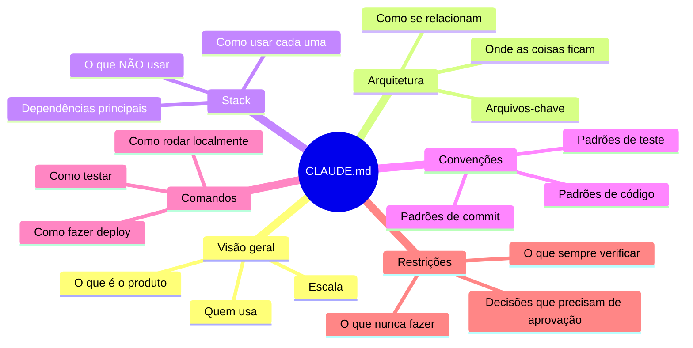

# CLAUDE.md — anatomia e o que colocar em cada seção

> [!abstract] TL;DR
> CLAUDE.md é o documento de onboarding do agente para o seu projeto — equivalente ao que você explicaria para um dev sênior que acabou de entrar no time. Tem estrutura recomendada em 6 seções: visão geral, arquitetura, stack, convenções, comandos e o que evitar. A regra de ouro: se você precisaria explicar para um novo dev, coloque no CLAUDE.md.

---

## A analogia: o briefing do tech lead

Imagine que você está contratando um dev sênior de outra empresa — extremamente competente, mas com zero conhecimento do seu projeto. O primeiro dia dele no time, você sentaria com ele por 30 minutos e explicaria: o que o produto faz, onde as coisas ficam, qual é a stack, quais são as convenções do time, o que já tentamos e não funcionou, o que nunca deve ser feito.

Esse briefing é o CLAUDE.md.

A diferença é que o dev sênior lembra da conversa. O agente não tem memória entre sessões — cada sessão começa do zero. O CLAUDE.md é esse briefing escrito, lido no início de cada sessão, para que o agente comece já contextualizado.

Quanto melhor o briefing, menos tempo o agente gasta descobrindo o que você poderia ter contado.

> [!tip] Assista: Claude Code best practices (Code w/ Claude)
> **Canal:** Anthropic | **Duração:** ~26min | **Idioma:** EN
>
> Talk oficial da Anthropic (Cal Rueb) onde o CLAUDE.md aparece como a primeira best practice, explicado com a mesma ideia-chave desta nota: o agente não tem memória entre sessões, e o CLAUDE.md é o mecanismo de compartilhar estado — com o time e com você mesmo — ao longo do tempo. Trecho de destaque [10:34]: *"[Claude Code] doesn't really have memory. And so the main way we share state across sessions [...] is this CLAUDE.md file. [...] It's just plopped into context [...] these are important instructions the developer left for you."*
>
> 🎬 [Assistir no YouTube](https://www.youtube.com/watch?v=gv0WHhKelSE)

---

## A estrutura recomendada em 6 seções



---

### Seção 1: Visão geral do projeto

O que o projeto faz em 2-3 frases. O agente usa isso para calibrar o contexto de todas as decisões subsequentes.

**Template:**
```markdown
## Projeto

[Nome do projeto] é [o que é] para [quem usa]. 
[Escala ou contexto relevante].
[Característica arquitetural principal].
```

**Exemplo — API B2B:**
```markdown
## Projeto

API REST de gestão de pedidos para e-commerce B2B. Serve ~50 clientes corporativos
com contratos mensais. Multi-tenant: cada cliente tem schema separado no PostgreSQL.
SLA: 99.9% de uptime. Domínio crítico — erros de pedido têm impacto financeiro direto.
```

**Exemplo — CLI tool:**
```markdown
## Projeto

ferramenta CLI de migração de dados legados para novo schema. Processa arquivos CSV
de até 10GB. Uso interno — engenheiros de dados. Idempotência é requisito crítico:
rodar duas vezes não pode duplicar dados.
```

**Por que importa:** o agente usa o contexto de negócio para decidir o nível de conservadorismo adequado. "SLA: 99.9%, domínio financeiro" instrui implicitamente "seja mais cuidadoso aqui".

---

### Seção 2: Arquitetura

Onde as coisas importantes ficam e como se relacionam. Não precisa ser exaustivo — o suficiente para o agente navegar sem exploração desnecessária.

**Template:**
```markdown
## Arquitetura

- `[pasta]/` — [o que fica aqui] [relação com outras pastas]
- `[pasta]/` — [o que fica aqui]
[...]

[Fluxo principal ou invariante importante]
```

**Exemplo:**
```markdown
## Arquitetura

- `src/api/` — rotas Express (um arquivo por domínio: orders.ts, users.ts, products.ts)
- `src/services/` — lógica de negócio (injetada nas rotas via construtor, não importada diretamente)
- `src/db/queries/` — toda SQL fica aqui (nunca inline nos services)
- `src/middleware/` — auth JWT, rate limiting, request logging
- `tests/` — jest + supertest; espelha src/ (tests/services/ para src/services/)

Fluxo: rota → service → query. Services não importam outros services diretamente.
```

---

### Seção 3: Stack e dependências

O que está instalado e como usar corretamente. Evita que o agente instale uma lib que já existe ou use a errada.

**Template:**
```markdown
## Stack

- [runtime/linguagem] — [versão]
- [framework] — [versão, como usar]
- [lib de infra] — [qual usar e onde está]
- Logger: [como logar — NUNCA X, USE Y]
- [outras libs críticas]
```

**Exemplo:**
```markdown
## Stack

- Node 20, TypeScript 5, Express 4
- PostgreSQL 15 com node-postgres (pg) — sem ORM
- Redis 7 para cache e sessão (ioredis) — cliente em `src/db/redis.ts`
- Jest + supertest para testes de integração
- Logger: winston em `src/utils/logger.ts` — use `logger.info/warn/error`, NUNCA `console.*`
- Validação: zod — schema em `src/validators/[domínio].ts`
- Não temos: ORM, GraphQL, WebSockets
```

---

### Seção 4: Convenções de código

O que o time decidiu que não está explícito no código. Sem isso, o agente adivinha — e frequentemente erra.

**Template:**
```markdown
## Convenções

[erro/exception handling]
[padrão de queries]
[nomenclatura]
[cobertura de testes]
[commits]
```

**Exemplo detalhado:**
```markdown
## Convenções

### Tratamento de erros
- Erros de negócio: `AppError` de `src/errors/AppError.ts` (nunca `throw new Error()`)
- Erros de infraestrutura: logar com `logger.error` e relançar
- `AppError` aceita: código string (ex: `USER_NOT_FOUND`), status HTTP, mensagem user-friendly

### Queries SQL
- Toda SQL em `src/db/queries/[domínio].ts`, nunca inline nos services
- Use placeholders parametrizados — nunca interpolação de string em SQL
- Transações: use `db.transaction()` de `src/db/client.ts`

### Nomes
- Arquivos: kebab-case (`order-service.ts`)
- Classes: PascalCase (`OrderService`)
- Constantes: SCREAMING_SNAKE_CASE

### Testes
- Um arquivo de teste por service em `tests/services/`
- Cobertura mínima: happy path + caso de erro mais comum
- Não mocke o banco — use o banco de teste (`process.env.NODE_ENV=test`)

### Commits
- conventional commits: `feat:`, `fix:`, `refactor:`, `test:`, `docs:`
- Mensagens em português
```

---

### Seção 5: Comandos de desenvolvimento

Os comandos que o agente vai precisar rodar. Com eles documentados, o agente não precisa explorar o `package.json` toda vez.

**Template:**
```markdown
## Comandos

- `[comando]` — [o que faz]
- `[comando --flag]` — [variante comum]
```

**Exemplo:**
```markdown
## Comandos

- `npm test` — rodar toda a suite (requer Postgres + Redis rodando)
- `npm test -- --testPathPattern=orders` — rodar testes de um módulo
- `npm run lint` — ESLint (falha = CI falha)
- `npm run type-check` — TypeScript sem emit
- `npm run build` — compilar para dist/
- `npm run db:migrate` — rodar migrations pendentes
- `npm run db:migrate:create -- --name add-user-role` — criar nova migration
- `docker-compose up -d` — iniciar Postgres + Redis localmente
- `docker-compose down -v` — parar e limpar volumes (use com cuidado — apaga dados locais)
```

---

### Seção 6: Restrições e o que evitar

Guardrails em linguagem natural — o que o agente não deve fazer, mesmo que tecnicamente possível. Esta seção previne os erros mais frustrantes.

**Template:**
```markdown
## Restrições

- Nunca [ação irreversível] — [por quê]
- Não [padrão proibido] — use [alternativa] em [onde]
- Sempre pergunte antes de [ação com impacto alto]
```

**Exemplo:**
```markdown
## Restrições

- Nunca use `any` em TypeScript — use `unknown` e type guards
- Não modifique arquivos em `src/db/migrations/` — use `npm run db:migrate:create`
- Não instale novas dependências sem perguntar — avaliar impacto no bundle e licença
- Não faça `git push` diretamente — sempre via PR
- Nunca hardcode credenciais — use variáveis de ambiente de `.env` (template em `.env.example`)
- Não use `console.log` — use o logger
- Não altere o schema do banco sem migration — mudanças diretas são perdidas no próximo deploy
```

---

## CLAUDE.md ruim vs. CLAUDE.md bom — comparação

A diferença entre um CLAUDE.md eficaz e um que polui o contexto não está no tamanho — está na densidade de informação por linha e na presença de instruções não-óbvias.

**Exemplo: CLAUDE.md que não ajuda**
```markdown
# Projeto

Este projeto usa JavaScript. Temos arquivos .js e .ts. 
O projeto tem um frontend e um backend.
Usamos npm para instalar dependências.
O código está em src/.
```

Esse CLAUDE.md não diz nada que o agente não descobriria lendo o código. Ocupa contexto sem retorno.

**O mesmo projeto com CLAUDE.md útil:**
```markdown
# Projeto

API de pagamentos para marketplace B2C (~2M transações/mês).
Domínio crítico: falhas de pagamento têm impacto financeiro direto e regulatório (PCI-DSS).

## Stack
- Node 20 + TypeScript 5; **sem ORM** — toda SQL em `src/db/queries/`
- Logger: pino em `src/utils/logger.ts` — **nunca `console.*`** (correlação de traces quebrará)
- Stripe SDK v5 — wrapper em `src/payments/stripe-client.ts` (não use o SDK diretamente)

## Convenções críticas
- Toda mutação de saldo: use `src/payments/ledger.ts` (auditoria automática)
- Erros: `PaymentError` ou `AppError` — nunca `new Error()` raw
- Nunca commite nada com credenciais, mesmo em testes

## Restrições absolutas
- **Nunca** envie dados de cartão para logs (PCI-DSS)
- **Nunca** faça rollback de transação Stripe sem consultar o arquivo `docs/rollback-policy.md`
- Pergunte antes de alterar `src/db/migrations/`
```

A segunda versão informa sobre domínio, escala, decisões arquiteturais não-óbvias, restrições com impacto regulatório, e patterns que o agente não descobriria lendo o código em 5 minutos.

---

## O que NÃO colocar no CLAUDE.md

**Documentação técnica detalhada.** O agente lê o código. Não precisa de explicação linha a linha — precisa saber onde olhar.

**Listas exaustivas de todos os arquivos.** Mencione só os arquivos-chave. Para o resto, o agente navega com Glob e Grep.

**Instruções que já estão no código.** Se o código fala por si (tipos bem definidos, nomenclatura clara, padrões consistentes), não repita em prosa.

**Conteúdo que muda frequentemente.** O CLAUDE.md deve ser estável. Se muda toda semana, vai estar desatualizado na metade das sessões.

**Estado temporário de tarefas.** "Estamos migrando de MongoDB para PostgreSQL esta semana" pertence ao contexto da sessão, não ao CLAUDE.md permanente.

---

## Tamanho ideal e densidade

**Menos é mais.** Um CLAUDE.md de 80-120 linhas bem escritas é melhor que 500 linhas com ruído. O agente lê tudo — contexto desnecessário polui o útil.

Benchmarks orientadores:
- **Muito curto (<30 linhas):** provavelmente falta contexto crítico
- **Ideal (60-150 linhas):** denso em informação por linha
- **Longo (150-300 linhas):** ok para projetos complexos, mas revise por repetições
- **Muito longo (>300 linhas):** considere dividir em CLAUDE.md por subdiretório

---

## CLAUDE.md como documento vivo

O CLAUDE.md deve evoluir com o projeto. Bons momentos para atualizar:

- Quando uma nova lib é adotada
- Quando uma convenção muda
- Quando o agente toma uma decisão errada por falta de contexto — esse é o sinal mais claro
- Após a revisão trimestral do harness

---

## Checklist — CLAUDE.md bem escrito

- [ ] Visão geral em 2-3 frases comunica o domínio e a escala
- [ ] Arquitetura mapeia onde as coisas ficam sem ser exaustiva
- [ ] Stack inclui versões e "use X, NUNCA Y" para decisões críticas
- [ ] Convenções cobrem o que não está óbvio no código
- [ ] Comandos cobrem o ciclo básico: rodar, testar, buildar
- [ ] Restrições incluem o "por quê" — regras sem contexto são frágeis
- [ ] O arquivo tem menos de 150 linhas (ou está dividido em subdiretórios)
- [ ] Foi revisado na última migração de stack relevante

---

## Casos práticos

> [!question]- Isso acontece de verdade, ou é teoria?
> Acontece — e o padrão se repete: o CLAUDE.md fala genérico ou desatualizado, e o agente toma a decisão mais "razoável" dentro do que sabe. Que quase sempre é a decisão errada pro seu contexto específico.

**Caso 1 — CLAUDE.md genérico, decisão errada por falta de contexto de domínio**

Um time mantém uma API de agendamento médico. O CLAUDE.md diz só "API REST em Node/Express, PostgreSQL" — nada sobre o domínio.

Pedido: "adicionar endpoint para cancelar consulta". O agente implementa um `DELETE` simples que apaga a linha da tabela `appointments`. Passa nos testes. Mas o domínio exige soft-delete com auditoria — cancelamento de consulta médica precisa ficar rastreável por anos, por exigência regulatória de retenção de prontuário. O agente não tinha como adivinhar: nada no CLAUDE.md dizia "consulta cancelada nunca é apagada, sempre soft-delete com `cancelled_at` + motivo".

O bug só aparece na auditoria trimestral, quando não há rastro de nenhuma consulta cancelada nos últimos três meses.

**Caso 2 — CLAUDE.md desatualizado, comando/lib obsoleta**

Um projeto migrou de Yarn para pnpm seis meses atrás, e de Jest para Vitest há dois. O CLAUDE.md nunca foi atualizado: ainda cita `yarn test` na seção de Comandos e `jest.mock()` como padrão de mock nas Convenções.

O agente segue o documento ao pé da letra — roda `yarn test` (que falha silenciosamente, porque o lockfile de Yarn não existe mais) e escreve um teste novo usando `jest.mock()`, que não existe no Vitest. Tempo perdido depurando um erro causado diretamente pelo CLAUDE.md: o real seria `pnpm test` e `vi.mock()`.

> [!summary]
> Os dois casos têm a mesma raiz: o CLAUDE.md parou de refletir a realidade do projeto — seja porque nunca teve o contexto de domínio, seja porque o projeto mudou e o documento não acompanhou.

---

## Armadilhas comuns

> [!warning] CLAUDE.md viciado em detalhe de implementação
> Descrever linha a linha como uma função funciona é documentação que expira no primeiro refactor. O agente já lê o código — o que ele não descobre sozinho é o "por quê" por trás da decisão. Prefira "usamos fila em vez de webhook porque o provedor de pagamento não garante entrega única" a explicar como a fila está implementada.

> [!warning] CLAUDE.md nunca revisado após mudança de stack
> Trocou de ORM, de test runner, de gerenciador de pacotes? Se o CLAUDE.md não mudou junto, ele vira fonte de instruções erradas — pior que não ter CLAUDE.md nenhum, porque o agente confia nele por padrão. Trate mudança de stack como gatilho automático de revisão (ver "documento vivo" acima).

> [!warning] Seção de Restrições sem o "por quê"
> "Nunca faça X" sem explicação é uma regra frágil: será quebrada assim que parecer conveniente, porque ninguém entende o custo de quebrar. "Nunca faça rollback de transação Stripe sem consultar `docs/rollback-policy.md`" fica mais forte com o motivo anexado — "rollback parcial deixa o saldo do lojista inconsistente com o extrato do gateway".

> [!warning] CLAUDE.md tratado como changelog
> Anotar "estamos migrando de Mongo pra Postgres essa semana" no CLAUDE.md permanente é o mesmo erro do Caso 2, só que ao contrário: em vez de ficar pra trás, o documento aponta pra um estado transitório que já não existe na sessão seguinte. Estado de tarefa em andamento é contexto de sessão, não de projeto.

---

## Como explicar em inglês

| Português | Inglês |
|-----------|--------|
| Documento de onboarding | Onboarding document |
| Visão geral | Project overview |
| Convenções de código | Code conventions / coding standards |
| Guardrails em linguagem natural | Natural language guardrails |
| Arquivo vivo | Living document |
| Seção de restrições | Constraints / restrictions section |

**Frases úteis:**
- "CLAUDE.md is the agent's onboarding briefing — what you'd tell a senior dev on their first day."
- "The restrictions section is where you put guardrails in natural language: 'never push to main directly', 'always use AppError, not raw Error'."
- "CLAUDE.md should be stable and dense — if it changes weekly, it'll be outdated half the time the agent reads it."

---

## O que vem a seguir

Até aqui você viu a anatomia: que seções existem, o que cada uma carrega, e como reconhecer quando o documento parou de ajudar. A pergunta natural agora é prática — "certo, mas o que eu efetivamente escrevo pro MEU projeto, que é uma API Rails, ou um monorepo com três frontends, ou um script de dados em Python?"

É exatamente aí que entra [[03-Dominios/Tecnologia/IA/Claude Code/Configuração/03 - CLAUDE.md receitas|03 - CLAUDE.md receitas]]: templates prontos por stack, já com as decisões de "o que incluir" tomadas para os casos mais comuns — API backend, frontend SPA, monorepo, CLI, projeto de dados. Em vez de montar a estrutura do zero seção por seção, você parte de um esqueleto testado e ajusta o que for específico do seu domínio.

---

## Veja também

- [[03-Dominios/Tecnologia/IA/Claude Code/Configuração/01 - Hierarquia de configuração|01 - Hierarquia de configuração]] — onde o CLAUDE.md se encaixa na hierarquia
- [[03-Dominios/Tecnologia/IA/Claude Code/Configuração/03 - CLAUDE.md receitas|03 - CLAUDE.md receitas]] — templates por stack
- [[03-Dominios/Tecnologia/IA/Claude Code/Mental Model/08 - Como o agente decide|08 - Como o agente decide]] — como CLAUDE.md influencia cada decisão
- [[03-Dominios/Tecnologia/IA/Claude Code/Configuração/index|Configuração]] — índice do galho

---

## Referências

- **Anthropic** — *Claude Code memory and CLAUDE.md* (2026). Estrutura recomendada e boas práticas — https://docs.anthropic.com/pt/docs/claude-code/memory
- **Anthropic** — *Claude Code for large codebases* (2026). CLAUDE.md hierárquico em projetos grandes — https://www.anthropic.com/engineering/claude-code-best-practices
- **Anthropic** — *Claude Code best practices* (2026). Princípios de onboarding para agentes — https://www.anthropic.com/engineering/claude-code-best-practices#writing-effective-claude-md-files
- **Greg Brockman (OpenAI)** — analogia do "senior engineer onboarding document" em entrevistas sobre workflow de agentes (2024); o padrão se aplica a qualquer LLM com memória externa.


